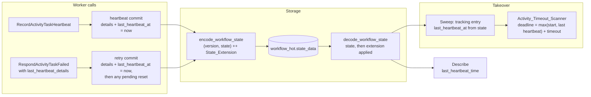

# Design Document: Activity Heartbeat Time

## Overview

Each activity's kernel state gains a last heartbeat time. The field is skipped by serde, so `WorkflowState`'s positional layout does not change. The storage codec carries the time in a State_Extension that it appends after the state in `workflow_hot.state_data`. The in-memory snapshot carries the same extension bytes after its document.

The runtime sets the time in the commit that stores the heartbeat details: on every heartbeat, and on a failure that carries heartbeat details. A heartbeat reset clears it together with the details. The heartbeat deadline becomes the later of the attempt's start and the stored time, plus the heartbeat timeout. The sweep restores the time into activity tracking, and Describe reports it.

Behaviour follows Temporal v1.31.0: `UpdateActivityProgress` (`service/history/workflow/mutable_state_impl.go:1956-1966`), the deadline (`timer_sequence.go:341-351`), the clears (`workflow/activity.go:86-90, 361-365, 401-404`) and Describe (`workflow/activity.go:147-150`). The byte format is Tokeira's own. It builds on continue-as-new-advice Requirement 10's envelope.

## Dependencies and Non-Goals

- **Builds on** continue-as-new-advice (the hot-state envelope), recovery-index (activity entries come from the run's state) and runtime-sweeper-recovery (the Sweep and activity tracking).
- **Amends:**
  - runtime-sweeper-recovery Requirement 8.6 and its design note: the rebuilt entry takes the stored time.
  - inmemory-store-snapshots Requirement 2.3: bytes after the document must be a well-formed Snapshot_Extension.
  - continue-as-new-advice Requirement 10: new criterion 10.8 names the State_Extension as the compatible way to add stored data.
- **Non-goals:**
  - blob-size limits on heartbeat details;
  - standalone activities;
  - the `activity_state` side-table blob;
  - history batch blobs;
  - removing the volatile heartbeat time from activity tracking.

## Architecture



### Byte layout

```text
workflow_hot.state_data
  varint WORKFLOW_STATE_ENVELOPE_VERSION ("TKWS")    unchanged
  WorkflowState, positional postcard                 unchanged; the time is #[serde(skip)]
  [ State_Extension ]                                absent when no section has data
      varint WORKFLOW_STATE_EXTENSION_MAGIC ("TKWX")
      Vec<ExtensionSection { tag: u32, payload: Vec<u8> }>    ascending tags, each once
        tag 1, Heartbeat_Section: Vec<ActivityHeartbeat { activity_id, last_heartbeat_at }>
                                  in activity-id order, one entry per activity with a time

in-memory snapshot
  varint SNAPSHOT_FORMAT_VERSION (4)                 unchanged
  SnapshotDoc, positional postcard                   unchanged
  [ Snapshot_Extension ]                             absent when no run has a State_Extension
      varint SNAPSHOT_EXTENSION_MAGIC ("TKSX")
      Vec<ExtensionSection>
        tag 1: Vec<(RunKey, Vec<u8>)>, each run's State_Extension bytes, in run-key order
```

A Pre-Extension_Reader decodes the state with `postcard::from_bytes` and never looks at the bytes after it. This feature's reader decodes the state with `postcard::take_from_bytes`, then applies whatever remains as a State_Extension.

## Components and Interfaces

### Kernel (`crates/tokeira-kernel`)

`ActivityState` (`src/state.rs`) gains:

```rust
/// When this activity's progress was last recorded (`LastHeartbeatUpdateTime`
/// @ v1.31.0). The runtime sets it on each heartbeat and on a failure that
/// carries heartbeat details; a heartbeat reset clears it with the details.
///
/// Not part of the positional layout: the storage codec persists it in the
/// state extension's heartbeat section (activity-heartbeat-time).
#[serde(skip)]
pub last_heartbeat_at: Option<OffsetDateTime>,
```

The kernel never sets it. New activities start with `None`. The two kernel Heartbeat_Reset sites clear it next to `heartbeat_details` (`src/kernel.rs:1330-1332, 1413-1417`).

### Storage codec (`crates/tokeira-storage/src/codec.rs`)

```rust
/// Magic that opens the extension after a hot-state blob's state (`"TKWX"`).
pub const WORKFLOW_STATE_EXTENSION_MAGIC: u32 = 0x544B_5758;

/// State-extension tag of the Heartbeat_Section.
pub const ACTIVITY_HEARTBEAT_SECTION: u32 = 1;

/// One tagged section of an extension; the payload layout is fixed per tag.
#[derive(Serialize, Deserialize)]
pub(crate) struct ExtensionSection {
    pub tag: u32,
    pub payload: Vec<u8>,
}

/// One Heartbeat_Section entry.
#[derive(Serialize, Deserialize)]
struct ActivityHeartbeat {
    activity_id: String,
    last_heartbeat_at: OffsetDateTime,
}

/// The State_Extension bytes for `state`; empty when no section has data.
pub(crate) fn encode_state_extension(state: &WorkflowState) -> Result<Vec<u8>>;

/// Apply State_Extension bytes to a state decoded from the same blob or run.
/// Returns the defect when the extension is malformed; the caller names the
/// blob and run in the error it raises.
pub(crate) fn apply_state_extension(
    state: &mut WorkflowState,
    bytes: &[u8],
) -> std::result::Result<(), &'static str>;

/// A State_Extension whose framing is malformed.
#[derive(Clone, Debug, PartialEq, Eq, thiserror::Error)]
#[error("{kind} blob for run {} has a malformed extension: {defect}", run_key.0)]
pub struct StateExtensionError {
    pub kind: &'static str,
    pub run_key: RunKey,
    pub defect: &'static str,
}
```

- `encode_workflow_state` returns `encode_enveloped(WORKFLOW_STATE_ENVELOPE_VERSION, state)` followed by `encode_state_extension(state)`.
- `decode_workflow_state` checks the version as today. It then decodes the state with `take_from_bytes` and, when bytes remain, calls `apply_state_extension`.
- `apply_state_extension` reads the magic, then the section sequence, and requires both to consume the bytes exactly. Each defect becomes one `StateExtensionError` with a fixed `defect` text:
  - wrong magic;
  - undecodable sections;
  - bytes after the sections;
  - repeated tag;
  - undecodable heartbeat section;
  - activity listed twice.
- `apply_state_extension` sets `last_heartbeat_at` for each listed activity the state holds, skips ids it does not hold, and ignores unknown tags.

`history_batch` blobs and `history_batch_encoded_len` do not change. `dsql/codec.rs` re-exports the new names next to the envelope functions. `encode_activity_state` keeps writing the side-table blob without the time, because the field is skipped.

### Snapshot (`crates/tokeira-storage/src/memory.rs`)

```rust
/// Magic that opens the extension after a snapshot's document (`"TKSX"`).
pub const SNAPSHOT_EXTENSION_MAGIC: u32 = 0x544B_5358;

/// Snapshot-extension tag of the section listing each run's State_Extension bytes.
pub const RUN_STATE_EXTENSION_SECTION: u32 = 1;
```

- `snapshot()` writes the version and document as today. It then computes `encode_state_extension` for each run in run-key order. When any result is non-empty, it appends the Snapshot_Extension with one section listing those runs.
- `from_snapshot()` keeps its version check and document decode. Any bytes after the document are parsed as a Snapshot_Extension. Each listed run's bytes are applied to that run's restored state with `apply_state_extension`.
- A malformed extension, an unknown run or a run listed twice is a new `SnapshotError::Extension(&'static str)`. Bytes after the document that do not open with the snapshot extension magic stay `SnapshotError::TrailingBytes`, as before.
- `SNAPSHOT_FORMAT_VERSION` stays 4. The bump rule's doc comment gains a sentence: data carried in the Snapshot_Extension does not change the document and needs no bump.

The in-memory `runs` map holds `WorkflowState` values, so committed times are returned as written. The `activity_state_table` mirror carries the time in memory. Its snapshot encoding drops the time, and nothing reads that table back.

### Runtime (`crates/tokeira-runtime`)

- **Heartbeat commit** (`runtime/activity.rs`, `record_activity_heartbeat`): read `let now = OffsetDateTime::now_utc()` once per OCC attempt and set `next_activity.last_heartbeat_at = Some(now)` next to the details. After an applied or duplicate commit, pass the same `now` to `activity_tracking.record_heartbeat`.
- **Failure with details:**
  - `fail_activity_task` gains `last_heartbeat_details: Option<Payloads>` and passes it to `retry_activity_task`.
  - `commit_activity_retry` gains `progress: Option<Payloads>`. When it is `Some`, the commit stores the details and sets `last_heartbeat_at = Some(completed_at)` before the `reset_heartbeats` check.
  - The timeout scanner's retry passes `None`.
  - A terminal failure resolves the activity, which removes it, so it records nothing.
- **Retry reset:** the `reset_heartbeats` branch clears `last_heartbeat_at` with `heartbeat_details` (`runtime/activity.rs:1432-1434`).
- **Deadline** (`activity_timeout.rs`, `evaluate_activity_timeout`):

  ```rust
  let heartbeat_at = entry.last_heartbeat_at.map_or(started_at, |at| at.max(started_at));
  ```

  On the owning node the tracking time is the current attempt's latest heartbeat, at or after its start, so the result is unchanged there. After a takeover, the restored time may come from an earlier attempt. The `max` then falls back to the attempt's start, which is v1.31.0's rule.
- **Sweep** (`recovery.rs`): `ActivitySweepEntry` (`crates/tokeira-storage/src/api.rs:1513`) gains `last_heartbeat_at: Option<OffsetDateTime>`, filled by `recovery_entries` from the activity. The tracking insert uses it instead of `None`.
- **Reset successor** (`lane.rs:758-770`): the tracking entry takes `activity.last_heartbeat_at`. A successor's activities are replayed fresh, so this is `None` in practice; it stops being a hard-coded value.

### Edge and engine

- `translate::RespondActivityTaskFailedRequest` (`crates/tokeira-edge/src/translate/mod.rs:795`) gains `last_heartbeat_details: Option<Payloads>`. `respond_activity_failed_to_edge` maps it from the proto.
- `WorkflowRuntimeApi::fail_activity_task` (`crates/tokeira-edge/src/workflow_service.rs:810`) gains the parameter, as do its implementation in `grpc/runtime_adapter.rs` and the test doubles.
  - `respond_activity_task_failed` passes the request's details.
  - `respond_activity_task_failed_by_id` passes `None`, as v1.31.0's frontend drops them (`frontend/workflow_handler.go:1965-1969`).
- `PendingActivityDescription` gains `last_heartbeat_at: Option<OffsetDateTime>`. `pending_activity_to_proto` sets `last_heartbeat_time: act.last_heartbeat_at.map(to_proto_timestamp)`.
- The engine's Describe builder (`crates/tokeira-engine/src/lib.rs`, next to `heartbeat_details` at `:4721`) copies `activity.last_heartbeat_at`.

## Data Models

| Item | Type | Written by | Meaning |
|---|---|---|---|
| `ActivityState.last_heartbeat_at` | `Option<OffsetDateTime>`, `#[serde(skip)]` | runtime heartbeat and retry commits; cleared by Heartbeat_Resets | Last_Heartbeat_Time |
| State_Extension | bytes after the state in `workflow_hot.state_data` | `encode_workflow_state` | magic `0x544B_5758`, then tagged sections |
| Heartbeat_Section | tag `1`, `Vec<ActivityHeartbeat>` | `encode_state_extension` | each activity's time, in activity-id order |
| Snapshot_Extension | bytes after `SnapshotDoc` | `InMemoryStore::snapshot` | magic `0x544B_5358`, then tagged sections; tag `1` lists each run's State_Extension |
| `ActivitySweepEntry.last_heartbeat_at` | `Option<OffsetDateTime>` | `recovery_entries` | the time the Sweep restores |
| `PendingActivityDescription.last_heartbeat_at` | `Option<OffsetDateTime>` | engine Describe | source of `last_heartbeat_time` |

No schema migration. The `activity_state` blob and the history batch blob keep their layouts.

## Correctness Properties

### Property 1: Hot-state blobs round-trip with their times

*For any* `WorkflowState` whose activities carry any combination of Last_Heartbeat_Times, `decode_workflow_state(encode_workflow_state(s))` SHALL equal `s`, times included.

**Validates: Requirements 1.1, 1.2, 1.6, 3.2, 3.3**

### Property 2: Without times, the bytes are unchanged

*For any* `WorkflowState` with no Last_Heartbeat_Time, `encode_workflow_state(s)` SHALL equal the postcard encoding of `(WORKFLOW_STATE_ENVELOPE_VERSION, s)`, which is what Tokeira 0.2.0–0.5.1 write. Decoding those bytes SHALL return `s` with no times.

**Validates: Requirements 1.4, 2.1, 2.2**

### Property 3: Pre-extension readers see the state

*For any* `WorkflowState` `s`, the Pre-Extension_Reader's decode of `encode_workflow_state(s)` SHALL return `s` with every Last_Heartbeat_Time cleared. That decode checks the version, then runs `postcard::from_bytes::<WorkflowState>` on the rest. The test copies it from the 0.5.1 codec.

**Validates: Requirement 2.3**

### Property 4: Malformed extensions are rejected

*For any* `WorkflowState` `s` and *for any* suffix `b` that is not a well-formed State_Extension, decoding the 0.5.1 encoding of `s` followed by `b` SHALL return a `StateExtensionError` and no state. The generated suffixes cover:
- a wrong magic;
- a truncated or undecodable section sequence;
- bytes after the sequence;
- a repeated tag;
- an undecodable or over-long Heartbeat_Section;
- an activity listed twice.

**Validates: Requirements 1.7, 3.5**

### Property 5: Unknown sections and unknown activities are ignored

*For any* `WorkflowState` `s`, the decode SHALL return the same state as decoding `encode_workflow_state(s)` after either change:
- sections with tags other than `ACTIVITY_HEARTBEAT_SECTION` are inserted into its extension;
- Heartbeat_Section entries are added for activity ids that `s` does not hold.

**Validates: Requirements 1.8, 3.4**

### Property 6: The heartbeat deadline is v1.31.0's

*For any* attempt start `S`, optional Last_Heartbeat_Time `H` (before or after `S`), heartbeat timeout `T > 0` and time `now`, with no schedule-to-close timeout, `evaluate_activity_timeout` SHALL report a heartbeat timeout exactly when `now - max(S, H) > T`.

**Validates: Requirements 5.1, 5.2**

### Property 7: The time follows progress records and resets

*For any* sequence of operations on one activity, after each step the activity's durable Last_Heartbeat_Time SHALL equal the commit time of the latest Progress_Record that no later Heartbeat_Reset has cleared. When there is no such record, the time SHALL be absent. The operations are:
- heartbeats;
- failures, with or without heartbeat details, that retry;
- attempt starts;
- Heartbeat_Resets.

**Validates: Requirements 4.1, 4.3, 4.5, 4.6, 4.7**

### Property 8: The Sweep restores the time

*For any* shard whose open runs hold activities with any combination of Last_Heartbeat_Times, every activity tracking entry the Sweep inserts SHALL carry the activity's Last_Heartbeat_Time.

**Validates: Requirement 5.3**

### Property 9: Snapshots carry the times and stay compatible

*For any* in-memory store contents whose activities carry any combination of Last_Heartbeat_Times:
- `from_snapshot(snapshot())` SHALL hold the same times;
- re-snapshotting the restored store SHALL produce the same bytes;
- when no activity has a time, the snapshot SHALL be the version-4 document with nothing after it.

**Validates: Requirements 7.1, 7.2, 7.3, 7.4, 7.5**

### Property 10: Malformed snapshot extensions are rejected

*For any* snapshot and *for any* suffix that is not a well-formed Snapshot_Extension, restore SHALL fail and construct no store: with `SnapshotError::TrailingBytes` when the suffix does not open with the snapshot extension magic, as before, and with `SnapshotError::Extension` otherwise. The generated suffixes cover:
- a wrong magic;
- undecodable sections;
- bytes after them;
- a run the document does not hold;
- a run listed twice.

Unknown tags SHALL be ignored.

**Validates: Requirements 7.6, 7.7**

## Error Handling

| Condition | Internal error | External behaviour |
|---|---|---|
| Hot-state blob with a malformed State_Extension | `StateExtensionError` (storage) | `INTERNAL` on the RPC that loaded the run; the Sweep fails, as for `BlobFormatError` |
| Snapshot with a malformed Snapshot_Extension | `SnapshotError::Extension`, or `SnapshotError::TrailingBytes` when the bytes do not open with the magic | Engine startup fails with the restore error, as for any undecodable snapshot |
| Heartbeat_Section entry for an activity the state does not hold | None, skipped | None |
| Unknown extension tag | None, ignored | None |
| A 0.2.0–0.5.1 node reads a blob with a State_Extension | None; that node ignores the extension | The node does not see the times. When it rewrites the run, the times are lost |
| A 0.2.0–0.5.1 engine restores a snapshot with a Snapshot_Extension | `SnapshotError::TrailingBytes` in that release | That engine refuses to start |

## Testing Strategy

- **Property tests:**
  - Properties 1–5 over generated `WorkflowState`s and suffixes, in `crates/tokeira-storage/src/codec.rs`.
  - Properties 9 and 10 over generated store contents, in `memory.rs`.
  - Property 6 over generated instants, in `activity_timeout.rs`.
  - Property 7 over generated operation sequences against the runtime on the in-memory store, with a reference model of the expected time.
  - Property 8 extends the Sweep's activity-tracking reconstruction property (runtime-sweeper-recovery Property 9) to cover the time.
- **Unit tests:**
  - A frozen-layout fixture: a deterministic `WorkflowState` with every activity field set encodes to committed bytes (Requirement 1.11).
  - `encode_activity_state` gives the same bytes with and without a time (Requirement 3.6).
  - Each kernel Heartbeat_Reset clears the time.
  - The heartbeat commit's persisted time equals the tracking time (Requirement 4.2).
  - A by-id failure with details changes neither details nor time (Requirement 4.4).
  - The proto translation of the failure's details.
  - `pending_activity_to_proto` with and without a time (Requirements 6.1–6.3).
- **Integration:**
  - A runtime test heartbeats an activity past its heartbeat timeout measured from start, hands the shard to a fresh runtime over the same store, and checks that the first scan does not time out the activity.
  - A second test checks that a run with no heartbeat for longer than the timeout still times out after the takeover.
- **Not testable in this repository:** the Pre-Extension_Reader is exercised by a copy of its decode function, not by running a 0.5.1 binary.
