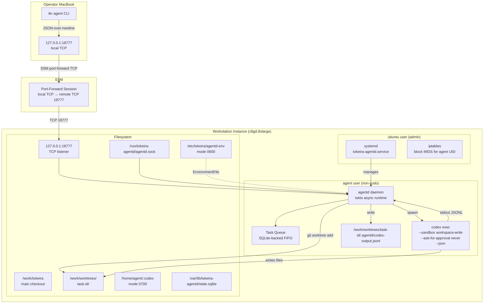
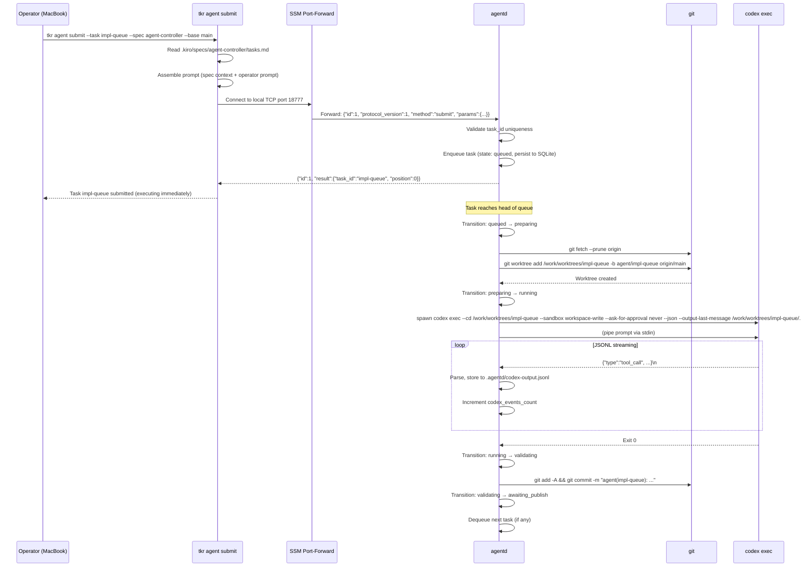
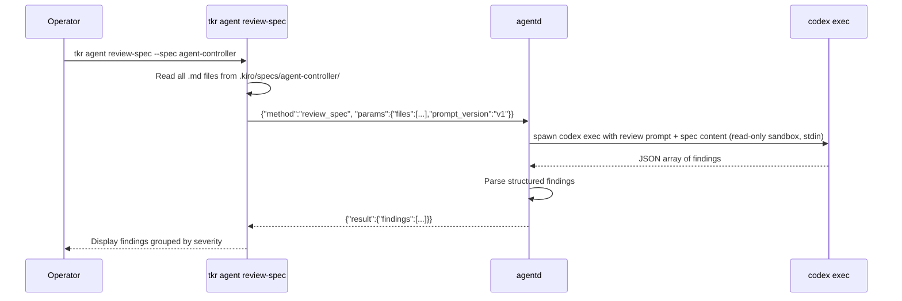
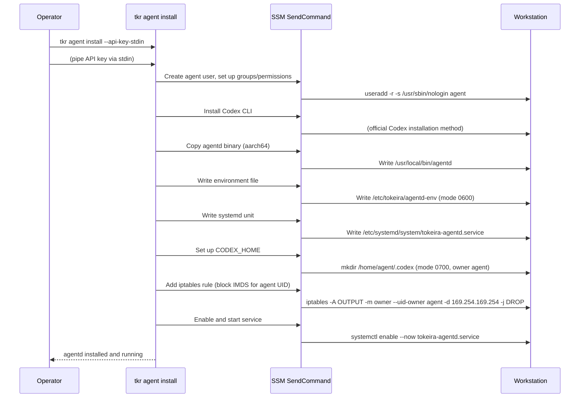
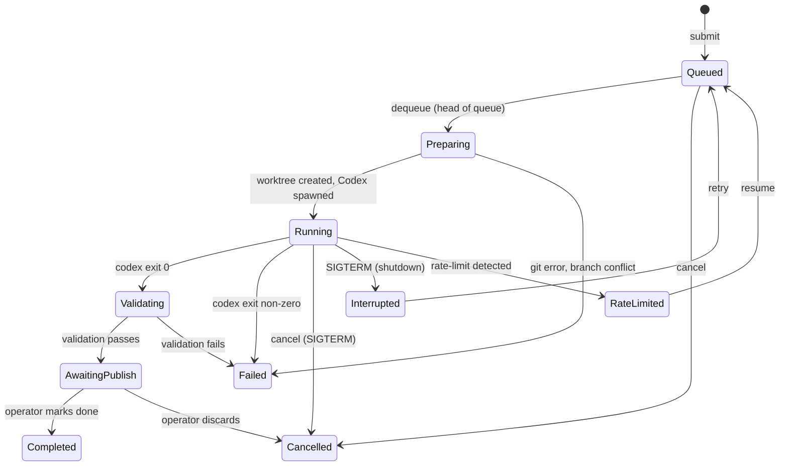
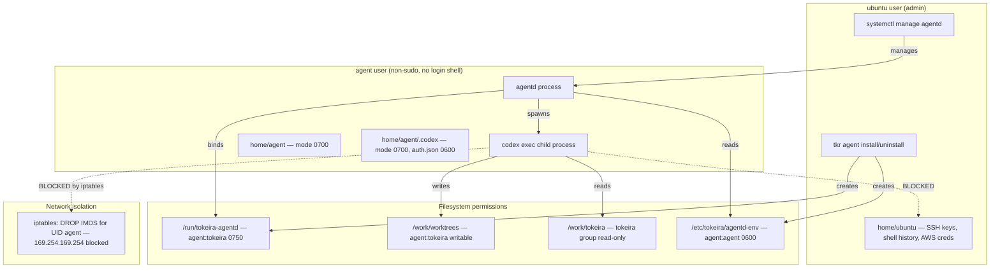

# Design Document: Agent Controller

## Overview

This design delivers the agent orchestration layer for Tokeira's remote workstation: an `agentd` Rust daemon that receives tasks over a Unix socket and TCP listener, manages git worktrees, spawns `codex exec` processes, and reports results — plus a `tkr agent` CLI command group that communicates with `agentd` via SSM TCP port-forwarding.

The system is shaped as a **policy-light, durable executor** with a serial FIFO queue. It persists task records but does not own scheduling policy beyond FIFO. Scheduling intelligence lives in the operator (v1) or a future Tokeira workflow (v2). This keeps `agentd` simple: accept task, create worktree, run Codex, report result, dequeue next.

### Design goals

1. **Operator control**: Every task is explicitly submitted; nothing runs autonomously. The operator reviews before integrating.
2. **Isolation**: Each task gets its own worktree and branch. A compromised Codex process cannot reach other tasks, the main checkout, or the operator's credentials.
3. **Debuggability**: JSON-over-newline protocol, full JSONL capture, structured review packs. Every decision Codex made is inspectable.
4. **Minimal surface**: One daemon, one protocol, one queue. SQLite for durable state, no distributed state, no external dependencies beyond Codex and git.

### Key constraints

- Rust Edition 2024, stable toolchain 1.95. `anyhow` in `agentd` (binary crate), `thiserror` in any shared library types.
- `tracing` for structured logging. No `println!`.
- `codex exec --cd <worktree> --sandbox workspace-write --ask-for-approval never --json --output-last-message <worktree>/.agentd/final.md -` (prompt via stdin) is the sole integration surface.
- Serial execution: one `codex exec` at a time. FIFO queue for additional submissions.
- Branch-per-task: `agent/<task-id>` naming. No force-push.
- Dedicated `agent` user (non-sudo) runs Codex. IMDS blocked for that UID.
- `CODEX_HOME` at `/home/agent/.codex`, mode 0700, excluded from all exports.

## CLI UX — `tkr agent`

The operator interacts with the agent controller entirely through `tkr agent` subcommands on their MacBook. Communication with `agentd` on the workstation happens transparently via SSM TCP port-forwarding.

### Command tree

```
tkr agent
├── install                          # Install agentd on the workstation
├── uninstall                        # Remove agentd from the workstation
├── submit <prompt> [--task <id>]    # Submit a task to the queue
│   [--branch <base>]               #   Base branch (default: main)
│   [--spec <path>]                  #   Attach spec file as context
├── status [--task <id>]             # Show queue state and task statuses
├── logs --task <id> [--follow]      # Stream Codex JSONL output for a task
├── diff --task <id> [--stat]        # Show git diff for a completed task
├── review-pack --task <id>          # Bundle diff + test results + event summary
├── review-spec <spec-path>          # Run Codex to review a spec document
├── usage                            # Show observed Codex rate-limit state
├── push --task <id>                 # Push the task branch to origin
├── pr --task <id> [--title <t>]     # Create a PR from the task branch
├── commit --task <id> [--amend]     # Commit uncommitted changes in the worktree
├── validate --task <id>             # Re-run validation on a completed task
├── doctor                           # Check agentd health, connectivity, Codex auth
└── codex-login                      # Store Codex API token on the workstation
```

### Typical workflow

```bash
# One-time setup
tkr workstation up
tkr agent install
tkr agent codex-login

# Submit work
tkr agent submit "Implement the retry logic for DSQL connections" --task impl-retry

# Monitor
tkr agent status
tkr agent logs --task impl-retry

# Review
tkr agent diff --task impl-retry
tkr agent review-pack --task impl-retry

# Integrate
tkr agent push --task impl-retry
tkr agent pr --task impl-retry --title "feat: DSQL connection retry"
```

### Connection model

All `tkr agent` commands establish an SSM TCP port-forward session to `127.0.0.1:18777` on the workstation. The session is created on-demand and reused within a single command invocation. The operator never manages port-forwarding manually.

```
MacBook                    AWS SSM                    Workstation
┌──────────┐              ┌─────────┐               ┌──────────────┐
│ tkr agent│──TCP 18777──▶│ SSM PF  │──TCP 18777──▶│ agentd       │
│ submit   │              │ session │               │ (listener)   │
└──────────┘              └─────────┘               └──────────────┘
```

### Output conventions

- `--json` flag on all commands for machine-readable output.
- Human output is terse: one line per task in `status`, streaming lines in `logs`.
- Errors include actionable remediation hints (e.g., "Is the workstation running? Try `tkr workstation up`").
- Exit codes: 0 = success, 1 = command error, 2 = connectivity error, 3 = task failure.

## Architecture



### Sequence: Task Submission and Execution



### Sequence: Spec Review



### Sequence: Install



## Components and Interfaces

### 1. `apps/agentd/` — The daemon binary crate

A new Rust binary crate at `apps/agentd/` in the workspace. This is the `agentd` daemon that runs on the workstation.

```
apps/agentd/
├── Cargo.toml
├── PROTOCOL.md              — Socket_Protocol specification
├── src/
│   ├── main.rs              — Entry point: tokio runtime, signal handling, sd_notify
│   ├── server.rs            — Unix socket + TCP listener, connection handling
│   ├── protocol.rs          — Request/Response types, serialization
│   ├── task.rs              — TaskState machine, TaskQueue
│   ├── executor.rs          — Codex process spawning, JSONL streaming, worktree management
│   ├── review.rs            — Spec review prompt, finding parser
│   ├── budget.rs            — Rate-limit tracking, usage state
│   ├── policy.rs            — Sandbox defaults, branch naming, blocked modes
│   ├── secrets.rs           — Secret scanning patterns, redaction
│   └── constants.rs         — Versioned constants (review prompt, sandbox mode, install commands)
└── tests/
    ├── task_state_machine.rs — Property test: valid state transitions (Req 9.1)
    ├── protocol_roundtrip.rs — Property test: serialize/deserialize (Req 9.2)
    ├── worktree_isolation.rs — Property test: path uniqueness (Req 9.3)
    └── jsonl_resilience.rs   — Property test: parser never panics (Req 9.4)
```

**Key dependencies** (in `Cargo.toml`):
- `tokio` (full features) — async runtime, process spawning, signal handling
- `serde`, `serde_json` — protocol serialization
- `anyhow` — error handling (binary crate)
- `tracing`, `tracing-subscriber` — structured logging
- `rusqlite` — durable task state persistence
- `sd-notify` — systemd readiness protocol
- `ulid` — auto-generated task IDs
- `proptest` (dev) — property-based testing

**Explicitly NOT in dependencies** (Req 5.3): No Kiro-related crates. CI lint enforces this.

### 2. `tkr agent` CLI command group — `apps/tkr/src/commands/agent/`

Follows the established `workstation/` pattern: one handler file per subcommand.

```
apps/tkr/src/commands/agent/
├── mod.rs              — Exports, shared helpers (resolve_workstation, connect_agentd)
├── submit.rs           — AgentAction::Submit handler
├── status.rs           — AgentAction::Status handler
├── logs.rs             — AgentAction::Logs handler
├── diff.rs             — AgentAction::Diff handler
├── review_pack.rs      — AgentAction::ReviewPack handler
├── review_spec.rs      — AgentAction::ReviewSpec handler
├── usage.rs            — AgentAction::Usage handler
├── install.rs          — AgentAction::Install handler
├── uninstall.rs        — AgentAction::Uninstall handler
├── cancel.rs           — AgentAction::Cancel handler
├── resume.rs           — AgentAction::Resume handler
├── cleanup.rs          — AgentAction::Cleanup handler
├── push.rs             — AgentAction::Push handler
├── pr.rs               — AgentAction::Pr handler
├── commit.rs           — AgentAction::Commit handler
├── validate.rs         — AgentAction::Validate handler
├── doctor.rs           — AgentAction::Doctor handler
└── codex_login.rs      — AgentAction::CodexLogin handler
```

**CLI enum additions** to `apps/tkr/src/cli.rs`:

```rust
// Top-level Command enum gains:
Agent {
    #[command(subcommand)]
    action: AgentAction,
},

#[derive(Debug, Subcommand)]
pub enum AgentAction {
    Submit {
        #[arg(long)]
        task: Option<String>,
        #[arg(long)]
        spec: Option<String>,
        #[arg(long, default_value = "main")]
        base: String,
        #[arg(long)]
        prompt: Option<String>,
        #[arg(long)]
        workstation: Option<String>,
        #[arg(long)]
        sandbox: Option<String>,
        /// Acknowledge risk of non-default sandbox or blocked configuration.
        #[arg(long)]
        i_accept_risk: bool,
    },
    Status {
        #[arg(long)]
        task: Option<String>,
        #[arg(long)]
        workstation: Option<String>,
    },
    Logs {
        #[arg(long)]
        task: String,
        #[arg(long)]
        follow: bool,
        #[arg(long)]
        workstation: Option<String>,
    },
    Diff {
        #[arg(long)]
        task: String,
        #[arg(long)]
        stat: bool,
        #[arg(long)]
        workstation: Option<String>,
    },
    ReviewPack {
        #[arg(long)]
        task: String,
        #[arg(long)]
        workstation: Option<String>,
    },
    ReviewSpec {
        #[arg(long)]
        spec: String,
        #[arg(long)]
        workstation: Option<String>,
    },
    Usage {
        #[arg(long)]
        workstation: Option<String>,
    },
    Push {
        #[arg(long)]
        task: String,
        #[arg(long)]
        workstation: Option<String>,
    },
    Pr {
        #[arg(long)]
        task: String,
        #[arg(long)]
        draft: bool,
        #[arg(long)]
        workstation: Option<String>,
    },
    Commit {
        #[arg(long)]
        task: String,
        #[arg(long)]
        workstation: Option<String>,
    },
    Validate {
        #[arg(long)]
        task: String,
        #[arg(long)]
        workstation: Option<String>,
    },
    Doctor {
        #[arg(long)]
        workstation: Option<String>,
    },
    CodexLogin {
        #[arg(long)]
        workstation: Option<String>,
    },
    Install {
        #[arg(long)]
        workstation: Option<String>,
        #[arg(long)]
        api_key: Option<String>,
        /// Read API key from stdin (preferred over --api-key for security).
        #[arg(long)]
        api_key_stdin: bool,
    },
    Uninstall {
        #[arg(long)]
        workstation: Option<String>,
        #[arg(long)]
        yes: bool,
    },
    Cancel {
        #[arg(long)]
        task: String,
        #[arg(long)]
        workstation: Option<String>,
    },
    Resume {
        #[arg(long)]
        workstation: Option<String>,
    },
    Cleanup {
        #[arg(long)]
        workstation: Option<String>,
        /// Remove worktrees older than this duration (e.g. "7d", "24h").
        #[arg(long, default_value = "7d")]
        older_than: String,
    },
}
```

### 3. Shared protocol types

The protocol types live in `apps/agentd/src/protocol.rs` and are compiled into both the `agentd` binary and (via a path dependency or shared crate) the `tkr` CLI. If the types grow complex enough to warrant a separate crate, they move to `crates/tokeira-agent-protocol/`. For v1, keeping them in `agentd` with a `pub mod protocol` re-export is simpler.

### 4. SSM port-forward connector — `apps/tkr/src/commands/agent/mod.rs`

The `connect_agentd()` helper establishes an SSM port-forward session from local TCP port 18777 to the remote `127.0.0.1:18777` on the workstation. It reuses the existing `aws-sdk-ssm` patterns from the `workstation` command group. The first message on each connection includes the client authentication token. The session is torn down when the CLI command exits.

## Data Models

### TaskState — State machine

```rust
/// Task lifecycle states. Transitions are enforced by `TaskState::transition()`.
#[derive(Debug, Clone, Copy, PartialEq, Eq, Serialize, Deserialize)]
#[cfg_attr(test, derive(proptest_derive::Arbitrary))]
pub enum TaskState {
    Queued,
    Preparing,
    Running,
    Validating,
    AwaitingPublish,
    Completed,
    Failed,
    Cancelled,
    Interrupted,
    RateLimited,
}

/// Distinguishes failure causes for diagnostics and retry logic.
#[derive(Debug, Clone, Copy, PartialEq, Eq, Serialize, Deserialize)]
#[cfg_attr(test, derive(proptest_derive::Arbitrary))]
pub enum FailureKind {
    CodexExitNonzero,
    ValidationFailed,
    GitFailed,
    RateLimited,
    Cancelled,
    Interrupted,
}
```



Valid transitions (exhaustive):
| From | To | Trigger |
|------|-----|---------|
| `Queued` | `Preparing` | Task reaches head of queue |
| `Queued` | `Cancelled` | Operator cancels before execution |
| `Preparing` | `Running` | Worktree created, Codex spawned |
| `Preparing` | `Failed` | Git error, branch conflict |
| `Running` | `Validating` | `codex exec` exits 0 |
| `Running` | `Failed` | `codex exec` exits non-zero |
| `Running` | `Cancelled` | Operator cancels running task |
| `Running` | `Interrupted` | `agentd` receives SIGTERM |
| `Running` | `RateLimited` | Rate-limit event in JSONL stream |
| `Validating` | `AwaitingPublish` | Validation passes |
| `Validating` | `Failed` | Validation fails (distinguish via `failure_kind`) |
| `AwaitingPublish` | `Completed` | Operator marks done without pushing |
| `AwaitingPublish` | `Cancelled` | Operator discards |
| `RateLimited` | `Queued` | Operator resumes queue |
| `Interrupted` | `Queued` | Operator retries |

### Task — Full task record

```rust
#[derive(Debug, Clone, Serialize, Deserialize)]
pub struct Task {
    pub id: String,
    pub state: TaskState,
    pub failure_kind: Option<FailureKind>,
    pub push_state: PushState,
    pub prompt: String,
    pub base_branch: String,
    pub worktree_path: Option<PathBuf>,
    pub sandbox_mode: String,
    pub submitted_at: DateTime<Utc>,
    pub started_at: Option<DateTime<Utc>>,
    pub completed_at: Option<DateTime<Utc>>,
    pub duration_secs: Option<f64>,
    pub exit_code: Option<i32>,
    pub codex_events_count: u64,
    pub last_error: Option<String>,
    pub queue_position: Option<usize>,
}

/// Tracks whether the task branch has been pushed or a PR created.
#[derive(Debug, Clone, Copy, PartialEq, Eq, Serialize, Deserialize)]
#[cfg_attr(test, derive(proptest_derive::Arbitrary))]
pub enum PushState {
    NotPushed,
    Pushed,
    PrCreated,
}
```

### ProtocolMessage — Request/Response

```rust
/// A request from the CLI to agentd.
#[derive(Debug, Clone, Serialize, Deserialize)]
#[cfg_attr(test, derive(proptest_derive::Arbitrary))]
pub struct Request {
    pub id: u64,
    pub protocol_version: u32,
    pub method: Method,
    pub params: serde_json::Value,
}

#[derive(Debug, Clone, Copy, PartialEq, Eq, Serialize, Deserialize)]
#[cfg_attr(test, derive(proptest_derive::Arbitrary))]
pub enum Method {
    Submit,
    Status,
    Logs,
    Diff,
    ReviewPack,
    ReviewSpec,
    Usage,
    Cancel,
    Resume,
    Cleanup,
    Push,
    Pr,
    Commit,
    Validate,
    Doctor,
    CodexLogin,
}

/// A response from agentd to the CLI.
#[derive(Debug, Clone, Serialize, Deserialize)]
#[cfg_attr(test, derive(proptest_derive::Arbitrary))]
pub struct Response {
    pub id: u64,
    #[serde(skip_serializing_if = "Option::is_none")]
    pub result: Option<serde_json::Value>,
    #[serde(skip_serializing_if = "Option::is_none")]
    pub error: Option<ProtocolError>,
    /// For streaming responses: true on the final message.
    #[serde(skip_serializing_if = "Option::is_none")]
    pub done: Option<bool>,
    /// For streaming responses: monotonic sequence number for ordering.
    #[serde(skip_serializing_if = "Option::is_none")]
    pub seq: Option<u64>,
}

#[derive(Debug, Clone, Serialize, Deserialize)]
#[cfg_attr(test, derive(proptest_derive::Arbitrary))]
pub struct ProtocolError {
    pub code: ErrorCode,
    pub message: String,
}

#[derive(Debug, Clone, Copy, PartialEq, Eq, Serialize, Deserialize)]
#[cfg_attr(test, derive(proptest_derive::Arbitrary))]
pub enum ErrorCode {
    InvalidRequest,
    TaskNotFound,
    BranchConflict,
    QueuePaused,
    NotInstalled,
    InternalError,
    ProtocolVersionMismatch,
    UnknownMethod,
    AuthRequired,
}
```

### ReviewFinding — Spec review output

```rust
#[derive(Debug, Clone, Serialize, Deserialize)]
pub struct ReviewFinding {
    pub severity: Severity,
    pub location: String,
    pub category: FindingCategory,
    pub description: String,
}

#[derive(Debug, Clone, Copy, PartialEq, Eq, Serialize, Deserialize)]
pub enum Severity {
    Error,
    Warning,
    Info,
}

#[derive(Debug, Clone, Copy, PartialEq, Eq, Serialize, Deserialize)]
pub enum FindingCategory {
    Ambiguity,
    Inconsistency,
    MissingDetail,
    Testability,
    Contradiction,
}
```

### UsageState — Rate-limit tracking

```rust
#[derive(Debug, Clone, Serialize, Deserialize)]
pub struct UsageState {
    pub tasks_completed_5h_window: u32,
    pub tasks_completed_weekly: u32,
    pub last_rate_limit_event: Option<DateTime<Utc>>,
    pub estimated_reset: Option<DateTime<Utc>>,
    pub queue_state: QueueState,
}

#[derive(Debug, Clone, Copy, PartialEq, Eq, Serialize, Deserialize)]
pub enum QueueState {
    Active,
    Paused { reason: PauseReason },
}

#[derive(Debug, Clone, Copy, PartialEq, Eq, Serialize, Deserialize)]
pub enum PauseReason {
    RateLimited,
}
```

### ReviewPack — Bundled review artifact

```rust
#[derive(Debug, Clone, Serialize, Deserialize)]
pub struct ReviewPack {
    pub task_id: String,
    pub diff_stat: String,
    pub full_diff: String,
    pub uncommitted_diff: String,
    pub untracked_files: Vec<String>,
    pub test_exit_code: i32,
    pub test_stdout: String,  // last 200 lines
    pub test_stderr: String,  // last 200 lines
    pub event_summary: EventSummary,
    pub secrets_detected: Vec<SecretDetection>,
}

#[derive(Debug, Clone, Serialize, Deserialize)]
pub struct EventSummary {
    pub files_changed: Vec<String>,
    pub tools_invoked: Vec<String>,
    pub errors_encountered: Vec<String>,
    pub total_events: u64,
    pub duration_secs: f64,
}

#[derive(Debug, Clone, Serialize, Deserialize)]
pub struct SecretDetection {
    pub file_path: String,
    pub line_number: u32,
    pub pattern_name: String,
    // Value is always "[REDACTED:<pattern-name>]"
}
```


## Security Architecture

### User separation and process isolation



### Sandbox layering

The security model has three layers, each providing defence-in-depth:

| Layer | Mechanism | What it prevents |
|-------|-----------|-----------------|
| **L1: Codex sandbox** | `--sandbox workspace-write` | File writes outside the worktree |
| **L2: Unix user separation** | `agent` user, no sudo, restricted home | Privilege escalation, credential access |
| **L3: Network isolation** | iptables IMDS block for agent UID | Instance role credential theft |

### Accepted risks (Req 10.2)

| Threat | Existing mitigation | Deferred hardening |
|--------|--------------------|--------------------|
| **Network exfiltration** | Worktree isolation + branch review before merge. Workstation IAM role has no secrets access beyond SSM core. | Network namespace isolation (restrict egress to crates.io, github.com, static.rust-lang.org). Trigger: untrusted third-party code or supply-chain incident. Effort: medium. |
| **Build script execution** | `build.rs` from dependencies can read env. API key is scoped to Codex only; operator's primary credentials not on workstation. | Seccomp profile restricting syscalls. Trigger: dependency supply-chain incident. Effort: medium. |
| **Instance-profile credential exposure** | IMDS blocked for agent UID. Instance profile has only `AmazonSSMManagedInstanceCore`. Profile SHALL NOT include `ssm:StartSession`, `ec2:*`, `iam:*`, `sts:AssumeRole`, `secretsmanager:*`, `ssm:GetParameter*`, or production DSQL/RDS permissions. | Remove SSM core policy from agent user's effective permissions (agent user already can't reach IMDS). Trigger: if SSM APIs become exploitable. Effort: low. |
| **IMDS credential theft** | IMDSv2 with hop limit 1 enforced by remote-workstation bootstrap. iptables blocks IMDS for agent UID. | Verify hop limit not overridable by Codex process. Trigger: always verify on install. Effort: low. |

### Deferred hardening path (Req 10.3)

| Option | Mitigates | Effort | Trigger |
|--------|-----------|--------|---------|
| Network namespace isolation | Arbitrary egress from Codex | Medium | Untrusted third-party code or supply-chain incident |
| Seccomp profile | Dangerous syscalls (ptrace, raw sockets, module loading) | Medium | Dependency supply-chain incident |
| Bubblewrap (bwrap) wrapping | Filesystem access beyond workspace-write | High | If Codex sandbox proves insufficient |
| Ephemeral API key rotation | Key theft blast radius | Low (if OpenAI supports it) | OpenAI ships scoped short-lived keys |

## `tkr agent doctor`

The `doctor` subcommand performs a comprehensive health check of the agent infrastructure:

| Check | What it verifies |
|-------|-----------------|
| agentd installed | Binary exists at expected path |
| systemd unit running | `tokeira-agentd.service` is active |
| Codex CLI installed | `codex` binary on PATH |
| Codex auth present | `/home/agent/.codex/auth.json` exists (ChatGPT mode) or API key in env file |
| Bubblewrap installed | `bwrap` binary on PATH |
| Codex sandbox works | Quick `codex exec --sandbox workspace-write` smoke test |
| Repo exists | `/work/tokeira` is a valid git repository |
| Worktrees dir exists | `/work/worktrees/` directory exists and is writable by agent |
| Git remote writable | `git ls-remote origin` succeeds (if push enabled) |
| IMDS blocked | Verify iptables rule exists for agent UID |
| SSM TCP tunnel works | TCP connection to `127.0.0.1:18777` succeeds |

## Correctness Properties

*A property is a characteristic or behavior that should hold true across all valid executions of a system — essentially, a formal statement about what the system should do. Properties serve as the bridge between human-readable specifications and machine-verifiable correctness guarantees.*

### Property 1: Task state machine only transitions through valid states

*For any* sequence of events (submit, start, complete, fail, cancel, interrupt, rate_limit, resume) applied to a task, the resulting state transitions SHALL only follow the valid transition table. No event sequence SHALL produce an invalid state or transition.

**Validates: Requirements 9.1.1, 9.1.2, 9.1.3, 2.3.1**

### Property 2: Protocol messages round-trip through JSON without loss

*For any* valid `Request` message, serializing to JSON (newline-delimited) and deserializing back SHALL produce an equivalent message. *For any* valid `Response` message, the same round-trip property holds. This extends to all wire types: `ReviewPack`, `ReviewFinding`, `UsageState`, `Task`.

**Validates: Requirements 9.2.1, 9.2.2, 9.2.3, 6.1.1, 6.1.2, 6.1.3, 3.4.2**

### Property 3: Worktree paths are unique for distinct task IDs

*For any* set of distinct `Task_Id` values, the derived worktree paths (`/work/worktrees/<task-id>/`) SHALL all be distinct. No two tasks can share a worktree path.

**Validates: Requirements 9.3.1, 9.3.2, 9.3.3**

### Property 4: JSONL parser never panics on arbitrary input

*For any* arbitrary byte sequence presented as a JSONL line, the parser SHALL either produce a valid Codex event OR return an error/skip. It SHALL NOT panic, regardless of input content.

**Validates: Requirements 9.4.1, 9.4.2, 9.4.3**

### Property 5: Queue executes tasks in FIFO order

*For any* sequence of task submissions, the execution order SHALL match the submission order. If tasks A, B, C are submitted in that order, they SHALL execute in that order (assuming no cancellations).

**Validates: Requirements 2.3.1, 2.3.2, 2.3.3**

### Property 6: Review pack never exposes secrets or sensitive paths

*For any* diff content containing patterns matching known secret formats (AWS keys, GitHub tokens, OpenAI keys, SSH private key markers, high-entropy strings), the review pack's `full_diff` field SHALL have those values replaced with `[REDACTED:<pattern-name>]`. *For any* diff containing paths matching the sensitive exclusion list (`~/.codex/**`, `~/.aws/**`, `.env*`, `*.pem`, `*.key`, `id_rsa`, `id_ed25519`, `/etc/tokeira/agentd-env`), those paths SHALL be excluded from the review pack.

**Validates: Requirements 10.4.2, 11.2.3, 12.2.1, 12.2.2**

### Property 7: Policy enforcement blocks all unsafe configurations

*For any* submission request containing a blocked configuration (`--sandbox danger-full-access`, `--dangerously-bypass-approvals-and-sandbox`, root UID, push to main/master), the CLI SHALL refuse the submission unless `--i-accept-risk` is also present.

**Validates: Requirements 12.1.1, 12.1.2**

### Property 8: Agent output follows naming conventions

*For any* task ID, the branch name SHALL match the regex `^agent/[a-zA-Z0-9_-]+$`. *For any* task ID and prompt, the commit message SHALL match the pattern `agent(<task-id>): <first-line-of-prompt>`.

**Validates: Requirements 12.3.1, 12.3.2, 12.3.3**

## Error Handling

### Error categories and responses

| Category | Example | CLI behaviour | agentd behaviour |
|----------|---------|---------------|-----------------|
| **Connection failure** | SSM port-forward fails | Print: "Cannot reach agentd. Is the workstation running? Try `tkr workstation up` then `tkr agent install`." | N/A |
| **Protocol error** | Malformed JSON from agentd | Print raw response with warning. Suggest `tkr agent status` to check daemon health. | Log at `warn`, send `ErrorCode::InternalError` response |
| **Task conflict** | Branch `agent/<id>` already exists | Print: "Branch conflict. Task ID '<id>' already has a branch. Use a different --task ID." | Reject with `ErrorCode::BranchConflict`, task state → never created |
| **Rate limit** | Codex returns HTTP 429 | `tkr agent status` shows `paused: rate_limited`. Suggest `tkr agent resume` after cooldown. | Pause queue, mark task `RateLimited`, log estimated reset |
| **Codex failure** | Exit code non-zero | `tkr agent status --task <id>` shows exit code + last 50 JSONL lines | Mark task `Failed`, preserve worktree, store exit code |
| **Install failure** | Binary copy fails | Print SSM command output with the specific step that failed | N/A (install runs from CLI side) |
| **Secret detected** | API key in diff | Print warning with file/line. Review pack still produced with redaction. | Scan runs before pack assembly |

### Graceful shutdown sequence

1. `agentd` receives SIGTERM (from systemd or operator)
2. Send `sd_notify("STOPPING=1")`
3. Stop accepting new connections on the Unix socket and TCP listener
4. If a task is running: send SIGTERM to `codex exec` child process
5. Wait up to 30 seconds for child to exit
6. If child still alive after 30s: send SIGKILL to process group
7. Mark in-progress task as `Interrupted` (persist to SQLite)
8. Close Unix socket, close TCP listener, remove socket file
9. Exit 0

## Testing Strategy

### Property-based tests (proptest)

All property tests use `proptest` with minimum 256 iterations (above the 100 minimum). Each test references its design property.

| Test file | Property | Strategy |
|-----------|----------|----------|
| `tests/task_state_machine.rs` | Property 1 | Generate `Vec<Event>` sequences, apply to initial state, assert no invalid transition |
| `tests/protocol_roundtrip.rs` | Property 2 | `Arbitrary` impls for `Request`, `Response`, all wire types. Assert `deserialize(serialize(x)) == x` |
| `tests/worktree_isolation.rs` | Property 3 | Generate `HashSet<String>` of task IDs, derive paths, assert set size preserved |
| `tests/jsonl_resilience.rs` | Property 4 | `any::<Vec<u8>>()` as input to parser, assert no panic (use `catch_unwind` as safety net) |
| `tests/queue_ordering.rs` | Property 5 | Generate submission sequences with interleaved completions, verify execution order |
| `tests/secret_scanning.rs` | Property 6 | Generate diffs with embedded secret patterns, verify redaction in output |
| `tests/policy_enforcement.rs` | Property 7 | Generate combinations of blocked configs ± `--i-accept-risk`, verify accept/reject |
| `tests/naming_conventions.rs` | Property 8 | Generate arbitrary task IDs and prompts, verify branch/commit format |
| `tests/crash_recovery.rs` | Property 9 | Simulate daemon restart with SQLite state, verify `running → interrupted` and queue persistence |
| `tests/task_id_sanitization.rs` | Property 10 | Generate arbitrary strings, verify path-traversal rejection and regex enforcement |

### Unit tests (example-based)

| Module | Coverage |
|--------|----------|
| `protocol.rs` | Streaming response assembly, error response formatting |
| `executor.rs` | Command construction (verify `--sandbox workspace-write`, `--cd`, `--ask-for-approval never --json`, stdin prompt piping), environment filtering |
| `review.rs` | Prompt content verification (contains EARS rules, INCOSE rules), finding parser with sample output, fallback on malformed output |
| `budget.rs` | Rate-limit event detection, window tracking, usage display formatting |
| `policy.rs` | Blocked mode list, `--i-accept-risk` override, branch name validation |
| `secrets.rs` | Pattern matching for each secret type, redaction output format |
| `task.rs` | Individual state transitions, queue position tracking |

### Integration tests

Integration tests require a running workstation and are gated behind a `--features integration` flag:

| Test | What it validates |
|------|-------------------|
| Socket round-trip | Real Unix socket + TCP connection, send request, receive response |
| Install/uninstall cycle | Full install → status → uninstall → status-fails flow |
| Submit + complete | Submit task with mock Codex (script that writes files and exits 0), verify branch created |
| Rate-limit handling | Mock Codex that emits rate-limit JSONL, verify queue pauses |

### Mock Codex strategy

For unit and property tests, `codex exec` is abstracted behind a trait:

```rust
#[async_trait]
pub trait CodexRunner: Send + Sync {
    async fn run(&self, config: CodexConfig) -> anyhow::Result<CodexOutcome>;
}

pub struct RealCodexRunner;  // spawns actual codex exec
pub struct MockCodexRunner {  // returns configured outcomes
    pub exit_code: i32,
    pub jsonl_events: Vec<String>,
    pub delay: Duration,
}
```

This allows property tests to exercise the state machine and queue logic without spawning real processes.

## Tradeoffs

### 1. SQLite-backed durable state vs. in-memory queue

**Chosen**: SQLite-backed durable state at `/var/lib/tokeira-agentd/state.sqlite`. Tasks survive daemon restart. On restart, `running → interrupted`, `queued` stays queued.

**Rationale**: A daemon that loses all state on restart is operationally hostile. SQLite adds one dependency but gives crash-recovery, queryable history, and `tkr agent status` that works after restart.

**Alternative considered**: In-memory FIFO queue. Rejected because losing all task state on daemon restart forces the operator to re-submit and re-inspect, which is unacceptable for a tool that may run multi-hour tasks.

### 2. Protocol types in agentd vs. shared crate

**Chosen**: Protocol types live in `apps/agentd/src/protocol.rs`. The `tkr` CLI depends on `agentd` as a path dependency for the types.

**Rationale**: For v1, the protocol is small (10 methods, ~15 types). A separate crate adds workspace noise for minimal benefit. If the protocol grows or other consumers appear (v2 orchestrator), extract to `crates/tokeira-agent-protocol/`.

**Alternative considered**: Separate `crates/tokeira-agent-protocol/` from day one. Rejected as premature — the protocol will likely change during v1 development, and a single-crate location makes iteration faster.

### 3. SSM port-forward vs. SSM SendCommand for protocol

**Chosen**: SSM port-forward (TCP tunnelling to port 18777) for all `tkr agent` commands.

**Rationale**: The protocol is bidirectional and streaming (logs follow, review-pack assembly). `SendCommand` is fire-and-forget with polling — it cannot stream. Port-forwarding gives a real socket connection that supports the streaming response model.

**Alternative considered**: SSM SendCommand for simple commands (status, usage), port-forward only for streaming. Rejected because maintaining two transport paths doubles the connection logic and error handling for marginal benefit.

### 4. `agent` user vs. running as `ubuntu`

**Chosen**: Dedicated `agent` user with no sudo, no IMDS, restricted filesystem access.

**Rationale**: Defence-in-depth. If Codex escapes the `workspace-write` sandbox, the `agent` user limits what it can reach. The operator's SSH keys, shell history, and AWS credentials in `/home/ubuntu/` are inaccessible. IMDS blocking prevents instance role credential theft.

**Cost**: Installation is more complex (user creation, group management, iptables rules). The `install` command handles this automatically.

### 5. Single commit per task vs. incremental commits

**Chosen**: One commit per task (after Codex completes). Codex may make intermediate commits within the worktree during execution, but `agentd` produces exactly one final commit.

**Rationale**: Simplifies the review model — one commit = one diff = one review pack. The operator sees the complete change as a single unit. If Codex made intermediate commits, they're squashed into the final commit by `agentd`.

**Alternative considered**: Preserve Codex's intermediate commits. Rejected because it complicates the review-pack model and makes `git diff <base>..<branch>` less useful (you'd need `git log` to understand the progression). The JSONL log captures the full execution history for anyone who needs that detail.

### 6. No auto-resume after rate limit

**Chosen**: Queue stays paused until operator explicitly runs `tkr agent resume`.

**Rationale**: Auto-resume risks burning through a partially-restored quota. The operator knows their usage patterns and can make an informed decision about when to resume. This also prevents a tight loop where Codex hits the limit, auto-resumes, hits it again immediately.

**Alternative considered**: Auto-resume after estimated reset time. Rejected because OpenAI's rate-limit reset times are estimates, not guarantees. A conservative operator-driven model is safer for a tool that consumes paid API credits.

### 7. No automatic push

**Chosen**: No automatic push. Agentd commits locally; push/PR are operator-triggered via `tkr agent push` / `tkr agent pr --draft`.

**Rationale**: Auto-push is an external side effect using GitHub credentials. In v1, the repo boundary remains human-directed. The agent works hard; the operator decides what ships.

**Alternative considered**: Auto-push after Codex completes. Rejected because it requires deploy-key access in the daemon, creates external side effects without operator review, and makes rollback harder.

### 8. ChatGPT auth default

**Chosen**: ChatGPT account auth as default, API key as alternative.

**Rationale**: The operator has a ChatGPT Pro subscription with Codex entitlement. ChatGPT auth via `auth.json` avoids exporting API keys to the environment entirely. API key mode exists for CI/CD or accounts without ChatGPT subscriptions.
