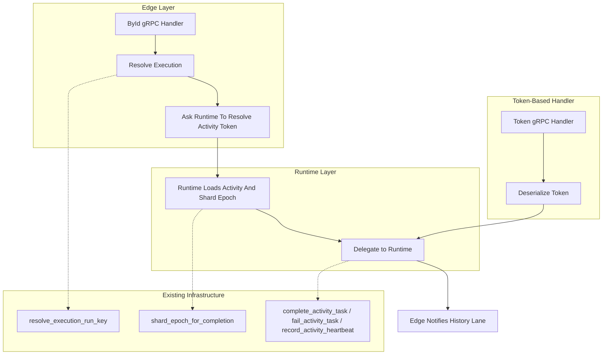

# Design Document: Activity ById API Conformance

## Overview

This design implements six currently-stubbed activity RPCs in the Tokeira edge layer, bringing them from `Stubbed` (returning `tonic::Status::unimplemented`) to `Implemented`. The approach reuses the existing execution-home resolution and runtime delegation infrastructure. The edge resolves workflow identifiers to `RunKey`; the runtime constructs `ActivityTaskToken` values from authoritative activity and shard state before the handlers converge with the existing token-based paths.

The design follows the edge's established pattern: translate → resolve → delegate → notify. No workflow semantics are added to the edge; the runtime and kernel remain the authority on activity lifecycle.

## Architecture



The ById handlers converge with the token-based handlers after runtime token resolution. The edge does not duplicate shard-epoch logic; it resolves the execution home and lets the runtime build the token.

### Handler Flow

1. **Validate run ID**: reject non-empty malformed `run_id` values before resolution
2. **Resolve execution**: `(namespace, workflow_id, run_id)` → `RunKey` via `resolve_execution_run_key` (existing)
3. **Resolve token in runtime**: runtime loads activity state, validates started-state policy for token-backed completion/failure/cancel handlers, and constructs `ActivityTaskToken`
4. **Heartbeat exception**: heartbeat-by-id may short-circuit to `cancel_requested = false` for unstarted activities; otherwise it passes heartbeat `details` to the runtime heartbeat path
5. **Delegate**: call the same runtime method as the token-based handler
6. **Notify**: trigger history lane notification (for completion/failure/cancel)

### Token-Based Cancel (Requirement 6)

The `RespondActivityTaskCanceled` handler follows the same pattern as the existing `RespondActivityTaskCompleted` and `RespondActivityTaskFailed` handlers — decode token, delegate to runtime with `ActivityResolution::Canceled`, notify history lane. The only change is replacing `Status::unimplemented` with the delegation logic.

### UpdateActivityOptions (Requirement 7)

This uses the existing kernel `UpdateActivityOptions` command, which patches timeout and routing fields on a pending activity without canceling it. The edge resolves the workflow execution to a `RunKey`, validates the request target, maps field-mask-selected proto fields to `FieldChange<T>`, and submits the existing command. The kernel applies the update and returns the new activity options.

`UpdateActivityOptions` does not use `resolve_activity_token` and does not require `started_event_id`. Activity options live on the pending activity state, so a scheduled-but-not-yet-started activity can be updated. Missing activities are reported by the update command path as `NOT_FOUND`; unstarted activities are not `FAILED_PRECONDITION` for this RPC.

This spec implements `UpdateActivityOptions` for the `ActivityTarget::Id` variant only, matching the proto's `(workflow_id, run_id, activity_id)` addressing. The existing edge DTO's `ActivityTarget::Type` and `ActivityTarget::MatchAll` variants are used by other RPCs, such as pause and unpause activity, which are out of scope for this spec.

The upstream proto supports `target.id`, `target.type`, and `target.match_all`. This spec implements `target.id` only. Requests with `target.type` or `target.match_all` SHALL return `UNIMPLEMENTED` with a message indicating the variant is not yet supported. A future spec may implement bulk targeting.

## Components and Interfaces

### New Edge Methods on `WorkflowService`

```rust
// ById resolution + delegation
pub async fn respond_activity_task_completed_by_id(&self, headers: &HeaderMap, req: RespondActivityTaskCompletedByIdRequest) -> EdgeResult<RespondActivityTaskCompletedResponse>;
pub async fn respond_activity_task_failed_by_id(&self, headers: &HeaderMap, req: RespondActivityTaskFailedByIdRequest) -> EdgeResult<RespondActivityTaskFailedResponse>;
pub async fn respond_activity_task_canceled_by_id(&self, headers: &HeaderMap, req: RespondActivityTaskCanceledByIdRequest) -> EdgeResult<RespondActivityTaskCanceledResponse>;
pub async fn record_activity_task_heartbeat_by_id(&self, headers: &HeaderMap, req: RecordActivityTaskHeartbeatByIdRequest) -> EdgeResult<RecordActivityTaskHeartbeatResponse>;
pub async fn update_activity_options(&self, headers: &HeaderMap, req: UpdateActivityOptionsRequest) -> EdgeResult<UpdateActivityOptionsResponse>;

// Token-based cancel (unblocking existing stub)
pub async fn respond_activity_task_canceled(&self, headers: &HeaderMap, req: RespondActivityTaskCanceledRequest) -> EdgeResult<RespondActivityTaskCanceledResponse>;
```

### New Edge DTOs (`translate/mod.rs`)

```rust
pub struct RespondActivityTaskCompletedByIdRequest {
    pub namespace: String,
    pub workflow_id: String,
    pub run_id: Option<String>,
    pub activity_id: String,
    pub result: Payloads,
    pub identity: String,
}

pub struct RespondActivityTaskFailedByIdRequest {
    pub namespace: String,
    pub workflow_id: String,
    pub run_id: Option<String>,
    pub activity_id: String,
    pub failure: Payload,
    pub failure_error_type: Option<String>,
    pub is_non_retryable: bool,
    pub identity: String,
}

pub struct RespondActivityTaskCanceledByIdRequest {
    pub namespace: String,
    pub workflow_id: String,
    pub run_id: Option<String>,
    pub activity_id: String,
    pub details: Option<Payloads>,
    pub identity: String,
}

pub struct RecordActivityTaskHeartbeatByIdRequest {
    pub namespace: String,
    pub workflow_id: String,
    pub run_id: Option<String>,
    pub activity_id: String,
    pub details: Option<Payloads>,
    pub identity: String,
}

pub struct RespondActivityTaskCanceledRequest {
    pub token: ActivityTaskToken,
    pub details: Option<Payloads>,
    pub identity: String,
}

pub struct RespondActivityTaskCanceledResponse;

// Existing token-based heartbeat DTO must be widened from `(token, identity)`
// to `(token, details, identity)` so the token and ById heartbeat paths share
// the same runtime method and preserve the proto `details` payload.
pub struct RecordActivityTaskHeartbeatRequest {
    pub token: ActivityTaskToken,
    pub details: Option<Payloads>,
    pub identity: String,
}

// UpdateActivityOptions uses the existing DTOs in
// `crates/tokeira-edge/src/translate/mod.rs`.
//
// The current DTO includes field-mask, target, restore-original, retry-policy,
// and activity-type support. It is richer than the minimal fields needed by
// this child spec and should be used as-is rather than replaced by a new type.
```

### New Runtime Method

There are two API layers to update:

1. The concrete runtime (`TokeiraRuntime`) owns transition submission and returns the storage-level `CommitResult`.
2. The edge runtime adapter (`WorkflowRuntimeApi` / `RuntimeAdapter`) converts the concrete runtime result into the edge-level `WorkflowMutationOutcome` used by handlers for history waiter notification.

```rust
// On TokeiraRuntime and WorkflowRuntimeApi:
async fn resolve_activity_token(
    &self,
    run_key: RunKey,
    activity_id: &str,
) -> Result<ActivityTaskToken, ActivityTokenResolutionError>;

// On TokeiraRuntime:
async fn cancel_activity_task(
    &self,
    token: ActivityTaskToken,
    details: Option<Payloads>,
    worker_identity: Option<WorkerIdentity>,
) -> anyhow::Result<CommitResult>;

// On WorkflowRuntimeApi:
async fn cancel_activity_task(
    &self,
    token: ActivityTaskToken,
    details: Option<Payloads>,
    worker_identity: Option<WorkerIdentity>,
) -> anyhow::Result<WorkflowMutationOutcome>;

// Existing heartbeat API widened for metadata parity:
async fn record_activity_heartbeat(
    &self,
    token: ActivityTaskToken,
    details: Option<Payloads>,
) -> anyhow::Result<bool>;
```

`resolve_activity_token` loads the run, finds the pending activity, validates that it has started for completion/failure/cancel handlers, and fills `schedule_event_id`, `attempt`, and `shard_epoch` using runtime-owned state. It returns `ActivityTokenResolutionError` directly so the edge handler can map not-found and not-started cases to the correct gRPC status instead of collapsing them to `Internal`.

The heartbeat runtime API is widened to accept `details` because `RecordActivityTaskHeartbeatById` and token-based `RecordActivityTaskHeartbeat` must share the same implementation path. If the heartbeat store does not yet persist details, the implementation still accepts and forwards the payload through the runtime boundary so storage support can be added without changing the edge contract again.

The concrete runtime submits `Command::ActivityResolved` with `ActivityResolution::Canceled { details }`, following the same validation and submission pattern as `complete_activity_task`. The edge adapter calls the concrete method and converts `CommitResult` to `WorkflowMutationOutcome`.

### Existing Kernel Command (for UpdateActivityOptions)

The kernel already defines `UpdateActivityOptionsRequest` using `FieldChange<T>` in `crates/tokeira-kernel/src/command.rs`. The edge handler maps selected proto fields to `FieldChange::Set(value)`, explicit clears to `FieldChange::Clear`, and absent or unmasked fields to `FieldChange::Unchanged`. No new kernel types are needed.

### Shared ById Resolution Helper

```rust
/// Resolve workflow identifiers and delegate token construction to the runtime.
///
/// Shared by all ById activity handlers to avoid duplicating the
/// run_id validation and execution-home resolution sequence.
async fn resolve_activity_run_key(
    &self,
    namespace: &str,
    workflow_id: &str,
    run_id: Option<&str>,
) -> EdgeResult<RunKey> {
    if let Some(run_id) = run_id.filter(|value| !value.is_empty()) {
        run_id.parse::<uuid::Uuid>()
            .map_err(|err| EdgeError::BadRequest(format!("invalid run_id `{run_id}`: {err}")))?;
    }
    self.resolve_execution_run_key(namespace, workflow_id, run_id).await
}
```

Completion, failure, and cancellation handlers call `runtime.resolve_activity_token(run_key, activity_id)` after this helper. Runtime-side token resolution loads the run state, returns `RunNotFound` when the run is absent, returns `ActivityNotFound` when the activity is missing, returns `ActivityNotStarted` when `started_event_id` is absent, and fills the current shard epoch internally.

```rust
let activity = run_state.activities.get(activity_id).ok_or_else(|| {
    ActivityTokenResolutionError::ActivityNotFound {
        run_key,
        activity_id: activity_id.to_string(),
    }
})?;
```

The edge handler maps `ActivityTokenResolutionError::RunNotFound` to `EdgeError::WorkflowNotFound`, `ActivityTokenResolutionError::ActivityNotFound` to `EdgeError::ActivityNotFound`, and `ActivityTokenResolutionError::ActivityNotStarted` to `EdgeError::ActivityNotStarted`, preserving the gRPC status contract without introducing an edge dependency into `tokeira-runtime`.

Heartbeat-by-id uses the same runtime token resolver with different error handling: if token resolution succeeds, it delegates to the normal heartbeat path; if token resolution returns `ActivityNotStarted`, it returns `cancel_requested = false` immediately without runtime heartbeat delegation.

Invalid non-empty `run_id` values map to `INVALID_ARGUMENT`. Missing runs and missing activities map to `NOT_FOUND`. Scheduled-but-not-started completion/failure/cancel calls map to `FAILED_PRECONDITION`; scheduled-but-not-started `UpdateActivityOptions` calls are allowed.

## Data Models

### ActivityTaskToken (existing, unchanged)

```rust
pub struct ActivityTaskToken {
    pub run_key: RunKey,
    pub activity_id: String,
    pub schedule_event_id: i64,
    pub attempt: u32,
    pub shard_epoch: ShardEpoch,
}
```

### ActivityTokenResolutionError (new runtime error)

```rust
pub enum ActivityTokenResolutionError {
    RunNotFound { run_key: RunKey },
    ActivityNotFound { run_key: RunKey, activity_id: String },
    ActivityNotStarted { run_key: RunKey, activity_id: String },
}
```

The runtime owns this error because it owns activity-state lookup and shard-epoch resolution. The edge adapter converts these variants into `EdgeError` values with namespace/workflow context from the original ById request where needed.

### RunState.activities (existing, unchanged)

The `activities: HashMap<String, ActivityState>` field on `RunState` is the source of truth for pending activities. The ById resolution reads from this map.

### New EdgeError Variant

```rust
#[error("activity not found: {namespace}/{workflow_id}/{activity_id}")]
ActivityNotFound {
    namespace: String,
    workflow_id: String,
    activity_id: String,
}

#[error("activity has not started: {namespace}/{workflow_id}/{activity_id}")]
ActivityNotStarted {
    namespace: String,
    workflow_id: String,
    activity_id: String,
}
```

`ActivityNotFound` maps to `StatusCode::NOT_FOUND` and gRPC `NOT_FOUND` status. `ActivityNotStarted` maps to `StatusCode::PRECONDITION_FAILED` and gRPC `FAILED_PRECONDITION` status.

## Correctness Properties

*A property is a characteristic or behavior that should hold true across all valid executions of a system — essentially, a formal statement about what the system should do. Properties serve as the bridge between human-readable specifications and machine-verifiable correctness guarantees.*

### Property 1: ById Resolution Equivalence

*For any* valid `(namespace, workflow_id, run_id)` tuple that resolves to a `RunKey`, the ById handler SHALL resolve to the same `RunKey` as `resolve_execution_run_key`. When `run_id` is empty, resolution SHALL use the current (latest) run.

**Validates: Requirements 1.1, 1.4**

### Property 2: Not-Found Propagation

*For any* ById activity request where either the execution does not exist or the `activity_id` is not present in the resolved run's activity map, the edge SHALL return a `NOT_FOUND` error before any activity mutation delegation occurs.

**Validates: Requirements 1.2, 1.3, 7.3, 8.3**

### Property 3: Runtime Token Construction Fidelity

*For any* resolved started activity with known `RunKey`, `activity_id`, `schedule_event_id`, `attempt`, and `shard_epoch`, the runtime-constructed `ActivityTaskToken` SHALL have all five fields set to the values from runtime-owned state. Specifically: `token.run_key == resolved_run_key`, `token.activity_id == request.activity_id`, `token.schedule_event_id == activity_state.schedule_event_id`, `token.attempt == activity_state.attempt`, `token.shard_epoch == current_epoch_for_bundle`.

**Validates: Requirements 8.1, 8.2**

### Property 4: ById-to-Token Delegation Equivalence (Completion)

*For any* valid ById completion request, the runtime SHALL receive the same `(token, result, worker_identity)` arguments as if the caller had used the token-based `RespondActivityTaskCompleted` with a token constructed from the same activity state.

**Validates: Requirements 3.1**

### Property 5: ById-to-Token Delegation Equivalence (Failure)

*For any* valid ById failure request, the runtime SHALL receive the same `(token, failure, failure_error_type, is_non_retryable, worker_identity)` arguments as if the caller had used the token-based `RespondActivityTaskFailed` with a token constructed from the same activity state.

**Validates: Requirements 4.1**

### Property 6: ById-to-Token Delegation Equivalence (Cancel)

*For any* valid ById or token-based cancellation request, the runtime SHALL receive `ActivityResolution::Canceled { details }` with the details from the request, following the same path as completion and failure.

**Validates: Requirements 5.1, 6.1**

### Property 7: Heartbeat Delegation and Cancel Flag

*For any* valid ById heartbeat request for a started activity, the runtime SHALL receive the correctly constructed token and heartbeat details, and the response `cancel_requested` flag SHALL equal the value returned by the runtime's heartbeat store for that activity. For a scheduled-but-not-started activity, the response SHALL be `cancel_requested = false` without heartbeat delegation.

**Validates: Requirements 2.1, 2.2**

### Property 8: Identity Propagation

*For any* ById activity RPC, the `identity` field SHALL be propagated as `Some(WorkerIdentity(identity))` when non-empty, and as `None` when empty.

**Validates: Requirements 9.1, 9.2**

### Property 9: Malformed Token Rejection

*For any* byte sequence that does not deserialize to a valid `ActivityTaskToken`, the token-based `RespondActivityTaskCanceled` handler SHALL return `INVALID_ARGUMENT` status.

**Validates: Requirements 6.4**

### Property 10: UpdateActivityOptions Field Application

*For any* `UpdateActivityOptions` request with valid identifiers and at least one changed field from `{schedule_to_close_timeout, schedule_to_start_timeout, start_to_close_timeout, heartbeat_timeout, task_queue}`, the kernel SHALL apply exactly the specified fields and the response SHALL reflect the new values.

**Validates: Requirements 7.1, 7.2, 7.4, 7.6**

## Error Handling

| Condition | Error | gRPC Status |
|-----------|-------|-------------|
| Execution not found | `EdgeError::WorkflowNotFound` | `NOT_FOUND` |
| Activity not found in run | `EdgeError::ActivityNotFound` | `NOT_FOUND` |
| Non-empty malformed `run_id` | `EdgeError::BadRequest` | `INVALID_ARGUMENT` |
| Activity exists but has not started for completion/failure/cancel | `EdgeError::ActivityNotStarted` | `FAILED_PRECONDITION` |
| Malformed task token | `ProtoConversionError` | `INVALID_ARGUMENT` |
| Run not loaded (absent) | `EdgeError::WorkflowNotFound` | `NOT_FOUND` |
| Shard epoch mismatch (runtime validation) | `EdgeError::Internal` | `UNAVAILABLE` (retry) |
| Missing required fields in proto | `ProtoConversionError::MissingField` | `INVALID_ARGUMENT` |
| Runtime commit conflict | Retry internally (OCC) | Transparent to caller |

### Error Ordering

The ById handlers validate in this order:
1. Proto field validation (missing namespace, workflow_id, activity_id)
2. Non-empty `run_id` parse validation
3. Execution resolution (namespace/workflow_id/run_id → RunKey)
4. Activity lookup (activity_id in run state)
5. Started-state validation for completion/failure/cancel handlers
6. Token construction (shard epoch)
7. Runtime delegation (token validation, commit)

This ensures the most specific error is returned first, and no mutation is submitted if the activity cannot be resolved. The `resolve_activity_token` call is a read-only lookup that returns `NOT_FOUND` if the activity is missing.

## Testing Strategy

### Unit Tests (example-based)

- Proto translation: verify each ById proto request correctly maps to the edge DTO
- Error mapping: verify each `EdgeError` variant maps to the correct gRPC status
- Empty run_id resolution: verify current-run fallback behavior
- Invalid run_id resolution: verify malformed non-empty run IDs return `INVALID_ARGUMENT`
- Scheduled-but-not-started activity: verify completion/failure/cancel handlers return `FAILED_PRECONDITION` and `UpdateActivityOptions` is allowed
- History lane notification: verify notification is triggered after successful commit
- Heartbeat with untracked activity: verify `cancel_requested = false`

### Property Tests (proptest, minimum 100 iterations)

Property-based tests using `proptest` to verify universal properties:

- **Feature: api-conformance-activity-by-id, Property 1**: Generate random identifier tuples, verify resolution equivalence
- **Feature: api-conformance-activity-by-id, Property 2**: Generate random non-existent identifiers, verify NOT_FOUND before activity mutation delegation
- **Feature: api-conformance-activity-by-id, Property 3**: Generate random `ActivityState` instances, verify token field fidelity
- **Feature: api-conformance-activity-by-id, Property 8**: Generate random identity strings (empty and non-empty), verify propagation
- **Feature: api-conformance-activity-by-id, Property 9**: Generate random byte sequences, verify INVALID_ARGUMENT for non-deserializable tokens
- **Feature: api-conformance-activity-by-id, Property 10**: Generate random option subsets, verify field application

### Integration Tests

- End-to-end: start workflow → schedule activity → complete/fail/cancel via ById → verify history events
- Retry behavior: fail activity via ById with retryable error → verify re-dispatch
- Token-based cancel: complete the cancel flow that was previously stubbed
- UpdateActivityOptions: update timeouts → verify subsequent activity dispatch uses new values
