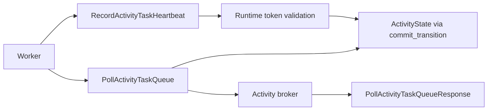

# Design Document: Activity Events API Conformance

## Overview

Activity poll and heartbeat conformance requires carrying heartbeat payloads and attempt timestamps through durable activity state. The edge remains a translator; activity token validation and heartbeat persistence stay in the runtime, and the kernel remains deterministic and heartbeat-free.

## Dependencies and Non-Goals

- `api-conformance-workflow-describe` consumes the same pending activity snapshot.
- This spec does not implement by-id activity handlers; those are covered by `api-conformance-activity-by-id`.
- Timestamp fields are authored by committed history/runtime state, not by edge wall-clock guesses.

## Architecture

## Components and Interfaces

- `crates/tokeira-edge/src/grpc/translate.rs`: preserve heartbeat `details` and project poll response fields.
- `crates/tokeira-runtime/src/runtime/activity.rs`: persist heartbeat details on `ActivityState` through the runtime's fenced `commit_transition` path with an empty history batch and `ActivityOp::Upsert`, matching the activity-start pattern.
- `crates/tokeira-kernel/src/state.rs`: add durable `ActivityState` fields for latest heartbeat details and current-attempt schedule time. Heartbeat commands are not added to the kernel.
- `crates/tokeira-storage/src/memory.rs` and DSQL dispatch reads: retain durable activity state so heartbeat details and scheduled/start timing survive restart.
- `crates/tokeira-edge/src/translate/history_serializer.rs`: populate activity event linkage fields when present.

Heartbeat lifecycle follows Temporal v1.31.0: `UpdateActivityProgress` persists `LastHeartbeatDetails` on mutable activity info without a history event (`service/history/workflow/mutable_state_impl.go:1956 @ v1.31.0`), the next activity start returns those details (`service/history/api/recordactivitytaskstarted/api.go:265 @ v1.31.0`), and normal retry preserves the details while `ResetHeartbeats` clears them (`service/history/workflow/activity.go:63 @ v1.31.0`). Tokeira implements the same boundary by writing `ActivityState.heartbeat_details` from the runtime; volatile activity tracking remains only for heartbeat timeout and cancellation liveness.

## Correctness Properties

### Property 1: Heartbeat Round Trip

For any heartbeat details payload, a later eligible activity poll returns the latest details.

**Validates:** Requirements 1.2, 2.1, 2.2.

### Property 2: Timing Authorship

Scheduled/current-attempt/started timestamps in poll responses equal server-authored state and are absent when unknown.

**Validates:** Requirements 1.3, 1.4, 1.5, 1.6.

### Property 3: Event Link Fidelity

When activity scheduled/start ids exist, terminal activity event protos preserve them exactly.

**Validates:** Requirements 3.1, 3.2.

## Error Handling

| Condition | Error | gRPC status |
|---|---|---|
| Malformed heartbeat token | proto conversion error | `INVALID_ARGUMENT` |
| Stale activity token | runtime validation error | existing mapped status |
| Missing activity | runtime validation error | existing mapped status |

## Testing Strategy

- Unit tests for heartbeat translator preserving details.
- Runtime tests for heartbeat details persistence and retry poll response.
- Serializer property tests for activity event id linkage.
- DSQL/memory parity tests for scheduled/start timestamps where both stores expose dispatch state.
