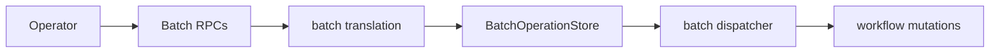

# Design Document: Batch Field API Conformance

## Overview

Batch operation handlers exist, but some action fields are dropped. This design threads full batch action payloads through batch state and dispatch, then extends describe/list projection where needed.

## Dependencies and Non-Goals

- Depends on `api-conformance-signal-headers` for the signal path that receives batch signal headers.
- Depends on `api-conformance-workflow-options` for the single-workflow update-options runtime path applied by batch dispatch.
- Depends on `api-conformance-activity-by-id` for the single-workflow activity-options selector,
  restore-original, and field-mask semantics applied by batch dispatch.
- Reset reapply configuration is threaded through the batch reset dispatch path to the kernel reset command.
- This spec does not change the review/confirm model; it only ensures upstream request fields are not silently dropped.

## Durable Job State

Batch state must retain original request metadata, action kind, query, progress
counts, failure reason, terminal state, and timestamps so describe/list remain
accurate after restart.

## Architecture

## Components and Interfaces

- `crates/tokeira-edge/src/translate/batch.rs`: account for every batch action field.
- `crates/tokeira-edge/src/grpc/workflow_service.rs`: start/stop/describe/list handlers remain the ingress path.
- `crates/tokeira-runtime/src/batch.rs`: persist supported metadata and progress.
- Signal header support depends on `api-conformance-signal-headers`; this spec wires those fields through the batch dispatcher.
- `BatchOperationUpdateActivityOptions` is stored as a typed action and dispatched through the same
  runtime API as `UpdateActivityOptions`; the batch layer does not reinterpret masks or defaults.

## Correctness Properties

### Property 1: No Batch Field Drop

For any batch action field, translation either stores the field in batch state and dispatches it to the target runtime path, or rejects malformed payloads before batch creation.

**Validates:** Requirements 1.1-1.4, 3.2.

### Property 2: Progress Monotonicity

Batch progress counts never decrease and never exceed total target count.

**Validates:** Requirements 2.2, 2.3.

### Property 3: Stop Idempotence

Stopping a terminal batch returns success without changing terminal state.

**Validates:** Requirement 2.4.

### Property 4: Batch activity-options equivalence

*For any* valid batch activity-options action and selected workflow set, dispatching the batch SHALL
produce the same per-workflow activity mutations as invoking `UpdateActivityOptions` with the same
identity, selector, options, mask, and restore flag on each workflow exactly once.

**Validates:** Requirements 1.5, 2.1.

## Error Handling

| Condition | Error | gRPC status |
|---|---|---|
| Invalid query or payload | bad request | `INVALID_ARGUMENT` |
| Missing batch operation | not found | `NOT_FOUND` |

## Testing Strategy

- Translator tests for each batch action variant.
- Property tests for field preservation and progress counts.
- Integration tests for start, stop, describe, and list.
- A reference-model PBT for batch activity-options equivalence, minimum 100 cases.
