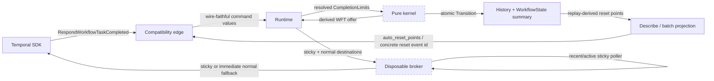

# Design Document: Client Miscellaneous Conformance

## Overview

This design closes the testable gaps in Tier 9.44's
`TestClientMiscTestSuite` against Temporal server `v1.31.0`. It covers four
independent behavior clusters:

1. runtime-resolved pending-command limits enforced atomically by the pure
   kernel;
2. authoritative `ScheduleActivity` timeout validation and normalization;
3. sticky WFT fallback based on disposable broker liveness rather than a
   durable affinity expiry; and
4. history-derived auto-reset points used by Describe and batch reset by build
   ID.

The design follows Tokeira's three-plane architecture. The edge preserves wire
values and translates responses. The runtime resolves mutable policy and owns
volatile delivery observations. The kernel remains a pure
`(state, command) -> transition` function: it receives concrete policy values,
validates workflow commands against the supplied state, and returns a new
summary plus events and derived effects. It retains no process-local state and
performs no I/O.

Behavior is grounded in:

- `common/dynamicconfig/constants.go`,
  `service/history/api/respondworkflowtaskcompleted/workflow_size_checker.go`,
  and `workflow_task_completed_handler.go @ v1.31.0` for pending limits;
- `chasm/lib/activity/validator.go` and
  `service/history/api/command_attr_validator.go @ v1.31.0` for activity
  validation;
- `service/matching/matching_engine.go`,
  `service/history/transfer_queue_active_task_executor.go`, and
  `service/history/api/recordworkflowtaskstarted/api.go @ v1.31.0` for sticky
  fallback; and
- `service/history/workflow/workflow_task_state_machine.go`,
  `mutable_state_impl.go`, and `service/worker/batcher/activities.go @
  v1.31.0` for reset points.

## Dependencies and Non-Goals

### Owning relationships

- `conformance-config-override` owns the feature-gated override registry and
  control bridge. This design adds four honest wired keys and their runtime
  consult site.
- `speculative-wft` owns per-run WFT timeout tracking. This design preserves
  that machinery and changes the source of a sticky task's schedule-to-start
  deadline from affinity expiry to `PendingWorkflowTask`.
- `workflow-reset` owns the reset fork/reapply transition. This design only
  resolves a build ID to an existing concrete completed-WFT event ID before
  invoking that transition.
- Worker Deployment and deprecated worker-version support own the completion
  metadata from which `(binary_checksum, build_id)` is derived. Their routing
  and BuildIds search-attribute behavior is unchanged.
- `api-conformance-workflow-describe` owns the general Describe projection.
  This design fills its previously deferred `auto_reset_points` field.

### Non-goals

- No Temporal history-service or matching-service topology is introduced.
- No mutable configuration, I/O, async work, metrics, or process-local cache is
  introduced into `tokeira-kernel`.
- No general production dynamic-config system is added. Production retains the
  pinned v1.31.0 constants.
- No persistent poller registry is added. Sticky-poller liveness is disposable
  and may be empty after restart; empty observations cause safe normal-queue
  fallback.
- No new data-converter behavior is implemented. The three data-converter
  methods remain upstream-authored skips.
- No cross-run reset-point rollover is fabricated. `current_run_only` and
  prior-run resolution remain under the existing field-support classification.
- No generic Temporal persistence-manager topology is added to the conformance
  fork. One read-only adapter serves the suite's direct mutable-state assertion
  through Tokeira's existing `DescribeMutableState` response.
- No BinaryChecksums search-attribute campaign is added. Existing BuildIds and
  Worker Deployment metadata remain unchanged.
- No new dependency or DSQL schema migration is required.

## Architecture

One WFT completion crosses the planes once. The runtime resolves current
completion limits, then supplies them as immutable command input. The kernel
applies the command batch to a provisional transition builder; any invalid
command discards the entire candidate transition. A successful completion
records its first-seen reset point before applying its worker commands, so the
point's `resettable` bit observes pre-command pending state and is discarded if
a later command rejects the completion.

Sticky delivery uses a separate path. The kernel persists only real sticky
metadata and places the concrete schedule-to-start deadline on the pending WFT.
The runtime publisher builds both the preferred sticky destination and the
normal fallback destination. The broker atomically consults its volatile
recent/active-poller observations when accepting that derived offer. Missing or
stale liveness redirects the offer immediately without mutating the run. If the
normal offer starts, the start command identifies the polled queue and the
kernel clears the still-durable sticky metadata.



## Components and Interfaces

### Completion-limit policy (`tokeira-runtime/src/runtime/workflow_task.rs`)

The runtime resolves all four values immediately before submitting the WFT
completion. Production accessors return `2000`. Conformance accessors read the
registry at that call, fall back to `2000`, map positive values to an enabled
limit, and map zero or negative values to `None`.

```rust
pub const DEFAULT_PENDING_COMMAND_LIMIT: usize = 2_000;

fn workflow_task_completion_limits() -> WorkflowTaskCompletionLimits;

// Representative conformance accessor.
fn pending_activities_limit() -> Option<usize>;
```

`crates/tokeira-conformance/src/lib.rs` adds the four integer keys to
`KEY_CLASSIFICATION` as `Wired`. Classification and the real consult site land
in the same change.

### Explicit kernel input (`tokeira-kernel/src/command.rs`)

The concrete limits travel with `WorkflowTaskCompletedRequest`; they are not
stored on `WorkflowState`. A default exists for internal callers and old test
fixtures and equals the production v1.31.0 policy.

```rust
#[derive(Clone, Copy, Debug, PartialEq, Eq, Serialize, Deserialize)]
pub struct WorkflowTaskCompletionLimits {
    pub pending_child_workflows: Option<usize>,
    pub pending_activities: Option<usize>,
    pub pending_signals: Option<usize>,
    pub pending_cancel_requests: Option<usize>,
}

impl Default for WorkflowTaskCompletionLimits {
    // Some(2_000) for every field.
}

pub struct WorkflowTaskCompletedRequest {
    // existing fields
    #[serde(default)]
    pub limits: WorkflowTaskCompletionLimits,
}
```

This is transition input, not retained kernel state. Cron and retry completion
variants continue to carry the same request, so all three completion paths use
the identical limits.

Four `WorkflowTaskFailedCause` variants are appended after every existing
variant:

```rust
PendingChildWorkflowsLimitExceeded,
PendingActivitiesLimitExceeded,
PendingSignalsLimitExceeded,
PendingRequestCancelLimitExceeded,
```

Appending preserves all existing postcard enum discriminants. The edge's
proto/cause mappings and `as_str()` cover values 26-29.

### Atomic command admission (`tokeira-kernel/src/kernel.rs`)

`apply_workflow_task_completed` passes a reference to the limits into
`apply_workflow_command`. Immediately before inserting each bounded command,
the function compares the relevant provisional map length to the enabled
limit:

| Command | Provisional source |
|---|---|
| `StartChildWorkflow` | `builder.state.children.len()` |
| `ScheduleActivity` | `builder.state.activities.len()` |
| `SignalExternalWorkflowExecution` | `builder.state.pending_external_signals.len()` |
| `RequestCancelExternalWorkflowExecution` | `builder.state.pending_external_cancels.len()` |

Because all commands share one `TransitionBuilder`, lengths include earlier
commands in the same batch. Returning `Reject::InvalidCommandAttributes`
discards the builder, including its already-authored WFT-completion event,
command events, state mutations, and dispatch effects. The runtime's existing
invalid-command seam then authors `WorkflowTaskFailed` in a separate transition
and returns `INVALID_ARGUMENT`.

### Schedule-activity normalization (`tokeira-edge/src/grpc/translate.rs`,
`tokeira-kernel/src/kernel.rs`)

The edge converts proto durations into optional domain durations and preserves
an omitted or empty task queue as an empty `TaskQueueName`. It no longer
requires `ScheduleActivityCommandAttributes.task_queue` and no longer performs
state-independent timeout defaulting that would hide the original command
shape.

The kernel owns one pure normalization function because the result depends on
the workflow's normal task queue and run timeout:

```rust
struct NormalizedActivityCommand {
    task_queue: TaskQueueName,
    schedule_to_close_timeout: Option<Duration>,
    schedule_to_start_timeout: Option<Duration>,
    start_to_close_timeout: Option<Duration>,
    heartbeat_timeout: Option<Duration>,
}

fn normalize_activity_command(
    state: &WorkflowState,
    activity_id: &str,
    activity_type: &str,
    task_queue: TaskQueueName,
    schedule_to_close: Option<Duration>,
    schedule_to_start: Option<Duration>,
    start_to_close: Option<Duration>,
    heartbeat: Option<Duration>,
) -> Result<NormalizedActivityCommand, Reject>;
```

The function follows v1.31.0 precedence:

1. non-positive values are absent;
2. neither schedule-to-close nor start-to-close rejects the command;
3. a supplied schedule-to-close fills omitted schedule-to-start and
   start-to-close and caps both;
4. otherwise the positive workflow run timeout fills schedule-to-close and
   omitted schedule-to-start;
5. a positive workflow run timeout caps all longer activity windows; and
6. heartbeat is capped by start-to-close.

The normalized values are used consistently in the scheduled event,
`ActivityState`, dispatch effect, and timeout tracking.

### Sticky metadata and start semantics
(`tokeira-types/src/task_queue.rs`,
`tokeira-kernel/src/{command,state,kernel}.rs`)

`StickyAffinity` becomes durable metadata only:

```rust
pub struct StickyAffinity {
    pub worker_identity: WorkerIdentity,
    pub sticky_queue: TaskQueueName,
    pub schedule_to_start_timeout: Duration,
}
```

`expires_at` is removed. The old poll-side `StartWorkflowTaskRequest.sticky_ttl`
and its empty-queue “sync-match hint” are also removed: that optimization
incorrectly placed volatile delivery preference in the durable run summary and
had no v1.31.0 sticky-state counterpart.

`StartWorkflowTaskRequest` instead carries the queue from which the offered task
was polled:

```rust
pub struct StartWorkflowTaskRequest {
    // existing fields
    pub polled_task_queue: TaskQueueName,
}
```

When a real sticky affinity exists and `polled_task_queue` differs from its
sticky queue, the pure start transition clears the affinity. A sticky-queue
start preserves it. Empty sticky attributes on completion continue to mean
clear/no affinity.

This is an approved pre-baseline state-format correction. `WorkflowState` and
`StickyAffinity` are postcard-positioned summaries; no persisted production
baseline is claimed. The implementation therefore adopts the clean semantic
shape and updates serialization goldens rather than pretending a removed
deadline remains meaningful. History event enums and failure-cause enum
discriminants remain append-only.

### Derived sticky dispatch envelope (`tokeira-storage/src/api.rs`)

The dispatch envelope carries both destinations and the pending task's
deadline:

```rust
pub struct DispatchableWorkflowTask {
    pub run_key: RunKey,
    /// Preferred queue; sticky when sticky metadata applies.
    pub queue: QueueKey,
    pub logical_seq: LogicalTaskSeq,
    pub sticky_preferred: Option<WorkerIdentity>,
    /// Normal destination for immediate fallback.
    pub normal_queue: Option<QueueKey>,
    /// Deadline copied from PendingWorkflowTask, never from StickyAffinity.
    pub sticky_deadline: Option<OffsetDateTime>,
}
```

Live publication resolves both version-aware `QueueKey` values before entering
the broker. In-memory and DSQL dispatch scans derive the same envelope from
`WorkflowState.sticky` plus
`WorkflowState.pending_workflow_task.schedule_to_start_deadline`. Storage reads
must not mutate or clear affinity. Recovery republishes the envelope through
the same broker admission path as live work.

The broker never silently converts a lapsed sticky deadline into affinity
expiry. The existing WFT timeout machinery authors the authoritative
schedule-to-start timeout transition; any raced stale offer is rejected by the
normal logical-sequence/start fence.

### Volatile sticky-poller liveness (`tokeira-runtime/src/broker.rs`)

The broker records poll observations under
`(namespace_id, sticky_queue_name, worker_identity)`:

```rust
const STICKY_POLLER_UNAVAILABLE_WINDOW: Duration = Duration::seconds(10);

struct StickyPollerKey {
    namespace_id: NamespaceId,
    task_queue: TaskQueueName,
    worker_identity: WorkerIdentity,
}

struct BrokerState {
    // existing disposable queues/waiters
    sticky_poller_last_seen: HashMap<StickyPollerKey, OffsetDateTime>,
}

fn sticky_worker_available_at(
    state: &BrokerState,
    key: &StickyPollerKey,
    now: OffsetDateTime,
) -> bool;

async fn publish_workflow_task_at(
    &self,
    task: DispatchableWorkflowTask,
    now: OffsetDateTime,
    metrics: Option<&DeliveryMetrics>,
);
```

Poll admission always records an observation. Normal poll completion and
timeout refresh it. Client cancellation does not, because dropping the poll
future does not execute its normal-return finalizer; a broker-denied shutdown
return is likewise classified as cancelled and does not refresh. A currently
parked waiter with a live response channel remains active even if its admission
observation is older than ten seconds.

Availability is false when:

- the worker is explicitly denied by shutdown;
- no live waiter exists and no observation exists; or
- no live waiter exists and the latest observation is at least ten seconds
  old.

`deny_worker` removes the observation as it installs the shutdown fence.
Broker publication checks availability and enqueues in one lock scope. An
unavailable sticky offer is rewritten to its supplied `normal_queue` and has
its delivery-only sticky preference cleared. No kernel command or repository
write occurs. This central point covers normal and speculative live offers,
backlog drain, and recovery.

### Query fallback (`tokeira-runtime/src/runtime/query.rs`,
`tokeira-edge/src/workflow_service.rs`)

A direct or released buffered query derives:

```rust
sticky_deadline = now + affinity.schedule_to_start_timeout;
```

The query task retains sticky preference until that per-query deadline, then
falls back through the existing query broker path. It never compares `now`
with the time of the last WFT completion because that time is no longer stored
as affinity expiry.

### Auto-reset points (`tokeira-kernel/src/state.rs`,
`tokeira-kernel/src/kernel.rs`)

The replay-derived state model is:

```rust
pub const DEFAULT_HISTORY_MAX_AUTO_RESET_POINTS: usize = 20;

#[derive(Clone, Debug, PartialEq, Eq, Serialize, Deserialize)]
pub struct AutoResetPoint {
    pub binary_checksum: String,
    pub build_id: String,
    pub run_id: RunId,
    pub first_workflow_task_completed_id: i64,
    pub create_time: OffsetDateTime,
    pub expire_time: Option<OffsetDateTime>,
    pub resettable: bool,
}

pub struct WorkflowState {
    // existing summary fields
    #[serde(default)]
    pub auto_reset_points: Vec<AutoResetPoint>,
}
```

For each successful WFT completion:

- `binary_checksum` comes from
  `WorkflowTaskWorkerVersion.binary_checksum`, defaulting to empty;
- `build_id` comes first from `deployment_version.build_id`, otherwise from
  the deprecated worker-version stamp, otherwise empty;
- `run_id`, completed event ID, and event time come from the current
  transition;
- `expire_time` is `None`, matching v1.31.0's newly-created point; and
- `resettable` is computed before worker commands from whether pending
  children, external signals, and external cancels are all empty.

A helper appends only the first observation of a
`(binary_checksum, build_id)` pair and retains the newest 20 points. The hot
completion path calls it after authoring `WorkflowTaskCompleted` but before
applying commands. The replay path calls the same helper while applying that
event. A later invalid command discards the hot builder, so no reset point can
survive a rejected completion.

`WorkflowState` is still a runtime/store-owned durable summary passed into and
returned from the stateless kernel. The kernel does not retain it between
calls.

### Describe projection (`apps/tokeirad/src/lib.rs`,
`tokeira-edge/src/translate/mod.rs`,
`tokeira-edge/src/grpc/translate.rs`)

`WorkflowExecutionDescription` carries the cloned point list. Proto translation
maps every field to
`temporal.api.workflow.v1.ResetPointInfo` and assigns the resulting
`ResetPoints` to `WorkflowExecutionInfo.auto_reset_points`. Empty point lists
remain wire-default.

### Batch reset resolution (`tokeira-edge/src/workflow_service.rs`)

`resolve_reset_target_batch_internal` loads the selected run and scans
`state.auto_reset_points` for the requested build ID. It returns
`first_workflow_task_completed_id` only when the point is resettable, unexpired,
and part of the selected current run's retained point list. It does not inspect
`WorkflowState.build_id` and does not translate build-ID targeting into
`FirstWorkflowTask`. Cross-run rollover and `current_run_only` remain outside
this tier because Tokeira does not yet retain prior-run points in the current
run's summary.

The returned event ID enters the unchanged reset transition, preserving its
fork boundary and reapply behavior.

## Data Models

| Model | Durability | Contract source |
|---|---|---|
| `WorkflowTaskCompletionLimits` | One command only; not retained | Four v1.31.0 pending-limit settings and `withinLimit` |
| `StickyAffinity` | `WorkflowState` summary | sticky queue, cache worker, and sticky schedule-to-start timeout |
| `PendingWorkflowTask.schedule_to_start_deadline` | `WorkflowState` summary | deadline for one sticky/speculative WFT |
| `sticky_poller_last_seen` | Process-local only | v1.31.0 ten-second sticky-poller observation window |
| `DispatchableWorkflowTask.normal_queue` | Derived delivery envelope | immediate `StickyWorkerUnavailable` fallback |
| `AutoResetPoint` | Replay-derived `WorkflowState` summary | `workflow/v1/ResetPointInfo` fields 1-7 |

No queue observation is workflow authority. Losing broker state makes sticky
workers conservatively unavailable, causing safe full-history fallback. Losing
the `WorkflowState` summary is recoverable by replaying committed history; the
reset-point helper produces the same sequence.

## Correctness Properties

### Property 1: Live completion-limit resolution

*For any* four optional signed conformance overrides, resolving completion
limits SHALL produce `Some(2000)` where no override exists, `Some(v)` for every
positive override `v`, and `None` for every zero or negative override; two
successive resolutions SHALL observe an intervening registry change, and the
kernel input SHALL contain only those concrete values.

**Validates: Requirements 1.1, 1.2, 1.3, 1.4, 1.5, 1.6**

### Property 2: Pending-command boundary and atomicity

*For any* initial pending counts, optional limits, and ordered batch of bounded
commands, kernel admission SHALL match a reference model that checks each
provisional count before insertion: counts below an enabled limit or under a
disabled limit admit, the first count equal to or above an enabled limit
rejects, and rejection returns no transition regardless of commands admitted
earlier in the candidate batch.

**Validates: Requirements 2.1, 2.2, 2.3, 2.4, 2.5, 2.6, 2.7, 2.8**

### Property 3: Activity timeout normalization

*For any* activity timeout tuple, workflow run timeout, and empty or non-empty
task queue, normalization SHALL match the precedence model in this design:
missing both controlling close timeouts rejects; otherwise inherited and
capped values satisfy
`schedule_to_start <= schedule_to_close`,
`start_to_close <= schedule_to_close`,
`heartbeat <= start_to_close` whenever both sides exist, every value is capped
by a positive run timeout, and an empty task queue resolves to the workflow's
normal queue.

**Validates: Requirements 3.1, 3.2, 3.3, 3.4, 3.5, 3.6, 3.7**

### Property 4: Sticky lifecycle is queue-start driven

*For any* real sticky affinity and sequence of WFT completions, schedules, and
starts, each scheduled sticky task SHALL receive its own deadline, passage of
that deadline SHALL NOT clear the affinity, a start from the recorded sticky
queue SHALL preserve it, and a start from another/normal queue SHALL clear it
and classify the delivery as non-sticky/full-history.

**Validates: Requirements 4.1, 4.2, 4.6, 4.7, 4.8**

### Property 5: Sticky availability and immediate fallback

*For any* sticky queue/worker, observation time, current time, live-waiter
state, and shutdown-deny state, broker availability SHALL equal the v1.31.0
model: a live waiter is available unless denied; otherwise an observation
younger than ten seconds is available; a missing, ten-seconds-old, older, or
denied observation is unavailable. Publishing an unavailable sticky offer
SHALL enqueue exactly one normal offer without changing durable workflow
state; publishing an available offer SHALL preserve its sticky destination and
deadline.

**Validates: Requirements 4.3, 4.4, 4.5, 4.6, 4.8**

### Property 6: Derived dispatch and query deadlines

*For any* state with a pending WFT and optional sticky affinity, memory and DSQL
dispatch derivation SHALL produce equal sticky fields whose deadline is exactly
the pending WFT deadline; and *for any* query enqueue time and sticky
schedule-to-start timeout, the query fallback deadline SHALL equal their sum,
independent of WFT-completion age.

**Validates: Requirements 4.9, 4.10**

### Property 7: Auto-reset-point reference model

*For any* sequence of successful WFT completions with arbitrary legacy and
deployment version fields and arbitrary pre-command pending child/signal/cancel
sets, reset-point evolution SHALL match a reference model that applies
deployment-build precedence, records the first observation of each
`(binary_checksum, build_id)` pair, computes resettable from the pre-command
sets, and retains exactly the newest 20 distinct pairs.

**Validates: Requirements 5.1, 5.2, 5.3, 5.4, 5.5, 5.8**

### Property 8: Reset-point replay equivalence

*For any* valid committed history containing WFT completions and intervening
child/external lifecycle events, replaying the history SHALL reconstruct the
same ordered auto-reset-point list as the corresponding successful hot
transitions.

**Validates: Requirements 5.6**

### Property 9: Reset-point Describe translation

*For any* valid retained reset-point list, internal-to-proto translation SHALL
preserve every build ID, binary checksum, run ID, completed event ID, create
time, optional expiry, resettable bit, and list order.

**Validates: Requirements 5.7**

### Property 10: Batch build-ID resolution

*For any* current-run reset-point list, requested build ID, and current time,
batch resolution SHALL select the matching point's exact
`first_workflow_task_completed_id` iff it is resettable, unexpired, and
otherwise it SHALL return the corresponding not-resettable, expired, or absent
error without invoking a reset or consulting the run's current `build_id`.

**Validates: Requirements 6.1, 6.2, 6.3, 6.4, 6.5**

## Error Handling

| Condition | Internal result | External result |
|---|---|---|
| Pending child count at limit | `InvalidCommandAttributes(PendingChildWorkflowsLimitExceeded, exact count/limit detail)` | WFT failed cause 26; completion RPC `INVALID_ARGUMENT` |
| Pending activity count at limit | `InvalidCommandAttributes(PendingActivitiesLimitExceeded, exact count/limit detail)` | WFT failed cause 27; completion RPC `INVALID_ARGUMENT` |
| Pending external signal count at limit | `InvalidCommandAttributes(PendingSignalsLimitExceeded, exact count/limit detail)` | WFT failed cause 28; completion RPC `INVALID_ARGUMENT` |
| Pending external cancel count at limit | `InvalidCommandAttributes(PendingRequestCancelLimitExceeded, exact count/limit detail)` | WFT failed cause 29; completion RPC `INVALID_ARGUMENT` |
| Activity has neither valid schedule-to-close nor start-to-close | `InvalidCommandAttributes(BadScheduleActivityAttributes, exact activity diagnostic)` | WFT failed; completion RPC `INVALID_ARGUMENT` |
| Reset build point absent | `EdgeError::BadRequest("Can't find reset point for …")` for that item | Batch item fails; run unchanged |
| Reset build point not resettable | `EdgeError::BadRequest("Reset point for … is not resettable")` | Batch item fails; run unchanged |
| Reset build point expired | `EdgeError::BadRequest("Reset point for … is expired")` | Batch item fails; run unchanged |
| Sticky worker unavailable | No correctness error; derived offer rewrites to normal | Poll receives normal task promptly with full history |
| Conformance limit override has wrong type | Existing `OverrideError::TypeMismatch` | Control RPC `INVALID_ARGUMENT`; no override installed |

Exact pending-limit wire messages are example-tested because string spelling is
a fixed compatibility fact rather than a generated invariant.

## Testing Strategy

- **Property tests (minimum 100 cases each):**
  - Properties 1, 2, 3, 4, 7, and 8 in
    `tokeira-kernel`/`tokeira-runtime` modules nearest the pure model;
  - Property 5 in `tokeira-runtime/src/broker.rs` using explicit observation
    times and live/closed waiter channels;
  - Property 6 in the storage memory/DSQL dispatch helper and runtime query
    helper;
  - Property 9 in `tokeira-edge/src/grpc/translate.rs`; and
  - Property 10 beside batch reset target resolution.
  Every property carries
  `// Feature: api-conformance-client-misc, Property N: …`.
- **Kernel unit/golden tests:** exact four cause strings and proto numbers;
  no-transition-on-rejected-multi-command batch; missing activity timeout exact
  diagnostic; normal-queue start clears sticky; WFT-failed-cause old-byte
  fixture confirms existing discriminants are unchanged.
- **Runtime/broker tests:** admission and normal completion refresh liveness;
  dropped/cancelled poll does not; an active old long-poll remains available;
  ten-second boundary and shutdown deny; normal and speculative immediate
  fallback; recovery follows the same route. Tests inject times or synchronize
  through channels and use no explicit sleeps.
- **Storage tests:** `load_run` never clears sticky metadata; memory and DSQL
  scans use the pending WFT deadline; postcard round trips cover the new clean
  pre-baseline state shape.
- **Edge tests:** omitted task queue reaches the kernel as empty; Describe
  serializes all reset-point fields; build-ID reset never falls back to the
  first WFT or current `WorkflowState.build_id`.
- **Regression tests:** existing transient/speculative WFT timeout, sticky
  query, reset fork/reapply, Worker Deployment, BuildIds, activity timeout, and
  invalid-command suites remain green.
- **Transient activity history:** a retry-policy activity persists no start or
  failure for a retryable attempt, then materializes the transient start
  immediately before its terminal result; this preserves the corpus's exact
  event-ID expectations without moving history policy into the edge.
- **Harness seam:** the Shape-2 fork forwards only the four suite-global
  pending-limit overrides, and its embedded execution-manager adapter exposes
  only read-only `GetWorkflowExecution` through `DescribeMutableState`.
- **Functional conformance:** run
  `TestClientMiscTestSuite` and `TestClientDataConverterTestSuite` twice in
  isolation using the current harness invocation. All testable ClientMisc
  leaves pass; the three data-converter methods remain their upstream
  `SkipNow` outcomes and have no Tokeira registry entries.
- **Documentation:** remove the
  `workflow_execution_info.auto_reset_points` unsupported-field row and record
  the two clean Tier 9.44 runs in the readiness ledger.
