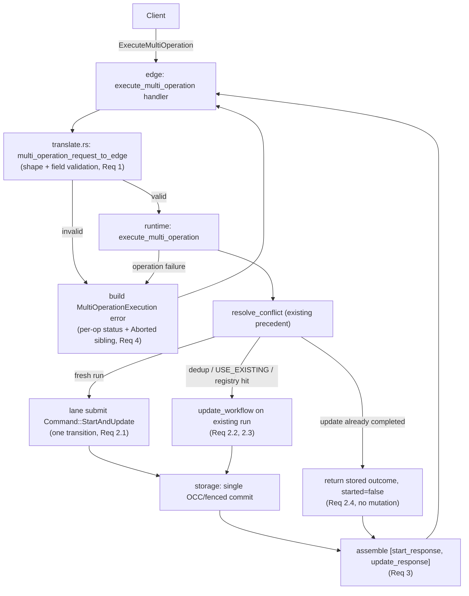

# Design Document: Multi-Operation API Conformance (Update-with-Start)

## Overview

`ExecuteMultiOperation` at `TEMPORAL_SERVER_COMPAT = 1.31.0` is exactly **Update-with-Start**: a
`[StartWorkflow, UpdateWorkflow]` pair against one workflow id. This design implements it as an edge
translation/validation layer over a runtime composition method, `TokeiraRuntime::execute_multi_operation`,
that mirrors the existing `signal_with_start_workflow` orchestration. The fresh-start path folds the
start and the update admission into a **single kernel transition** via a new
`Command::StartAndUpdate`, directly analogous to the existing `Command::SignalWithStart`. Attach paths
route the update to an existing run through the existing update machinery. No sequential
independent-mutation implementation is acceptable — that would break atomicity (Requirement 2,
Property 3).

## Ground-Truth References

Every behavioural decision below is anchored to the targeted release, per AGENTS.md §8.

- **Wire shape:** `proto/upstream/temporal/api/workflowservice/v1/request_response.proto`
  (`ExecuteMultiOperationRequest`/`Response`, `Operation` two-arm oneof), `service.proto:111-121`
  (atomic; top-level status = first failing op), `errordetails/v1/message.proto`
  (`MultiOperationExecutionFailure`), `failure/v1/message.proto` (`MultiOperationExecutionAborted`).
- **Frontend validation/conversion:** `service/frontend/workflow_handler.go:704-895 @ v1.31.0`;
  error constants `service/frontend/errors.go:81-83,129 @ v1.31.0`.
- **History executor (paths, retry, dedup):** `service/history/api/multioperation/api.go @ v1.31.0`.
- **tokeira precedent:** `Command::SignalWithStart` (`crates/tokeira-kernel/src/command.rs`),
  `apply_signal_with_start` (`crates/tokeira-kernel/src/kernel.rs`), `signal_with_start_workflow`
  (`crates/tokeira-runtime/src/runtime/lifecycle.rs`), `update_workflow`
  (`crates/tokeira-runtime/src/runtime/query.rs`).

## Scope and Non-Goals

- **In scope:** the `[StartWorkflow, UpdateWorkflow]` composition and every path it takes (fresh-start,
  dedup-attach, USE_EXISTING-attach, registry-attach, already-completed no-op), the structured failure,
  and the update wait-stage semantics.
- **Out of scope — no signal variant.** The `Operation` oneof has no signal arm at v1.31.0. Any signal
  multi-operation is not part of the contract and is not built.
- **Cross-run is not a separate case.** The request carries one workflow id (Req 1.5 enforces
  consistency), so "cross-run atomicity" does not arise — it is folded into workflow-id validation, not
  modelled as its own rejection path.
- **Future operation variants** (should the release ever expand the oneof) are rejected by exhaustive
  matching in translation until mapped; they are not speculatively handled.

## Architecture

## Kernel Decision: `Command::StartAndUpdate` (raised, not silent)

The conformance conventions say "No kernel additions … a fix that seems to need the kernel is a signal
to stop and raise it" (`docs/testing/functional-conformance-harness.md`), and
`docs/readiness/command-surface.md` classifies `ExecuteMultiOperation` as "Runtime composes … Not a
kernel primitive." That classification is accurate for *orchestration* (path selection, wait-stage,
error assembly all live in the runtime/edge) but understates the fresh-start leg.

**Why a kernel command is required.** The fresh-start path must create the run **and** admit the update
in one atomic transition, so there is no observable state where the workflow exists without its admitted
update (Req 2.1, Property 3). In tokeira, one lane submit = one `Command` = one `Transition` = one
commit. Two commands (`Start` then `Update`) would be two transitions and two commits — a partial-commit
hazard on the exact seam this RPC exists to make atomic. The blessed precedent for this is already in
the kernel: `Command::SignalWithStart` / `apply_signal_with_start` folds `WorkflowExecutionStarted` plus
the composed event into one transition for exactly the same reason (never lose the composed event to a
race).

**Decision.** Add `Command::StartAndUpdate(StartAndUpdateRequest)` and `apply_start_and_update`,
mirroring `Command::SignalWithStart` / `apply_signal_with_start`: emit `WorkflowExecutionStarted`, admit
the update (populating `admitted_updates` and emitting `WorkflowExecutionUpdateAdmitted`), and schedule
the first workflow task — all in one `Transition`. This is a **deliberate, raised** kernel addition,
justified by the SignalWithStart precedent and required for atomicity. It stays pure (no I/O/async),
honouring the kernel-purity rule. `command-surface.md` is updated to reflect the composed-start kernel
command alongside SignalWithStart, so the reconciliation is recorded rather than left as apparent
contradiction.

Attach paths (Req 2.2–2.4) require **no** kernel addition: they reuse the existing `Command::Update`
apply logic against an already-loaded run, exactly as the runtime `update_workflow` already does.

## Components and Interfaces

- **`crates/tokeira-edge/src/grpc/workflow_service.rs`** — replace the
  `execute_multi_operation` stub: translate+validate, call the runtime, serialize the ordered response
  or the structured failure.
- **`crates/tokeira-edge/src/grpc/translate.rs`** — free functions, mirroring the SignalWithStart pair:
  - `multi_operation_request_to_edge(req) -> Result<EdgeUpdateWithStartRequest, ProtoConversionError>`:
    shape validation (exactly `[Start, Update]`), start restrictions (cron/eager/start-delay), update
    restrictions (first_execution_run_id / run_id), per-op namespace match, workflow-id consistency.
    Non-shape start/update field validation reuses the existing
    `start_workflow_request_to_edge` / update translation helpers so standalone parity is automatic
    (Req 1.6).
  - `multi_operation_response_to_proto(resp) -> ExecuteMultiOperationResponse`: build
    `[start_workflow, update_workflow]` in order (Req 3).
  - `multi_operation_error_to_status(err) -> tonic::Status`: build the `MultiOperationExecution`
    failure — per-op `OperationStatus` list, `Aborted` + `MultiOperationExecutionAborted` on the
    non-failing sibling, top-level code = first failing op, message "Update-with-Start could not be
    executed." (Req 4). This requires attaching a gRPC error **detail**; see Error Handling.
- **`crates/tokeira-edge/src/grpc/runtime_adapter.rs`** — add the adapter method bridging the edge
  request to `TokeiraRuntime::execute_multi_operation`, mirroring `signal_with_start_workflow`.
- **`crates/tokeira-runtime/src/runtime/lifecycle.rs`** — add `execute_multi_operation`:
  1. `resolve_conflict` on the start leg (reuses existing conflict/reuse resolution).
  2. `Absent | ClosedAllowReuse | TerminateAndStart` → submit `Command::StartAndUpdate`, then drive the
     update leg's wait-stage on the freshly created run.
  3. `UseExisting | DedupRetried` (or update id already present in the run's registry) → `update_workflow`
     on the existing run (attach), start response `started = false`.
  4. Existing run whose requested update id already **completed** → return the stored outcome with
     `started = false` and current `status`, no mutation (Req 2.4).
  Returns a typed result carrying both legs' outcomes plus `started`/`status`, or a typed
  multi-operation error identifying which leg failed.
- **`crates/tokeira-runtime/src/runtime/query.rs`** — reused unchanged: the update leg's wait-stage
  lifecycle (`update_workflow`, `UpdateWaitPolicy`, `UpdateRegistry`).
- **`crates/tokeira-kernel/src/command.rs` / `kernel.rs`** — add `Command::StartAndUpdate` +
  `apply_start_and_update` (see Kernel Decision).
- **`crates/tokeira-storage`** — no new interface; the composed transition commits through the existing
  OCC/fencing path exactly like any other transition.
- **`crates/tokeira-compatibility/src/matrix.rs`** — reclassify
  `WorkflowService.ExecuteMultiOperation` from unsupported to supported with evidence once landed.
- **`docs/readiness/command-surface.md`** — record the composed-start kernel command.

## Correctness Properties

### Property 1: Validate Before Mutate
For any request that fails shape or field validation (Req 1), no runtime mutation method is invoked.
**Validates:** Req 1.1–1.6, 2.5.

### Property 2: Ordered, Well-Formed Response
For any successful request, the response is exactly `[StartWorkflowExecutionResponse,
UpdateWorkflowExecutionResponse]` in that order, with `started`/`status` consistent with the path taken.
**Validates:** Req 3.1–3.3.

### Property 3: Atomic, No Partial Commit
For the fresh-start path, the run and the admitted update are committed in one transition; an injected
failure at any point leaves neither a started run without its admitted update nor an admitted update
without its run. Attach paths never start a new run.
**Validates:** Req 2.1, 2.6.

### Property 4: Structured Failure Fidelity
For any post-validation failure, the returned error carries one per-operation status in request order,
the non-failing operation is `Aborted` with the abort detail, and the top-level code equals the first
failing operation's code.
**Validates:** Req 4.1–4.6.

### Property 5: Dedup / Already-Complete Idempotence
Re-issuing an Update-with-Start whose start dedupes or whose update already completed produces the same
observable result and performs no additional mutation.
**Validates:** Req 2.2, 2.4.

## Error Handling

The structured failure is the load-bearing detail and must not collapse to a flat status.

| Condition | First-failing op status | Sibling status | Top-level gRPC code |
|---|---|---|---|
| Not exactly `[Start, Update]` | — (pre-composition) | — | `INVALID_ARGUMENT` ("Operations have to be exactly [Start, Update].") |
| Prohibited start field (cron/eager/delay) | — (pre-composition) | — | `INVALID_ARGUMENT` (per-field message) |
| Prohibited update field (first_execution_run_id / run_id) | — (pre-composition) | — | `INVALID_ARGUMENT` (per-field message) |
| Namespace mismatch | — (pre-composition) | — | `INVALID_ARGUMENT` |
| Workflow-id inconsistent | start: inconsistency error | update: `Aborted` | `INVALID_ARGUMENT` |
| Start conflict (already started, `Fail` policy) | start: `AlreadyExists` | update: `Aborted` | `ALREADY_EXISTS` |
| Update rejected/failed | update: its own error | start: `Aborted` | update's code |
| OCC/fencing conflict on commit | failing op: existing conflict mapping | other: `Aborted` | that op's mapped code |

Notes:
- Pre-composition validation errors (rows 1–4) are returned as a plain gRPC status before any per-op
  status exists — matching the frontend, which returns these directly (`workflow_handler.go:718-726`).
  The workflow-id inconsistency and later rows are returned as the structured `MultiOperationExecution`
  failure (`workflow_handler.go:766-785`).
- **gRPC error detail transport.** The `MultiOperationExecutionFailure` detail must ride on the gRPC
  `Status` `details` (google.rpc.Status). Confirm the edge's tonic/connect-rust error path can attach a
  typed detail; if the current edge status mapping drops details, extend it (this is edge work, not a
  new abstraction). This is the single most likely implementation snag — the corpus/SDK unpacks the
  per-op errors from the detail, so a detail-less status will fail `TestUpdateWithStartSuite`.

## Update Wait-Stage Semantics

The update leg reuses `TokeiraRuntime::update_workflow`'s wait-stage lifecycle unchanged: the requested
`UpdateWaitPolicy` (Admitted / Accepted / Completed) governs when the RPC returns, and the update
response carries the reached stage and outcome. For the fresh-start path, the update is admitted inside
`Command::StartAndUpdate`; the runtime then waits for the requested stage on the new run via the same
`UpdateRegistry` oneshot path standalone update uses. This keeps Update-with-Start and standalone Update
behaviourally aligned (Req 5).

## Closing-Workflow Retry — Scope Decision (Req 6)

Upstream retries the whole operation **once** when the update is aborted by a closing workflow, gated by
`EnableUpdateWithStartRetryOnClosedWorkflowAbort` and
`EnableUpdateWithStartRetryableErrorOnClosedWorkflowAbort`, and converts the second op's `NotFound` to
`Aborted` for client retry (`multioperation/api.go:127-160 @ v1.31.0`). Both gates are pinned constants
at their v1.31.0 defaults (config-as-constant convention), not tokeira knobs.

**Decision for the first landing:** implement the primary paths (fresh-start, all attach paths,
structured failure) first; **classify-skip** the specific `TestUpdateWithStartSuite` sub-case(s) that
exercise the closing-workflow retry, with a cited reason in the conformance skip registry, and track the
retry path as a follow-up within this spec (task 6). Rationale: the retry is a narrow race behaviour on
a closing workflow; landing it depends on the primary paths existing first, and skipping it honestly
(cited) is preferable to a guessed implementation behind a green check. This is a deliberate,
documented deferral, not an omission.

## Testing Strategy

- **Tier-1 (hermetic, `cargo test`):**
  - `translate.rs` unit tests: every validation branch in Req 1 (exact-2/order, each prohibited start
    field, each prohibited update field, namespace mismatch, workflow-id inconsistency), plus the happy
    path.
  - Property 1 (Validate Before Mutate): a mock runtime asserts no mutation method is called for each
    invalid request class.
  - Property 2/3 (ordered response, no partial commit): runtime tests over `InMemoryStore` for
    fresh-start, dedup-attach, USE_EXISTING-attach, and already-completed no-op; assert the produced
    transition count (exactly one for fresh-start; zero for already-completed) and response shape.
  - Property 4 (structured failure): assert per-op statuses, `Aborted` sibling, first-failing top-level
    code, and message for start-conflict and update-rejected cases.
  - Kernel: `apply_start_and_update` golden transition test (mirrors the existing
    `apply_signal_with_start` golden test) — one transition emitting `WorkflowExecutionStarted` +
    `WorkflowExecutionUpdateAdmitted` + scheduled WFT.
- **Tier-2 (operator-invoked conformance corpus):** the gating signal is
  `TestUpdateWithStartSuite` / `TestUpdateWorkflowSdkSuite` (functional-test-order.md Tier 2 #12) and
  the `InternalTaskQueue/multiOp` leaf. In-scope sub-cases: fresh-start, dedup, USE_EXISTING attach,
  running-workflow attach, already-completed, and the per-op `Aborted` failure. Classify-skip (cited):
  the closing-workflow-retry sub-case(s) per the scope decision above, and any sub-case reachable only
  via `OverrideDynamicConfig` (systemic Shape-2 harness gap, already an out-of-scope skip class).
