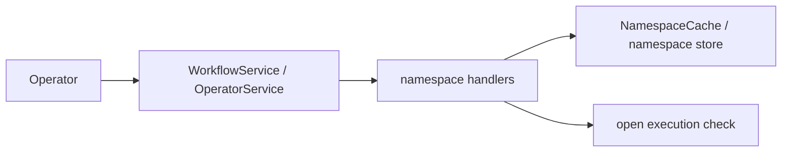

# Design Document: Namespace Full Lifecycle Conformance

## Overview

Namespace register/describe/list exist; update, deprecate, and delete are stubbed. This design extends the namespace store with lifecycle status and config mutation while keeping destructive history deletion out of scope.

## Dependencies and Non-Goals

- Depends on an authoritative open-execution check that does not rely solely on stale visibility projection.
- Does not implement global namespace replication or failover; multi-cluster/global namespace inputs are invalid in Tokeira's single-cluster mode.
- Does not physically delete workflow histories; deletion is a namespace tombstone unless a future destructive retention spec adds history deletion.
- All namespace cache entries must be invalidated or versioned on update, deprecate, and delete.

## Tombstone Semantics

Deleted namespaces are hidden from normal list results, remain unavailable for
new starts, and may be described only if a future include-deleted option is
added. Recreate-with-same-name is rejected until explicit recreate semantics are
specified.

## Architecture

## Components and Interfaces

- `crates/tokeira-edge/src/grpc/workflow_service.rs`: implement `update_namespace` and `deprecate_namespace`.
- `crates/tokeira-edge/src/grpc/operator_service.rs`: implement `delete_namespace`.
- `crates/tokeira-edge/src/namespace_cache.rs`: add update/deprecate/delete capabilities if missing.
- `crates/tokeira-edge/src/translate/mod.rs` and `grpc/translate.rs`: add free translation functions for namespace update/delete requests.
- `crates/tokeira-edge/src/workflow_service.rs`: enforce deprecated namespace start rejection.

## Correctness Properties

### Property 1: Namespace Lifecycle Monotonicity

Active namespaces can become deprecated or deleted; deleted namespaces do not silently become active without explicit recreate semantics.

**Validates:** Requirements 2.1, 3.4.

### Property 2: Deprecated Read/Write Split

Deprecated namespaces reject new starts but continue to allow reads.

**Validates:** Requirements 2.2, 2.3.

### Property 3: Safe Delete

Namespace deletion is rejected when open executions exist unless force-delete semantics are implemented.

**Validates:** Requirements 3.1, 3.2, 3.5.

## Error Handling

| Condition | Error | gRPC status |
|---|---|---|
| Unknown namespace | `NamespaceNotFound` | `NOT_FOUND` |
| Invalid namespace config | `BadRequest` | `INVALID_ARGUMENT` |
| Multi-cluster replication/global namespace config | `BadRequest` | `INVALID_ARGUMENT` |
| Open executions on delete | precondition error | `FAILED_PRECONDITION` |

## Testing Strategy

- Unit tests for namespace store lifecycle transitions.
- gRPC tests for update/deprecate/delete not-found and success.
- Integration tests that deprecated namespaces reject start but allow describe/list.
- Property tests for lifecycle monotonicity and safe delete.
