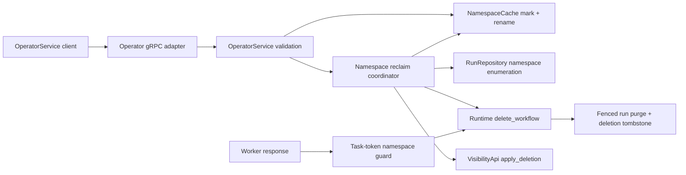

# Design Document: Namespace Full Lifecycle Conformance

## Overview

This design extends Tokeira's namespace registry from register/describe/list support to
the full single-cluster lifecycle contract, including v1.31.0 namespace deletion and
task-token namespace fencing. The public request/response shape is defined by the
vendored Temporal API. Mark-and-rename ordering, asynchronous reclaim, delay precedence,
and error behaviour are derived from Temporal server v1.31.0.

No kernel change is involved. Namespace metadata belongs to the compatibility/operator
plane; authoritative run enumeration and deletion belong to storage/runtime; task-token
namespace comparison belongs to edge admission.

## Dependencies and Non-Goals

### Owning relationships

- `RunRepository` owns authoritative enumeration of runs by namespace.
- The existing runtime `delete_workflow` path owns fenced per-run deletion and deletion
  tombstone creation.
- `VisibilityApi::apply_deletion` removes each deleted run from the visibility projection.
- `NamespaceCache` owns namespace metadata lookup, atomic mark-and-rename, and final
  tombstone removal for the current in-memory namespace registry.

### Non-goals

- Global namespace replication, failover, and passive-cluster deletion are not supported.
- Temporal's internal system workflows and activities are not reproduced; Tokeira uses
  an original runtime coordinator with the same public ordering and outcomes.
- The conformance-only dynamic-config bridge does not grow a string-list type for
  `worker.protectedNamespaces`; Tokeira pins the v1.31.0 empty default and separately
  protects its system namespace.

## Architecture

The synchronous path validates the selector, resolves the namespace, marks it deleted,
renames it while preserving its ID, starts an asynchronous reclaim job, and returns the
temporary name. The reclaim job enumerates authoritative runs rather than trusting
visibility, deletes each through the existing fenced runtime path, applies visibility
deletions, waits the selected post-reclaim delay, and removes the tombstone.



## Components and Interfaces

### Namespace registry (`crates/tokeira-edge/src/namespace_cache.rs`)

Extend the registry with stable-ID lookup and atomic lifecycle mutations:

```rust
async fn get_by_id(&self, namespace_id: &str) -> Result<Option<ResolvedNamespace>>;
async fn mark_deleted_and_rename(
    &self,
    current_name: &str,
    deleted_name: &str,
) -> Result<ResolvedNamespace>;
async fn remove(&self, name: &str) -> Result<Option<ResolvedNamespace>>;
```

`ResolvedNamespace.namespace_id` is populated before any rename. The deleted-name
generator starts with the first five namespace-ID characters and lengthens the prefix on
collision, matching `GenerateDeletedNamespaceNameActivity`
(`service/worker/deletenamespace/activities.go @ v1.31.0`). Normal list calls filter
deleted records unless `include_deleted` is explicitly requested.

### Authoritative run enumeration (`crates/tokeira-storage/src/api.rs`)

Add a semantic repository query:

```rust
async fn list_runs_for_namespace(&self, namespace_id: NamespaceId) -> Result<Vec<RunKey>>;
```

The in-memory implementation filters authoritative mutable-state records. The DSQL
implementation queries the authoritative workflow-hot table by `namespace_id`. Results
are sorted by `RunKey` before returning so orchestration and tests are deterministic.

### Reclaim coordinator (`crates/tokeira-edge/src/operator_service.rs` and
`crates/tokeira-edge/src/workflow_service.rs`)

`OperatorService` receives a `NamespaceDeletionApi` implementation. The production
implementation is backed by the already-wired `WorkflowService`, repository, runtime,
and visibility API. It enumerates the namespace repeatedly until empty, deletes every
run through `WorkflowRuntimeApi::delete_workflow`, and applies the returned projection
tombstone. Re-enumeration closes the race with work admitted immediately before the
namespace mark became visible.

The coordinator runs in a spawned task. A failure is logged and leaves the namespace
tombstone intact, making incomplete reclaim observable and retryable rather than falsely
reporting final deletion.

### Operator gRPC (`crates/tokeira-edge/src/grpc/operator_service.rs`)

Translate the proto request without normalising field presence. Validate exactly one of
name or ID, preserve explicit duration presence, and delegate to `OperatorService`.
The response carries the temporary deleted namespace name.

### Workflow namespace reads (`crates/tokeira-edge/src/grpc/workflow_service.rs` and
`crates/tokeira-edge/src/workflow_service.rs`)

`DescribeNamespace` distinguishes name from ID and resolves ID through `get_by_id`
without the ordinary active-namespace interceptor, because a deleted tombstone must be
describable by ID until final removal. `ListNamespaces` filters deleted entries by
default.

### Task-token namespace guard (`crates/tokeira-edge/src/workflow_service.rs`)

After decoding a task token, load its run to resolve the authoritative namespace ID. A
non-empty request namespace must resolve to the same ID. Reject mismatch before consuming
query-result senders or invoking runtime mutation. An empty request namespace leaves the
task-token namespace authoritative, matching `extractNamespace`
(`common/rpc/interceptor/namespace_validator.go @ v1.31.0`).

## Data Models

### `ResolvedNamespace`

- `name`: mutable current name; changes to the deleted temporary name during deletion.
- `namespace_id`: stable identity; populated before rename and never derived from the
  temporary name.
- `deleted`: lifecycle tombstone flag exposed as `NAMESPACE_STATE_DELETED`.
- Existing config fields remain unchanged by delete.

### `DeleteNamespaceRequest` edge DTO

- `namespace: Option<String>`: set only for a non-empty name selector.
- `namespace_id: Option<String>`: set only for a non-empty ID selector.
- `namespace_delete_delay: Option<std::time::Duration>`: `None` means use the pinned
  default; `Some(Duration::ZERO)` remains distinguishable from absence.

## Correctness Properties

### Property 1: Selector validation is mutation-free

*For any* namespace registry and selector pair, requests with zero or two non-empty
selectors return `INVALID_ARGUMENT` and leave the registry byte-for-byte equivalent to
its pre-request state; requests with exactly one selector resolve the same stable
namespace identity by name or ID.

**Validates: Requirements 3.1, 3.2, 3.3, 3.4**

### Property 2: Mark-and-rename preserves identity

*For any* valid namespace name, stable ID, and finite set of occupied names, successful
deletion marking produces a collision-free deleted name using the shortest available ID
prefix of length at least five, preserves every config field and the stable namespace
ID, sets state `DELETED`, and removes the original name lookup.

**Validates: Requirements 3.6, 3.7, 3.8, 3.9**

### Property 3: Namespace reclaim is complete and isolated

*For any* finite authoritative set of runs partitioned across namespaces, reclaim of one
namespace deletes every run in that namespace through the run-deletion path and leaves
all runs in other namespaces unchanged.

**Validates: Requirements 3.10, 3.11, 3.16**

### Property 4: Delete-delay precedence controls final removal

*For any* valid explicit non-negative delay and any cluster default, an explicit delay is
the selected delay; when absent, the pinned default is selected; the tombstone remains
addressable by stable ID before reclaim plus the selected delay completes and is absent
after completion.

**Validates: Requirements 3.9, 3.12, 3.13, 3.14, 3.15, 3.17**

### Property 5: Task-token namespace mismatch is side-effect free

*For any* task-token namespace and non-empty request namespace, equal identities permit
normal processing while unequal identities return the v1.31.0 `INVALID_ARGUMENT`; every
rejected mismatch leaves runtime and edge-side response state unchanged.

**Validates: Requirements 4.1, 4.2, 4.3, 4.4**

### Property 6: Namespace configuration updates round-trip

*For any* supported single-cluster namespace configuration and any valid partial update,
the stored and subsequently described record equals the reference-model merge of the
old record and the fields selected by the request; an invalid global or multi-cluster
update leaves the prior record unchanged.

**Validates: Requirements 1.1, 1.2, 1.3, 1.4, 1.5, 1.6, 1.7**

### Property 7: Deprecated namespace read/write split

*For any* active namespace, deprecation is monotonic and idempotent; after deprecation,
all new-start admission paths reject with `FAILED_PRECONDITION` while namespace and
workflow read paths continue to resolve the existing data.

**Validates: Requirements 2.1, 2.2, 2.3, 2.4**

## Error Handling

| Condition | Internal error | External status/code |
|---|---|---|
| No selector | `EdgeError::BadRequest` | `INVALID_ARGUMENT` |
| Name and ID both set | `EdgeError::BadRequest` | `INVALID_ARGUMENT`, exact v1.31.0 message |
| Unknown name or ID | `EdgeError::NamespaceNotFound` | `NOT_FOUND` / `NamespaceNotFound` |
| System namespace | `EdgeError::FailedPrecondition` | `FAILED_PRECONDITION` |
| Mark-and-rename storage failure | `EdgeError::Internal` | `INTERNAL` |
| Background reclaim failure | structured error log; tombstone retained | RPC already returned success; final removal does not occur |
| Task-token namespace mismatch | `EdgeError::BadRequest` | `INVALID_ARGUMENT`, exact v1.31.0 message |

## Testing Strategy

- **Property tests (required):** implement Properties 1–7 with `proptest`, at least 100
  cases each, using a simple reference registry/run-set model.
- **Unit tests:** exact both-selector message, ID-only lookup, five-character deleted
  suffix, collision extension, system-namespace rejection, explicit-zero delay, and
  default-zero delay.
- **Storage tests:** in-memory namespace enumeration and DSQL query tests where the DSQL
  test harness is available.
- **Wire integration tests:** operator delete by name and ID, immediate deleted-state
  describe, eventual namespace-not-found, deletion with open and closed workflows, and
  task-token namespace mismatch followed by a successful correctly-namespaced retry.
- **Functional corpus:** two clean consecutive runs of `TestNamespaceSuite` and
  `TestNamespaceInterceptorTestSuite`, with only harness-internal leaves classified in
  the conformance skip registry.
