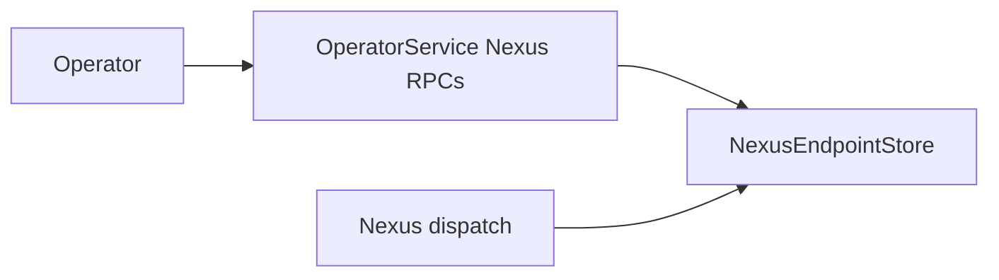

# Design Document: Nexus Admin API Conformance

## Overview

Nexus task transport exists, but endpoint administration is stubbed. This design adds a durable endpoint registry behind OperatorService and exposes it to runtime dispatch through a neutral trait.

## Dependencies and Non-Goals

- Non-goal: implementing `PollNexusTaskQueue`, `RespondNexusTaskCompleted`, `RespondNexusTaskFailed`, or full Nexus operation lifecycle.
- Non-goal: guaranteeing immediate runtime cache invalidation stronger than the registry freshness contract defined here.
- Runtime dispatch may read endpoint registry through a trait, but endpoint CRUD remains operator/admin registry work.

## Storage Model

Endpoint records have a server-authored endpoint id, unique name index, endpoint
spec, monotonically increasing version token, create/update timestamps, and an
optional tombstone. List pagination uses stable `(name, id)` ordering.

## Architecture

## Components and Interfaces

- `crates/tokeira-edge/src/grpc/operator_service.rs`: implement Nexus endpoint RPC handlers.
- `crates/tokeira-edge/src/grpc/translate.rs` or operator translation module: free translation functions for endpoint messages.
- Neutral store trait in a shared crate or runtime-owned module, avoiding edge-to-runtime cycles.
- Runtime Nexus dispatch uses the registry trait for endpoint resolution.

## Correctness Properties

### Property 1: CRUD Round Trip

Create followed by get/list returns the same endpoint fields and server-authored version.

**Validates:** Requirements 1.1, 1.2, 1.5.

### Property 2: Optimistic Update Safety

Updates/deletes with stale versions do not mutate endpoint state.

**Validates:** Requirements 1.3, 1.4, 2.4.

### Property 3: Runtime Visibility

Runtime dispatch observes created endpoints and stops observing deleted endpoints.

**Validates:** Requirements 3.1, 3.2.

## Error Handling

| Condition | Error | gRPC status |
|---|---|---|
| Missing endpoint | endpoint not found | `NOT_FOUND` |
| Duplicate name | already exists | `ALREADY_EXISTS` |
| Invalid spec | bad request | `INVALID_ARGUMENT` |
| Stale version | conflict | `ABORTED` |
| Unsupported field | unimplemented | `UNIMPLEMENTED` |

## Testing Strategy

- Store unit tests for CRUD/version behavior.
- OperatorService gRPC tests for all five RPCs.
- Property tests for optimistic update safety and pagination.
- Runtime integration test that dispatch resolves a created endpoint.
