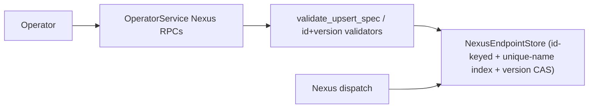

# Design Document: Nexus Admin API Conformance

## Overview

Nexus task transport exists, but the OperatorService endpoint-admin RPCs are bare `UNIMPLEMENTED`
stubs (`crates/tokeira-edge/src/grpc/operator_service.rs:134-168`). This design adds a durable
endpoint registry behind OperatorService and exposes it to runtime dispatch through a neutral trait.

All behaviour is ground-truthed to `v1.31.0` (`AGENTS §8`) and cited inline. The two authoritative
loci are `service/frontend/nexus_endpoint_client.go` (validation, translation, reads, list) and
`service/matching/nexus_endpoint_client.go` (table owner: id/version authoring, duplicate detection,
version CAS).

## Internal-topology deviation (observable contract preserved)

v1.31.0 splits the work: the **frontend** validates and forwards Create/Update/Delete to the
**matching** service that owns the `nexus_endpoints` table, while Get/List read straight from
persistence for read-after-write consistency (`nexus_endpoint_client.go:30-34 @ v1.31.0`). Tokeira
collapses the table owner into a single `NexusEndpointStore` reached behind OperatorService. This is
an internal-topology deviation only — the observable error codes, messages, server-authored
id/version semantics, and read-after-write behaviour MUST be identical to v1.31.0. The deviation is
recorded here so it is not mistaken for an oversight and "fixed" by re-introducing a frontend/matching
split tokeira does not have.

## Dependencies and Non-Goals

- Non-goal: `PollNexusTaskQueue`, `RespondNexusTaskCompleted`, `RespondNexusTaskFailed`, the Nexus
  HTTP handler, or full Nexus operation lifecycle (owned by `edge-nexus-task-transport`,
  `kernel-nexus-operations`, `runtime-nexus-dispatch`, `nexus-retry-policy`, `nexus-multi-cluster`).
- Non-goal: runtime cache-invalidation stronger than the registry freshness contract here.
- Endpoint CRUD remains operator/admin registry work; runtime dispatch only *reads* the registry.

## Storage Model

Endpoint records carry: a server-authored UUID `id`; a unique `name` index; the endpoint `spec`
(name, description, target — Worker `{namespace_id, task_queue}` or External `{url}`); a
monotonically increasing `version` token; `created_time` / `last_modified_time`; and an optional
tombstone. List pagination uses stable `(name, id)` ordering.

**Server-authored fields (matching the table owner):**
- `id`: a UUID authored on create (v1.31.0 validates ids with `uuid.Parse`, implying UUID authorship).
- `version`: starts at the table owner's initial value and increments on each mutation; it is the
  optimistic-concurrency token (`service/matching/nexus_endpoint_client.go:35,155 @ v1.31.0`).

## Architecture

## Components and Interfaces

- `crates/tokeira-edge/src/grpc/operator_service.rs`: implement the five Nexus endpoint RPC handlers
  (replace the `UNIMPLEMENTED` stubs).
- `crates/tokeira-edge/src/grpc/translate.rs` (or an operator translation module): free translation
  functions for endpoint API↔domain messages, mirroring `apiSpecToPersistenceSpec` /
  `apiTargetToPersistenceTarget` / `endpointPersistedEntryToExternalAPI @ v1.31.0`.
- A neutral `NexusEndpointStore` trait at a boundary that avoids an edge↔runtime cycle, with an
  in-memory implementation (the default-suite store; no live AWS/DSQL).
- Runtime Nexus dispatch resolves endpoints through the same trait — **this replaces the existing
  static registry** (see below).

### Runtime endpoint registry: from static to live (Req 3)

`runtime-nexus-dispatch` shipped a static `NexusEndpointRegistry` holding an immutable
`Arc<HashMap<String, NexusEndpointConfig>>` built once at construction
(`crates/tokeira-runtime/src/nexus.rs:72-86`), defaulted empty and wired as
`NexusEndpointRegistry::default()` (`runtime/mod.rs:337-340`). Its `resolve(&self, name) ->
Option<&NexusEndpointConfig>` is consumed in the hot dispatch path by `publisher.rs`.

This design replaces that backing with the live `NexusEndpointStore`:
- The store is the single source of truth; the registry resolves against it.
- Because a store/lock-backed lookup cannot return a borrow, `resolve` changes to return an **owned**
  `NexusEndpointConfig` (clone-on-read; endpoint configs are small). The `publisher.rs` call site is
  updated to take the owned value.
- The data models already align: `EndpointTarget::{External { address }, Worker { namespace_id,
  task_queue }}` (`nexus.rs:55-64`) matches the admin spec's target variants, so the store record's
  target maps directly to `NexusEndpointConfig`.
- The store keys dispatch resolution by endpoint **name** (the registry's existing key), independent
  of the admin id/version metadata.

## Validation (ground truth — `validateUpsertSpec`, `getEndpointNameIssues`, id/delete validators @ v1.31.0)

Validation accumulates issues via a `RequestIssues`-equivalent and returns **one** `InvalidArgument`
concatenating them (not fail-fast). The one exception is the Worker-target namespace-existence check,
which returns `FAILED_PRECONDITION` **immediately** (it is not accumulated into the issues bag).

**Name** (`getEndpointNameIssues`): non-empty → else "endpoint name not set" (returned alone);
length ≤ `NexusEndpointNameMaxLength` → else "endpoint name exceeds length limit of N";
matches `^[a-zA-Z][a-zA-Z0-9\-]*[a-zA-Z0-9]$` → else "endpoint name must match the regex: …".

**Target variant** (`validateUpsertSpec`): unset → "empty target variant" (returned alone after name
issues) or "empty endpoint target" for the default arm;
- Worker: `namespace == ""` → "target namespace not set"; else namespace-not-found →
  **`FailedPrecondition`** "could not verify namespace referenced by target exists: …" (immediate);
  task queue via `tqid.Validate(tq, MaxIDLengthLimit)` → else "invalid target task queue: …".
- External: `url == ""` → "empty target URL"; `len(url) > NexusEndpointExternalURLMaxLength` →
  "target URL length exceeds limit of N"; unparseable → "invalid target URL: …"; scheme ∉
  {http, https} → "invalid target URL scheme: …, expected http or https".

**Description**: `size > NexusEndpointDescriptionMaxSize` → "description size exceeds limit of N".

**Id (Get/Delete)** (`getEndpointIDIssues`): empty → "endpoint ID not set"; non-UUID →
"malformed endpoint ID: …". **Delete** also: `version <= 0` → "endpoint version is non-positive".

## Data Models

The endpoint record persisted by `NexusEndpointStore` (collapsed from v1.31.0's matching-owned
`persistencespb.NexusEndpointEntry` + `NexusEndpointSpec` — `service/matching/nexus_endpoint_client.go`
and `apiSpecToPersistenceSpec @ v1.31.0`):

| Field | Type | Authored by | Notes |
|---|---|---|---|
| `id` | UUID (string) | server (create) | registry key; validated with `uuid.Parse` on Get/Delete |
| `version` | int64 | server (table owner) | monotonic; optimistic-concurrency token; `> 0` |
| `spec.name` | string | client | unique-name index; regex + length validated |
| `spec.description` | payload/bytes | client | size ≤ `NexusEndpointDescriptionMaxSize` |
| `spec.target` | enum variant | client | `Worker { namespace_id, task_queue }` or `External { url }` |
| `created_time` | timestamp | server | set on create |
| `last_modified_time` | timestamp | server | bumped on update |

Wire ↔ domain translation mirrors `apiSpecToPersistenceSpec` / `apiTargetToPersistenceTarget`
(Worker target resolves `namespace` → `namespace_id`) and `endpointPersistedEntryToExternalAPI`
(`namespace_id` → `namespace`), all `@ v1.31.0`. The External target persists the raw `url`; the
Worker target persists the resolved `namespace_id` (not the name).

## Correctness Properties

### Property 1: CRUD Round Trip

Create followed by get/list returns the same endpoint fields and the server-authored id/version.

**Validates: Requirements 1.1, 1.2, 1.5**

### Property 2: Optimistic Update Safety

Update/delete with a version `!=` the stored version returns `FAILED_PRECONDITION` and does not
mutate endpoint state; a matching version mutates and increments the version.

**Validates: Requirements 1.3, 1.4, 2.7**

### Property 3: Validation Totality and Code Fidelity

Each invalid-field class returns the v1.31.0 code (`INVALID_ARGUMENT` for spec/id issues,
`FAILED_PRECONDITION` for namespace-not-found and version mismatch, `ALREADY_EXISTS` for duplicate
name, `NOT_FOUND` for missing id) with the cited message.

**Validates: Requirements 2.1, 2.2, 2.3, 2.4, 2.5, 2.6, 2.7, 2.8**

### Property 4: Runtime Visibility

Runtime dispatch observes created endpoints and stops observing deleted endpoints (against the
live, store-backed registry).

**Validates: Requirements 3.2, 3.3**

## Error Handling

| Condition | gRPC status | Verbatim message | Source @ v1.31.0 |
|---|---|---|---|
| Spec/name/url/description invalid | `INVALID_ARGUMENT` | accumulated issues (see Validation) | `nexus_endpoint_client.go validateUpsertSpec` |
| Id missing/malformed; delete version ≤ 0 | `INVALID_ARGUMENT` | "endpoint ID not set" / "malformed endpoint ID: …" / "endpoint version is non-positive" | `getEndpointIDIssues`, `validateDeleteRequest` |
| Worker target namespace not found | `FAILED_PRECONDITION` | "could not verify namespace referenced by target exists: …" | `validateUpsertSpec` |
| Duplicate name on create | `ALREADY_EXISTS` | "error creating Nexus endpoint. Endpoint with name %v already registered" | `matching/nexus_endpoint_client.go:100` |
| Update/delete missing id | `NOT_FOUND` | "error updating Nexus endpoint. endpoint ID %v not found" / "error deleting nexus endpoint with ID: %v" | `matching/nexus_endpoint_client.go:152,218` |
| Version mismatch (update/delete) | `FAILED_PRECONDITION` | "nexus endpoint version mismatch. received: %v expected %v" | `matching/nexus_endpoint_client.go:155-156` |
| List page size over max | `INVALID_ARGUMENT` | per `validatePageSize` | `nexus_endpoint_client.go` |

> **Do not use `ABORTED`.** An earlier draft mapped stale versions to `ABORTED`; v1.31.0 returns
> `FAILED_PRECONDITION`. There is no `UNIMPLEMENTED`-on-unsupported-field path in v1.31.0 endpoint
> admin — unsupported/invalid input is `INVALID_ARGUMENT` or `FAILED_PRECONDITION`. Both were removed.

## Configuration

Model the six limit knobs as tokeira config with the v1.31.0-faithful defaults (raise, do not
hardcode — Implementer mandate rule 3): name max 200 (`limit.endpointNameMaxLength`), external URL
max 4096 (`limit.endpointExternalURLMaxLength`), description max 20000 bytes
(`limit.endpointDescriptionMaxSize`), task-queue max 1000 (`limit.maxIDLength`), list default page
size 100 (`limit.endpointListDefaultPageSize`), list max page size 1000
(`limit.endpointListMaxPageSize`). All sourced from `common/dynamicconfig/constants.go @ v1.31.0`.

## Testing Strategy

- Store unit tests: CRUD round-trip, monotonic version, unique-name index, version CAS.
- OperatorService gRPC tests for all five RPCs, asserting the exact code **and** message per the
  Error Handling table.
- Property tests: optimistic update safety (P2), validation totality & code fidelity (P3),
  pagination stability (P1).
- Runtime integration test: dispatch resolves a created endpoint and stops resolving a deleted one
  (P4).
- No tests requiring live AWS/DSQL in the default suite (in-memory store).
