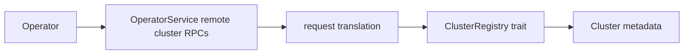

# Design Document: Remote Cluster API Conformance

## Overview

Remote cluster OperatorService RPCs are currently stubbed. This design adds a durable cluster registry that supports metadata CRUD for `AddOrUpdateRemoteCluster`, `RemoveRemoteCluster`, and `ListClusters` without activating replication, failover, or remote routing.

## Dependencies and Non-Goals

- Does not implement replication, namespace failover, remote task routing, history replication, remote membership, TLS credential provisioning, or cross-cluster consistency.
- Registry records are administrative metadata only; other components must not treat them as live replication peers.

## Architecture

## Components and Interfaces

- `crates/tokeira-edge/src/grpc/operator_service.rs`: implement the three RPC handlers.
- Operator translation module: add free translation functions for request/response messages.
- Existing cluster-info endpoint can read the same local cluster name.
- `crates/tokeira-storage`: add `ClusterRegistry` trait and in-memory/DSQL implementations.
- `crates/tokeira-runtime` or an operator-facing service wrapper: expose registry CRUD without coupling OperatorService to concrete storage.

## Correctness Properties

### Property 1: Registry CRUD Fidelity

Adding, updating, removing, and listing remote cluster records produces exactly the durable registry state requested.

**Validates:** Requirements 1.1-1.5.

### Property 2: Local Cluster Protection

Removing the local cluster is always rejected and leaves list output unchanged.

**Validates:** Requirements 2.4.

### Property 3: Registry Isolation

Remote cluster registry mutations do not submit workflow runtime commands, alter run history, or activate replication/failover behavior.

**Validates:** Requirements 3.1, 3.3.

## Error Handling

| Condition | Error | gRPC status |
|---|---|---|
| Empty cluster name | bad request | `INVALID_ARGUMENT` |
| Invalid address/access metadata | bad request | `INVALID_ARGUMENT` |
| Remove unknown remote cluster | not found | `NOT_FOUND` |
| Remove local cluster | bad request | `INVALID_ARGUMENT` |
| Invalid list page token | bad request | `INVALID_ARGUMENT` |

## Testing Strategy

- Store unit tests for add/update/remove/list.
- OperatorService gRPC tests for all three RPCs.
- Property tests for idempotence, local cluster protection, and pagination.
- Restart/recovery tests proving registry records reload from durable storage.
