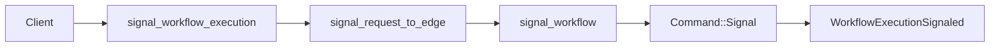

# Design Document: Signal Header API Conformance

## Overview

Signal headers and links are upstream request fields that are currently dropped. This design threads both fields through edge translation, kernel command application, durable history, and history serialization. The wire shape follows vendored `proto/upstream/`: `WorkflowExecutionSignaledEventAttributes` carries `header`, while links are emitted on the outer `HistoryEvent.links` field.

## Dependencies and Non-Goals

- Establishes the shared request metadata policy for headers and links used by start, schedule, batch, and other specs.
- SignalWithStart uses one request `header` and one request `links` list. On a new run they are applied to both `WorkflowExecutionStarted` and `WorkflowExecutionSignaled`; on an existing run they are applied to the signaled event.

## Architecture

## Components and Interfaces

- `crates/tokeira-edge/src/grpc/translate.rs`: translate proto headers using existing payload/header helpers.
- `crates/tokeira-edge/src/translate/mod.rs`: add header/link fields to signal DTOs if missing.
- `crates/tokeira-edge/src/translate/to_internal.rs`: map signal DTOs to `tokeira_kernel::SignalRequest`.
- `crates/tokeira-kernel/src/command.rs` and `event.rs`: add signal header/link support only as deterministic data fields. Header belongs to the signaled-event attributes; links are modeled separately so the serializer can lift them to the outer event.
- `crates/tokeira-edge/src/translate/history_serializer.rs`: emit signal headers in `WorkflowExecutionSignaledEventAttributes.header` and signal links in top-level `HistoryEvent.links`.

`WorkflowExecutionSignaledEventAttributes.header` is the target proto field for
signal headers. Payload bytes and metadata maps must round-trip through the
existing `headers_to_domain` / `headers_from_domain` helpers.

Signal links are not attributes fields. Temporal v1.31.0 stores them on the
outer history event (`service/history/historybuilder/event_factory.go @
v1.31.0`), matching vendored `HistoryEvent.links = 302`.

## Correctness Properties

### Property 1: Header Round Trip

For any valid header map, signal request translation and history serialization preserve the same keys and payload bytes.

**Validates:** Requirements 1.1, 1.2, 1.3.

### Property 2: Link Round Trip

For any valid link list, signal request translation and history serialization preserve the same link metadata on top-level `HistoryEvent.links` for the signaled event.

**Validates:** Requirements 2.1, 2.2, 2.3.

### Property 3: Existing Signal Behavior And SignalWithStart Parity

Adding headers and links does not change run resolution, not-found mapping, or durable signal commit behavior. For SignalWithStart, new-run history contains the request header and links on both the started and signaled events; existing-run SignalWithStart produces the same signaled-event header and links as SignalWorkflowExecution.

**Validates:** Requirements 3.1, 3.2, 3.3, 3.4, 3.5, 3.6.

## Error Handling

| Condition | Error | gRPC status |
|---|---|---|
| Header supplied | no conversion error path; current conversion is infallible | none |
| Link with absent `variant` oneof | proto conversion error | `INVALID_ARGUMENT` |
| Unknown execution | `WorkflowNotFound` | `NOT_FOUND` |
| Malformed run id | `BadRequest` | `INVALID_ARGUMENT` |

## Testing Strategy

- Translator tests for header payload preservation.
- Kernel tests for signal event header storage.
- Serializer property tests for header round trip.
- Kernel/history tests for signal event link storage as top-level event links.
- Serializer property tests for link round trip through top-level `HistoryEvent.links`.
- SignalWithStart tests for new-run and existing-run header/link propagation.
