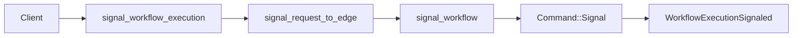

# Design Document: Signal Header API Conformance

## Overview

Signal headers and links are upstream request fields that are currently dropped. This design threads both fields through edge translation, kernel command application, durable history, and history serialization.

## Dependencies and Non-Goals

- Establishes the shared request metadata policy for headers and links used by start, schedule, batch, and other specs.
- SignalWithStart existing-run behavior must reuse this same signal translation path.

## Architecture

## Components and Interfaces

- `crates/tokeira-edge/src/grpc/translate.rs`: translate proto headers using existing payload/header helpers.
- `crates/tokeira-edge/src/translate/mod.rs`: add header/link fields to signal DTOs if missing.
- `crates/tokeira-edge/src/translate/to_internal.rs`: map signal DTOs to `tokeira_kernel::SignalRequest`.
- `crates/tokeira-kernel/src/command.rs` and `event.rs`: add header/link support only as deterministic data fields.
- `crates/tokeira-edge/src/translate/history_serializer.rs`: emit header/link fields in signal event attributes.

`WorkflowExecutionSignaledEventAttributes.header` is the target proto field for
signal headers. Payload bytes and metadata maps must round-trip through the
existing `headers_to_domain` / `headers_from_domain` helpers.

## Correctness Properties

### Property 1: Header Round Trip

For any valid header map, signal request translation and history serialization preserve the same keys and payload bytes.

**Validates:** Requirements 1.1, 1.2, 1.3.

### Property 2: Link Round Trip

For any valid link list, signal request translation and history serialization preserve the same link metadata.

**Validates:** Requirements 2.1, 2.2, 2.3.

### Property 3: Existing Signal Behavior

Adding headers does not change run resolution, not-found mapping, or durable signal commit behavior.

**Validates:** Requirements 3.1, 3.2, 3.3, 3.4.

## Error Handling

| Condition | Error | gRPC status |
|---|---|---|
| Malformed header payload | proto conversion error | `INVALID_ARGUMENT` |
| Malformed links | proto conversion error | `INVALID_ARGUMENT` |
| Unknown execution | `WorkflowNotFound` | `NOT_FOUND` |
| Malformed run id | `BadRequest` | `INVALID_ARGUMENT` |

## Testing Strategy

- Translator tests for header payload preservation.
- Kernel tests for signal event header storage.
- Serializer property tests for header round trip.
- Kernel/history tests for signal event link storage.
- Serializer property tests for link round trip.
