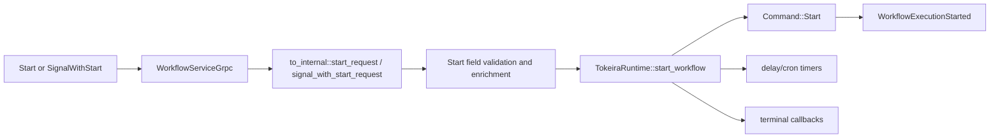

# Design Document: Start Field API Conformance

## Overview

This design closes field gaps on workflow starts by threading every externally-authored Temporal start field into deterministic kernel state, history, runtime timers, or runtime routing. Only server-internal continue-as-new fields remain invalid for external client requests.

## Dependencies and Non-Goals

- Reuses the shared request metadata policy introduced by `api-conformance-signal-headers` for headers, links, and user metadata.
- Adds the kernel/runtime/storage work required for delayed starts, callbacks, versioning override, and client cron.
- Owns the completion-callback lifecycle end to end: persisting registrations, giving the kernel `CompletionCallback` representable fields, dispatching on terminal transition, and rendering `DescribeWorkflowExecution.callbacks`. `api-conformance-workflow-describe` consumes this state and emits an empty `callbacks` list until this spec lands.
- Owns `priority` authoring at start: persists it on run state and threads it into `WorkflowExecutionInfo.priority`. `api-conformance-workflow-describe` reads it (it lists priority as owned-elsewhere); this spec is the owner.
- Owns `on_conflict_options`: it modifies the running workflow under `USE_EXISTING` and is part of completing the conflict-policy contract, not a separable feature.
- `eager_worker_deployment_options` is owned by `worker-deployments`; this spec leaves it default. `time_skipping_config` is a test-server feature and is rejected, not implemented. The deprecated `control` field on SignalWithStart is ignored.
- `SignalWithStartWorkflowExecution` and `StartWorkflowExecution` differ in conflict-policy defaulting: Start defaults to `FAIL`; SignalWithStart defaults to `USE_EXISTING` and treats `FAIL` as invalid. Parity applies to every other start field.
- Does not implement external client access to server-internal `continued_failure` or `last_completion_result`; those remain `INVALID_ARGUMENT` unless produced by internal continue-as-new/schedule paths.
- Full workflow-id reuse/conflict parity requires storage/current-execution changes and must be implemented atomically with tests.

## Architecture

## Components and Interfaces

- `crates/tokeira-edge/src/translate/to_internal.rs`: account for every upstream start field.
- `crates/tokeira-edge/src/workflow_service.rs`: validate external-only/internal-only fields before mutation.
- `crates/tokeira-kernel/src/command.rs`: extend `StartRequest` with conflict policies, delayed-start metadata, callback registrations, user metadata, links, versioning override, priority, and cron policy.
- `crates/tokeira-kernel/src/event.rs`: extend `WorkflowExecutionStarted` with authored metadata, links, conflict policy, cron, versioning override, priority, and delayed-start fields needed by history consumers.
- `crates/tokeira-kernel/src/state.rs`: persist delayed-start status, callback state, cron state, and versioning override in deterministic workflow state. Replace the fieldless `CompletionCallback` placeholder with a representable struct (callback spec/URL, trigger, registration time, state, attempt count, last-attempt failure) using `#[serde(default)]` for backward-compatible deserialization of existing persisted runs.
- `crates/tokeira-runtime/src/runtime/mod.rs`: schedule first WFT only after delayed-start timers fire, dispatch terminal callbacks, preserve eager start when no delay is present, and apply versioning override to dispatch routing.
- `crates/tokeira-edge/src/translate/mod.rs` and `crates/tokeira-edge/src/grpc/translate.rs`: extend the describe DTO and add a `callback_info_to_proto` builder so `DescribeWorkflowExecution.callbacks` renders one `CallbackInfo` per registered callback. The `api-conformance-workflow-describe` builder calls this once representable callback state exists.
- `crates/tokeira-storage`: ensure current-execution conflict checks and start metadata survive restart for memory and DSQL-backed repositories.

## Data Models

- `StartRequest` (`command.rs`): gains optional `workflow_start_delay`, `completion_callbacks: Vec<CompletionCallback>`, `user_metadata`, `links`, `versioning_override`, `priority`, `on_conflict_options`, and `cron_schedule` fields alongside the existing conflict/reuse policy fields.
- `CompletionCallback` (`state.rs`): replaces the fieldless placeholder with a representable struct — callback spec/URL and header, `Trigger` (currently `WorkflowClosed`), `registration_time`, `CallbackState`, `attempt`, and `last_attempt_failure`. All new fields use `#[serde(default)]` for backward-compatible deserialization of existing persisted runs.
- `WorkflowExecutionStarted` (`event.rs`): gains the authored start metadata, links, conflict policy, cron, versioning override, priority, and delayed-start fields needed by history consumers.
- Describe DTO (`translate/mod.rs`): gains a `callbacks: Vec<CallbackDescription>` list, rendered to proto `CallbackInfo` by a new `callback_info_to_proto` builder.

## Field Policy

| Field group | Behavior |
|---|---|
| Reuse/conflict policy | Map to kernel/storage current-run conflict handling; Start defaults to `FAIL`, SignalWithStart defaults to `USE_EXISTING` and rejects `FAIL` |
| `on_conflict_options` | Under `USE_EXISTING`, apply to the running workflow (nil/empty = no-op; set = add a history event to the running run) |
| Eager workflow task | Preserve existing behavior |
| Start delay | Persist delayed-start state and create a durable first-WFT timer |
| Completion callbacks | Persist callback registrations and fire once after terminal transition |
| User metadata | Persist in `WorkflowExecutionStarted` and describe/projection metadata |
| Links | Persist in `WorkflowExecutionStarted` |
| Versioning override | Persist on run state and apply to WFT dispatch routing |
| Priority | Persist on run state and thread into `WorkflowExecutionInfo.priority` |
| Client cron | Store recurring-start policy and use timer/schedule machinery for next run |
| `eager_worker_deployment_options` | Owned by `worker-deployments`; left default until that feature lands |
| `time_skipping_config` | Test-server feature; reject behavioural requests as `INVALID_ARGUMENT` |
| `control` (SignalWithStart) | Deprecated upstream field; ignored |
| Continued failure/result | Internal-only; reject normal client values |

## Correctness Properties

### Property 1: No Silent Drop

For any externally-authored start field, translation either produces the corresponding durable request/state/history value or rejects the request as malformed/internal-only.

**Validates: Requirements 1.3, 1.4, 1.5, 1.6, 1.7, 1.8, 1.9, 1.10, 1.11, 1.12, 1.13, 1.14, 2.3, 2.5**

### Property 2: Start/SignalWithStart Parity

For any accepted start attributes, `StartWorkflowExecution` and the start branch of `SignalWithStartWorkflowExecution` produce equivalent `StartRequest` fields.

**Validates: Requirements 2.1, 3.1**

### Property 3: Durable Start Metadata

For every supported accepted field, the committed history/state contains enough data to reconstruct the field on describe/history paths.

**Validates: Requirements 3.1, 3.2**

### Property 4: Callback Describe Fidelity

For any set of registered completion callbacks on a run, `DescribeWorkflowExecution` emits exactly one `CallbackInfo` per registered callback derived from durable state; a run with no callbacks emits an empty list with no fabricated entries.

**Validates: Requirements 4.2, 4.3**

### Property 5: Conflict-Policy Defaulting

For an unset `workflow_id_conflict_policy`, `StartWorkflowExecution` resolves to `FAIL` and `SignalWithStartWorkflowExecution` resolves to `USE_EXISTING`; `SignalWithStartWorkflowExecution` with an explicit `FAIL` is rejected as `INVALID_ARGUMENT`.

**Validates: Requirements 1.1, 2.5**

## Error Handling

| Condition | Error | gRPC status |
|---|---|---|
| External client supplies internal-only continue field | `EdgeError::BadRequest` | `INVALID_ARGUMENT` |
| SignalWithStart supplies `WORKFLOW_ID_CONFLICT_POLICY_FAIL` | `EdgeError::BadRequest` | `INVALID_ARGUMENT` |
| `time_skipping_config` requests a behavioural change | `EdgeError::BadRequest` | `INVALID_ARGUMENT` |
| Malformed parsed value | `EdgeError::BadRequest` | `INVALID_ARGUMENT` |
| Existing workflow conflict | existing conflict error | existing mapped status |

## Testing Strategy

- Translator tests for every `StartWorkflowExecutionRequest` field (all 29) and every `SignalWithStartWorkflowExecutionRequest` field (all 27), driven by the v1.62.11 proto rather than `UNSUPPORTED_FIELDS.md`.
- Property tests generating every start field combination and asserting durable translation or invalid-input rejection for internal-only/unsupported fields.
- Conflict-policy defaulting tests covering the Start (`FAIL`) vs SignalWithStart (`USE_EXISTING`, `FAIL` invalid) difference.
- `on_conflict_options` tests: no-op for nil/empty under `USE_EXISTING`; history event added when set.
- Runtime/history tests for accepted fields, including `priority` threading into describe.
- Signal-with-start parity tests using shared helper functions.
- Callback describe tests: a run with registered callbacks renders one `CallbackInfo` per registration; a run with none renders an empty list.
- Restart/recovery tests for delayed starts, cron state, terminal callbacks, and versioning override routing.
