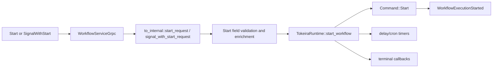

# Design Document: Start Field API Conformance

## Overview

This design closes field gaps on workflow starts by threading every externally-authored Temporal start field into deterministic kernel state, history, runtime timers, or runtime routing. Only server-internal continue-as-new fields remain invalid for external client requests.

## Dependencies and Non-Goals

- Reuses the shared request metadata policy introduced by `api-conformance-signal-headers` for headers, links, and user metadata.
- Adds the kernel/runtime/storage work required for delayed starts, callbacks, versioning override, and client cron.
- Does not implement external client access to server-internal `continued_failure` or `last_completion_result`; those remain `INVALID_ARGUMENT` unless produced by internal continue-as-new/schedule paths.
- Full workflow-id reuse/conflict parity requires storage/current-execution changes and must be implemented atomically with tests.

## Architecture

## Components and Interfaces

- `crates/tokeira-edge/src/translate/to_internal.rs`: account for every upstream start field.
- `crates/tokeira-edge/src/workflow_service.rs`: validate external-only/internal-only fields before mutation.
- `crates/tokeira-kernel/src/command.rs`: extend `StartRequest` with conflict policies, delayed-start metadata, callback registrations, user metadata, links, versioning override, and cron policy.
- `crates/tokeira-kernel/src/event.rs`: extend `WorkflowExecutionStarted` with authored metadata, links, conflict policy, cron, versioning override, and delayed-start fields needed by history consumers.
- `crates/tokeira-kernel/src/state.rs`: persist delayed-start status, callback state, cron state, and versioning override in deterministic workflow state.
- `crates/tokeira-runtime/src/runtime/mod.rs`: schedule first WFT only after delayed-start timers fire, dispatch terminal callbacks, preserve eager start when no delay is present, and apply versioning override to dispatch routing.
- `crates/tokeira-storage`: ensure current-execution conflict checks and start metadata survive restart for memory and DSQL-backed repositories.

## Field Policy

| Field group | Phase 1 behavior |
|---|---|
| Reuse/conflict policy | Map to kernel/storage current-run conflict handling |
| Eager workflow task | Preserve existing behavior |
| Start delay | Persist delayed-start state and create a durable first-WFT timer |
| Completion callbacks | Persist callback registrations and fire once after terminal transition |
| User metadata | Persist in `WorkflowExecutionStarted` and describe/projection metadata |
| Links | Persist in `WorkflowExecutionStarted` |
| Versioning override | Persist on run state and apply to WFT dispatch routing |
| Client cron | Store recurring-start policy and use timer/schedule machinery for next run |
| Continued failure/result | Internal-only; reject normal client values |

## Correctness Properties

### Property 1: No Silent Drop

For any externally-authored start field, translation either produces the corresponding durable request/state/history value or rejects the request as malformed/internal-only.

**Validates:** Requirements 1.3-1.9, 2.3.

### Property 2: Start/SignalWithStart Parity

For any accepted start attributes, `StartWorkflowExecution` and the start branch of `SignalWithStartWorkflowExecution` produce equivalent `StartRequest` fields.

**Validates:** Requirements 2.1, 3.1.

### Property 3: Durable Start Metadata

For every supported accepted field, the committed history/state contains enough data to reconstruct the field on describe/history paths.

**Validates:** Requirements 3.1, 3.2.

## Error Handling

| Condition | Error | gRPC status |
|---|---|---|
| External client supplies internal-only continue field | `EdgeError::BadRequest` | `INVALID_ARGUMENT` |
| Malformed parsed value | `EdgeError::BadRequest` | `INVALID_ARGUMENT` |
| Existing workflow conflict | existing conflict error | existing mapped status |

## Testing Strategy

- Translator tests for every `StartWorkflowExecutionRequest` field.
- Property tests generating every start field combination and asserting durable translation or invalid-input rejection for internal-only fields.
- Runtime/history tests for accepted fields.
- Signal-with-start parity tests using shared helper functions.
- Restart/recovery tests for delayed starts, cron state, terminal callbacks, and versioning override routing.
