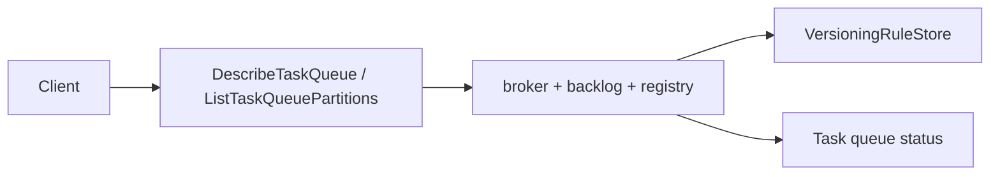

# Design Document: Task Queue API Conformance

## Overview

Task queue describe partially exists, while partition listing is stubbed. This design exposes a simple topology consistent with Tokeira's current queue model and enriches describe with runtime/backlog/versioning data.

## Dependencies and Non-Goals

- Depends on worker registry and versioning rule store for build-id reachability.
- Does not implement new partitioned queue routing; it exposes the current single-partition topology.
- Sticky partition output is limited to sticky behavior currently implemented by the runtime.

## Runtime Diagnostics Interface

Add a read-only diagnostics snapshot containing pollers, backlog counts/age,
build-id reachability, and configured partition count. The snapshot must not
mutate broker state and must be safe under concurrent polling.

## Architecture

## Components and Interfaces

- `crates/tokeira-edge/src/grpc/workflow_service.rs`: implement partition handler and complete describe.
- `crates/tokeira-edge/src/grpc/translate.rs`: request/response projection helpers.
- `crates/tokeira-runtime/src/broker.rs`, `backlog.rs`, `worker_registry.rs`, and `versioning.rs`: expose bounded read-only queue diagnostics.

## Correctness Properties

### Property 1: Single-Partition Compatibility

When configured partition count is one, list partitions returns exactly one normal partition and no invented extra partitions.

**Validates:** Requirements 1.1, 1.3.

### Property 2: Describe Reflects Runtime State

Poller/backlog/reachability fields in describe match runtime registry and backlog snapshots.

**Validates:** Requirements 2.1, 2.2, 2.3.

### Property 3: Validation Before Lookup

Invalid namespace/task queue inputs return `INVALID_ARGUMENT` before runtime lookup.

**Validates:** Requirements 3.1, 3.2.

## Error Handling

| Condition | Error | gRPC status |
|---|---|---|
| Empty namespace | bad request | `INVALID_ARGUMENT` |
| Empty task queue | bad request | `INVALID_ARGUMENT` |
| Unrecognized queue kind enum | bad request | `INVALID_ARGUMENT` |

## Testing Strategy

- Unit tests for partition response shape.
- Runtime tests for backlog and poller snapshot fidelity.
- Property tests for validation and single-partition compatibility.
