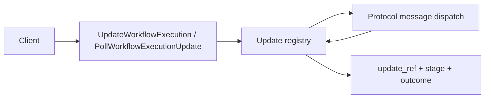

# Design Document: Update Lifecycle API Conformance

## Overview

The update path exists but response metadata is incomplete. This design adds an update lifecycle record that can produce `update_ref` and stage consistently for synchronous update calls and polling.

## Dependencies and Non-Goals

- Depends on durable update lifecycle state; transient registry-only data is insufficient for poll-after-restart semantics.
- Does not change the worker protocol body format except where response metadata requires new projection.
- `PollWorkflowExecutionUpdate` is read-only and never submits kernel commands.

## Architecture

## Components and Interfaces

- `crates/tokeira-edge/src/grpc/translate.rs`: translate update refs/stages in free functions.
- `crates/tokeira-edge/src/workflow_service.rs`: resolve execution, validate run id, and map missing update errors.
- `crates/tokeira-runtime/src/update.rs`: expose lifecycle stage and reference in `UpdateOutcome` / poll result.
- `crates/tokeira-kernel/src/event.rs`: no new I/O; add history fields only if committed events must carry update reference.

## Data Models

`UpdateLifecycleSnapshot` should include execution reference, update id, update name, current stage, and final outcome if present. The edge response maps this to upstream `update_ref` and `stage`.

The snapshot must be recoverable after runtime restart for accepted, completed,
rejected, timed-out, and cleaned-up updates that remain externally observable.

## Correctness Properties

### Property 1: Update Ref Stability

For any update id and execution reference, the same `update_ref` is returned by initial update and later poll paths.

**Validates:** Requirements 1.1, 2.1.

### Property 2: Stage Monotonicity

An update stage never regresses across accepted, completed, rejected, timeout, or cleanup paths.

**Validates:** Requirements 1.2, 1.3, 3.3.

### Property 3: Poll Is Read-Only

Polling unknown or pending updates does not submit workflow mutation commands.

**Validates:** Requirements 2.2, 2.4.

## Error Handling

| Condition | Error | gRPC status |
|---|---|---|
| Malformed non-empty `run_id` | `BadRequest` | `INVALID_ARGUMENT` |
| Missing execution | `WorkflowNotFound` | `NOT_FOUND` |
| Missing update | specific update-not-found error | `NOT_FOUND` or documented pending behavior |

## Testing Strategy

- Unit tests for update ref/stage proto projection.
- Runtime update registry property tests for stage monotonicity.
- gRPC tests for malformed run id and unknown update id.
- Integration test where update call returns a ref and poll observes the same ref.
