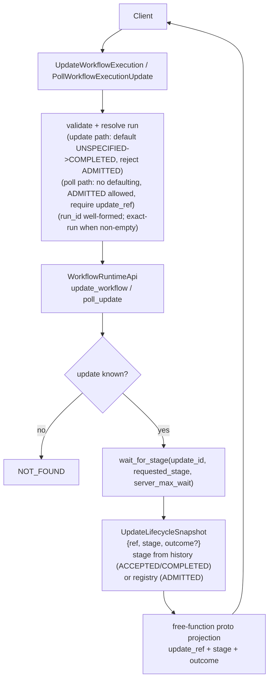

# Design Document: Update Lifecycle API Conformance

## Overview

`UpdateWorkflowExecution` and `PollWorkflowExecutionUpdate` are **blocking RPCs governed by a
`WaitPolicy`**: the call blocks until the update reaches the client-requested lifecycle stage or
the server's maximum wait time expires, then returns `update_ref`, the reached `stage`, and the
`outcome` (only when COMPLETED). The current handlers translate the protocol body but omit the
wait contract and the response metadata. This design adds:

1. a **lifecycle snapshot** the runtime can produce for any tracked update (`update_ref`, current
   `stage`, terminal `outcome` when present), sourced from durable truth;
2. a **wait path** that blocks for the requested stage with a server-max-wait soft timeout, shared
   by both the synchronous update call and the polling call;
3. **stage defaulting/validation** matching the targeted release (default COMPLETED, reject
   ADMITTED); and
4. a single committed **unknown-update → `NOT_FOUND`** behaviour.

Behaviour is anchored to Temporal v1.31.0 per AGENTS.md §8: stage defaulting
(`common/enums/defaults.go:71-75`), ADMITTED rejection (`service/frontend/workflow_handler.go:5277`),
and the poll handler's not-found + `WaitLifecycleStage` flow (`service/history/api/pollupdate/api.go`).

### Source of truth per stage (reconciling with history-as-authority)

The central design decision is which plane owns each lifecycle stage. Updates are partly
history-authored and partly transient:

| Stage | Owner | Recoverable after restart? |
|---|---|---|
| `ADMITTED` (admitted, not yet accepted) | transient runtime **update registry** | No — admitted-only updates may report not-found after restart |
| `ACCEPTED` | committed `WorkflowExecutionUpdateAccepted` history event | Yes (replay) |
| `COMPLETED` (success) | committed `WorkflowExecutionUpdateCompleted` history event | Yes (replay) |
| `COMPLETED` (rejection) | committed `WorkflowExecutionUpdateRejected` history event | Yes (replay) |

This keeps correctness weight on history for the durable stages (AGENTS.md §3) and confines the
registry to the transient admitted/wait coordination state. The kernel already emits the three
update history events (`crates/tokeira-kernel/src/event.rs`), so the durable stages are derivable
from the run snapshot without new kernel commands.

## Dependencies and Non-Goals

- **Depends on** the existing update history events and update registry; no new kernel command and
  no new history event are required (the kernel stays pure — AGENTS.md §2).
- **Does not** change the worker protocol body format; it adds response-metadata projection only.
- `PollWorkflowExecutionUpdate` is read-only and never submits a kernel command.
- Does not implement update admission control, rate limiting, or the ACCEPTED-async config gate
  that v1.31.0 exposes — Tokeira supports synchronous ACCEPTED and COMPLETED waits directly.

## Architecture



The synchronous update call and the poll call share the same `wait_for_stage` primitive and the
same snapshot→proto projection; they differ only in entry validation (update carries a `request`
body and may generate the `update_id`; poll requires an existing `update_ref`).

## Components and Interfaces

- `crates/tokeira-edge/src/workflow_service.rs`:
  - Resolve namespace/execution. **Exact-run targeting:** thread the request `run_id` into the
    `ExecutionRef` when it is non-empty and well-formed (both `update_workflow_execution` and
    `poll_workflow_execution_update`); the current handler hardcodes `run_id: None` and must stop
    dropping it. Empty `run_id` keeps the current-run fallback. Malformed non-empty `run_id` →
    `INVALID_ARGUMENT`; well-formed but non-existent run → `NOT_FOUND`.
  - **Wait-stage handling differs by RPC (verified against v1.31.0):**
    - *Update path* (`update_workflow_execution`): default `UNSPECIFIED → COMPLETED`
      (`SetDefaultUpdateWorkflowExecutionLifecycleStage`, `common/enums/defaults.go:71-75`) and
      **reject `ADMITTED`** with `INVALID_ARGUMENT` (`workflow_handler.go:5277`), before calling the
      runtime.
    - *Poll path* (`poll_workflow_execution_update`): **do NOT default and do NOT reject ADMITTED.**
      Require `update_ref` (else `INVALID_ARGUMENT`). An omitted/`UNSPECIFIED`/`ADMITTED` wait stage
      is a non-blocking request returning the current most-advanced stage; only `ACCEPTED`/
      `COMPLETED` block. This mirrors the frontend poll handler (which sets only an empty
      `WaitPolicy` and applies neither rule) and `Update.WaitLifecycleStage`
      (`service/history/workflow/update/update.go:148-238 @ v1.31.0`), where UNSPECIFIED/ADMITTED
      fall through to returning the current/ADMITTED stage.
  - Generate `update_id` when the client omits it (update call only).
  - Map a missing update to `NOT_FOUND` and a missing execution to `NOT_FOUND`.
- `crates/tokeira-edge/src/grpc/translate.rs`: free functions projecting `UpdateLifecycleSnapshot`
  to `UpdateRef`, `stage`, and `outcome` on both responses (no `TryFrom`).
- `crates/tokeira-runtime/src/update.rs`:
  - Extend the update registry / lifecycle resolution to expose a stage and `update_ref` and to
    block for a requested stage with a server-max-wait soft timeout. The wait primitive must treat
    UNSPECIFIED/ADMITTED as "return current stage now" and only block for ACCEPTED/COMPLETED, so the
    poll path's non-blocking semantics fall out of the shared primitive without an extra edge rule.
  - Derive ACCEPTED/COMPLETED/rejected stage + outcome from the committed history of the run;
    derive ADMITTED from transient registry state.
  - Resolve the update against the exact `run_id` carried on the `ExecutionRef`.
- `crates/tokeira-kernel/src/event.rs`: no change — the existing update events are the durable
  source; no new I/O and no new variant.

## Data Models

```rust
/// Lifecycle position, ordered. Mirrors enums/v1/update.proto.
enum UpdateLifecycleStage { Unspecified, Admitted, Accepted, Completed }

/// Terminal result, present iff stage == Completed. A rejection is Completed + Failure.
enum UpdateOutcome { Success(Payloads), Failure(Payload) }

/// What the runtime returns for any tracked update; the edge maps this to proto.
struct UpdateLifecycleSnapshot {
    workflow_execution: ExecutionRef,   // for update_ref.workflow_execution
    update_id: String,                  // for update_ref.update_id
    update_name: String,
    stage: UpdateLifecycleStage,        // most advanced reached (history- or registry-derived)
    outcome: Option<UpdateOutcome>,     // Some iff Completed
}
```

`UpdateLifecycleSnapshot` is the runtime-result type; the edge response DTO is distinct from it
(mirroring `WorkflowMutationOutcome` vs `CommitResult`). For ACCEPTED/COMPLETED, the snapshot is
built from the run's committed history so it is identical before and after restart; for ADMITTED it
reflects transient registry state.

## Correctness Properties

### Property 1: Update Ref Stability

*For any* update, the `update_ref` (`{workflow_execution, update_id}`) returned by the initial
`UpdateWorkflowExecution` call is byte-identical to the `update_ref` returned by any later
`PollWorkflowExecutionUpdate` for the same update, including the server-generated `update_id` when
the client omitted one.

**Validates: Requirements 1.1, 1.2, 3.1**

### Property 2: Wait Stage Defaulting and ADMITTED Rejection

*For any* request, an absent or `UNSPECIFIED` wait stage is treated as `COMPLETED`, and a wait
stage of `ADMITTED` is rejected with `INVALID_ARGUMENT`; no other stage value is altered.

**Validates: Requirements 2.1, 2.2, 3.5**

### Property 3: Wait Returns At-Least-Requested Stage or Times Out Cleanly

*For any* supported requested stage, the call either returns with a reached `stage` greater than or
equal to the requested stage (with `outcome` set iff `COMPLETED`), or, when the server maximum wait
time expires first, returns without error reporting the actual reached stage. The call never
returns a reached stage below the requested stage without having hit the server-max-wait timeout.

**Validates: Requirements 2.3, 2.4, 2.5, 3.5**

### Property 4: Stage Monotonicity (stage axis only)

*For any* `update_id`, observations over time are non-decreasing on the ladder
`UNSPECIFIED < ADMITTED < ACCEPTED < COMPLETED`. Rejection and timeout are not stage regressions: a
rejection is observed as `COMPLETED` with a failure outcome.

**Validates: Requirements 4.1, 4.3**

### Property 5: Outcome Fidelity from History

*For any* COMPLETED update, the `outcome` equals the payload/failure carried by the committed
`WorkflowExecutionUpdateCompleted` / `WorkflowExecutionUpdateRejected` history event, is set at most
once, and is identical before and after runtime restart. An update with no committed terminal event
has no `outcome`.

**Validates: Requirements 4.2, 4.4**

### Property 6: Unknown Update Is NOT_FOUND and Poll Is Read-Only

*For any* poll of an `update_id` not tracked for the resolved execution, the result is `NOT_FOUND`;
and *for any* poll (known, unknown, or pending), no workflow mutation command is submitted.

**Validates: Requirements 3.2, 3.6**

## Error Handling

| Condition | Error | gRPC status |
|---|---|---|
| Wait stage `ADMITTED` requested **on the update path** | invalid-argument (analog of `errUpdateWorkflowExecutionAsyncAdmittedNotAllowed`) | `INVALID_ARGUMENT` |
| Wait stage `ADMITTED`/`UNSPECIFIED` **on the poll path** | none — non-blocking, returns current stage | OK |
| `update_ref` absent on poll | analog of `errUpdateRefNotSet` | `INVALID_ARGUMENT` |
| Malformed non-empty `run_id` (update or poll) | `BadRequest` | `INVALID_ARGUMENT` |
| Well-formed non-empty `run_id` naming a non-existent run | `WorkflowNotFound` | `NOT_FOUND` |
| `first_execution_run_id` set and not matching the resolved run's chain | `ErrWorkflowExecutionNotFound` (`updateworkflow/api.go:109-111 @ v1.31.0`) | `NOT_FOUND` |
| Missing workflow execution (empty `run_id`, no current run) | `WorkflowNotFound` | `NOT_FOUND` |
| Unknown `update_id` | update-not-found (`NewNotFoundf("update ... not found")`) | `NOT_FOUND` |
| Server maximum wait time expired before requested stage (ACCEPTED/COMPLETED) | none (non-error) | OK, reached stage reported |

## Testing Strategy

- Unit tests: update-path wait-stage defaulting (UNSPECIFIED→COMPLETED) and ADMITTED rejection;
  poll-path NON-defaulting and ADMITTED-allowed (a poll with UNSPECIFIED/ADMITTED returns current
  stage without blocking and without error); `update_id` generation; `update_ref`/`stage`/`outcome`
  proto projection on both responses.
- Exact-run tests: an update/poll with a non-empty well-formed `run_id` targets that exact run (not
  the current run); empty `run_id` falls back to current; malformed → `INVALID_ARGUMENT`;
  non-existent run → `NOT_FOUND`.
- Runtime property tests: stage monotonicity (Property 4); outcome derived from committed history
  and stable across a simulated restart (Property 5); ref stability (Property 1).
- gRPC tests: missing `update_ref` and unknown `update_id` → `NOT_FOUND`/`INVALID_ARGUMENT`;
  poll with omitted/UNSPECIFIED/ADMITTED wait policy returns current stage immediately.
- Wait-contract tests: an update or a poll with an ACCEPTED/COMPLETED wait policy blocks until the
  stage is reached or the soft timeout fires and returns the actual reached stage without error
  (Property 3).
- Restart test: an ACCEPTED/COMPLETED update polled after runtime reload returns the same
  stage/outcome; an admitted-only update may return `NOT_FOUND` after reload.
