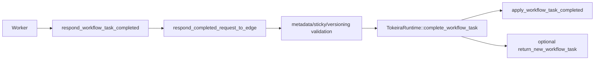

# Design Document: Workflow Task Completion API Conformance

## Overview

This design completes `RespondWorkflowTaskCompleted` by implementing completion metadata, sticky behavior, metering metadata, and worker deployment/versioning *preservation*, plus return-new-WFT semantics. Command application remains in the pure kernel; transport metadata is translated at the edge and runtime boundary. Field accounting is anchored to the v1.62.11 proto and behaviour to Temporal server tag `v1.31.0` (AGENTS.md §8).

## Dependencies and Non-Goals

- Sticky attributes update runtime sticky routing state and are included in subsequent dispatch decisions.
- `deployment_options` (current) and `versioning_behavior` are persisted as durable worker deployment/versioning metadata. **Applying** them to dispatch routing is owned by `worker-deployments`; this spec only preserves and threads them. The deprecated `binary_checksum` / `worker_version_stamp` / `deployment` fields are accepted for back-compat and drive no new behavior.
- `capabilities.discard_speculative_workflow_task_with_events` is preserved for the `speculative-wft` feature; this spec does not implement speculative-WFT discard behavior.
- `messages` is the update protocol transport, shared with `api-conformance-update-lifecycle`; this spec preserves it and does not own update semantics.
- `worker_instance_key` and `worker_control_task_queue` are left default; they belong to worker lifecycle/heartbeat and Nexus task transport respectively.
- Metering metadata is informational and is persisted with completion history metadata.
- Return-new-WFT is limited to a safety-proven subset; no synthetic task is returned.

## Return-New-WFT Safety

The runtime may return a new workflow task only if it has durably scheduled and
started that task after the completion transition. It must preserve existing
query consistency guarantees, especially signal-then-query ordering and buffered
query barriers.

## Architecture

## Components and Interfaces

- `crates/tokeira-edge/src/grpc/translate.rs`: preserve proto metadata fields using free translation functions, including `deployment_options`, `versioning_behavior`, `metering_metadata`, `sticky_attributes`, and `capabilities`.
- `crates/tokeira-edge/src/translate/to_internal.rs`: thread `sdk_metadata`, `metering_metadata`, current `deployment_options`/`versioning_behavior`, and the deprecated back-compat fields into kernel request DTOs.
- `crates/tokeira-kernel/src/command.rs`: carry metadata in `WorkflowTaskCompletedRequest`.
- `crates/tokeira-kernel/src/event.rs`: persist supported metadata in `WorkflowTaskCompleted`.
- `crates/tokeira-kernel/src/state.rs`: persist sticky attributes and deployment/versioning metadata needed for future dispatch (routing application owned by `worker-deployments`).
- `crates/tokeira-runtime/src/runtime/mod.rs`: update sticky routing and implement return-new-WFT with broker/runtime APIs without bypassing per-run serialization. Versioning/deployment routing is not applied here — it is deferred to `worker-deployments`.

## Data Models

- `WorkflowTaskCompletedRequest` (`command.rs`): gains optional `sdk_metadata`, `metering_metadata`, `deployment_options`, and `versioning_behavior` fields alongside the existing token/commands/identity. Deprecated `worker_version_stamp.build_id` is retained for back-compat. All additions use `#[serde(default)]` for backward-compatible deserialization.
- `HistoryEventKind::WorkflowTaskCompleted` (`event.rs`): gains durable slots for `sdk_metadata`, `metering_metadata`, and the current deployment/versioning metadata so describe/history can reconstruct them.
- `WorkflowState` (`state.rs`): gains sticky-attribute state and deployment/versioning metadata. Sticky routing is consumed by the runtime; deployment/versioning metadata is stored for `worker-deployments` to apply.
- Sticky/deployment fields are kernel-internal durable envelope state; routing *application* is not modeled here.

## Correctness Properties

### Property 1: Metadata Fidelity

For any accepted completion metadata (`sdk_metadata`, `metering_metadata`, `deployment_options`, `versioning_behavior`), the emitted `WorkflowTaskCompleted` history event preserves the same value.

**Validates: Requirements 1.1, 1.2, 1.3**

### Property 2: Sticky Routing and Versioning Preservation

For any accepted `sticky_attributes`, committed state and subsequent workflow task dispatch reflect the sticky routing. For any accepted `versioning_behavior` / `deployment_options`, the durable state/history preserves the authored value (dispatch application is owned by `worker-deployments` and is not asserted here).

**Validates: Requirements 2.1, 2.2, 2.4**

### Property 3: Return-New-WFT Safety

`return_new_workflow_task` never returns a task that has not been durably scheduled and started, and preserves existing query-consistency barriers.

**Validates: Requirements 3.2, 3.3**

## Error Handling

| Condition | Error | gRPC status |
|---|---|---|
| Malformed task token | proto conversion error | `INVALID_ARGUMENT` |
| Unknown `versioning_behavior` enum | bad request | `INVALID_ARGUMENT` |
| Invalid sticky field | bad request | `INVALID_ARGUMENT` |
| Not shard owner | runtime not-owner | existing mapped status |

## Testing Strategy

- Translator tests for every metadata field across the full v1.62.11 message (20 fields), driven by the proto rather than `UNSUPPORTED_FIELDS.md`.
- Kernel tests for emitted history metadata (`sdk_metadata`, `metering_metadata`, `deployment_options`, `versioning_behavior`).
- Runtime tests for return-new-WFT availability and absence, preserving query barriers.
- Property tests for metadata fidelity, sticky/versioning preservation, and token validation.
- Deprecated-field tests: `binary_checksum` / `worker_version_stamp` / `deployment` accepted but drive no new behavior.
- Restart/recovery tests for sticky and deployment/versioning metadata.
