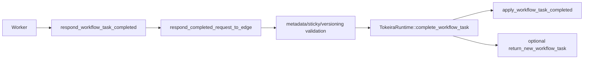

# Design Document: Workflow Task Completion API Conformance

## Overview

This design completes `RespondWorkflowTaskCompleted` by implementing completion metadata, sticky behavior, versioning behavior, metering metadata, deployment metadata, and return-new-WFT semantics. Command application remains in the pure kernel; transport metadata is translated at the edge and runtime boundary.

## Dependencies and Non-Goals

- Sticky attributes update runtime sticky routing state and are included in subsequent dispatch decisions.
- Worker deployment and versioning fields are persisted as routing metadata and applied where Tokeira has routing support.
- Metering metadata is informational and is persisted with completion history metadata.
- Return-new-WFT is limited to a safety-proven subset; no synthetic task is returned.

## Return-New-WFT Safety

The runtime may return a new workflow task only if it has durably scheduled and
started that task after the completion transition. It must preserve existing
query consistency guarantees, especially signal-then-query ordering and buffered
query barriers.

## Architecture

## Components and Interfaces

- `crates/tokeira-edge/src/grpc/translate.rs`: preserve proto metadata fields using free translation functions.
- `crates/tokeira-edge/src/translate/to_internal.rs`: thread `sdk_metadata` and supported worker version fields into kernel request DTOs.
- `crates/tokeira-kernel/src/command.rs`: carry metadata in `WorkflowTaskCompletedRequest`.
- `crates/tokeira-kernel/src/event.rs`: persist supported metadata in `WorkflowTaskCompleted`.
- `crates/tokeira-kernel/src/state.rs`: persist sticky attributes and versioning/deployment behavior needed for future dispatch.
- `crates/tokeira-runtime/src/runtime/mod.rs`: update sticky/versioning routing and implement return-new-WFT with broker/runtime APIs without bypassing per-run serialization.

## Correctness Properties

### Property 1: Metadata Fidelity

For any accepted completion metadata, the emitted `WorkflowTaskCompleted` history event preserves the same value.

**Validates:** Requirements 1.1, 1.2, 1.3.

### Property 2: Sticky and Versioning Fidelity

For any accepted sticky/versioning/deployment field, committed state and subsequent workflow task dispatch reflect the authored value.

**Validates:** Requirements 2.1, 2.2, 2.3, 4.3.

### Property 3: Return-New-WFT Safety

`return_new_workflow_task` never returns a task that has not been durably scheduled and started.

**Validates:** Requirements 3.2, 3.3.

## Error Handling

| Condition | Error | gRPC status |
|---|---|---|
| Malformed task token | proto conversion error | `INVALID_ARGUMENT` |
| Invalid sticky/versioning field | bad request | `INVALID_ARGUMENT` |
| Not shard owner | runtime not-owner | existing mapped status |

## Testing Strategy

- Translator tests for every metadata field.
- Kernel tests for emitted history metadata.
- Runtime tests for return-new-WFT availability and absence.
- Property tests for sticky/versioning fidelity and token validation.
- Restart/recovery tests for sticky/versioning/deployment state.
