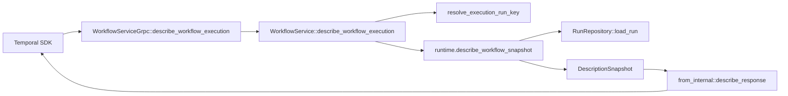

# Design Document: Workflow Describe API Conformance

## Overview

`DescribeWorkflowExecution` currently projects only a subset of Temporal's response. This design adds a runtime/projection snapshot boundary that reads one run state and translates open kernel state into the upstream describe response without moving workflow semantics into the edge.

## Dependencies and Non-Goals

- Depends on `api-conformance-start-fields` for complete execution config.
- Depends on `api-conformance-activity-events` for pending activity event ids, heartbeat details, and timing fields.
- Depends on child-workflow state enrichment from the existing child workflow implementation before pending child metadata can be complete.
- Depends on Nexus pending-operation state before `pending_nexus_operations` can be complete.
- Does not implement callbacks; it only avoids misrepresenting callback state.

## Architecture

## Components and Interfaces

- `crates/tokeira-edge/src/grpc/workflow_service.rs`: keep the free-function proto translation pattern and route the handler through `WorkflowService`.
- `crates/tokeira-edge/src/workflow_service.rs`: validate `run_id`, resolve the run key, call a runtime/projection snapshot method, and map expected errors.
- `crates/tokeira-edge/src/translate/mod.rs`: extend `WorkflowExecutionDescription` or introduce `WorkflowExecutionDescriptionSnapshot` with execution config and pending entities.
- `crates/tokeira-edge/src/translate/from_internal.rs`: populate the upstream proto response from the new DTO.
- `crates/tokeira-runtime/src/runtime/mod.rs`: add a read-only describe snapshot method if the existing repository/projection APIs cannot expose pending runtime state cleanly.
- `crates/tokeira-kernel/src/state.rs`: no I/O or async changes; only add serializable state fields if a required event linkage is not currently retained.

## Data Models

`DescriptionSnapshot` should contain `execution_info`, `execution_config`, `pending_activities`, `pending_children`, `pending_workflow_task`, `callbacks`, and `pending_nexus_operations`. The snapshot is an edge/runtime DTO, not a kernel command.

Callbacks remain empty until callback lifecycle state exists. The spec still requires the field to be accounted for, but not invented.

## Snapshot Sources

| Snapshot section | Authoritative source |
|---|---|
| Execution config | Kernel start state, not visibility-only projection |
| Pending workflow task | Kernel pending WFT state |
| Pending activities | Kernel `activities` map plus runtime heartbeat tracking |
| Pending children | Kernel child workflow state |
| Pending Nexus operations | Kernel/runtime Nexus pending state |
| Callbacks | Future callback lifecycle state |

## Correctness Properties

### Property 1: Single Snapshot Consistency

For any loaded run state, every pending field in `DescribeWorkflowExecutionResponse` is derived from the same state version.

**Validates:** Requirements 2.1, 2.2.

### Property 2: Pending Activity Fidelity

For any open `ActivityState`, the response contains exactly one matching pending activity entry and preserves id, type, task queue, attempt, and event ids that are known.

**Validates:** Requirements 1.3, 2.3.

### Property 3: Expected Error Mapping

Malformed run ids map to `INVALID_ARGUMENT`; missing executions map to `NOT_FOUND`; neither path submits a mutation.

**Validates:** Requirements 1.8, 1.9, 1.10, 3.1, 3.2.

## Error Handling

| Condition | Edge error | gRPC status |
|---|---|---|
| Malformed non-empty `run_id` | `BadRequest` | `INVALID_ARGUMENT` |
| Unknown workflow execution | `WorkflowNotFound` | `NOT_FOUND` |
| Snapshot load failure | storage/runtime error | `INTERNAL` or mapped storage status |

## Testing Strategy

- Unit tests in `from_internal` for execution config and each pending entity list.
- Runtime tests that start a workflow, schedule an activity/child/Nexus operation where supported, and assert describe snapshot fidelity.
- Property tests for pending activity and pending WFT projection.
- gRPC tests for malformed `run_id`, missing execution, and metrics label mapping.
