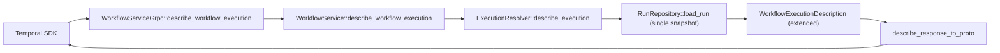

# Design Document: Workflow Describe API Conformance

## Overview

`DescribeWorkflowExecution` currently projects only a subset of Temporal's response (most of `workflow_execution_info` plus `pause_info`). This design moves the RPC to `Implemented` by reading one consistent run snapshot and translating all eight response fields - `execution_config`, the full `workflow_execution_info`, `pending_activities`, `pending_children`, `pending_workflow_task`, `callbacks`, `pending_nexus_operations`, and `workflow_extended_info` - from authoritative kernel/runtime/projection state, without moving workflow semantics into the edge.

Fields whose backing capability is owned by another named feature are populated from that state once it exists and are truthfully empty until then. The RPC never returns `UNIMPLEMENTED`. `callbacks` rendering is owned by `api-conformance-start-fields`: that spec gives the kernel's placeholder `CompletionCallback` representable fields and renders `CallbackInfo`; this spec emits an empty list until then.

## Architecture

The describe read path already loads one `WorkflowState` via the resolver's `describe_execution`. This design extends the DTO it produces and the proto translation it feeds, rather than introducing a new runtime round-trip, so the single-snapshot consistency property holds by construction. Root execution identity and cancel-requested state are authored into history and restored on replay, so the single-load describe remains correct after recovery as well as on the live transition path. Root follows Temporal v1.31.0: use the started event's root execution when present, otherwise use the run's own execution.

## Dependencies and Non-Goals

- **`api-conformance-start-fields`** owns capturing `user_metadata` at start. `execution_config.user_metadata` is populated once that state exists; empty until then.
- **`api-conformance-activity-events`** owns heartbeat details/time and attempt-timing fields on pending activities. Those fields are populated once that state exists; empty until then.
- **`worker-deployments`** owns versioning info, worker deployment name, and the deprecated build-id/version-stamp fields on `workflow_execution_info` and `pending_activities`. Left default until then.
- **`api-conformance-start-fields`** owns the full completion-callback lifecycle: persisting callback registrations, giving the kernel's `CompletionCallback` representable fields (callback spec/URL, trigger, registration time, state, attempt/failure data), and rendering `DescribeWorkflowExecution.callbacks` as `CallbackInfo` from that state. The kernel's current `CompletionCallback` is a fieldless placeholder, so this describe spec emits an empty `callbacks` list and does not fabricate `CallbackInfo` entries; the list becomes non-empty once `api-conformance-start-fields` lands the representable callback state.
- **Nexus task transport** owns delivery attempt, cancellation, and block-reason tracking for pending Nexus operations. Core identity/timeout/state fields are populated now; attempt/cancellation fields are empty until transport tracking exists.
- **Reset tracking** owns `last_reset_time`, `reset_run_id`, and `auto_reset_points`. **Request-id tracking** owns `request_id_infos`. **Priority** and **external-payload** features own their respective `workflow_execution_info` fields. Left default until those features land.
- This spec does not implement any of the owned features above. It implements the describe translation that surfaces them the moment their state exists.
- This spec does add run-creation plumbing for durable root execution metadata. Every run-creation path (`apply_start`, `apply_signal_with_start`, and reset/continue-as-new successor creation where it emits a new `WorkflowExecutionStarted`) uses the same canonical rule: root = started event root when present, else self. Child starts author the parent's stored root because the source has a parent relationship. Continue-as-new, reset, and retry successors author root only when the source run has a parent, matching Temporal v1.31.0 (`transfer_queue_active_task_executor.go` child start, `mutable_state_impl.go` continue-as-new, `retry.go` retry). A parent-less source emits no started-event root and the apply rule canonicalizes the successor to self.

## Components and Interfaces

- `crates/tokeira-edge/src/grpc/workflow_service.rs`: keep the free-function proto translation pattern; the handler routes through `WorkflowService` (unchanged shape).
- `crates/tokeira-edge/src/workflow_service.rs`: `describe_workflow_execution` validates `run_id`, resolves the exact run when one is supplied, falls back to the current run when it is absent, and maps expected errors (`WorkflowNotFound` -> `NOT_FOUND`, malformed run id -> `INVALID_ARGUMENT`). No `EdgeError::Internal` for expected paths.
- `crates/tokeira-edge/src/translate/mod.rs`: extend `WorkflowExecutionDescription` with the additional fields needed for execution config, extended info, parent/root linkage, Nexus operations, and richer pending-activity fields. Extend `PendingActivityDescription` (last failure, paused, pause info) and add `PendingNexusOperationDescription` and `ExecutionConfigDescription` / `ExtendedInfoDescription` DTOs. Reuse existing `PauseInfoDescription`.
- `crates/tokeira-edge/src/grpc/translate.rs`: extend `describe_response_to_proto`, `workflow_execution_info_from_description`, `pending_activity_to_proto`, `pending_wft_to_proto`, and add a `pending_nexus_operation_to_proto` builder and `execution_config_to_proto`. Keep the existing `workflow_extended_info` builder and extend it with the new sub-fields.
- `apps/tokeirad/src/lib.rs` (`describe_execution`) and `crates/tokeira-edge/tests/grpc_new_endpoints.rs`: extend the `WorkflowExecutionDescription` construction sites to populate the new fields from `WorkflowState`.
- `crates/tokeira-kernel/src/state.rs`: add serializable `cancel_requested: bool`, `root_workflow_id: Option<WorkflowId>`, and `root_run_id: Option<RunId>` fields to `WorkflowState`, with serde defaults for existing persisted runs. Set `cancel_requested` when `WorkflowExecutionCancelRequested` is applied. Populate root fields from the canonical rule - the started event's root when present, else the run's own execution (self). `WorkflowState` stores this canonicalized result; it is not a general "inherit from parent" rule. Authoring of the started event's root happens only on creation paths where the source run has a parent. No I/O, async, metrics, or storage in the kernel.
- `crates/tokeira-kernel/src/command.rs`: extend `StartRequest` and `SignalWithStartRequest` with optional `root_workflow_id` / `root_run_id` so every creation path can carry inherited root identity when applicable.
- `crates/tokeira-kernel/src/event.rs`: extend `HistoryEventKind::WorkflowExecutionStarted` with defaulted `root_workflow_id` / `root_run_id` fields. These are kernel-internal durable envelope fields used for replay and describe; Temporal's upstream `WorkflowExecutionStartedEventAttributes` has no root-execution slot, so the public history serializer does not fabricate a proto field for them.
- `crates/tokeira-kernel/src/kernel.rs`: emit the start-event root fields from both `apply_start` and `apply_signal_with_start`, restore them in `replay_history_prefix`, default root to self when the started event has no root fields, and set `cancel_requested = true` when `apply_replayed_event` sees `WorkflowExecutionCancelRequested`.

## Data Models

The describe DTO carries one section per response field:

- `execution_config`: task queue, the three timeouts, optional user metadata (None until start-fields).
- `workflow_execution_info`: existing summary fields plus `execution_time`, `execution_duration` (closed only), parent namespace/execution, root execution from stored root fields, `first_run_id`.
- `pending_activities`: existing fields plus `last_failure`, `paused`, `pause_info`.
- `pending_children`: existing fields (unchanged).
- `pending_workflow_task`: existing fields (unchanged).
- `callbacks`: empty while the only kernel callback state is the fieldless `CompletionCallback` placeholder; placeholder values are not surfaced as fabricated `CallbackInfo` entries.
- `pending_nexus_operations`: endpoint/service/operation, scheduled time, scheduled event id, schedule-to-close timeout, state, optional operation token.
- `workflow_extended_info`: always emitted for real runs with `original_start_time` and `cancel_requested`; includes `pause_info`, `execution_expiration_time`, and `run_expiration_time` when present.

The snapshot is an edge/runtime DTO, not a kernel command. Owned-elsewhere fields are `Option`/empty in the DTO so the translator leaves them default.

## Snapshot Sources

| Snapshot section | Authoritative source |
|---|---|
| Execution config | Kernel start state (`task_queue`, timeout fields) |
| Execution info (parent/root/first-run/timing) | Kernel `WorkflowState` parent fields, stored root fields, `first_execution_run_id`, `first_run_started_at`, `started_at`, `closed_at` |
| Root execution | Kernel `WorkflowState.root_workflow_id` / `root_run_id`, restored from `WorkflowExecutionStarted.root_execution` when present, else self. Child starts author the parent's stored root. Continue-as-new/reset/retry successors author root only when the source run has a parent. Started events with no root fields replay to self, including old child histories. |
| Pending workflow task | Kernel `pending_workflow_task` |
| Pending activities | Kernel `activities` map (id, type, attempt, scheduled/started, `last_failure`, `pause_info`) |
| Pending children | Kernel `children` map |
| Pending Nexus operations | Kernel `pending_nexus_operations` map |
| Extended info: pause | Kernel `pause_info` |
| Extended info: cancel_requested | New kernel `WorkflowState.cancel_requested` flag, set on live cancel-request transitions and when replaying `WorkflowExecutionCancelRequested` |
| Extended info: expiration/original start | Kernel timeout + start fields |
| Callbacks | Fieldless placeholder callbacks are ignored; representable callback lifecycle state once available |

## Correctness Properties

### Property 1: Single Snapshot Consistency

For any loaded run state, every populated field in `DescribeWorkflowExecutionResponse` is derived from the same `WorkflowState` snapshot. If that snapshot predates root fields, `root_execution` rendering treats missing root as self rather than emitting an empty root.

**Validates: Requirements 8.1, 8.2**

### Property 2: Pending Activity Fidelity

For any set of open `ActivityState` entries, the response contains exactly one matching `PendingActivityInfo` per entry, preserving id, type, attempt, maximum attempts, state, scheduled time, and — when present — last failure and pause info.

**Validates: Requirements 3.1, 3.2, 3.3, 3.4**

### Property 3: Pending Nexus Fidelity

For any set of open `PendingNexusOperation` entries, the response contains exactly one matching `PendingNexusOperationInfo` per entry with endpoint, service, operation, scheduled time, scheduled event id, and state.

**Validates: Requirements 6.1, 6.2**

### Property 4: Extended Info Derivation

For any run state, `execution_expiration_time` and `run_expiration_time` equal start-plus-timeout exactly when the corresponding timeout is set, `cancel_requested` reflects the kernel flag, `original_start_time` is always populated from first-run-or-run start, and `workflow_extended_info` is emitted for every real run.

**Validates: Requirements 7.2, 7.3, 7.4, 7.7**

### Property 5: No Invented Identifiers

For any run state missing an optional event id or timestamp, the response leaves that proto field default and never authors `0` as a real event id or fabricates an owned-elsewhere field.

**Validates: Requirements 5.2, 8.3**

### Property 6: Expected Error Mapping

Malformed run ids map to `INVALID_ARGUMENT`; valid supplied run ids resolve exactly that run; absent run ids resolve the current run; missing executions map to `NOT_FOUND`; neither path submits a mutation.

**Validates: Requirements 9.1, 9.2, 9.3, 9.4, 9.5, 10.1, 10.2**

## Error Handling

| Condition | Edge error | gRPC status |
|---|---|---|
| Malformed non-empty `run_id` | `BadRequest` | `INVALID_ARGUMENT` |
| Valid but unknown exact `run_id` | `WorkflowNotFound` | `NOT_FOUND` |
| Unknown current workflow execution | `WorkflowNotFound` | `NOT_FOUND` |
| Snapshot load failure | storage/runtime error | mapped storage status |

## Testing Strategy

- Unit tests in `grpc/translate.rs` for each response section: execution config, full execution info (parent/root/first-run/timing), each pending entity list, and extended info (expiration, cancel-requested, original start, always emitted for real runs).
- Integration tests in `crates/tokeira-edge/tests/grpc_new_endpoints.rs` that start a workflow, schedule an activity, and assert the activity and pending WFT appear together; assert closed-run `execution_duration`; assert a plain running workflow with no timeouts/pause/cancel emits `workflow_extended_info` with `original_start_time`, `cancel_requested = false`, and no `pause_info`.
- Property tests (proptest, required): Properties 1–5 over generated run states with varying activities, children, Nexus operations, timeouts, pause, and cancel flags.
- gRPC tests for malformed `run_id`, missing execution, and metrics label mapping (Property 6).
- Owned-elsewhere fields: explicit assertions that placeholder kernel callbacks produce an empty `callbacks` list and that versioning/user-metadata fields stay default until their owning feature lands.
