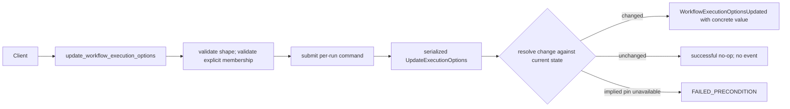

# Design Document: Workflow Options API Conformance

## Overview

`UpdateWorkflowExecutionOptions` commits mutable workflow execution options through a
per-run transition. Direct, batch, and post-reset callers share the same durable
mutation shape. A concrete `versioning_override` affects workflow-task routing; the
v0.32 implied-pinned form is an unresolved command intent that the pure kernel resolves
against authoritative run state in lane order.

## Dependencies and Non-Goals

- Depends on the start-field versioning override model from `api-conformance-start-fields`.
- Does not implement worker deployment administration; it stores and applies the per-workflow override value carried by this RPC.
- Must remain consistent with start-field versioning override semantics.

## History Event Contract

`WorkflowExecutionOptionsUpdated` is emitted only for committed option changes.
The serializer includes exactly the changed options. `versioning_override` is present
when a concrete value is authored, absent when unchanged, and represented by the unset
flag when cleared. Empty masks and value-equivalent updates are successful no-ops and
emit no event. An implied pinned command is resolved before event construction, so
history always records the concrete pinned version.

## Architecture

## Components and Interfaces

- `crates/tokeira-edge/src/grpc/workflow_service.rs`: replace stub with handler.
- `crates/tokeira-edge/src/grpc/translate.rs`: add free request/response translation functions.
- `crates/tokeira-edge/src/workflow_service.rs`: resolve execution and submit command.
- `crates/tokeira-kernel/src/command.rs`: carry a versioning change intent with
  `Unchanged`, concrete `Set`, `SetImpliedPinned`, and `Clear` variants.
- `crates/tokeira-kernel/src/state.rs`: persist execution options including versioning override.
- `crates/tokeira-runtime`: apply changed options to subsequent dispatch/routing decisions.
- `crates/tokeira-edge/src/translate/history_serializer.rs`: serialize changed option fields.

### Serialized implied-pinned resolution

Temporal resolves an omitted pinned version while holding the workflow lease, before
`MergeAndApply` persists the update (`service/history/api/updateworkflowoptions/api.go
@ v1.31.0`). Tokeira preserves the observable ordering without importing Temporal's
service architecture: the Edge translates the wire value to `SetImpliedPinned`, the
runtime submits that intent to the run's lane, and the pure kernel resolves it from the
authoritative `WorkflowState` inside the transition. The kernel performs no I/O.

If `effective_behavior()` is PINNED and `effective_deployment()` is present, the kernel
converts the intent to a concrete pinned `VersioningOverride`, compares it with current
state, and authors that concrete value if changed. Otherwise it rejects with the exact
v1.31.0 failed-precondition reason. Explicit pinned values continue to use the runtime's
task-queue membership validation before submission; the implied version was established
by a completed versioned workflow task and is already part of authoritative run state.

The Edge reloads the post-commit run snapshot for the response. It never echoes the
unresolved request marker or resolves the marker from a pre-submit read, which would be
racy with a concurrent workflow-task completion.

## Correctness Properties

### Property 1: Options Commit Fidelity

For any supported option subset, the committed state and emitted history event contain exactly those changes.

**Validates:** Requirements 1.1, 3.1, 3.2.

### Property 2: Versioning Override Fidelity

For any authored `versioning_override`, committed state, emitted history, and subsequent routing metadata reflect the requested value.

**Validates:** Requirements 1.2, 1.3, 1.4.

### Property 3: Expected Error Mapping

Malformed run id, missing execution, malformed options, and an unavailable implied pin
map to their documented gRPC statuses; an empty mask is not an error.

**Validates:** Requirements 1.4, 1.5, 1.6, 2.1, 2.2, 2.4, 2.5.

### Property 4: Serialized implied-pin ordering

For any ordering of an implied-pinned update and a workflow-task completion that makes
the run pinned, the committed result equals the lane order: update-before-completion
rejects without mutation, while completion-before-update resolves and records that
completion's concrete deployment version. Replay restores the same concrete override.

**Validates:** Requirements 1.6, 1.7, 1.9, 3.2, 3.4.

### Property 5: No-op fidelity

For any current options, an empty mask or a requested value equal to current state
returns those current options without changing transition sequence or appending a
history event.

**Validates:** Requirements 1.5, 1.8, 3.1.

## Error Handling

| Condition | Error | gRPC status |
|---|---|---|
| Malformed run id | bad request | `INVALID_ARGUMENT` |
| Missing execution | workflow not found | `NOT_FOUND` |
| Empty mask or value-equivalent update | successful no-op | `OK` |
| Incompatible option value | failed precondition | `FAILED_PRECONDITION` |
| Implied pin on a non-pinned run | kernel rejection | `FAILED_PRECONDITION` |

## Testing Strategy

- Translator tests for every request field.
- Kernel tests for options state and event emission.
- Serializer tests for `WorkflowExecutionOptionsUpdated`.
- gRPC tests for missing execution, malformed run id, empty-mask no-op, and incompatible option values.
- Restart/recovery tests for persisted option state and dispatch behavior.
- Kernel property tests for implied-pin serialization, concrete event/replay fidelity,
  exact no-mutation rejection, and empty/value-equivalent no-ops.
