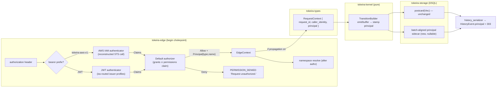

# Design Document: Authorization Foundation

## Overview

This design delivers the configured auth layer decided in
[`docs/conformance/v1.31.0/authorization.md`](../../../docs/conformance/v1.31.0/authorization.md):
a `tokeira-auth` crate holding the Claims/Role model, the multi-issuer JWT authenticator
(JWKS-backed, `iss`-routed), the AWS IAM authenticator (presigned STS `GetCallerIdentity`
bearer), and the default authorizer; the `[policy.authorization]` config section (presence-
enables, curated to the close-to-zero claim of `docs/readiness/configuration.md`); the edge
chokepoint upgraded to Temporal's enforcement semantics (deny shape, ordering, coverage);
Principal Attribution from the edge through the kernel to history read-back; and the four
dynamic-config keys wired through the conformance-only registry. It is derived from ground truth
gathered 2026-07-16:

- the pinned Temporal source checkout (tag `v1.31.0`) — every behavioural claim cites it;
- the tokeira edge seam (`crates/tokeira-edge/src/interceptors.rs` — the `begin` chokepoint) and
  its verified call-site inventory (60 workflow-service + 10 operator-service + 1 health, with
  the CHASM/AdminService bypasses called out);
- the storage constraint: history batches are positional postcard blobs
  (`crates/tokeira-storage/src/dsql/codec.rs:48-56`), which forbids in-place struct growth.

Design priorities follow the repo's standing order: DSQL correctness and clean seams over speed;
kernel purity untouched (the principal is request *input*, deterministic under replay, like
`caller_identity`).

## Dependencies and Non-Goals

### Owning relationships

- **`conformance-config-override`** owns the override registry, honesty boundary, and fork
  bridge; this design only adds four `Wired` keys and their consult-site accessors.
- **The decision record** owns the surface boundary (bearer-only at the edge, no mTLS, no
  plugins, no Nexus principal propagation; the AWS IAM bearer as tokeira-native extension); this
  design implements, it does not re-decide.
- **Nexus specs** own the completion-callback listener's token auth; untouched here.
- **`workflow-reset` / kernel specs** own event-buffering mechanics; this design adds a stamp at
  the existing buffer/emit sites, not new buffering behaviour.

### Non-goals

- No production dynamic config; deployment knobs are static TOML. The `conformance` feature is a
  test-harness-only override shim (it exists purely so the Temporal harness's
  `OverrideDynamicConfig` works against tokeirad) and is never part of a production build; the
  four keys wired here add no production-runtime configurability.
- No per-namespace override granularity in the conformance registry (global-only, per prior
  decision); the upstream namespace scoping of `frontend.enablePrincipalPropagation` is
  documented as collapsed.
- No TLS listener work of any kind.
- No new public RPCs; this is interceptor + history-field surface only.
- No retro-stamping of existing history: old rows read back principal-absent forever.

### New dependencies (governed)

JWT validation needs a Rust JWT library: **`jsonwebtoken`** (RS256/ES256, JWKS `jwk` module,
pure-Rust via `ring`/`aws-lc-rs`) as a workspace dependency, subject to `deny.toml` review. JWKS
fetch and the STS verification call use the existing workspace `reqwest` (`rustls-tls`,
`Cargo.toml:89`). Parsing the small fixed `GetCallerIdentityResponse` XML adds **`quick-xml`**
(same governance). Deliberately **no** `aws-sdk-*` dependency on the auth path — the STS call is
one presigned HTTPS request, and the SDK's credential machinery is exactly what the design must
not need (the *client* signs; the server only forwards and reads).

## Architecture

Three planes. The **edge plane** authenticates and authorizes at the existing `begin` chokepoint —
reordered so authorization precedes namespace resolution. The **carry plane** threads the computed
principal on the internal `RequestContext` (the single-process collapse of upstream's
`temporal-principal-*` gRPC headers). The **durability plane** stamps events in the kernel
transaction and persists attribution *beside* the postcard batch, never inside it.



The `tokeira-auth` crate is transport-free (no tonic, no HeaderMap): it exposes
`Claims`/`Role`/`ClaimMapper`/`Authorizer` plus the JWT/JWKS implementations; the edge adapts it
behind the existing `Authenticator` seam. Kernel purity holds: `tokeira-kernel` gains a plain data
field on its inputs/outputs, no new dependency.

## Components and Interfaces

### `crates/tokeira-auth` — the identity core (new)

```rust
/// Bitmask per roles.go:3-14 @ v1.31.0.
#[derive(Clone, Copy, PartialEq, Eq)]
pub struct Role(pub i16);
impl Role {
    pub const UNDEFINED: Role = Role(0);
    pub const WORKER: Role = Role(1);
    pub const READER: Role = Role(2);
    pub const WRITER: Role = Role(4);
    pub const ADMIN: Role = Role(8);
    pub fn is_valid(self) -> bool { self.0 & !0b1111 == 0 }
    pub fn satisfies(self, required: Role) -> bool { self.0 >= required.0 } // numeric >=, roles.go quirk incl.
}

/// roles.go:25-36 @ v1.31.0 (Extensions omitted — no consumer).
pub struct Claims {
    pub subject: String,
    pub system: Role,
    pub namespaces: HashMap<String, Role>,
    pub auth_type: String, // "jwt" | "aws-iam" | "" — feeds Principal.type
}

/// Server-computed identity destined for HistoryEvent.principal (field 303).
pub struct AuthPrincipal { pub principal_type: String, pub name: String }
impl AuthPrincipal { pub fn is_empty(&self) -> bool { /* both fields empty */ } }

pub trait ClaimMapper: Send + Sync {
    /// `token` is the RAW auth-header value ("" when absent); `extra` the extras header.
    /// Issuer routing, per-profile audience checks, grants rules, and the aws-iam bearer
    /// dispatch are internal to implementations.
    async fn get_claims(&self, token: &str, extra: &str) -> Result<Claims, AuthError>;
}

/// What the RPC is, in upstream classification terms (metadata.go @ v1.31.0).
pub struct CallClassification { pub scope: Scope, pub access: Access } // Scope::{Namespace,Cluster,Unknown}, Access::{ReadOnly,Write,Admin,Unknown}

/// Temporal's authorizer has THREE outcomes (Result{Decision, Reason, Principal} + error,
/// authorizer.go:38-56 @ v1.31.0): allow (optionally with a principal), deny (optionally with a
/// reason → PermissionDeniedFailure.reason), and authorizer *failure* (visibility gated by
/// expose_authorizer_errors — Requirements 5.2/5.3). The type system carries all three:
pub enum AuthzDecision {
    Allow { principal: Option<AuthPrincipal> },
    Deny { reason: Option<String> },
}

pub trait Authorizer: Send + Sync {
    /// Ok(_) is a decision; Err(_) is an authorizer failure, exposed verbatim iff
    /// expose_authorizer_errors, else the generic deny.
    fn authorize(&self, claims: Option<&Claims>, target: &CallTarget) -> Result<AuthzDecision, AuthzError>;
}
pub struct CallTarget<'a> {
    pub api_name: &'a str,           // full method name for health-check matching
    pub namespace: Option<&'a str>,  // NAME, unresolved — deny-before-existence
    pub classification: CallClassification,
}
```

- `JwtAuthenticator`: multi-issuer — routes each token to its issuer profile by exact `iss`
  match (deny when unmatched: Deviation 3 strictness), then runs the Requirement 3 pipeline
  verbatim against that profile, exact upstream error strings
  (`default_jwt_claim_mapper.go:76-110 @ v1.31.0`); permissions grammar (`:112-147,203-215`)
  union'd with the profile's matched `grants` rules via the shared `GrantRules` engine.
- `GrantRules`: pattern-match (`match_sub` / `match_arn`) → `grant` list. The pattern grammar is
  pinned (Requirement 1.5): full-string, case-sensitive, `*` the only metacharacter matching any
  possibly-empty sequence **including** separators (`:`/`/`/`-` not special — patterns must be
  anchored), empty pattern a boot error; the matcher is property-tested against the reference
  (anchored regex, `*` → `.*`, all else escaped). Each grant string is parsed by the **same**
  `ns:role` parser as the permissions claim — strict at config-validation time (boot error),
  permissive-skip semantics never apply to operator-authored grants. Shared by the JWT and AWS
  IAM paths.
- `JwksKeyProvider` (one per issuer profile, single `jwks_uri`): `reqwest`-fetched,
  `kid`-indexed RSA/ECDSA keys, `RS256`/`ES256` only; per-profile **atomic swap** on a tokio
  interval when configured — a failed fetch keeps that profile's previous keys, and profiles are
  isolated from each other's failures
  (mechanics per `default_token_key_provider.go:43-53,90-92,110-166 @ v1.31.0`, re-scoped from
  upstream's one multi-URI provider). Initial-fetch failure logs and serves an empty set (every
  token then fails key lookup — upstream behaviour).
- `StsAuthenticator` (Requirement 11): decode `tokeira-aws-v1.` bearer → **pure URL validator**
  (the full Requirement 11.2 checklist: https/no-userinfo/no-fragment/port-443-only/path-`/`;
  host exactly `sts.amazonaws.com` | `sts.<region>.amazonaws.com` — `aws` + `aws-us-gov`
  partitions, `.com.cn`/ISO out of scope; `Action=GetCallerIdentity` exactly once;
  `X-Amz-Algorithm=AWS4-HMAC-SHA256`; credential scope `…/sts/aws4_request` region-consistent
  with host; `X-Amz-Date` valid and now ∈ `[date, date+expires]`, `X-Amz-Expires ≤ 900`; no
  duplicated security-critical query params) → **reconstruct** the request against the validated
  host (never fetch the client URL verbatim — SSRF containment) with redirects disabled, 200-only,
  bounded response body → extract `Arn` from the response XML →
  `Claims { subject: arn, auth_type: "aws-iam" }` + `GrantRules` union. Digest-keyed verdict
  cache, TTL ≤ remaining presigned validity; deny verdicts are not cached. The STS base URL has
  an internal (non-config) override seam so integration tests can point it at a local fixture.
- `DefaultAuthorizer`: Requirement 4 decision procedure; health-check set
  `{"/grpc.health.v1.Health/Check", "/temporal.api.workflowservice.v1.WorkflowService/GetSystemInfo"}`
  checked before nil-claims (`frontend_api.go:8-28`, `default_authorizer.go:35-77 @ v1.31.0`).
- The stock default (no identity source configured) keeps the existing permissive short-circuit —
  observably identical to upstream's noop pair (`claim_mapper.go:52-59`,
  `noop_authorizer.go:12-14 @ v1.31.0`); no literal noop implementations are needed.

### Action classification (edge)

`Action` grows the missing per-RPC variants (operator search-attribute trio, remote-cluster trio,
Nexus-endpoint five, standalone-activity eight, `DescribeMutableState`) and gains a total
function:

```rust
impl Action {
    /// Faithful to common/api/metadata.go:70-201 @ v1.31.0. Every variant maps; no default arm.
    pub fn classification(&self) -> CallClassification { /* per-RPC table */ }
}
```

The table is unit-tested against the non-negotiable rows in Requirement 4.4. `OperatorRead`/
`OperatorWrite` remain only where they genuinely coincide with upstream classes; call sites whose
upstream class differs (e.g. `GetNexusEndpoint` = cluster/Admin) move to their new variants.

Health-check membership is keyed on **exact full method names** upstream
(`frontend_api.go:8-11 @ v1.31.0`), so the classification also carries an `is_health_check` bit
that is true for exactly the `Action`s mapping to `/grpc.health.v1.Health/Check` and
`/temporal.api.workflowservice.v1.WorkflowService/GetSystemInfo` (`Action::HealthRead`,
`Action::GetSystemInfo`) — a misclassification here would deny an unauthenticated SDK's
connect-time `GetSystemInfo`, a conformance-visible break, so it gets its own anonymous-caller
test.

### Edge pipeline changes (`crates/tokeira-edge`)

`Authenticator` trait becomes claims-shaped, and `begin` reorders:

```rust
pub trait Authenticator: Send + Sync {
    async fn authenticate(&self, headers: &HeaderMap) -> EdgeResult<Option<Claims>>;
    /// Maps tokeira-auth's Result<AuthzDecision, AuthzError> to the wire:
    /// Deny{reason} → EdgeError::PermissionDenied{reason}; Err(AuthzError) → verbatim iff
    /// expose_authorizer_errors, else the generic deny. Ok carries the optional principal.
    async fn authorize(&self, claims: Option<&Claims>, action: Action, namespace: Option<&str>)
        -> EdgeResult<Option<AuthPrincipal>>;
}
// begin: request-id → authenticate → authorize(namespace NAME) → resolve namespace → EdgeContext
```

- `EdgeContext.principal: Principal{subject, scopes}` becomes `claims: Claims` +
  `auth_principal: Option<AuthPrincipal>`. The one existing consumer
  (`start_batch_operation` identity fallback,
  `crates/tokeira-edge/src/workflow_service.rs:1978-1982` — the domain file, not `grpc/`) reads
  `claims.subject`.
- **Deny mapping**: new `EdgeError::PermissionDenied { reason: String }` mapped to
  `Status::permission_denied("Request unauthorized.")` carrying a `PermissionDeniedFailure`
  detail (empty or authorizer `reason`), generalizing the existing worker-versioning builder
  (`grpc/errors.rs:382-405`). The legacy `Unauthorized → UNAUTHENTICATED` mapping stays only for
  any pre-existing non-auth users; the auth path never produces it
  (`interceptor.go:43-51,260-263 @ v1.31.0`).
- **Coverage closure**: the six bridge-direct CHASM handlers —
  `start`/`describe`/`poll`/`request_cancel`/`terminate`/`delete_activity_execution`
  (`grpc/workflow_service.rs:2827-3181`; `list`/`count` already delegate to the begin-guarded
  domain layer) — call `begin` with new standalone-activity actions (classification
  `metadata.go:91-98 @ v1.31.0`, noting `PollActivityExecution` is ReadOnly); AdminService
  `DescribeMutableState` (`grpc/admin_service.rs:39-77`) calls `begin` under cluster/Admin.
- **Task-token namespace identity + enforcement** (Requirement 6). Today every token-bearing
  handler authorizes with `namespace = None` before decoding the token
  (`crates/tokeira-edge/src/workflow_service.rs:3437` pattern), and no tokeira token carries a
  namespace (`tokens.rs:24-60`, `nexus.rs:582-586`) — so namespace-scoped roles could never
  authorize an SDK request that omits `namespace`. The fix, per Requirement 6.4:
  - The edge owns a generic private `NamespacedTaskToken<T>` JSON envelope with
    `#[serde(default)] namespace_id: Option<NamespaceId>` plus `#[serde(flatten)] token: T` for
    `WorkflowTaskToken` and `ActivityTaskToken`. The internal token structs stay unchanged:
    they are runtime/kernel fencing values, while namespace back-fill and mismatch rejection
    are edge admission concerns. This also avoids spreading a compatibility-only field through
    kernel command literals and runtime retry reconstruction. `NexusTaskToken` is the deliberate
    exception: it already implements Temporal v1.31.0's exact three-field protobuf token with
    mandatory stable namespace ID at field 1 (`crates/tokeira-runtime/src/nexus.rs:582-610`), so
    it is decoded directly and never JSON-wrapped. The identity is the **stable ID**, mirroring
    upstream (`common/tasktoken/token.go:21,47 @ v1.31.0`). Not the name: namespace deletion
    atomically renames the record while preserving its ID
    (`crates/tokeira-edge/src/operator_service.rs:324-346`), and
    `NamespaceCache::get_by_id` resolves the stable ID across that rename, tombstones included
    (`crates/tokeira-edge/src/namespace_cache.rs:54-62`). The workflow/activity envelopes are
    serde_json and self-describing, with flattened internal fields, so legacy in-flight tokens
    decode with `None` and get today's behaviour; no versioning machinery is needed.
  - Workflow/activity poll-response serializers populate the envelope; the existing Nexus
    schedule path continues populating protobuf field 1.
  - The token-bearing handlers split admission into two branches, preserving upstream error
    precedence:
    - **empty request namespace**: decode the token and resolve `namespace_id` → current name
      via `NamespaceCache::get_by_id` **before** authentication (upstream back-fills at
      position 5, ahead of auth at 8; malformed token here → `INVALID_ARGUMENT` pre-auth),
      then authenticate → authorize against the resolved name → resolve namespace state;
    - **non-empty request namespace**: authenticate → authorize that name → resolve; token
      decode + the post-load check (`validate_task_token_namespace`) follow, under the
      `enableTokenNamespaceEnforcement` accessor (constant `true`) — a mismatch of two present
      identities (compared by stable ID) →
      `INVALID_ARGUMENT` `Operation requested with a token from a different namespace.`
      (`namespace_validator.go:38,226-250,348-357 @ v1.31.0`; upstream's mismatch check is
      post-auth at position 13, so unauthorized callers get `PERMISSION_DENIED` first).
- **Cross-namespace command authorization** (Requirement 8): in the `RespondWorkflowTaskCompleted`
  path, when the (conformance-only) gate is on, collect
  `(target_namespace, api)` pairs from SignalExternal/StartChild/RequestCancelExternal commands,
  dedupe, re-run `authorize` per pair (`interceptor.go:287-353 @ v1.31.0`).
- **Metrics**: authorization latency timer + two counters at the `begin` seam, following
  `observe_edge_call` conventions (`interceptor.go:247-259 @ v1.31.0` for names/semantics).

### Configuration (`crates/tokeira-config`)

`AuthorizationConfig` lands as a `PolicyConfig` field (TOML `[policy.authorization]` — keeping
the readiness doc's four-section claim intact) with the Requirements sketch's shape, crate
conventions (`deny_unknown_fields`, default fns, hand-written `Default`), and **presence-enables**
semantics: `fn enforcement_enabled(&self) -> bool` = at least one issuer or the `aws_iam` table.

> **Migration warning — exact issuer routing** (must ship beside `issuer` in operator docs and
> the canonical `config.example.toml` when created): `issuer` is not a profile label — it must
> exactly and case-sensitively match the IdP token's `iss` claim, including scheme, path, and
> trailing-slash form. Unlike Temporal v1.31.0's merged keyring, tokeira rejects missing or
> unmatched issuers; a mismatch denies every JWT from that IdP as `Request unauthorized.`

Validation (Requirement 1.3) lands in `TokeiraConfig::validate()` as `ValidationError::Field`
entries: required issuer fields, unique `name`/`issuer`, grant strings parsed by the shared
grammar, non-empty globs, non-empty `aws_iam.grants`. `tokeirad` builds the authenticator from it
at the single wiring point (`apps/tokeirad/src/lib.rs:902`), replacing
`EdgeInterceptors::permissive(...)` with
`EdgeInterceptors::new(request_ids, configured_authenticator, namespaces)` — config and namespace
cache are already in scope there. Validation failures are fatal at boot (the spirit of
`cmd/server/main.go:197-221 @ v1.31.0`, reached earlier by design).

### Principal carry + kernel stamp

- `RequestContext` (`crates/tokeira-types/src/request.rs:27-39`) gains
  `principal: Option<EventPrincipal>` beside `caller_identity`. `EventPrincipal{principal_type,
  name}` lives in `tokeira-types` so kernel/storage/edge share it without new edges in the crate
  graph. The edge maps `AuthPrincipal → EventPrincipal` field-for-field when constructing
  `RequestContext`; the two types are deliberately distinct so kernel/storage take no
  `tokeira-auth` dependency (asserted structurally in the test suite).
- Threading: the `to_internal.rs` builders take the principal from `EdgeContext` (they currently
  take `(req, &RequestId)`; they grow a context parameter — sites enumerated in the ground-truth
  inventory: `to_internal.rs:132,214,374,453,477,498,517,537` + the `workflow_service.rs`
  construction sites).
- Kernel: the attribution rides the transition, end to end:
  1. **Builder input** — `TransitionBuilder` is constructed with the request's
     `Option<EventPrincipal>` (from `RequestContext.principal`), held as a plain field for the
     transaction's duration.
  2. **Emit** — `emit`/`emit_at` (`kernel.rs:5588-5612`) push the current principal onto a
     `Transition.event_principals: SmallVec<[Option<EventPrincipal>; 8]>` — a **new field on
     `Transition`** (`transition.rs:23-38`; safe to grow: `Transition` is the in-memory commit
     payload, never postcard-persisted), index-aligned with `history_events`
     (`debug_assert_eq!` on the lengths at commit). The push is skipped-to-`None` when the
     principal `is_empty()` (Requirement 7.3).
  3. **Buffer** — `buffer` (`kernel.rs:5618-5625`) stores the principal **into the durable
     buffered event**: `BufferedEvent` (`state.rs:242` — `{ admitted_at, kind }`, held on the
     postcard-persisted `WorkflowState`) gains a trailing
     `principal: Option<EventPrincipal>` field, so a buffered principal survives restart before
     flushing. This is a persisted-shape change to `workflow_hot` state, executed under the
     **pre-baseline** rules (see below).
  4. **Flush** — the flush path emits the buffered event with **its stored principal**, not the
     flusher's, giving the preservation semantics of
     `mutable_state_impl.go:7105-7124 @ v1.31.0` for free (the `event.Principal == nil` check
     collapses to "buffered events carry their own").
  Determinism: the principal is part of the request input, like `caller_identity` — replay sees
  the same stamped events from history; `Kernel::apply` gains no parameter.

### Durable representation (the postcard constraint)

History batches persist as `postcard(Vec<HistoryEvent>)` blobs
(`codec.rs:48-56`); postcard is positional with no field count, so the persisted `HistoryEvent`
struct cannot grow a field without breaking decode of every existing row (the codebase's own
discipline: `WorkflowExecutionStartedV2` decode-only-legacy, `event.rs:703-714`).

**Decision (pinned): a nullable `principals_data BYTEA` column folded into
`V005__history_batch.sql`**, per the pre-baseline migration rule (storage `AGENTS.md`: "no
`ALTER TABLE` — fold a new column into the table's base `CREATE TABLE` migration and let its
checksum change"). Not a sibling table (row explosion for a per-batch concern), not an in-blob
change (breaks positional decode), not a try-decode envelope (postcard is not self-describing —
ambiguity risk). The column holds `postcard(Vec<Option<EventPrincipal>>)`, index-aligned with the
events vector:

- **Write** — the commit path (`run_repository/commit.rs:496`, the `events_data` bind) binds
  `principals_data` from `Transition.event_principals` in the **same statement** — atomic with
  the batch by construction; `NULL` when every entry is `None` (all rows today, and any
  attribution-off batch), so write amplification only when attribution is on.
- **Read** — the load paths (`run_repository/load.rs:139,235,296`) pair
  `decode_history_events` with the sidecar: `NULL`/absent → all-`None`; length mismatch →
  storage corruption error (never silent truncation). The repository read API returns the pair —
  `AttributedHistoryBatch { events: Vec<HistoryEvent>, principals: Vec<Option<EventPrincipal>> }`
  (or `Vec<(HistoryEvent, Option<EventPrincipal>)>`) — and the edge serializer consumes it.
- **Pre-baseline shape changes, proven by fixture** — both persisted-shape edits (the V005
  column; the `BufferedEvent.principal` field inside `WorkflowState`) happen under the
  build-phase rules (checksum-changing edit; fresh database at deploy). Old-shaped postcard
  fixtures MUST pin the decode behaviour: a pre-change `history_batch` row (NULL sidecar) reads
  back all-`None`; a pre-change `WorkflowState` blob's documented outcome under the new
  `BufferedEvent` shape is asserted by test (it fails positional decode — acceptable only
  pre-baseline, which the fixture test documents; post-baseline this change would have required
  a versioned envelope).
- The in-memory store (`storage-memory-fidelity`) mirrors the same pairing structurally.

### Read-back serializer

`history_event_to_proto` (`history_serializer.rs:104-116`) gains
`principal: attribution.map(|p| commonpb::Principal { r#type: p.principal_type, name: p.name })`.
The generated type already exists — vendored proto field 303
(`proto/upstream/temporal/api/history/v1/message.proto:1174`) is compiled into `tokeira-proto`
today. All three call sites (poll-response history, `GetWorkflowExecutionHistory`, reverse) flow
through this one function.

### Conformance keys

Four `Wired` entries + twin accessors (Requirement 9). The two config-backed knobs use the
accessor-with-configured-fallback idiom (`chasm_activity.rs:67-104` precedent):

```rust
#[cfg(not(feature = "conformance"))]
#[inline] fn principal_propagation_enabled(configured: bool) -> bool { configured }
#[cfg(feature = "conformance")]
#[inline] fn principal_propagation_enabled(configured: bool) -> bool {
    tokeira_conformance::overrides().get_bool("frontend.enablePrincipalPropagation").unwrap_or(configured)
}
```

`enableTokenNamespaceEnforcement` / `enableCrossNamespaceCommands` fall back to constants
(`true` / `false`). The classification entry for `frontend.enablePrincipalPropagation` documents
the namespace→global collapse.

## Correctness Properties

Each property below is validated by a property test (Testing Strategy). Regression- and
structurally-verified guarantees are separate — see [Integration and structural
invariants](#integration-and-structural-invariants).

### Property 2: Permissions-grammar fidelity
*For any* JWT `permissions` array (arbitrary strings, arbitrary case, malformed entries, repeated
grants, `temporal-system` entries) combined with any set of grants rules, the resulting `Claims`
equals the upstream grammar oracle union'd with the matched grants: case-insensitive roles,
case-sensitive namespaces, OR-accumulation, skip-never-error for claim entries (grants are
boot-validated). **Validates: 3.4, 3.5**

### Property 3: Decision-table fidelity
*For any* `Claims` (arbitrary role bitmasks, arbitrary namespaces) and any classified `Action`,
the authorizer's decision equals the upstream procedure: health-check pre-claims allow, nil-claims
deny, system|namespace union, numeric `>=`, unknown-scope deny — including the `Worker=1
satisfies nothing` quirk. **Validates: 2.4, 4.1-4.4**

### Property 5: Attribution lifecycle
*For any* interleaving of client transactions and worker completions with buffering: every emitted
event carries the principal of the transaction that created it; buffered events keep their
original principal across flushes; empty principals and propagation-off produce absent field 303;
old (sidecar-less) rows read back principal-absent. **Validates: 7.1-7.5, 7.7**

### Property 7: Conformance-override equivalence
Off-feature, each of the four accessors equals its static-config/constant value and no override
surface exists; on-feature with no override set, behaviour is identical; set/clear/reset follow
the registry lifecycle. **Validates: 9.1-9.3**

### Property 8: Issuer routing soundness
*For any* configured issuer set and any token, the token verifies only against the profile whose
`issuer` exactly equals its `iss` claim — never against another profile's keys, audience, or
grants; unmatched or missing `iss` denies. **Validates: 3.2 (routing), 1.3 (uniqueness)**

### Property 9: STS containment and fail-closure
*For any* bearer value (arbitrary bytes after the `tokeira-aws-v1.` prefix; adversarial URLs
including userinfo, fragments, odd ports/paths, duplicated `X-Amz-*`/`Action` params, foreign
hosts, stale or future `X-Amz-Date`, oversized `X-Amz-Expires`), either the pure validator
rejects with no outbound request, or the outbound request host matches the static STS host
pattern with redirects disabled; STS errors, non-200s, redirects, oversized bodies, and timeouts
deny; a granted verdict is never served beyond the presigned URL's validity.
**Validates: 11.2, 11.3, 11.5**

### Property 10: Grant-matcher fidelity
*For any* pattern under the Requirement 1.5 grammar and any candidate string (including strings
containing separators and newlines), the matcher's verdict equals the reference implementation's
(anchored regex, `*` → `(?s:.*)`, all else escaped) — no substring, case-insensitive, or
separator-special behaviour. **Validates: 1.5**

## Integration and structural invariants

Guarantees held to the same bar as the properties, but verified by integration/regression tests
and structural assertions rather than proptests (per the Kiro convention that Correctness
Properties are property-tested):

### Invariant I1: Stock-default invariance
*For any* request stream, a server with `[policy.authorization]` absent (or present with no
identity source) produces responses and history byte-identical to today's permissive build: no
deny, no principal on any event. **Validates: 1.2, 1.4, 2.3, 7.4**

### Invariant I2: Deny-shape and information containment
*For any* authn/authz failure, the caller observes exactly `PERMISSION_DENIED` /
`Request unauthorized.` / `PermissionDeniedFailure{reason}` — with reason nonempty only for
authorizer denials carrying one; claim-mapper errors never leak detail; authorizer *errors* leak
iff `expose_authorizer_errors`. An unauthorized caller cannot distinguish existing from
non-existing namespaces. **Validates: 3.7, 5.1-5.3**

### Invariant I3: Spoof impossibility
*For any* client-controlled request content (metadata keys including `temporal-principal-*`,
request fields), the stamped principal derives only from server-side authentication. **Validates:
7.6**


## Error Handling

| Condition | Status | Message / detail |
|---|---|---|
| Malformed auth header (parts ≠ 2) | `PERMISSION_DENIED` | `Request unauthorized.` (+ empty-reason detail); internal: `unexpected authorization token format` logged (`default_jwt_claim_mapper.go:86-89 @ v1.31.0`) |
| Non-bearer scheme | `PERMISSION_DENIED` | generic; internal `unexpected name in authorization token` (`:90-92`) |
| No `kid` / unknown `kid` / bad signature / expired / audience mismatch / bad `sub` | `PERMISSION_DENIED` | generic; internal per `:151-199,97-100` |
| Authorizer deny (no reason) | `PERMISSION_DENIED` | `Request unauthorized.` + `PermissionDeniedFailure{reason: ""}` (`interceptor.go:43-51 @ v1.31.0`) |
| Authorizer deny (reason) | `PERMISSION_DENIED` | `Request unauthorized.` + `PermissionDeniedFailure{reason}` (`:260-263`) |
| Authorizer error, expose off | `PERMISSION_DENIED` | generic (`:250-257`) |
| Authorizer error, expose on | verbatim | the authorizer's own error (`:253-256`) |
| Token `iss` absent / matching no configured issuer | `PERMISSION_DENIED` | generic (Deviation 3 strictness; Requirement 3.2) |
| Token/request namespace mismatch | `INVALID_ARGUMENT` | `Operation requested with a token from a different namespace.` (`namespace_validator.go:38 @ v1.31.0`) |
| `tokeira-aws-v1.` bearer failing URL validation (scheme/host/action/expiry) | `PERMISSION_DENIED` | generic; internal diagnostic logged (Requirement 11.2) |
| STS error / unreachable / non-matching ARN grants | `PERMISSION_DENIED` | generic, fail-closed; never exposed regardless of `expose_authorizer_errors` (Requirement 11.3, 3.7) |
| Invalid `[policy.authorization]` (missing issuer fields, duplicate name/issuer, malformed grant, empty glob, empty `aws_iam.grants`) | boot failure | `ValidationError::Field` naming the field (Requirement 1.3) |

## Testing Strategy

How each correctness property and invariant is verified:

| Property / invariant | Style | Home |
|---|---|---|
| P2 grammar, P3 decision table, P8 routing, P9 STS validator, P10 grant matcher | `proptest` | `tokeira-auth` |
| P5 attribution lifecycle, P7 override lifecycle | `proptest` | `tokeira-kernel` / conformance crates |
| I1 stock-default invariance | integration regression (and the per-wave merge bar) | task 9.3 + Notes |
| I2 deny shape / containment | exact-string unit rows + integration | tasks 9.2, 9.3 |
| I3 spoof impossibility | structural + regression test | task 6.5 |

- **Property tests** (`proptest`, ≥100 iterations, workspace standard): Properties 2, 3, 5, 7, 8,
  9 per the table — the STS validator PBT runs over adversarial URL corpora with no outbound I/O
  (the validator is pure).
- **Unit tests (example-based, exact strings):** every Error Handling row; the Requirement 4.4
  non-negotiable classification rows; JWKS rotation (per-profile atomic swap, cross-profile
  isolation, initial-failure-nonfatal); config validation failures; `Role::satisfies` edge cases
  including the Worker quirk.
- **Integration tests:** end-to-end JWT flow against a local JWKS fixture (mint RS256/ES256
  tokens, drive Start/Signal/Query through the gRPC edge, assert allow/deny per role); principal
  read-back — start + signal + worker-complete under attribution-on, then
  `GetWorkflowExecutionHistory` asserts field 303 per Property 5, including the half-empty
  regression: an allowed JWT with `sub: ""` stamps `Principal{type: "jwt", name: ""}`
  (Requirement 7.3); storage round-trip of
  sidecar-present and legacy (sidecar-absent) batches; begin-coverage regression (CHASM +
  AdminService paths deny when enforcement is on and the caller has no grants);
  anonymous-caller health-check regression (`GetSystemInfo` and `Health/Check` succeed with no
  token under enforcement — SDKs call `GetSystemInfo` at connect); **multi-issuer routing** —
  two issuer fixtures, a token from each verifies only via its own profile (Property 8), a token
  with a foreign/absent `iss` denies; **grants-rule mapping** — an EKS-shaped token
  (`sub: system:serviceaccount:...`, no permissions claim) is granted via `match_sub` rules;
  **STS end-to-end** — a local STS fixture behind the internal base-URL seam: valid presigned
  bearer allows with `Principal{type:"aws-iam"}` attribution, adversarial URLs (wrong host,
  wrong action, expiry > 900, http scheme) deny without any outbound request (Property 9), STS
  outage denies, verdict cache honours expiry.
- **Structural:** `tokeira-kernel` gains no `tokeira-conformance`/`tokeira-auth` dependency
  (extend the existing dependency-graph assertion); `cargo test --workspace` in the checkpoint
  per campaign convention.
