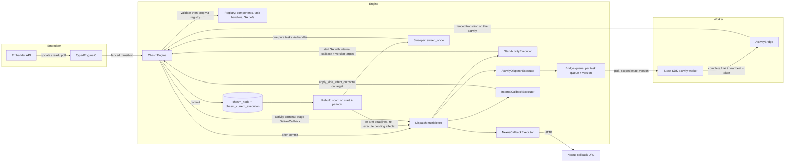

# Design Document: CHASM Extension Archetypes

## Overview

This design lets an embedding application register a CHASM archetype into the embedded
engine and run it as a long-lived, server-owned state machine. It adds four things to the
substrate and runtime that the standalone-activity archetype never needed, and it
re-expresses that archetype's own machinery on top of them so there is one path, not two:

1. **Typed task handlers in the registry.** A library registers pure-task and side-effect
   handlers alongside its components. Validators become real at transition close; pure
   tasks execute through their handler; side-effect outcomes apply through their handler.
2. **Runtime executors for side effects, derived from committed state.** The one hard-coded
   sink becomes a multiplexer over registered executors. A rebuild scan re-derives every
   pending side effect and every armed deadline from node state on start and periodically.
3. **Completion into a component.** Standalone activities gain completion callbacks
   (v1.32.0 semantics, gated), including an internal target that lands in the staging
   component as a fenced transition.
4. **An embedder surface.** A builder that accepts libraries, executors and a clock, and a
   typed handle per registered archetype. The current-run pointer is re-keyed by archetype
   so business ids are independent per archetype, as upstream keys them.

Wire shape comes from the vendored protos at API v1.62.11. Standalone-activity behaviour
comes from `chasm/lib/activity @ v1.31.0`; callbacks from `chasm/lib/activity/activity.go`,
`frontend.go` and `chasm/lib/callback @ v1.32.0`. The registration semantics mirror
`chasm/library.go`, `chasm/task.go` and `chasm/registrable_task.go @ v1.31.0`. The
embedder surface, the deployment-version target and the internal callback target are
Tokeira's own (requirements, decisions D1–D5).

## Dependencies and Non-Goals

### Owning relationships

- `chasm-foundation` owns the substrate contract: purity, the node tree, the versioned
  transition clock, the outbox model, the registry. This design extends the registry and
  the task model and changes no invariant.
- `chasm-activity-timeouts-and-retry` owns the activity's timeout evaluator. This design
  keeps that path unchanged (Requirement 2.8) and absorbs its open task 4.3 (re-arm on
  start) into the rebuild scan.
- `activity-executions-first-class` owns the current-run pointer and its request-id
  idempotence. This design re-keys the pointer by archetype and preserves every behaviour.
- `scoped-worker-authorization` owns poll admission. This design adds one sanctioned
  exception (targeted standalone tasks) and reuses its token-provenance check unchanged.
- The workflow plane's completion-callback delivery (`publisher.rs`) owns the HTTP
  invocation and retry policy. This design factors the invocation into a shared helper and
  reuses the policy; the kernel's callback types stay kernel-only.

### Non-goals

- Multi-node materialization (D4). Callbacks and any bounded history live in the root proto.
- The embedder's archetype, repository or API (D5). The acceptance archetype is test-only.
- Versioning on the public standalone start (D1); `Callback.Internal` on the wire (D2).
- Kernel changes; Nexus; per-namespace gating of callbacks; `RemoveSearchAttributes`.
- Unifying the workflow plane's clock. The injected clock is the CHASM plane's only.

## Architecture

Every arrow below is one of three kinds: a **fenced transition** (clay in the plane
diagram), a **derived effect executed after commit**, or a **rebuild** that re-derives
effects from committed state. Nothing else moves state.



**Control path.** The embedder calls the typed handle in process. `TypedEngine::update`
runs the closure, stages tasks, and commits through `ChasmEngine::update_component`. At
close, the engine consults the registry's validators instead of `RetainAllValidator`.

**Effect path.** After a commit lands, the multiplexer hands each surviving side-effect
task to the executor registered for its task type. Executors are idempotent and may fail;
a failure leaves the task pending. The activity's worker dispatch is the first executor;
starting a standalone activity on behalf of a component is the second; delivering a
callback by HTTP is the third; delivering an internal callback into a component is the
fourth.

**Rebuild path.** On start, before serving, and then periodically, the rebuild scan lists
running executions from the pointer table, loads each root node, re-arms the earliest
pending pure deadline, and re-executes every pending side-effect task whose validator
still holds and whose `fire_at` has elapsed. Losing the process-local queue or armed map
therefore costs at most one scan interval.

**Completion path.** A worker completes an activity through the bridge, as today. The
activity's terminal transition moves each `STANDBY` callback to `SCHEDULED` and stages one
`DeliverCallback` task per callback. The Nexus executor posts by HTTP and records the
attempt; the internal executor applies the outcome on the target component through
`apply_side_effect_outcome`, which runs the target's registered `on_outcome` under a fenced
transition and drops the originating task from the target's outbox.

## Components and Interfaces

### Substrate: `crates/tokeira-chasm`

**Task identity.** `Task` gains a stable name; ids are derived for extensions and explicit
for built-ins, whose persisted outboxes already carry ids 1–5.

```rust
// task.rs
pub trait Task: Serialize + DeserializeOwned + Send + Sync + 'static {
    const KIND: TaskKind;
    /// Stable name, `"<library>.<task>"`; the id is derived from it unless reserved.
    const FQN: &'static str;
    fn fire_at(&self) -> Option<i64>;
    fn encode(&self) -> Result<Vec<u8>, ChasmError>;
    fn decode(bytes: &[u8]) -> Result<Self, ChasmError>;
}

/// Ids below `RESERVED_TASK_ID_LIMIT` (1024) are explicit and reserved for built-in
/// libraries; every other id is `task_type_id_for_fqn(FQN)` (FNV-1a/32, the archetype
/// function) and is rejected if it lands in the reserved range or collides.
pub const RESERVED_TASK_ID_LIMIT: u32 = 1024;
pub fn task_type_id_for_fqn(fqn: &str) -> u32;

/// Outcome of an external side effect, applied through `on_outcome`.
#[derive(Debug, Clone, PartialEq, Eq, Serialize, Deserialize)]
pub enum TaskOutcome {
    Completed { payload: Vec<u8> },
    Failed { failure: Vec<u8>, retryable: bool },
    Canceled { details: Vec<u8> },
    TimedOut { timeout_type: i32 },
    Terminated,
}
```

**Typed handlers.** Mirrors `PureTaskHandler` and `SideEffectTaskHandler` in
`chasm/task.go @ v1.31.0`, minus `Execute` on the side-effect handler, which moves to the
runtime (D3).

```rust
// handler.rs (new module)
pub trait PureTaskHandler: Send + Sync + 'static {
    type Component: EngineComponent + RootComponent;
    type Task: Task;
    fn validate(&self, c: &Self::Component, t: &Self::Task, ctx: &dyn Context) -> TaskValidity;
    fn execute(&self, c: &mut Self::Component, t: &Self::Task, ctx: &mut dyn MutableContext)
        -> Result<(), ChasmError>;
}

pub trait SideEffectTaskHandler: Send + Sync + 'static {
    type Component: EngineComponent + RootComponent;
    type Task: Task;
    fn validate(&self, c: &Self::Component, t: &Self::Task, ctx: &dyn Context) -> TaskValidity;
    fn on_outcome(&self, c: &mut Self::Component, t: &Self::Task, outcome: &TaskOutcome,
        ctx: &mut dyn MutableContext) -> Result<(), ChasmError>;
}
```

**Erased entries.** The registry stores monomorphized closures over encoded bytes, so the
runtime dispatches by `(component_type_id, task_type_id)` with no `Any` and no reflection.
Each closure decodes `C::Data`, builds `C` via `EngineComponent::from_data`, decodes the
task with `Task::decode`, calls the typed handler, and re-encodes on the mutating paths.

```rust
// registry.rs
pub struct TaskEntry {
    pub fqn: &'static str,
    pub task_type_id: u32,
    pub kind: TaskKind,
    pub component_type_id: u32,
    pub library: &'static str,
    pub(crate) erased: ErasedTaskHandler,
}
pub(crate) enum ErasedTaskHandler {
    Pure {
        validate: Box<dyn Fn(&[u8], &[u8], &dyn Context) -> Result<TaskValidity, ChasmError> + Send + Sync>,
        execute: Box<dyn Fn(&[u8], &[u8], &mut dyn MutableContext) -> Result<Vec<u8>, ChasmError> + Send + Sync>,
    },
    SideEffect {
        validate: Box<dyn Fn(&[u8], &[u8], &dyn Context) -> Result<TaskValidity, ChasmError> + Send + Sync>,
        on_outcome: Box<dyn Fn(&[u8], &[u8], &TaskOutcome, &mut dyn MutableContext) -> Result<Vec<u8>, ChasmError> + Send + Sync>,
    },
}

pub struct SearchAttributeDef { pub name: &'static str, pub attr_type: SearchAttrType }

impl RegistryBuilder {
    pub fn register<C: Component>(&mut self, library: &'static str) -> Result<&mut Self, ChasmError>; // exists
    pub fn register_pure_task<H: PureTaskHandler>(&mut self, library: &'static str, handler: H)
        -> Result<&mut Self, ChasmError>;
    pub fn register_side_effect_task<H: SideEffectTaskHandler>(&mut self, library: &'static str, handler: H)
        -> Result<&mut Self, ChasmError>;
    /// Built-in libraries only: an explicit id below the reserved limit.
    pub fn register_reserved_pure_task<H: PureTaskHandler>(&mut self, library: &'static str, id: u32, handler: H)
        -> Result<&mut Self, ChasmError>;
    pub fn register_reserved_side_effect_task<H: SideEffectTaskHandler>(&mut self, library: &'static str, id: u32, handler: H)
        -> Result<&mut Self, ChasmError>;
    pub fn register_search_attributes<C: Component>(&mut self, defs: &[SearchAttributeDef])
        -> Result<&mut Self, ChasmError>;
    /// Marks every library registered so far as built-in; later registrations may not
    /// reuse their names or the reserved id range.
    pub fn seal_built_ins(&mut self) -> &mut Self;
}

impl Registry {
    pub fn task_for_id(&self, component_type_id: u32, task_type_id: u32) -> Option<&TaskEntry>;
    pub fn validate_task(&self, component_type_id: u32, data: &[u8], task: &ScheduledTask, ctx: &dyn Context)
        -> Result<TaskValidity, ChasmError>;
    pub fn execute_pure(&self, component_type_id: u32, data: &[u8], task: &ScheduledTask, ctx: &mut dyn MutableContext)
        -> Result<Vec<u8>, ChasmError>;
    pub fn apply_outcome(&self, component_type_id: u32, data: &[u8], task: &ScheduledTask, outcome: &TaskOutcome,
        ctx: &mut dyn MutableContext) -> Result<Vec<u8>, ChasmError>;
    pub fn search_attribute_defs(&self) -> impl Iterator<Item = (&ComponentEntry, &SearchAttributeDef)>;
    pub fn is_built_in(&self, library: &str) -> bool;
}
```

`Library::register` is unchanged; a library that has tasks calls the new builder methods
inside it. `RegistryBuilder::build` fails on: a non-built-in library using a built-in
name; two task FQNs; two task ids; a derived id below the reserved limit; a reserved
search-attribute name. `close_transaction` keeps its `&dyn OutboxValidator` parameter,
whose `validate` is fallible; the runtime passes a validator backed by `Registry::validate_task`.

`MutableContext` gains one method so a handler can drop the task it is completing:

```rust
pub trait MutableContext: Context {
    fn add_task(&mut self, kind: TaskKind, task_type_id: u32, payload: Vec<u8>, fire_at_unix_nanos: Option<i64>)
        -> Result<(), ChasmError>;                       // exists
    fn mark_dirty(&mut self) -> Result<(), ChasmError>;  // exists
    /// Remove a previously staged task by id; a no-op if absent.
    fn resolve_task(&mut self, id: TaskId);
}
```

`ChasmError` gains `UnknownTaskType { component_type_id, task_type_id }`,
`ReservedLibraryName { name }`, `TaskTypeCollision { first, second, id }`,
`ReservedSearchAttribute { name }`, and `UnregisteredArchetype { archetype_id, executions }`.

### Activity library: `crates/tokeira-chasm-activity`

The library keeps its state machine and adds callbacks, the version target, and task
handlers for what it already stages.

```rust
impl Library for ActivityLibrary {
    const NAME: &'static str = "activity";
    fn register(b: &mut RegistryBuilder) -> Result<(), ChasmError> {
        b.register::<ActivityExecution>(Self::NAME)?
         .register_reserved_side_effect_task(Self::NAME, DISPATCH_TASK_ID, DispatchHandler)?
         .register_reserved_pure_task(Self::NAME, SCHEDULE_TO_START_TASK_ID, ScheduleToStartHandler)?
         .register_reserved_pure_task(Self::NAME, SCHEDULE_TO_CLOSE_TASK_ID, ScheduleToCloseHandler)?
         .register_reserved_pure_task(Self::NAME, START_TO_CLOSE_TASK_ID, StartToCloseHandler)?
         .register_reserved_pure_task(Self::NAME, HEARTBEAT_TASK_ID, HeartbeatHandler)?
         .register_reserved_side_effect_task(Self::NAME, DELIVER_CALLBACK_TASK_ID, DeliverCallbackHandler)?
         .register_reserved_pure_task(Self::NAME, CALLBACK_RETRY_TASK_ID, CallbackRetryHandler)?;
        Ok(())
    }
}
pub const DELIVER_CALLBACK_TASK_ID: u32 = 6;
pub const CALLBACK_RETRY_TASK_ID: u32 = 7;
```

The four timer handlers' `validate` are the crate's existing validators; their `execute`
is the existing `apply(ActivityEvent::TimedOut/…)`. Requirement 2.8 keeps the evaluator
path serving these executions: the sweeper prefers the evaluator when one is installed
for the archetype and falls back to handler execution otherwise, so registering the
handlers changes no timing behaviour while making the outboxes bounded (Requirement 1.10).

New events: `ActivityEvent::CallbacksAttached(Vec<ActivityCallback>)`,
`ActivityEvent::CallbackAttempted { id, attempt_outcome }`, `ActivityEvent::CallbackRetryDue { id }`.
The terminal transitions (`Completed`, `Failed`, `Canceled`, `Terminated`, `TimedOut`)
additionally set every `STANDBY` callback to `SCHEDULED` and stage one `DeliverCallback`
task each, mirroring `activity.go:421-426 @ v1.32.0`.

```rust
pub struct DeliverCallback { pub callback_id: String, pub stamp: i64 }  // KIND = SideEffect
pub struct CallbackRetryTimer { pub callback_id: String, pub attempt: i32, pub fire_at_nanos: i64 } // KIND = Pure
```

`DeliverCallbackHandler::on_outcome` records the attempt: success → `SUCCEEDED`; retryable
failure → `BACKING_OFF`, `next_attempt_time = now + backoff(attempt)` and a staged
`CallbackRetryTimer`; non-retryable → `FAILED`. `CallbackRetryHandler::execute` sets
`SCHEDULED` and stages a new `DeliverCallback`. Backoff is the workflow plane's
`nexus_completion_backoff` over the same runtime config (Requirement 5.7).

`validate_and_normalize` gains `callbacks: Vec<ActivityCallback>` and
`version_target: Option<DeploymentVersionTarget>`; the public edge path always passes
`None` for the target and passes callbacks only with the gate on (Requirements 5.1, 7.2).

### Runtime: `crates/tokeira-runtime/src/chasm`

**Executors and the multiplexer.**

```rust
// executor.rs (new)
#[async_trait]
pub trait SideEffectExecutor: Send + Sync {
    fn task_type_id(&self) -> u32;
    /// Idempotent: re-execution with an unchanged task must produce no second effect.
    async fn execute(&self, key: &ExecutionKey, task: &ScheduledTask) -> anyhow::Result<()>;
}

pub struct DispatchMultiplexer { executors: HashMap<u32, Arc<dyn SideEffectExecutor>> }
impl DispatchMultiplexer {
    pub fn register(&mut self, executor: Arc<dyn SideEffectExecutor>) -> Result<(), ChasmError>; // dup → error
}
#[async_trait]
impl DispatchSink for DispatchMultiplexer {
    async fn dispatch(&self, key: &ExecutionKey, tasks: Vec<DispatchableTask>) -> anyhow::Result<()>;
    // unknown task type → error (unreachable after close-time check; logged, task stays pending)
}
```

`ChasmEngine::new` keeps its `Arc<dyn DispatchSink>` parameter; the engine bootstrap passes
the multiplexer. Close-time validation (`engine.rs:655, 734`) passes
`RegistryOutboxValidator { registry, component_type_id, data, ctx }` instead of
`RetainAllValidator`, and returns `ChasmError::UnknownTaskType` before persisting when a
staged task has no entry (Requirements 1.10–1.12, 3.2).

**Generic outcome application.**

```rust
impl ChasmEngine {
    /// Apply an external outcome to the component that staged `task_id`. No-op (Ok(NotHeld))
    /// when the outbox no longer holds it. Reload-and-rerun on fenced conflict up to
    /// `max_commit_retries`. The drop of the task in the same transition is the
    /// at-most-once fence (Requirement 3.9, 3.10, 6.6).
    pub async fn apply_side_effect_outcome(
        &self,
        target: &ExecutionKey,
        task_type_id: u32,
        task_id: TaskId,
        outcome: TaskOutcome,
    ) -> Result<OutcomeApplied, ChasmError>;
}
pub enum OutcomeApplied { Applied(UpdateOutcome), NotHeld, ExecutionMissing }
```

**Pure-task execution and the sweeper.** `ChasmTimerSweeper` keeps `sweep_once` and its
evaluator. Per execution it now does: if an evaluator is installed for the execution's
archetype, call it (unchanged); otherwise load the root node, select pure tasks with
`fire_at <= now` whose registered validator holds, run each through
`Registry::execute_pure` in one fenced transition with `resolve_task` for each, and re-arm
to the earliest remaining deadline. Evaluators are installed per archetype id:

```rust
impl ChasmTimerSweeper {
    pub fn new(engine: Arc<ChasmEngine>) -> Self;
    pub fn with_evaluator(self, archetype_id: u32, evaluator: Arc<dyn TimeoutEvaluator>) -> Self;
    pub async fn sweep_once(&self) -> usize;  // exists; unchanged signature
}
```

**Rebuild scan.** A sibling of `VisibilityRepairScanner` with the same spawn pattern.

```rust
// rebuild.rs (new)
pub struct OutboxRebuildScanner { nodes: Arc<dyn ChasmNodeRepository>, engine: Arc<ChasmEngine>, sink: Arc<DispatchMultiplexer> }
pub struct RebuildStats { pub scanned: usize, pub timers_armed: usize, pub effects_executed: usize }
impl OutboxRebuildScanner {
    pub fn new(nodes: Arc<dyn ChasmNodeRepository>, engine: Arc<ChasmEngine>, sink: Arc<DispatchMultiplexer>) -> Self;
    /// One pass: list running pointers (deterministic order), load each root node,
    /// set the armed timer to the outbox's earliest pure deadline, and hand every pending
    /// side-effect task whose validator holds and whose fire_at has elapsed to the sink.
    pub async fn rebuild_once(&self) -> anyhow::Result<RebuildStats>;
}
```

The engine bootstrap calls `rebuild_once` before the gRPC adapter starts serving
(Requirements 2.4, 3.4) and then spawns it on `CHASM_REBUILD_INTERVAL` (a constant beside
`VISIBILITY_REPAIR_INTERVAL`).

**Executors shipped by this design.**

| Executor | Task type | Effect | Idempotence fence |
|---|---|---|---|
| `ActivityDispatchExecutor` | `activity.dispatch` (1) | Enqueue on the bridge queue under `(task_queue, version_target)` | Queue dedupes on `(key, stamp)`; a served or superseded stamp is inert |
| `StartActivityExecutor` | `chasm.start_activity` (derived) | Start an activity execution with request id = staging task id, internal callback = staging component and task, version target from payload | Same request id returns the existing run (`engine.rs:586-590`) |
| `NexusCallbackExecutor` | `activity.deliver_callback` (6), Nexus variant | POST via the shared invoker; then `TypedEngine<ActivityExecution>::update` with `CallbackAttempted` | Callback state: only `SCHEDULED` with the task's stamp is delivered |
| `InternalCallbackExecutor` | `activity.deliver_callback` (6), internal variant | `apply_side_effect_outcome` on the target; then `CallbackAttempted` on the activity | Target outbox drop; then `SUCCEEDED` on the activity |

The executor trait, the multiplexer, `apply_side_effect_outcome`, the sweeper and the
rebuild scan live in the runtime. The four executors live in the edge beside the bridge,
because starting an activity is the bridge's logic and the edge already depends on both
the runtime and the activity library (the reverse edge would be new). `StartActivityExecutor`
is nonetheless generic: its payload type is defined in the substrate so any library can
stage it:

```rust
// tokeira-chasm, task.rs
pub struct StartActivityTask {
    pub activity_id: String, pub activity_type: String, pub task_queue: String,
    pub input: Vec<u8>, pub header: Vec<u8>, pub retry_policy: Vec<u8>,
    pub schedule_to_start_nanos: i64, pub schedule_to_close_nanos: i64,
    pub start_to_close_nanos: i64, pub heartbeat_nanos: i64,
    pub version_target: Option<DeploymentVersionTarget>,
}
impl Task for StartActivityTask { const KIND: TaskKind = TaskKind::SideEffect; const FQN: &'static str = "chasm.start_activity"; fn fire_at(&self) -> Option<i64> { None } }
pub struct DeploymentVersionTarget { pub deployment_name: String, pub build_id: String }
```

A component that stages `StartActivityTask` registers a `SideEffectTaskHandler` for it;
its `on_outcome` receives the activity's terminal `TaskOutcome`.

**Shared callback invocation.** `deliver_completion_callback` keeps its signature; its
HTTP core is extracted:

```rust
// publisher.rs
pub(crate) async fn invoke_nexus_callback(
    client: &dyn NexusCompletionClient,
    config: &NexusCompletionRuntimeConfig,
    url: &str, header: &HashMap<String, String>,
    completion: NexusCompletion, links: &[Link],
) -> Result<CompletionDeliveryOutcome>;
```

Both the workflow path and `NexusCallbackExecutor` call it; retry classification and
backoff use `nexus_completion_backoff` and the existing config (Requirement 5.7).

**Typed handle.** `TypedEngine` drops its lifetime and owns the engine:

```rust
pub struct TypedEngine<C> { engine: Arc<ChasmEngine>, _marker: PhantomData<fn() -> C> }
impl<C> TypedEngine<C> where C: EngineComponent + RootComponent + SearchAttributeProvider + VisibilityContributor {
    pub fn new(engine: Arc<ChasmEngine>) -> Self;
    // start / update / update_with_start / read / poll / delete: unchanged
}
```

**Search-attribute seeding.** At start, for every namespace, and inside
`seed_predefined_search_attributes` for namespaces created later, the engine registers each
`(component, SearchAttributeDef)` through the projection store's `register_attr`; a type
mismatch aborts start with `UnregisteredArchetype`-style detail naming namespace, key and
both types (Requirements 1.8, 1.9).

### Storage: `crates/tokeira-storage`

**Migrations** (forward-only, one statement each, `DdlValidator` clean):

```sql
-- V069__chasm_current_execution.sql
CREATE TABLE IF NOT EXISTS chasm_current_execution (
    namespace_id      UUID        NOT NULL,
    archetype_id      BIGINT      NOT NULL,
    business_id       TEXT        NOT NULL,
    run_id            UUID        NOT NULL,
    request_id        TEXT        NOT NULL,
    status            SMALLINT    NOT NULL,
    failover_version  BIGINT      NOT NULL,
    transition_count  BIGINT      NOT NULL,
    updated_at        TIMESTAMPTZ NOT NULL DEFAULT now(),
    PRIMARY KEY (namespace_id, archetype_id, business_id)
);
-- V070__idx_chasm_current_execution_status.sql
CREATE INDEX ASYNC idx_chasm_current_execution_status ON chasm_current_execution (namespace_id, status, archetype_id, business_id);
```

Columns and encodings match `V056` (`status`: 0 Running, 1 Completed, 2 Failed).
`chasm_current_run` is not touched; its retirement is a later migration (Requirement 4.7).

**Repository.**

```rust
#[async_trait]
pub trait ChasmNodeRepository: Send + Sync {
    async fn persist_dirty(&self, key: &ExecutionKey, batch: Vec<NodeWrite>) -> Result<NodePersistOutcome>;
    async fn persist_new_execution(&self, key: &ExecutionKey, archetype_id: u32, batch: Vec<NodeWrite>, current: CurrentRun)
        -> Result<NodePersistOutcome>;                     // archetype_id added
    async fn current_run(&self, namespace_id: &str, archetype_id: u32, business_id: &str)
        -> Result<Option<CurrentRun>>;                     // archetype_id added; new table, fallback to old
    async fn load_execution(&self, key: &ExecutionKey) -> Result<Vec<(Vec<u8>, ChasmNode)>>;
    async fn load_subtree(&self, key: &ExecutionKey, encoded_prefix: &[u8]) -> Result<Vec<(Vec<u8>, ChasmNode)>>;
    async fn delete_execution(&self, key: &ExecutionKey) -> Result<()>;
    async fn scan_executions(&self) -> Result<Vec<(ExecutionKey, ChasmNode)>>;   // unchanged (repair)
    /// Running pointers in (namespace_id, archetype_id, business_id) order, paged.
    async fn scan_current_executions(&self, status: LifecycleState, after: Option<CurrentExecutionCursor>, limit: usize)
        -> Result<Vec<CurrentExecution>>;
    /// Idempotent copy of `chasm_current_run` rows into the new table under `archetype_id`,
    /// bounded rows per transaction; returns rows copied. Repeated until it returns 0.
    async fn backfill_current_executions(&self, archetype_id: u32, batch: usize) -> Result<usize>;
    /// Distinct archetype ids present in the new table (fail-closed start check).
    async fn distinct_archetypes(&self) -> Result<Vec<(u32, u64)>>;
}
pub struct CurrentExecution { pub key: ExecutionKey, pub archetype_id: u32, pub current: CurrentRun }
```

`current_run` reads the new table first and falls back to the old one only while the
backfill marker is unset and only when the legacy run's root node carries the requested
archetype id; the backfill runs at engine start with the activity archetype id
until it copies zero rows, then writes a marker row (`tokeira_control_lease`-style, in the
existing control table) so the fallback is skipped thereafter (Requirements 4.3, 4.4). The
in-memory repository mirrors the behaviour without the marker.

`persist_new_execution` writes the pointer to the new table with `ON CONFLICT (namespace_id,
archetype_id, business_id) DO UPDATE`, the existing shape re-keyed.

### Edge: `crates/tokeira-edge`

**Dispatch queue.** `ActivityDispatchQueue` becomes the `ActivityDispatchExecutor`'s
backing store; entries carry the target and a served-stamp set so a re-executed dispatch
is a no-op.

```rust
struct DispatchEntry { key: ExecutionKey, stamp: i64, fire_at: Option<i64>, target: Option<DeploymentVersionTarget> }
impl ActivityBridge {
    pub async fn poll_activity_task_waiting(&self, task_queue: &str, worker_identity: &str,
        admitted: Option<&DeploymentVersionTarget>) -> EdgeResult<Option<PolledActivityTask>>;
}
```

Selection: the first due entry whose `target` equals `admitted` (both `None`, or equal
pairs). The gRPC poll passes `Some(scope version)` for a scoped worker and `None`
otherwise; the branch at `grpc/workflow_service.rs:976-988` changes from "not scoped" to
"admitted version resolved", and criterion 10.4 of the scoped-worker spec still holds
because an untargeted entry never matches a `Some` (Requirements 7.4–7.8).

**Token and provenance.** `ProtoTaskToken` gains field 15 `version_target`
(`DeploymentVersionTarget`, optional). When the bridge serves a targeted task it records
the token digest in `worker_task_provenance` with origin `{namespace, normal task queue,
task_class: Activity, deployment, build_id}`, exactly what `authorize_scoped_task_token`
(`workflow_service.rs:2044-2093`) consumes. The standalone completion, failure, cancel and
heartbeat RPC paths call `authorize_scoped_task_token` before entering the bridge, so a
scoped worker of the wrong version is denied with the existing `scoped_worker_denied()`
mapping (Requirements 7.9, 7.10). Untargeted tokens have no provenance record and, being
served only to unscoped workers, never reach that check.

**Callbacks on start and describe.** `start_activity_execution` validates
`completion_callbacks` with `validate_completion_callbacks` when the gate is on and passes
them to `validate_and_normalize`; `describe_activity_execution` maps persisted callbacks to
`activity.v1.CallbackInfo` with the workflow path's `CallbackInfo` mapping and skips
internal targets (Requirements 5.2–5.4, 5.9, 5.10). With the gate off the request field is
never read (5.1).

**Bridge and engine.** `ActivityBridge::new` takes the engine and config as today;
`with_dispatch_queue` is replaced by `with_dispatch_executor(Arc<ActivityDispatchExecutor>)`.

### Config: `crates/tokeira-config`

```rust
pub struct CompatibilityConfig {
    #[serde(default)] pub enable_standalone_activities: bool,
    /// v1.32.0 semantics (`activity.enableCallbacks`, default false there too). Requires
    /// `enable_standalone_activities`.
    #[serde(default)] pub enable_standalone_activity_callbacks: bool,
}
// TokeiraConfig::validate: callbacks && !standalone →
// ValidationError::Field { field: "policy.compatibility.enable_standalone_activity_callbacks",
//                          message: "requires policy.compatibility.enable_standalone_activities = true" }
```

Plus the `field!` catalog entry and the fixture line (`documentation.rs`), or the two
catalog tests fail.

### Engine: `crates/tokeira-engine`

```toml
[features]
chasm-extensions = []   # unstable embedder surface; no semver promise
```

```rust
#[cfg(feature = "chasm-extensions")]
pub mod chasm {
    pub use tokeira_chasm::{ChasmError, Component, ComponentRef, Context, EngineComponent, Library,
        MutableContext, PureTaskHandler, RegistryBuilder, RootComponent, SearchAttributeDef,
        SideEffectTaskHandler, StartActivityTask, Task, TaskId, TaskKind, TaskOutcome, TaskValidity,
        DeploymentVersionTarget};
    pub use tokeira_runtime::chasm::{SideEffectExecutor, TypedEngine};
}

pub struct EngineBuilder { /* config, libraries: Vec<fn(&mut RegistryBuilder) -> Result<(), ChasmError>>, executors, clock */ }
impl Engine {
    #[cfg(feature = "chasm-extensions")]
    pub fn builder(config: EmbeddedEngineConfig) -> EngineBuilder;
    #[cfg(feature = "chasm-extensions")]
    pub fn chasm<C>(&self) -> Result<TypedEngine<C>, ChasmError>
    where C: EngineComponent + RootComponent + SearchAttributeProvider + VisibilityContributor;
}
impl EngineBuilder {
    pub fn library<L: Library>(self) -> Self;
    pub fn side_effect_executor(self, executor: Arc<dyn SideEffectExecutor>) -> Self;
    pub fn clock(self, clock: Arc<dyn Fn() -> i64 + Send + Sync>) -> Self;
    pub async fn build(self) -> Result<Engine, EmbeddedEngineStartError>;
}
```

`build` performs, in order: register built-in libraries, `seal_built_ins`, register
extension libraries, freeze the registry, construct storage, run the pointer backfill until
zero, `distinct_archetypes` fail-closed check, construct the multiplexer with built-in
executors then extension executors, construct `ChasmEngine` with the clock, seed search
attributes, `rebuild_once`, then everything `start_with_embedded_config` does today.
`start_with_embedded_config` becomes `Engine::builder(config).build()`. `Engine` gains the
fields `chasm_engine: Arc<ChasmEngine>` and `registry: Arc<Registry>`.

### Acceptance archetype: `crates/tokeira-chasm-acceptance` (publish = false, dev-only)

A pure library in the activity crate's shape with no shared test code (Requirement 9.17):

```rust
#[derive(Component)] #[chasm(fqn = "acceptance.resource")]
pub struct Resource { #[chasm(data)] state: Field<ResourceState>, #[chasm(transient)] meta: ContextMetadata }
// ResourceState (prost): create_request_id=1, create_digest=2, desired_generation=3,
//   observed_generation=4, active_operation=5 (Operation), history=6 (repeated Operation, bounded 8),
//   retry_attempt=7, last_failure=8
pub enum Command { Create { request_id, digest }, Update { expected_generation, digest }, Read }
pub struct ReconcileHandler;   // SideEffectTaskHandler<Component = Resource, Task = StartActivityTask>
pub struct RetryHandler;       // PureTaskHandler<Component = Resource, Task = RetryTimer>
impl Library for AcceptanceLibrary { const NAME: &'static str = "acceptance"; /* registers all three */ }
```

Integration tests build the engine with `Engine::builder(..).library::<AcceptanceLibrary>()
.clock(virtual)` over the in-memory repository, serve a scoped worker through the in-process
gRPC service, and implement Requirement 9 end to end, including the two restart proofs by
dropping the engine and rebuilding over the same `Arc` repository.

## Data Models

### Registry entries (in memory, built once)

`ComponentEntry` unchanged. `TaskEntry` as above; `task_type_id` is persisted inside
`NodeMetadata.outbox` (`ScheduledTask.task_type_id`), which is why reserved ids are
explicit and derived ids are a pure function of the FQN.

### `ActivityState` additions (persisted root proto, `state.rs`)

| Tag | Field | Source |
|---|---|---|
| 39 | `version_target: Option<DeploymentVersionTarget>` | D1; never set from the public start |
| 40 | `callbacks: Vec<ActivityCallback>` | `activity.go:111-113 @ v1.32.0` (`Callbacks chasm.Map`) flattened per D4 |

```protobuf
message DeploymentVersionTarget { string deployment_name = 1; string build_id = 2; }
message ActivityCallback {
  string id = 1;                       // "<request_id>-<idx>", activity.go:471
  int64 registration_time_nanos = 2;   // ctx.Now at attach, activity.go:455
  int32 state = 3;                     // temporal.api.enums.v1.CallbackState
  int32 attempt = 4;
  int64 last_attempt_complete_time_nanos = 5;
  bytes last_attempt_failure = 6;      // encoded Failure
  int64 next_attempt_time_nanos = 7;
  bytes links = 8;                     // encoded repeated Link
  oneof target {
    NexusTarget nexus = 10;            // common.v1.Callback.Nexus
    InternalTarget internal = 11;      // D2; never on the wire
  }
}
message NexusTarget { string url = 1; map<string, string> header = 2; }
message InternalTarget { bytes component_ref = 1; uint32 task_type_id = 2; bytes task_id = 3; }
```

### Dispatch entry and token (edge, in memory / wire)

`DispatchEntry { key, stamp, fire_at, target }`. `ProtoTaskToken` field 15
`version_target` (message above). `ProtoComponentRef` unchanged.

### Provenance record (edge, existing store)

`{ origin: { namespace_id, normal_task_queue, task_class: Activity, deployment, build_id } }`
keyed by token digest, the record `authorize_scoped_task_token` already reads.

### Pointer table

`chasm_current_execution` as in the migration; `CurrentRun` unchanged; `CurrentExecution`
adds the key and archetype id.

### Config

`policy.compatibility.enable_standalone_activity_callbacks: bool = false`.

## Correctness Properties

*A property is a statement that holds across all valid executions — the bridge between a
human-readable spec and a machine-checkable guarantee.*

### Property 1: Registry validity and id stability
*For any* set of libraries with arbitrary component and task FQNs, `RegistryBuilder::build`
succeeds if and only if no extension library uses a sealed built-in name, no two components
share an FQN or id, no two tasks share an FQN or id, no derived task id falls in the reserved
range, and no declared search attribute is a reserved field; and every derived id is the
same across independent builds.

**Validates: Requirements 1.3, 1.4, 1.5, 1.7**

### Property 2: Validate-then-drop at close
*For any* outbox and any validator decision function, closing a transition retains exactly
the tasks whose validator returned `Valid`, in staging order, and a transition staging a task
with no registered handler fails and persists nothing; consequently the outbox of any
execution is bounded by the number of tasks whose validators still hold.

**Validates: Requirements 1.10, 1.11, 1.12, 1.13, 3.2**

### Property 3: Pure-task execution model
*For any* sequence of staged pure tasks with deadlines and any monotone clock sequence, the
sweeper executes exactly the tasks that are due and valid at each pass, each at most once,
in deadline order, and never a task that is not yet due; the executed set equals a reference
model over the same inputs.

**Validates: Requirements 2.1, 2.2, 2.3, 2.6, 2.9, 2.10**

### Property 4: Timer rehydration round-trip
*For any* committed execution state and any crash point, rebuilding the engine over the same
repository re-arms the earliest pending pure deadline the reference model predicts, and no
pure task executed in a committed transition before the crash executes again.

**Validates: Requirements 2.4, 2.5, 2.7**

### Property 5: Dispatch derived from state
*For any* committed execution state and any loss of in-memory dispatch state, the rebuild
scan hands the sink exactly the pending side-effect tasks whose validators hold and whose
deadlines have elapsed, in deterministic order; and re-executing any shipped executor with
an unchanged task produces no second effect.

**Validates: Requirements 3.1, 3.3, 3.4, 3.5, 3.6, 3.7, 3.8, 3.15**

### Property 6: Outcome application fence
*For any* sequence of outcome deliveries for a staged side-effect task, including
duplicates, deliveries after the task was dropped, and deliveries under fenced conflicts,
`on_outcome` is applied at most once, the task is dropped in the applying transition, and
every other delivery leaves the component byte-identical.

**Validates: Requirements 3.9, 3.10, 6.6, 6.7, 6.9**

### Property 7: Activity dispatch equivalence
*For any* standalone-activity lifecycle sequence (start, poll, heartbeat, fail, retry,
complete, cancel), the executor-backed dispatch yields the same worker-visible task sequence
and the same describe outcomes as the queue it replaces.

**Validates: Requirements 2.8, 3.11, 3.13, 3.14**

### Property 8: Archetype-scoped business ids
*For any* interleaving of starts across two archetypes sharing business ids, each
archetype's reuse and conflict outcomes equal the single-archetype model, no start observes
the other archetype's run, and every row backfilled from the previous table resolves
identically before and after the backfill marker is set.

**Validates: Requirements 4.1, 4.3, 4.4, 4.5, 4.6**

### Property 9: Callback attachment model
*For any* list of callbacks on a standalone start: with the gate off the persisted state
and the describe output equal those of the same start without callbacks; with the gate on,
attachment matches the v1.32.0 model — ids `<request_id>-<idx>`, state `STANDBY`, trigger
`ActivityClosed`, the cap enforced with FAILED_PRECONDITION, the `Internal` variant rejected
with INVALID_ARGUMENT — and describe lists exactly the Nexus callbacks.

**Validates: Requirements 5.1, 5.2, 5.3, 5.4, 5.5, 5.9, 5.10, 6.2**

### Property 10: Callback delivery state machine
*For any* terminal transition and any sequence of delivery outcomes per callback, the
callback state follows `STANDBY → SCHEDULED → (BACKING_OFF → SCHEDULED)* → SUCCEEDED |
FAILED`, attempts are counted once per delivery, the next attempt time equals the workflow
plane's backoff for that attempt, and a non-retryable failure is terminal.

**Validates: Requirements 5.6, 5.7, 5.8**

### Property 11: Internal delivery exactly once
*For any* crash point between an activity's terminal commit and the internal delivery's
commit, rebuilding the engine delivers the outcome to the target component exactly once:
at least once because a `SCHEDULED` callback is re-executed, at most once because the target
drops the task in the applying transition; and a missing target marks the callback `FAILED`
non-retryably.

**Validates: Requirements 6.1, 6.3, 6.4, 6.5, 6.8, 6.10**

### Property 12: Versioned admission
*For any* queue contents mixing untargeted and targeted tasks and any poller (unscoped, or
scoped to a version), a served task's target equals the poller's admitted version exactly,
an untargeted task is never served to a scoped poller, a targeted task is never served to
an unscoped poller, and a completion carrying a targeted token from a differently
versioned scoped worker is denied.

**Validates: Requirements 7.3, 7.4, 7.5, 7.6, 7.7, 7.8, 7.9, 7.10**

### Property 13: Fail-closed build
*For any* storage holding pointers for a set of archetype ids and any registered set of
libraries, `build` succeeds if and only if every stored id is registered, and the error
names the first unregistered id and its execution count.

**Validates: Requirements 8.4, 8.5, 8.7**

### Property 14: Clock determinism
*For any* seed, running the acceptance scenario twice under the injected clock with the
sweeper and rebuild driven by their single-pass entries yields identical transition
sequences, and every deadline, registration time and delayed dispatch observed equals a
value read from the injected clock.

**Validates: Requirements 8.8, 8.9, 9.16**

### Property 15: Acceptance reference model
*For any* random sequence of create, update and read commands with request ids, digests
and expected generations, the acceptance archetype's responses equal a generation
reference model's: same-request identical input is idempotent, same-request different input
conflicts, a second request id is already-started, an expected generation matches or
mismatches exactly as the model says, and reads return the model's view.

**Validates: Requirements 9.2, 9.3, 9.4, 9.5, 9.6, 9.7, 9.8**

### Property 16: Search-attribute registration
*For any* declared definitions and any pre-existing namespace registry state, seeding is
idempotent across restarts and namespace creations, and start fails if and only if a
declared key exists with a different type.

**Validates: Requirements 1.6, 1.8, 1.9**

### Property 17: Gate-off invariance
*For any* standalone-activity request in the v1.31.0 surface, issued with every gate at its
default, the response and the subsequent describe are byte-identical to those of the engine
before this design, including a start that carries `completion_callbacks`.

**Validates: Requirements 5.1, 10.1**

## Error Handling

| Condition | Internal error | External status/code |
|---|---|---|
| Extension library uses a sealed built-in name | `ChasmError::ReservedLibraryName` | Build fails (embedder) |
| Task FQN or id collision, derived id in reserved range | `ChasmError::TaskTypeCollision` | Build fails |
| Declared search attribute is a reserved field | `ChasmError::ReservedSearchAttribute` | Build fails |
| Declared key exists in a namespace with another type | `EmbeddedEngineStartError::SearchAttributeType { namespace, key, declared, existing }` | Build fails |
| Storage holds an unregistered archetype | `ChasmError::UnregisteredArchetype { archetype_id, executions }` | Build fails |
| Staged task with no handler | `ChasmError::UnknownTaskType` | Transition aborts; embedder sees the error; nothing persisted |
| Staged side-effect task with no executor | `ChasmError::UnknownTaskType` at close | Same |
| Executor failure after commit | logged `anyhow::Error`; task stays pending | None; rebuild retries |
| Outcome for a task no longer held | `OutcomeApplied::NotHeld` | None (no-op) |
| Outcome for a missing execution | `OutcomeApplied::ExecutionMissing` | Callback `FAILED` (non-retryable) |
| `chasm::<C>()` for an unregistered `C` | `ChasmError::Internal("archetype `{fqn}` is not registered")` | Embedder error |
| Callbacks gate on, standalone gate off | `ValidationError::Field { field: "policy.compatibility.enable_standalone_activity_callbacks", .. }` | Config load fails |
| Gate on, invalid Nexus callback | existing edge validation error | INVALID_ARGUMENT |
| Gate on, `Internal` variant on the wire | `EdgeError::InvalidArgument("unsupported callback variant")` | INVALID_ARGUMENT |
| Gate on, over the callback cap | `ChasmError::Validation` from `attach_callbacks` | FAILED_PRECONDITION |
| Gate on, attach to a closed activity | `ChasmError::Validation` | FAILED_PRECONDITION (`activity.go:439 @ v1.32.0`) |
| Targeted token completed by a wrong-version scoped worker | `scoped_worker_denied()` | PERMISSION_DENIED |
| Fenced conflict on `on_outcome` after `max_commit_retries` | `ChasmError::RetriesExhausted` | Callback attempt recorded as retryable failure |

## Testing Strategy

- **Property tests (required):** Properties 1–17, `proptest`, ≥100 cases each, tagged
  `// Feature: chasm-extension-archetypes, Property N: <name>`. Placement: 1, 2 in
  `tokeira-chasm` (`registry.rs`, `node.rs`); 3, 4, 5, 6 in `tokeira-runtime/src/chasm`
  (`sweeper.rs`, `rebuild.rs`, `engine.rs`) over the in-memory repository; 7, 9, 10, 12 in
  `tokeira-edge/src/chasm_activity.rs` over the bridge; 8 in `tokeira-storage/src/chasm.rs`
  (in-memory) and the DSQL integration suite (`dsql-integration`); 11, 13, 14, 15 in the
  acceptance crate's integration tests; 16 in `tokeira-engine` with the in-memory projection
  store; 17 as a differential test in `tokeira-edge` replaying the recorded v1.31.0
  standalone-activity request set against the pre-change and post-change bridge.
- **Unit tests (example-based):** exact error messages for the cap and the closed-activity
  attach (`activity.go:439-448 @ v1.32.0`), the `Internal` rejection text, the config
  validation message, the reserved-name error, and each migration through `DdlValidator`.
- **Integration tests:** the acceptance crate implements Requirement 9 end to end, with a
  scoped worker over the in-process gRPC service and the two restart proofs; the engine's
  existing standalone-activity integration tests run unchanged as the regression guard.
- **Conformance check:** the functional harness's standalone-activity tier at v1.31.0
  reruns with gates at default before the change is declared done.
- **Nextest:** every test runs one process per test as the workspace contract requires; no
  test sleeps, the injected clock and `sweep_once` / `rebuild_once` replace time.

### Non-property criteria

Criteria no property reaches, each with the check that closes it:

| Criteria | Check |
|---|---|
| 1.1, 1.2 | Compile-time: the acceptance library registers one pure and one side-effect handler through the two builder methods; a `trybuild` case rejects a handler whose component is not a root component |
| 3.12 | Unit test in the runtime: `StartActivityExecutor` maps every `StartActivityTask` field onto the activity start request and attaches the internal callback and target |
| 4.2, 4.7 | `DdlValidator` unit test over `V069` and `V070`; the retirement rule is recorded in `crates/tokeira-storage/AGENTS.md` and asserted by a test that `chasm_current_run` is still read only under the fallback path |
| 4.8 | The existing visibility properties (`chasm-foundation` 12–14) run unchanged |
| 5.11 | Config unit test: the two-key rule yields the named `ValidationError::Field` |
| 7.1, 7.2 | Unit tests: the executor accepts a target; the edge translation of `StartActivityExecutionRequest` never populates one |
| 7.11 | Review check: the scoped-worker spec amendment lands in the same change (task-level) |
| 8.1, 8.2, 8.3, 8.6, 8.10 | Compile-time and unit: the builder exists only under the feature; built-ins are present with no `library` call; each re-export is used by the acceptance crate |
| 9.1, 9.9, 9.10, 9.11, 9.12, 9.13, 9.14, 9.15, 9.17 | The acceptance crate's integration scenario, step by step, with the two restart proofs; a workspace test asserts the crate has no dev-dependency on the activity crate's test modules |
| 10.2, 10.3, 10.4 | Task-level: the three sibling-spec edits ship in the landing slice |
| 10.5, 10.6, 10.7 | Task-level: crate docs, corpus-evidence page, the plane diagram, and `cargo doc` with warnings denied |
