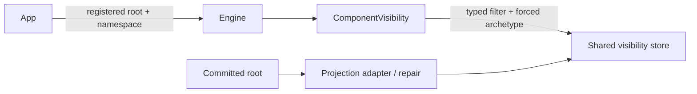

# Design: CHASM extension visibility

## Architecture and boundaries

The projection crate owns `ComponentVisibility`, request/result types and typed errors.
The engine feature re-exports them and constructs a handle from its registry and shared
`Arc<dyn VisibilityStore>`. Root selection is type-driven at the engine boundary; no
store mutation capability escapes the handle. Namespace UUIDs avoid a second resolver
or an invented authorization model. The embedder authorizes its own application API.

`Engine::chasm_visibility<C>(NamespaceId)` is gated by `chasm-extensions`; both engine
startup paths retain the same store clone. No dependency, schema, kernel, Temporal wire
or snapshot changes are required. The existing workflow/activity queries stay isolated.

## Query interface and data

`ComponentVisibility::list(ComponentQuery)` returns `ComponentPage` containing generic
`ComponentSummary` rows and an optional opaque token. `count(Option<&str>)` returns an
`i64`. Filter syntax is the existing visibility grammar, including `ExecutionStatus`
as an arbitrary status keyword and declared custom attributes. Status and lifecycle
remain distinct. Results expose no workflow-only enum or authoritative component bytes.

Cursor JSON wraps the existing page token with version 1, namespace, archetype and
trimmed filter text, encoded with base64. Unknown fields, wrong scope/query, malformed
inner tokens and non-default order are invalid input. Tokens are continuation positions,
not credentials; scope always comes from the handle, including for forged tokens.
Each call observes current projection state; concurrent changes may affect later pages.

`VisibilityStore::list_component_executions` defaults to existing list mechanics. DSQL
overrides it to hydrate indexed `value_data` joined to the namespace's attribute registry
in the same read transaction as the row selection. The ordinary Temporal list keeps its
existing mapping. For non-workflow components, empty KeywordList/tokenless Text values
get an index cell with no queryable typed value so the contribution is not lost. This
uses existing columns and leaves workflow empty-value behavior unchanged.

## Errors

| Condition | Result |
|---|---|
| Unregistered root | Existing `ChasmError::Internal` naming the root |
| Invalid predicate | `ComponentQueryError::InvalidQuery` |
| Page size outside range | `ComponentQueryError::InvalidPageSize` |
| Malformed or mismatched cursor | `ComponentQueryError::InvalidPageToken` |
| Projection/store failure | `ComponentQueryError::Store` with source |

## Correctness properties

### Property 1: Isolation and count agreement

For any generated rows, namespaces, archetypes and predicates, list and count see only
matching non-deleted rows in the handle scope, with count equal to full traversal.
**Validates: Requirements 2.1, 2.3, 4.2.**

### Property 2: Pagination and cursor confinement

For any unchanged generated rows and valid page sizes, traversal has no loss/duplicates;
changing scope/query or corrupting a cursor rejects it without broadening the read.
**Validates: Requirements 3.1, 3.2, 3.3, 4.2.**

### Property 3: Projection fidelity and convergence

For any generated component status/attributes/version, summaries preserve the projected
values; applying an older image cannot overwrite a newer one and repairing a missing
projection produces the same queried result as the original adapter write.
**Validates: Requirements 2.2, 2.6, 4.3.**

## Verification

Property tests run against the actual in-memory store/query path, using bounded generated
fixtures rather than building engines per case. One public-builder acceptance run proves
wiring. A registry-backed runtime repair test proves reconstruction. Env-gated live DSQL
tests exercise paginated reads with every attribute type, generic status and lifecycle,
and newer images replacing/clearing prior attributes. Existing Temporal query tests and
the workspace bar guard compatibility. Live DSQL availability is reported explicitly.
