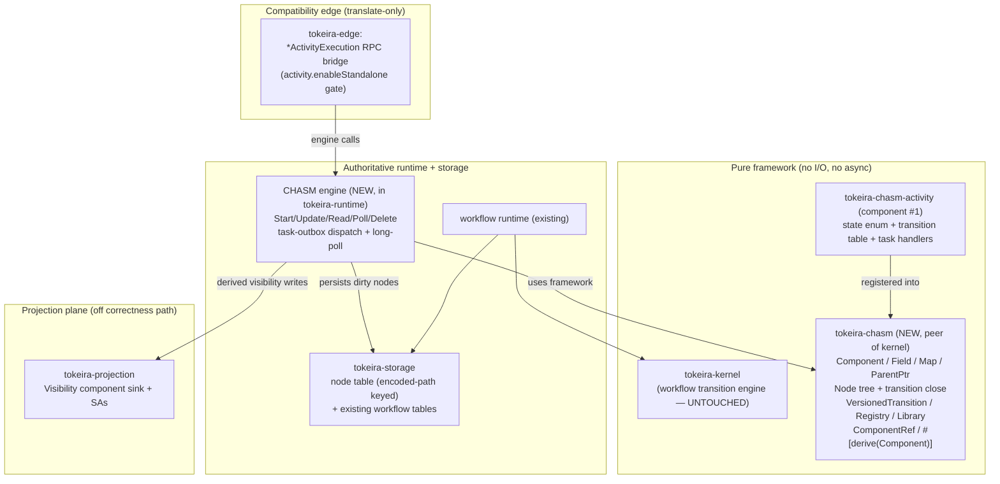
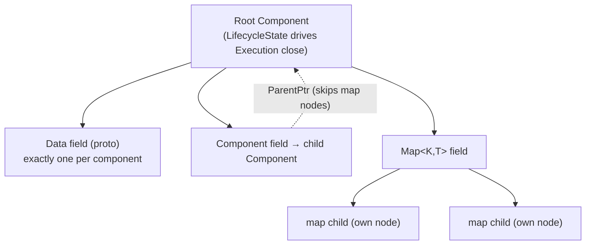
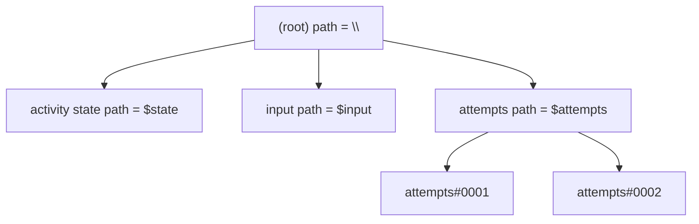
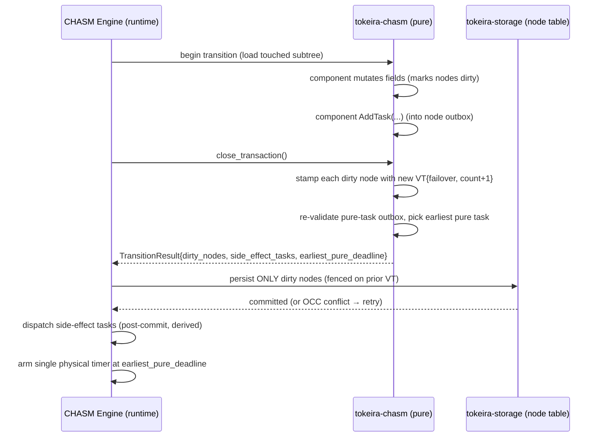
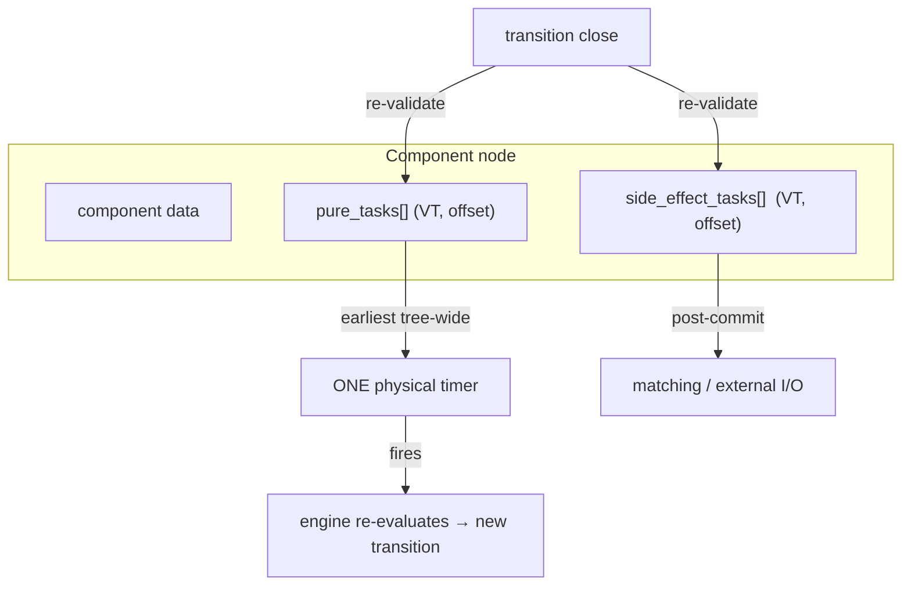
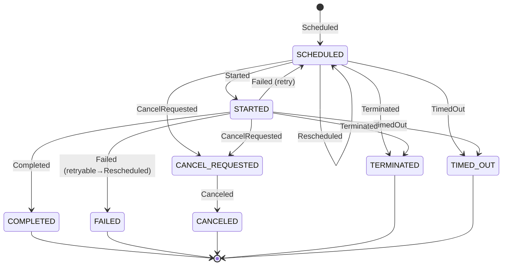

# Design Document: CHASM Foundation

> Ground truth: Temporal `v1.31.0` (`TEMPORAL_SERVER_COMPAT`). Non-obvious behaviour decisions cite
> repo-relative paths in the sibling checkout `../temporal @ v1.31.0`, per `AGENTS.md §8`. This design
> is built directly on `reference/chasm-mapping.md` (the design foundation) and does not re-derive the
> investigation captured there; it cites that doc by section (`foundation §N`) where it leans on it.

## Overview

CHASM ("Coordinated Heterogeneous Application State Machines") is Temporal's generalization of the
durable-execution engine: Workflow stops being *the* engine and becomes one Application State Machine
(ASM) among many, all riding a reusable substrate — registry → libraries → typed components → atomic
clock-stamped transitions → transactional-outbox tasks → built-in visibility. This was framed as
Temporal's forward direction at Replay 2026. This feature brings that substrate into tokeira and lands
the **standalone activity** archetype as its first component, reframing conformance cluster C1
(standalone-activity RPCs, tracker spec `activity-executions-first-class` / P8) from "implement eight
edge RPCs" into "stand up a CHASM substrate, with the activity library as component #1."

The central claim that makes this affordable: **tokeira is already, in effect, a single-archetype CHASM
engine.** Its core invariants *are* CHASM's invariants — atomic fenced `commit_transition` stamped by a
monotonic revision/epoch clock, history-is-authority with dispatch as a *derived* effect (`AGENTS §3`),
and epoch/revision fencing of stale work. Adopting CHASM is therefore **generalization of the existing
engine, not grafting a foreign architecture onto it.** This document makes that mapping explicit and
specifies the new pure crate, the engine/storage surface, and the activity component, in enough detail
to support requirements derivation and incremental implementation.

The investment is deliberately **staged**: a parallel CHASM substrate proven by the activity archetype,
with the existing workflow engine left untouched and a documented (but not-yet-designed) path to
re-expressing Workflow as a CHASM component later — the same arc Temporal itself took.

### Document structure

This is a large feature. The design is laid out for incremental delivery in three layers, and the
sections follow that order:

1. **Substrate** — the `tokeira-chasm` pure crate, the engine surface in `tokeira-runtime`, node-tree
   persistence in `tokeira-storage`.
2. **Activity component** — `tokeira-chasm-activity` (component #1): states, transitions, tasks.
3. **Edge wiring** — bridging the public `*ActivityExecution` RPCs through `tokeira-edge`, gated by
   `activity.enableStandalone`.

High-level sections (Architecture through Storage Design, Activity Archetype, Hard Parts) come first;
low-level Rust trait/type shapes follow under "Low-Level Design"; Verification & Testing closes.

## The Central Design Decision: Parallel Substrate First

The single most consequential decision in this design is **where CHASM lands relative to the existing
workflow engine**, and the design must make and justify the call.

**Option A — Parallel CHASM substrate first (CHOSEN).** Stand up `tokeira-chasm` + a CHASM engine
surface in `tokeira-runtime` as a *new plane* alongside the existing workflow kernel/runtime. The
activity archetype is the first and only component; the workflow engine is **not** touched. CHASM and
the workflow engine coexist, sharing storage, lane/shard ownership, and routing but not code paths.

**Option B — Refactor the workflow engine onto CHASM now.** Re-express the existing workflow execution
as a CHASM root component immediately, so there is a single engine from day one.

**Decision: Option A.** Rationale:

- **Risk containment.** The workflow engine is tokeira's correctness core and its most-tested surface.
  Re-expressing it as a CHASM component is a high-blast-radius change touching history replay, the
  kernel transition model, and every edge RPC. Doing it *before* the substrate has been proven by a
  small, self-contained ASM would put the substrate's unproven generality on the critical path of the
  product's most important behaviour.
- **The activity archetype is the ideal first proof.** A standalone activity is a tiny state machine
  (scheduled → started → terminal) with no workflow-task/replay machinery (foundation §6). It exercises
  every substrate primitive — component lifecycle, node persistence, the transition close, the task
  outbox (pure timers + a side-effect dispatch), VT stamping, long-poll, visibility — without the
  weight of the workflow engine. If the substrate can carry activities cleanly, it has earned the right
  to carry Workflow.
- **It mirrors the path Temporal actually took.** Temporal shipped CHASM as a framework with the
  activity library as an early component while Workflow continued on its existing engine; Workflow
  migrates onto CHASM later. Following the proven arc is the boring, lower-risk choice (`AGENTS` Decision
  Process: "prefer boring solutions").
- **No kernel additions required.** Option A keeps `tokeira-kernel` pure and untouched: the CHASM core
  is a *new* pure crate (`tokeira-chasm`), a peer of the kernel, not a kernel extension (see Constraints).
  Option B would pressure the kernel's workflow-specialized transition model toward a generic node-tree
  model — a change this design explicitly avoids now.

**Accepted cost.** Two engines coexist until Workflow is migrated. There is some conceptual duplication
(two transition-commit code paths over the same storage). This is bounded by staging and is the
explicit price of risk containment. The migration *path* — not its design — is sketched in
"Future Direction: Migrating Workflow onto CHASM" so the parallel substrate is built with that endpoint
in view (shared storage primitives, shared fencing vocabulary), without committing to it now.

## Architecture

### Plane mapping

CHASM maps cleanly onto tokeira's existing three-plane architecture (`AGENTS` Architecture). The pure
framework sits beside the kernel; the engine and persistence sit in the authoritative runtime/storage
plane; visibility sits in the projection plane. Nothing in CHASM violates the plane boundaries.



Key placements and their justification:

- **Pure framework → `tokeira-chasm`, a peer of `tokeira-kernel`.** The CHASM core is a deterministic,
  I/O-free, async-free library: component traits, field types, the node tree, the transition-close
  algorithm, the `VersionedTransition` clock, registry/library, `ComponentRef`, and the
  `#[derive(Component)]` macro. It is a *new* crate, not kernel surface (Constraints). It depends on
  `tokeira-types` and `tokeira-proto` for value/wire types only.
- **Engine → `tokeira-runtime`.** The engine is where async, persistence orchestration, task dispatch,
  and long-poll live — exactly the runtime plane's remit. It uses `tokeira-chasm` to compute
  transitions and `tokeira-storage` to persist them, mirroring how the workflow runtime uses the kernel.
- **Persistence → `tokeira-storage`.** The node table (rows keyed by encoded path) is a new storage
  surface added under the existing forward-only DSQL migration discipline.
- **Visibility → `tokeira-projection`.** CHASM's built-in Visibility component emits derived search
  attributes; these flow to the projection plane, never onto the correctness path (`AGENTS §3`).
- **Edge → `tokeira-edge`.** The public `*ActivityExecution` RPCs are translated to CHASM engine calls
  at the edge, thin and behaviour-ground-truthed, reusing existing translate patterns.

### Crate / module shape

CHASM must be identifiable at the crate-graph level — the framework is one crate, each ASM is its own
crate, and the pure/engine split mirrors the existing `kernel`/`runtime` boundary (foundation §4).

| Crate | Kind | Owns | Depends on |
|-------|------|------|-----------|
| `tokeira-chasm` | **NEW** pure lib (peer of kernel) | `Component`/`LifecycleState`, `Field`/`Map`/`ParentPtr`, `Node` tree + transition close, `VersionedTransition`, `Registry`/`Library`, `ComponentRef`, `StateMachine`/`Transition` helper | `tokeira-types`, `tokeira-proto` |
| `tokeira-chasm-derive` | **NEW** proc-macro | `#[derive(Component)]` — static field-registry generation replacing Go's reflection | `syn`, `quote` |
| `tokeira-chasm-activity` | **NEW** pure lib (component #1) | activity state enum + transition table + task definitions + validation; the `activity` Library + `"activity.activity"` archetype | `tokeira-chasm`, `tokeira-chasm-derive`, `tokeira-types`, `tokeira-proto` |
| `tokeira-runtime` | existing | CHASM **Engine** surface, node-table persistence orchestration, task-outbox dispatch, monotonic long-poll | + `tokeira-chasm`, `tokeira-storage` |
| `tokeira-storage` | existing | node table (encoded-path keyed) + migrations under DSQL discipline | — |
| `tokeira-projection` | existing | Visibility component sink + activity search attributes | + reads CHASM SA providers |
| `tokeira-edge` | existing | `*ActivityExecution` RPC translation + `activity.enableStandalone` gate | + `tokeira-runtime` engine surface |

This satisfies the identifiability requirement: `tokeira-chasm` is obviously the framework, the
`-derive` crate carries the one mechanism that diverges from Go, and `tokeira-chasm-activity` is
visibly "one ASM among many" — the template every future archetype follows.

## Components and Interfaces

This section names the substrate's components and the interface each presents to the others. Concrete
Rust signatures are in Low-Level Design; the conceptual contracts are below.

| Component | Owns | Interface presented | Boundary / does not |
|-----------|------|---------------------|---------------------|
| **`Component` framework** (`tokeira-chasm`) | the `Component`/`RootComponent` traits, `Field`/`Map`/`ParentPtr`, `LifecycleState`, the node tree + transition-close algorithm | `Component` trait (impl'd via derive); `fields()` registry; `close_transaction()` returning dirty nodes + tasks | no I/O, no async, no storage |
| **`#[derive(Component)]`** (`tokeira-chasm-derive`) | compile-time field classification + static-rule enforcement (HP1) | the derive macro + `#[chasm(...)]` attributes | no runtime reflection; pure code generation |
| **VT / clock** (`tokeira-chasm`) | `VersionedTransition`, `staleness_check` | total order (`Advanced`/`Same`/`Behind`); wire round-trip | not a wall clock; logical only |
| **Registry / Library** (`tokeira-chasm`) | FQN / type-id / `TypeId` indexing; archetype ids (0 reserved) | `Registry::component_for_archetype`, `archetype_id` | built once, immutable; no runtime mutation |
| **`ComponentRef`** (`tokeira-chasm`) | addressable node return-address + staleness | encode/decode; staleness vs live execution VT | data only |
| **Engine** (`tokeira-runtime`) | async transition orchestration, persistence, dispatch, long-poll | `Engine` trait (`start/update/read/poll/delete/notify`) + `TypedEngine<C>` | does not implement component semantics |
| **Context** (`tokeira-runtime` impls; traits in `tokeira-chasm`) | read vs read-write access | `Context` (read) / `MutableContext` (read + `add_task`) | `MutableContext` only inside a transition |
| **Task model** (`tokeira-chasm` + runtime dispatch) | `Task`/`TaskValidator`, Pure vs SideEffect, node outbox, single timer | `validate`/`fire_at`; transition-close returns surviving tasks | `physical_task_status` is engine-local, never VT-stamped |
| **Node table** (`tokeira-storage`) | encoded-path-keyed node rows; write-only-dirty-nodes; OCC fencing | range scan by path prefix; CAS-on-VT persist | DSQL-safe DDL subset only |
| **Activity component** (`tokeira-chasm-activity`) | activity state enum + transition table + tasks + validation | `Component` impl; transition `apply`; task handlers | one ASM among many; no engine internals |
| **Visibility sink** (`tokeira-projection`) | activity search attributes (`ActivityType`/`ExecutionStatus`/`TaskQueue`) | SA provider hook → projection writes | off the correctness path (`AGENTS §3`) |
| **Edge bridge** (`tokeira-edge`) | `*ActivityExecution` translation + `enableStandalone` gate | public RPC ⇄ engine call | thin translate only; behaviour ground-truthed |

## The Component Model

A CHASM **Component** is the unit of state and behaviour. Ground truth: `chasm/component.go:16,40`,
`field.go`, `map.go`, `parent_pointer.go @ v1.31.0` (foundation §1).

- **Component + LifecycleState.** Every component reports a `LifecycleState` — `Running`, `Completed`,
  or `Failed` — computed from its own state (`component.go:16`). The state is a bitmask where
  `IsClosed = state >= Completed` (`component.go:40`). When the **root** component closes, the whole
  Execution closes. A `RootComponent` additionally supports `Terminate` and carries `ContextMetadata`.
- **Fields.** A component's persistent children are declared as typed fields:
  - `Field<T>` — a single value.
  - `Map<K, T>` — a keyed collection.
  - `ParentPtr<T>` — upward access to the parent component, *skipping map nodes* in the ancestry walk
    (`parent_pointer.go`).
  - plus transient plain fields that are not persisted.
- **Data vs Component fields.** The generic parameter `T` is *either*:
  - a **proto message** → a **Data field** (a leaf carrying serialized bytes), or
  - a **child component** → a **Component field** (a subtree root).

  A component has **exactly one** data field and any number of component/map fields (a static rule the
  derive macro enforces — see Hard Parts and Low-Level Design).
- **Each field child is its own node.** Every `Field`/`Map` child persists as its own `Node` in the
  tree (foundation §1), which is what makes write-only-dirty-nodes possible (Storage Design).



## The Node Tree and Path Encoding

An Execution is a **tree of nodes** (`tree.go:85,129`). The root is identified by an `ExecutionKey`
= `{NamespaceId, BusinessId, RunId}`. Each node persists as a single `ChasmNode { metadata, data }`
row keyed by an **encoded path**.

The path encoder (`path_encoder.go:25-75`) uses adjacent ASCII separators that sort such that any
subtree, collection, or ancestor chain is a **single prefix range scan**: `$` introduces a child field,
`#` introduces a collection (map) child. Because separators are ordered below normal path-segment bytes,
a prefix `range [encode(path), encode(path)+0xFF)` returns exactly the subtree rooted at `path`.



This encoding is the substrate's biggest storage lever: a transition touching only `$state` rewrites
one row; loading the whole execution is one range scan; loading just a map is a prefix scan of `#`
children. tokeira reproduces the *encoding contract* (sort order, separator semantics) so range
behaviour is identical, but owns its own encoder implementation (no ported code; `AGENTS` Mission).

## The Atomic Transition and the VersionedTransition Clock

A **transition** is the atomic unit of change. Ground truth: `tree.go:1423 CloseTransaction`,
`transition_history.go:9`, `hsm.proto:114`.

- **Whole-execution atomicity.** A transition is closed over the whole execution. On
  `CloseTransaction`, every node that was marked dirty during the transition is stamped with a new
  `VersionedTransition` and persisted; all field writes **and** all task schedules commit together or
  roll back together. This is exactly tokeira's fenced `commit_transition` over a per-run transition
  (foundation §2): same atomicity, same "history is authority" posture.
- **`VersionedTransition` (VT).** A logical clock `{ namespace_failover_version, transition_count }`
  (`hsm.proto:114`). It is monotonic per execution. `Compare`/`StalenessCheck` yield `-1 / 0 / 1`
  (advanced / same / behind) — the single primitive underpinning long-poll change detection and
  `ComponentRef` staleness checks (`transition_history.go:9`). tokeira's transition sequence + revision
  (+ failover) carry the same information; the **wire format must round-trip** to preserve SDK long-poll
  compatibility (Hard Parts §4).



The pure crate computes the transition and returns *what* to persist and dispatch; the engine performs
the I/O. This keeps `tokeira-chasm` pure (no storage, no async) exactly like `tokeira-kernel`.

## The Engine Surface

The engine (`engine.go:17`) is the async, stateful runtime façade. tokeira's CHASM engine exposes the
same operations:

| Engine operation | Purpose | tokeira mapping |
|------------------|---------|-----------------|
| `StartExecution` | Create a new execution rooted at an archetype's root component | new node-tree + first transition |
| `UpdateWithStartExecution` | Atomically start-if-absent then update (business-id reuse/conflict policy) | single transition with conflict policy |
| `UpdateComponent` | Run a typed mutation against a component, producing a transition | fenced `commit_transition` |
| `ReadComponent` | Read-only access (no dirty nodes, no tasks) | snapshot load of subtree |
| `PollComponent` | **Monotonic long-poll**: block until the component's VT advances past the caller's, or the deadline elapses; empty-on-deadline means "resubmit" | VT compare + notify + deadline buffer |
| `DeleteExecution` | Delete the execution's node subtree | range delete |
| `NotifyExecution` | Wake pollers / re-evaluate tasks after an external event | notify hook |

Two context capabilities, mirroring `context.go`:

- **`Context`** (read) — load components, read fields. No mutation, no `AddTask`.
- **`MutableContext`** (read + write) — adds field mutation and `AddTask`. Only available inside an
  `UpdateComponent`/`StartExecution` transition.

CHASM injects the engine onto a request context and lets component code panic for framework errors.
tokeira does **not** do this: the engine surface is explicit, and component code returns
`Result<_, ChasmError>` rather than panicking (Hard Parts §5; `AGENTS §1` no-unwrap). The typed generic
wrappers (Low-Level Design) give callers a component-typed API over the untyped engine core.

## The Task Model

Tasks are how a transition schedules future work. Ground truth: `task.go:15`, `task_handler_base.go`,
`tree.go:1699-2041` (foundation §1, §3).

- **Pure vs Side-Effect.**
  - **Pure task** — runs *inside* a transaction, holds the write lock, performs **no I/O**. Used for
    time-driven state changes (e.g. activity timeouts). Folding the effect into the commit means fewer
    DSQL transactions (foundation §6).
  - **Side-Effect task** — runs *post-commit*, may do I/O, performs **no direct state mutation** (it
    calls back into the engine to open a new transition if it needs to change state). Used for
    dispatch-to-matching.
- **Transactional outbox inside the node.** Tasks persist as `pure_tasks[]` / `side_effect_tasks[]`
  **on the owning component node**, not in a separate queue. Identity is `(VersionedTransition, offset)`.
  This *is* tokeira's "history is authority; dispatch is a derived effect" pattern (`AGENTS §3`): the
  durable record of intent lives in the node; the queue write is derived and disposable.
- **Validate-then-drop.** Every task handler has a `Validate` gate and an `Execute`. On every dirty
  close the outbox is **re-validated**; a task whose precondition no longer holds (e.g. the attempt was
  superseded) is dropped without executing. This is stamp/epoch fencing (foundation §3): the task
  carries a stamp, and `Validate` compares it to the live component state.
- **Single earliest pure task → one physical timer.** Across the *whole tree*, only the single
  earliest pure task gets a physical timer armed (`tree.go:1699-2041`); when it fires the engine
  re-evaluates and arms the next. `physical_task_status` is **cluster-local, non-replicated, and does
  not bump the VT** — it is a dispatch detail, not authoritative state. This bounds timer churn
  (foundation §6) and maps onto tokeira's existing timer/sweeper model.



## Registry, Library, and ComponentRef

- **Registry / Library** (`registry.go`, `library.go`). A **Library** groups components + tasks +
  service handlers. Components are indexed three ways: by fully-qualified name (FQN), by a `uint32`
  type id (`farm.Fingerprint32(fqn)`), and by Rust type. An **Archetype** is the FQN of a root
  component; its **ArchetypeID** is the type id of that FQN. Type id `0` is reserved for legacy
  Workflow — tokeira honours that reservation so the workflow engine and CHASM never collide on
  archetype identity. The registry is built once at startup from registered libraries; it is immutable
  thereafter (no runtime mutation, consistent with no-reflection).
- **ComponentRef** (`ref.go:16`). A serialized return-address to a specific component:
  `ExecutionKey + archetypeID + execution_versioned_transition + component_path[] +
  component_initial_versioned_transition`. Node identity is `(path, initial_vt)`; staleness is checked
  via `execution_versioned_transition` against the live execution VT. This is tokeira's fencing-token
  pattern made addressable: a ref names *which node* and *as of when*, so a stale ref is detected, not
  silently followed. The **wire format must round-trip** for cross-call and SDK use (Hard Parts §4).

## Visibility as a Built-in Component

Visibility (`visibility.go`) is a **built-in child component**, not a bolted-on index. Search
attributes and memo are user-defined and/or component-defined through a provider interface: a component
declares the SAs it contributes, and the framework collects them on transition. For the activity
archetype the component-defined SAs are `ActivityType`, `ExecutionStatus`, and `TaskQueue`
(foundation §5).

In tokeira this lands in the projection plane: the Visibility component's outputs are **derived
projection writes** to `tokeira-projection`, never on the correctness path (`AGENTS §3`). Custom
search-attribute registration rides the existing C3 SA work. The substrate provides the *hook* (a
component can contribute SAs); projection owns the *sink*.

## Visibility Generalization: One Logical Index for All Archetypes

> Added after design review (workflow + ChatGPT). Supersedes the implicit "activities reuse the
> workflow-shaped projection" assumption: workflows and CHASM components share **one logical
> visibility model**, discriminated by a first-class `archetype`. This section is the authoritative
> contract for the visibility work; the older paragraphs above describe only the substrate *hook*.

### The projection contract

Visibility is **not** "a hook that emits search attributes." Visibility is an **archetype-neutral,
versioned execution snapshot derived from an authoritative transition**, applied monotonically and
idempotently, and queried as a pure function of the projected rows — never of projection-log order.
That contract is what makes a single shared index robust rather than merely convenient.

Why one index (not per-kind tables): listing must not N-way-merge across heterogeneous indexes
(pagination tokens, global sort, and rollups would become cross-index reconciliation). Temporal
reaches the same conclusion but discriminates via the `TemporalNamespaceDivision` search attribute —
a retrofit onto its legacy mutable-state workflow path. Tokeira is greenfield, so it makes execution
kind a **first-class column** instead.

### Soundness of one log, two producers (C2, sharpened)

"Producers are disjoint" is **necessary but not sufficient**. The correctness proof is:

1. **One immutable authority per execution run.** A `(namespace_id, archetype_id, run_key)` has exactly
   one authority. A future workflow→CHASM migration that changes a workflow's authority MUST bump an
   `authority_epoch` fence so the old and new producers cannot both update the projected row.
2. **Every visibility record carries a per-execution version** — `(authority_epoch, source_transition_seq)`.
3. **Apply is monotonic + idempotent per execution**: a record is applied only if its
   `(authority_epoch, source_transition_seq)` is strictly newer than the stored one. This prevents a
   retried or out-of-order record from reviving a closed execution or regressing status.
4. **Queries are functions of the current projected rows, not of log order.**

Therefore arbitrary interleaving of producers affects only *freshness*, never *eventual correctness*.

### Records are versioned snapshots, not deltas

The projection record carries the **complete post-transition visibility image** (status, lifecycle,
timestamps, type, task queue, transition count, typed search attributes, memo) plus its version. This
replaces the current workflow `ProjectionOp::Upsert/Close` *delta* emission — the workflow producer is
migrated to emit snapshots too (decided in design review). Snapshots make "last valid version wins"
trivial under retries, out-of-order application, and schema evolution; the sink stops folding deltas
and becomes "upsert iff newer version."

### Transition-derived / repairable (C2.5, not full C3)

The projection stream is a **transition-derived outbox**, never an independent fact that can be lost
relative to history: a committed transition MUST NOT be able to exist permanently without a
reconstructible visibility projection. Mechanism may be an outbox row written in the authoritative
commit, a view over transition rows carrying a visibility envelope, or a **repair scanner** that finds
transitions whose visibility version has not been projected. Full C3 ("visibility = fold(history)") and
R4 ("workflow is just another archetype") are the **trajectory**, not this milestone — the snapshot +
version + archetype contract is the incremental, non-throwaway path toward them.

### Record shape (logical)

`execution_visibility_current`, keyed `(namespace_id, archetype_id, run_key)`:

| Field | Notes |
|-------|-------|
| `archetype_id` | First-class, **non-null**; `workflow` is an explicit value (never null-as-workflow). |
| `business_id` | workflow_id / activity_id / schedule_id / … |
| `run_id` | meaningful per kind; non-null. |
| `authority_epoch`, `source_transition_seq` | the version; apply-iff-newer fence. |
| `status_keyword` | generic low-cardinality keyword; value-set interpreted per archetype. **No** workflow-typed status enum. |
| `lifecycle_state` | `OPEN`/`CLOSED`/`DELETED` (distinct from status: schedule `Paused` is OPEN, workflow `Completed` is CLOSED). |
| `start_time`, `update_time`, `close_time` | generic lifecycle timestamps. |
| `execution_type`, `task_queue` | generic system fields (nullable where N/A). |
| `transition_count` | generic; maps to `history_length` (workflow) / `state_transition_count` (activity) at the edge. |
| `memo_blob`, `search_attr_generation` | memo + the current typed-attr generation pointer. |

Status is **logically a system search attribute** (so the query surface is uniform and Temporal-
compatible) but **physically a column** — status values like `Running`/`Completed` are hot and
low-cardinality, want native composite indexes (`(namespace_id, archetype_id, status_keyword,
start_time DESC, run_key)`) and native rollup dimensions, and should not be forced through the EAV
attribute table.

### DSQL crash-safety: the generation pattern

DSQL has no cross-table transactions, so row + typed-attr rows are made consistent by a **generation
pointer**: write the new attribute rows at `generation = N`, then flip
`execution_visibility_current.search_attr_generation = N`; queries join only the current generation;
old generations are GC'd. Orphaned new-generation rows are never visible until the pointer flips, so a
crash mid-write is survivable.

### Idempotent rollups

Counts (by status/type/task-queue, archetype-scoped) come from **striped** counters
(`(namespace_id, archetype_id, dimension, value, stripe)`, `stripe = hash(run_key)`) guarded by an
applied-version so a retry cannot double-count, with a `rollup_delta` keyed by version when an atomic
multi-row update is not possible. Rollups are derived and rebuildable from `current`.

### Pipeline, checkpoints, isolation

One projection *protocol* and one logical index — **not** one global checkpoint. Checkpoints are
partitioned (`projection_checkpoint(partition, last_applied_version)`), processing partitioned by
source shard / run-key hash, so high-volume activity churn cannot starve workflow visibility.
Per-archetype operational controls (retention, projection priority/concurrency, rollup striping,
search-attribute quotas, default UI inclusion) are first-class.

### Archetype scoping at the edge

`ListWorkflowExecutions`/`CountWorkflowExecutions` **force** `archetype = workflow`;
`ListActivityExecutions`/`CountActivityExecutions` force `archetype = activity`. A caller cannot escape
its endpoint's scope. Temporal's `TemporalNamespaceDivision` is accepted in query syntax as a **virtual
system search attribute that compiles to `archetype_id`** (compatibility shim), but is never stored as a
generic string SA. `archetype`, `status`, `lifecycle_state`, `namespace`, `run_id`, `business_id` are
**reserved** — user search attributes cannot spoof them.

### The component contribution interface (replaces the thin hook)

The CHASM engine's visibility hook is widened from `record(key, Vec<(String,String)>)` to a typed
**`VisibilitySnapshot`** the component produces on transition close: `archetype`, `business_id`,
`run_id`, `status`, `lifecycle`, timestamps, `execution_type`/`task_queue`, **typed** search attributes
(not strings — range/order/parse correctness needs types), and memo. The adapter holds the engine +
registry, reads the component state by `ExecutionKey` on close, and writes the snapshot to the shared
visibility store (post-commit, off the correctness path).

### Delivery stages

1. **Generalize the store + record + sink** to the versioned-snapshot / archetype / status_keyword /
   lifecycle shape (generation pattern, striped rollups, partitioned checkpoints); migrate the workflow
   producer onto snapshots (drop delta-fold). Workflow visibility stays green throughout.
2. **CHASM `VisibilitySnapshot` contract + engine→projection adapter + bootstrap wiring** (replace
   `NoopVisibilitySink`); standalone activities flow into the shared index.
3. **Edge `ListActivityExecutions`/`CountActivityExecutions`** + `TemporalNamespaceDivision` virtual SA +
   `standalone_activities` capability flag + translate to `ActivityExecutionListInfo`.
4. **Hardening (follow):** repair scanner / outbox-in-commit; trajectory notes toward C3/R4.

## Storage Design

The substrate adds **one new storage surface**: a node table, keyed by encoded path, living in
`tokeira-storage` under the existing forward-only DSQL discipline (`AGENTS` "Adding or Changing a DSQL
Migration"; `crates/tokeira-storage/AGENTS.md`).

### Node table

Conceptual schema (final DDL settled in tasks; must obey the DSQL-safe subset — one statement per file,
secondary indexes `ASYNC`, no `CHECK`, no `BIGSERIAL`):

```text
chasm_node(
    namespace_id    UUID    not null,   -- ExecutionKey component
    business_id     TEXT    not null,   -- ExecutionKey component
    run_id          UUID    not null,   -- ExecutionKey component
    encoded_path    BYTEA   not null,   -- prefix-range-scannable (path_encoder contract)
    archetype_id    BIGINT  not null,   -- root component type id (0 reserved = legacy workflow)
    -- VersionedTransition stamp (the node's last-update clock):
    failover_version    BIGINT not null,
    transition_count    BIGINT not null,
    initial_failover_version BIGINT not null,  -- node identity half of (path, initial_vt)
    initial_transition_count BIGINT not null,
    metadata        BYTEA   not null,   -- ChasmNode.metadata (type id, lifecycle, task outboxes)
    data            BYTEA,              -- ChasmNode.data (serialized proto for data fields)
    PRIMARY KEY (namespace_id, business_id, run_id, encoded_path)
)
```

Design properties:

- **Encoded-path primary key → range scans.** Subtree load, collection load, and ancestor walk are all
  single prefix range scans over `encoded_path` within one execution. This is the structural reason the
  substrate is lean on DSQL.
- **Write-only-dirty-nodes (the biggest DSQL lever).** A transition persists *only* the nodes it marked
  dirty, fenced on their prior VT. Because each field is its own row, a scheduled→started transition
  rewrites a single state row, not the whole execution — cutting write amplification and shrinking the
  OCC conflict surface, which matters acutely under DSQL's 100/sec connection budget and OCC-retry model
  (foundation §6; `temporal-dsql/AGENTS.md` connection constraints).
- **OCC fencing.** Persist is conditional on the node's stored VT matching the VT the transition read
  (compare-and-set), reusing tokeira's existing DSQL OCC/CAS machinery. A conflict triggers reload +
  re-run of the transition (the standard tokeira retry), never a force-overwrite.
- **Task outbox lives in `metadata`.** `pure_tasks[]` / `side_effect_tasks[]` are serialized inside the
  node's `metadata`, so scheduling a task is part of the same dirty-node write — no separate task table,
  no separate transaction. Dispatch reads are derived.
- **Migration discipline.** During the initial build phase the table is a single base `CREATE TABLE`
  migration (no `ALTER`); secondary indexes (e.g. an archetype/status index for visibility-independent
  scans, if needed) are created `ASYNC` in their own one-statement migrations. The `DdlValidator`
  enforces the DSQL-safe subset.

### How it rides existing infrastructure

CHASM executions reuse tokeira's existing **lane / shard / routing** unchanged (foundation §6): an
execution is owned by the shard its `ExecutionKey` hashes to, processed lane-locally, and its
transitions committed through the same fenced path. The node table is just another table in the same
DSQL store; the CHASM engine is just another runtime component owned by the shard. No new ownership,
membership, or routing concepts are introduced.

## Data Models

The substrate's persistent and wire data models. Rust shapes are in Low-Level Design; this is the
model-level contract and validation rules.

### `ChasmNode` (persisted, one row per field)

| Field | Type | Rule |
|-------|------|------|
| `execution_key` | `{namespace_id: UUID, business_id: Text, run_id: UUID}` | identifies the execution; part of PK |
| `encoded_path` | bytes | prefix-range-scannable per the `path_encoder` contract; part of PK |
| `archetype_id` | u32 | root component type id; `0` reserved for legacy workflow |
| `versioned_transition` | `{failover_version: i64, transition_count: i64}` | last-update stamp; CAS fences persist on it |
| `initial_versioned_transition` | same shape | node-identity half of `(path, initial_vt)`; immutable after create |
| `metadata` | bytes | type id, lifecycle, and the `pure_tasks[]` / `side_effect_tasks[]` outboxes |
| `data` | bytes (nullable) | serialized proto for a data field; absent for pure component fields |

Validation: exactly one data node per component subtree (mirrors the macro's one-data-field rule);
`metadata` always present; VT strictly advances on each rewrite of a node.

### `VersionedTransition` (wire + persisted)

`{ namespace_failover_version: i64, transition_count: i64 }`. Total order via `staleness_check`. Must
round-trip on the wire to preserve SDK long-poll and ref staleness (`hsm.proto:114`).

### `ComponentRef` (wire)

`{ execution_key, archetype_id, execution_versioned_transition, component_path[],
component_initial_versioned_transition }`. Node identity = `(component_path,
component_initial_versioned_transition)`; staleness via `execution_versioned_transition`. Must
round-trip (`ref.go:16`).

### `ActivityState` (persisted data field)

`{ status: ActivityStatus, attempt: u32, stamp: Stamp, retry_policy, timeouts, last_heartbeat,
result_or_failure }`. Validation rules (ground-truthed to `validator.go @ v1.31.0`): task queue
required; `activity_id`/`activity_type` non-empty and within `MaxIDLengthLimit`; retry-policy
defaulting; timeout normalization (schedule-to-start / schedule-to-close / start-to-close, cap to run
timeout, heartbeat ≤ start-to-close).

### Activity config (config-as-constant)

`{ enable_standalone: bool = false (per-namespace), long_poll_timeout: Duration = 20s,
long_poll_buffer: Duration = 1s }`. `serde(deny_unknown_fields)`; round-trips without loss
(`AGENTS` Configuration).

## The Standalone-Activity Archetype (Component #1)

The activity library is the first ASM on the substrate. Ground truth: `chasm/lib/activity/{activity.go,
statemachine.go, activity_tasks.go, handler.go, frontend.go, validator.go, library.go, config.go,
activity_state.proto, proto/v1/service.proto} @ v1.31.0` (foundation §5).

- **Library / archetype.** Library name `activity`; archetype FQN `"activity.activity"`
  (`lib/activity/library.go`). The root component is the activity execution.
- **States** (`activity_state.proto`): `SCHEDULED`, `STARTED`, `CANCEL_REQUESTED`, `COMPLETED`,
  `FAILED`, `CANCELED`, `TERMINATED`, `TIMED_OUT`. LifecycleState mapping (`activity.go:90`):
  `COMPLETED → Completed`; `FAILED | CANCELED | TERMINATED | TIMED_OUT → Failed`; everything else
  (`SCHEDULED`, `STARTED`, `CANCEL_REQUESTED`) → `Running`.



- **Transitions** (`statemachine.go`): `Scheduled`, `Rescheduled`, `Started`, `Completed`, `Failed`,
  `CancelRequested`, `Canceled`, `Terminated`, `TimedOut`. Each transition **fences on an attempt
  `stamp`** — a transition computed against attempt N is rejected if the live attempt has advanced,
  which is how retries/timeouts race-safely supersede stale work.
- **Tasks** (`activity_tasks.go`):
  - one **side-effect** task `dispatch` → enqueues the activity task to matching (`AddActivityTask`);
  - **pure** timers `scheduleToStart`, `scheduleToClose`, `startToClose`, `heartbeat`.
  - All tasks are **stamp-fenced**: a timer scheduled for attempt N validates the live stamp on fire
    and drops if the attempt moved on (validate-then-drop). The earliest pending pure timer tree-wide
    is the one with a physical timer armed.
- **RPC surface** (public, on `WorkflowService`): `StartActivityExecution`, `DescribeActivityExecution`,
  `PollActivityExecution` (long-poll), `RequestCancelActivityExecution`, `TerminateActivityExecution`,
  `DeleteActivityExecution`, plus visibility `ListActivityExecutions` / `CountActivityExecutions`
  (tracker P8 `activity-executions-first-class`). Internally the CHASM activity library wraps these as
  `*ActivityExecutionRequest + namespace_id` and maps handler → engine in `handler.go`. tokeira bridges
  the public RPC at the edge (Edge Wiring) and calls the CHASM engine.
- **Validation** (`validator.go`): user-defined task queue **required**; `activityId` / `activityType`
  non-empty and within `MaxIDLengthLimit`; retry-policy defaulting; timeout normalization
  (schedule-to-start / schedule-to-close / start-to-close rules, cap to run timeout, heartbeat ≤
  start-to-close). These rules are ground-truthed to v1.31.0 and reproduced, not invented.
- **Gating** (`config.go`): `activity.enableStandalone` defaults **false** per-namespace; the framework
  flag `history.enableChasm` defaults **true** (foundation §7). `activity.longPollTimeout` 20s,
  `longPollBuffer` 1s. In tokeira these are config-as-constant values (no env vars; `AGENTS`
  Configuration) read at the edge gate and the engine long-poll.

### Edge wiring

`tokeira-edge` translates the public `*ActivityExecution` RPCs to CHASM engine calls, thin and
behaviour-ground-truthed (`crates/tokeira-edge/AGENTS.md`), reusing the existing translate patterns:

1. **Gate.** If `activity.enableStandalone` is off for the namespace, return the same status the
   targeted release returns for the disabled feature (ground-truth the exact code against
   `frontend.go @ v1.31.0` before finalizing — likely `FAILED_PRECONDITION`/`UNIMPLEMENTED`; resolved
   in tasks, not guessed here).
2. **Translate.** Map the public request to the engine call (`StartExecution` for `Start`,
   `UpdateComponent` for cancel/terminate, `ReadComponent` for describe, `PollComponent` for poll,
   `DeleteExecution` for delete), validating per `validator.go` rules at the edge before admitting.
3. **Project.** `List`/`Count` route to the projection plane (visibility component SAs), not the engine.

## Hard Parts (and the tokeira Approach)

These are the five load-bearing divergences identified in foundation §3, each resolved here.

### HP1 — Reflection-driven field iteration → `#[derive(Component)]`

Go sniffs `"chasm.Field["` type-name strings and mutates user structs in place via reflection
(`fields_iterator.go`, `tree.go:810 syncSubComponents`). tokeira **forbids runtime reflection**
(`AGENTS §1`). This is the single biggest mechanism divergence.

**Approach.** A `#[derive(Component)]` proc-macro (crate `tokeira-chasm-derive`) generates a static
field registry at compile time. It walks the struct's fields, classifies each as `Field<T>` / `Map<K,T>`
/ `ParentPtr<T>` / transient, and emits a `Component::fields()` implementation that yields typed field
descriptors — replacing reflection with monomorphized, statically-known iteration. The macro
**enforces the static rules** at compile time (a compile error, not a runtime warning):

1. **Exactly one data field.** A component has one and only one `Field<T>` whose `T` is a proto message.
   Zero or many → compile error.
2. **Fields are non-pointer.** Persistent fields are declared as `Field`/`Map`/`ParentPtr`, never as
   bare references or `Box`/`Rc` — node identity is positional, not pointer-based.
3. **Map values are fields.** A `Map<K, T>`'s value type `T` must itself be a valid field payload
   (proto data or child component); enforced via a trait bound the macro emits.
4. **Unmanaged-field diagnostic.** A plain field that is *not* declared transient and is *not* a
   recognised field type is rejected (Go merely warns; tokeira makes it an error to avoid silent
   non-persistence).

The concepts survive 1:1 (data/component fields, maps, parent pointers, per-field nodes); only the
*mechanism* (reflection → derive) changes. See Low-Level Design for the trait/attribute shapes.

### HP2 — Generic node tree as range-queryable storage

A generic tree of arbitrary components must persist as range-queryable rows. **Approach.** The encoded
path is the primary key (Storage Design); each node serializes lazily and independently; the engine
loads only the subtree a transition touches (range scan), and writes only dirty nodes. The encoder
reproduces the v1.31.0 sort/separator *contract* (`path_encoder.go:25-75`) with a tokeira-owned
implementation, property-tested for range correctness (Verification).

### HP3 — Task outbox exact semantics

The outbox rules are subtle and load-bearing: `(VT, offset)` identity, validate-then-drop on every
dirty close, single-earliest-pure-task-tree-wide physical timer, `physical_task_status` cluster-local /
non-replicated / no-VT-bump. **Approach.** Tasks live in node `metadata` (Storage Design); the pure
crate's transition-close re-validates the outbox and returns the earliest pure-task deadline and the
ready side-effect tasks; the engine arms exactly one physical timer and performs post-commit dispatch.
`physical_task_status` is engine-local state that never enters the VT-stamped node data, so it cannot
desync replicated state. Each rule maps onto an existing tokeira derived-dispatch behaviour
(`AGENTS §3`); the exactness is pinned by property tests (validate-then-drop, monotonic single-timer).

### HP4 — VT staleness + monotonic long-poll wire fidelity

Long-poll and refs depend on the `-1/0/1` VT contract, empty-on-deadline "resubmit" semantics, the
deadline buffer, and a ref-token wire format that round-trips for SDK compatibility. **Approach.**
`VersionedTransition` is a first-class type in `tokeira-chasm` with a total `compare`/`staleness_check`;
`PollComponent` blocks on a notify keyed by execution VT and returns empty when the deadline (minus
`longPollBuffer`) elapses without the VT advancing past the caller's token. The `ComponentRef` and VT
wire encodings are property-tested for round-trip and the long-poll monotonicity invariant (a poll
never returns a state older than the caller's token) is a named property.

### HP5 — Engine-on-context + panic-as-framework-error → `Result` plumbing

CHASM injects the engine on the request context and lets component code panic to signal framework
errors. tokeira forbids `unwrap`/panic-as-control-flow (`AGENTS §1`). **Approach.** The engine is an
explicit parameter/handle, not an ambient context value; component transition functions return
`Result<T, ChasmError>`; the generic engine wrappers thread errors back to the caller. There is no
panic/recover boundary — a failed precondition is an `Err`, surfaced as a typed engine error and mapped
to a wire status at the edge.

---

# Low-Level Design (Rust)

This section specifies the concrete Rust shapes for `tokeira-chasm`, `tokeira-chasm-derive`, and
`tokeira-chasm-activity`. All types derive `Debug`; serializable types derive `Serialize, Deserialize`;
no `unsafe`, no runtime reflection, edition 2024 (`AGENTS §1`). Signatures are illustrative of the
contract; final names/bounds settle in tasks.

## Core Types and Traits (`tokeira-chasm`)

### LifecycleState

```rust
/// Lifecycle of a component, computed from its own state. Mirrors `chasm/component.go:16,40`.
/// `is_closed()` is true for `Completed`/`Failed`; a closing root closes the Execution.
#[derive(Debug, Clone, Copy, PartialEq, Eq, Serialize, Deserialize)]
pub enum LifecycleState {
    Running,
    Completed,
    Failed,
}

impl LifecycleState {
    /// Closed iff the component has reached a terminal state (`state >= Completed`).
    pub fn is_closed(self) -> bool {
        matches!(self, LifecycleState::Completed | LifecycleState::Failed)
    }
}
```

### Component trait

```rust
/// A unit of durable state + behaviour. Implemented via `#[derive(Component)]`, which generates
/// `fields()` from the struct's declared `Field`/`Map`/`ParentPtr` members (replacing Go's
/// reflection-based iteration — see HP1). Implementors hand-write only `lifecycle_state`.
pub trait Component: Sized + 'static {
    /// The data field's proto payload type. Exactly one data field per component (macro-enforced).
    type Data: prost::Message + Default;

    /// Stable fully-qualified name, e.g. "activity.activity". Used for archetype/type-id indexing.
    const FQN: &'static str;

    /// Current lifecycle, derived from the component's own state. A closing root closes the Execution.
    fn lifecycle_state(&self, ctx: &dyn Context) -> LifecycleState;

    /// Generated by the derive macro: the static field registry for tree (de)serialization.
    fn fields(&self) -> FieldRegistry<'_>;
}

/// A root component additionally supports termination and carries execution metadata.
pub trait RootComponent: Component {
    fn terminate(&mut self, ctx: &mut dyn MutableContext, reason: TerminateReason)
        -> Result<(), ChasmError>;
    fn context_metadata(&self) -> &ContextMetadata;
}
```

### Field types

```rust
/// A single persistent child. `T` is either a proto message (Data field) or a `Component`
/// (Component field). Each `Field` persists as its own node (HP2).
#[derive(Debug, Serialize, Deserialize)]
pub struct Field<T> { /* node handle + lazily (de)serialized value */ }

/// A keyed collection; each entry persists as its own `#`-separated child node.
#[derive(Debug, Serialize, Deserialize)]
pub struct Map<K, T> { /* keyed node handles */ }

/// Upward access to the parent component, SKIPPING map nodes in the ancestry walk
/// (mirrors `parent_pointer.go`). Not itself persisted as data.
#[derive(Debug)]
pub struct ParentPtr<T> { /* resolved against the live tree, never serialized as a value */ }
```

`Field<T>`/`Map<K,T>` resolve their values lazily against the node tree through the active `Context`,
so loading a component does not eagerly load its whole subtree — only touched fields are materialized.

### FieldRegistry and FieldKind (the derive-macro contract)

```rust
/// Static description of one declared field, emitted by `#[derive(Component)]`.
#[derive(Debug, Clone, Copy)]
pub struct FieldDescriptor {
    pub name: &'static str,        // path segment for this field
    pub kind: FieldKind,
}

#[derive(Debug, Clone, Copy, PartialEq, Eq)]
pub enum FieldKind {
    /// The single proto-message data field (exactly one per component — macro-enforced, HP1 rule 1).
    Data,
    /// A child-component field.
    Component,
    /// A keyed collection of child fields.
    Map,
    /// Upward parent pointer (not persisted).
    Parent,
    /// Transient, not persisted (must be explicitly marked `#[chasm(transient)]`).
    Transient,
}

/// The ordered set of a component's fields, used by the tree to walk/persist children.
pub struct FieldRegistry<'a> { /* slice of descriptors + accessors bound to &'a self */ }
```

## The `#[derive(Component)]` macro (`tokeira-chasm-derive`)

The macro is the heart of HP1. It reads field declarations and attributes, classifies each field, and
emits `Component::fields()` plus compile-time assertions enforcing the static rules.

```rust
// Author writes:
#[derive(Component)]
#[chasm(fqn = "activity.activity")]
struct ActivityExecution {
    #[chasm(data)]
    state: Field<ActivityStateProto>,      // exactly one #[chasm(data)] — else compile error (rule 1)
    input: Field<PayloadsProto>,            // a data Field child (own node)
    attempts: Map<u32, AttemptInfoProto>,   // collection (own nodes, '#' separated)
    #[chasm(transient)]
    cached_validator: Option<ValidatorHandle>, // not persisted; must be explicitly transient (rule 4)
}
```

Static rules the macro enforces (each a `compile_error!` with a clear message, never a runtime check —
this is what replaces reflection without violating the no-reflection rule):

1. **Exactly one `#[chasm(data)]`** field whose payload implements `prost::Message`. Zero or many is a
   compile error.
2. **Persistent fields are `Field`/`Map`/`ParentPtr`** — never bare pointers/references (node identity
   is positional). A bare non-transient field of an unrecognised type is a compile error.
3. **`Map<K, T>` value `T`** must satisfy the field-payload bound (proto data or `Component`); the macro
   emits the trait bound so a bad value type fails to compile.
4. **Unmanaged fields are rejected**, not silently dropped: any field not classifiable as a known field
   kind must be `#[chasm(transient)]` or compilation fails (stricter than Go's runtime warning).

The macro emits no `unsafe` and performs no runtime type inspection; all classification is from the
syntactic field types at expansion time.

## VersionedTransition and ComponentRef (wire types)

```rust
/// Logical per-execution clock. Monotonic; `compare` yields advanced/-same/-behind (HP4).
/// Wire format MUST round-trip to preserve SDK long-poll + ref staleness (foundation §1, hsm.proto:114).
#[derive(Debug, Clone, Copy, PartialEq, Eq, Serialize, Deserialize)]
pub struct VersionedTransition {
    pub namespace_failover_version: i64,
    pub transition_count: i64,
}

#[derive(Debug, Clone, Copy, PartialEq, Eq)]
pub enum Staleness { Advanced, Same, Behind }

impl VersionedTransition {
    /// Total order used by long-poll change detection and ref staleness. Compares failover first,
    /// then transition_count (mirrors transition_history.go:9 Compare/StalenessCheck).
    pub fn staleness_check(&self, other: &VersionedTransition) -> Staleness { /* ... */ }
}

/// Serialized return-address to a specific component node, as of a specific execution VT (ref.go:16).
/// Node identity = (component_path, component_initial_vt); staleness via execution_vt.
#[derive(Debug, Clone, PartialEq, Eq, Serialize, Deserialize)]
pub struct ComponentRef {
    pub execution_key: ExecutionKey,                 // {namespace_id, business_id, run_id}
    pub archetype_id: u32,                            // 0 reserved = legacy workflow
    pub execution_versioned_transition: VersionedTransition,
    pub component_path: Vec<PathSegment>,
    pub component_initial_versioned_transition: VersionedTransition,
}
```

## Engine trait and typed wrappers

```rust
/// The untyped engine core. Async, stateful; lives in tokeira-runtime. Errors are explicit `Result`s —
/// there is no engine-on-context injection and no panic-as-framework-error (HP5).
#[async_trait]
pub trait Engine: Send + Sync {
    async fn start_execution(&self, req: StartRequest) -> Result<ComponentRef, ChasmError>;
    async fn update_with_start(&self, req: UpdateWithStartRequest) -> Result<ComponentRef, ChasmError>;
    async fn update_component(&self, req: UpdateRequest) -> Result<UpdateOutcome, ChasmError>;
    async fn read_component(&self, req: ReadRequest) -> Result<ReadOutcome, ChasmError>;
    /// Monotonic long-poll: resolves when the component VT advances past `since`, or empty on deadline
    /// (caller resubmits). Honors `longPollTimeout`/`longPollBuffer` (HP4).
    async fn poll_component(&self, req: PollRequest) -> Result<PollOutcome, ChasmError>;
    async fn delete_execution(&self, key: ExecutionKey) -> Result<(), ChasmError>;
    async fn notify_execution(&self, key: ExecutionKey, event: NotifyEvent) -> Result<(), ChasmError>;
}

/// Typed, component-keyed wrapper over `Engine` so callers work in terms of a concrete `Component`
/// instead of untyped paths/bytes. Generic monomorphization, not runtime dispatch.
pub struct TypedEngine<'e, C: Component> { engine: &'e dyn Engine, _marker: PhantomData<C> }

impl<'e, C: Component> TypedEngine<'e, C> {
    pub async fn start(&self, data: C::Data, opts: StartOpts) -> Result<ComponentRef, ChasmError> { /* */ }
    pub async fn update<R>(
        &self,
        reference: &ComponentRef,
        f: impl FnOnce(&mut C, &mut dyn MutableContext) -> Result<R, ChasmError>,
    ) -> Result<(R, UpdateOutcome), ChasmError> { /* runs f inside a transition, then close */ }
    pub async fn read<R>(
        &self,
        reference: &ComponentRef,
        f: impl FnOnce(&C, &dyn Context) -> Result<R, ChasmError>,
    ) -> Result<R, ChasmError> { /* */ }
}
```

`Context` / `MutableContext` are object-safe traits; `MutableContext: Context` adds `add_task` and field
mutation. Read paths receive `&dyn Context` (no task scheduling, no mutation); transition paths receive
`&mut dyn MutableContext`.

## Task and TaskValidator traits

```rust
/// Marker for the two task disciplines (foundation §1, §3).
#[derive(Debug, Clone, Copy, PartialEq, Eq, Serialize, Deserialize)]
pub enum TaskKind {
    /// Runs in-transaction, holds the write lock, NO I/O (timeouts). Folded into the commit.
    Pure,
    /// Runs post-commit, may do I/O, NO direct state mutation (dispatch-to-matching).
    SideEffect,
}

/// A scheduled task, persisted in the owning node's outbox with identity (VT, offset).
pub trait Task: Serialize + DeserializeOwned + Send + Sync + 'static {
    const KIND: TaskKind;
    /// For pure tasks: when this task becomes due (drives the single tree-wide physical timer).
    fn fire_at(&self) -> Option<Timestamp>;
}

/// Drop-if-stale gate, re-evaluated on every dirty close (validate-then-drop, HP3). The validator
/// compares the task's stamp to live component state; a superseded attempt's task is dropped.
pub trait TaskValidator<C: Component, T: Task> {
    fn validate(&self, component: &C, task: &T, ctx: &dyn Context) -> TaskValidity;
}

#[derive(Debug, Clone, Copy, PartialEq, Eq)]
pub enum TaskValidity { Valid, Drop }
```

The engine's transition-close (in the pure crate) returns the dirty nodes, the surviving side-effect
tasks to dispatch post-commit, and the single earliest surviving pure-task deadline tree-wide. The
runtime arms one physical timer for that deadline; `physical_task_status` is engine-local and never
stamped into node data (HP3).

## Registry / Library

```rust
/// Groups components + tasks + handlers; built once at startup, immutable thereafter (no runtime
/// mutation, consistent with no-reflection). Indexed by FQN, by u32 type id, and by Rust TypeId.
pub struct Registry { /* fqn → entry, type_id(u32) → entry, TypeId → entry */ }

pub struct Library { /* name + registered components/tasks/handlers */ }

impl Registry {
    pub fn builder() -> RegistryBuilder { /* */ }
    pub fn archetype_id(&self, fqn: &str) -> Option<u32>; // farm-fingerprint of FQN; 0 reserved
    pub fn component_for_archetype(&self, id: u32) -> Option<&ComponentEntry>;
}
```

## Activity Component Shape (`tokeira-chasm-activity`)

```rust
/// The activity execution root component (archetype "activity.activity").
#[derive(Component)]
#[chasm(fqn = "activity.activity")]
pub struct ActivityExecution {
    #[chasm(data)]
    state: Field<ActivityStateProto>,   // includes status enum + current attempt `stamp`
    input: Field<PayloadsProto>,
    // ... retry policy, timeouts, last heartbeat, result/failure (data fields)
}

/// State enum mirroring activity_state.proto; lifecycle mapping per activity.go:90.
#[derive(Debug, Clone, Copy, PartialEq, Eq, Serialize, Deserialize)]
pub enum ActivityStatus {
    Scheduled, Started, CancelRequested, Completed, Failed, Canceled, Terminated, TimedOut,
}

impl ActivityExecution {
    fn lifecycle(status: ActivityStatus) -> LifecycleState {
        match status {
            ActivityStatus::Completed => LifecycleState::Completed,
            ActivityStatus::Failed | ActivityStatus::Canceled
            | ActivityStatus::Terminated | ActivityStatus::TimedOut => LifecycleState::Failed,
            _ => LifecycleState::Running, // Scheduled, Started, CancelRequested
        }
    }
}
```

Transition table — each transition validates the attempt `stamp` before applying:

```rust
/// Legal transitions (statemachine.go). Returns Err(IllegalTransition) for any (from,event) not listed,
/// and Err(StaleStamp) if the event's stamp does not match the live attempt.
fn apply(
    state: &mut ActivityStateProto,
    event: ActivityEvent,
    ctx: &mut dyn MutableContext,
) -> Result<(), ChasmError> {
    // Scheduled / Rescheduled / Started / Completed / Failed(retryable→reschedule | terminal)
    // / CancelRequested / Canceled / Terminated / TimedOut
    // On Scheduled/Started: schedule the relevant pure timers + the side-effect dispatch task.
    // On terminal: drop outstanding timers (validate-then-drop handles stragglers).
}
```

Task handlers:

- `DispatchTask` (`TaskKind::SideEffect`) — post-commit, calls matching's `AddActivityTask`; validator
  drops it if the attempt advanced or the activity already started/closed.
- `ScheduleToStartTimer`, `ScheduleToCloseTimer`, `StartToCloseTimer`, `HeartbeatTimer`
  (`TaskKind::Pure`) — each `fire_at()` from the normalized timeouts; each validator drops on stamp
  mismatch or terminal state. Firing produces a `TimedOut` (or reschedule) transition.

Frontend translation seam (`tokeira-edge`) reuses existing translate patterns: validate per
`validator.go` rules, map the public `*ActivityExecution` request to a `TypedEngine<ActivityExecution>`
call, and translate the outcome/`ComponentRef` back to the public response. The `activity.enableStandalone`
gate is checked before admission.

---

## Correctness Properties

These are the substrate invariants the design must uphold (they become the named property-based tests
in Verification). For all executions `e`, components `c`, transitions `t`, and `ComponentRef`s `r`:

### Property 1: Node serialization round-trip
For every node `n`, `deserialize(serialize(n)) == n`. The `metadata` (incl. task outboxes) and `data`
survive a round-trip without loss.

**Validates: Requirements 9.2**

### Property 2: Transition legality
Every applied activity transition `(from, event) → to` is in the legal table; any illegal
`(from, event)` returns `Err(IllegalTransition)` and leaves state unchanged.

**Validates: Requirements 11.4, 11.5**

### Property 3: VT monotonicity
Across any sequence of committed transitions on one execution, the execution VT is strictly increasing:
`vt_{i+1}.staleness_check(vt_i) == Advanced`.

**Validates: Requirements 5.4, 5.5**

### Property 4: Dirty-only writes
A committed transition persists exactly the set of nodes it marked dirty — no clean node is rewritten,
no dirty node is skipped.

**Validates: Requirements 9.3**

### Property 5: Task validate-then-drop
A task whose validator returns `Drop` at close is never executed; a task whose validator returns `Valid`
is retained with stable `(VT, offset)` identity.

**Validates: Requirements 7.4, 7.5**

### Property 6: Single earliest pure timer
At most one physical timer is armed per execution tree at any time, and it corresponds to the earliest
`fire_at()` among valid pure tasks tree-wide.

**Validates: Requirements 7.6**

### Property 7: Long-poll monotonicity
`PollComponent(since)` never returns a state whose VT is `Behind` `since`; it returns either a state
with VT `Advanced` past `since`, or empty on deadline.

**Validates: Requirements 6.5, 6.6**

### Property 8: Node range-scan correctness
For any path `p`, the encoded-path prefix range over an execution returns exactly the nodes in the
subtree rooted at `p` (and, for a `#` prefix, exactly the collection's children) — no more, no fewer.

**Validates: Requirements 4.3, 4.4**

### Property 9: ComponentRef round-trip + staleness
`decode(encode(r)) == r`; and a ref whose `execution_versioned_transition` is `Behind` the live
execution VT is reported stale, never silently followed to a moved/closed node.

**Validates: Requirements 8.5, 8.6**

### Property 10: Config round-trip
Activity config (`enableStandalone`, `longPollTimeout`, `longPollBuffer`, timeout-normalization inputs)
round-trips through serialization without loss, and unknown fields are rejected.

**Validates: Requirements 11.12**

### Property 11: Lifecycle implies execution close
When the root component's `lifecycle_state()` is closed, the execution is closed; no further mutating
transition is admitted.

**Validates: Requirements 2.3, 2.4**

## Error Handling

The substrate replaces CHASM's panic-as-framework-error with explicit `Result` plumbing (HP5).

| Scenario | Condition | Engine behaviour | Edge mapping |
|----------|-----------|------------------|--------------|
| Illegal transition | `(from, event)` not in table | `Err(ChasmError::IllegalTransition)` | internal → `INTERNAL` (a bug; should be unreachable from validated input) |
| Stale stamp | event/task stamp ≠ live attempt | transition is a no-op; task dropped | invisible to caller (correct supersession) |
| OCC conflict | node VT changed under the transition | reload + re-run transition (bounded retries) | transparent; surfaced only if retries exhausted → `UNAVAILABLE`/`ABORTED` per existing tokeira policy |
| Stale `ComponentRef` | ref VT `Behind` live execution VT | `Err(ChasmError::StaleReference)` | `NOT_FOUND`/`FAILED_PRECONDITION` per targeted-release behaviour (resolve in tasks) |
| Feature disabled | `activity.enableStandalone` off | request not admitted | exact status ground-truthed to `frontend.go @ v1.31.0` (resolve in tasks) |
| Validation failure | bad task queue / id length / timeouts | `Err(ChasmError::Validation)` | `INVALID_ARGUMENT` with the targeted-release message |
| Long-poll deadline | VT did not advance before deadline−buffer | `Ok(PollOutcome::Empty)` | empty response → SDK resubmits |

No code path uses `unwrap`/`expect` outside tests; all fallible operations return `ChasmError`
(`thiserror`) in the pure/library crates, surfaced through the runtime and mapped at the edge.

## Testing Strategy

### The verification reality (read first)

A key constraint shapes this whole section. In the v1.31.0 corpus, the standalone-activity suite
(`TestStandaloneActivityTestSuite`) enables the feature via `OverrideDynamicConfig(EnableChasm /
activity.enableStandalone)` in `SetupSuite`. The out-of-process functional-conformance harness **cannot
deliver that override** — the seam writes to the in-process onebox config client that the external
`tokeirad` never reads (see `temporal-functional-conformance/reference/DECISION-callback-validation.md`;
foundation §7). **Therefore C1 is not verifiable through the Go corpus.** The corpus remains an
aspirational target, but it does not gate this feature.

Consequently, **verification for this spec is tokeira's own unit + property tests** against the CHASM
substrate and the activity component. This is not a fallback; it is the primary correctness gate. Per
the project's PBT posture (`AGENTS` Testing; `proptest`), the substrate invariants above are encoded as
explicit property-based tests.

### Unit testing

Co-located `#[cfg(test)]` tests per module: transition-table coverage (every legal and a sampling of
illegal `(from, event)` pairs), lifecycle mapping for every `ActivityStatus`, validator behaviour
(task-queue required, id-length limit, timeout normalization rules incl. heartbeat ≤ start-to-close and
cap-to-run-timeout), and the `#[derive(Component)]` rule enforcement (compile-fail tests via
`trybuild`: missing data field, two data fields, unmanaged non-transient field, bad map value).

### Property-based testing (`proptest`)

Each property below maps to a Correctness Property and carries a `// Feature: chasm-foundation,
Property N` tag in source (`AGENTS §9`). The PBT library is **`proptest`** (project standard).

| Test | Proves | Property |
|------|--------|----------|
| `prop_node_serialization_roundtrip` | arbitrary node ⇒ serialize∘deserialize is identity | 1 |
| `prop_transition_legality` | random event sequences never reach an illegal state; illegal events rejected | 2 |
| `prop_vt_monotonicity` | committed transition sequences yield strictly-advancing VT | 3 |
| `prop_dirty_only_writes` | persisted node set == dirtied node set | 4 |
| `prop_task_validate_then_drop` | stale-stamp tasks are dropped, valid tasks retain `(VT, offset)` | 5 |
| `prop_single_earliest_pure_timer` | exactly one armed timer, = earliest valid pure task | 6 |
| `prop_long_poll_monotonicity` | poll never returns a `Behind` state | 7 |
| `prop_node_range_scan` | prefix range returns exactly the subtree / collection children | 8 |
| `prop_component_ref_roundtrip_staleness` | ref round-trips; behind-VT refs flagged stale | 9 |
| `prop_activity_config_roundtrip` | config round-trips; unknown fields rejected | 10 |
| `prop_path_encoder_order` | encoder sort order makes every subtree a contiguous range | 8 (encoder) |

### Integration testing

In-process tests that drive the CHASM engine over the in-memory store: full activity happy path
(start → dispatch → started → completed → describe/poll), timeout paths (schedule-to-start /
start-to-close / heartbeat fire → `TimedOut`), cancel/terminate, and long-poll wake-on-VT-advance using
synchronization primitives (no sleeps; `AGENTS §1`). Edge-level tests assert the
`activity.enableStandalone` gate and request/response translation against the targeted-release contract.

## Performance Considerations

The performance thesis (foundation §6) is a design goal, not just an outcome:

- **Lean executions.** An activity is a tiny state machine with no workflow-task/replay overhead — far
  fewer transitions per execution than a workflow.
- **Write-only-dirty-nodes on DSQL (the biggest lever).** Per-field-as-node persistence means a
  transition writes only touched rows, cutting write amplification and OCC conflict surface under
  DSQL's 100/sec connection budget and OCC-retry model. The node table's encoded-path PK makes this the
  default, not an optimization.
- **Pure tasks in-transaction.** Timeouts fold into the commit (fewer DSQL transactions); the
  single-earliest-pure-timer rule bounds timer churn tree-wide.
- **Rust monomorphization.** Typed engine wrappers + derive-generated field iteration mean no GC and no
  reflection/interface cost on the field-access hot path.
- **Substrate reuse.** Activities ride existing lane/shard/routing unchanged — no new hot-path
  infrastructure.

Accepted cost: a generic node-tree state machine is more complex than the workflow-specialized kernel,
and two engines coexist until Workflow migrates. Staging bounds this (see the central decision).

## Security Considerations

- **Namespace isolation.** `ExecutionKey` carries `namespace_id`; every node row and `ComponentRef` is
  namespace-scoped, and the edge gate is per-namespace (`activity.enableStandalone`). Cross-namespace
  reads are structurally impossible (namespace is part of the primary key).
- **Feature gating.** Standalone activities default **off** per namespace; the edge must not admit them
  unless explicitly enabled (foundation §7), matching the targeted release.
- **No new external surface.** The activity RPCs are existing public `WorkflowService` methods; this
  feature adds no new network listener and no new authn/authz boundary — it routes admitted, already
  authenticated/authorized requests to the CHASM engine.
- **Input validation at the edge.** Id-length limits and timeout normalization are enforced before
  admission, bounding resource use from malformed requests.

## Future Direction: Migrating Workflow onto CHASM (path only — not designed here)

Per the central decision and the staging constraint, this spec does **not** design a workflow-engine
rewrite. It records the *path* so the substrate is built with the endpoint in view:

1. **Substrate hardening** (this spec) — activity archetype proves the framework, engine, storage,
   long-poll, and visibility hooks.
2. **Second non-workflow archetype** (future) — a second component validates the registry/library
   generality and shakes out any activity-specific assumptions before betting Workflow on it.
3. **Workflow-as-component** (future, separate spec) — re-express the workflow execution as a CHASM
   root component: history events become the data field(s)/child components, workflow tasks become
   tasks in the outbox, and the kernel's transition model is reconciled with the node-tree close. This
   is the high-blast-radius step deferred out of this foundation; it requires its own design,
   ground-truthed to the targeted release, and likely its own migration of persisted state.

The parallel substrate is built to make step 3 *possible* (shared storage primitives, shared
fencing/VT vocabulary, archetype id `0` reserved for legacy Workflow) without making it *required* now.

## Dependencies

- **New crates.** `tokeira-chasm` (pure), `tokeira-chasm-derive` (proc-macro), `tokeira-chasm-activity`
  (component #1) — added to the workspace; classified **Architectural** (new crates) per `AGENTS`
  Change Classification, which this spec authorizes.
- **External crates.** `proptest` (already in use), `prost`/`serde` (wire/serialization, already in
  use), `syn`/`quote`/`proc-macro2` for the derive crate (new, well-known, pinned versions). No
  runtime-reflection or `unsafe`-requiring dependency.
- **Internal.** `tokeira-types`, `tokeira-proto` (value/wire types), `tokeira-storage` (node table +
  migration), `tokeira-runtime` (engine), `tokeira-projection` (visibility sink), `tokeira-edge`
  (RPC bridge). `tokeira-kernel` is **not** a dependency and is **not** modified.
- **Proto surface.** Public `*ActivityExecution` request/response messages already vendored in
  `proto/upstream/temporal/api/workflowservice/v1/` (verified); internal CHASM persistence/state protos
  (node `ChasmNode`, `activity_state`) are tokeira-owned internal wire types, not additions to upstream
  Temporal protos (`AGENTS` Working Agreements).
- **Ground-truth checkout.** `../temporal @ v1.31.0` for behaviour citations during implementation
  (`AGENTS §8`); not a build dependency.
