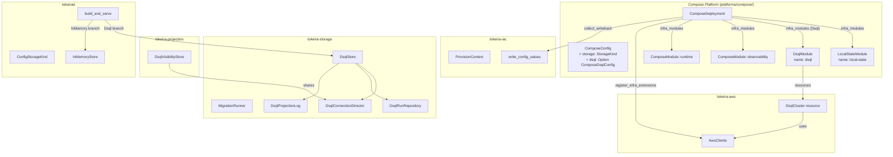
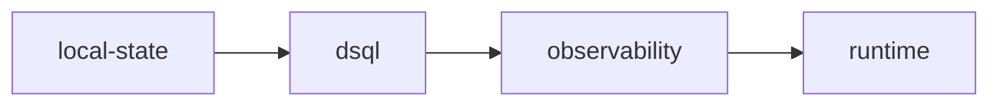
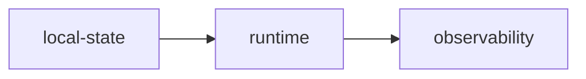

# Design Document: Compose DSQL Persistence

## Overview

This design adds Aurora DSQL as a storage backend for the compose platform. The implementation wires existing crates (`tokeira-aws`, `tokeira-storage`, `tokeira-projection`) into the compose platform's IaC module system, config model, service descriptors, and tokeirad startup path. The only storage-layer changes are migration-runner integration changes needed by the compose CLI path: missing-table status handling and embedded migrations.

The design covers nine features: a new `DsqlModule` for IaC, `ComposeConfig` extensions, endpoint writeback, AWS credential mounting, schema setup CLI wiring, lifecycle ordering via module dependencies, `ProvisionContext` extension registration, tokeirad runtime branching on `ConfigStorageKind`, and a state module rename from `"remote-state"` to `"local-state"`.

## Architecture



### Module Dependency Graph (DSQL mode)



### Module Dependency Graph (InMemory mode)



## Components and Interfaces

### 1. DsqlModule (`platforms/compose/src/modules.rs`)

A new struct implementing `tokeira_iac::Module`:

```rust
#[derive(Debug)]
pub struct DsqlModule {
    config: ComposeDsqlConfig,
    project_name: String,
}

impl iac::Module for DsqlModule {
    fn name(&self) -> &str { "dsql" }
    fn dependencies(&self) -> &[&str] { &["local-state"] }
    fn resources(&self, ctx: &iac::ModuleContext<'_>) -> Result<Vec<Box<dyn iac::Resource>>, iac::IacError> {
        // Validates preexisting mode has an endpoint
        // Constructs ResourceContext from project_name + config.region + default tags
        let rctx = tokeira_aws::ResourceContext {
            project: self.project_name.clone(),
            region: self.config.region.clone(),
            tags: HashMap::from([("ManagedBy".into(), "tkr".into())]),
        };
        // Returns vec![Box::new(DsqlCluster::new(identity, cluster_config, &rctx))]
    }
}
```

The module constructs a `DsqlCluster` resource from `tokeira-aws` with mode derived from `ComposeDsqlConfig.mode`. The cluster identity is `"{project_name}-compose"`. The `ResourceContext` is built from `project_name` (from `ComposeConfig.project_name`) and `config.region`.

### 2. ComposeDsqlConfig (`platforms/compose/src/config.rs`)

```rust
#[derive(Debug, Clone, Default, Serialize, Deserialize, PartialEq, Eq)]
#[serde(deny_unknown_fields)]
pub struct ComposeDsqlConfig {
    #[serde(default)]
    pub mode: DsqlMode,
    #[serde(default)]
    pub endpoint: Option<String>,
    #[serde(default)]
    pub arn: Option<String>,
    #[serde(default = "default_region")]
    pub region: String,
}

fn default_region() -> String { "us-east-1".into() }

#[derive(Debug, Clone, Default, Serialize, Deserialize, PartialEq, Eq)]
#[serde(rename_all = "lowercase")]
pub enum DsqlMode {
    #[default]
    Managed,
    Preexisting,
}
```

`ComposeConfig` gains two new fields:

```rust
pub struct ComposeConfig {
    // ... existing fields ...
    #[serde(default = "default_storage_kind")]
    pub storage: StorageKind,
    #[serde(default)]
    pub dsql: Option<ComposeDsqlConfig>,
}

fn default_storage_kind() -> StorageKind { StorageKind::InMemory }
```

Note: `StorageKind` from `tokeira-orchestrator` does not derive `Default`, so a `#[serde(default = "...")]` helper is used instead of `#[serde(default)]`.

### 3. ComposeModule Dependency Adaptation

`ComposeModule::dependencies()` becomes storage-kind-aware via a field on the struct:

```rust
impl iac::Module for ComposeModule {
    fn dependencies(&self) -> &[&str] {
        match (self.module_name.as_str(), self.storage) {
            (MODULE_RUNTIME, StorageKind::Dsql) => &["observability"],
            (MODULE_RUNTIME, StorageKind::InMemory) => &["local-state"],
            (MODULE_OBSERVABILITY, StorageKind::Dsql) => &["local-state", "dsql"],
            (MODULE_OBSERVABILITY, StorageKind::InMemory) => &["local-state", "runtime"],
            _ => &[],
        }
    }
}
```

### 4. Writeback Implementation (`ComposeDeployment::collect_writeback`)

```rust
fn collect_writeback(&self, config: &ComposeConfig, state: &iac::InfraState) -> Vec<(String, String)> {
    if config.storage != StorageKind::Dsql {
        return Vec::new();
    }
    let dsql_resource_id = iac::ResourceId("dsql-{project}-compose".into());
    let Some(resource_state) = state.resources.get(&dsql_resource_id) else {
        return Vec::new();
    };
    let Some(endpoint) = resource_state
        .properties
        .get("cluster_endpoint")
        .and_then(|v| v.as_str())
        .filter(|endpoint| !endpoint.is_empty())
    else {
        return Vec::new();
    };
    let mut values = Vec::new();
    values.push(("infrastructure.storage".to_string(), "dsql".to_string()));
    values.push(("infrastructure.dsql.endpoint".to_string(), endpoint.to_string()));
    // Region is always explicit from config — no endpoint-based inference
    let region = config.dsql.as_ref()
        .map(|d| d.region.clone())
        .unwrap_or_else(|| "us-east-1".to_string());
    values.push(("infrastructure.dsql.region".to_string(), region));
    values
}
```

### 5. AWS Credential Mounting (`platforms/compose/src/compose.rs`)

When `storage == StorageKind::Dsql`, the `tokeirad` `ComposeService` descriptor gains:

- **Volumes**: `~/.aws:/home/nonroot/.aws:ro`
- **Environment variables** (forwarded from host when set): `AWS_PROFILE`, `AWS_ACCESS_KEY_ID`, `AWS_SECRET_ACCESS_KEY`, `AWS_SESSION_TOKEN`, `AWS_ROLE_ARN`
- **HOME**: `/home/nonroot`
- **AWS_REGION**: always set to `ComposeDsqlConfig.region` (explicit, defaults to `us-east-1`)

`AWS_SHARED_CREDENTIALS_FILE`, `AWS_CONFIG_FILE`, and `AWS_WEB_IDENTITY_TOKEN_FILE` are NOT forwarded — they contain host-specific absolute paths that don't resolve inside the container. The `~/.aws` mount provides credentials at the standard path.

The credential-forwarding logic reads host environment variables at service-descriptor construction time. Only variables that are actually set on the host are included in the container environment.

### 6. ProvisionContext Extension Registration

`ComposeDeployment::register_infra_extensions()` gains a DSQL branch:

```rust
async fn register_infra_extensions(&self, config: &ComposeConfig, ctx: &mut iac::ProvisionContext) -> Result<()> {
    // Existing: register ComposePlatform
    let compose_file = config.deployment_dir.join("docker-compose.yml");
    let platform = Self::compose_platform(&compose_file, &config.project_name)?;
    ctx.set_extension(platform);

    // New: register AwsClients when DSQL
    if config.storage == StorageKind::Dsql {
        let region = config.dsql.as_ref()
            .map(|d| d.region.clone())
            .unwrap_or_else(|| "us-east-1".to_string());
        let sdk_config = aws_config::defaults(BehaviorVersion::latest())
            .region(Region::new(region))
            .load()
            .await;
        let clients = AwsClients::new(&sdk_config);
        // Eagerly validate credentials — SDK resolution is lazy
        clients.sts.get_caller_identity().send().await
            .context("AWS credentials required for DSQL storage; check `aws configure` or environment variables")?;
        ctx.set_extension(clients);
    }
    Ok(())
}
```

### 7. ConfigStorageKind and Tokeirad Startup Branching

In `tokeira-config`:

```rust
#[derive(Clone, Debug, Default, PartialEq, Eq, Serialize, Deserialize)]
#[serde(rename_all = "kebab-case")]
pub enum ConfigStorageKind {
    #[default]
    InMemory,
    Dsql,
}
```

Added to `InfrastructureConfig`:

```rust
pub struct InfrastructureConfig {
    #[serde(default)]
    pub storage: ConfigStorageKind,
    // ... existing fields ...
}
```

Validation rule added to `TokeiraConfig::validate()`:

```rust
if self.infrastructure.storage == ConfigStorageKind::Dsql
    && self.infrastructure.dsql.endpoint.as_deref().unwrap_or("").is_empty()
{
    errors.push(ValidationError::Field {
        field: "infrastructure.dsql.endpoint".to_string(),
        message: "must be set when infrastructure.storage is dsql; run `tkr infra apply --module dsql` first".to_string(),
    });
}
```

In `tokeirad/src/lib.rs`, `build_and_serve` branches on `ConfigStorageKind`:

```rust
match effective_config.infrastructure.storage {
    ConfigStorageKind::InMemory => {
        info!("storage backend: in-memory");
        // existing InMemoryStore path
    }
    ConfigStorageKind::Dsql => {
        let endpoint = effective_config.infrastructure.dsql.endpoint.as_deref()
            .expect("validated at config load");
        info!(endpoint, "storage backend: dsql");
        let auth = DsqlAuthConfig {
            endpoint: endpoint.to_owned(),
            region: effective_config.infrastructure.dsql.region.clone(),
            admin_role_arn: effective_config.infrastructure.dsql.admin_role_arn.clone(),
            runtime_role_arn: effective_config.infrastructure.dsql.runtime_role_arn.clone(),
            readonly_role_arn: effective_config.infrastructure.dsql.readonly_role_arn.clone(),
        };
        let dsql_store = DsqlStore::connect(auth, DsqlPoolConfig::default()).await
            .context("failed to connect to DSQL")?;
        // Decompose into owned components for distribution to subsystems
        let (director, run_repository, projection_log, _migration_runner) = dsql_store.into_parts();
        let run_repository = Arc::new(run_repository);
        let visibility_store = DsqlVisibilityStore::new(Arc::clone(&director));
        // DsqlProjectionLog is Clone (holds Arc<DsqlConnectionDirector> internally)
        // Each projection worker gets a clone
        // Wire run_repository into HistoryNotifyingRepository, projection_log into workers
    }
}
```

### 8. Schema Setup CLI Wiring (`apps/tkr/src/commands/schema.rs`)

The `tkr schema setup` command:

1. Loads `tokeirad.toml` and reads `infrastructure.dsql.endpoint` and `infrastructure.dsql.region`.
2. Uses the explicit region from config (always present after writeback).
3. Constructs a `PgPool` using `aurora-dsql-sqlx-connector` for IAM auth.
4. Constructs `MigrationRunner::new(MigrationConfig { .. })` with embedded migrations.
5. Calls `runner.apply(&pool).await?`.
6. Reports applied count.

Migration files are embedded at compile time via a `build.rs` in `tokeira-storage` that emits a static array of `EmbeddedMigration` structs with pre-computed SHA-256 checksums.

### 9. State Module Rename

`LocalStateModule::name()` returns `"local-state"` instead of `"remote-state"`. All internal references (`module()` on `LocalStateResource`, `ResourceState.module` fields, dependency declarations) are updated. The `Deployment::remote_state_module` trait method name is preserved.

## Data Models

### ComposeDsqlConfig

| Field | Type | Default | Description |
|-------|------|---------|-------------|
| `mode` | `DsqlMode` | `Managed` | Managed or Preexisting cluster lifecycle |
| `endpoint` | `Option<String>` | `None` | DSQL cluster endpoint (populated by writeback or operator) |
| `arn` | `Option<String>` | `None` | Cluster ARN (for preexisting mode) |
| `region` | `String` | `"us-east-1"` | AWS region — always explicit, set at deployment create time |

### ConfigStorageKind

| Variant | Serialized | Description |
|---------|-----------|-------------|
| `InMemory` | `"in-memory"` | Default — volatile in-process store |
| `Dsql` | `"dsql"` | Aurora DSQL persistence |

### DsqlModule Resource State Properties

Inherited from `DsqlCluster` resource in `tokeira-aws`:

```json
{
  "mode": "managed" | "preexisting",
  "cluster_identity": "tokeira-compose",
  "cluster_id": "...",
  "cluster_endpoint": "xxx.dsql.us-east-1.on.aws",
  "cluster_arn": "arn:aws:dsql:...",
  "tags": { ... }
}
```

### Writeback Keys

| TOML Key | Value | Condition |
|----------|-------|-----------|
| `infrastructure.storage` | `"dsql"` | Always when DSQL module in state |
| `infrastructure.dsql.endpoint` | cluster endpoint | Always when DSQL module in state |
| `infrastructure.dsql.region` | `ComposeConfig.dsql.region` | Always when DSQL module in state |

## Correctness Properties

*A property is a characteristic or behavior that should hold true across all valid executions of a system — essentially, a formal statement about what the system should do. Properties serve as the bridge between human-readable specifications and machine-verifiable correctness guarantees.*

### Property 1: Storage-kind-conditional module inclusion

*For any* `ComposeConfig` with `storage == StorageKind::Dsql`, the result of `ComposeDeployment::infra_modules()` SHALL contain a module named `"dsql"`. Conversely, *for any* `ComposeConfig` with `storage == StorageKind::InMemory`, the result SHALL NOT contain a module named `"dsql"`.

**Validates: Requirements 1.1.4, 1.1.5**

### Property 2: ComposeConfig TOML round-trip

*For any* valid `ComposeConfig` value (including DSQL fields, storage kind, and all observability settings), serializing to TOML and deserializing back SHALL produce an equivalent `ComposeConfig`.

**Validates: Requirements 2.1.4**

### Property 3: Writeback produces correct keys for DSQL state

*For any* `InfraState` containing a DSQL cluster resource with a non-empty `cluster_endpoint` property and any valid `ComposeConfig` with `storage == StorageKind::Dsql`, `collect_writeback()` SHALL return a vector containing `("infrastructure.storage", "dsql")`, `("infrastructure.dsql.endpoint", <endpoint>)`, and `("infrastructure.dsql.region", config.dsql.region)`. *For any* `InfraState` without a DSQL cluster resource, `collect_writeback()` SHALL return an empty vector.

**Validates: Requirements 3.1.1, 3.1.2, 3.1.4**

### Property 4: Writeback idempotence

*For any* set of writeback key-value pairs, calling `write_config_values` twice with the same pairs on the same file SHALL produce identical file content after both calls.

**Validates: Requirements 3.2.1**

### Property 5: AWS credential mounting conditional on storage kind

*For any* `ComposeConfig` with `storage == StorageKind::Dsql`, the `tokeirad` compose service descriptor SHALL contain a volume mount matching `~/.aws` and the `HOME` environment variable. *For any* `ComposeConfig` with `storage == StorageKind::InMemory`, the `tokeirad` compose service descriptor SHALL NOT contain any AWS-related volume mounts.

**Validates: Requirements 4.1.1, 4.1.3**

### Property 6: AWS_REGION env var follows explicit DSQL region

*For any* `ComposeConfig` with `storage == StorageKind::Dsql`, the `tokeirad` compose service descriptor SHALL contain `AWS_REGION` set to `config.dsql.region`. *For any* `ComposeConfig` with `storage == StorageKind::InMemory`, the descriptor SHALL NOT contain `AWS_REGION`.

**Validates: Requirements 4.2.1, 4.2.2**

### Property 7: Module dependency graph correctness per storage kind

*For any* `ComposeConfig` with `storage == StorageKind::InMemory`, the module dependency ordering SHALL be `local-state` → `runtime` → `observability`. *For any* `ComposeConfig` with `storage == StorageKind::Dsql`, the ordering SHALL be `local-state` → `dsql` → `observability` → `runtime`.

**Validates: Requirements 6.2.1, 6.2.2**

### Property 8: ConfigStorageKind TOML round-trip

*For any* valid `TokeiraConfig` with `infrastructure.storage` set to either variant, serializing to TOML and deserializing back SHALL produce an equivalent `TokeiraConfig`.

**Validates: Requirements 8.1.6**

### Property 9: DSQL storage validation rejects missing endpoint

*For any* `TokeiraConfig` with `infrastructure.storage == ConfigStorageKind::Dsql` and `infrastructure.dsql.endpoint` that is `None` or empty, `validate()` SHALL return an error referencing `"infrastructure.dsql.endpoint"`.

**Validates: Requirements 8.1.4**

### Property 10: Preexisting mode validation rejects empty endpoint

*For any* `ComposeDsqlConfig` with `mode == DsqlMode::Preexisting` and `endpoint` that is `None` or empty, the `DsqlModule::resources()` call SHALL return an error.

**Validates: Requirements 1.3.4**

### Property 11: Startup log does not leak sensitive fields

*For any* `TokeiraConfig` with DSQL role ARNs set, the storage-backend startup log message SHALL contain the endpoint but SHALL NOT contain any of the role ARN values.

**Validates: Requirements 8.3.2**

## Error Handling

| Scenario | Error Source | Behaviour |
|----------|-------------|-----------|
| Preexisting mode with no endpoint | `DsqlModule::resources()` | Returns `IacError::Other` with message about missing endpoint |
| AWS credentials unavailable | `register_infra_extensions()` | Returns error suggesting `aws configure` |
| DSQL cluster creation fails | `DsqlCluster::create()` | Returns `IacError::AwsSdk` with service error |
| DSQL connection fails at tokeirad startup | `DsqlStore::connect()` | Process exits non-zero with tracing error |
| Schema tables missing at tokeirad startup | DSQL query failure | Process exits non-zero (operator must run `tkr schema setup`) |
| `tkr schema setup` with no endpoint | CLI handler | Exits with "dsql endpoint is not configured" message |
| Writeback file missing | `write_config_values` | Returns `WritebackError::Io` |
| Invalid TOML key in writeback | `write_config_values` | Returns `WritebackError::InvalidKey` |
| `ConfigStorageKind::Dsql` with no endpoint in `tokeirad.toml` | `TokeiraConfig::validate()` | Returns `ConfigError::Validation` at config-load time |

## Testing Strategy

### Property-Based Tests (proptest)

The feature is well-suited to property-based testing because it involves config serialization, conditional logic branching on enum variants, and data transformation (writeback). Each correctness property above maps to a `proptest!` block.

**Library**: `proptest` (already used throughout the workspace)
**Minimum iterations**: 100 per property

Tests will be placed in:
- `platforms/compose/src/config.rs` — Property 2 (ComposeConfig round-trip)
- `platforms/compose/src/lib.rs` — Properties 1, 3, 5, 6, 7 (module inclusion, writeback, credentials, dependencies)
- `crates/tokeira-config/src/lib.rs` — Properties 8, 9 (ConfigStorageKind round-trip, validation)
- `platforms/compose/src/modules.rs` — Property 10 (preexisting validation)

Each property test is tagged with:
```rust
// Feature: compose-dsql, Property N: <property_text>
```

### Unit Tests (example-based)

- `DsqlModule::name()` returns `"dsql"`
- `DsqlModule::dependencies()` returns `["local-state"]`
- `LocalStateModule::name()` returns `"local-state"` (post-rename)
- `DsqlModule` with managed mode produces `DsqlClusterMode::Managed` resource
- `DsqlModule` with preexisting mode and valid endpoint produces `DsqlClusterMode::Preexisting` resource
- `tkr schema setup` error message when endpoint missing
- `tkr schema validate` with valid migrations exits 0
- Default `ComposeConfig` has `storage == InMemory` and `dsql == None`

### Integration Tests

- `register_infra_extensions` with DSQL storage registers `AwsClients` (requires mocked AWS config)
- Full `infra_modules` → `resources` → dependency ordering verification
- Writeback end-to-end: construct state, call `collect_writeback`, call `write_config_values`, verify file content

### What Is NOT Property-Tested

- AWS API calls (DsqlCluster create/delete) — integration tests with mocks
- Docker container operations — existing compose platform tests cover this
- `tkr schema setup` end-to-end — requires live DSQL endpoint
- Tokeirad DSQL startup path — requires live DSQL endpoint
