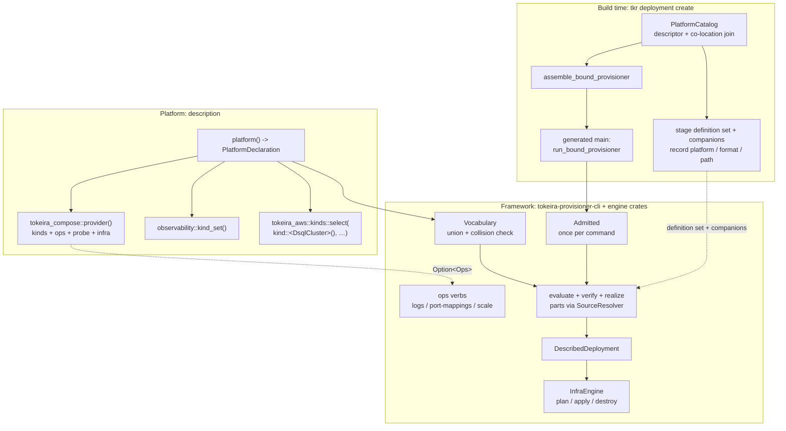

# Design Document

## Overview

The Compose platform is the description-only model of `requirements.md`: the
platform package carries the definitions and their parts, the observability
content, the platform's own kinds, the catalog descriptor, and one
entry-point function; the framework (`tokeira-provisioner-cli` driving the
engine crates, speaking the contract types in `tokeira-platform`) owns the
provisioning pipeline once, for every platform on the bound path.

Definitions may span multiple documents. Each frontend supplies module
semantics from its host language: `.tkd` parts are Rust-style modules
(`mod name;`, `name::function(…)`, `pub` exports) evaluated by the tkd
interpreter's own scope model; `.tkdp` parts are genuine Python modules
(`import name`, `name.function(…)`, underscore privacy) registered with the
Monty sandbox as source modules. Config revisions retain the definition set,
and the retarget gate compares sets.

## Dependencies and Non-Goals

- **The Monty fork**: the `.tkdp` mechanism stands on
  `github.com/iw/monty` — one patch atop the previously pinned upstream
  revision, adding embedder-registered source modules. The pin and its
  retire condition (upstream ships a module seam; pydantic/monty#601
  explores the direction) live beside the dependency in `Cargo.toml` and
  `deny.toml`.
- **Direction, not contract**: the reference sketches carry the ECS
  onboarding shape (`reference/ecs-idealized/`) and the tkdp authored
  surface beyond the current dialect — provenance-true crate imports, the
  `platform` model part, observed-entry-point vocabulary
  (`reference/tkdp-parts-idealized/`). The platform-source-set spec owns
  source-set formalization; `platform-source-set/requirements.md` is the
  pointer.
- **Non-goals**: the tkdp vocabulary split (`tokeira_platform` /
  `tokeira_provisioner` / provider modules as import targets); the service
  plane's realization (deploy verbs exist and are fail-closed until service
  nodes fill); any change to Temporal-facing behaviour.

## Architecture

Build time: the catalog discovers the platform by descriptor, joins it with
the frontend's conventional relative path, and assembles a bound `tkp` from
platform, frontend, and framework. The generated `main` hands the platform
declaration and the frontend to
`run_bound_provisioner(platform, format, declaration, frontend)`; the
framework performs the marriage. The platform is not generic over the
frontend.

Run time: every verb follows one path. The shell admits once per command
(`Admitted`: verified metadata plus deployment identity), the engine
evaluates the recorded definition through the frontend against the composed
vocabulary — resolving parts beside the interpreted document — verifies
structurally, realizes kinds into resources, and drives the existing
`InfraEngine` with the framework-owned `DescribedDeployment`. Ops verbs
exist exactly when the provider export carries an ops surface.



## Components and Interfaces

### 1. Platform declaration (`tokeira-platform::declaration`)

The framework defines what it consumes; the platform names values.

```rust
pub struct PlatformDeclaration { /* provider + selections */ }
impl PlatformDeclaration {
    pub fn on(provider: ProviderExport) -> Self;
    pub fn kinds(self, selection: KindSet) -> Self;
    pub fn vocabulary(&self) -> Result<Vocabulary, CompositionError>;
}

pub struct ProviderExport {
    pub kinds: KindSet,
    pub ops: Option<Box<dyn Ops>>,
    pub execution: Box<dyn ProviderExecution>,
    pub infra: Option<Arc<dyn InfraConstructor>>,
}
```

Kind selection is typed: `kind::<K>(name)` builds a `KindEntry` for the
kind type under the one word its resource owns — the selection site passes
the resource's `TYPE` const (author-visible kind name and engine resource
type are the same word, stated once on the resource), so a selection typo
is a compile error. A `KindSet` may carry its own `InfraConstructor`
(`.infra(constructor)`), the registration ingredient for that selection's
provider handles.

The Compose entry point (`platforms/compose/src/lib.rs:71`):

```rust
pub fn platform() -> PlatformDeclaration {
    PlatformDeclaration::on(tokeira_compose::provider())
        .kinds(observability::kind_set())
        .kinds(tokeira_aws::kinds::select(vec![
            kind::<DsqlCluster>(resources::dsql_cluster::DsqlCluster::TYPE),
            kind::<DynamoDbTable>(resources::dynamodb_table::DynamoDbTable::TYPE),
        ]))
}
```

Construction is pure. The typed `select` is chosen over provider-tracking
`all()`: the vocabulary states its intent and grows only on purpose — a
definition adopting a new AWS kind names its type here in the same change.

### 2. Vocabulary composition

`Vocabulary::of(kind_sets)` unions the declared sets and refuses a colliding
kind name, naming both providers. It supplies the frontend contract (names,
contains, defaults, decode). A kind outside the union is an unknown-kind
error located at the authoring site; no "known but unwired" state exists and
no global kind inventory exists anywhere in the engine.

### 3. Providers and platform-owned kinds

- `tokeira_compose::provider() -> ProviderExport` — the compose kind library
  (`Service`, `LocalStateDir`, `ServerConfig`), `DockerOps` (component 5),
  the reachability probe, and `ComposeInfraConstructor`, which connects
  `ComposePlatform` (compose-file ledger under the framework-owned `state/`)
  and registers the resource-recovery hook at operation start.
- `platforms/compose/src/observability.rs` — the platform's own kind:
  `ObservabilityConfiguration` renders the companion content; contributed to
  the vocabulary via `observability::kind_set()`. The provider keeps only
  the fencing contract (`config_content_resource_id`) its `Service`
  consumers key on.
- `tokeira_aws::kinds` — `DsqlCluster`, `DynamoDbTable`, selected by type.
  `AwsInfraConstructor` (attached to the selection) builds the SDK clients:
  region from the selection's `aws` block in the evaluated configuration
  when present, the ambient SDK chain otherwise — the provider owns its
  precedence rule over its own namespace block.

### 4. Admission, engine, and the described deployment (`tokeira-provisioner-cli`)

The shell admits once per command: `Admitted { metadata, deployment_ref }`
carries verified metadata (including the double-entry check of the recorded
`{ platform, format }` pair against the binary's) and deployment identity.
Every verb receives `(engine, admitted)`.

`Engine<F>` owns the verbs: plan, apply, destroy, selected destroy, deploy
plan, deploy apply, desired snapshot, recorded state, definition check,
retarget check. Evaluation resolves parts beside the interpreted document
(`DirectoryPartSources` over the source's parent, extension = the format
id), so a baseline evaluation from a retained revision folder resolves that
revision's parts. Probe semantics: an unreachable provider **blocks** plan —
the plan plans nothing and the issue is the outcome's only content, because
describing the live substrate is a precondition of comparing against the
record — and refuses apply and destroy.

`DescribedDeployment` is the one `orchestrator::Deployment` on the bound
path: bootstrap nominated by shape (the unique dependency-free module),
modules and namespaces from the verified graph, infra extensions constructed
by running each declared selection's `InfraConstructor` with that
selection's namespace attributes, and writeback collected from declared
entries against recorded outputs. Resolved writeback **persists** into the
deployment's server configuration document before recorded state re-stamps —
at apply, upgrade, revert, and rollback.

The deploy verbs ride the real deploy engine over the definition's service
plane. The plane is empty until service nodes exist, and the applier is
fail-closed (`NoWorkloadApplier`): a non-empty reconciliation refuses rather
than pretending.

### 5. Ops (`tokeira-platform` trait, `tokeira-compose` impl)

```rust
#[async_trait]
pub trait Ops: Send + Sync + fmt::Debug {
    async fn log_stream(&self, deployment: &DeploymentRef, service: &str,
                        follow: bool, tail: Option<u32>) -> Result<LogStream>;
    async fn port_mappings(&self, deployment: &DeploymentRef, service: &str)
                        -> Result<Vec<PortMapping>>;
    /// Required, deliberately undefaulted: an ops surface answers every one
    /// of its verbs in its own words — a provider without a scale dimension
    /// states its own refusal as the error.
    async fn scale(&self, deployment: &DeploymentRef, specs: &[String])
                        -> Result<usize>;
}
```

`DockerOps` implements all three beside `ComposePlatform` — scale drives
compose service scaling. The framework validates service names against the
evaluated definition before calling down, refuses unknown names listing the
actual services, and re-stamps recorded state after a scale. The CLI mounts
`logs` / `port-mappings` / `scale` iff the export carries ops — capability
by presence, no stub answers.

### 6. Execution probe and infra constructors

`ProviderExecution::probe(deployment)` answers reachability as data:
`Ok(None)` reachable, `Ok(Some(issue))` the degradable answer (blocked plan;
refused apply/destroy), `Err` a non-provider failure. A passing probe is a
point-in-time answer, not a guarantee; failures after it surface through the
operation's own error path carrying the same platform-issue evidence.

Registration happens through the deployment's unchanged seam and nowhere
else: `register_infra_extensions` runs each declared selection's
`InfraConstructor` with the selection's namespace block from the evaluated
configuration; constructors put handles into the context, and resources read
them via `ctx.extension::<T>()` at the mechanics moment.

### 7. Observability content

Content lives in the platform package and each platform owns its tree:

```text
platforms/compose/observability/   templates/ dashboards/ alerts/
platforms/ecs/observability/       templates/ dashboards/ alerts/
```

`ObservabilityConfiguration` reads `observability/` relative to
`PlacementContext::definition_dir` — the deployment root for a working
realization, a retained revision folder for a baseline. Content bytes enter
the rendered files' content digests, so an edit moves
`TOKEIRA_CONFIG_DIGEST` for every consumer. Each platform's tests validate
its own tree against the shared `DashboardValidator` / `AlertRuleValidator`
style contracts (`tokeira-observability::testing`).

### 8. The marriage seam

`bound_provisioner_main!` expands to framework code:

```rust
tokeira_provisioner_cli::run_bound_provisioner(
    expected_platform, expected_format, platform_factory(), frontend(),
)
```

`assemble_bound_provisioner` emits this form; admission performs the
double-entry verification. Nothing on the bound path is generic over the
frontend.

### 9. Definition parts

**The seam (`tokeira-platform::definition`).** `SourceResolver` resolves a
part name to bytes; `DirectoryPartSources` serves `{name}.{format}` beside
the root (bare identifiers only), `NoPartSources` serves none,
`RecordingResolver` wraps a resolver recording served parts in
first-request order. `evaluate_definition` threads the resolver and records
the definition-set identity: `sha256-set-v1` over the root and served parts
in first-request order, with dedupe.

**`.tkd` (`tokeira-tkd`).** `mod name;` declares a part; `parts::load`
resolves and validates the set (inline bodies, duplicate declarations,
part-name-vs-root-type collisions, and shadowing refused by name; part
errors prefixed `{name}.tkd:`). The subset rules split by scope: the root
admits `mod name;` and refuses `pub` ("the root exports nothing"); parts
refuse `mod` ("one level deep") and export via `pub`. The evaluator's scope
model gives a part its own types over the root's, admits `part::function(…)`
calls from the root with exact-gap refusals ("not `pub`", "part `x` has no
function `y`"), and gives parts nothing of each other — wiring flows through
the root by construction.

**`.tkdp` (`tokeira-tkdp` on the Monty fork).** The facade is a genuine
registered `tokeira` module: one set of class identities for root and parts
(class-identity `match` patterns work across the boundary), import blanking
retired, the driver importing its machinery like any file. Every non-facade
import is offered to the resolver, transitively; a served name is validated
(the root's admission surface minus the entrypoint requirement), lowered
(match splice), and registered as a Monty source module with its own
namespace, file name, and source map; an unserved name falls through to
Monty. Refusals: dotted or relative imports (TKDP013), a plain import
shadowed by the file's own binding with the from-form as the stated remedy
(TKDP014), part preflight failures named by part file; import cycles refuse
at Monty construction naming the cycle path. The runner translates traceback
frames per file: root frames through the root map (carrying the diagnostic
range), part frames through their own maps at original coordinates, facade
frames as internal.

**The Monty seam.** Embedder-registered source modules in the fork: each
module's globals occupy a disjoint slot range of the flat globals vector
(bases baked into operands at compile time — per-module namespaces at zero
runtime cost); module bodies compile as zero-arg `<module>` functions
invoked through the standard call machinery, so suspended mid-import frames
serialize like any call; execute-once cache carried by snapshots; cycles
refused at construction; built-in names cannot be shadowed.

### 10. Definition-set retention and retarget

`config_history::snapshot` retains the root, every sibling part file of the
definition's format (listed in the identity sidecar), and the server
configuration document into the revision folder; `restore` writes the root
and its retained parts back (a live part the revision never knew is left in
place — the restored root decides what it imports). The retarget gate
threads per-side part resolvers — the retained revision folder for the
prior, the live directory for the current — through the engine into
`DefinitionFrontend::retarget_check`; the `.tkd` frontend evaluates both
sides with their resolvers and diffs the host-free config values, so a
create-time-immutable change refuses regardless of which document carries
it.

## Data Models

- **`PlatformDeclaration` / `ProviderExport` / `KindSet` / `KindEntry`** —
  in `tokeira-platform::declaration`; constructed by platform and provider
  code; plain data plus three behaviour objects (`Ops`,
  `ProviderExecution`, `InfraConstructor`). Not serialized.
- **`Vocabulary`** — name → (provider, entry) map; collision-checked at
  construction.
- **`Admitted`** — verified deployment metadata plus `DeploymentRef`;
  produced once per command.
- **Deployment metadata** (`metadata.json`) — unchanged:
  `{ name, id, platform, definition: { format, path } }`.
- **Recorded state** — CAS documents at `state/infra` and `state/deploy`;
  the compose-file ledger `state/compose-services.yaml` remains a provider
  execution artifact.
- **Config revisions** — `state/config-revisions/{n}/`: retained root, part
  files, identity sidecar (format, path, part names), server config,
  explanation.
- **Definition-set identity** — `sha256-set-v1` over root plus served parts
  in first-request order.
- **Evaluated configuration** — a `LocatedValue` held by the framework for
  the duration of an operation; never decoded into platform types (none
  exist).

## Correctness Properties

Property 1: Vocabulary is exactly the declaration.
*For any* provider kind set S and selections A with disjoint names, the
composed vocabulary contains exactly S ∪ A: every name decodes, and
`contains` is false outside it.
**Validates: Requirements 3.1, 3.2, 3.5**

Property 2: Colliding kind names refuse composition.
*For any* two kind sets whose name sets intersect, composition fails naming
the colliding name and both providers.
**Validates: Requirements 3.4**

Property 3: Unknown kinds are located authoring errors.
*For any* definition naming a kind outside the composed vocabulary,
`definition check` refuses with an unknown-kind error carrying the authoring
source location, and no provider or filesystem access occurs.
**Validates: Requirements 3.3, 9.3**

Property 4: Declaration construction is pure.
*For any* invocation of the Compose entry point, no filesystem, network, or
Docker access occurs, and the returned declaration is structurally equal
across invocations.
**Validates: Requirements 1.2, 1.5**

Property 5: Kind input validation refuses invalid inputs with located
errors.
*For any* `Service` input with empty image, zero replicas, or a zero
published port, and *for any* `DsqlCluster` input violating the
managed/preexisting field rules or with an empty region, validation refuses
locating the authoring site; *for any* valid input it admits.
**Validates: Requirements 2.3, 2.4, 2.5**

Property 6: Storage modes preserve the reference graph shape.
*For any* of the three storage modes applied to the reference definition,
the realized modules are `local_state`, `runtime`, `observability`, plus
`dsql` exactly when DSQL storage is selected, and the compose-service
resource set is unchanged across modes.
**Validates: Requirements 9.1**

Property 7: Content edits move every consumer's digest.
*For any* byte change to observability content or rendering parameter, the
configuration content digest fencing each consumer differs from the pre-edit
digest; absent any change, digests are identical across realizations.
**Validates: Requirements 5.5, 9.2**

Property 8: Companion resolution follows the definition source.
*For any* retained revision folder holding a definition set plus companions,
a baseline realization from that folder digests the retained bytes — parts
included — and a live-tree realization digests the live bytes,
independently.
**Validates: Requirements 5.4, 11.4**

Property 9: Definition check is pure.
*For any* definition source (valid or refused), `definition check` leaves
the deployment directory byte-identical.
**Validates: Requirements 9.3**

Property 10: Inspection is deterministic and non-authoritative.
*For any* execution, rendering the compose projection twice yields identical
bytes; editing the published `docker-compose.yml` and re-evaluating yields
manifests identical to the pre-edit evaluation.
**Validates: Requirements 9.4**

Property 11: Selection directions are prerequisite-on-apply,
dependant-on-destroy.
*For any* module in the verified graph, plan/apply selection includes
exactly its transitive prerequisites, and destroy selection exactly its
transitive dependants; unknown module names are refused listing the graph's
modules.
**Validates: Requirements 9.5**

Property 12: Writeback resolves and persists.
*For any* DSQL-mode execution with applied outputs, resolved writeback pairs
are exactly the declared entries with literals passed through and output
references resolved from recorded state, persisted into the server
configuration document before the envelope re-stamp; entries whose outputs
are unavailable resolve to nothing rather than partial pairs.
**Validates: Requirements 6.6, 9.6**

Property 13: Ops verbs exist by presence.
*For any* declaration whose provider carries ops, the CLI mounts `logs`,
`port-mappings`, and `scale`; *for any* declaration without, those verbs are
absent from the CLI surface entirely — parsing, help, and dispatch.
**Validates: Requirements 4.1, 4.2, 8.1**

Property 14: Service names are validated against the evaluated definition.
*For any* evaluated definition and any service name, an ops verb proceeds
iff the name is one of the definition's services; refusals list exactly the
definition's service set.
**Validates: Requirements 4.3, 4.5**

Property 15: The bound pair is enforced at admission.
*For any* deployment metadata whose `{ platform, format }` differs from the
pair a bound tkp was built as, every verb refuses at admission; matching
pairs proceed.
**Validates: Requirements 6.1, 7.3**

Property 16: A root and its parts build one graph, in both frontends.
*For any* root declaring a part that declares modules and resources, the
evaluated graph equals the single-document equivalent: the part's modules
appear with their dependencies, kinds decode through the same vocabulary,
and (`.tkdp`) class identities match across the boundary.
**Validates: Requirements 10.1, 10.2, 10.3**

Property 17: Part boundary rules refuse by name.
*For any* source violating a part rule — inline body, nested part, private
call, shadowed type (`.tkd`); dotted import, shadowed plain import, part
preflight failure, import cycle (`.tkdp`) — evaluation refuses with the
named-gap message, and part-file failures carry the part's file name.
**Validates: Requirements 10.5**

Property 18: The definition-set identity is order-stable and byte-exact.
*For any* definition set, the `sha256-set-v1` identity is a pure function of
the root bytes and the served parts' names and bytes in first-request order;
a single-document definition's identity is byte-stable against the pinned
regression value.
**Validates: Requirements 10.6**

Property 19: Revisions round-trip the definition set.
*For any* retained revision, the revision folder holds the root, the sibling
part files, and the sidecar listing them; restore returns root and parts to
their retained bytes, and the retarget gate evaluated against the retained
folder sees the retained set.
**Validates: Requirements 11.1, 11.2, 11.3**

## Error Handling

| Condition | Internal | Operator surface |
|---|---|---|
| Definition names an unknown kind | located `KindError` from `Vocabulary::decode` | `definition check` refusal with source location |
| Two selections export one kind name | `CompositionError` at composition | bound tkp startup failure naming both providers and the name |
| Invalid `Service` / `DsqlCluster` input | located `KindError` from `validate_input` | check/plan refusal at the authoring site |
| Provider unreachable at plan | `PlatformIssue` from the probe | plan is blocked: it plans nothing and the issue is the outcome's only content |
| Provider unreachable at apply/destroy | hard error wrapping the issue evidence | operation refuses with fact + verbatim evidence + direction |
| Unknown service on an ops verb | framework refusal (pre-provider) | error listing the definition's services |
| Recorded pair ≠ built pair | admission error | every verb refuses at admission, naming both pairs |
| `.tkd` part rule violation | located subset/eval refusal | message naming the exact gap; part errors prefixed `{name}.tkd:` |
| `.tkdp` dotted/relative import | preflight finding TKDP013 | located refusal: "module imports are single-level in definitions" |
| `.tkdp` shadowed plain import | preflight finding TKDP014 | located refusal naming the binding, from-form as the remedy |
| `.tkdp` part import cycle | Monty construction `ImportError` | refusal naming the cycle path (`a -> b -> a`) |
| Unserved `.tkdp` import | Monty runtime `ModuleNotFoundError` | traceback at the import site in root coordinates |
| Retarget across a create change | frontend refusal via per-side set evaluation | refusal naming every changed field |
| Absent `tokeirad.toml` / `observability/` at apply | located `IacError` from the owning resource | refusal naming the missing path |

## Testing Strategy

- **Framework and seam suites**: declaration/vocabulary and part-seam tests
  in `tokeira-platform` (including the `sha256-set-v1` byte-stability
  regression pin); the shell and engine suites in `tokeira-provisioner-cli`
  (admission, verbs, writeback persistence, `config_history` set
  retention/restore) over the `testkit` stub frontend.
- **Frontend part suites**: `crates/tokeira-tkd/tests/parts.rs` (the `mod`
  mechanism end to end, boundary refusals, directory resolution, the
  set-comparing retarget gate) and `crates/tokeira-tkdp/tests/parts.rs`
  (registered-module parts, refusals, cycle naming, per-part traceback
  mapping through the lowering, directory resolution).
- **Monty fork suite**: `crates/monty/tests/registered_modules.rs` in the
  fork — registered-module semantics (namespaces, execute-once, cycles,
  builtins, dump round-trip, snapshot divergences pinned as tests) — plus
  the fork's full suite under CI's invocation.
- **Platform suites**: `platforms/compose` behaviour properties (graph
  shape, digest coupling, pure check, inspection determinism) and each
  platform's own observability style-contract tests.
- The default suite requires no Docker daemon and no AWS credentials:
  provider-dependent behaviour is covered at the probe and constructor
  seams with stubs.
