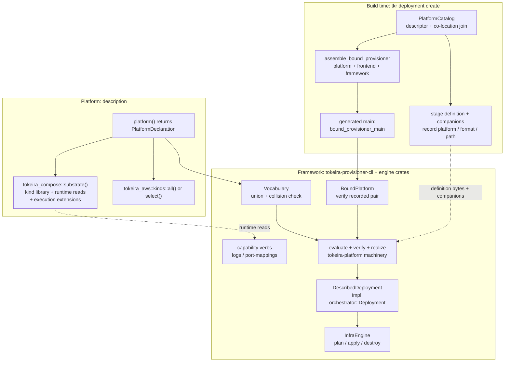

# Design Document

## Overview

This design refines the Compose platform to the description-only model of
`requirements.md`: the platform package carries the definitions, the observability
content, the catalog descriptor, and one entry-point function; the framework
(`tokeira-provisioner-cli` driving the existing engine crates) owns the provisioning
pipeline once, for every platform on the bound path.

The design is a redistribution, not a rewrite. The pipeline code largely exists —
definition evaluation in `tokeira-platform` (`evaluate_definition`,
`crates/tokeira-platform/src/definition.rs:153`), infrastructure execution in
`tokeira-orchestrator` (`InfraEngine`), Docker mechanics in `tokeira-compose`, AWS
mechanics in `tokeira-aws`. What changes is who holds it: everything
`ComposeProvisioner` hosts today (`platforms/compose/src/lib.rs`) moves into the
framework in platform-agnostic form, and the platform's remaining Rust shrinks to a
declaration.

Wire-shape and behaviour sources: the current implementation cited per seam below,
and the reference sketch at `reference/compose-idealized/` in this spec directory
for the target surface. Where sketch and this document disagree, this document wins.

## Dependencies and Non-Goals

- **Owning relationship**: this spec owns the refined framework seams
  (`PlatformDeclaration`, kind sets, runtime-reads extension, the generic pipeline)
  and the Compose migration onto them. The legacy `ProvisionerPlatform` +
  `orchestrator::Deployment` path continues to exist untouched for the local, ECS,
  and EKS platforms; their migrations are follow-on specs that will declare their
  own capabilities (workload plane, scale, images) against the seams this spec
  introduces. Per the requirements' Capability dispositions, nothing here may
  preclude those declarations.
- **`platform-builder-abstraction`**: the existing property tests in
  `platforms/compose` tagged with that feature (graph parity, content coupling,
  pure verification, inspection determinism) remain valid behaviour statements;
  this design carries them forward onto the refined seams (see Testing Strategy).
- **Non-goals**: definition-language changes; `.tkd`/`.tkdp` frontend changes beyond
  the marriage seam; reshaping `DsqlMode`; an image build/mirror framework; any
  change to Temporal-facing behaviour.

## Architecture

Build time: the catalog discovers the platform by descriptor, joins it with the
frontend's conventional relative path, and assembles a bound `tkp` from exactly
three direct dependencies — platform, frontend, framework. The generated `main`
hands the platform declaration and the frontend to the framework; the framework
performs the marriage. The platform is not generic over the frontend.

Run time: every verb follows one path. The framework loads the recorded metadata,
evaluates the recorded definition through the frontend against the composed
vocabulary, verifies structurally, realizes kinds into resources, and drives the
existing `InfraEngine` with a framework-owned `orchestrator::Deployment`
implementation derived from the verified graph. Capability verbs (runtime reads for
Compose) exist exactly when the declaration registers them.



## Components and Interfaces

### 1. Platform declaration (`tokeira-provisioner-cli`, new module `declaration`)

The framework defines what it consumes. All types live in the framework; the
platform names values.

```rust
/// Everything the framework needs to operate one platform.
pub struct PlatformDeclaration {
    substrate: SubstrateExport,
    auxiliary: Vec<KindSet>,
}

impl PlatformDeclaration {
    /// Declare the substrate. Its kind library, runtime reads, and execution
    /// extensions arrive with it; no separate wiring act exists.
    pub fn on(substrate: SubstrateExport) -> Self;

    /// Add an auxiliary kind selection. May be called per provider.
    pub fn kinds(self, selection: KindSet) -> Self;
}

/// A provider's substrate export: what "running on" this provider means.
pub struct SubstrateExport {
    pub kinds: KindSet,
    pub runtime_reads: Option<Box<dyn RuntimeReads>>,
    /// Constructs the provision-context extensions the substrate's resource
    /// mechanics need for one operation (Compose: the connected
    /// `ComposePlatform`). Invoked by the framework at operation start —
    /// platforms register nothing.
    pub execution: Box<dyn SubstrateExecution>,
}

/// One provider's named kind entries, carried by value.
pub struct KindSet {
    pub provider: &'static str,
    pub entries: Vec<KindEntry>,
}

/// One author-visible kind: everything the pipeline needs, in one place.
pub struct KindEntry {
    pub name: &'static str,
    pub defaults: fn() -> Option<LocatedValue>,
    pub decode: fn(LocatedValue) -> Result<Box<dyn ProviderKind>, KindError>,
}
```

The existing per-kind contract — `ProviderKind` with `validate_input`,
`declared_outputs`, `desired_manifest`, `realize`
(`crates/tokeira-platform/src/kind.rs:33`) — is retained unchanged; `KindEntry`
replaces only the routing around it (`KindFunctions`,
`crates/tokeira-platform/src/kind.rs:55`, deleted).

The Compose entry point (`platforms/compose/src/lib.rs`, whole file after the
refactor):

```rust
pub fn platform() -> PlatformDeclaration {
    PlatformDeclaration::on(tokeira_compose::substrate())
        .kinds(tokeira_aws::kinds::all())
}
```

Construction is pure: no I/O, no client connections, no deployment context. The
`all()` selection is chosen over `select([DsqlCluster, DynamoDbTable])` so new AWS
kinds become authorable without a platform edit; switching to `select` is a
one-line change the platform may make at any time.

### 2. Vocabulary composition (`tokeira-provisioner-cli`)

```rust
/// The composed authoring vocabulary: substrate ∪ auxiliary selections.
pub struct Vocabulary { /* name -> (provider, KindEntry) */ }

impl PlatformDeclaration {
    /// Union the declared kind sets. Fails if two providers export the same
    /// kind name, naming both providers and the colliding name.
    pub fn vocabulary(&self) -> Result<Vocabulary, CompositionError>;
}
```

`Vocabulary` supplies the frontend contract the evaluation machinery already
expects (names, contains, defaults, decode) — the same role `tokeira-kinds`'
`kind_functions()` plays today (`crates/tokeira-kinds/src/lib.rs:130`), computed
from the declaration instead of hardcoded engine-wide. A kind outside the union is
an unknown-kind error located at the authoring site; no "known but unwired" state
exists. `tokeira-kinds` is deleted (approved; requirements disposition table).

### 3. Kind libraries (`tokeira-compose`, `tokeira-aws`)

- `tokeira_compose::substrate() -> SubstrateExport` — kinds
  (`Service`, `LocalStateDir`, `ServerConfig`, `ObservabilityConfiguration`,
  today's export at `crates/tokeira-compose/src/kinds/mod.rs:743`), runtime reads
  (component 5), and the execution constructor (component 6).
- `tokeira_aws::kinds::all() -> KindSet` and
  `tokeira_aws::kinds::select(names) -> KindSet` over the existing entries
  (`crates/tokeira-aws/src/kinds/mod.rs:19`). `select` with an unknown name is a
  composition-time error.
- AWS mechanics construct their own SDK clients from kind input: `DsqlCluster` and
  `DynamoDbTable` inputs already carry `region`; realization builds (and
  memoizes per region) the client it needs. This deletes the ambient-client path —
  today's `register_infra_extensions` constructing `AwsClients` from the decoded
  config's storage region (`platforms/compose/src/lib.rs:291`) — and resolves the
  requirements-stage open question: provider initialisation inputs travel as kind
  input, never as ambient state.

### 4. The generic pipeline (`tokeira-provisioner-cli`, new module `engine`)

The framework hosts, once, what `ComposeProvisioner` hosts per-platform today:

```rust
/// One evaluated-and-realized operation context.
struct Execution {
    config: LocatedValue,          // evaluated configuration, held by the framework
    graph: VerifiedGraph<Box<dyn ProviderKind>>,
    resources: BTreeMap<String, Vec<Arc<dyn iac::Resource>>>,
    manifests: BTreeMap<ResourceId, serde_json::Value>,
    index: RealizedResourceIndex,
    writeback: Vec<WritebackEntry>,
}

/// Framework-owned Deployment: derives every answer from the execution.
/// No platform implements orchestrator::Deployment on the bound path.
struct DescribedDeployment { /* execution + declaration */ }
impl orchestrator::Deployment for DescribedDeployment { ... }
```

Verb implementations move from `platforms/compose/src/lib.rs` into this module
with platform specifics removed: `definition_check`, `retarget_check`,
`desired_snapshot`, `recorded_state`, `infra_plan`, `infra_apply`,
`infra_destroy`, `infra_destroy_selected`, `publish_inspection`, and the
module-selection expansion (`operation_selection`,
`platforms/compose/src/lib.rs:575`). The adapter layer (`ExecutionConfig`,
`ConcreteDeployment`, `ConcreteModule`, `SharedResource`) generalizes into
`DescribedDeployment` — written once, deleted from every platform.

State stores are framework-standard: CAS stores at `state/infra` and
`state/deploy` (today constructed by the platform,
`platforms/compose/src/lib.rs:314`), created by the framework unconditionally.
Bootstrap remains graph-driven: the framework treats the module that realizes the
state backing (Compose: `local_state`) by the same prerequisite ordering the graph
already declares, replacing the platform's named-module special case
(`remote_state_module`, `platforms/compose/src/lib.rs:248`).

Writeback: `collect_writeback` moves verbatim in behaviour
(`platforms/compose/src/lib.rs:337`) — the framework resolves declared entries
against its own recorded state and persists per the existing verb flow. Config
rehydration (`hydrate_config`) is identity for Compose; the seam remains a
framework function over recorded state so the ECS migration can use it.

### 5. Runtime reads (`tokeira-provisioner-cli` trait, `tokeira-compose` impl)

```rust
/// Live reads a substrate MAY answer about a running deployment.
#[async_trait]
pub trait RuntimeReads: Send + Sync {
    async fn log_stream(&self, deployment: &DeploymentRef, service: &str,
                        follow: bool, tail: Option<u32>) -> Result<LogStream>;
    async fn port_mappings(&self, deployment: &DeploymentRef, service: &str)
                        -> Result<Vec<PortMapping>>;
}

/// Identity only, supplied by the framework from admitted metadata.
pub struct DeploymentRef { pub name: String, pub dir: PathBuf }
```

`tokeira-compose` implements it beside `ComposePlatform` with the mechanics that
back today's `log_stream`/`port_mappings` (`crates/tokeira-compose/src/lib.rs:818`
and `:871`), reached through a read-only constructor that takes the project name
only — the compose-file ledger parameter of `connect`
(`crates/tokeira-compose/src/lib.rs:498`) is not required to answer a read. The
platform-side `ops.rs` is deleted; the framework validates the service name
against the evaluated definition's service set before calling down and refuses
unknown names listing the actual services. The CLI mounts the `logs` /
`port-mappings` verbs iff `declaration.substrate.runtime_reads` is `Some` —
capability by presence; `Realization<T>` disappears from this path.

Relationship to `orchestrator::Ops` (`crates/tokeira-orchestrator/src/lib.rs:466`):
that trait is the legacy tkr path's composite of the same territory —
`logs`/`port_mappings` (runtime reads), `scale_up`/`scale_down`/
`desired_replicas` (the scale capability), and a `valid_services()` inventory.
It is implemented by the ECS and local platforms only
(`platforms/ecs/src/lib.rs:354`, `platforms/local/src/lib.rs:307`); Compose never
implements it, so this spec leaves it untouched. `RuntimeReads` is deliberately
the reads slice alone. The expected end state, owned by the local/ECS migration
specs: `Ops` decomposes into the declaration-gated capability surface — reads
into `RuntimeReads`, scaling into the scale capability, and service validation
into the framework's evaluated-definition check — and retires with the legacy
path.

### 6. Substrate execution extensions (`tokeira-compose`)

```rust
pub trait SubstrateExecution: Send + Sync {
    /// Construct the provision-context extensions this substrate's resource
    /// mechanics need, or report the substrate unreachable.
    async fn extensions(&self, deployment: &DeploymentRef)
        -> Result<Extensions, PlatformIssue>;
}
```

Compose's implementation connects `ComposePlatform` (compose-file ledger under the
framework-owned `state/` as today, `platforms/compose/src/lib.rs:546`), performs
the reachability probe, and registers the resource-recovery hook
(`platforms/compose/src/lib.rs:558`). The framework calls it with plan/apply
semantics preserved: on plan, an unreachable Docker daemon degrades to a
`PlatformIssue` finding in the plan; on apply and destroy it is a hard error with
the substrate's operator-facing story (`docker_unreachable_issue`,
`crates/tokeira-compose/src/lib.rs:96`).

### 7. Observability content relocation (`platforms/compose`, `tokeira-compose`)

Content moves to the platform package:

```text
platforms/compose/observability/
    templates/    mimir.yaml, loki.yaml, alloy.alloy,
                  grafana-datasources.yaml, grafana-dashboards.yaml
    dashboards/   ten Tokeira dashboards (JSON)
    alerts/       observability-alerts.yaml
```

`tokeira-compose` deletes its `include_str!` embeds
(`crates/tokeira-compose/src/observability/mod.rs:338`) and its
`templates/`, `dashboards/`, `alerts/` directories; the rendering machinery
(askama parameter substitution, digesting, the config-files resource and its
consumer fencing) remains and takes the content as input.

Resolution rides the existing desired-source-companion seam: the
`ObservabilityConfiguration` kind reads `observability/` relative to
`PlacementContext::definition_dir` (`crates/tokeira-platform/src/kind.rs:19`) —
the deployment root for a working realization, a retained revision folder for a
baseline, exactly as `ServerConfig` resolves `tokeirad.toml` today. Content bytes
enter the rendered files' content digests, so an edit moves
`TOKEIRA_CONFIG_DIGEST` for every consumer. Absent content directory at apply is a
located refusal naming the missing path (same policy as the absent
`tokeirad.toml`, `platforms/compose/src/lib.rs` test
`server_config_absence_is_stated_and_refused`).

Staging: `tkr deployment create` and revision recording extend from "the
definition file" to "the definition file plus the platform's companion content
directory" — the catalog already knows the platform package directory
(`apps/tkr/src/catalog.rs:291`); it stages `observability/` beside the staged
definition, and revision retention folders record both.

### 8. The marriage seam (`tokeira-provisioner-cli`, `tokeira-build`)

`bound_provisioner_main!` (`crates/tokeira-provisioner-cli/src/lib.rs:53`)
changes expansion: instead of `platform::provisioner(frontend())` it passes both
to the framework:

```rust
tokeira_provisioner_cli::bound_provisioner_main! {
    expected_platform: "compose",
    platform: tokeira_compose_deployment::platform,
    expected_format: "tkd",
    frontend: tokeira_tkd::frontend,
}
// expands to framework code:
// run(BoundPlatform::new(expected_platform, expected_format,
//                        platform(), frontend())?)
```

`assemble_bound_provisioner` (`crates/tokeira-build/src/composition.rs:371`) keeps
its three-dependency shape and emits the new macro form. `BoundPlatform`
(`crates/tokeira-provisioner-cli/src/bound.rs:18`) keeps its double-entry
verification of the recorded `{ platform, format }` pair unchanged. The
`provisioner<F>` export and `ComposeProvisioner<F>` are deleted; nothing on the
bound path is generic over the frontend.

### 9. `tokeira-platform` disposition

The crate remains, reduced to the definition-boundary library shared by the
framework and the kind libraries: located values (`author`), structural graphs
(`graph`), content identity (`content`), inspection publication (`inspection`),
the `ProviderKind` contract (`kind`), and the evaluation machinery (`definition`)
— now invoked only by the framework. `KindFunctions` is deleted in favour of
`Vocabulary`; the config-validator function-pointer parameter of
`evaluate_definition` (`crates/tokeira-platform/src/definition.rs:153`) is
removed (Requirement 2.5). Renaming the crate is out of scope.

## Data Models

- **`PlatformDeclaration` / `SubstrateExport` / `KindSet` / `KindEntry`** — in
  `tokeira-provisioner-cli::declaration`; constructed by platform and provider
  code; plain data plus two behaviour objects (`RuntimeReads`,
  `SubstrateExecution`). Not serialized.
- **`Vocabulary`** — name → (provider, entry) map derived from a declaration;
  collision-checked at construction.
- **Deployment metadata** (`metadata.json`) — unchanged:
  `{ name, id, platform, definition: { format, path } }`
  (`platforms/compose/src/lib.rs:367` reader; framework-owned after the move).
- **Recorded state** — unchanged CAS documents at `state/infra` and
  `state/deploy`; the compose-file ledger `state/compose-services.yaml` remains a
  substrate execution artifact.
- **Staged companion content** — `observability/` beside the staged definition;
  included in revision retention alongside `definition.tkd` and `tokeirad.toml`.
- **Evaluated configuration** — a `LocatedValue` held by the framework for the
  duration of an operation; never decoded into platform types (none exist).

## Correctness Properties

Property 1: Vocabulary is exactly the declaration.
*For any* set of substrate kinds S and auxiliary selection A with disjoint names,
the composed vocabulary contains exactly S ∪ A: every name in S ∪ A decodes, and
`contains` is false for every name outside it.
**Validates: Requirements 3.1, 3.2, 3.5**

Property 2: Colliding kind names refuse composition.
*For any* two kind sets whose name sets intersect, `vocabulary()` fails with an
error naming the colliding name and both providers.
**Validates: Requirements 3.4**

Property 3: Unknown kinds are located authoring errors.
*For any* definition naming a kind outside the composed vocabulary,
`definition check` refuses with an unknown-kind error carrying the authoring
source location, and no provider or filesystem access occurs.
**Validates: Requirements 3.3, 9.3**

Property 4: Declaration construction is pure.
*For any* invocation of the Compose entry point, no filesystem, network, or
Docker access occurs, and the returned declaration is structurally equal across
invocations.
**Validates: Requirements 1.2, 1.5**

Property 5: Kind input validation refuses invalid inputs with located errors.
*For any* `Service` input with empty image, zero replicas, or a zero published
port, and *for any* `DsqlCluster` input violating the managed/preexisting field
rules or with an empty region, validation refuses with an error locating the
authoring site; *for any* valid input it admits.
**Validates: Requirements 2.3, 2.4, 2.5**

Property 6: Storage modes preserve the reference graph shape.
*For any* of the three storage modes applied to the reference definition, the
realized modules are `local_state`, `runtime`, `observability`, plus `dsql`
exactly when DSQL storage is selected, and the compose-service resource set is
unchanged across modes.
**Validates: Requirements 9.1**

Property 7: Content edits move every consumer's digest.
*For any* byte change to observability content (template, dashboard, or alert
file) or rendering parameter, the configuration content digest fencing each of
mimir, loki, grafana, and alloy differs from the pre-edit digest; absent any
change, digests are identical across realizations.
**Validates: Requirements 5.5, 9.2**

Property 8: Companion resolution follows the definition source.
*For any* retained revision folder holding definition plus companions (server
config and observability content), a baseline realization from that folder
digests the retained bytes, and a live-tree realization digests the live bytes —
independently.
**Validates: Requirements 5.3, 5.4**

Property 9: Definition check is pure.
*For any* definition source (valid or refused), `definition check` leaves the
deployment directory byte-identical: no `state/`, no `config/`, no projection.
**Validates: Requirements 9.3**

Property 10: Inspection is deterministic and non-authoritative.
*For any* execution, rendering the compose projection twice yields identical
bytes; editing the published `docker-compose.yml` and re-evaluating yields
manifests identical to the pre-edit evaluation.
**Validates: Requirements 9.4**

Property 11: Selection directions are prerequisite-on-apply,
dependant-on-destroy.
*For any* module in the verified graph, plan/apply selection of that module
includes exactly its transitive prerequisites, and destroy selection includes
exactly its transitive dependants; unknown module names are refused listing the
graph's modules.
**Validates: Requirements 9.5**

Property 12: Writeback resolves to today's keys and values.
*For any* DSQL-mode execution with applied outputs, resolved writeback pairs are
exactly the declared `infrastructure.storage` and `infrastructure.dsql.*` entries
with literal values passed through and output references resolved from recorded
state; entries whose outputs are unavailable resolve to nothing rather than
partial pairs.
**Validates: Requirements 9.6**

Property 13: Capability verbs exist by declaration.
*For any* declaration with runtime reads present, the CLI mounts `logs` and
`port-mappings`; *for any* declaration without, those verbs are absent from the
CLI surface entirely — parsing, help, and dispatch.
**Validates: Requirements 4.2, 6.6, 8.1**

Property 14: Service names are validated against the evaluated definition.
*For any* evaluated definition and any service name, a runtime read proceeds iff
the name is one of the definition's services; refusals list exactly the
definition's service set — under definition edits, the refusal list follows the
definition.
**Validates: Requirements 4.3, 4.5**

Property 15: The bound pair is enforced.
*For any* deployment metadata whose `{ platform, format }` differs from the pair
a bound tkp was built as, every verb refuses before evaluation; matching pairs
proceed.
**Validates: Requirements 7.2, 7.3**

## Error Handling

| Condition | Internal | Operator surface |
|---|---|---|
| Definition names an unknown kind | located `KindError` from `Vocabulary::decode` | `definition check` refusal with source location |
| Two providers export one kind name | `CompositionError` at declaration composition | bound tkp startup failure naming both providers and the name |
| Invalid `Service` / `DsqlCluster` input | located `KindError` from `validate_input` | check/plan refusal at the authoring site |
| `select()` names an unknown AWS kind | `CompositionError` | bound tkp startup failure naming the unknown kind |
| Docker unreachable at plan | `PlatformIssue` from `SubstrateExecution::extensions` | plan completes; issue rendered as a platform finding |
| Docker unreachable at apply/destroy | hard error wrapping `docker_unreachable_issue` evidence | operation fails with fact + verbatim evidence + direction |
| Unknown service on a runtime read | framework refusal (pre-substrate) | error listing the definition's services |
| Recorded pair ≠ built pair | `BoundPlatform` admission error | every verb refuses, naming both pairs |
| Absent `tokeirad.toml` at apply | located `IacError` from the `ServerConfig` resource | refusal naming the missing path |
| Absent `observability/` content at apply | located `IacError` from the config-files resource | refusal naming the missing path |

## Testing Strategy

- **Property-based tests** for Properties 1–5 and 11–15 live with the framework
  (`tokeira-provisioner-cli`), driven by synthetic kind sets and declarations plus
  the Compose declaration as the concrete instance. Properties 6–10 live in
  `platforms/compose/tests/`, superseding the current in-crate equivalents
  (`storage_modes_preserve_the_reference_graph_shape`,
  `configuration_content_is_coupled_to_every_consumer`,
  `definition_check_is_provider_and_state_free`,
  `inspection_projection_is_deterministic_and_non_authoritative`,
  `server_config_couples_the_declared_consumer_and_follows_the_source_set` —
  `platforms/compose/src/lib.rs` tests today), retagged to this feature's
  property numbers.
- **Example-based unit tests**: vocabulary collision messages; `select()` unknown
  name; read-only `ComposePlatform` constructor; staged-companion layout; the
  macro expansion form.
- **Integration**: assemble a bound tkp for Compose (`tokeira-build` composition
  test already exercises assembly, `crates/tokeira-build/src/composition.rs:616`),
  run `definition check` and a plan against a temp deployment, and verify the
  binding refusal path end-to-end. The default suite keeps requiring no Docker
  daemon and no AWS credentials: Docker-dependent behaviour is covered at the
  `SubstrateExecution` seam with the probe stubbed, matching how the current
  tests avoid liveness.
