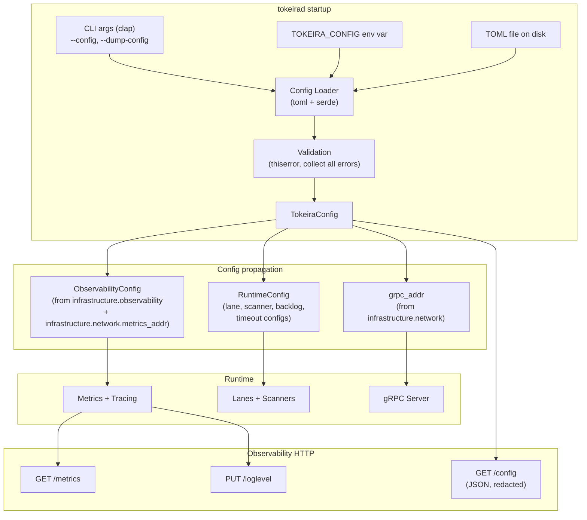

# Design Document: Configuration Foundation

## Overview

This design establishes a unified TOML-based configuration system for `tokeirad`, replacing the current patchwork of environment variables (`ObservabilityConfig::from_env()` with 8 env vars, `grpc_addr_from_env()` with 1 env var), hardcoded `Default` constructor parameters (6 config structs passed individually to `TokeiraRuntime::new_with_nexus_and_versioning()`), and the empty `AppConfig` struct in `config.rs`.

The system introduces a single `TokeiraConfig` struct deserialized from a TOML file at startup. It is organized into four configuration classes — Infrastructure, Policy, Capacity, and Emergency. Every field has a sensible default so that zero-config startup works for local development.

Key design decisions:

- **Single source of truth**: One TOML file, located via `--config` CLI arg or `TOKEIRA_CONFIG` env var. No other env vars influence behavior.
- **Strict deserialization**: Unknown TOML keys are rejected via `serde(deny_unknown_fields)` to catch typos.
- **Subsystems receive config slices at construction**: No global statics, no env var reads. Each subsystem gets its typed config struct passed in.
- **Effective config endpoint**: `GET /config` on the observability HTTP server returns the resolved config as JSON with sensitive fields redacted.
- **`--dump-config`**: Prints resolved TOML to stdout and exits, for pre-flight verification.
- **No deployment concerns**: This spec covers only `tokeirad` server runtime configuration. No `[deploy]`, `[security]`, `[observability_stack]`, no profile merge, no compose generation.

## Architecture



### Config resolution order

1. Parse CLI args with `clap` (`--config <path>`, `--dump-config`).
2. If `--config` not provided, check `TOKEIRA_CONFIG` env var.
3. If neither, use `TokeiraConfig::default()` (zero-config startup).
4. If a config path is found, read and parse the TOML file.
5. Deserialize into `TokeiraConfig` (with `deny_unknown_fields`).
6. Validate cross-field constraints (collect all errors).
7. If `--dump-config`, serialize resolved config to TOML, print to stdout, exit.
8. Otherwise, extract subsystem config slices and pass to constructors.

### Crate boundaries

- **`tokeirad`** (binary) owns: `TokeiraConfig` struct, config loading, CLI parsing, validation, `GET /config` endpoint. The `TokeiraConfig` lives in `apps/tokeirad/src/config.rs`, replacing the empty `AppConfig`.
- **`tokeira-runtime`** keeps its existing config structs (`LaneConfig`, `TimerScannerConfig`, etc.) unchanged. A new `RuntimeConfig` aggregates them. The runtime crate has no dependency on TOML or the config file — it receives `RuntimeConfig` at construction.
- **`tokeira-kernel`** remains pure — no config dependency.

## Components and Interfaces

### TokeiraConfig (top-level)

```rust
use serde::{Deserialize, Serialize};

#[derive(Clone, Debug, PartialEq, Serialize, Deserialize)]
#[serde(deny_unknown_fields)]
pub struct TokeiraConfig {
    #[serde(default)]
    pub infrastructure: InfrastructureConfig,
    #[serde(default)]
    pub policy: PolicyConfig,
    #[serde(default)]
    pub capacity: CapacityConfig,
    #[serde(default)]
    pub emergency: EmergencyConfig,
}
```

### InfrastructureConfig

```rust
#[derive(Clone, Debug, PartialEq, Serialize, Deserialize)]
#[serde(deny_unknown_fields)]
pub struct InfrastructureConfig {
    #[serde(default = "default_cluster_name")]
    pub cluster_name: String,           // "tokeira-local"
    #[serde(default = "default_region")]
    pub region: String,                 // "us-east-1"
    #[serde(default)]
    pub dsql: DsqlInfraConfig,
    #[serde(default)]
    pub network: NetworkConfig,
    #[serde(default)]
    pub observability: ObservabilityConfig,
}

#[derive(Clone, Debug, PartialEq, Serialize, Deserialize)]
#[serde(deny_unknown_fields)]
pub struct DsqlInfraConfig {
    #[serde(default)]
    pub endpoint: Option<String>,       // None → metadata for deployment tooling; storage selection wired by dsql-storage-implementation spec
}

#[derive(Clone, Debug, PartialEq, Serialize, Deserialize)]
#[serde(deny_unknown_fields)]
pub struct NetworkConfig {
    #[serde(default = "default_grpc_addr")]
    pub grpc_addr: String,              // "[::1]:7233"
    #[serde(default = "default_metrics_addr")]
    pub metrics_addr: String,           // "0.0.0.0:9090"
}

#[derive(Clone, Debug, PartialEq, Serialize, Deserialize)]
#[serde(deny_unknown_fields)]
pub struct ObservabilityConfig {
    #[serde(default = "default_true")]
    pub metrics_enabled: bool,          // true
    #[serde(default)]
    pub otlp_enabled: bool,             // false
    #[serde(default = "default_otlp_endpoint")]
    pub otlp_endpoint: String,          // "http://localhost:4317"
    #[serde(default = "default_otlp_protocol")]
    pub otlp_protocol: OtlpProtocol,    // grpc
    #[serde(default = "default_sample_rate")]
    pub trace_sample_rate: f64,         // 1.0
    #[serde(default = "default_log_format")]
    pub log_format: LogFormatConfig,    // text
    #[serde(default = "default_log_filter")]
    pub log_filter: String,             // "info"
}

#[derive(Clone, Debug, PartialEq, Eq, Serialize, Deserialize)]
#[serde(rename_all = "lowercase")]
pub enum OtlpProtocol { Grpc, Http }

#[derive(Clone, Debug, PartialEq, Eq, Serialize, Deserialize)]
#[serde(rename_all = "lowercase")]
pub enum LogFormatConfig { Text, Json }
```

### PolicyConfig

```rust
#[derive(Clone, Debug, PartialEq, Serialize, Deserialize)]
#[serde(deny_unknown_fields)]
pub struct PolicyConfig {
    #[serde(default = "default_retention_days")]
    pub default_retention_days: u32,        // 30
    #[serde(default)]
    pub namespace_creation: NamespaceCreationPolicy, // open
    #[serde(default)]
    pub quotas: QuotasConfig,
}

#[derive(Clone, Debug, Default, PartialEq, Eq, Serialize, Deserialize)]
#[serde(rename_all = "lowercase")]
pub enum NamespaceCreationPolicy { #[default] Open, Controlled }

#[derive(Clone, Debug, PartialEq, Serialize, Deserialize)]
#[serde(deny_unknown_fields)]
pub struct QuotasConfig {
    #[serde(default = "default_max_workflow_timeout")]
    pub max_workflow_timeout_seconds: u64,   // 315_360_000 (10 years)
    #[serde(default = "default_max_signal_payload")]
    pub max_signal_payload_bytes: u32,       // 4_194_304 (4 MiB)
}
```

### CapacityConfig

```rust
#[derive(Clone, Debug, PartialEq, Serialize, Deserialize)]
#[serde(deny_unknown_fields)]
pub struct CapacityConfig {
    #[serde(default)]
    pub performance: PerformanceConfig,
    #[serde(default)]
    pub dsql: DsqlCapacityConfig,
}

#[derive(Clone, Debug, PartialEq, Serialize, Deserialize)]
#[serde(deny_unknown_fields)]
pub struct PerformanceConfig {
    #[serde(default = "default_target_wf_starts")]
    pub target_workflow_starts_per_second: u32,  // 1000
    #[serde(default = "default_target_p99")]
    pub target_p99_wft_latency_ms: u32,          // 50
}

#[derive(Clone, Debug, PartialEq, Serialize, Deserialize)]
#[serde(deny_unknown_fields)]
pub struct DsqlCapacityConfig {
    #[serde(default = "default_max_connections")]
    pub max_connections: u32,               // 10_000
    #[serde(default = "default_conn_rate")]
    pub connection_rate_per_second: u32,    // 100
    #[serde(default = "default_burst")]
    pub burst_capacity: u32,               // 1_000
}
```

### EmergencyConfig

```rust
#[derive(Clone, Debug, Default, PartialEq, Serialize, Deserialize)]
#[serde(deny_unknown_fields)]
pub struct EmergencyConfig {
    #[serde(default)]
    pub disable_stickiness: bool,       // false
    #[serde(default)]
    pub freeze_projection: bool,        // false
    #[serde(default)]
    pub cap_poll_admission: Option<u32>, // None
}
```

### Config Loader

```rust
use std::path::Path;
use thiserror::Error;

#[derive(Debug, Error)]
pub enum ConfigError {
    #[error("failed to read config file: {0}")]
    Io(#[from] std::io::Error),
    #[error("failed to parse TOML: {0}")]
    Parse(#[from] toml::de::Error),
    #[error("config validation failed:\n{}", .0.iter().map(|e| format!("  - {e}")).collect::<Vec<_>>().join("\n"))]
    Validation(Vec<ValidationError>),
}

#[derive(Clone, Debug, Error)]
pub enum ValidationError {
    #[error("{field}: {message}")]
    Field { field: String, message: String },
}

impl TokeiraConfig {
    /// Load from a TOML file path.
    pub fn load(path: &Path) -> Result<Self, ConfigError> {
        let content = std::fs::read_to_string(path)?;
        let config: TokeiraConfig = toml::from_str(&content)?;
        config.validate()?;
        Ok(config)
    }

    /// Resolve config from CLI args and env var.
    /// Returns (config, source_description).
    pub fn resolve(
        config_path: Option<&Path>,
    ) -> Result<(Self, &'static str), ConfigError> {
        if let Some(path) = config_path {
            return Ok((Self::load(path)?, "cli --config"));
        }
        if let Ok(env_path) = std::env::var("TOKEIRA_CONFIG") {
            return Ok((Self::load(Path::new(&env_path))?, "TOKEIRA_CONFIG env"));
        }
        Ok((Self::default(), "defaults"))
    }

    /// Validate cross-field constraints. Collects all errors.
    pub fn validate(&self) -> Result<(), ConfigError> {
        let mut errors = Vec::new();

        // Retention days bounds
        let days = self.policy.default_retention_days;
        if days < 1 || days > 36500 {
            errors.push(ValidationError::Field {
                field: "policy.default_retention_days".into(),
                message: format!("must be between 1 and 36500, got {days}"),
            });
        }

        // Positive performance targets
        if self.capacity.performance.target_workflow_starts_per_second == 0 {
            errors.push(ValidationError::Field {
                field: "capacity.performance.target_workflow_starts_per_second".into(),
                message: "must be positive".into(),
            });
        }
        if self.capacity.performance.target_p99_wft_latency_ms == 0 {
            errors.push(ValidationError::Field {
                field: "capacity.performance.target_p99_wft_latency_ms".into(),
                message: "must be positive".into(),
            });
        }

        // Trace sample rate bounds
        let rate = self.infrastructure.observability.trace_sample_rate;
        if !(0.0..=1.0).contains(&rate) {
            errors.push(ValidationError::Field {
                field: "infrastructure.observability.trace_sample_rate".into(),
                message: format!("must be between 0.0 and 1.0, got {rate}"),
            });
        }

        // Socket address parseability
        if self.infrastructure.network.grpc_addr.parse::<std::net::SocketAddr>().is_err() {
            errors.push(ValidationError::Field {
                field: "infrastructure.network.grpc_addr".into(),
                message: format!(
                    "not a valid socket address: {:?}",
                    self.infrastructure.network.grpc_addr
                ),
            });
        }
        if self.infrastructure.network.metrics_addr.parse::<std::net::SocketAddr>().is_err() {
            errors.push(ValidationError::Field {
                field: "infrastructure.network.metrics_addr".into(),
                message: format!(
                    "not a valid socket address: {:?}",
                    self.infrastructure.network.metrics_addr
                ),
            });
        }

        if errors.is_empty() {
            Ok(())
        } else {
            Err(ConfigError::Validation(errors))
        }
    }

    /// Serialize to TOML for --dump-config.
    pub fn to_toml(&self) -> Result<String, toml::ser::Error> {
        toml::to_string_pretty(self)
    }

    /// Convert to JSON for the /config endpoint, with sensitive fields redacted.
    pub fn to_redacted_json(&self) -> serde_json::Value {
        let mut json = serde_json::to_value(self).expect("TokeiraConfig is serializable");
        redact_sensitive_fields(&mut json);

        // Append _warnings for active emergency overrides
        let warnings = self.emergency_warnings();
        if !warnings.is_empty() {
            if let serde_json::Value::Object(ref mut map) = json {
                map.insert(
                    "_warnings".to_string(),
                    serde_json::Value::Array(
                        warnings.into_iter().map(serde_json::Value::String).collect(),
                    ),
                );
            }
        }
        json
    }

    /// List active emergency override warnings.
    pub fn emergency_warnings(&self) -> Vec<String> {
        let mut warnings = Vec::new();
        if self.emergency.disable_stickiness {
            warnings.push("emergency override active: disable_stickiness = true".into());
        }
        if self.emergency.freeze_projection {
            warnings.push("emergency override active: freeze_projection = true".into());
        }
        if let Some(cap) = self.emergency.cap_poll_admission {
            warnings.push(format!("emergency override active: cap_poll_admission = {cap}"));
        }
        warnings
    }
}

/// Redact fields whose key contains "endpoint" or "arn".
/// Listener addresses (grpc_addr, metrics_addr) are NOT redacted.
fn redact_sensitive_fields(value: &mut serde_json::Value) {
    match value {
        serde_json::Value::Object(map) => {
            for (key, val) in map.iter_mut() {
                let key_lower = key.to_lowercase();
                if key_lower.contains("endpoint")
                    || key_lower.contains("arn")
                {
                    if !val.is_null() {
                        *val = serde_json::Value::String("[redacted]".to_string());
                    }
                } else {
                    redact_sensitive_fields(val);
                }
            }
        }
        serde_json::Value::Array(arr) => {
            for item in arr.iter_mut() {
                redact_sensitive_fields(item);
            }
        }
        _ => {}
    }
}
```

### CLI Interface (clap)

```rust
use std::path::PathBuf;

#[derive(clap::Parser)]
#[command(name = "tokeirad")]
pub struct Cli {
    /// Path to the TOML configuration file.
    #[arg(long)]
    config: Option<PathBuf>,

    /// Print resolved configuration as TOML and exit.
    #[arg(long)]
    dump_config: bool,
}
```

### RuntimeConfig (aggregation in tokeira-runtime)

```rust
/// Aggregates all runtime-internal config structs.
/// Lives in tokeira-runtime, no TOML dependency.
pub struct RuntimeConfig {
    pub lane_count: usize,
    pub lane: LaneConfig,
    pub timer_scanner: TimerScannerConfig,
    pub workflow_timeout_scanner: WorkflowTimeoutScannerConfig,
    pub backlog: BacklogConfig,
    pub activity_timeout_scanner: ActivityTimeoutScannerConfig,
    pub nexus_timeout_scanner: NexusTimeoutScannerConfig,
}

impl Default for RuntimeConfig {
    fn default() -> Self {
        Self {
            lane_count: 4,
            lane: LaneConfig::default(),
            timer_scanner: TimerScannerConfig::default(),
            workflow_timeout_scanner: WorkflowTimeoutScannerConfig::default(),
            backlog: BacklogConfig::default(),
            activity_timeout_scanner: ActivityTimeoutScannerConfig::default(),
            nexus_timeout_scanner: NexusTimeoutScannerConfig::default(),
        }
    }
}
```

`tokeirad` constructs `RuntimeConfig::default()` alongside the parsed `TokeiraConfig` and passes it to `TokeiraRuntime`. Runtime fields are not derived from TOML in this MVP — they are mechanical settings owned by auto-tune. The existing individual config structs remain unchanged.

### Effective Config Endpoint

Added to the existing observability HTTP server handler in `handle_observability()`:

```
GET /config → 200 OK, application/json
```

Response body: JSON representation of `TokeiraConfig` with:
- All defaults resolved
- Sensitive fields (keys containing `endpoint` or `arn`) replaced with `"[redacted]"`. Listener addresses (`grpc_addr`, `metrics_addr`) are NOT redacted.
- A `_warnings` array listing active emergency overrides (only present when overrides are active)

The handler receives an `Arc<TokeiraConfig>` stored alongside the existing `ObservabilityServerState`.

### Emergency Override Warnings

At startup, after loading config, the loader iterates over `EmergencyConfig` fields. For each non-default value, it emits a `tracing::warn!`:

```
WARN emergency override active: disable_stickiness = true
WARN emergency override active: cap_poll_admission = 500
```

### Validation Rules

| Rule | Fields | Error |
|------|--------|-------|
| Retention bounds | `policy.default_retention_days` ∈ [1, 36500] | `"must be between 1 and 36500, got {value}"` |
| Positive targets | `capacity.performance.target_workflow_starts_per_second` > 0 | `"must be positive"` |
| Positive targets | `capacity.performance.target_p99_wft_latency_ms` > 0 | `"must be positive"` |
| Sample rate bounds | `infrastructure.observability.trace_sample_rate` ∈ [0.0, 1.0] | `"must be between 0.0 and 1.0, got {value}"` |
| Socket address | `infrastructure.network.grpc_addr` parseable as `SocketAddr` | `"not a valid socket address: {value}"` |
| Socket address | `infrastructure.network.metrics_addr` parseable as `SocketAddr` | `"not a valid socket address: {value}"` |

All validation errors are collected and returned together.

## Data Models

### TOML Schema (illustrative complete file)

```toml
[infrastructure]
cluster_name = "tokeira-prod-eu-west-1"
region = "eu-west-1"

[infrastructure.dsql]
endpoint = "cluster-xyz.dsql.eu-west-1.on.aws"

[infrastructure.network]
grpc_addr = "[::]:7233"
metrics_addr = "0.0.0.0:9090"

[infrastructure.observability]
metrics_enabled = true
otlp_enabled = true
otlp_endpoint = "http://tempo:4317"
otlp_protocol = "grpc"
trace_sample_rate = 0.1
log_format = "json"
log_filter = "info,tokeira_runtime=debug"

[policy]
default_retention_days = 30
namespace_creation = "controlled"

[policy.quotas]
max_workflow_timeout_seconds = 315360000
max_signal_payload_bytes = 4194304

[capacity.performance]
target_workflow_starts_per_second = 5000
target_p99_wft_latency_ms = 25

[capacity.dsql]
max_connections = 10000
connection_rate_per_second = 100
burst_capacity = 1000

[emergency]
# Break-glass only — uncomment during incidents
# disable_stickiness = true
# freeze_projection = true
# cap_poll_admission = 500
```

### Default Values Summary

| Field | Default | Source |
|-------|---------|--------|
| `infrastructure.cluster_name` | `"tokeira-local"` | New |
| `infrastructure.region` | `"us-east-1"` | New |
| `infrastructure.dsql.endpoint` | `None` | Metadata for deployment tooling |
| `infrastructure.network.grpc_addr` | `"[::1]:7233"` | Currently `TOKEIRA_GRPC_ADDR` default |
| `infrastructure.network.metrics_addr` | `"0.0.0.0:9090"` | Currently `TOKEIRA_METRICS_ADDR` default |
| `infrastructure.observability.metrics_enabled` | `true` | Currently `TOKEIRA_METRICS_ENABLED` default |
| `infrastructure.observability.otlp_enabled` | `false` | Currently `TOKEIRA_OTLP_ENABLED` default |
| `infrastructure.observability.otlp_endpoint` | `"http://localhost:4317"` | Currently `TOKEIRA_OTLP_ENDPOINT` default |
| `infrastructure.observability.otlp_protocol` | `grpc` | Currently `TOKEIRA_OTLP_PROTOCOL` default |
| `infrastructure.observability.trace_sample_rate` | `1.0` | Currently `TOKEIRA_TRACE_SAMPLE_RATE` default |
| `infrastructure.observability.log_format` | `text` | Currently `TOKEIRA_LOG_FORMAT` default |
| `infrastructure.observability.log_filter` | `"info"` | Currently `RUST_LOG` default |
| `policy.default_retention_days` | `30` | New |
| `policy.namespace_creation` | `open` | New |
| `policy.quotas.max_workflow_timeout_seconds` | `315_360_000` | New (10 years) |
| `policy.quotas.max_signal_payload_bytes` | `4_194_304` | New (4 MiB) |
| `capacity.performance.target_workflow_starts_per_second` | `1000` | New |
| `capacity.performance.target_p99_wft_latency_ms` | `50` | New |
| `capacity.dsql.max_connections` | `10_000` | DSQL cluster default |
| `capacity.dsql.connection_rate_per_second` | `100` | DSQL sustained rate |
| `capacity.dsql.burst_capacity` | `1_000` | DSQL burst capacity |
| `emergency.disable_stickiness` | `false` | New |
| `emergency.freeze_projection` | `false` | New |
| `emergency.cap_poll_admission` | `None` | New |

### Existing Runtime Config Struct Defaults (preserved, not exposed in TOML)

These runtime-internal defaults are bundled into `RuntimeConfig::default()` but not surfaced in the TOML schema. They are mechanical settings that auto-tune will eventually own.

| Struct | Field | Default |
|--------|-------|---------|
| `RuntimeConfig` | `lane_count` | `4` |
| `LaneConfig` | `max_occ_retries` | `5` |
| `LaneConfig` | `max_drain_per_activation` | `16` |
| `TimerScannerConfig` | `scan_interval` | `200ms` |
| `TimerScannerConfig` | `max_timers_per_scan` | `100` |
| `WorkflowTimeoutScannerConfig` | `scan_interval` | `1s` |
| `WorkflowTimeoutScannerConfig` | `max_timeouts_per_scan` | `100` |
| `BacklogConfig` | `workflow_grace_window` | `5s` |
| `BacklogConfig` | `activity_grace_window` | `5s` |
| `BacklogConfig` | `grace_scan_interval` | `1s` |
| `BacklogConfig` | `drain_interval` | `2s` |
| `BacklogConfig` | `drain_batch_limit` | `100` |
| `ActivityTimeoutScannerConfig` | `scan_interval` | `1s` |
| `ActivityTimeoutScannerConfig` | `max_timeouts_per_scan` | `100` |
| `NexusTimeoutScannerConfig` | `scan_interval` | `1s` |
| `NexusTimeoutScannerConfig` | `max_timeouts_per_scan` | `100` |

## Correctness Properties

*A property is a characteristic or behavior that should hold true across all valid executions of a system — essentially, a formal statement about what the system should do. Properties serve as the bridge between human-readable specifications and machine-verifiable correctness guarantees.*

### Property 1: TOML serialization round-trip

*For any* valid `TokeiraConfig` value, serializing it to TOML with `toml::to_string_pretty` and then deserializing the resulting string back with `toml::from_str` SHALL produce a `TokeiraConfig` that is equal to the original.

**Validates: Requirements 1.7.6**

### Property 2: Unknown fields rejection

*For any* valid TOML representation of a `TokeiraConfig` with an additional unknown key injected at any nesting level, deserialization SHALL fail with an error.

**Validates: Requirements 1.2.4, 1.7.3**

### Property 3: Retention days bounds validation

*For any* `u32` value assigned to `policy.default_retention_days`, calling `validate()` SHALL return an error if and only if the value is outside the range [1, 36500].

**Validates: Requirements 1.8.3**

### Property 4: Positive integer field validation

*For any* `u32` value assigned to `capacity.performance.target_workflow_starts_per_second` or `capacity.performance.target_p99_wft_latency_ms`, calling `validate()` SHALL return an error if and only if the value is 0.

**Validates: Requirements 1.8.4, 1.8.5**

### Property 5: Trace sample rate bounds validation

*For any* `f64` value assigned to `infrastructure.observability.trace_sample_rate`, calling `validate()` SHALL return an error if and only if the value is outside the range [0.0, 1.0].

**Validates: Requirements 1.8.6**

### Property 6: Validation error collection

*For any* `TokeiraConfig` with N distinct validation violations (where N > 1), calling `validate()` SHALL return exactly N errors, one for each violated constraint.

**Validates: Requirements 1.8.2**

### Property 7: Sensitive field redaction

*For any* `TokeiraConfig` with non-`None` values for fields whose key contains `endpoint` or `arn`, calling `to_redacted_json()` SHALL produce a JSON value where those fields contain `"[redacted]"` instead of the original values. Listener addresses (`grpc_addr`, `metrics_addr`) SHALL NOT be redacted.

**Validates: Requirements 3.1.3**

### Property 8: Emergency warnings in /config response

*For any* `TokeiraConfig` where at least one `EmergencyConfig` field has a non-default value, calling `to_redacted_json()` SHALL produce a JSON value containing a `_warnings` array with one entry per active override. Conversely, *for any* `TokeiraConfig` with all-default emergency fields, the `_warnings` key SHALL be absent.

**Validates: Requirements 3.1.4**

## Error Handling

### Config loading errors

| Error | Cause | Behavior |
|-------|-------|----------|
| `ConfigError::Io` | File not found or unreadable | Print error to stderr, exit with code 1 |
| `ConfigError::Parse` | Invalid TOML syntax, wrong types, unknown fields | Print error to stderr, exit with code 1 |
| `ConfigError::Validation` | Cross-field constraint violations | Print all errors to stderr, exit with code 1 |

All config errors are surfaced before the server starts any listeners or background tasks. The `--dump-config` flag follows the same error path: validation errors go to stderr with non-zero exit.

### Emergency override warnings

Emergency overrides are not errors — they are warnings logged at startup via `tracing::warn!`. The server starts normally with overrides active.

## Testing Strategy

### Property-based tests (proptest, minimum 100 iterations each)

Property-based tests use `proptest` with `ProptestConfig::with_cases(100)` minimum. Each test references its design property.

| Property | Test approach |
|----------|--------------|
| P1: TOML round-trip | Generate arbitrary `TokeiraConfig` via proptest `Arbitrary` impl, serialize to TOML, deserialize back, assert equality |
| P2: Unknown fields | Generate valid TOML + random unknown key name, attempt deserialization, assert error |
| P3: Retention bounds | Generate random `u32`, set as `default_retention_days`, validate, assert error iff outside [1, 36500] |
| P4: Positive integers | Generate random `u32` for each positive-required field, validate, assert error iff 0 |
| P5: Sample rate bounds | Generate random `f64`, set as `trace_sample_rate`, validate, assert error iff outside [0.0, 1.0] |
| P6: Error collection | Generate configs with 2+ known violations, validate, assert error count matches violation count |
| P7: Redaction | Generate config with random sensitive field values, call `to_redacted_json()`, assert no original values appear |
| P8: Emergency warnings | Generate random `EmergencyConfig`, call `to_redacted_json()`, assert `_warnings` presence/absence matches override state |

### Unit tests (example-based)

| Test | What it verifies |
|------|-----------------|
| Empty TOML produces valid default config | Req 1.7.2, 1.9.1 |
| Default values match current env var defaults | Req 1.3.5, 1.9.3 |
| `--config` takes precedence over `TOKEIRA_CONFIG` | Req 1.1.3 |
| Zero-config startup with no file and no env var | Req 1.1.4 |
| Wrong type in TOML produces descriptive error | Req 1.7.4 |
| `RuntimeConfig::default()` matches individual struct defaults | Req 2.3.3 |
| `GET /config` returns 200 with JSON | Req 3.1.1, 3.1.2 |
| `--dump-config` with invalid config exits non-zero | Req 1.1.6 |

### Integration tests

| Test | What it verifies |
|------|-----------------|
| `tokeirad --config <valid.toml>` starts and serves gRPC | End-to-end config loading |
| `tokeirad --dump-config` prints TOML to stdout | Req 1.1.5 |
| Observability module receives config from TOML (not env vars) | Req 2.1.1, 2.1.3 |
| `tokeira-kernel` Cargo.toml has no config dependency | Req 2.4.5 |

### Test commands

```bash
cargo clippy --workspace --all-targets  # lint (or `cargo lint` if alias exists in .cargo/config.toml)
cargo +nightly fmt            # format check
cargo test -p tokeirad        # unit + property tests for config module
```
