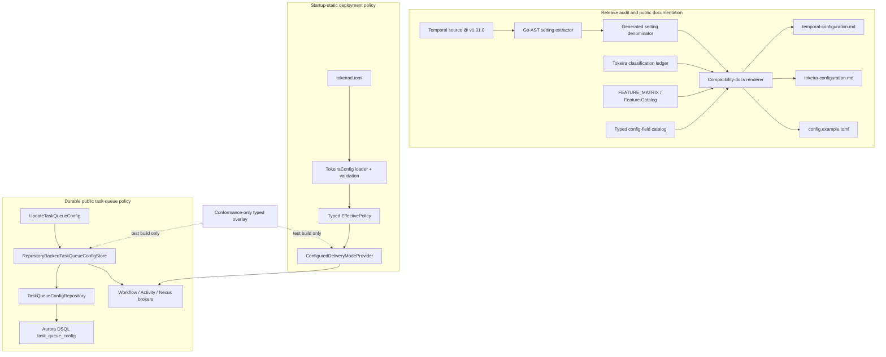

# Design Document: Configuration Policy

## Overview

This design turns Tokeira's close-to-zero-configuration posture into a checked
product contract. It separates four concerns that are currently adjacent but not
governed together:

1. the complete Temporal v1.31.0 configuration denominator;
2. the complete public feature catalog and its operator-visible defaults;
3. typed startup policy and conformance-only policy overlays;
4. durable task-queue policy authored through `UpdateTaskQueueConfig`.

The implementation does not reproduce Temporal's dynamic-configuration service,
selectors, subscriptions, or frontend/history/matching process topology. Temporal
v1.31.0 remains the authority for observable behavior under root `AGENTS.md §8`.
Tokeira resolves that behavior through its own typed configuration, runtime delivery
plane, and DSQL-centered persistence boundaries.

The configuration denominator is derived from production `New*Setting` declarations
throughout the Temporal source tree, not from arbitrary string literals in
`common/dynamicconfig/constants.go`. A source-aware audit at v1.31.0 produces 613
unique declarations: 565 in `common/dynamicconfig/constants.go` and 48 elsewhere,
including `activity.enableStandalone` in `chasm/lib/activity/config.go @ v1.31.0`.

The existing `FEATURE_MATRIX` already proves exact ownership of every vendored
WorkflowService and OperatorService RPC against the vendored service definitions.
This design preserves that totality check and enriches each feature with the
information missing for public release: origin, Temporal maturity, conformance
disposition, Temporal and Tokeira defaults, enablement mechanism, scope, mutability,
operator guidance, and prerequisites. The audit also covers non-RPC compatibility
surfaces and Tokeira-native public extensions.

The public documentation is reduced to settled truth. Long-form research and owner
deliberation move intact to the `reference/` directory of their owning specs. The
v1.31.0 conformance folder retains a small authoritative set:

- `README.md`;
- `supported.md`;
- `excluded.md`;
- `temporal-configuration.md`;
- `tokeira-configuration.md`;
- a release conformance report when one is published.

## Dependencies and Non-Goals

### Owning relationships

- `.kiro/specs/configuration-foundation/` owns strict TOML loading, zero-config
  startup, effective-config output, and the top-level `TokeiraConfig` shape.
- `.kiro/specs/task-queue-priority-fairness/` owns priority normalization, User
  Fairness behavior, rate shaping, `UpdateTaskQueueConfig` validation, and dispatch
  effects. This design supplies production enablement and durable storage.
- `.kiro/specs/conformance-config-override/` owns scoped test transport,
  `KEY_CLASSIFICATION`, and production-build isolation.
- `.kiro/specs/temporal-compatibility-surface/` owns `FEATURE_MATRIX`, compatibility
  coverage resolution, and the exact vendored-RPC ownership check.
- `.kiro/specs/authorization-foundation/` owns authentication, authorization, JWT
  issuer routing, and the AWS IAM bearer extension.
- `.kiro/specs/worker-deployments/` owns GA Worker Deployments and the stock-default
  treatment of deprecated Worker Versioning V1/V2.
- `tokeira-config` owns the production configuration schema and typed validation.
- `tokeira-compatibility` owns pure compatibility and feature-catalog metadata.
- `tokeira-runtime` owns delivery-mode resolution and the live task-queue-policy
  facade.
- `tokeira-storage` owns in-memory and DSQL persistence mechanisms.
- `tokeira-edge` remains a thin translator and maps repository/validation failures
  to public gRPC statuses.

### Non-goals

- No generic Temporal-compatible dynamic-config loader, selector hierarchy,
  percentage rollout, subscription, or hot-reload mechanism.
- No production input accepting arbitrary Temporal dynamic-config keys.
- No TOML exposure of `RuntimeConfig` mechanical controls.
- No duplicate TOML controls for queue rates or fairness-weight overrides owned by
  `UpdateTaskQueueConfig`.
- No configuration lookup, storage access, async work, metrics, scheduler state, or
  retained policy state in `tokeira-kernel`.
- No use of task-queue configuration as authority for workflow correctness.
- No claim that a functional test campaign alone proves product-feature
  completeness.
- No deletion of historical decision rationale when public documentation is
  reorganized.
- No dependency on a Temporal source checkout at normal build, test, or runtime.

## Architecture

There are three independent paths: release-audit/documentation, startup deployment
policy, and live public task-queue policy.



### Policy resolution

Production policy is resolved through typed values:

```text
release-pinned default
    → typed startup deployment policy
    → durable public API policy, where that API owns the scope
    → emergency restriction, where defined
```

A conformance build may overlay a wired value at the exact live consult site. That
overlay is not a production source and never changes the persisted production
configuration. Mechanical controllers remain outside behavioral-policy precedence.

For task-queue delivery:

```text
priority_enabled = true
fairness_enabled = policy.task_queues.enable_fairness  # default false
auto_enable = false
```

The conformance adapter may override the three existing matching keys. Coherence is
preserved: enabling User Fairness also enables priority-aware delivery. Sticky queues
remain fairness-disabled.

### Durable task-queue policy

`UpdateTaskQueueConfig` is a public live-policy API, not a workflow transition. Its
record is stored independently from run history, keyed by namespace, queue name, and
task kind. The runtime validates a patch, loads the current record, applies the patch
to a candidate, and conditionally commits the complete candidate under a monotonically
increasing revision. On conflict it reloads and reapplies the patch; it never silently
overwrites a newer record.

The DSQL row is the durable source. A runtime cache is a read optimization only:

- startup hydration loads every stored record before the server accepts polls;
- a successful local update refreshes the cache and wakes affected pollers;
- bounded refresh makes updates written through another process visible;
- a missing record means the public API's unset/default behavior;
- cache loss never loses policy because it can be reconstructed from the repository.

Task handout may temporarily use the last successfully loaded revision during a
transient refresh failure, but a server with no known value must not fabricate a
configured value. This mirrors the best-effort propagation of v1.31.0 task-queue user
data while preserving a durable committed source.

## Components and Interfaces

### 1. Source-aware Temporal setting extractor

New maintenance tool:

- `tools/temporal-config-audit/main.go`

The tool uses only the Go standard library. It reads a requested Git tag from the
local Temporal reference checkout using `git archive`, parses non-test `.go` files
with `go/parser`, and visits `ast.CallExpr` nodes. It accepts production constructor
calls whose callee is a `New*Setting` function and whose first argument is a string
literal. It records:

```go
type SettingDeclaration struct {
    Key               string `json:"key"`
    Constructor       string `json:"constructor"`
    Scope             string `json:"scope"`
    ValueKind         string `json:"value_kind"`
    DefaultExpression string `json:"default_expression"`
    Source            string `json:"source"`
}
```

Constructor names provide scope and value-kind metadata. The default expression is
rendered from the AST without evaluating application code. Duplicate setting keys,
non-literal keys, or an unrecognized constructor fail extraction with source anchors.
The output is sorted by key and written to:

- `crates/tokeira-compatibility/data/temporal-v1.31.0-settings.json`

Normal Cargo builds consume the checked snapshot and never require the Temporal
checkout or Go toolchain. Maintainers rerun the extractor when the compatibility pin
changes or the audited denominator is challenged.

### 2. Configuration classification ledger

New checked data:

- `crates/tokeira-compatibility/data/temporal-v1.31.0-classification.json`
- `crates/tokeira-compatibility/src/configuration.rs`

Source declarations and Tokeira classifications remain separate so rerunning the
extractor cannot erase owner decisions. The classification file supplies:

```rust
#[derive(Clone, Debug, Deserialize, PartialEq, Eq)]
pub struct ConfigurationClassification {
    pub temporal_key: String,
    pub temporal_default: String,
    pub temporal_scope: TemporalConfigScope,
    pub disposition: ConfigurationDisposition,
    pub tokeira_treatment: String,
    pub owner: String,
    pub conformance_override: ConformanceOverrideDisposition,
    pub evidence: Vec<String>,
}
```

`configuration.rs` contains pure validation and join logic:

```rust
pub fn verify_configuration_ledger(
    declarations: &[SettingDeclaration],
    classifications: &[ConfigurationClassification],
    conformance_keys: &[ConformanceKey],
) -> Result<VerifiedConfigurationLedger, ConfigurationLedgerError>;
```

The verifier enforces exact key-set equality, uniqueness, recognized scope and
disposition values, non-empty owners/treatments/evidence, and agreement with
`tokeira-conformance::KEY_CLASSIFICATION`. Because the conformance crate must remain
optional in production, the cross-check is a test/dev-tool dependency rather than a
runtime dependency.

Relevant static groups from `common/config/config.go @ v1.31.0` are represented in a
second collection using the same disposition vocabulary. They are rendered separately
from dynamic settings because their topology and ownership differ.

### 3. Enriched Feature Catalog

Files:

- `crates/tokeira-compatibility/src/feature.rs`
- `crates/tokeira-compatibility/src/matrix.rs`
- `crates/tokeira-compatibility/src/digest.rs`
- compatibility CLI/service projections that expose `FeatureEntry`

`FEATURE_MATRIX` remains the single canonical catalog. The existing fields and
dispatch meaning remain intact; metadata is added rather than introducing a parallel
feature list:

```rust
#[derive(Clone, Copy, Debug, PartialEq, Eq, Serialize)]
pub enum FeatureOrigin {
    TemporalV1_31,
    NewerVendoredWire,
    TokeiraNative,
}

#[derive(Clone, Copy, Debug, PartialEq, Eq, Serialize)]
pub enum ConformanceDisposition {
    InSurface,
    OutOfSurface,
    NotApplicable,
}

#[derive(Clone, Copy, Debug, PartialEq, Eq, Serialize)]
pub enum TemporalMaturity {
    GeneralAvailability,
    PublicPreview,
    Experimental,
    Deprecated,
    Internal,
    Absent,
    NotApplicable,
}

#[derive(Clone, Copy, Debug, PartialEq, Eq, Serialize)]
pub enum DefaultPosture {
    Enabled,
    Disabled,
    Conditional,
    Unavailable,
    NotApplicable,
}

#[derive(Clone, Copy, Debug, PartialEq, Eq, Serialize)]
pub enum EnablementKind {
    None,
    Toml,
    PublicApi,
    Automatic,
    ConformanceOnly,
    Unavailable,
}

#[derive(Clone, Copy, Debug, PartialEq, Eq, Serialize)]
pub enum PolicyScope {
    Cluster,
    Namespace,
    TaskQueue,
    Workflow,
    Worker,
    Build,
    NotApplicable,
}

#[derive(Clone, Copy, Debug, PartialEq, Eq, Serialize)]
pub enum PolicyMutability {
    Immutable,
    StartupStatic,
    DurableLiveApi,
    Automatic,
    ConformanceOnly,
    NotApplicable,
}

#[derive(Clone, Copy, Debug, PartialEq, Eq, Serialize)]
pub struct FeatureEnablement {
    pub kind: EnablementKind,
    pub reference: Option<&'static str>,
}

pub struct FeatureEntry {
    // existing identity, state, surface, gate, RPC, notes, and evidence fields
    pub origin: FeatureOrigin,
    pub conformance: ConformanceDisposition,
    pub temporal_maturity: TemporalMaturity,
    pub temporal_default: DefaultPosture,
    pub tokeira_default: DefaultPosture,
    pub enablement: FeatureEnablement,
    pub scopes: &'static [PolicyScope],
    pub mutability: PolicyMutability,
    pub guidance: &'static str,
    pub prerequisites: &'static [&'static str],
}
```

The existing `FeatureState` continues to drive dispatch and compatibility coverage.
Public availability is rendered from `FeatureState` plus conformance disposition:

| Catalog combination | Public wording |
|---|---|
| in-surface + `Implemented` | supported |
| in-surface + `Partial` | partially supported |
| `Experimental` | experimental |
| out-of-surface | excluded from the v1.31.0 claim |
| `Stubbed` or `Unsupported` | unavailable |

This avoids changing runtime dispatch semantics merely to obtain better documentation.
The feature digest incorporates every new field so published compatibility metadata
changes whenever catalog truth changes.

The initial audit covers:

- all 129 vendored WorkflowService and OperatorService RPCs;
- the 121 RPCs belonging to the v1.31.0 API target and the 8 newer-wire-only RPCs;
- existing non-RPC matrix surfaces such as response fields, history events,
  capability flags, and HTTP/JSON behavior;
- Tokeira-owned compatibility-service RPCs;
- production feature-bearing configuration fields;
- explicit Tokeira-native extensions, including AWS IAM bearer authorization.

Machine-denominated surfaces have exact totality tests. Conceptual non-RPC product
features receive a manual-review evidence record during the initial audit; the design
does not pretend that an arbitrary concept can be discovered through reflection.

### 4. Production configuration-field catalog

Files:

- `crates/tokeira-config/src/documentation.rs`
- `crates/tokeira-config/src/lib.rs`

The configuration crate exposes documentation metadata adjacent to the schema:

```rust
pub enum ConfigFieldClass {
    StockParity,
    ConfiguredParity,
    TokeiraNative,
    Infrastructure,
    Capacity,
    Emergency,
}

pub struct ConfigFieldDocumentation {
    pub path: &'static str,
    pub class: ConfigFieldClass,
    pub default: &'static str,
    pub required: bool,
    pub restart_required: bool,
    pub feature_id: Option<&'static str>,
    pub guidance: &'static str,
}

pub const CONFIG_FIELD_CATALOG: &[ConfigFieldDocumentation] = &[/* audited fields */];
```

The initial audit accounts for every production field accepted by the strict serde
schema. A test proves unique paths and confirms that a complete annotated fixture
deserializes, validates, round-trips, and covers every catalog path. Default-value
tests compare catalog defaults with `TokeiraConfig::default()`.

The feature adds:

```rust
#[derive(Clone, Debug, Default, PartialEq, Eq, Serialize, Deserialize)]
#[serde(deny_unknown_fields)]
pub struct TaskQueuePolicyConfig {
    /// Opt in to weighted User Fairness. Priority remains enabled regardless.
    #[serde(default)]
    pub enable_fairness: bool,
}

pub struct PolicyConfig {
    // existing fields
    #[serde(default)]
    pub task_queues: TaskQueuePolicyConfig,
}
```

The exact production activation is:

```toml
[policy.task_queues]
enable_fairness = true
```

Absence yields `false`, preserving the Temporal v1.31.0 stock default.

### 5. Typed effective delivery policy

Files:

- `crates/tokeira-runtime/src/task_ordering.rs`
- `crates/tokeira-runtime/src/broker.rs`
- `crates/tokeira-runtime/src/nexus.rs`
- `apps/tokeirad/src/lib.rs`

`StockDeliveryModeProvider` becomes a typed configured provider:

```rust
#[derive(Clone, Copy, Debug)]
pub struct StaticDeliveryPolicy {
    pub enable_fairness: bool,
}

#[derive(Clone, Debug)]
pub struct ConfiguredDeliveryModeProvider {
    policy: StaticDeliveryPolicy,
}

impl DeliveryModeProvider for ConfiguredDeliveryModeProvider {
    fn mode_for(&self, queue: &QueueKey) -> DeliveryMode;
    fn scope_generation(&self) -> u64;
}
```

Production construction passes only
`effective_config.policy.task_queues.enable_fairness`. The provider never receives
raw key strings. In conformance builds, a small adapter applies the three already-wired
matching overrides over the typed baseline at the live consult site and preserves the
existing scope-generation reset.

The provider continues returning:

- priority enabled;
- five bands;
- default priority key 3;
- auto-enable disabled;
- User Fairness equal to the typed startup policy;
- User Fairness disabled for sticky queues at assignment.

No field or provider enters the kernel. The lane router remains independent from task
priority and fairness.

### 6. Durable task-queue configuration repository

Files:

- `crates/tokeira-storage/src/api.rs`
- `crates/tokeira-storage/src/memory.rs`
- `crates/tokeira-storage/src/dsql/task_queue_config.rs`
- `crates/tokeira-storage/src/dsql/codec.rs`
- the next contiguous storage migration (currently
  `crates/tokeira-storage/migrations/V058__task_queue_config.sql`)

Storage owns a dependency-neutral document and CAS interface:

```rust
#[derive(Clone, Copy, Debug, PartialEq, Eq, Serialize, Deserialize)]
pub enum StoredTaskQueueConfigKind {
    Workflow,
    Activity,
    Nexus,
}

#[derive(Clone, Debug, PartialEq, Serialize, Deserialize)]
pub struct StoredTaskQueueConfig {
    pub namespace_id: NamespaceId,
    pub task_queue: TaskQueueName,
    pub kind: StoredTaskQueueConfigKind,
    pub revision: u64,
    pub queue_rate_limit: Option<f32>,
    pub queue_rate_limit_metadata: Option<StoredTaskQueueConfigMetadata>,
    pub fairness_key_rate_limit_default: Option<f32>,
    pub fairness_key_rate_limit_metadata: Option<StoredTaskQueueConfigMetadata>,
    pub fairness_weight_overrides: BTreeMap<String, f32>,
}

#[derive(Clone, Copy, Debug, PartialEq, Eq)]
pub enum TaskQueueConfigCasResult {
    Applied { revision: u64 },
    Conflict,
}

#[async_trait]
pub trait TaskQueueConfigRepository: Send + Sync {
    async fn load_task_queue_config(
        &self,
        key: &StoredTaskQueueConfigKey,
    ) -> anyhow::Result<Option<StoredTaskQueueConfig>>;

    async fn compare_and_swap_task_queue_config(
        &self,
        record: StoredTaskQueueConfig,
        expected_revision: Option<u64>,
    ) -> anyhow::Result<TaskQueueConfigCasResult>;

    async fn list_all_task_queue_configs(
        &self,
    ) -> anyhow::Result<Vec<StoredTaskQueueConfig>>;
}
```

The build-phase DSQL migration creates one table:

```sql
CREATE TABLE task_queue_config (
    namespace_id UUID NOT NULL,
    task_queue TEXT NOT NULL,
    task_kind SMALLINT NOT NULL,
    revision BIGINT NOT NULL,
    record_data BYTEA NOT NULL,
    updated_at TIMESTAMPTZ NOT NULL DEFAULT now(),
    PRIMARY KEY (namespace_id, task_queue, task_kind)
)
```

There is no `ALTER`, no database `CHECK`, and no serial column. Application validation
owns kind and value bounds. DSQL serialization failures normalize to `Conflict`;
other database errors remain repository errors. The in-memory repository implements
the same revision semantics.

### 7. Runtime task-queue policy facade

File:

- `crates/tokeira-runtime/src/task_queue_config.rs`

The existing trait becomes async where storage access is required:

```rust
#[async_trait]
pub trait TaskQueueConfigStore: Send + Sync + 'static {
    async fn get(
        &self,
        key: &TaskQueueConfigKey,
    ) -> Result<Option<TaskQueueConfigEntry>, TaskQueueConfigStoreError>;

    async fn apply(
        &self,
        key: TaskQueueConfigKey,
        patch: TaskQueueConfigPatch,
        max_overrides: usize,
    ) -> Result<TaskQueueConfigEntry, TaskQueueConfigStoreError>;

    async fn list(
        &self,
        namespace_id: &NamespaceId,
    ) -> Result<Vec<TaskQueueConfigEntry>, TaskQueueConfigStoreError>;

    fn changed(&self, key: &TaskQueueConfigKey) -> Arc<Notify>;
}
```

`InMemoryTaskQueueConfigStore` remains available for focused tests.
`RepositoryBackedTaskQueueConfigStore` performs:

1. request validation;
2. load or empty-record construction;
3. pure patch application;
4. result validation;
5. repository CAS;
6. reload/reapply on conflict;
7. cache publication and poller notification after commit.

Validation failure leaves both repository and cache unchanged. The store exposes
`hydrate()` so `tokeirad` loads all records before serving. Broker call sites await
configuration before acquiring their ready-queue locks; no storage await occurs while
holding broker locks. A bounded cache refresh interval is internal mechanical policy,
not a TOML field.

### 8. Edge and server wiring

Files:

- `crates/tokeira-edge/src/grpc/workflow_service.rs`
- `crates/tokeira-edge/src/workflow_service.rs`
- `apps/tokeirad/src/lib.rs`

The gRPC handler awaits `TaskQueueConfigStore::apply`. Existing validation errors retain
their v1.31.0-compatible `INVALID_ARGUMENT` messages. Repository failures become an
explicit service-unavailable response rather than success against an uncommitted cache.
The response is projected from the committed record.

`build_and_serve_with_storage` adds a
`TaskQueueConfigRepository` bound. Both in-memory and DSQL profiles construct the same
repository-backed runtime store, hydrate it, and share it with:

- the edge handler;
- the workflow broker;
- the activity broker;
- the Nexus broker.

This preserves one live policy view per server process without introducing a Temporal
matching service.

### 9. Documentation renderer and publication layout

New tool:

- `tools/compatibility-docs/`

The Rust tool depends on `tokeira-compatibility` and `tokeira-config`. It has two
explicit modes:

```text
cargo run -p compatibility-docs -- check
cargo run -p compatibility-docs -- write
```

`check` renders in memory and fails on any difference. `write` updates only the three
owned generated artifacts:

- `docs/conformance/v1.31.0/temporal-configuration.md`;
- `docs/conformance/v1.31.0/tokeira-configuration.md`;
- `config.example.toml`.

The Temporal document contains extraction methodology, pin, complete dynamic-setting
table, static configuration groups, disposition summaries, and architectural
treatment. The Tokeira document contains:

- the behavioral-compatibility and empty-configuration guarantee;
- a quick feature-availability table derived from `FEATURE_MATRIX`;
- exact defaults and enablement instructions;
- every production TOML field with class, default, restart behavior, and guidance;
- public-API-authored live policy such as `UpdateTaskQueueConfig`;
- production versus conformance-only distinctions;
- load-bearing JWT issuer, Nexus callback, and User Fairness warnings.

The example is annotated but parseable. It shows optional blocks without enabling
dangerous or identity-enforcement behavior by default.

The implementation moves deliberation records with `git mv`:

| Current path | Owning-spec destination |
|---|---|
| `docs/conformance/v1.31.0/configuration-policy-proposal.md` | `.kiro/specs/configuration-policy/reference/configuration-policy-proposal.md` |
| `docs/conformance/v1.31.0/authorization.md` | `.kiro/specs/authorization-foundation/reference/v1.31.0-conformance-decision.md` |
| `docs/conformance/v1.31.0/worker-versioning.md` | `.kiro/specs/worker-deployments/reference/v1-v2-conformance-decision.md` |

Because `decisions.md` has no open item, its concise resolved outcomes are folded into
`README.md`, `supported.md`, or `excluded.md`, then the page is removed. All repository
links are rewritten in the same change and checked by offline lychee.

## Data Models

### Configuration classification

The generated declaration is immutable source evidence. The authored classification
is owner policy. They join only by exact Temporal key:

```text
SettingDeclaration.temporal_key
    1:1
ConfigurationClassification.temporal_key
```

An absent, duplicate, or extra classification is invalid. The renderer consumes only
`VerifiedConfigurationLedger`, so incomplete data cannot produce authoritative docs.

### Feature catalog

`FeatureEntry` remains static, serializable metadata. `FeatureState` continues to drive
runtime compatibility dispatch; the new catalog fields drive operator interpretation.
All strings are repository-relative and immutable. No feature-catalog value is read by
the kernel or used as workflow state.

### Deployment task-queue policy

`TaskQueuePolicyConfig` is startup-static and serde-defaulted. It has one field:
`enable_fairness`, default `false`. It does not carry queue names, rates, fairness
keys, weights, or Temporal raw-key aliases.

### Durable task-queue policy

One record covers one `(namespace_id, task_queue, kind)` identity. A complete record is
written atomically, including rate metadata and the complete fairness-weight map.
Revision is repository fencing metadata and is not exposed through the public proto.
The public response continues using `TaskQueueConfig`.

## Correctness Properties

### Property 1: Effective-policy precedence

*For any* supported policy value and any generated combination of release default,
typed deployment value, durable public API value, emergency restriction, and
conformance-only overlay, resolution SHALL equal the specified precedence model;
production resolution SHALL ignore the conformance source entirely.

**Validates: Requirements 1.1–1.8, 3.1–3.10, 7.1–7.9**

### Property 2: Configuration defaulting and round-trip preservation

*For any* valid generated `TokeiraConfig`, TOML serialization followed by strict
deserialization SHALL preserve the value; omission of `policy.task_queues` SHALL
produce `enable_fairness = false`, and adding the new section SHALL preserve every
unrelated effective value.

**Validates: Requirements 4.1–4.3, 4.7–4.11, 9.1–9.4, 12.2**

### Property 3: Source denominator determinism

*For any* permutation of the same valid parsed Temporal setting declarations, the
ledger normalizer SHALL produce an identical sorted unique denominator; declarations
originating from non-setting string literals SHALL be rejected before normalization.

**Validates: Requirements 2.1, 2.5–2.7, 2.9–2.10, 2.13–2.14**

### Property 4: Classification-ledger exactness

*For any* mutation of a complete valid classification ledger by deletion, insertion,
duplication, missing evidence, missing owner, or conformance-disposition change, the
verifier SHALL accept exactly the unchanged complete ledger and reject every invalid
mutation without producing a verified projection.

**Validates: Requirements 2.2–2.12, 7.7–7.8, 12.3**

### Property 5: Feature-catalog surface ownership

*For any* permutation of catalog entries and any mutation that removes, duplicates, or
invents a vendored RPC ownership, the catalog verifier SHALL accept exactly the
complete unique WorkflowService and OperatorService set and preserve its 121 target /
8 newer-wire partition.

**Validates: Requirements 10.1–10.2, 10.11–10.13, 12.11**

### Property 6: Feature availability and guidance coherence

*For any* generated feature record, the catalog verifier SHALL accept it only when
origin, conformance disposition, support state, both defaults, enablement, scope,
mutability, guidance, prerequisites, and evidence form a coherent record; every
available default-disabled feature SHALL have an exact production enablement action.

**Validates: Requirements 10.3–10.10, 10.14–10.15, 12.12**

### Property 7: Deterministic documentation projection

*For any* permutation of a valid configuration ledger, feature catalog, and config
field catalog, rendering SHALL produce byte-identical sorted documentation whose
feature availability/default/enablement cells equal the source catalog.

**Validates: Requirements 2.9–2.11, 10.6–10.10, 11.5–11.13, 11.22**

### Property 8: Task-queue patch state machine

*For any* valid initial task-queue configuration and generated sequence of set/unset
patches, the runtime store SHALL match a pure atomic reference model; every rejected
patch SHALL leave the stored record and cache unchanged, and task kinds SHALL remain
isolated.

**Validates: Requirements 6.1–6.7, 6.9–6.10, 6.12–6.15, 12.4**

### Property 9: Task-queue CAS concurrency

*For any* two or more candidate writes using the same expected revision, the
repository SHALL commit at most one candidate at that revision; retrying rejected
patches against the newly loaded revision SHALL yield a serial ordering with no lost
field or map mutation.

**Validates: Requirements 6.7–6.8, 12.5**

### Property 10: Task-queue codec equivalence

*For any* valid generated task-queue configuration record, encoding and decoding
through the DSQL codec SHALL preserve every key, kind, revision, rate, metadata, and
fairness-weight value, and the in-memory repository SHALL expose equivalent semantics.

**Validates: Requirements 6.6, 6.9–6.11, 12.6**

### Property 11: Restart recovery

*For any* finite sequence of successfully committed task-queue patches, constructing a
fresh repository-backed runtime store and hydrating it SHALL expose exactly the last
committed record to edge reads and subsequent broker decisions without another API
update.

**Validates: Requirements 6.2–6.5, 11.3, 12.7**

### Property 12: Delivery-mode composition

*For any* queue, task metadata, typed fairness policy, and valid conformance overlay,
the delivery provider SHALL preserve five priority bands and default key 3, enable
fairness only through the approved source, make fairness imply priority, disable
fairness for sticky queues, and leave inter-queue drain shares unchanged.

**Validates: Requirements 4.4–4.6, 5.1–5.10, 8.6, 8.8, 12.8–12.10**

### Property 13: Annotated configuration example coverage

*For any* generated valid substitution of scalar values in `config.example.toml`, the
example SHALL remain strictly parseable and every documented production field path
SHALL occur exactly once in the configuration-field catalog.

**Validates: Requirements 9.3–9.4, 11.7–11.21**

## Error Handling

| Condition | Internal error | External result |
|---|---|---|
| Unknown production TOML field | existing `ConfigError::Parse` | startup fails with field context |
| Invalid typed deployment value | existing `ConfigError::Validation` | startup fails with all validation findings |
| Missing/unreadable Temporal reference checkout during maintenance extraction | `TemporalAuditError` | audit tool exits non-zero; normal build unaffected |
| Duplicate/non-literal/unrecognized setting declaration | `TemporalAuditError` | no denominator snapshot is written |
| Missing, duplicate, extra, or unresolved classification | `ConfigurationLedgerError` | docs check/test fails; authoritative docs are not rendered |
| Feature missing required defaults or enablement guidance | `FeatureCatalogError` | catalog test/docs check fails |
| Generated documentation differs from tracked content | `DocumentationDrift` | `compatibility-docs check` exits non-zero |
| Invalid `UpdateTaskQueueConfig` field or patch | existing `TaskQueueConfigError` | `INVALID_ARGUMENT`; no durable mutation |
| Task-queue repository CAS conflict | `TaskQueueConfigCasResult::Conflict` | runtime reloads/reapplies; bounded exhaustion becomes `UNAVAILABLE` |
| Task-queue repository unavailable | `TaskQueueConfigStoreError::Storage` | `UNAVAILABLE`; API never reports an uncommitted value |
| No task-queue configuration record | `Ok(None)` | unset/default public behavior |
| Broken link after document relocation | lychee failure | CI fails |

## Testing Strategy

- **Property tests:** implement Properties 1–13 with the workspace-standard
  `proptest`, at least 100 cases each, and the
  `// Feature: configuration-policy, Property N` tag.
- **Compatibility metadata tests:** retain the existing exact vendored-RPC ownership
  test; add catalog-coherence, digest, non-RPC/native-surface, and documentation
  projection tests in `tokeira-compatibility`.
- **Configuration tests:** add task-queue policy default/round-trip tests,
  configuration-field catalog checks, and complete-example parsing in
  `tokeira-config`.
- **Runtime tests:** extend `task_ordering.rs`, `task_queue_config.rs`, `broker.rs`,
  and `nexus.rs` with typed-policy composition, async-store, wake, and atomic patch
  coverage.
- **Storage tests:** test codec equivalence and CAS schedules in the in-memory
  repository; add DSQL integration coverage behind the existing
  `dsql-integration` feature.
- **Edge tests:** prove validation remains `INVALID_ARGUMENT`, repository failure is
  `UNAVAILABLE`, and successful responses contain the committed record.
- **Server integration:** commit policy, replace the runtime store instance, hydrate,
  and observe the same response/dispatch behavior. The DSQL integration variant
  restarts the server against the same repository.
- **Documentation checks:** run `compatibility-docs check`, parse
  `config.example.toml`, and run offline lychee across all moved and generated
  Markdown.
- **Fixed ground-truth examples:** assert the 613-declaration v1.31.0 snapshot,
  `matching.useNewMatcher=true`, `matching.enableFairness=false`, five priority
  levels, `activity.enableStandalone=false`, exact Standalone Activities TOML
  enablement, JWT `iss` routing warning, and Nexus callback reachability warning.
- **Architectural checks:** retain dependency-graph tests proving the kernel depends
  on neither configuration nor conformance crates, and inspect that no storage await
  occurs while a broker lock is held.
