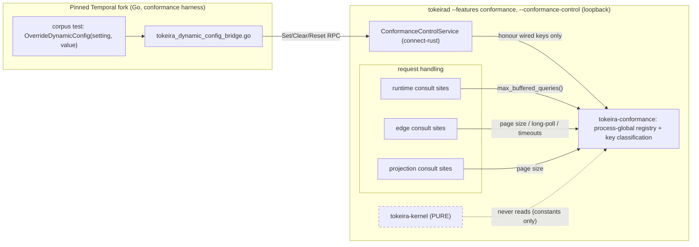

# Design Document: Conformance-Only Dynamic-Config Override

## Overview

This design delivers Temporal's `OverrideDynamicConfig(setting, value)` to an out-of-process
`tokeirad` via a conformance-only control RPC, so corpus leaves governed by a non-default dynamic
config run instead of skipping. It is derived from three sources verified this investigation:

- the pinned harness seams (`tests/testcore/functional_test_base.go:645`,
  `test_cluster.go:636`) and the metrics-bridge precedent (`tests/testcore/tokeira_metrics_bridge.go`),
- the tokeira Connect-RPC service shape (`crates/tokeira-compatibility-service/src/lib.rs`,
  `proto/tokeira/compatibility/v1/`, buffa/connect-rust), and
- the existing conformance-flag mount precedent in `apps/tokeirad/src/lib.rs` — the
  `wire_coverage_enabled()` recorder, which mounts a tower layer only under a flag as a *distinct
  server build* and "pays zero per-call cost" when off.

The design is bounded by the requirements' three lines: **compile-time gating** (production contains
none of it), a **kernel-purity exclusion** (the pure deterministic engine never reads it), and an
**honesty boundary** (only genuinely-wired keys are honoured; everything else is `Unsupported` and the
fork falls back to the skip registry).

## Dependencies and Non-Goals

### Owning relationships
- **`temporal-functional-conformance`** owns the corpus, the skip registry, and the drive-to-green
  conventions. This design is an enabling capability it consumes; it does not replace the
  "independent runs" convention (kept for kernel-const and feature-mode cases) or the skip registry
  (kept for unbridgeable cases).
- **This design consumes** the pinned Temporal v1.31.0 `dynamicconfig` key namespace and per-key value
  types (`common/dynamicconfig/constants.go @ v1.31.0`) as the set of override keys.
- **The consumer planes** (`tokeira-runtime`, `tokeira-edge`, `tokeira-projection`) gain a
  feature-gated, optional dependency on the new core crate and call its getters at wired sites.

### Non-goals
- No production dynamic configuration: production `tokeirad` gains no registry, no service, no
  listener, no env var, no TOML key. Config-as-constant is unchanged off-feature.
- No kernel change: `tokeira-kernel` is untouched; kernel constants stay constants.
- No enforcement of currently-unenforced limits (size limits): those are `Unsupported` here.
- No namespace-scoped override granularity beyond global (deferred until a leaf needs it).

## Architecture

Two planes, deliberately separate. The **control plane** (conformance-only) receives overrides from
the fork bridge and writes the process-global registry. The **data plane** (request handling) reads
the registry at wired consult sites in runtime/edge/projection. The **pure kernel never touches
either** — its constants are compile-time and its `apply` takes no config, which is what keeps replay
deterministic.



Off-feature, the `Reg`/`Ctl` boxes do not exist and each consult site compiles to its bare constant.

## Components and Interfaces

### `tokeira-conformance` — the registry core crate (new, feature-gated)

A small crate holding the process-global override store and the key classification. It has **no**
connectrpc/buffa dependency, so the consumer planes can depend on it cheaply. The process-global is a
sanctioned, feature-gated exception to the "no global mutable state" rule — it exists only in a
`conformance` build and only in the runtime/edge/projection planes, never the kernel.

```rust
/// Typed value an override can carry (mirrors the Temporal dynamic-config value kinds
/// the corpus uses).
pub enum OverrideValue {
    Int(i64),
    Double(f64),
    Bool(bool),
    Text(String),
    Duration(std::time::Duration),
}

/// Expected value type + which plane consults the key. `Disposition` is the honesty gate.
pub struct KeySpec {
    pub key: &'static str,           // Temporal setting key, e.g. "history.MaxBufferedQueryCount"
    pub value_type: ValueType,       // Int | Double | Bool | Text | Duration
    pub disposition: Disposition,    // Wired | KernelExcluded | NotEnforced
}

pub enum Disposition { Wired, KernelExcluded, NotEnforced }

/// The single source of truth for what is honourable. Adding a wired consult site
/// flips its entry to `Wired` here (Property 4 audits consistency).
pub static KEY_CLASSIFICATION: &[KeySpec] = &[ /* … */ ];

/// Process-global registry (present only under `feature = "conformance"`).
pub fn overrides() -> &'static ConformanceOverrides;

impl ConformanceOverrides {
    /// Honour a Set: reject unknown/kernel-excluded/not-enforced keys and type mismatches.
    pub fn set(&self, key: &str, value: OverrideValue) -> Result<(), OverrideError>;
    pub fn clear(&self, key: &str);
    pub fn reset(&self);
    // Live typed getters the consult-site accessors call:
    pub fn get_i64(&self, key: &str) -> Option<i64>;
    pub fn get_f64(&self, key: &str) -> Option<f64>;
    pub fn get_bool(&self, key: &str) -> Option<bool>;
    pub fn get_str(&self, key: &str) -> Option<String>;
    pub fn get_duration(&self, key: &str) -> Option<std::time::Duration>;
}

pub enum OverrideError { UnknownKey, KernelExcluded, NotEnforced, TypeMismatch, MissingKey }
```

### Consult-site accessors (consumer crates, feature-gated)

Each wired site replaces its bare constant read with an `#[inline]` accessor. Off-feature it *is* the
constant (Property 1); on-feature it consults the registry, falling back to the constant. The core-crate
dependency is optional and enabled by the crate's own `conformance` feature.

```rust
// crates/tokeira-runtime/src/buffered_queries.rs  — the first wired consumer
#[cfg(not(feature = "conformance"))]
#[inline] fn max_buffered_queries() -> usize { MAX_BUFFERED_QUERIES_PER_RUN }
#[cfg(feature = "conformance")]
#[inline] fn max_buffered_queries() -> usize {
    tokeira_conformance::overrides()
        .get_i64("history.MaxBufferedQueryCount")
        .and_then(|v| usize::try_from(v).ok())
        .unwrap_or(MAX_BUFFERED_QUERIES_PER_RUN)
}
// consult site changes from `>= MAX_BUFFERED_QUERIES_PER_RUN` to `>= max_buffered_queries()`.
```

### `tokeira-conformance-control` — the Connect-RPC service crate (new, feature-gated)

Mirrors `tokeira-compatibility-service`: a handler struct implementing the generated
`proto::ConformanceControlService` trait, translating proto requests into registry writes and mapping
`OverrideError` to Connect statuses. Proto lives under `proto/tokeira/conformance/v1/` (no checked-in
generated code), generated by a `tokeira-conformance-proto` crate.

```rust
pub struct ConformanceControlHandler; // reads the process-global registry

impl proto::ConformanceControlService for ConformanceControlHandler {
    async fn set_dynamic_config_override(&self, _ctx: RequestContext,
        req: proto::OwnedSetDynamicConfigOverrideRequestView)
        -> ServiceResult<impl Encodable<proto::SetDynamicConfigOverrideResponse> + Send>;
    async fn clear_dynamic_config_override(&self, _ctx: RequestContext,
        req: proto::OwnedClearDynamicConfigOverrideRequestView)
        -> ServiceResult<impl Encodable<proto::ClearDynamicConfigOverrideResponse> + Send>;
    async fn reset_dynamic_config_overrides(&self, _ctx: RequestContext,
        req: proto::OwnedResetDynamicConfigOverridesRequestView)
        -> ServiceResult<impl Encodable<proto::ResetDynamicConfigOverridesResponse> + Send>;
}
```

### `tokeirad` mount (feature-gated + runtime-flagged, separate listener)

Follows the `wire_coverage_enabled()` precedent exactly: a runtime flag decides whether to mount, and
the mounted vs unmounted paths are distinct builds. The control service binds its **own loopback-only
listener**, never the public gRPC router (`.add_service(...)` at `lib.rs:1169`).

```rust
#[cfg(feature = "conformance")]
if conformance_control_enabled() {                 // mirrors wire_coverage_enabled()
    let ctl_listener = TcpListener::bind(loopback_control_addr).await?; // separate, loopback-only
    tokio::spawn(serve_conformance_control(ConformanceControlHandler, ctl_listener, shutdown));
}
// #[cfg(not(feature = "conformance"))]: this block does not exist.
```

### Fork bridge — `tests/testcore/tokeira_dynamic_config_bridge.go` (new, onebox seam)

Mirrors `tokeira_metrics_bridge.go`. For the tokeira out-of-process cluster it overrides
`OverrideDynamicConfig` to call the control service; returns a `cleanup` that clears; `TearDownTest`
resets. It never edits a corpus test body.

```go
// pseudocode
func (c *tokeiraCluster) OverrideDynamicConfig(setting dynamicconfig.GenericSetting, value any) func() {
    v, ok := coerce(setting, value)
    resp := c.control.SetDynamicConfigOverride(setting.Key(), v)   // gRPC/Connect
    if !ok || isUnsupported(resp) || isInvalidArgument(resp) {
        c.markSkip(setting.Key())   // Requirement 5.2 fallback — never a silent no-op
    }
    return func() { c.control.ClearDynamicConfigOverride(setting.Key()) }
}
// TearDownTest → c.control.ResetDynamicConfigOverrides()
```

## Data Models

### `proto/tokeira/conformance/v1/control.proto`

```proto
message DynamicConfigValue {
  oneof kind {
    int64 int_value = 1;
    double double_value = 2;
    bool bool_value = 3;
    string string_value = 4;
    google.protobuf.Duration duration_value = 5;   // Temporal duration settings
  }
}
message SetDynamicConfigOverrideRequest { string key = 1; DynamicConfigValue value = 2; }
message SetDynamicConfigOverrideResponse { bool applied = 1; }  // false path never reached: errors are status codes
message ClearDynamicConfigOverrideRequest { string key = 1; }
message ClearDynamicConfigOverrideResponse {}
message ResetDynamicConfigOverridesRequest {}
message ResetDynamicConfigOverridesResponse {}
service ConformanceControlService {
  rpc SetDynamicConfigOverride(SetDynamicConfigOverrideRequest) returns (SetDynamicConfigOverrideResponse);
  rpc ClearDynamicConfigOverride(ClearDynamicConfigOverrideRequest) returns (ClearDynamicConfigOverrideResponse);
  rpc ResetDynamicConfigOverrides(ResetDynamicConfigOverridesRequest) returns (ResetDynamicConfigOverridesResponse);
}
```

- `key` traces to a Temporal setting key (`setting.Key()`); `DynamicConfigValue.kind` traces to the
  Temporal setting's value type (`common/dynamicconfig/constants.go @ v1.31.0`).

### In-memory registry state (feature-gated)

- `ConformanceOverrides { inner: RwLock<HashMap<&'static str, OverrideValue>> }` — keyed by the
  classified key string; values are the typed union. `RwLock` because reads happen on the request path
  and writes only from the control service.
- `KEY_CLASSIFICATION: &[KeySpec]` — the static honesty table; `disposition` is the gate, `value_type`
  is the type check, and the (documented) plane column keeps kernel keys out of `Wired`.

## Correctness Properties

### Property 1: Off-feature equivalence
*For any* wired key `K`, in a build **without** the `conformance` feature, the consult-site accessor
for `K` evaluates to exactly `K`'s pinned constant, and no registry or control surface is present in
the artifact.

**Validates: Requirements 1.1, 1.3, 3.1, 8.1**

### Property 2: Override lifecycle and liveness
*For any* wired key `K` and any type-valid value `v`: after `Set(K, v)` every subsequent consult of `K`
observes `v`; after `Clear(K)` consults observe `K`'s default; after `Reset()` all wired keys observe
their defaults. Consults read the current registry state at call time (no caching).

**Validates: Requirements 1.2, 2.3, 2.5, 2.6, 8.2**

### Property 3: Value-type fidelity
*For any* supported value kind and value, a `Set` whose `DynamicConfigValue.kind` matches the key's
declared `value_type` round-trips losslessly (the stored value equals the sent value); a `Set` whose
kind does not match is rejected `InvalidArgument` and records nothing.

**Validates: Requirements 2.2, 2.4, 8.3**

### Property 4: Honesty boundary
*For any* key whose classification is not `Wired` — unknown, `KernelExcluded`, or `NotEnforced` — a
`Set` returns an `Unsupported` status and records nothing (a later consult, where one exists, still
observes the default). The set of `Wired` keys equals the set of keys with a real consult-site
accessor.

**Validates: Requirements 4.2, 5.1, 5.3, 5.4, 8.4**

### Property 5: Kernel purity and replay determinism
The `tokeira-kernel` crate has no dependency on `tokeira-conformance` and `Kernel::apply` gains no
parameter; every `Wired` key's `value_type`/plane is a runtime/edge/projection value consulted **live
at request time**, never a value committed into a run's authoritative history.

**Validates: Requirements 4.1, 4.3**

### Property 6: Production isolation
With the `conformance` feature off, or on but not mounted, the served Temporal gRPC responses at every
site are identical to a plain build, and no control listener is bound.

**Validates: Requirements 3.2, 3.3, 3.4, 3.5, 8.5**

### Property 7: Between-test isolation
*For any* sequence of per-test `Set`/`Clear` calls followed by a `Reset()` at teardown, no override
set during test *i* is observable during test *i+1*.

**Validates: Requirements 6.2, 6.1**

## Error Handling

| Condition | Internal error | External (Connect) status |
|---|---|---|
| `Set` for a key absent from `KEY_CLASSIFICATION` | `OverrideError::UnknownKey` | `unimplemented` — "unsupported override key: `<k>`" |
| `Set` for a `KernelExcluded` key | `OverrideError::KernelExcluded` | `unimplemented` — "kernel-consulted constant is not overridable: `<k>`" |
| `Set` for a `NotEnforced` key | `OverrideError::NotEnforced` | `unimplemented` — "tokeira does not enforce `<k>`" |
| `Set` value kind ≠ key `value_type` | `OverrideError::TypeMismatch` | `invalid_argument` |
| `Set` with empty key | `OverrideError::MissingKey` | `invalid_argument` |
| `Set` for a `Wired` key, type-valid | — | `ok` (`applied = true`) |
| `Clear` / `Reset` | — | `ok` (idempotent) |

The fork bridge treats `unimplemented` and `invalid_argument` identically: fall back to the skip
registry (Requirement 5.2). `ok` lets the test proceed.

## Testing Strategy

- **Property tests (required, `proptest`, workspace standard):**
  - Property 2 (lifecycle), Property 3 (typing), Property 4 (honesty), Property 7 (isolation) in
    `crates/tokeira-conformance` (registry) and `crates/tokeira-conformance-control` (service
    honour-decisions), ≥100 iterations each, generating over keys × value kinds × operation sequences.
  - Property 1 (off-feature equivalence): a compile-configuration test asserting each accessor equals
    its constant when the feature is off; paired with an on-feature test that a *default* (no override
    set) consult equals the constant.
- **Unit tests (example-based):** `KEY_CLASSIFICATION` invariants (every entry's `value_type` is
  self-consistent; no `Wired` entry names a kernel plane); value coercion edge cases (duration nanos,
  negative ints, `usize` conversion bounds).
- **Structural test (Property 5):** a manifest/dependency assertion that `tokeira-kernel`'s
  dependencies do not include `tokeira-conformance` (a small test or a CI `cargo metadata` check), plus
  the documented invariant that `apply` is unchanged.
- **Integration tests (Property 6 + first consumer):**
  - Feature-off vs feature-on-unmounted equivalence for a representative request path.
  - End-to-end first consumer: with the feature on, `Set("history.MaxBufferedQueryCount", 2)` then
    drive the buffered-query path and assert the cap is 2; `Clear` restores 1. Lives in
    `crates/tokeira-runtime` tests.
- **Corpus validation:** once the reported-problems threshold is wired (Requirement 7.3), Tier 3.22
  `TestWFTFailureReportedProblems_DynamicConfigChanges` runs green over the bridge (two clean runs);
  until then it stays a classified skip.
- **Placement:** registry/service PBTs in the two new crates; the first-consumer integration test in
  `tokeira-runtime`; the dependency assertion at the workspace test level; the fork bridge exercised by
  the corpus run, not a Rust test.
