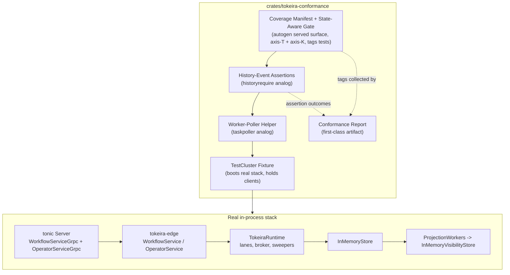
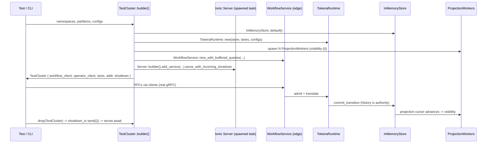
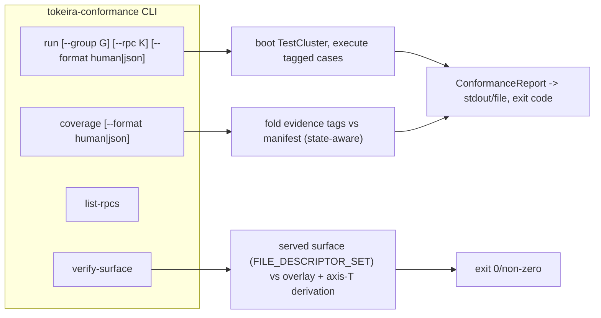
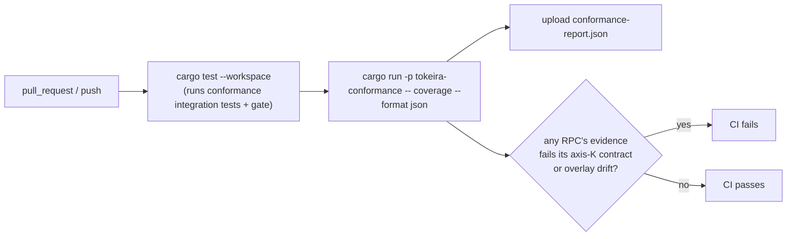

# Design Document: Conformance Harness

## Overview

The conformance harness is an executable oracle for Tokeira's public gRPC surface. It boots the real
stack in-process — tonic gRPC server over `tokeira-edge` over `TokeiraRuntime` over `InMemoryStore`
with projection workers — drives RPCs through real `WorkflowServiceClient` / `OperatorServiceClient`
connections, and asserts both the RPC response and the **emitted `HistoryEvent` sequence** against the
behaviour of the targeted Temporal release (`TEMPORAL_SERVER_COMPAT` = v1.31.0). It then emits a
machine-checked **conformance report** that fails CI when coverage regresses.

"Feature status" in this harness is **two axes, not one**, and the design turns on keeping them apart:

- **Axis T (Temporal lifecycle)** — does this RPC exist in the targeted release, and where is it in its
  lifecycle: `InTarget` (present in the v1.31.0 behavioural claim), `ProtoOnly` (present in the vendored
  `v1.62.11` proto but *not* in the 1.31.0 server claim — e.g. the Nexus operation-execution RPCs), or
  `Deprecated`. Axis T is **autogenerated** at runtime from the vendored proto
  (`tokeira_proto::public::FILE_DESCRIPTOR_SET`) plus the pinned `TEMPORAL_SERVER_COMPAT` /
  `TEMPORAL_PROTO_VERSION` in `crates/tokeira-build-info/src/pinned.rs`. There is no hand-maintained list
  of RPC identities.
- **Axis K (Tokeira claim)** — our implementation claim for an RPC: `Implemented | Experimental |
  Stubbed | Unsupported`. Axis K is **not** autogeneratable; it is a human claim that the harness
  *machine-proves* with behavioural tests. The sibling `temporal-compatibility-surface` spec will own the
  authoritative declaration of axis K via the `tokeira-compatibility` crate's `FEATURE_MATRIX`; the
  harness consumes axis K but does not own it (see [Axis K source: the FEATURE_MATRIX seam](#axis-k-source-the-feature_matrix-seam)).

This complements, and does not replace, the `api-conformance-tracker` spec. The tracker is **advisory
only** — a human/Codex-maintained worklist for advancing endpoint coverage. The harness does **not**
reconcile against the tracker and the tracker is **not** a gated artifact. The spine the harness
reconciles against is the autogenerated served surface (axis T, from `FILE_DESCRIPTOR_SET`); the gate
checks coverage against that surface directly, state-aware over the axis-K claim (see
[Served-Surface Coverage Check](#served-surface-coverage-check)). The tracker answers "which fields
should this RPC carry"; the harness answers "does invoking this RPC over the wire produce the
response, history, and contract that axis K claims".

The harness lives in a new workspace crate, `crates/tokeira-conformance` (library + integration tests +
a thin CLI binary), and runs in CI with no live AWS, Docker, or network dependency — exactly like the
existing `apps/tokeirad/tests/grpc_roundtrip.rs` round-trip test it generalizes.

## Goals and Non-Goals

**Goals**

- One reusable `TestCluster` fixture that boots the real stack and tears it down cleanly, replacing the
  copy-pasted `spawn_test_server` in `grpc_roundtrip.rs`.
- A worker-poller primitive so tests can advance workflows past "start" (poll a workflow task, respond
  with commands, poll/complete activities) — Tokeira's analog of Temporal's `taskpoller`.
- A history-event assertion DSL — Tokeira's analog of Temporal's `historyrequire` — that encodes the
  v1.31.0 expected event shape (types, attributes, and placement such as `HistoryEvent.links`).
- A coverage manifest derived at runtime from `FILE_DESCRIPTOR_SET` — the autogenerated served-surface
  set annotated with axis-T lifecycle — with a **state-aware gate** that fails when an RPC's behavioural
  evidence does not match its axis-K claim (an `Implemented` RPC with no passing test, an `Experimental`
  RPC with no disabled-state-contract test, a `Stubbed`/`Unsupported` RPC with no `Unimplemented` test),
  or when a newly-served RPC appears with no test at all.
- A conformance report as a first-class output artifact, emitted from both CLI and CI, carrying both
  axes plus a behavioural verdict per RPC.
- A first-class conformance case asserting the live `GetSystemInfo` handshake's `capabilities.*` flags
  agree with the axis-K claim, proven over the real wire.

**Non-Goals**

- Not a load/throughput harness (that is `apps/tokeira-bench`) nor a model checker (that is
  `tools/simulation/*`). The harness asserts behavioural correctness of single RPC flows.
- Does not port Temporal code. Temporal's `taskpoller` / `historyrequire` are *conceptual* references
  for shape and ergonomics only (AGENTS.md Mission, §8).
- Does not own the field-threading roadmap; that stays in the (advisory) tracker.
- Does not run Temporal's own functional test suite against `tokeirad`. Replaying Temporal's
  server-grade Go test corpus over the real wire (Tier 2) is owned by the sibling
  `temporal-functional-conformance` spec; this harness is the hermetic, in-process, per-RPC Tier 1.
- Does not own axis K. The authoritative axis-K declaration is the `temporal-compatibility-surface`
  spec's `FEATURE_MATRIX`; the harness consumes it (today via a thin local overlay, see Decision-4 seam)
  and machine-proves it, but does not define it.
- An `axis-T` `ProtoOnly` RPC (in the vendored proto but not in the 1.31.0 behavioural claim) is exempt
  from the gate until it enters the claim — it carries no axis-K obligation.

## Relationship to Tier 2 (`temporal-functional-conformance`)

This harness is **Tier 1** of Tokeira's conformance model. Tier 2 is owned by the sibling
`temporal-functional-conformance` spec. The two are **complementary, not duplicative**, and this
subsection records the boundary so the harnesses cannot drift into contradiction.

| | Tier 1 — this harness | Tier 2 — `temporal-functional-conformance` |
|---|---|---|
| **What runs** | Tokeira-authored per-RPC flows | Temporal's own Go functional corpus, unmodified, pinned at `v1.31.0` |
| **Where** | In-process, hermetic (`cargo test`) | External `tokeirad` over the real gRPC wire (forked onebox seam) |
| **Granularity** | One RPC flow at a time, shape + axis-K gate | Whole-suite behavioural assertions (server-grade `historyrequire`) |
| **Posture** | Pass/fail gate on the served surface | Run-all, classify-in-report (failures are data) |
| **Shared spine** | Consumes `FEATURE_MATRIX` (axis K) | Joins observed wire traffic against the *same* `FEATURE_MATRIX` via `tokeira_compatibility::coverage::resolve` |

**Why they do not contradict:** both tiers resolve observed behaviour against the single authoritative
axis-K declaration (`temporal-compatibility-surface`'s `FEATURE_MATRIX`). Neither tier defines the
claim; both prove against it. A Tier-1 per-RPC gate failure and a Tier-2 corpus failure for the same
RPC are therefore two views of one claim, never competing claims. Tier 1 answers "does this RPC, in
isolation, behave as the matrix says?"; Tier 2 answers "does Temporal's own end-to-end suite agree
when driven over the wire?". Tier 1 is the fast hermetic gate that must stay green; Tier 2 is the
broader signal whose failures are triaged and classified in its own report, not gated here.

**Non-overlap guarantee:** this harness does not run, import, or mirror Temporal's `tests/` corpus
(see Non-Goals above), and Tier 2 does not re-implement per-RPC shape gates — it reuses the matrix
join. Each tier owns exactly one mechanism; the only shared artifact is the read-only matrix.

---

# Part I — High-Level Design

## Architecture

### Harness Layers

The harness composes four layers, each building on the one below. Higher layers never reach around a
lower layer: a history assertion observes what the cluster emitted, it never inspects runtime internals.



- **TestCluster** is the foundation: it owns the gRPC server task, the connected clients, the store
  handle (for history readback), and teardown. Everything else borrows clients from it.
- **Worker-poller** is the highest-value new primitive. Most behaviour past `StartWorkflowExecution`
  is unreachable without polling a workflow task and responding with commands; the poller encapsulates
  the poll → decide → respond loop and the activity task loop.
- **History assertions** read the emitted history (via `GetWorkflowExecutionHistory` on the wire, or the
  store handle for reverse/raw reads) and match it against an expected event-shape script.
- **Coverage manifest + gate** is orthogonal plumbing: the manifest is the autogenerated served surface
  (from `FILE_DESCRIPTOR_SET`) annotated with axis-T lifecycle and the axis-K claim; each test declares
  the RPC(s) it exercises and the kind of evidence it provides; the gate folds those declarations against
  the manifest and fails when an RPC's evidence does not satisfy its axis-K contract.

### TestCluster Wiring

`TestCluster` generalizes `spawn_test_server` (`grpc_roundtrip.rs` lines 777–905) into one builder-driven
fixture. The wiring is identical to the existing one-off, lifted to a reusable surface:



Key boundary decisions, all consistent with the crate boundaries in AGENTS.md:

- **`tokeira-edge` is the only public-API surface the harness talks to over gRPC.** The harness never
  constructs kernel commands directly; it drives behaviour exactly as an SDK would.
- **`InMemoryStore` is the persistence**, so the harness is hermetic (no AWS/Docker/network), matching
  the simulators and the existing round-trip test.
- **History is read back from the same authoritative log** the runtime committed to. Forward reads go
  over the wire (`GetWorkflowExecutionHistory`); the held `store` handle is available for reverse/raw
  reads and for assertions that need raw `HistoryEvent`s without long-poll semantics.
- **Projection workers run** so visibility-dependent RPCs (`ListWorkflowExecutions`, etc.) behave
  realistically; the manifest tags those RPCs and tests account for projection lag with synchronization,
  not sleeps (AGENTS.md §1: no explicit sleeps in test code).

### Ground-Truth Linkage to v1.31.0

The harness is where the v1.31.0 behavioural claim becomes executable. Expected-history scripts and
response assertions are the encoded contract, and each non-obvious expectation cites its source per
AGENTS.md §8:

- **Wire shape** (event types present, attribute field numbers, oneof placement) is grounded in vendored
  `proto/upstream/` — e.g. signal links live on the outer `HistoryEvent.links` (field 302), not on the
  signaled-event attributes.
- **Runtime behaviour** (event ordering, defaulting, which events a given RPC emits) is grounded in
  Temporal server source at tag `v1.31.0`, read from the local checkout via `git show v1.31.0:<path>`.
  Citations are repo-relative path + tag, e.g. `service/history/historybuilder/event_factory.go @ v1.31.0`.

Each `ExpectedHistory` script carries an optional `ground_truth: &'static str` annotation naming the
proto path or server source path + tag it encodes. This makes the contract cite-able and lets a reviewer
confirm against the same ground truth without re-investigating. When v1.31.0 behaviour is ambiguous, the
expectation is resolved against the targeted release *before* the test is written, never inferred from
SDK docs or memory.

### RPC Grouping and Tagging for Coverage

RPCs are identified by a stable key and carry both status axes, so a report row is self-describing
without consulting any external artifact:

- **Rpc key**: the fully-qualified method, e.g. `temporal.api.workflowservice.v1.WorkflowService/StartWorkflowExecution`.
  This is **derived from** `FILE_DESCRIPTOR_SET`, which makes the manifest the served surface itself
  rather than a hand-maintained mirror of it (see [Served-Surface Coverage Check](#served-surface-coverage-check)).
- **Service**: `WorkflowService` or `OperatorService` (the latter includes `DeleteNamespace`).
- **Group**: a coarse functional area (e.g. `activity`, `schedule`, `visibility-legacy`, `nexus-admin`,
  `worker-deployments`). Groups let the report summarize coverage by area and let the CLI filter test
  runs. Group labels are not derivable from the descriptor; they come from a minimal checked-in overlay
  (see [Axis K source: the FEATURE_MATRIX seam](#axis-k-source-the-feature_matrix-seam)), not from the
  tracker.
- **Axis T (lifecycle)**: `InTarget | ProtoOnly | Deprecated`, **autogenerated** from the descriptor plus
  the `TEMPORAL_SERVER_COMPAT` / `TEMPORAL_PROTO_VERSION` pins. `ProtoOnly` RPCs are exempt from the gate.
- **Axis K (Tokeira claim)**: `Implemented | Experimental | Stubbed | Unsupported`, the implementation
  claim the harness proves. Axis K drives the *kind* of evidence the gate demands (see below). Today axis
  K is read from the local overlay; the target is to read it from `FEATURE_MATRIX`.

A test declares the RPC(s) it exercises **and the kind of evidence it carries** by tag, returning one or
more `(RpcKey, Evidence)` pairs. A single test may cover several RPCs (e.g. a start→poll→complete flow
legitimately exercises `StartWorkflowExecution`, `PollWorkflowTaskQueue`, `RespondWorkflowTaskCompleted`,
and `GetWorkflowExecutionHistory`). The evidence kind (`Behavioural`, `DisabledStateContract`,
`UnimplementedStub`, `UnimplementedOutOfScope`) is what the state-aware gate matches against the axis-K
claim.

## Components and Interfaces

| Component | Owns | Boundary / does not |
|-----------|------|---------------------|
| `TestCluster` (`cluster.rs`) | Booting the real stack, holding connected clients + the `InMemoryStore` handle, teardown. | Does not assert anything; does not construct kernel commands. Talks to the engine only through `tokeira-edge` over gRPC. |
| `WorkerPoller` (`poller.rs`) | The worker-side poll → respond loops (workflow tasks, activity tasks, heartbeats). | Does not interpret history shape; returns raw tasks/responses for the test to decide on. |
| `ExpectedHistory` DSL (`history.rs`) | Encoding the v1.31.0 expected event sequence/shape and matching it against emitted history. | Does not read runtime internals; observes only emitted `HistoryEvent`s. Carries the ground-truth citation. |
| `CoverageManifest` + gate (`manifest.rs`) | Deriving the served surface from `FILE_DESCRIPTOR_SET`, annotating each RPC with axis-T lifecycle and axis-K claim, folding evidence tags into a state-aware coverage verdict. | Does not parse or reconcile the tracker; does not own axis K (reads it from the overlay / `FEATURE_MATRIX`). Reconciles one relationship only: served surface ⊇ enumerated. |
| `ConformanceReport` (`report.rs`) | Aggregating per-RPC rows (axis T + axis K + verdict), coverage %, the served-surface check result, and `GetSystemInfo` consistency; human + JSON emission. | Pure data + rendering; no execution. |
| CLI (`bin/tokeira-conformance.rs`) | `run` / `coverage` / `list-rpcs` / `verify-surface`, exit codes. | Thin orchestration over the library; no behavioural logic of its own. |

Each component's concrete Rust surface (builder methods, trait methods, structs) is specified in
[Part II](#part-ii--low-level-design).

## Served-Surface Coverage Check

There is **one** authoritative RPC list: the served surface, derived at runtime from
`tokeira_proto::public::FILE_DESCRIPTOR_SET`. The manifest *is* that surface — enumerated from the
descriptor, then annotated with axis-T lifecycle (from the pins) and axis-K claim (from the overlay /
`FEATURE_MATRIX`). There is no hand-maintained RPC identity list and no tracker reconciliation.

Reconciliation therefore shrinks to a single relationship — the served surface is the spine, and the
gate checks coverage against it directly:

- **Enumeration completeness:** the set of RPCs the harness reasons about must equal the set the server
  actually serves. Because enumeration is derived from the same `FILE_DESCRIPTOR_SET` the server exposes,
  a newly-added RPC appears automatically with axis-T lifecycle attached. The check that can still fail is
  the **annotation overlay**: if the overlay carries a group/axis-K entry for a key that is no longer
  served, or a served key is missing an overlay entry, `verify-surface` reports it in
  `missing_from_overlay` / `stale_overlay_entries`. This is the analog of the old "new/untested RPC
  appears" trigger, now expressed as overlay-vs-descriptor rather than manifest-vs-tracker.
- **State-aware coverage:** every `InTarget` RPC must carry behavioural evidence that satisfies its
  axis-K contract (see [State-Aware Coverage Gate](#state-aware-coverage-gate)). `ProtoOnly` RPCs are
  exempt; `Deprecated` RPCs are reported but not gated.

The axis-T derivation is mechanical: a method present in `FILE_DESCRIPTOR_SET` and in the
`TEMPORAL_SERVER_COMPAT` (1.31.0) claim is `InTarget`; a method present in the vendored `v1.62.11`
descriptor but outside the 1.31.0 claim (e.g. Nexus operation execution) is `ProtoOnly`; a method the
descriptor marks deprecated is `Deprecated`.

## State-Aware Coverage Gate

The gate is **state-aware over axis K**. This replaces the old binary "Deferred is exempt, everything
else needs one test" rule. Stub/unsupported/experimental are now *positive contract obligations*, not
exemptions — the harness proves the claim Tokeira makes, whatever that claim is:

| Axis-K claim | Gate obligation |
|--------------|-----------------|
| `Implemented` | MUST have ≥ 1 passing **behavioural** test (strict — real response + history). |
| `Experimental` | MUST have a test asserting the **disabled-state contract** — e.g. `FailedPrecondition` when the dynamic-config gate is off. |
| `Stubbed` | MUST have a test asserting `Unimplemented` (**stub**) is returned. |
| `Unsupported` | MUST have a test asserting `Unimplemented` (**out-of-scope**) is returned. |

Axis-T `ProtoOnly` RPCs are exempt from every obligation above (the analog of the old `Deferred`
exemption), since they are not part of the behavioural claim. When a `ProtoOnly` RPC enters the 1.31.0
claim (axis T flips to `InTarget`), it immediately acquires the obligation dictated by its axis-K claim.

The `Deferred` / `Partial` taxonomy is removed throughout — those were the tracker's words for a
single-axis world. An RPC that is partially threaded is `Experimental` or `Implemented` with the gate
demanding the matching evidence, not a `Partial` label exempt from proof.

## Axis K source: the FEATURE_MATRIX seam

Axis K is a forward **seam**, not a hard dependency today. The authoritative axis-K declaration will be
`tokeira-compatibility::FEATURE_MATRIX`, owned by the sibling `temporal-compatibility-surface` spec. The
harness is designed to consume it, but must compile and gate **today**, before that spec lands.

- **Today:** axis K (and the non-derivable group label) come from a thin, minimal checked-in overlay in
  this crate — a small `axis_k.toml` keyed by `RpcKey`, carrying only `group` and `status`. This overlay
  is explicitly a temporary seam, kept as small as possible, and is the *only* hand-maintained artifact in
  the harness.
- **Migration:** when `FEATURE_MATRIX` becomes authoritative, the overlay is replaced by reading
  `FEATURE_MATRIX` (via an optional, seam-only dependency on `tokeira-compatibility`). The gate logic does
  not change — only the *source* of the axis-K value changes. The harness MAY take a forward view toward
  `tokeira-compatibility` but MUST NOT hard-require it to compile today (it already depends on
  `tokeira-build-info` for the pins).

This seam unlocks an end-to-end invariant the harness asserts as a first-class case:

> The live `GetSystemInfo` handshake's `capabilities.*` flags must equal what axis K claims, proven over
> the real wire.

- **Today:** the `GetSystemInfo` case asserts the response's `capabilities.*` flags are internally
  consistent with the axis-K overlay (e.g. a capability flagged on iff the corresponding RPC's axis-K
  claim is `Implemented`/`Experimental` per the overlay's mapping).
- **Target:** the same case is rebound to `FEATURE_MATRIX` once integrated, with no change to the
  assertion's shape — the matrix-backed form is the goal, the overlay-backed form is the bridge.

## CLI and CI Usage Flows

**CLI** (`cargo run -p tokeira-conformance --bin tokeira-conformance` — or the `conformance` binary):



- `run` boots a cluster, executes conformance cases (optionally filtered by group/RPC), and emits a
  report. Non-zero exit on any failed case or coverage gap.
- `coverage` computes and prints the state-aware coverage gate result without re-running cases (folds the
  registered evidence tags against the manifest).
- `list-rpcs` prints the manifest (served surface + axis-T + axis-K annotations).
- `verify-surface` runs only the served-surface check: derive the surface from `FILE_DESCRIPTOR_SET`,
  derive axis-T from the pins, and confirm the axis-K/group overlay neither omits a served RPC nor
  carries a stale entry. No tracker verification.

**CI** wires into the existing `.github/workflows/ci.yml`. Because the crate is a normal workspace
member, `cargo test --workspace` (the existing `test` job) already runs its integration tests, including
the coverage-gate test. A dedicated step emits the JSON report as a build artifact:



The gate runs two ways on purpose: as a `#[test]` (so a local `cargo test` catches regressions with no
extra tooling) and as a CLI step (so CI publishes the human-readable report artifact). Both read the same
manifest and the same tag registry.

## Conformance Report

The report is a first-class artifact, modeled on the simulators' `Report` shape
(`tools/simulation/engine/src/report.rs`): a header, per-item verdicts, and an overall PASS/FAIL with a
non-zero exit on failure. It is `Serialize`/`Deserialize` (AGENTS.md §1) so CI can store and diff it.

Contents:

- **Run metadata**: `temporal_server_compat` (v1.31.0), `temporal_proto_version` (v1.62.11), harness
  crate version, UTC timestamp.
- **Per-RPC rows**: `RpcKey`, group, **axis-T lifecycle** (`InTarget | ProtoOnly | Deprecated`),
  **axis-K claim** (`Implemented | Experimental | Stubbed | Unsupported`), number of tagged tests, the
  **behavioural verdict** (`Pass | Fail | NotCovered | Exempt`), and on failure the first failing case
  name + reason. `Exempt` is the verdict for `ProtoOnly` RPCs (and is how a reader sees an RPC that is in
  the proto but outside the 1.31.0 claim).
- **Coverage summary**: covered / total (excluding `ProtoOnly`), per-group breakdown, and the
  machine-verified coverage percentage.
- **Served-surface check result**: any served-vs-overlay drift (`missing_from_overlay`,
  `stale_overlay_entries`).
- **GetSystemInfo consistency**: whether the live handshake's `capabilities.*` flags agree with axis K
  (overlay-backed today, `FEATURE_MATRIX`-backed once integrated).

Emitted as human-readable text (default, simulator style) or JSON (`--format json`). The JSON form is the
CI artifact; the human form is for local runs.

---

# Part II — Low-Level Design

All signatures are idiomatic Edition-2024 Rust mirroring existing patterns: `thiserror` for the library
error type, `Debug` on public types, `Serialize`/`Deserialize` on report types, `tracing` for logging, no
`.unwrap()` outside `#[cfg(test)]`, no `unsafe`. Public items carry `///` docs at the WHY-not-WHAT bar
(AGENTS.md §9); docs are elided here for brevity but are part of the deliverable.

## Crate Layout

```
crates/tokeira-conformance/
├── Cargo.toml                 # workspace member; runs in CI
├── src/
│   ├── lib.rs                 # re-exports the harness surface
│   ├── cluster.rs             # TestCluster + builder
│   ├── poller.rs              # WorkerPoller trait + GrpcWorkerPoller impl
│   ├── history.rs             # ExpectedHistory DSL + matcher (historyrequire analog)
│   ├── manifest.rs            # RpcKey, axis-T/axis-K, served-surface derivation, state-aware gate
│   ├── report.rs             # ConformanceReport (Serialize/Deserialize)
│   ├── registry.rs            # test -> (RpcKey, Evidence) tag registration + collection
│   ├── error.rs               # ConformanceError (thiserror)
│   └── bin/
│       └── tokeira-conformance.rs   # clap CLI
├── axis_k.toml                # minimal overlay: per-RPC group + axis-K status (temporary seam)
└── tests/
    ├── coverage_gate.rs       # the machine-verified gate (#[test])
    ├── workflow_lifecycle.rs  # start/poll/complete/signal/query/... cases
    ├── schedules.rs
    ├── visibility.rs
    └── operator.rs            # OperatorService cases
```

## Error Type

```rust
#[derive(Debug, thiserror::Error)]
pub enum ConformanceError {
    #[error("cluster startup failed: {0}")]
    Startup(String),
    #[error("gRPC transport error: {0}")]
    Transport(#[from] tonic::transport::Error),
    #[error("RPC failed: {status}")]
    Rpc { status: tonic::Status },
    #[error("history assertion failed at step {step}: {reason}")]
    HistoryMismatch { step: usize, reason: String },
    #[error("no workflow task available for task queue {task_queue} within budget")]
    PollTimeout { task_queue: String },
    #[error("coverage gate failed: {0}")]
    Coverage(String),
    #[error("served-surface check failed: {0}")]
    SurfaceCheck(String),
}

pub type Result<T> = std::result::Result<T, ConformanceError>;
```

## TestCluster — Builder and Fixture

The fixture extracts `spawn_test_server` into a reusable, configurable surface. The builder defaults
reproduce the current round-trip test exactly (one `default` namespace, 16 visibility partitions,
`Default` configs), so migrating `grpc_roundtrip.rs` is a behaviour-preserving change.

```rust
/// Builder for an in-process conformance cluster. Defaults reproduce the
/// existing `spawn_test_server` wiring so callers opt into deviations only.
#[derive(Debug)]
pub struct TestClusterBuilder {
    namespaces: Vec<String>,
    visibility_partitions: u32,
    lane_config: LaneConfig,
    timer_config: TimerScannerConfig,
    workflow_timeout_config: WorkflowTimeoutScannerConfig,
    backlog_config: BacklogConfig,
    lanes: usize,
}

impl TestClusterBuilder {
    pub fn new() -> Self;                                   // default-equivalent to grpc_roundtrip.rs
    pub fn namespace(self, name: impl Into<String>) -> Self;
    pub fn visibility_partitions(self, n: u32) -> Self;
    pub fn lane_config(self, cfg: LaneConfig) -> Self;
    pub fn lanes(self, n: usize) -> Self;
    /// Boot the server task, connect both clients, return the live fixture.
    pub async fn start(self) -> Result<TestCluster>;
}

/// A live in-process Tokeira stack with connected clients and a teardown guard.
/// Holds the `InMemoryStore` so assertions can read the authoritative history
/// without long-poll semantics. Dropping the cluster triggers graceful shutdown.
pub struct TestCluster {
    addr: std::net::SocketAddr,
    store: InMemoryStore,
    workflow: WorkflowServiceClient<tonic::transport::Channel>,
    operator: OperatorServiceClient<tonic::transport::Channel>,
    projection: ProjectionHandles,           // join handles + cancellation tokens
    shutdown_tx: tokio::sync::oneshot::Sender<()>,
    server: tokio::task::JoinHandle<anyhow::Result<()>>,
}

impl TestCluster {
    pub fn builder() -> TestClusterBuilder;
    /// Convenience: a single-namespace cluster with default wiring.
    pub async fn start_default() -> Result<Self>;

    pub fn endpoint(&self) -> String;        // "http://127.0.0.1:<port>"
    /// Cloned client handle; tonic clients are cheap to clone and share the channel.
    pub fn workflow_client(&self) -> WorkflowServiceClient<tonic::transport::Channel>;
    pub fn operator_client(&self) -> OperatorServiceClient<tonic::transport::Channel>;
    /// Store handle for raw/reverse history reads and projection-cursor waits.
    pub fn store(&self) -> &InMemoryStore;

    /// Spawn a worker-poller bound to a task queue + namespace on this cluster.
    pub fn poller(&self, namespace: &str, task_queue: &str) -> GrpcWorkerPoller;

    /// Read the full forward history for an execution over the wire, draining
    /// pages. Used as the input to `ExpectedHistory::assert_matches`.
    pub async fn fetch_history(
        &self,
        namespace: &str,
        workflow_id: &str,
        run_id: Option<&str>,
    ) -> Result<Vec<HistoryEvent>>;

    /// Explicit graceful shutdown (also runs on Drop). Idempotent.
    pub async fn shutdown(self) -> Result<()>;
}
```

Teardown: `TestCluster` sends on `shutdown_tx` and joins the server task. A `Drop` impl provides a
best-effort fallback (signal shutdown, abort projection tasks) so a panicking test never leaks the bound
port or background workers. Projection workers are tracked in `ProjectionHandles` with `CancellationToken`s
rather than detached, fixing the existing test's fire-and-forget spawns.

## Worker-Poller — The Missing Primitive

This is the highest-value new code: the analog of Temporal's `common/testing/taskpoller`. It wraps the
poll → decide → respond loop so a test can advance a workflow without re-deriving task-token plumbing.

```rust
/// Drives worker-side interactions for one (namespace, task queue): polling
/// workflow tasks and responding with commands, and polling/completing activity
/// tasks. Async because it speaks real gRPC; this is the test-side worker, not a
/// production SDK worker.
#[async_trait::async_trait]
pub trait WorkerPoller {
    /// Long-poll one workflow task. Returns `None` if the poll returns empty
    /// within the configured budget (no task available).
    async fn poll_workflow_task(&mut self) -> Result<Option<WorkflowTask>>;

    /// Respond to a polled workflow task with a command list (may be empty to
    /// complete an otherwise-empty task).
    async fn respond_workflow_task_completed(
        &mut self,
        task: &WorkflowTask,
        commands: Vec<Command>,
    ) -> Result<RespondWorkflowTaskCompletedResponse>;

    /// Respond to a polled workflow task with a failure.
    async fn respond_workflow_task_failed(
        &mut self,
        task: &WorkflowTask,
        cause: WorkflowTaskFailedCause,
        failure: Option<Failure>,
    ) -> Result<()>;

    async fn poll_activity_task(&mut self) -> Result<Option<ActivityTask>>;
    async fn complete_activity_task(&mut self, task: &ActivityTask, result: Option<Payloads>) -> Result<()>;
    async fn fail_activity_task(&mut self, task: &ActivityTask, failure: Failure) -> Result<()>;
    async fn record_activity_heartbeat(&mut self, task: &ActivityTask, details: Option<Payloads>) -> Result<RecordActivityTaskHeartbeatResponse>;
}

/// Concrete poller over real gRPC clients. Identity defaults to a stable test
/// worker id; the poll budget bounds long-polls so a missing task fails fast
/// instead of hanging (AGENTS.md §1: no sleeps — long-poll + bounded retry).
pub struct GrpcWorkerPoller {
    workflow: WorkflowServiceClient<tonic::transport::Channel>,
    namespace: String,
    task_queue: String,
    identity: String,
    poll_budget: std::time::Duration,
}

impl GrpcWorkerPoller {
    pub fn with_identity(self, identity: impl Into<String>) -> Self;
    pub fn with_poll_budget(self, budget: std::time::Duration) -> Self;

    /// Ergonomic helper for the dominant case: poll one task, respond with
    /// `commands`, return the emitted response. Errors if no task is available.
    pub async fn complete_next_workflow_task(
        &mut self,
        commands: Vec<Command>,
    ) -> Result<RespondWorkflowTaskCompletedResponse>;
}

/// A polled workflow task with the bits a test needs: the opaque token to
/// respond against, plus the events the server attached for decision-making.
#[derive(Debug, Clone)]
pub struct WorkflowTask {
    pub task_token: Vec<u8>,
    pub started_event_id: i64,
    pub history: Vec<HistoryEvent>,
    pub workflow_execution: WorkflowExecution,
}

#[derive(Debug, Clone)]
pub struct ActivityTask {
    pub task_token: Vec<u8>,
    pub activity_id: String,
    pub activity_type: ActivityType,
    pub input: Option<Payloads>,
}
```

Synchronization (no sleeps): `poll_*` issue real long-polls bounded by `poll_budget`; a task that should
appear is awaited via the long-poll itself, and visibility-lag waits (for projection-backed RPCs) use a
bounded poll-until-condition loop on `fetch_history` / list RPCs rather than `tokio::time::sleep`. The
existing round-trip test's `sleep(25ms)` list loop is replaced by this bounded condition wait.

## History-Event Assertion DSL — `historyrequire` Analog

The DSL expresses an expected event sequence as a script and matches it against the actual emitted
history. It mirrors the ergonomics of Temporal's `historyrequire` (assert the type sequence; assert
specific attributes on specific events; assert placement) without porting it.

```rust
/// One expected event in a script: its type is always checked; attribute and
/// placement checks are opt-in closures so a test asserts only what the v1.31.0
/// contract pins for that event.
pub struct ExpectedEvent {
    event_type: EventType,
    /// Optional attribute assertion, run against the matched event. Closures keep
    /// the DSL extensible without enumerating every attribute up front.
    attrs: Option<Box<dyn Fn(&HistoryEvent) -> std::result::Result<(), String> + Send + Sync>>,
}

/// An ordered expected-history script. `ground_truth` cites the proto path or
/// Temporal server source path + tag the script encodes (AGENTS.md §8).
pub struct ExpectedHistory {
    steps: Vec<ExpectedEvent>,
    ground_truth: Option<&'static str>,
    mode: MatchMode,
}

/// Whether the script must match the full history or a contiguous/loose subset.
#[derive(Debug, Clone, Copy)]
pub enum MatchMode {
    /// Every event, in order, must match (length must be equal).
    Exact,
    /// The script is a prefix of the actual history.
    Prefix,
    /// The script's events appear in order, contiguously, somewhere in history.
    ContiguousSubsequence,
}

impl ExpectedHistory {
    pub fn new() -> Self;                                    // Exact by default
    pub fn mode(self, mode: MatchMode) -> Self;
    pub fn ground_truth(self, cite: &'static str) -> Self;

    /// Push an event whose type is checked but attributes are not.
    pub fn event(self, ty: EventType) -> Self;
    /// Push an event with an attribute/placement assertion closure.
    pub fn event_with(
        self,
        ty: EventType,
        attrs: impl Fn(&HistoryEvent) -> std::result::Result<(), String> + Send + Sync + 'static,
    ) -> Self;

    /// Match against actual emitted history. Produces a precise, step-indexed
    /// `HistoryMismatch` on the first divergence (type or attribute).
    pub fn assert_matches(&self, actual: &[HistoryEvent]) -> Result<()>;
}
```

Example expectation (start → first WFT scheduled), with a ground-truth citation:

```rust
ExpectedHistory::new()
    .mode(MatchMode::Prefix)
    .ground_truth("service/history/historybuilder/event_factory.go @ v1.31.0")
    .event(EventType::WorkflowExecutionStarted)
    .event(EventType::WorkflowTaskScheduled)
    .assert_matches(&cluster.fetch_history("default", "wf-1", None).await?)?;
```

Placement assertions (e.g. signal links on the outer event, per the signal-headers design) are expressed
in the attribute closure by inspecting `HistoryEvent.links` rather than the attributes oneof:

```rust
.event_with(EventType::WorkflowExecutionSignaled, |ev| {
    if ev.links.is_empty() { Err("expected signal links on HistoryEvent.links (field 302)".into()) }
    else { Ok(()) }
})
```

## Data Models

The coverage manifest, tagging registry, and report are the harness's persistent data shapes. They are
specified together here; the `TestCluster`, poller, and history DSL surfaces follow in the component
sections above.

### Coverage Manifest and Gate

```rust
/// Stable identity for one RPC: fully-qualified `service/method`.
#[derive(Debug, Clone, PartialEq, Eq, Hash, PartialOrd, Ord, serde::Serialize, serde::Deserialize)]
pub struct RpcKey(pub String);

impl RpcKey {
    pub fn new(service_fqn: &str, method: &str) -> Self;     // "<svc>/<method>"
    pub fn service(&self) -> &str;
    pub fn method(&self) -> &str;
}

/// Temporal lifecycle axis (axis T). Autogenerated from the descriptor + pins:
/// `InTarget` is in the v1.31.0 behavioural claim; `ProtoOnly` is in the vendored
/// v1.62.11 proto but outside that claim (e.g. Nexus operation execution) and is
/// exempt from the gate; `Deprecated` is reported but not gated.
#[derive(Debug, Clone, Copy, PartialEq, Eq, serde::Serialize, serde::Deserialize)]
pub enum AxisT { InTarget, ProtoOnly, Deprecated }

/// Tokeira claim axis (axis K). The implementation claim the harness machine-proves.
/// Drives the *kind* of evidence the gate demands. Sourced today from the local
/// `axis_k.toml` overlay; the target source is `tokeira-compatibility::FEATURE_MATRIX`.
#[derive(Debug, Clone, Copy, PartialEq, Eq, serde::Serialize, serde::Deserialize)]
pub enum AxisK { Implemented, Experimental, Stubbed, Unsupported }

/// The kind of evidence a tagged test provides for an RPC. The gate matches the
/// evidence kind against the RPC's axis-K claim (see the state-aware gate table).
#[derive(Debug, Clone, Copy, PartialEq, Eq, serde::Serialize, serde::Deserialize)]
pub enum Evidence {
    /// Real response + history conformance (satisfies `Implemented`).
    Behavioural,
    /// Asserts the disabled-state contract, e.g. `FailedPrecondition` when the
    /// dynamic-config gate is off (satisfies `Experimental`).
    DisabledStateContract,
    /// Asserts `Unimplemented` is returned as a stub (satisfies `Stubbed`).
    UnimplementedStub,
    /// Asserts `Unimplemented` is returned as out-of-scope (satisfies `Unsupported`).
    UnimplementedOutOfScope,
}

/// One manifest row. `key`, `service`, and `axis_t` are derived from the served
/// surface + pins; `group` and `axis_k` come from the overlay (today) or
/// `FEATURE_MATRIX` (target). Axis T gates exemption; axis K gates the evidence kind.
#[derive(Debug, Clone, serde::Serialize, serde::Deserialize)]
pub struct RpcEntry {
    pub key: RpcKey,
    pub service: ServiceKind,        // WorkflowService | OperatorService
    pub group: String,
    pub axis_t: AxisT,
    pub axis_k: AxisK,
}

/// The served surface annotated with both axes. Enumeration is derived from
/// `FILE_DESCRIPTOR_SET` (not a checked-in identity list); the overlay only adds
/// `group` + `axis_k` per key.
#[derive(Debug, Clone, serde::Serialize, serde::Deserialize)]
pub struct CoverageManifest {
    pub entries: Vec<RpcEntry>,
}

impl CoverageManifest {
    /// Build the manifest: enumerate the served surface from `FILE_DESCRIPTOR_SET`,
    /// derive each RPC's `axis_t` from the `TEMPORAL_SERVER_COMPAT`/`TEMPORAL_PROTO_VERSION`
    /// pins, and overlay `group` + `axis_k` from `axis_k.toml` (today) — replaced by
    /// reading `FEATURE_MATRIX` once the sibling spec makes it authoritative, with no
    /// change to gate logic.
    pub fn build() -> Result<Self>;

    /// RPC keys served by the running surface, derived from the public
    /// FILE_DESCRIPTOR_SET. Authoritative wire shape and the single RPC list (AGENTS.md §8).
    pub fn served_rpc_keys() -> Result<std::collections::BTreeSet<RpcKey>>;

    /// One-way served-surface check: confirm the axis-K/group overlay neither omits a
    /// served RPC (`missing_from_overlay`) nor carries a stale entry for an unserved key
    /// (`stale_overlay_entries`). No tracker reconciliation.
    pub fn verify_surface(
        &self,
        served: &std::collections::BTreeSet<RpcKey>,
    ) -> Result<SurfaceCheckResult>;

    /// Fold registered evidence tags into a state-aware coverage verdict: each
    /// `InTarget` RPC must carry evidence satisfying its `axis_k` claim; `ProtoOnly`
    /// RPCs are exempt; `Deprecated` RPCs are reported, not gated.
    pub fn evaluate(&self, covered: &CoverageTags) -> CoverageOutcome;
}

/// Per-test RPC tagging. A test registers the RPC(s) it exercises together with the
/// kind of evidence it provides; the registry collects them across the suite for the
/// state-aware gate to fold. `inventory`-style registration keeps tags next to the
/// tests that own them.
#[derive(Debug, Default)]
pub struct CoverageTags {
    // key -> (evidence kind, test name); a test contributes one entry per RPC it tags.
    covered: std::collections::BTreeMap<RpcKey, Vec<(Evidence, &'static str)>>,
}

impl CoverageTags {
    pub fn record(&mut self, key: RpcKey, evidence: Evidence, test_name: &'static str);
    pub fn merge(&mut self, other: &CoverageTags);
}

/// Result of the one-way served-surface check (overlay vs descriptor).
#[derive(Debug, Clone, serde::Serialize, serde::Deserialize)]
pub struct SurfaceCheckResult {
    pub missing_from_overlay: Vec<RpcKey>,   // served but the overlay has no group/axis_k entry
    pub stale_overlay_entries: Vec<RpcKey>,  // overlay entry for a key no longer served
}
```

`axis_k.toml` overlay row shape (checked-in, minimal — the only hand-maintained artifact, and a
temporary seam until `FEATURE_MATRIX` is authoritative). It carries **only** the non-derivable bits;
`key`, `service`, and `axis_t` are derived, not written here:

```toml
[[rpc]]
key = "temporal.api.workflowservice.v1.WorkflowService/StartWorkflowExecution"
group = "start-fields"
axis_k = "Implemented"

[[rpc]]
key = "temporal.api.operatorservice.v1.OperatorService/DeleteNamespace"
group = "namespace-full"
axis_k = "Stubbed"
```

### Conformance Report Schema

```rust
#[derive(Debug, Clone, serde::Serialize, serde::Deserialize)]
pub struct ConformanceReport {
    pub temporal_server_compat: String,   // "1.31.0"
    pub temporal_proto_version: String,   // "v1.62.11"
    pub harness_version: String,
    pub generated_at: String,             // RFC3339 UTC
    pub rpcs: Vec<RpcReportRow>,
    pub coverage: CoverageSummary,
    pub surface_check: SurfaceCheckResult,
    pub system_info_consistency: SystemInfoConsistency,
}

#[derive(Debug, Clone, serde::Serialize, serde::Deserialize)]
pub struct RpcReportRow {
    pub key: RpcKey,
    pub group: String,
    pub axis_t: AxisT,                        // InTarget | ProtoOnly | Deprecated
    pub axis_k: AxisK,                        // Implemented | Experimental | Stubbed | Unsupported
    pub test_count: usize,
    pub verdict: RpcVerdict,                  // Pass | Fail | NotCovered | Exempt
    pub first_failure: Option<CaseFailure>,   // case name + reason
}

/// `Exempt` is the verdict for axis-T `ProtoOnly` RPCs (in the proto, outside the
/// 1.31.0 claim). `NotCovered` means an `InTarget` RPC lacks evidence satisfying its
/// axis-K claim. `Fail` means tagged evidence was present but a case failed.
#[derive(Debug, Clone, serde::Serialize, serde::Deserialize)]
pub enum RpcVerdict { Pass, Fail, NotCovered, Exempt }

#[derive(Debug, Clone, serde::Serialize, serde::Deserialize)]
pub struct CaseFailure { pub case: String, pub reason: String }

#[derive(Debug, Clone, serde::Serialize, serde::Deserialize)]
pub struct CoverageSummary {
    pub covered: usize,
    pub total_in_target: usize,                        // denominator excludes ProtoOnly
    pub percent: f64,                                  // machine-verified coverage
    pub by_group: std::collections::BTreeMap<String, GroupCoverage>,
}

#[derive(Debug, Clone, serde::Serialize, serde::Deserialize)]
pub struct GroupCoverage { pub covered: usize, pub total: usize }

/// Whether the live `GetSystemInfo` handshake's `capabilities.*` flags agree with the
/// axis-K claim. Today the claim source is the overlay; the target is `FEATURE_MATRIX`,
/// with no change to this shape. `mismatches` names each capability flag whose observed
/// value disagrees with the claim.
#[derive(Debug, Clone, serde::Serialize, serde::Deserialize)]
pub struct SystemInfoConsistency {
    pub consistent: bool,
    pub claim_source: ClaimSource,            // Overlay (today) | FeatureMatrix (target)
    pub mismatches: Vec<String>,
}

#[derive(Debug, Clone, Copy, serde::Serialize, serde::Deserialize)]
pub enum ClaimSource { Overlay, FeatureMatrix }

impl ConformanceReport {
    /// True only if every `InTarget` RPC's evidence satisfies its axis-K claim
    /// (`Pass`), coverage is complete, the served-surface check is clean, and the
    /// `GetSystemInfo` handshake agrees with axis K. Drives the CLI exit code and the
    /// gate `#[test]`.
    pub fn passed(&self) -> bool;
    /// Simulator-style human rendering to stdout.
    pub fn print_human(&self);
    /// JSON for the CI artifact.
    pub fn to_json(&self) -> Result<String>;
}
```

## CLI Command Surface

```rust
#[derive(clap::Parser)]
#[command(name = "tokeira-conformance")]
struct Cli {
    #[command(subcommand)]
    command: Command,
    /// Output format for report-producing subcommands.
    #[arg(long, value_enum, default_value_t = OutputFormat::Human, global = true)]
    format: OutputFormat,
}

#[derive(clap::Subcommand)]
enum Command {
    /// Boot a cluster and execute conformance cases (optionally filtered).
    Run { #[arg(long)] group: Option<String>, #[arg(long)] rpc: Option<String>, #[arg(long)] out: Option<std::path::PathBuf> },
    /// Compute and print the state-aware coverage gate result without running cases.
    Coverage,
    /// Print the manifest (served surface + axis-T + axis-K annotations).
    ListRpcs,
    /// Run only the one-way served-surface check (descriptor-derived surface +
    /// axis-T derivation vs the axis-K/group overlay). No tracker verification.
    VerifySurface,
}

#[derive(Clone, Copy, clap::ValueEnum)]
enum OutputFormat { Human, Json }
```

`Run` returns exit code 0 on a fully passing report, non-zero otherwise — matching the simulators'
`std::process::exit(1)` convention so CI treats a coverage gap or behavioural failure as a build failure.

## Performance and Scale Tradeoffs

- **Cluster reuse vs per-test isolation.** Booting a `TestCluster` per test is the safe default (full
  state isolation, no cross-test interference) but pays the gRPC-server + projection-worker startup cost
  each time. The fixture supports both: integration tests favor per-test isolation; the CLI `run` reuses
  one cluster across cases in a group, using distinct namespaces/workflow-ids per case for logical
  isolation. Reuse trades a small interference risk for materially faster full-surface runs.
- **Visibility partitions.** 16 projection workers (the current default) is generous for single-flow
  tests; the builder lets coverage-only runs drop to 1 partition to cut spawn overhead when visibility
  RPCs are not under test.
- **History readback cost.** `fetch_history` drains pages over the wire; for large histories an assertion
  can instead read raw events via the `store` handle to skip long-poll/paging. The DSL accepts either
  source (`&[HistoryEvent]`).
- **Ephemeral port binding** (`127.0.0.1:0`) lets clusters run concurrently; `cargo test` parallelism is
  preserved because each fixture owns its own port and store.

## Error Handling

The library surfaces failures through `ConformanceError` (above) rather than panicking, so the CLI and
the gate `#[test]` can render precise diagnostics and set exit codes. The salient failure modes:

- **Port/bind failure** → `ConformanceError::Startup`; the builder surfaces it instead of panicking.
- **Poll returns empty within budget** → `PollTimeout`. Distinguishes "no task available" (a real
  conformance signal) from a hang; bounded so a missing task fails fast.
- **History divergence** → `HistoryMismatch { step, reason }` pinpoints the first differing event by
  index, with the expected vs actual type/attribute in `reason`.
- **New RPC appears** → enumeration is descriptor-derived, so a newly-served RPC appears automatically
  with axis-T attached; the failure that surfaces is `SurfaceCheck` when the axis-K/group overlay has no
  entry for it (`missing_from_overlay`). This is the "new/untested RPC" CI trigger.
- **Overlay drift** → `SurfaceCheck`; `missing_from_overlay` / `stale_overlay_entries` enumerate the
  served-vs-overlay mismatches, forcing the overlay back into agreement with the descriptor before merge.
- **Panicking test** → `TestCluster::Drop` signals shutdown and aborts projection tasks best-effort, so a
  failed assertion never leaks the bound port or background workers.
- **Coverage gap** → `evaluate` yields `NotCovered` rows for any `InTarget` RPC whose evidence does not
  satisfy its axis-K claim; `ConformanceReport::passed()` is false and the gate `#[test]` / CLI exit
  fails CI.

## Correctness Properties

These are invariants the harness itself must uphold (the harness is test infrastructure, so its
"correctness" is that its verdicts are sound and its fixture is hermetic). They will be formalized into
testable properties when requirements are derived from this design.

### Property 1: State-aware gate soundness

For every `InTarget` RPC, the gate passes only if that RPC carries evidence whose kind satisfies its
axis-K claim: `Implemented` ⟹ ≥ 1 passing `Behavioural` test; `Experimental` ⟹ a `DisabledStateContract`
test; `Stubbed` ⟹ an `UnimplementedStub` test; `Unsupported` ⟹ an `UnimplementedOutOfScope` test.
`ProtoOnly` RPCs carry no obligation. Equivalently: a passing report implies no `InTarget` RPC whose
behavioural evidence contradicts its claim.

### Property 2: Served-surface enumeration completeness

The set of RPCs the harness reasons about equals the served surface derived from `FILE_DESCRIPTOR_SET`
(no checked-in identity list, no tracker). If the served surface contains an RPC for which the axis-K/group
overlay has no entry — or the overlay carries an entry for an unserved key — `verify_surface` returns a
non-empty `SurfaceCheckResult`. No served RPC can silently escape annotation, and no axis-K claim can
linger for an RPC the server no longer exposes.

### Property 3: Report round-trips

`ConformanceReport` serializes to JSON and deserializes back without loss (mirrors the workspace's
serialization round-trip property convention).

### Property 4: Fixture isolation

Two `TestCluster`s started concurrently bind distinct ephemeral ports and own distinct `InMemoryStore`s;
state mutated in one is never observable in the other.

### Property 5: Clean teardown

After `shutdown` (or `Drop`), the bound port is released and all projection workers are cancelled; no
background task survives the fixture.

### Property 6: History-match precision

When `assert_matches` fails, the reported `step` is the index of the first event that diverges from the
script (type or attribute), never a later one.

### Property 7: Ground-truth fidelity

Every `ExpectedHistory` whose expectation is non-obvious carries a `ground_truth` citation resolvable to
`proto/upstream/` or Temporal server source at tag `v1.31.0` (enforced by review per AGENTS.md §8,
surfaced in the report's per-RPC rows).

### Property 8: GetSystemInfo ⇄ axis-K consistency

The live `GetSystemInfo` handshake's `capabilities.*` flags equal what axis K claims, proven over the
real wire. Today the claim source is the overlay (`ClaimSource::Overlay`); the invariant's shape is
unchanged when the source becomes `FEATURE_MATRIX` (`ClaimSource::FeatureMatrix`). A passing report
implies `system_info_consistency.consistent == true` with an empty `mismatches`.

## Testing Strategy

- **The harness tests the engine**, so the harness's own unit tests target its mechanics: served-surface
  derivation and axis-T classification from `FILE_DESCRIPTOR_SET` + pins, `axis_k.toml` overlay loading
  and `verify_surface` drift detection, the state-aware `evaluate` (evidence-kind vs axis-K claim),
  `ExpectedHistory::assert_matches` divergence reporting, and report serialization round-trips
  (`proptest`, mirroring the workspace's property-test convention).
- **The coverage gate is itself a `#[test]`** (`tests/coverage_gate.rs`) so `cargo test --workspace`
  fails when any `InTarget` RPC's evidence does not satisfy its axis-K claim, or the served-surface check
  reports overlay drift — no extra CI tooling required.
- **Behavioural cases** are the bulk: each tags its RPC(s), drives the flow through `TestCluster` +
  `WorkerPoller`, and asserts response + `ExpectedHistory`. New cases are added per RPC group, retiring
  the bespoke assertions in `grpc_roundtrip.rs` as they are subsumed.

## Migration from `grpc_roundtrip.rs`

`apps/tokeirad/tests/grpc_roundtrip.rs` is the proof-of-concept this generalizes. Once `TestCluster`
lands, that file's `spawn_test_server` and `StoreExecutionResolver` move into `cluster.rs`, and its three
tests become conformance cases tagged against their RPCs. The migration is behaviour-preserving (the
builder defaults equal the current wiring), so it can land incrementally without changing what is tested.

## Dependencies

Workspace crates: `tokeira-edge`, `tokeira-runtime`, `tokeira-storage`, `tokeira-projection`,
`tokeira-proto`, `tokeira-types`, `tokeira-kernel`, `tokeira-build-info` (for the compat pins and the
axis-T derivation in the report). `tokeira-compatibility` is a **forward, seam-only** view: the harness
is designed to read `FEATURE_MATRIX` as its axis-K source once `temporal-compatibility-surface` makes it
authoritative, but MUST NOT hard-require it to compile today — axis K comes from the local `axis_k.toml`
overlay until then. External: `tonic`, `tokio`, `tokio-stream`, `tokio-util`, `async-trait`, `prost`,
`clap`, `serde`, `serde_json`, `toml`, `thiserror`, `anyhow` (CLI binary only), `tracing`, `chrono`
(report timestamp), `proptest` (dev-dependency). All already in the workspace dependency set.
