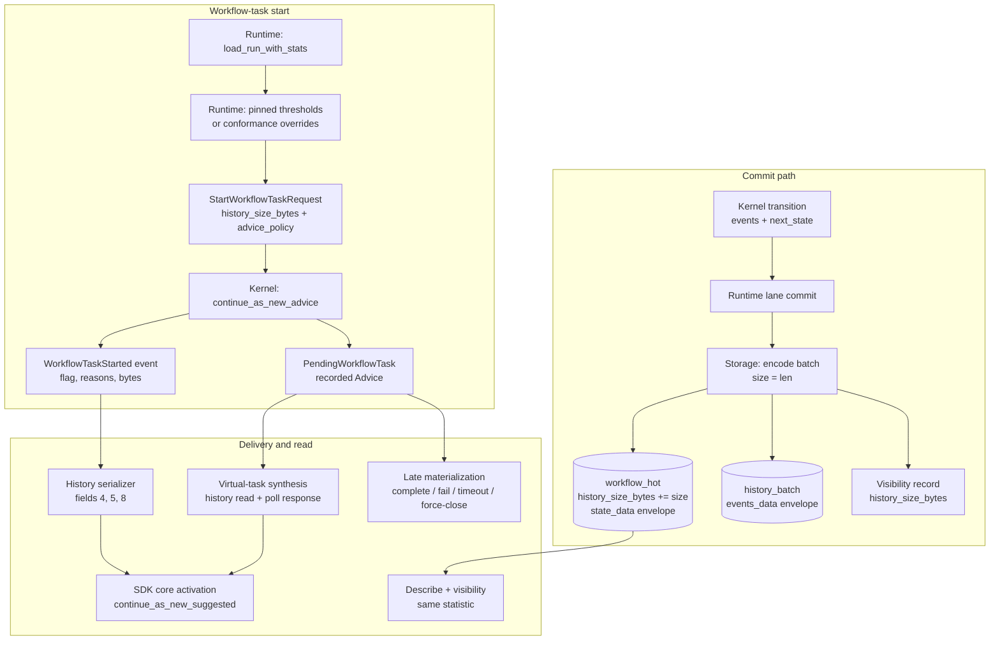

# Design Document: Continue-As-New Advice

## Overview

Storage gains one per-run statistic, the persisted History Size, maintained in the same
atomic commit that writes each history batch. The runtime reads it with the run state in
one round trip, resolves the v1.31.0 thresholds as pinned constants (overridable only
through the conformance bridge), and hands both to the kernel as command operands. The
kernel derives the Advice with one pure rule at every site that emits a
`WorkflowTaskStarted` event, records it on the event and on the pending task, copies it
unchanged wherever a virtual task's started event is materialized or synthesized, and
copies it back from the event during rebuild. The edge serializes all three fields;
Describe and visibility read the same statistic.

Requirements: [requirements.md](./requirements.md). Ground truth is v1.31.0
(`TEMPORAL_SERVER_COMPAT`) read from the pinned reference checkout (root §8); Tokeira
adopts the observable contract, not Temporal's structures.

### Ground-truth anchors (v1.31.0)

- Decision rule and reasons: `service/history/workflow/workflow_task_state_machine.go:487-491, 1440-1466`.
- Update reason and threshold derivation: `service/history/workflow/update/registry.go:182-184, 496-505`.
- Defaults: `common/dynamicconfig/constants.go:370-375, 412-417, 2299-2308`.
- Clear at schedule: `workflow_task_state_machine.go:98-99, 158-159`; materialize from
  stored task info: `:790-794, 881-885, 954-958`; reset adds a real started event:
  `service/history/ndc/workflow_resetter.go:533-550`.
- Stored task info: `proto/internal/temporal/server/api/persistence/v1/executions.proto:90-93`.
- Rebuild copies recorded values: `service/history/workflow/mutable_state_rebuilder.go:235-239`.
- Persistence-maintained statistic: `service/history/workflow/mutable_state_impl.go:380, 6610-6616`;
  Describe reads it: `service/history/api/describeworkflow/api.go:126`.
- Metric: `workflow_task_state_machine.go:539-548`.
- Wire: `proto/upstream/temporal/api/history/v1/message.proto:297-327`;
  `proto/upstream/temporal/api/enums/v1/workflow.proto:208-226`;
  `proto/upstream/temporal/api/workflow/v1/message.proto:45`.
- SDK: `temporalio-sdk-core-0.8.0/src/worker/workflow/machines/workflow_machines.rs:464-473, 892-894`;
  `temporalio-workflow-0.8.0/src/workflow_context.rs:1591-1597, 2098`.

## Dependencies and Non-Goals

### Owning relationships

- [conformance-config-override](../conformance-config-override/design.md) owns the
  override bridge; this design adds four `Wired` keys and their accessors under its rules.
- [transient-wft](../transient-wft/design.md) and
  [speculative-wft](../speculative-wft/design.md) own virtual-task suppression,
  materialization, and synthesis; this design adds the copied Advice to those paths.
- [workflow-reset](../workflow-reset/design.md) owns successor materialization and
  `replay_history_prefix`; this design adds the prefix-size recomputation and the
  rebuild copy.
- [embedded-engine-listener](../embedded-engine-listener/design.md) provides the network
  transport used for the transport-independence evidence.
- The storage crate's migration and schema-compatibility rules
  ([crates/tokeira-storage/AGENTS.md](../../../crates/tokeira-storage/AGENTS.md)) govern
  V068 and the startup guard.

### Non-goals

- Hard limits (`limit.historySize.error`, `limit.historyCount.error`,
  `history.maxTotalUpdates` enforcement) and warning thresholds.
- Forcing continuation or any lifecycle change driven by the Advice.
- Envelopes for activity, timer, dispatch, or side-table blobs.
- Public-proto byte accounting; the statistic is the store's own encoding.

## Architecture



Control plane: thresholds are resolved by the runtime, never by the kernel or the edge.
Data plane: the statistic is written by storage and read by the runtime, the engine's
describe resolver, and the visibility builder; no reader scans history.

## Components and Interfaces

### 1. Storage (`crates/tokeira-storage`)

**Codec envelopes** (`src/dsql/codec.rs`), following `BacklogEnvelope`:

```rust
const WORKFLOW_STATE_ENVELOPE_VERSION: u32 = 0x544B_5753; // "TKWS"
const HISTORY_BATCH_ENVELOPE_VERSION: u32 = 0x544B_4842;  // "TKHB"

#[derive(Serialize, Deserialize)]
struct WorkflowStateEnvelope { version: u32, state: WorkflowState }
#[derive(Serialize, Deserialize)]
struct HistoryBatchEnvelope { version: u32, events: Vec<HistoryEvent> }

pub fn encode_workflow_state(state: &WorkflowState) -> Result<Vec<u8>>;
pub fn decode_workflow_state(bytes: &[u8]) -> Result<WorkflowState>;   // BlobFormatError on mismatch
pub fn encode_history_events(events: &[HistoryEvent]) -> Result<Vec<u8>>;
pub fn decode_history_events(bytes: &[u8]) -> Result<Vec<HistoryEvent>>;

/// Encoded size of one history batch as this store persists it. Both stores
/// account with this function so the statistic has one definition.
pub fn history_batch_encoded_len(events: &[HistoryEvent]) -> Result<i64>;

#[derive(Debug, thiserror::Error)]
#[error("{kind} blob for run {run_key} has unsupported format version {observed:#x}; \
         hot state written before Tokeira 0.1.3 cannot be read, recreate the cluster")]
pub struct BlobFormatError { pub kind: &'static str, pub run_key: RunKey, pub observed: u32 }
```

A pre-envelope `state_data` blob begins with the 16-byte run-key length prefix (`0x10`);
a pre-envelope `events_data` blob begins with the batch length. Neither equals the magic,
so both decode to `BlobFormatError`, never to a value. The codec module lives under
`dsql/` today; the size function and envelopes move to a `codec` module shared by both
stores so the in-memory store can use them without the `dsql` feature.

**Repository API** (`src/api.rs`):

```rust
#[derive(Clone, Copy, Debug, Default, PartialEq, Eq, Serialize, Deserialize)]
pub struct RunHistoryStats { pub history_size_bytes: i64 }

pub trait RunRepository {
    /// Load the run and its persisted history statistics in one read.
    async fn load_run_with_stats(&self, run_key: RunKey) -> Result<(LoadedRun, RunHistoryStats)>;
    /// Existing; delegates to `load_run_with_stats` and drops the stats.
    async fn load_run(&self, run_key: RunKey) -> Result<LoadedRun>;
}
```

The visibility-record builder ([api.rs:2025-2060](../../../crates/tokeira-storage/src/api.rs))
takes the statistic as a parameter and sets `history_size_bytes` from it.

**DSQL** (`migrations/V068__workflow_hot_history_size.sql`, `src/dsql/run_repository/`):

```sql
ALTER TABLE workflow_hot ADD COLUMN history_size_bytes BIGINT;
```

- Commit: the OCC read becomes `SELECT transition_seq, history_size_bytes FROM
  workflow_hot WHERE run_key = $1 FOR UPDATE`; NULL reads as `0`; the upsert writes
  `prior + history_batch_encoded_len(events)` (saturating at `i64::MAX`). A transition
  with no events writes `prior`. A new run writes the batch size.
- Load: `SELECT state_data, history_size_bytes FROM workflow_hot WHERE run_key = $1`.
- Reset: `do_materialize_reset_successor` sets the successor's column to the encoded
  size of the batches it inserts for the copied prefix.
- Delete: the row removal already drops the column value.
- Migration guard: when the applied head is below 68 and the target is at least 68, the
  runner checks `SELECT 1 FROM workflow_hot LIMIT 1` before applying V068 and fails the
  Schema phase with the Requirement 10.4 message when a row exists. The check is
  specific to this version boundary.

**In-memory store** (`src/memory.rs`): a `history_size: HashMap<RunKey, i64>` beside
`runs`, updated in `commit_transition*` with `history_batch_encoded_len`, copied for
reset successors, removed with the run, included in the snapshot document;
`SNAPSHOT_FORMAT_VERSION` moves from 3 to 4.

### 2. Kernel (`crates/tokeira-kernel`), pure

```rust
// event.rs
#[derive(Clone, Copy, Debug, PartialEq, Eq, PartialOrd, Ord, Serialize, Deserialize)]
pub enum SuggestContinueAsNewReason { HistorySizeTooLarge, TooManyHistoryEvents, TooManyUpdates }

HistoryEventKind::WorkflowTaskStarted {
    // existing fields unchanged …
    history_size_bytes: i64,
    suggest_continue_as_new: bool,
    suggest_continue_as_new_reasons: Vec<SuggestContinueAsNewReason>,
}

// state.rs
pub struct PendingWorkflowTask {
    // existing fields …
    /// Advice recorded when this task last started; cleared at schedule.
    pub history_size_bytes: i64,
    pub suggest_continue_as_new: bool,
    pub suggest_continue_as_new_reasons: Vec<SuggestContinueAsNewReason>,
}
pub struct WorkflowState {
    // existing fields …
    /// Updates that reached a completed outcome in this run
    /// (`update/registry.go:92, 220, 382 @ v1.31.0`).
    pub completed_update_count: u32,
}

// command.rs
#[derive(Clone, Copy, Debug, PartialEq, Eq, Serialize, Deserialize)]
pub struct ContinueAsNewAdvicePolicy {
    pub history_size_threshold_bytes: i64,
    pub history_count_threshold: i64,
    /// `0` disables the update reason (`registry.go:497-500 @ v1.31.0`).
    pub total_updates_suggest_threshold: u32,
}
pub struct StartWorkflowTaskRequest {
    // `suggest_continue_as_new: bool` is removed; `history_size_bytes` stays
    pub history_size_bytes: i64,
    pub advice_policy: ContinueAsNewAdvicePolicy,
    // …
}
// StartRequest and SignalWithStartRequest gain `advice_policy` for the
// sync-matched first task; FailWorkflowTaskRequest gains `history_size_bytes`
// and `advice_policy` for the reset-synthesized started event.

// kernel.rs
#[derive(Clone, Debug, PartialEq, Eq)]
pub struct ContinueAsNewAdvice { pub suggest: bool, pub reasons: Vec<SuggestContinueAsNewReason> }

pub fn continue_as_new_advice(
    history_size_bytes: i64,
    started_event_id: i64,
    in_flight_updates: usize,
    completed_update_count: u32,
    policy: ContinueAsNewAdvicePolicy,
) -> ContinueAsNewAdvice;
```

Sites:

- **Derive** with `continue_as_new_advice`: the polled-start branches at
  [kernel.rs:1735-1760](../../../crates/tokeira-kernel/src/kernel.rs), the sync-match
  start at [kernel.rs:6958](../../../crates/tokeira-kernel/src/kernel.rs) (bytes `0`),
  and the reset-synthesized started event at
  [kernel.rs:3162](../../../crates/tokeira-kernel/src/kernel.rs). `started_event_id` is
  the id the builder is about to assign. In-flight updates are
  `admitted_updates ∪ pending_updates` by id.
- **Copy** from the pending record: late materialization in
  `apply_workflow_task_completed` (2024), `apply_workflow_task_failed` (3134),
  `apply_workflow_task_timed_out` (3654), and `force_close_started_workflow_task` (6675).
- **Clear** in `schedule_workflow_task` and `schedule_speculative_workflow_task`.
- **Count** in the `UpdateProtocolBody::Completed` arm
  ([kernel.rs:6080-6160](../../../crates/tokeira-kernel/src/kernel.rs)).
- **Rebuild**: the `WorkflowTaskStarted` arm of `replay_history_prefix`
  ([kernel.rs:3976-4000](../../../crates/tokeira-kernel/src/kernel.rs)) copies the three
  fields into the pending record.

### 3. Runtime (`crates/tokeira-runtime`)

```rust
// runtime/workflow_task.rs — pinned v1.31.0 defaults (constants.go:370-375, 412-417, 2299-2308)
const HISTORY_SIZE_SUGGEST_CONTINUE_AS_NEW_BYTES: i64 = 4 * 1024 * 1024;
const HISTORY_COUNT_SUGGEST_CONTINUE_AS_NEW: i64 = 4 * 1024;
const WORKFLOW_EXECUTION_MAX_TOTAL_UPDATES: i64 = 2000;
const MAX_TOTAL_UPDATES_SUGGEST_CONTINUE_AS_NEW_THRESHOLD: f64 = 0.9;

/// Off-feature: the constants. On-feature: `crate::conformance::reads()` for
/// `limit.historySize.suggestContinueAsNew`, `limit.historyCount.suggestContinueAsNew`,
/// `history.maxTotalUpdates`, `history.maxTotalUpdates.suggestContinueAsNewThreshold`,
/// falling back per key. The update threshold is ceil(max_total × ratio), `0` when
/// either operand is `0` (`registry.go:182-184 @ v1.31.0`).
fn continue_as_new_advice_policy() -> ContinueAsNewAdvicePolicy;
```

- `resolve_polled_workflow_task_target` uses `load_run_with_stats` and returns the stats;
  `start_polled_workflow_task_inner` fills `history_size_bytes` and `advice_policy`.
- The runtime fills `advice_policy` on `Start` and `SignalWithStart` before submit, and
  `history_size_bytes` plus `advice_policy` on the reset-failing command after
  `materialize_reset_successor`, using the successor's stats.
- `StartedWorkflowTask` gains `advice: RecordedAdvice { history_size_bytes, suggest,
  reasons }` copied from `new_state.pending_workflow_task`.
- After a start commit that recorded `suggest = true`, the runtime records
  `tokeira_workflow_suggest_continue_as_new_total{reason}` once per reason, in
  `runtime_metrics` next to `record_workflow_task_started`.

### 4. Edge and engine (`crates/tokeira-edge`, `crates/tokeira-engine`)

- `history_serializer.rs`: map `SuggestContinueAsNewReason` to
  `tokeira_proto::enums::SuggestContinueAsNewReason` and emit
  `suggest_continue_as_new_reasons` beside the two existing fields.
- `workflow_service.rs` virtual-suffix synthesis and `from_internal.rs` poll synthesis
  fill the three fields from the pending record and `started.advice` respectively.
- `StoreExecutionResolver` in the engine uses `load_run_with_stats`, fills
  `history_size_bytes` from the stats and the external-payload statistics from
  `state.external_payload_count` / `state.external_payload_size_bytes`, and drops the
  full-history read. `WorkflowExecutionDescription.history_size_bytes` is documented as
  the persisted History Size.

### 5. Conformance (`crates/tokeira-conformance`, ledger, fork)

- `KEY_CLASSIFICATION`: the four keys become `Wired` with a comment naming the runtime
  accessor; `ValueType::Float` is added for the ratio key if absent. The
  `limit.historySize.suggestContinueAsNew` entry leaves the not-enforced group.
- `docs/conformance/v1.31.0/temporal-configuration.md`: the four rows become
  "conformance-only override … wired".
- Fork: remove the `TestTransientWorkflowTaskHistorySize` entry from
  `tests/testcore/tokeira_conformance_skip.go`; rerun Tier 1.6 per
  [docs/testing/functional-conformance-harness.md](../../../docs/testing/functional-conformance-harness.md);
  update the Tier 1.6 row in [docs/readiness/conformance.md](../../../docs/readiness/conformance.md).

## Data Models

| Type | Field | Contract source |
|---|---|---|
| `workflow_hot.history_size_bytes` (V068) | persisted History Size | `ExecutionStats.HistorySize` (`mutable_state_impl.go:6610-6616 @ v1.31.0`) |
| `RunHistoryStats` | `history_size_bytes: i64` | same |
| `HistoryEventKind::WorkflowTaskStarted` | `suggest_continue_as_new: bool` | `WorkflowTaskStartedEventAttributes.suggest_continue_as_new = 4` |
| | `suggest_continue_as_new_reasons` | field 8; enum `workflow.proto:208-226` |
| | `history_size_bytes: i64` | field 5 |
| `PendingWorkflowTask` | the same three | `executions.proto:90-93 @ v1.31.0` (fields 69, 110, 70) |
| `WorkflowState` | `completed_update_count: u32` | `registry.completedCount` (`registry.go:92`) |
| `ContinueAsNewAdvicePolicy` | three thresholds | `constants.go:370-375, 412-417, 2299-2308` |
| `StartedWorkflowTask` | `advice: RecordedAdvice` | Requirement 4.3 |
| `WorkflowStateEnvelope`, `HistoryBatchEnvelope` | `version: u32` magic | Requirement 10.1, 10.2; `BacklogEnvelope` precedent |
| Visibility record | `history_size_bytes` | `HistorySizeBytes` system search attribute |

## Correctness Properties

### Property 1: History Size is a reference-model accumulator

*For any* sequence of committed transitions for a run in either store, the persisted
History Size after each commit SHALL equal the sum of `history_batch_encoded_len` over
every batch committed so far; it SHALL be non-decreasing; a fresh run SHALL start at `0`;
a reset successor SHALL start at the encoded size of its copied prefix; deleting the run
SHALL remove it; and every visibility record built from a commit SHALL carry the value at
that commit.

**Validates: Requirements 1.1, 1.2, 1.3, 1.4, 1.5, 1.6, 1.7, 1.9, 1.10**

### Property 2: The advice rule is a deterministic function of its operands

*For any* History Size, started event id, in-flight and completed update counts, and
policy, `continue_as_new_advice` SHALL return `HISTORY_SIZE_TOO_LARGE` iff size ≥ size
threshold, `TOO_MANY_HISTORY_EVENTS` iff started id ≥ count threshold,
`TOO_MANY_UPDATES` iff the update threshold is non-zero and in-flight + completed ≥ it,
in enum order, with the flag true iff the list is non-empty; and the same operands SHALL
always yield the same result.

**Validates: Requirements 2.1, 2.2, 2.3, 2.4, 2.12**

### Property 3: Recorded Advice is identical on every delivery path

*For any* run and any workflow task, the Advice observed through the persisted started
event, the history-read synthesis, the poll-response synthesis, the late-materialized
event, the rebuilt pending record, and either transport SHALL be identical to the values
recorded when that attempt started, regardless of any threshold change after the start.

**Validates: Requirements 2.5, 2.6, 2.13, 4.1, 4.2, 4.3, 4.4, 5.4, 6.1, 6.2, 6.3**

### Property 4: Each attempt recomputes from the values at its own start

*For any* sequence of workflow-task attempts for one run (complete, fail, time out) with
any interleaved signals and any threshold changes between attempts, each attempt's
recorded History Size SHALL be greater than or equal to the previous attempt's, each
attempt's flag and reasons SHALL follow Property 2 for the thresholds in force at that
attempt's start, and the pending record's Advice SHALL be cleared at every schedule.

**Validates: Requirements 2.7, 2.8**

### Property 5: Successors account for themselves

*For any* run that produces a continue-as-new, retry, or cron successor, the successor's
first started event SHALL record a History Size of `0` and a count reason evaluated
against its own event ids; *for any* reset, the successor's first derived Advice SHALL use
the copied-prefix size and, when the fork task was scheduled but not started, SHALL be
derived by the rule rather than copied.

**Validates: Requirements 1.5, 1.6, 2.9, 2.10**

### Property 6: Policy accessors equal the pinned constants off-feature

*For any* runtime build without the `conformance` feature, `continue_as_new_advice_policy`
SHALL return exactly the v1.31.0 defaults; *for any* build with the feature and any
installed override set, it SHALL return the override for each overridden key and the
default for every other key, with the update threshold derived as ceil(max_total × ratio)
and `0` when either operand is `0`.

**Validates: Requirements 3.1, 3.2, 3.3, 3.4, 3.6**

### Property 7: Wire round trip preserves the Advice

*For any* kernel `WorkflowTaskStarted` event, serializing to the public proto and decoding
with `tokeira_proto` SHALL yield equal `suggest_continue_as_new`, `history_size_bytes`,
and `suggest_continue_as_new_reasons`, with the reasons list empty iff the flag is false.

**Validates: Requirements 5.1, 5.2**

### Property 8: One statistic, three readers

*For any* run at any committed point, `DescribeWorkflowExecution.history_size_bytes`, the
visibility `HistorySizeBytes` for that transition, and the History Size operand supplied
to the next workflow-task start SHALL be the same number, and Describe SHALL issue no
history read for statistics.

**Validates: Requirements 7.1, 7.2, 7.3, 7.4, 1.8**

### Property 9: Envelopes round-trip and reject pre-envelope blobs

*For any* `WorkflowState` and any history batch, encode then decode SHALL return an equal
value; *for any* pre-envelope blob, decode SHALL return `BlobFormatError` naming the kind
and observed version and SHALL NOT return a value; and a snapshot with a superseded
format version SHALL fail startup.

**Validates: Requirements 10.1, 10.2, 10.3, 10.5**

### Property 10: The Advice is advisory

*For any* command sequence applied under two policies that differ only in thresholds, the
resulting kernel states SHALL differ only in recorded Advice fields, the emitted events
SHALL differ only in those fields, and no lifecycle, dispatch, timer, or update effect
SHALL differ.

**Validates: Requirements 8.1, 8.2**

### Property 11: Update counting matches the registry model

*For any* sequence of update admissions, acceptances, completions, and rejections,
in-flight plus completed as computed by the kernel SHALL equal a reference registry that
counts admitted-or-accepted updates as in flight and increments completed on each
completion outcome, never on rejection.

**Validates: Requirements 2.3, 2.11**

## Error Handling

| Condition | Internal error | External status/code |
|---|---|---|
| Pre-envelope `state_data` or `events_data` blob read | `BlobFormatError` (storage) | `INTERNAL` on the RPC that loaded it; startup failure when hit during recovery |
| V068 would apply to a non-empty `workflow_hot` | migration runner error naming the recreate requirement | embedded: `EmbeddedEngineStartError::Phase { Schema }`; daemon: startup error |
| Snapshot with format version 3 | existing unsupported-version snapshot error | startup failure |
| Override value of the wrong type | existing bridge rejection | existing control-listener response |
| History Size addition overflows `i64` | saturate at `i64::MAX` | none |
| Advice fields absent on a rebuilt event (never, all fields are always emitted) | n/a | n/a |

## Testing Strategy

- **Property tests (required):**
  - Properties 2, 4, 5 (kernel part), 10, 11, and the rebuild leg of Property 3 in
    `crates/tokeira-kernel/tests/property_tests.rs` with `proptest`, at least 100 cases
    each, tagged `// Feature: continue-as-new-advice, Property N: …`.
  - Properties 1 and 9 in `crates/tokeira-storage` (`memory.rs` tests for the model;
    codec tests for the envelopes; the DSQL leg under `dsql-integration` on the live
    host).
  - Property 6 as a compile-configuration test in `crates/tokeira-runtime`, mirroring the
    override spec's off-feature equivalence test.
  - Property 7 in `crates/tokeira-edge/src/translate/history_serializer.rs` tests.
  - Properties 3 (delivery paths) and 8 as generated-sequence integration tests in
    `crates/tokeira-engine/tests/continue_as_new_advice.rs`, including the transport leg
    over `Engine::listen`.
- **Unit tests (example-based):** boundary values 4095/4096/4097 events and one byte
  below/at/above 4 MiB through real commits; sync-match first task records `0`; the
  transient sequence of `TestTransientWorkflowTaskHistorySize` reproduced in-process;
  V068 guard on an empty and a non-empty table; `BlobFormatError` message text.
- **Integration tests:** the pinned Rust SDK worker observing `continue_as_new_suggested()`
  flip and continuing as new with stable workflow id, new run id, and surviving state,
  run from the existing SDK spike crate under `spikes/`; Tier 1.6 of the functional
  conformance corpus against a `--features conformance` `tokeirad`.
- **Placement:** storage first, then kernel, runtime, edge/engine, conformance, per the
  task plan.
