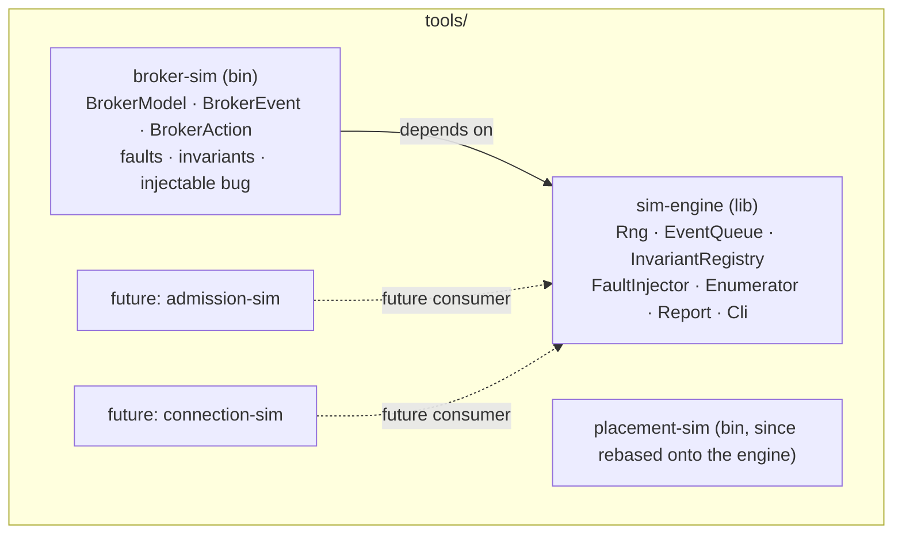
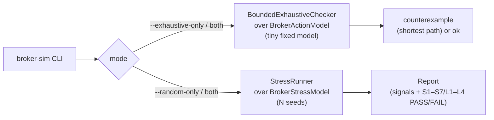
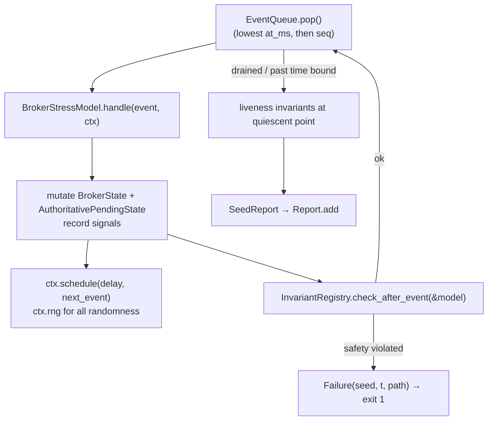
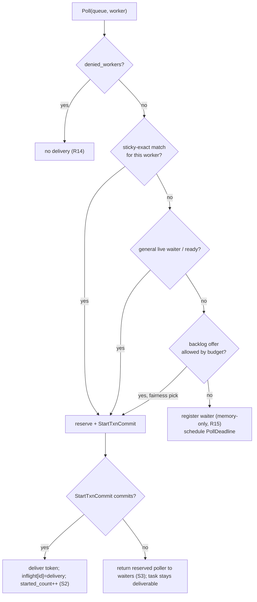

# Design Document: Delivery Broker Simulator and Shared Simulation Engine

## Overview

This design delivers two things, in dependency order:

- **Deliverable A — a shared simulation engine** (`tools/simulation/engine`, a library crate): the
  reusable mechanics that `tools/simulation/placement` originally hand-rolled inline — a deterministic
  seeded event queue, an `XorShift64` RNG, a per-event invariant-check loop, a named-invariant
  registry with PASS/FAIL aggregation, a fault-injection framework, a bounded-exhaustive
  state-space enumerator, aggregate reporting, and CLI scaffolding — generalised behind small
  traits so any model can drive them.
- **Deliverable B — the delivery-broker simulator** (`tools/simulation/broker`, a binary crate): a pure
  deterministic re-model of Tokeira's delivery broker
  (`docs/architecture/040-delivery-broker.md`, `crates/tokeira-runtime/src/broker.rs`) built on
  the engine, exercising the three-tier delivery model, reservation-based matching, sticky
  promotion, dedup, the grace scanner, denied workers, the sweeper, the broker control loop, and
  delivery-quality signals — and falsifying the broker's central correctness claim under
  adversarial schedules.

The engine boundary is validated by the broker simulator now and is general enough to host the
future admission-control (`055-admission-control.md`) and connection-management
(`060-connection-management.md`) simulators as additional consumers without modification
(Requirement 7).

### Design stance: re-model, do not import

`placement-sim` re-models DSQL and the runtime rather than importing them; this design makes the
same choice for the broker (Requirement 8). The simulator imports neither `tokeira-runtime` nor
`tokio`. The fidelity risk — the model drifting from `crates/tokeira-runtime/src/broker.rs` as the
broker evolves — is accepted and managed by (a) keeping the model's vocabulary aligned with
`broker.rs` (`QueueKey`, `sticky_ready`/`general_ready`, `ReservedPoller`, the dedup keys,
`denied_workers`), and (b) a README note (Requirement 38) stating the re-modeling decision and the
obligation to keep the two aligned. The simulator is a *confidence instrument*, not the broker.

### What stays faithful to `placement-sim`

The engine is a strict generalisation of `placement-sim`'s original proven shape, not a redesign:

| `placement-sim` (originally inline) | Engine (generic) |
|---|---|
| `XorShift64` | `sim_engine::Rng` (same algorithm, same `range` semantics) |
| `BinaryHeap<Event>`, `Event { at_ms, seq, kind }`, reverse-ordered `Ord` | `sim_engine::EventQueue<E>`, `Scheduled<E> { at_ms, seq, event }` |
| `Sim::handle` + `check_invariants` after every pop | `StressRunner` driving `StressModel::handle` then the `InvariantRegistry` |
| hardcoded fault arms in `schedule_workload` | `FaultInjector` with model-registered faults |
| `run_bounded_exhaustive` + `MiniState`/`MiniAction` + `best_remaining_by_state` dedup | `BoundedExhaustiveChecker` over `ExhaustiveModel` |
| `AggregateReport` | `sim_engine::Report` with model-defined signal counters |
| inline `env::args` parsing | `sim_engine::Cli` parsing shared flags + model flags |
| `SimError` / `CounterExample` Display | `sim_engine::Failure` / `Counterexample` Display |

## Architecture

Two crates under `tools/simulation/`, alongside `placement` (which has since been refactored onto
this engine; that rebase was out of scope for this spec and is tracked separately).



### Two verification modes (both required, mirroring `placement-sim`)



### Stress-mode event flow (broker model)



The loop is the `placement-sim` loop generalised: pop the earliest event, apply it to the model
(the only place state changes), let the model schedule follow-on events through a context that
owns the RNG and the clock, then evaluate safety invariants after every event and liveness
invariants at the quiescent point. No wall-clock, no async, no I/O (Requirements 1, 8, 32).

## Components and Interfaces

### Deliverable A — `tools/simulation/engine`

#### Rng (Requirement 1.3, 1.4)

```rust
/// Deterministic xorshift64 PRNG. Same algorithm as placement-sim so behaviour
/// and reproducibility are identical. All model randomness MUST flow through it.
pub struct Rng { state: u64 }

impl Rng {
    pub fn new(seed: u64) -> Self;            // seed.max(1)
    pub fn next_u64(&mut self) -> u64;
    pub fn range(&mut self, start: u64, end_exclusive: u64) -> u64;  // start <= result < end
    pub fn bool_with_percent(&mut self, percent: u64) -> bool;       // convenience
}
```

#### EventQueue and scheduling (Requirement 1.1, 1.2, 1.5, 1.6)

```rust
/// One scheduled event. Ordered by (at_ms asc, seq asc); seq is a monotonic
/// tie-breaker so equal-timestamp events have a deterministic order.
pub struct Scheduled<E> { pub at_ms: u64, pub seq: u64, pub event: E }

/// Min-ordered priority queue over simulated time. No wall clock is read.
pub struct EventQueue<E> { /* BinaryHeap<Reverse-ordered Scheduled<E>>, next_seq */ }

/// Handed to the model during handle(); the only way to advance the sim.
pub struct SimCtx<'a, E> {
    pub now_ms: u64,
    rng: &'a mut Rng,
    queue: &'a mut EventQueue<E>,
}
impl<'a, E> SimCtx<'a, E> {
    pub fn rng(&mut self) -> &mut Rng;
    pub fn schedule(&mut self, delay_ms: u64, event: E);   // enqueue at now_ms + delay_ms
    pub fn now_ms(&self) -> u64;
}
```

#### StressModel trait (Requirement 1, 3, 8)

```rust
/// A model the StressRunner can drive. Pure: no I/O, no async, no real time.
pub trait StressModel {
    type Event: Clone;

    /// Seed the queue with initial events (bootstrap acquisitions, the workload,
    /// and the fault schedule). Equivalent to placement-sim's bootstrap()+schedule_workload().
    fn bootstrap(&mut self, ctx: &mut SimCtx<'_, Self::Event>);

    /// Apply one event. The only place model state changes. May schedule follow-ons.
    fn handle(&mut self, event: Self::Event, ctx: &mut SimCtx<'_, Self::Event>);

    /// Named signal counters this model reports (Requirement 5.5, 5.1).
    fn signals(&self) -> &SignalCounters;

    /// Liveness evaluation point: true when the model is quiescent enough to
    /// judge liveness invariants (Requirement 2.5).
    fn is_quiescent(&self) -> bool { false }
}
```

#### Invariants and registry (Requirement 2)

```rust
pub enum InvariantClass { Safety, Liveness }

/// A named correctness property over model state. Returns Some(reason) when
/// the Falsification_Condition holds.
pub struct Invariant<M> {
    pub name: &'static str,        // e.g. "S2", "L4"
    pub class: InvariantClass,
    pub check: fn(&M) -> Option<String>,
}

pub struct InvariantRegistry<M> { invariants: Vec<Invariant<M>> }
impl<M> InvariantRegistry<M> {
    pub fn register(&mut self, inv: Invariant<M>);
    /// Evaluate all Safety invariants (called after every event).
    fn check_safety(&self, model: &M) -> Option<Violation>;
    /// Evaluate Liveness invariants (called at the quiescent point / run end).
    fn check_liveness(&self, model: &M) -> Option<Violation>;
}
```

`check` returning `Option<String>` keeps each invariant a pure function of model state — exactly
how `placement-sim`'s `check_invariants` reads `self.dsql`/`self.edge` and returns an error string.
The registry records per-name PASS/FAIL across the run (Requirement 2.4).

#### FaultInjector (Requirement 3)

```rust
/// A named adversarial fault. `schedule` enqueues the fault's events using only
/// the Rng so timing is reproducible per seed (Requirement 3.2).
pub struct Fault<E> {
    pub name: &'static str,
    pub schedule: fn(&mut SimCtx<'_, E>),
}

pub struct FaultConfig { enabled: HashMap<&'static str, bool> }  // Requirement 3.3

pub struct FaultInjector<E> { faults: Vec<Fault<E>>, config: FaultConfig, counts: HashMap<&'static str, u64> }
```

Faults are model-defined (Requirement 3.5); the engine only schedules them and counts injections
(Requirement 3.4). The broker model registers its fault set (Requirement 34) into this injector
during `bootstrap`.

#### ExhaustiveModel trait and checker (Requirement 4)

```rust
/// A tiny model whose entire reachable state space can be enumerated.
/// State must be Hash+Eq+Clone for visited-set dedup.
pub trait ExhaustiveModel: Clone + Eq + std::hash::Hash {
    type Action: Clone + std::fmt::Debug;
    fn initial() -> Self;
    fn actions() -> Vec<Self::Action>;                 // every action attempted at each state
    fn apply(&mut self, action: &Self::Action) -> Result<(), String>;  // Err = invalid transition / bug
    fn check(&self) -> Option<String>;                 // Some(reason) = safety invariant violated
}

pub struct EnumReport { pub states_explored: u64, pub transitions_tried: u64 }
pub struct Counterexample<A> { pub depth: usize, pub message: String, pub path: Vec<A> }

/// DFS to bounded depth with shortest-path-to-state dedup, exactly mirroring
/// placement-sim's `best_remaining_by_state` pruning so revisits at >= remaining
/// depth are skipped. Returns the shortest path to a violating state.
pub fn run_bounded_exhaustive<M: ExhaustiveModel>(max_depth: usize)
    -> Result<EnumReport, Counterexample<M::Action>>;
```

The dedup uses `placement-sim`'s exact technique: a `HashMap<State, usize>` of the best
(largest) remaining depth seen for each state; a state reached again with `remaining <=
previous_best` is pruned (Requirement 4.5). Invariants are checked on the initial state and after
every transition; the first violation returns the accumulated `path` (Requirement 4.3).

#### Report (Requirement 5, 39)

```rust
/// Model-defined named counters. The engine holds no broker/placement-specific names.
pub struct SignalCounters { counts: BTreeMap<&'static str, u64> }
impl SignalCounters { pub fn incr(&mut self, name: &'static str); pub fn add(&mut self, name: &'static str, n: u64); pub fn get(&self, name: &'static str) -> u64; }

pub struct Report {
    seeds: u64,
    signals: SignalCounters,                       // summed across seeds (Requirement 5.1)
    invariant_results: BTreeMap<&'static str, InvariantOutcome>,  // PASS/FAIL per name (5.2)
    first_failure: Option<Violation>,              // failing seed + context (5.4)
}
impl Report {
    pub fn add_seed(&mut self, seed: SeedReport);
    pub fn overall_passed(&self) -> bool;          // false if any Safety FAIL (5.3)
    pub fn print(&self);
}
```

#### Cli (Requirement 6)

```rust
/// Parses the shared placement-sim vocabulary; models add their own flags.
pub struct CliSpec { extra_flags: Vec<&'static str> }   // e.g. "--buggy-token-before-commit"
pub struct CliArgs {
    pub seeds: u64,            // default 250
    pub ops: usize,            // default 800
    pub time_ms: u64,          // default 6000
    pub verbose: bool,
    pub exhaustive_depth: usize,  // default 12
    pub run_stress: bool,      // false when --exhaustive-only
    pub run_exhaustive: bool,  // false when --random-only
    pub flags: HashSet<String>,   // model-specific flags that were set
}
pub fn parse(spec: &CliSpec) -> CliArgs;
```

The engine supplies its own RNG and enumerator and pulls in no `proptest` (Requirements 6.6,
34.5).

### Deliverable B — `tools/simulation/broker`

#### Domain identifiers (mirroring `crates/tokeira-runtime/src/broker.rs` and `tokeira-types`)

Newtypes re-modelled locally (not imported), matching the broker's keying so the model reads the
same as the code it mirrors:

```rust
struct NamespaceId(u32); struct TaskQueueName(u32); struct WorkerIdentity(u32);
struct RunKey(u64); struct LogicalTaskSeq(u64); struct ActivityId(u32); struct Attempt(u32);
struct BuildId(u32); struct DeploymentName(u32);
struct DeliveryId(u64);      // identity of one delivery/reservation (for stale-completion checks)
struct Revision(u64);

/// The broker's queue-family key (broker.rs QueueKey): more than queue name.
struct QueueKey { namespace: NamespaceId, task_queue: TaskQueueName, kind: TaskKind,
                  deployment: Option<DeploymentName>, build: Option<BuildId>, partition: PartitionIx }
enum TaskKind { Workflow, Activity, Query }

/// Dedup identity (broker.rs `enqueued` set):
enum LogicalTaskId { Wft(RunKey, LogicalTaskSeq), Activity(RunKey, ActivityId, Attempt) }
```

`partition` makes a logical queue's partitions distinct queue families (Requirement 20).

#### BrokerState — the broker as a pure state machine (Requirement 8, 9–22)

```rust
struct BrokerState {
    // Tier B live-ready, split exactly like broker.rs:
    sticky_ready: BTreeMap<QueueKey, VecDeque<ReadyTask>>,    // sticky-preferred tasks
    general_ready: BTreeMap<QueueKey, VecDeque<ReadyTask>>,   // general tasks
    // Tier C durable backlog (priority-ordered, fairness applies here only):
    backlog: BTreeMap<QueueKey, BinaryHeap<BacklogItem>>,
    // In-memory waiters (long polls — Requirement 15):
    waiters: BTreeMap<QueueKey, VecDeque<Waiter>>,
    waiter_counts: BTreeMap<QueueKey, usize>,
    // Dedup set (broker.rs `enqueued`):
    enqueued: HashSet<LogicalTaskId>,
    // Query tasks (bypass dedup + backlog — Requirement 18):
    query_ready: BTreeMap<QueueKey, VecDeque<QueryTask>>,
    // Denied workers (broker.rs `denied_workers`):
    denied_workers: HashSet<(NamespaceId, TaskQueueName, WorkerIdentity)>,
    // In-flight deliveries: which DeliveryId currently owns each started task (Requirement 20 S4):
    inflight: HashMap<LogicalTaskId, Delivery>,
    // Control loop budget split (Requirement 21):
    budget: BudgetSplit,
    // Per-queue delivery-quality accumulators (Requirement 22):
    quality: BTreeMap<QueueKey, QueueQuality>,
}

struct ReadyTask { id: LogicalTaskId, queue: QueueKey, sticky_target: Option<WorkerIdentity>,
                   entered_at_ms: u64, sticky_ttl_ms: Option<u64> }
struct Delivery { delivery_id: DeliveryId, worker: WorkerIdentity, lease_until_ms: u64, committed: bool }
```

#### AuthoritativePendingState — the truth the broker is an optimiser over (Requirement 8.4, 16)

```rust
/// Per-run authoritative pending work — the analog of workflow_hot.pending_wft /
/// activity_state. Held SEPARATELY from BrokerState so discarding broker state
/// (a crash) never loses authoritative tasks. This is the heart of the central
/// correctness claim the simulator falsifies.
struct AuthoritativePendingState {
    pending_wft: BTreeMap<RunKey, PendingWft>,             // at most one per run (S1)
    pending_activities: BTreeMap<(RunKey, ActivityId), PendingActivity>,
    started_count: HashMap<LogicalTaskId, u32>,            // for S2 double-start detection
    expired_sticky: BTreeSet<RunKey>,                      // sticky claims to republish general (S7)
}
```

#### BrokerModel (the StressModel)

```rust
struct BrokerModel {
    cfg: BrokerCfg,                 // grace_window_ms, max_waiters, partitions, budget bands, sticky_ttl
    broker: BrokerState,
    authoritative: AuthoritativePendingState,
    signals: SignalCounters,
    bug: Option<InjectedBug>,       // Requirement 35
    rng_pool: WorkloadShape,        // run/queue/worker id pools
}
impl StressModel for BrokerModel { type Event = BrokerEvent; /* ... */ }
```

#### BrokerEvent (the event taxonomy, mirroring broker.rs operations + faults)

```rust
enum BrokerEvent {
    // Workload:
    PublishWft { id: LogicalTaskId, queue: QueueKey, sticky_target: Option<WorkerIdentity> },  // R9, R11, R12
    PublishActivity { id: LogicalTaskId, queue: QueueKey },                                     // R17
    PublishQuery { queue: QueueKey, sticky_target: Option<WorkerIdentity> },                    // R18
    Poll { queue: QueueKey, worker: WorkerIdentity, deadline_ms: u64, attempt: u8 },            // R10, R15
    DirectClaim { queue: QueueKey, run_key: RunKey },                                           // R19
    // Reservation/commit (split so the commit race is observable — like placement-sim's
    // begin_transaction/commit split):
    ReserveAndStart { id: LogicalTaskId, queue: QueueKey, worker: WorkerIdentity, delivery_id: DeliveryId },  // R10
    StartTxnCommit { id: LogicalTaskId, delivery_id: DeliveryId, will_commit: bool },           // R10, S3
    CompleteTask { id: LogicalTaskId, delivery_id: DeliveryId },                                // S4
    // Timers/derived:
    GraceScan { queue: QueueKey },                  // R13 spill to backlog
    StickyTtlExpire { id: LogicalTaskId },          // R11 promotion
    PollDeadline { queue: QueueKey, waiter_id: u64 },  // R15 timeout
    ControlLoopTick,                                // R21 budget recompute
    // Faults (Requirement 34):
    BrokerCrash,                                    // R16, S5, L1 — discard BrokerState, keep authoritative
    LeaseExpire { id: LogicalTaskId, delivery_id: DeliveryId },  // S4, L1 redelivery
    WorkerCrash { worker: WorkerIdentity },         // L1, S5
    DenyWorker { ns: NamespaceId, tq: TaskQueueName, worker: WorkerIdentity },  // R14
    PartitionBacklogPressure { queue: QueueKey },   // R20 sync-match collapse
    SustainedBacklogAge { queue: QueueKey },        // R21 budget stress
    DuplicatePublish { id: LogicalTaskId, queue: QueueKey },  // S6, S2
}
```

#### Delivery decision (the tier ladder, Requirement 9, 11 ordering)

A poll resolves through the broker's documented preference order
(`docs/architecture/040-delivery-broker.md` "Sticky-first, not sticky-only"):



Tier A (inline) is the special case where `Poll` finds a freshly `Publish`ed task already matched
at publish time; Tier B is the live-ready queues; Tier C is the grace-scanner-spilled backlog. The
`ReserveAndStart` → `StartTxnCommit` split is the reservation⇄commit coupling (S3): the token is
delivered only on the commit event, and a non-committing commit returns the reserved poller.

#### Exhaustive model (`BrokerActionModel`, Requirement 4, 31, 35)

A separate, tiny, `Hash+Eq` model for `run_bounded_exhaustive`: 1 run, 1 queue, 2 workers, ≤1
WFT + ≤1 activity, the reservation/commit/complete/crash/expire actions, and the sticky
promotion. It enumerates every interleaving of publish / reserve / commit / complete / crash /
lease-expire / sticky-expire and checks the safety invariants (S1–S7) at each state. This is where
the injected bug (below) is caught at shallow depth.

```rust
#[derive(Clone, PartialEq, Eq, Hash)]
struct BrokerActionModel { /* tiny fixed-size arrays like MiniState */ bug: BugFlag }
enum BrokerAction { Publish, Reserve, Commit, CompleteCurrent, CompleteStale, Crash, LeaseExpire, StickyExpire, PollA, PollB }
impl ExhaustiveModel for BrokerActionModel { /* ... */ }
```

#### Injectable bug (Requirement 35)

Selected by `--bug=<name>` (a model-specific CLI flag). At least one of:

- `token-before-commit` — deliver the token in `ReserveAndStart` instead of waiting for
  `StartTxnCommit` (violates **S3**, and enables **S2** double-start under a redelivery race);
- `drop-expired-sticky` — on `StickyTtlExpire`, drop the task instead of promoting it to general
  (violates **S7**);
- `no-dedup-on-republish` — skip the `enqueued` check on `DuplicatePublish` (violates **S6**/**S2**).

When a bug is enabled, the exhaustive checker reports the corresponding safety violation with the
shortest path (Requirement 35.3); when disabled, all safety invariants PASS for the same config
(Requirement 35.4). This is the broker analog of `placement-sim`'s `--buggy-start-routing`.

## Data Models

### Stress configuration (`BrokerCfg`)

| Field | Meaning | Requirement |
|---|---|---|
| `grace_window_ms` | live-ready age before grace-scan spill to backlog | 13 |
| `max_waiters` | max concurrent waiting pollers per queue | 25/31 |
| `partitions_per_queue` | partition fan-out for sync-match-collapse modelling | 20 |
| `sticky_ttl_ms` | sticky claim TTL before promotion | 11 |
| `budget_bands` | backlog-age thresholds and weighted offer split | 21 |
| `lease_ms` | delivery lease before redelivery | S4 |
| `quality_targets` | healthy-run sync-match / poll-success / sched-to-start bounds | 22/39 |

Concrete defaults are deferred to implementation (requirements.md Deferred Questions 3–6); the
design fixes their existence and meaning, not their values.

### Signal counters (model-defined names, Requirement 33.2/33.3)

`tier_a_inline`, `tier_b_live_ready`, `tier_c_backlog_spill`, `redeliveries`,
`reservation_returns`, `reservation_aborts`, `stale_completions`, `poll_timeouts`,
`poll_rejections`, `sticky_promotions`, `direct_claims`, `query_deliveries`, `sweeper_rebuilds`,
`duplicates_suppressed`, plus the quality measures `sync_match_rate`, `poll_success_rate`,
`schedule_to_start_p50/p99` and the `budget_split` snapshot, each reported per-broker
(WFT vs AT, Requirement 17.5) and aggregated.

### Quality accumulators (`QueueQuality`, Requirement 22)

```rust
struct QueueQuality {
    published: u64, published_with_waiter: u64,        // sync-match rate
    polls_resolved: u64, polls_with_work: u64,          // poll-success rate
    sched_to_start_samples: Vec<u64>,                   // schedule-to-start distribution (sim ms)
}
```

## Correctness Properties

Each property below is an invariant registered with the `InvariantRegistry` under its short name
(`S1`–`S7`, `L1`–`L4`), classified safety or liveness. Safety invariants are checked after every
event in stress mode and at every state in exhaustive mode; liveness invariants are checked at the
quiescent point (Requirement 2.5). Each corresponding test carries a
`// Feature: delivery-broker-simulator, Property N` tag.

### Property 1: S1 — Single In-Flight Workflow Task Per Run (safety)

*For any* schedule, the model holds at most one started-and-uncompleted workflow task per
`RunKey` (`count(inflight WFT where run==r) <= 1`); activities are unconstrained.
Falsification: two started-uncompleted WFTs for one run.

**Validates: Requirements 23**

### Property 2: S2 — No Double-Start (safety)

*For any* schedule, `started_count[id] <= 1` for every `LogicalTaskId`. Falsification: more than
one successful start recorded for one id.

**Validates: Requirements 24**

### Property 3: S3 — Reservation⇄Commit Coupling (safety)

*For any* schedule, a token is held only where `inflight[id].committed` is true, and a
`ReservedPoller` is always either delivered-to or returned to the waiters. Falsification: a token
held with `committed == false`, or a reservation neither delivered nor returned after it resolves.

**Validates: Requirements 25**

### Property 4: S4 — Stale Completion Rejection (safety)

*For any* schedule, `CompleteTask` mutates `AuthoritativePendingState` only when its `delivery_id`
equals `inflight[id].delivery_id`. Falsification: a completion carrying a non-current delivery id
mutates authoritative state (after lease expiry, redelivery, or broker restart).

**Validates: Requirements 26**

### Property 5: S5 — Broker Restart Is Disposable (safety)

*For any* schedule, a `BrokerCrash` marks no durable task complete and drops no authoritative
pending task. Falsification: post-crash, an authoritative pending task is absent from the
sweeper-reconstructable set, or the crash marks a durable task complete.

**Validates: Requirements 27**

### Property 6: S6 — Duplicate Publication Safety (safety)

*For any* schedule, a `DuplicatePublish` of an already-enqueued id adds no second ready or backlog
entry. Falsification: more than one ready-or-backlog entry exists for one `LogicalTaskId`.

**Validates: Requirements 28**

### Property 7: S7 — Sticky Safety (safety)

*For any* schedule, sticky preference never causes a second start, and an expired sticky TTL always
becomes general-deliverable. Falsification: a sticky-induced double start, or an expired sticky
claim that remains bound only to the original preferred worker.

**Validates: Requirements 29**

### Property 8: L1 — Eventual Delivery / No Loss (liveness)

*For any* healthy run, every scheduled task — and every authoritative pending task after a crash,
via the sweeper — is eventually completed or deliverable within the time bound. Falsification: at
the quiescent point a scheduled or authoritative-pending task is neither completed nor deliverable.

**Validates: Requirements 30**

### Property 9: L2 — Bounded Poller Memory (liveness)

*For any* run, waiting pollers per queue never exceed `max_waiters`, excess polls are rejected and
counted, and a rejection never loses a durable task. Falsification: waiter count over the cap, or a
rejection that drops a durable task.

**Validates: Requirements 31**

### Property 10: L3 — Long Polls Resolve Cleanly (liveness)

*For any* run, every poll resolves as work-or-timeout and releases its waiter and budget, and no
poll ever allocates a durable resource. Falsification: a poll allocates a durable row/connection,
or never resolves by its deadline.

**Validates: Requirements 32**

### Property 11: L4 — Backlog Fairness, No Starvation (liveness)

*For any* run, fairness applies only on Tier C, backlog is FIFO within a priority band, no backlog
item is starved, and backlog fairness never blocks a fresh Tier-A/B matchable task. Falsification:
a backlog item passed over indefinitely by equal/lower-priority later arrivals, a hot partition
permanently starving a cold one, or fairness machinery blocking fresh sync-matchable work.

**Validates: Requirements 33**

### Model-Level Property Tests (proptest, in the broker-sim crate)

The engine forbids `proptest` in its own core (Requirement 6.6), but the broker-sim crate uses
the workspace `proptest` for focused property tests of the *model's* pure transitions (tier
selection determinism, dedup, sticky promotion, budget monotonicity), complementing the
simulation modes. Minimum 100 iterations, each tagged.

## Error Handling

- **Stress failure** (`sim_engine::Failure`): mirrors `placement-sim`'s `SimError` — carries seed,
  `now_ms`, the violated invariant name + reason, and a recent-event tail; `Display` prints it;
  the runner exits non-zero (Requirements 30.3, 33.4).
- **Exhaustive counterexample** (`Counterexample`): carries depth, reason, and the shortest action
  path; `Display` prints the numbered path and final state (Requirement 4.3, 31.3).
- **CLI misuse**: unknown flags panic with a message, as `placement-sim` does.
- The engine never panics on model state; only invariant violations and CLI misuse terminate.

## Testing Strategy

- **Engine unit tests** (`tools/simulation/engine`): RNG determinism (same seed → same stream),
  event-queue ordering and tie-break, registry PASS/FAIL aggregation, enumerator visited-state
  pruning and shortest-path reporting, report aggregation, CLI parsing of shared + extra flags.
  Property test: same `(seed, model, fault-config)` → identical event sequence (Requirement
  1.4/32.1).
- **Broker-sim mode tests**: a healthy-run seed passes all S/L invariants; each fault, run alone,
  exercises its mapped invariants without false failure; the fault→invariant table in the README
  matches the registered faults (Requirement 34.2).
- **Injected-bug tests**: each injectable bug is caught by the exhaustive checker at shallow depth
  with a shortest path; with the bug off, the same config reports all-PASS (Requirement 35.3/35.4).
- **Determinism test**: stress mode run twice with identical flags yields byte-identical reports
  (Requirement 30.4/32.1).
- **Reusability check** (Requirement 7.4): a throwaway trivial second model (a few lines, e.g. a
  counter with one invariant) compiles against the engine in a `#[cfg(test)]` to prove the
  engine API carries no broker-specific assumptions — the lightweight stand-in for the future
  admission/connection consumers.
- No test requires AWS, Docker, or the network (Requirement 34.4); `cargo test -p sim-engine` and
  `cargo test -p broker-sim` run in CI.

## Crate Layout (Deferred Question 1 resolution)

Two crates under `tools/` (the user's confirmed location; the reviewer-suggested
`crates/tokeira-simulation/` is explicitly not used now):

- `tools/simulation/engine/` — `lib.rs` exposing `rng`, `event`, `invariant`, `fault`, `enumerate`,
  `report`, `cli` modules. `publish = false`. No dependency on any Tokeira crate.
- `tools/simulation/broker/` — `main.rs` (CLI wiring), `model.rs` (`BrokerModel` + `BrokerState` +
  `AuthoritativePendingState`), `events.rs`, `invariants.rs`, `faults.rs`, `exhaustive.rs`
  (`BrokerActionModel`), `bug.rs`. `publish = false`. Depends on `sim-engine` and `proptest`
  (dev-dependency) only.

`placement-sim` was left untouched by this spec; it has since been rebased onto `sim-engine` as a
follow-on, tracked separately.
