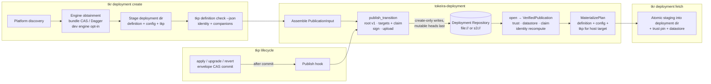

# Deployment Repository — Design

## Overview

This design realizes the deployment repository: every Deployment's durable,
authenticated lineage as a TUF repository — local filesystem for local deployments, S3
for remote-state — with publications written at create and at committed
`apply`/`upgrade`/`revert` transitions, and fetchable onto any seat.

Wire and behaviour sources: the TUF 1.0 specification as implemented by `tough` 0.24
(loader, editor, schema, transports), the spike at `spikes/tuf-platform-definition/`
(PR #81 — every mechanism here except lifecycle hooks and listing was proven there),
and the existing create/bundle/apply machinery cited in the requirements' Evidence
section. The spike's library code is the *reference implementation* for the transport,
publisher, and verification internals; it is superseded (and retired) by this crate —
its mirrored product types are replaced by the real ones.

## Dependencies and Non-Goals

Owning relationships:

- **`crates/tokeira-deployment` is the rename of `crates/tokeira-provisioner`.** That
  crate already owns the deployment domain — binding metadata, the bundle and engine
  identity, admission, integrity, the state envelope — under a name that stopped
  describing it. The rename is mechanical (two dependents: the `tkp` shell crate,
  `apps/tkr`); the published-form machinery this design adds (publication assembly,
  the Deployment Claim, verification, fetch/materialization planning, listing, trust
  state, transports, key sources) lands as new modules inside it; the dormant
  `catalog` module retires in place.
- **`crates/tokeira-tkp` is the rename of `crates/tokeira-provisioner-cli`** — the
  `tkp` shell: verb dispatch and report rendering over the evaluation/realization
  engine and the `tokeira-deployment` domain — it owns no repository logic. The rename
  is contained: no workspace lib dependents (`tkr` invokes the built binary);
  `tokeira-build`'s composition constants and generated-manifest templates follow it.
  **In this wave**, its deployment-domain residents migrate into `tokeira-deployment`
  as modules, behaviour unchanged: `config_history`, `lock`, `marker`, and the
  `ConfigSource` type they share (`config_history`'s only crate-internal import). The
  operation-lease spec then reworks them in their new home.
- **`crates/tokeira-platform-definition` is the collapse of `tokeira-tkd` and
  `tokeira-tkdp`, in this wave**: the two frontends become feature-gated modules
  (`tkd`, `tkdp`) of one crate, so a `tkd`-only bound build never compiles the
  Monty/ruff dependency train. The `[package.metadata.tokeira.definition-frontend]`
  table becomes multi-format; `tokeira-build` discovery reads multi-format frontend
  packages, and composition's generated manifest selects the frontend by feature
  instead of by package. Frontend behaviour, digests, and diagnostics move unchanged.
- Deployment-dir staging stays in `apps/tkr`; lifecycle transitions stay in
  `tokeira-tkp`.
- `tokeira-platform` stays the sole identity implementation; this design adds two
  additive seams there and nothing else.
- The multi-seat operation lease is the immediately-following spec; nothing here may
  preclude it (and nothing does: publications are create-only, the envelope CAS is
  untouched).

Non-goals: refresh automation hosting; discovery beyond `list`; TUF delegated targets;
thresholds > 1; retarget through the repository; changing retention, the envelope, or
any evaluation semantics.

## Architecture



Control flow notes:

- Publication is always *after* the authoritative commit (deployment-dir rename at
  create; envelope CAS at transitions) — a derived projection, per Requirement 4.2.
- Verification is one path for both homes; `open()` differs only in the transport it
  installs (`FilesystemTransport` vs `S3Transport`) and where the client datastore
  lives.
- `tkr` and `tkp` both drive the same `tokeira-deployment` API; neither reimplements
  any repository logic.

## Components and Interfaces

### `crates/tokeira-deployment` — new modules

The renamed crate keeps its existing deployment-domain modules unchanged, minus the
retiring `catalog`: `admission`, `binary_store`, `binding`, `bundle`, `bundle_store`,
`deployment`, `identity`, `integrity`, `migration`, `upgrade`, `version`, and the
envelope in `lib.rs`. An audited data-vs-behaviour pass confirmed the crate already
honours its own contract ("pure serde data models — the logic that populates them
lives in the provisioner binary"): `migration.rs` is the envelope document's schema
chain (its invocation lives in the shell's upgrade verb), `upgrade.rs` is a pure
decision predicate (the ceremony is the shell's, candidate resolution is `tkr`'s),
and the startup admission check is already shell-resident (`platform.rs`). Three
items stay by explicit decision rather than default: the `ORCHESTRATED_LOCK_*_ENV`
constants (a tkr↔tkp process-spawn wire protocol — moving them would create the
`tkr → tokeira-tkp` lib dependency this design avoids; they gain a comment saying
so), `ProvenanceStamp::current` (environment-reading constructor of a domain type),
and the `binding`/`upgrade` verdict pair (pure, domain-typed, `BindingVerdict` is
part of the `describe --json` record; they share the private `version.rs` and move
together or not at all). The published-form machinery arrives as:

```
src/
  lib.rs        crate docs; re-exports
  locator.rs    RepositoryLocator (Local(PathBuf) | S3 { bucket, prefix })
  config.rs     RepositoryConfig, RoleKeyConfig (deny_unknown_fields)
  keys.rs       key-source construction (local Ed25519 files, KMS), local keygen
  claim.rs      DeploymentClaim + sections + Transition
  publish.rs    PublicationInput, publish_transition(), root authoring
  writer.rs     RepositoryWriter: create-only/mutable-head writes; Local + S3 impls
  transport.rs  S3Transport (tough::Transport); transport selection by locator
  open.rs       open() → OpenRepository → VerifiedPublication (claim enforcement)
  fetch.rs      MaterializePlan: verified bytes → placement instructions
  list.rs       local + remote-state deployment enumeration
  error.rs      typed errors; Refusal with stable names
```

### Locator and configuration

```rust
/// Where one Deployment's repository lives. Serialized into metadata.json
/// (`deployment_repository.locator`) and displayed by every verb.
#[derive(Debug, Clone, PartialEq, Eq, Serialize, Deserialize)]
#[serde(deny_unknown_fields, rename_all = "snake_case", tag = "kind")]
pub enum RepositoryLocator {
    /// `<deployments-root>/repositories/<name>/` — the local home.
    Local { path: PathBuf },
    /// `s3://{bucket}/{prefix}/{name}/` under the remote deployments base.
    S3 { bucket: String, prefix: String },
}

/// Publisher-side configuration, persisted at create into
/// `state/repository/publisher.json`, read by lifecycle publication hooks.
#[derive(Debug, Clone, Serialize, Deserialize)]
#[serde(deny_unknown_fields)]
pub struct RepositoryConfig {
    pub locator: RepositoryLocator,
    pub keys: RoleKeyConfig,
    /// Role lifetimes; the timestamp lifetime is the freshness window.
    pub lifetimes: RoleLifetimes,
}

/// One key source per role. Local file paths or KMS key ids; any mix.
#[derive(Debug, Clone, Serialize, Deserialize)]
#[serde(deny_unknown_fields)]
pub struct RoleKeyConfig {
    pub root: KeySourceConfig,
    pub targets: KeySourceConfig,
    pub snapshot: KeySourceConfig,
    pub timestamp: KeySourceConfig,
}

#[derive(Debug, Clone, Serialize, Deserialize)]
#[serde(deny_unknown_fields, rename_all = "snake_case", tag = "kind")]
pub enum KeySourceConfig {
    /// Ed25519 pkcs8 DER file (raw, no PEM), the local default.
    File { path: PathBuf },
    /// KMS RSA key, RSASSA_PSS_SHA_256 (tough-kms 0.16 surface).
    Kms { key_id: String, profile: Option<String> },
}
```

`keys.rs` converts `KeySourceConfig` → `SharedKeySource` (the `Arc<dyn KeySource>` shim
proven in the spike) and generates local defaults at create:
`<deployments-root>/keys/<name>/{root,targets,snapshot,timestamp}.ed25519.der` — under
the deployments root, outside the repository (Requirement 8.5).

### The Deployment Claim

```rust
/// Signed statement binding one publication. Rides as
/// custom["tokeira:deployment"] on the definition root's target.
#[derive(Debug, Clone, PartialEq, Eq, Serialize, Deserialize)]
#[serde(deny_unknown_fields)]
pub struct DeploymentClaim {
    pub deployment: DeploymentRef,      // { name, id: Uuid }
    pub platform: PlatformId,
    pub format: DefinitionFormatId,
    pub definition: DefinitionSection,
    pub engine: EngineSection,
    pub transition: Transition,
    pub config_revision: u64,
}

#[derive(Debug, Clone, PartialEq, Eq, Serialize, Deserialize)]
#[serde(deny_unknown_fields)]
pub struct DefinitionSection {
    pub root: String,                   // target name carrying this claim
    pub companions: Vec<String>,        // bare names, served order
    pub identity: IdentityClaim,        // { algorithm, digest } — serialized
}                                       //   ConfigurationIdentity shape

#[derive(Debug, Clone, PartialEq, Eq, Serialize, Deserialize)]
#[serde(deny_unknown_fields)]
pub struct EngineSection {
    pub identity_digest: String,        // EngineIdentity digest, hex
    pub provisioner_version: String,
    pub manifest: String,               // bundle-manifest target name
    pub build_authority: String,        // tier label; surfaces dev engines
}

#[derive(Debug, Clone, Copy, PartialEq, Eq, Serialize, Deserialize)]
#[serde(rename_all = "snake_case")]
pub enum Transition { Create, Apply, Upgrade, Revert }
```

Companion targets carry `custom["tokeira:definition-companion"] = { format }`; engine
binaries `custom["tokeira:engine-artifact"] = { target }`; config-tree files
`custom["tokeira:config"] = {}` — exactly the claim-contract table.

### Publishing

```rust
/// Everything one publication is assembled from. Callers (tkr create, tkp
/// lifecycle hooks) collect this from the committed deployment dir — publish
/// never reads mutable state itself.
#[derive(Debug)]
pub struct PublicationInput {
    pub claim: DeploymentClaim,
    /// (target name, bytes): definition root + companions, config-tree files.
    pub documents: Vec<(String, Vec<u8>)>,
    /// The committed bundle: manifest + per-target binaries (paths, not bytes —
    /// binaries are streamed, never buffered whole).
    pub bundle_manifest: ProvisionerBundle,
    pub bundle_artifacts: Vec<(Target, PathBuf)>,
}

/// Write the next publication. `expected_version` is the publication version
/// the caller last observed (0 at create); the writer's create-only semantics
/// turn a concurrent publication into a typed refusal, never an overwrite.
pub async fn publish_transition(
    config: &RepositoryConfig,
    input: PublicationInput,
    expected_version: u64,
) -> Result<PublicationReceipt, PublishError>;
```

Internals follow the spike's proven sequence: author `N.root.json` only at version 1
(or explicit rotation); build targets with claim metadata via `RepositoryEditor`;
`targets = snapshot = timestamp version = expected_version + 1`; sign with the online
sources; hand the `SignedRepository` + artifact paths to the `RepositoryWriter`, which
writes every create-only object first and the mutable heads last (Requirement 3.5).
`retrieval_ref` on each artifact descriptor is set to its engine-binary target name
before the manifest document is serialized (Requirement 2.5).

### Writing — one trait, two homes

```rust
/// Object writes under the Repository Object Contract. The S3 impl uses
/// If-None-Match:* / unconditional puts; the local impl uses create_new /
/// atomic rename. Byte-verify on collision in both.
#[async_trait]
pub trait RepositoryWriter: Send + Sync {
    async fn put_create_only(&self, key: &str, source: WriteSource<'_>)
        -> Result<UploadOutcome, WriteError>;
    async fn put_mutable_head(&self, key: &str, bytes: &[u8])
        -> Result<(), WriteError>;
}
```

`WriteSource` is bytes-or-file so engine binaries stream from the bundle CAS without
loading into memory. `UploadOutcome` = `Created | AlreadyPresent` (idempotent shared
content across publications, Requirement 3.6) with `differing bytes` as a typed error.

### Transport and opening

`S3Transport` is the spike's implementation productionized: `tough::Transport` over
`GetObject`, `NoSuchKey`/404 → `FileNotFound`, streaming body, nothing else.
`open()` selects it (or `FilesystemTransport`) from the locator:

```rust
/// Load and verify the repository from pinned trust; enforce the claim.
pub async fn open(
    locator: &RepositoryLocator,
    trusted_root: &[u8],
    datastore: Option<&Path>,
    expiration: ExpirationEnforcement,   // Safe unless the break-glass flag
) -> Result<OpenRepository, OpenError>;

impl OpenRepository {
    /// The current publication with its claim fully enforced:
    /// exactly-one-claim, root-name agreement, companion resolvability,
    /// identity recomputation (tokeira-platform), engine manifest fetched and
    /// cross-checked (per-artifact sha256 == TUF target hash), transition
    /// well-formed. Every check failure is a `Refusal` with a stable name.
    pub async fn verified_publication(&self) -> Result<VerifiedPublication, Refusal>;
    /// Accepted trust anchor bytes after any root-version walk — callers
    /// re-pin these (Requirement 7.2).
    pub fn trust_anchor(&self) -> &[u8];
}
```

`VerifiedPublication` exposes the claim, the publication version, and verified readers
for each target class; `fetch.rs` turns it into a `MaterializePlan` — an ordered list
of `(relative path, content source)` placements plus the host-target engine selection
(refusing when the manifest lacks the host target), which `tkr` executes inside its
existing atomic staging.

### Listing

```rust
pub enum ListingScope<'a> {
    Local { deployments_root: &'a Path },
    RemoteState { bucket: String, prefix: String },
}

/// Enumerate deployments: local from the deployments root, remote-state by
/// listing repository homes under the base prefix (one per deployment name).
/// Listing never verifies — it reports names and locators; `inspect` verifies.
pub async fn list_deployments(scope: ListingScope<'_>) -> Result<Vec<DeploymentEntry>, ListError>;
```

### Seams in existing crates

`crates/tokeira-platform` (additive, Requirement 1.5 / 10):

```rust
// EvaluatedDefinition gains the recorded served set:
pub struct EvaluatedDefinition<K> {
    pub config: LocatedValue,
    pub graph: VerifiedGraph<K>,
    pub configuration_identity: ConfigurationIdentity,
    /// The parts evaluation served, first-request order — what the set
    /// identity was computed over. Empty for a single-document definition.
    pub served_companions: Vec<(String, Arc<[u8]>)>,
}
// compute_set becomes public, layout unchanged:
impl ConfigurationIdentity {
    pub fn compute_set(format: &DefinitionFormatId, root: &[u8],
                       parts: &[(String, Arc<[u8]>)]) -> Self;
}
```

`crates/tokeira-tkp` (renamed from `tokeira-provisioner-cli`; citations below use the
current paths):

- `CheckReport` gains `identity: Option<IdentityReport>` and
  `companions: Option<Vec<String>>` (serialized in `--json`); populated from the
  evaluated definition instead of dropping it (`definition.rs:104`).
- Lifecycle hook: after a committed `apply`/`upgrade`/`revert` (post
  `config_history::snapshot`), when `state/repository/publisher.json` exists, assemble
  `PublicationInput` from the committed deployment dir and call `publish_transition`.
  Failure → report `publication pending` with `tkr deployment publish` as the remedy;
  never alters the committed outcome (Requirement 4.2).

`apps/tkr`:

- `deployment create`: engine obtainment defaults to the bundle path for all creates
  (`--dev-engine`, local-only, keeps the workspace build). The dev path synthesizes a
  minimal dev-tier `ProvisionerBundle` manifest — identity with `build_container:
  None`, dev authority, one artifact for the host target — so publication is uniform
  across engine kinds; fetching a dev publication onto another architecture refuses
  with `host_target_unsupported`, which is correct for a dev artifact. After staging +
  validation,
  generate/collect keys, write `publisher.json`, run the birth publication, pin trust,
  init datastore, record `deployment_repository` in `metadata.json` — all before the
  atomic rename, except the repository upload itself which follows the local commit
  (Requirement 2.4 ordering: local commit is authoritative).
- New arms in `commands/deployment.rs`: `fetch`, `list`, `publish`, `refresh`,
  `inspect`, all thin over `tokeira-deployment`.
- Deprecation: `catalog.rs`'s published-arm types stop being constructed; the
  workspace arm is renamed toward *platform discovery* vocabulary as touched
  (mechanical rename, no behaviour change).

## Data Models

Durable additions (all additive/optional):

| Document | Field | Type | Notes |
|---|---|---|---|
| `metadata.json` | `deployment_repository` | `{ locator: RepositoryLocator, trusted_root_digest: String }` | Written at create/fetch; tolerated-unknown by `tkp` readers |
| `state/repository/publisher.json` | whole file | `RepositoryConfig` | Publisher side only; absent on fetched read-only seats until keys are supplied |
| `state/repository/root.json` | bytes | raw | Pinned trust anchor, updated on accepted root walk |
| `state/repository/datastore/` | dir | tough-owned | Rollback protection across loads |
| Repository objects | — | — | Exactly the Repository Object Contract table |

The claim is not persisted locally: it lives in signed targets metadata and is
re-derived on every verified open. The `trusted_root_digest` in `metadata.json` guards
the pinned file against accidental replacement (compared on every open before use).

## Correctness Properties

Property P1 — Round-trip materialization. *For any* Deployment content (definition
root + companions, config tree, bundle), create-publish followed by fetch of the same
publication materializes every published file byte-identically, and `tkp` placement
selects exactly the host-target artifact. **Validates: Requirements 2.2, 5.2**

Property P2 — Identity agreement. *For any* definition set and served order, the
claim identity equals `tokeira-platform`'s recomputation over the fetched bytes in
claimed order; permuting companion order, mutating any byte, or renaming any companion
makes verification refuse with `identity_mismatch` (or the specific claim refusal) and
nothing materializes. **Validates: Requirements 9 (claim table), 10.2**

Property P3 — Monotonic lineage. *For any* sequence of committed transitions,
publication versions strictly increase by 1; a `revert` transition publishes a new
higher version whose content equals the reverted-to publication's content.
**Validates: Requirements 3.2, 4.1, 4.3**

Property P4 — Create-only immutability. *For any* two publications, content shared
between them maps to identical content-named targets reported `AlreadyPresent`; any
attempt to write a differing object at an existing create-only key is refused naming
the key, with mutable heads unwritten. **Validates: Requirements 3.3, 3.6**

Property P5 — Absence signal. *For any* object key absent from the repository home,
the transport reports `FileNotFound`; for any other failure it never does. (This is
what makes the root-version walk terminate correctly.) **Validates: Requirement 6.2**

Property P6 — Tamper refusal. *For any* single-byte mutation of any metadata object
or any target object after signing, `open`/`verified_publication`/materialization
refuses; no partial materialization occurs. **Validates: Requirements 5.4, 10.2**

Property P7 — Freshness and rollback. *For any* publication whose timestamp lifetime
has elapsed, `open` under `Safe` refuses naming the expiration and succeeds only under
the explicit break-glass flag; *for any* consumer whose datastore has trusted version
N, serving any version < N refuses as rollback. **Validates: Requirements 9.1, 9.2**

Property P8 — Engine agreement. *For any* bundle, verification requires every
manifest artifact descriptor's `sha256` to equal the TUF hash of its named engine
target and `retrieval_ref` to name that target; any divergence refuses with
`engine_artifact_mismatch`. **Validates: Requirements 2.5, 5.2, claim table**

Property P9 — Rotation in place. *For any* online-role rotation published as root
version N+1 signed by the version-N root key, a consumer pinned at version N verifies
subsequent publications and re-pins the accepted root. **Validates: Requirements 7.2,
7.3**

Property P10 — Commit authority. *For any* publication failure injected after a
committed transition, the committed state is unchanged and a later
`publish_transition` with the same input succeeds and yields content identical to what
the original attempt would have published. **Validates: Requirements 2.4, 4.2**

Property P11 — Home equivalence. *For any* Deployment content, publishing to a local
repository and to an S3 repository yields identical target inventories, claim bytes,
and digests — differing only in residency. **Validates: Requirements 1.6, 4.5**

## Error Handling

| Condition | Internal type | Stable refusal name / operator surface |
|---|---|---|
| Claim absent / duplicated | `Refusal` | `claim_missing` / `claim_ambiguous` |
| Claim field disagreement | `Refusal` | the claim-table names (`claim_*_mismatch`, `claim_companion_missing`) |
| Identity disagreement | `Refusal` | `identity_mismatch`, both digests named |
| Engine artifact divergence | `Refusal` | `engine_artifact_mismatch`, artifact named |
| Host target unavailable | `Refusal` | `host_target_unsupported`, targets listed |
| Expired freshness | `OpenError::Expired` | names the role and instant; break-glass flag named |
| Rollback detected | `OpenError::Rollback` | trusted vs presented versions named |
| Signature/hash failure | `OpenError::Verification` | via `tough`; surfaced verbatim |
| Create-only collision (differing) | `WriteError::Conflict` | key named; "another publication raced" remedy |
| Non-hermetic engine → S3 | `PublishError::NonHermetic` | names the hermeticity requirement |
| Trust anchor corrupt / digest mismatch | `OpenError::TrustAnchor` | before any network fetch |
| KMS key spec unsupported | `KeyError::UnsupportedKmsSpec` | names RSA/RSASSA_PSS_SHA_256 constraint |

All refusals carry what happened / why / what to do next in `Display`; `--json`
serializes the stable name.

## Testing Strategy

- **PBT (proptest), in `tokeira-deployment`** — offline, no AWS, no Dagger: generated
  deployment contents (documents, synthetic bundles with generated per-target
  artifacts) drive P1–P8, P10, P11 over the filesystem home and the in-memory S3 home
  (the spike's `infallible_client_fn` bucket, promoted into a `testkit` module). Each
  test carries `// Feature: deployment-repository, Property N`.
- **Example-based unit tests** — claim serde shape, locator parsing/rendering,
  key-config → source construction (KMS constructed, not called), refusal `Display`
  wording, golden identity vectors (carried over from the spike so the layout stays
  pinned by an independent computation).
- **Integration, in `apps/tkr` / `tokeira-tkp`** — create→publish→fetch
  round-trip and lifecycle-hook publication using the existing test engines
  (`tokeira-build/src/testing.rs` fake bundles seeded through the CAS; the launcher
  testkit engine) so no test invokes Dagger; the true hermetic-build path stays
  covered by the operator-run bundle flow it already has.
- **Spike retirement** — `spikes/tuf-platform-definition/` is removed in the landing
  slice with a disposition map in the PR (every artifact's production home stated),
  per the monty-spike precedent.
