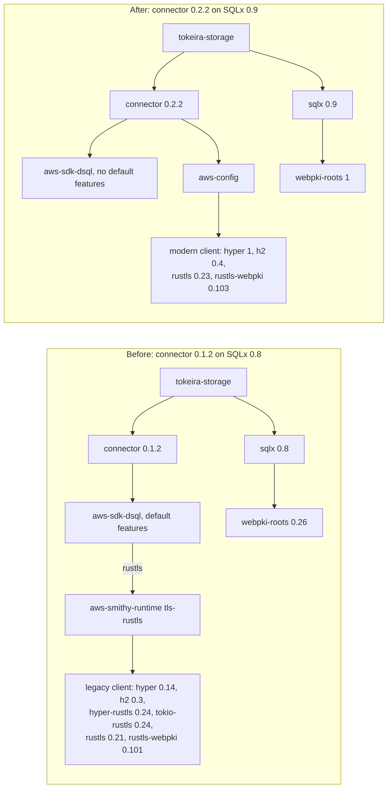

# DSQL Connector 0.2 and SQLx 0.9 — Design

## Overview

This is a dependency move whose correctness weight sits in three places: what the lock
compiles into the server (the legacy AWS HTTPS client must leave and nothing may bring it
back), what text reaches the database driver (SQLx 0.9 makes every dynamic SQL string an
explicit, audited assertion), and the one seam where Tokeira meets the connector (error
classification and diagnostics must not change while the crate underneath does). Each of
those is pinned by a property with a test; the connection path itself is then proven
against a live DSQL cluster, because the driver's wire behaviour is the one thing no unit
test in this workspace can see.

Facts are taken from the crate sources named in the requirements: the connector 0.2.2 and
0.1.2 trees, the SQLx 0.9.0 workspace, the locked AWS SDK crates, and tracing-subscriber
0.3.23. The requirements' evidence section carries the anchors; this document does not
repeat them.

## Dependencies and Non-Goals

- Builds on [tonic-0-14-grpc-stack](../tonic-0-14-grpc-stack/design.md) (merged), whose
  Property 1 test is the Lock Invariant this feature re-scopes. That spec's criterion 1.3
  and glossary entry for the Connector Exception are corrected by this feature, because
  http 0.2 and http-body 0.4 are AWS SDK type dependencies and do not leave with the
  connector.
- Leaves the Reservoir, the connection coordinator, the migration runner's logic, and the
  storage repository contract unchanged. Only the string types that reach SQLx and the
  connector error mapping move.
- Does not adopt the connector's `occ` feature or its pool; does not consolidate `sqlx`
  into the workspace dependency table; does not move AWS SDK versions beyond what the
  resolver requires; does not add SQLx's `sqlx.toml` configuration.
- Ships in the 0.3.0 train; the version bump belongs to the release train.

## Architecture

The connection path is unchanged: the Reservoir asks the Connection Factory for a physical
connection, the factory calls the connector's `connect_with`, and the connector mints an
IAM token and opens a TLS connection through SQLx's `PgConnection::connect_with`. What
changes is the dependency graph beneath that call.



`aws-sdk-dsql` stays in the graph on the right because `tokeira-aws` and
`tokeira-managed-dsql` use it for cluster operations, already without its defaults; the
connector's own use of it is token signing, which needs no HTTP client. `aws-config` (the
credential chain) runs on the modern client that every other AWS call in the workspace
already uses. The SDK Type Dependencies http 0.2 and http-body 0.4 remain on both sides of
the diagram as unconditional dependencies of the SDK crates and are omitted for clarity.

## Components and Interfaces

### Manifests and lock

- `crates/tokeira-storage/Cargo.toml`: `aurora-dsql-sqlx-connector = { version = "=0.2.2",
  optional = true }` and `sqlx = { version = "0.9", default-features = false, features =
  ["runtime-tokio", "tls-rustls", "postgres", "time", "uuid"], optional = true }`. The
  connector's `pool` feature goes: nothing names `aurora_dsql_sqlx_connector::pool`, and the
  Reservoir is the pool. The exact pin stays because the connector is pre-1.0 and its 0.1
  to 0.2 step carried a SQLx major; each move is a reviewed dependency change, and
  `deny.toml` forbids wildcard requirements.
- `crates/tokeira-projection/Cargo.toml` and `apps/tkr/Cargo.toml`: the `sqlx` version moves
  to `0.9`; feature lists unchanged.
- Root `Cargo.toml`: `tracing-subscriber = { version = "0.3", features = ["fmt",
  "env-filter", "json", "tracing-log"] }`. The feature is a default today; naming it makes the
  Log Bridge a declared dependency rather than an inherited one.
- `crates/tokeira-observability/Cargo.toml`: `log = "0.4"` as a dev-dependency for the
  bridge test. `log` is already in the lock under `tracing-log`.
- `Cargo.lock`: regenerated with `cargo update --package aurora-dsql-sqlx-connector --precise
  0.2.2` and `cargo update --package sqlx` (with `sqlx-core`, `sqlx-postgres`,
  `sqlx-macros`, `sqlx-macros-core`), then `--locked` everywhere. The expected lines to move
  are those five, the connector, webpki-roots 0.26 leaving, the Legacy Client Set leaving,
  and whatever the resolver needs for `sqlx` 0.9 and connector 0.2.2 (`aws-credential-types`
  is already present). Any other movement is reported and justified in the change.

### Connection Factory

`crates/tokeira-storage/src/dsql/connection_factory.rs` keeps its shape. The error mapping
becomes exhaustive:

```rust
pub fn from_dsql_error(error: DsqlError) -> Self {
    // Exhaustive on purpose: a variant a future connector release adds must be
    // classified here, not absorbed by a wildcard into `connection`.
    match error {
        DsqlError::ConfigError(error) => Self::Config(error.to_string()),
        DsqlError::TokenError(error) => Self::Token(error.to_string()),
        DsqlError::ConnectionError(error) => Self::Connection(error.to_string()),
        DsqlError::DatabaseError(error) => Self::Database(error.to_string()),
    }
}
```

`ConnectionFactoryError::OccRetry` and the `occ_retry` label go with the arm. The label was
never emitted: the only constructor of the connector's `OCCRetryExhausted` is its
`retry_on_occ` helper, which no Tokeira code calls, and 0.2.2 compiles the variant only
under the `occ` feature. The unit test `dsql_error_classification_returns_stable_categories`
keeps its four cases; Property 3 generalises it.

### Attested Sites

Each of the eleven built-string sites wraps its text in `AssertSqlSafe` and carries a
comment that begins `// SQL safety:` and names the source of the text. The comment is the
audit SQLx asks for; the static check in the engine's architecture tests keeps it present.

Migration runner (`migration.rs:347`, `:403`, `:1037`, `:1041`; the text is a `String` copied
from the embedded corpus, so the borrowed form is used and SQLx copies it once per
statement):

```rust
// SQL safety: `migration.sql` is a file from the embedded migration corpus whose
// checksum the runner verified against the ledger; nothing at request time can
// reach a compile-time embedded file.
sqlx::query(AssertSqlSafe(migration.sql.as_str())).execute(&mut *tx).await
```

Worker-compute repository (`worker_compute_repository.rs:889`, `:954`, `:1002`; the text is
owned and not reused, so it moves without a copy):

```rust
// SQL safety: the only interpolation is the `ACTION_COLUMNS` constant; every
// request value is a bind parameter.
let query = format!("SELECT {ACTION_COLUMNS} FROM worker_compute_action WHERE action_id = $1");
let row = sqlx::query(AssertSqlSafe(query)).bind(action_id).fetch_optional(connection).await?;
```

Projection store (`dsql_store.rs:300`, `:1577`, `:1607`, `:1666`):

```rust
// SQL safety: `sql` is the SQL compiler's output. Request values reach it only
// as `$n` placeholders (Property 2) and are bound from `values` below; the
// identifiers it interpolates come from the compiler's own tables.
let query = bind_sql_values(sqlx::query(AssertSqlSafe(sql)), &values);
```

The two slice sites (`migration.rs:324`, `:511`) iterate `&'static [&'static str]` and pass
the element by value, which already implements the contract:

```rust
for statement in bootstrap_statements_for_decision(decision)?.iter().copied() {
    sqlx::query(statement).execute(&mut *connection).await?;
}
```

### Lock Invariant

`workspace_resolves_one_grpc_and_http_stack` in
`crates/tokeira-engine/tests/embedded_architecture.rs` loses its Connector Exception block
and gains an unconditional absence list, with the SDK Type Dependencies named in a comment
so the next reader does not "fix" their presence:

```rust
// The legacy AWS HTTPS client left with the DSQL connector 0.2 move. Nothing may
// bring these back: a future connector or SDK release that re-enables
// `aws-smithy-runtime/tls-rustls` fails here rather than being tolerated.
// http 0.2 and http-body 0.4 are not in this list on purpose: the AWS SDK crates
// require them for their own types regardless of HTTP client, and no client or
// server implementation stands behind them.
for (name, legacy_line) in [
    ("hyper", "0.14."),
    ("h2", "0.3."),
    ("hyper-rustls", "0.24."),
    ("tokio-rustls", "0.24."),
    ("rustls", "0.21."),
    ("rustls-webpki", "0.101."),
    ("webpki-roots", "0.26."),
] {
    assert!(
        !versions_of(&packages, name).iter().any(|version| version.starts_with(legacy_line)),
        "{name} {legacy_line}x is in the lock; the legacy AWS client is back"
    );
}
assert_eq!(versions_of(&packages, "aurora-dsql-sqlx-connector"), ["0.2.2"]);
assert_eq!(versions_of(&packages, "sqlx").len(), 1);
```

The single-version assertions for the tonic 0.14 line stay as they are.

### Advisory policy

`deny.toml` drops the four entries and their two comment blocks (lines 25 to 41 at the
base). The remaining entries and the file's preamble are untouched. `cargo deny check`
runs after the lock is regenerated; an ignore that no longer matches an encountered
advisory is reported, which is why the entries leave in the same change as the lock.

### Log Bridge

The connector 0.2.2 reports through `log`. The process subscriber installed by
`install_tracing_subscriber` uses `try_init`, which installs `LogTracer` under
`tracing-subscriber`'s `tracing-log` feature; naming the feature in the root manifest makes
that dependency explicit, and two tests pin it: a manifest-and-lock check in the engine's
architecture tests (Property 4) and a runtime test in `tokeira-observability` that installs
a registry with a capturing layer through `try_init`, emits a `log::warn!` with the
connector's target, and asserts the layer received an event with that target and message.
nextest's one-process-per-test contract makes the global install safe.

### Live Evidence

A new integration test file, `crates/tokeira-storage/tests/dsql_connector_iam.rs`, opens
with `#![cfg(feature = "dsql-integration")]`, reads `TOKEIRA_DSQL_TEST_ENDPOINT` and
`TOKEIRA_DSQL_TEST_REGION`, returns early when either is unset, and otherwise builds
`ConnectionFactory::new(&endpoint, &region)`, calls `create_connection`, and runs
`SELECT 1` on the result. It synchronises without sleeps. The guard test in the engine's
architecture tests adds the file to its feature-gate and no-sleep checks.

The existing URL-gated suites (storage shard leasing and embedded ownership, projection
persistence) and the managed lifecycle test are unchanged; they are run once on the
migrated stack and recorded in the task ledger. A new document,
`docs/testing/dsql-live-suites.md`, describes the environment variables for the URL-gated
suites, the endpoint-gated test, and the schema-bootstrap acknowledgement pair, and links
to the managed lifecycle runbook. It names no cluster, host, or account.

### Documentation and release notes

`docs/architecture/060-connection-management.md`, `docs/crates/storage.md`, and
`docs/crates/projection.md` describe the connection path at the contract level and stay
accurate; the change confirms this rather than editing them. Two fragments land under
`.changes/unreleased/`: a `changed` entry for the public signature move and the connector
pin, and a `security` entry for the legacy client's departure and the four advisories.

The tonic 0.14 spec's criterion 1.3, its glossary entry for the Connector Exception, and
its design's Property 1 are amended in the same change to state that http 0.2 and
http-body 0.4 are SDK Type Dependencies and that the exception has ended; this is the one
edit outside this feature's own directory.

## Data Models

No durable state changes and no migration. The only type change is
`ConnectionFactoryError`, which loses its `OccRetry` variant:

```rust
pub enum ConnectionFactoryError {
    Config(String),      // kind() = "config"
    Token(String),       // kind() = "token"
    Connection(String),  // kind() = "connection"
    Database(String),    // kind() = "database"
}
```

`MigrationPlan { pub sql: String, .. }` keeps its `String`; the borrowed attestation at the
execution sites is the minimal change and costs one copy per applied statement.

## Correctness Properties

### Property 1: One SQLx line, one connector line, no legacy client

*For any* workspace lock the feature produces, the lock SHALL contain exactly one version
of `sqlx`, `sqlx-core`, `sqlx-postgres`, and `aurora-dsql-sqlx-connector`, on the 0.9 and
0.2.2 lines, and no version of hyper 0.14, h2 0.3, hyper-rustls 0.24, tokio-rustls 0.24,
rustls 0.21, rustls-webpki 0.101, or webpki-roots 0.26, while http 0.2 and http-body 0.4 are
permitted as SDK Type Dependencies.

**Validates: Requirements 1.3, 1.4, 1.5, 1.6**

### Property 2: Compiled projection SQL is value-free

*For any* filter, sort, and grouping input the projection SQL compiler accepts, the SQL
text it emits SHALL contain each request value only as a `$n` placeholder, the bind list
SHALL carry exactly the values in placeholder order, and no request-supplied string SHALL
appear in the text.

**Validates: Requirements 3.5**

### Property 3: Failure categories are total and message-independent

*For any* payload message and *for each* of the connector's four error variants,
`ConnectionFactoryError::from_dsql_error(..).kind()` SHALL return that variant's category
(`config`, `token`, `connection`, `database`), the category SHALL not depend on the message,
and the set of categories SHALL be exactly those four.

**Validates: Requirements 4.2, 4.3, 4.4**

### Property 4: The Log Bridge is declared

*For any* build of the workspace, the root manifest's `tracing-subscriber` dependency
SHALL name `tracing-log` and the lock SHALL resolve `tracing-log` as a dependency of
`tracing-subscriber`.

**Validates: Requirements 4.5**

## Error Handling

| Condition | Internal | External |
|-----------|----------|----------|
| Connector configuration error (`DsqlError::ConfigError`) | `ConnectionFactoryError::Config` | metric label `config`; Reservoir refill retries as today |
| IAM token generation error (`DsqlError::TokenError`) | `ConnectionFactoryError::Token` | metric label `token` |
| TCP or TLS failure (`DsqlError::ConnectionError`) | `ConnectionFactoryError::Connection` | metric label `connection` |
| Handshake or server error (`DsqlError::DatabaseError`) | `ConnectionFactoryError::Database` | metric label `database` |
| A connector variant this mapping does not name | compile error (exhaustive match) | none at runtime |
| `AssertSqlSafe` without its comment, or beyond the eleven sites | architecture test failure | none at runtime |
| Legacy Client Set crate in the lock | Property 1 failure | none at runtime |
| Live test environment variables unset | the test returns early | not a failure |

## Testing Strategy

- **Property-based:** Property 2 in `crates/tokeira-projection/src/dsql_store.rs` tests,
  which already use `proptest`; the strategy generates filters whose text values are
  random tokens and asserts none appears in the emitted SQL while the bind list matches.
  Property 3 in the Connection Factory's tests over generated messages.
- **Deterministic architecture tests:** Property 1 and Property 4 in
  `crates/tokeira-engine/tests/embedded_architecture.rs`, which already reads the lock and
  manifests; the attestation scan (`AssertSqlSafe` count and comment) and the guard-test
  extension live beside them.
- **Example-based:** the updated `dsql_error_classification_returns_stable_categories`; the
  Log Bridge runtime test in `tokeira-observability`; `cargo deny check` and the Bar.
- **Live:** the endpoint-gated connector test, the ten URL-gated tests, and the managed
  lifecycle test, run on the operator's host with credentials and recorded in the ledger.
  These are the only evidence for the driver's wire behaviour on 0.9 and the connector's
  IAM path on 0.2.2, and the feature is not accepted without them.
