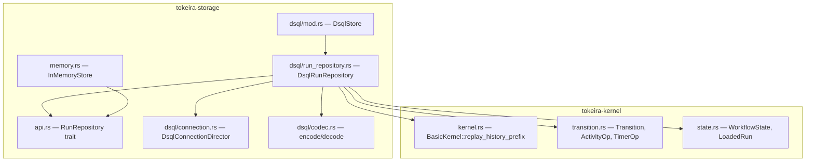
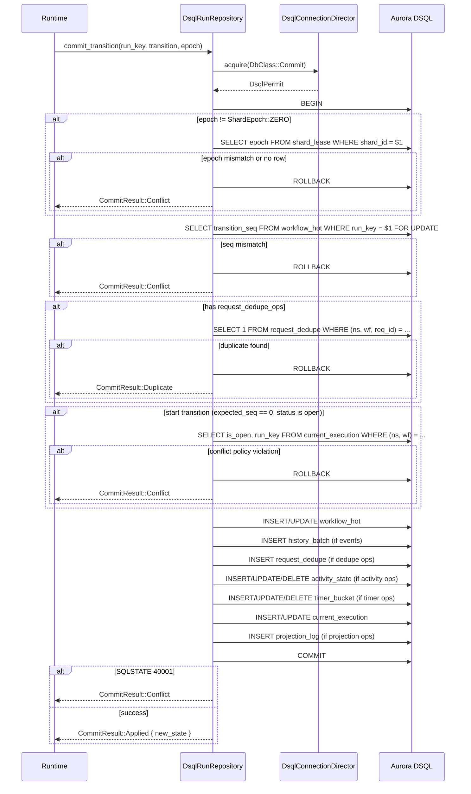
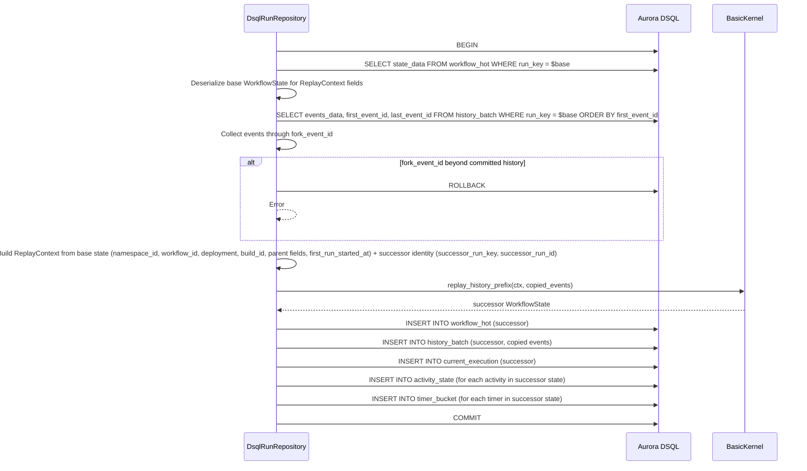

# Design Document: DSQL Core Persistence — RunRepository on Aurora DSQL

## Overview

This design covers `DsqlRunRepository`, the production implementation of the `RunRepository` trait against Aurora DSQL. It is Feature 2 from the umbrella `dsql-storage-implementation` spec, building on the schema DDL, connection pool, and codec module delivered by Feature 1 (`dsql-schema-connection`).

The central design principle is **one workflow transition = one fenced DSQL transaction**. Every `commit_transition` call executes a single SQL transaction that:

1. Validates the shard epoch fence (reads `shard_lease` within the transaction)
2. Validates the transition sequence fence (compares `expected_seq` against `workflow_hot.transition_seq`)
3. Checks request deduplication (queries `request_dedupe`)
4. Checks start-workflow conflict policy (queries `current_execution`)
5. Writes the full transition write set atomically (upserts/deletes across `workflow_hot`, `history_batch`, `request_dedupe`, `current_execution`, `activity_state`, `timer_bucket`, `projection_log`)

Read operations (`load_run`, `resolve_execution`, `find_latest_run`, `read_history`, `lookup_request_dedupe`) are single-statement queries outside any explicit transaction, using `DbClass::Read` connections.

The in-memory implementation in `memory.rs` is the behavioral reference. This design translates its semantics into SQL against the DSQL schema from Feature 1, respecting DSQL's OCC model (Repeatable Read, conflict detection at commit), 3,000-row mutation limit, 5-minute transaction ceiling, and FOR UPDATE restrictions (equality predicate on primary key only).

### Key Design Decisions

1. **No internal retry.** OCC conflicts (SQLSTATE 40001), transition-seq mismatches, and epoch mismatches are all surfaced as `CommitResult::Conflict`. The runtime decides whether to retry, reload, or reject.

2. **Shard epoch fence inside the transaction.** The `shard_lease` read happens within the commit transaction so DSQL's Repeatable Read guarantees the epoch hasn't changed between the read and the commit. This prevents TOCTOU races without requiring FOR UPDATE on `shard_lease` (which would need an equality predicate on the primary key — we already have it since we look up by `shard_id`).

3. **Deterministic shard assignment.** `RunKey → ShardId` uses the same `(run_key.0.as_u128() as u32) % shard_count` mapping as the in-memory store. The shard count is stored in `DsqlRunRepository` and must match the runtime's shard configuration. Since the schema stores `shard_id` as UUID but `ShardId` is `u32`, the repository uses a deterministic `shard_id_to_uuid` encoding: the `u32` value is zero-extended to 128 bits and formatted as a UUID. This is a stable, reversible mapping used consistently across all SQL bindings.

4. **Postcard codec for all BYTEA columns.** All serialization uses the `dsql::codec` module from Feature 1. No raw SQL serialization of domain types.

5. **`current_execution` as the execution index.** Unlike the in-memory store which maintains separate `current_open` and `execution_index` maps, DSQL uses the single `current_execution` table with `is_open` flag and `run_id` column to serve `find_latest_run` and the no-`run_id` path of `resolve_execution`. For the explicit `run_id` path, `resolve_execution` queries `workflow_hot` by `(namespace_id, workflow_id)` and filters by `run_id` from the deserialized `WorkflowState`, because `current_execution` only holds the latest run and older runs are overwritten. This matches the in-memory store's `execution_index` semantics where all committed runs are findable by `run_id`.

## Architecture

### Module Layout

The new code lives in `tokeira-storage/src/dsql/run_repository.rs`:

```
tokeira-storage/
├── src/
│   ├── api.rs                    # RunRepository trait (unchanged)
│   ├── memory.rs                 # InMemoryStore (behavioral reference)
│   ├── dsql/
│   │   ├── mod.rs                # DsqlStore + module declarations
│   │   ├── run_repository.rs     # NEW: DsqlRunRepository impl
│   │   ├── connection.rs         # DsqlConnectionDirector, DsqlPermit
│   │   ├── codec.rs              # Postcard encode/decode helpers
│   │   ├── config.rs             # DsqlPoolConfig, ReservoirConfig
│   │   ├── reservoir.rs          # Reservoir channel + refiller
│   │   ├── rate_limiter.rs       # Token-bucket rate limiter
│   │   ├── migration.rs          # MigrationRunner
│   │   └── validation.rs         # DDL validator
│   └── lib.rs
```

### Dependency Flow



### Transaction Flow



## Components and Interfaces

### `DsqlRunRepository`

```rust
/// Production DSQL implementation of `RunRepository`.
///
/// Each `commit_transition` call executes one fenced DSQL transaction.
/// Read operations use single-statement queries with `DbClass::Read`
/// connections. The struct holds a reference to the connection director
/// (from Feature 1) and the shard count for deterministic shard assignment.
pub struct DsqlRunRepository {
    /// Connection director for acquiring class-based permits.
    director: Arc<DsqlConnectionDirector>,
    /// Total shard count for deterministic RunKey → ShardId mapping.
    shard_count: u32,
    /// Conflict policy for start-workflow collisions.
    conflict_policy: CurrentExecutionConflictPolicy,
}

impl DsqlRunRepository {
    /// Create a new repository backed by the given connection director.
    /// Returns an error if `shard_count` is zero.
    pub fn new(
        director: Arc<DsqlConnectionDirector>,
        shard_count: u32,
        conflict_policy: CurrentExecutionConflictPolicy,
    ) -> Result<Self>;

    /// Deterministic shard assignment matching the in-memory store.
    /// Panics are impossible because the constructor rejects shard_count == 0.
    fn shard_for_run_key(&self, run_key: RunKey) -> ShardId {
        ShardId((run_key.0.as_u128() as u32) % self.shard_count)
    }

    /// Stable encoding of ShardId(u32) to UUID for SQL binding.
    ///
    /// The schema stores shard_id as UUID. This hashes the u32 with SHA-256
    /// (prefix "tokeira-shard-id:") and takes the first 16 bytes as a UUID.
    /// The mapping is deterministic and spreads evenly across the UUID
    /// keyspace, which matters for DSQL's hash-based distribution on tables
    /// where shard_id is the leading PK column (shard_lease, timer_bucket).
    fn shard_id_to_uuid(shard_id: ShardId) -> uuid::Uuid {
        use sha2::{Digest, Sha256};
        let mut hasher = Sha256::new();
        hasher.update(b"tokeira-shard-id:");
        hasher.update(shard_id.0.to_le_bytes());
        let hash = hasher.finalize();
        uuid::Uuid::from_bytes(hash[..16].try_into().unwrap())
    }
}
```

### `RunRepository` Implementation

The trait implementation delegates to private methods organized by operation type:

```rust
#[async_trait]
impl RunRepository for DsqlRunRepository {
    async fn commit_transition(
        &self, run_key: RunKey, transition: Transition, epoch: ShardEpoch,
    ) -> Result<CommitResult>;

    async fn load_run(&self, run_key: RunKey) -> Result<LoadedRun>;

    async fn resolve_execution(&self, execution: &ExecutionRef) -> Result<Option<RunKey>>;

    async fn find_latest_run(
        &self, namespace_id: NamespaceId, workflow_id: &WorkflowId,
    ) -> Result<Option<RunKey>>;

    async fn read_history(
        &self, run_key: RunKey, after_event_id: i64, limit: usize,
    ) -> Result<Vec<HistoryEvent>>;

    async fn lookup_request_dedupe(
        &self, execution: &ExecutionRef, request_id: &RequestId,
    ) -> Result<Option<RequestRecord>>;

    async fn read_transition_audit(&self, run_key: RunKey) -> Result<Vec<TransitionAuditRecord>>;

    async fn materialize_reset_successor(
        &self, base_run_key: RunKey, fork_event_id: i64,
        successor_run_key: RunKey, successor_run_id: RunId,
    ) -> Result<()>;

    // Remaining methods (dispatch, backlog, timers, sweeps) delegate to
    // unimplemented!() stubs — they belong to Features 3–5.
}
```

### Commit Transaction SQL

The commit transaction is the primary write path. All SQL uses parameterized queries with `sqlx::query` / `sqlx::query_as`.

#### Step 1: Shard Epoch Fence

```sql
-- Only when epoch != ShardEpoch::ZERO
-- Read within the transaction; Repeatable Read guarantees consistency
SELECT epoch FROM shard_lease WHERE shard_id = $1
```

If the row is missing or `epoch != caller_epoch`, rollback and return `CommitResult::Conflict`.

#### Step 2: Transition Sequence Fence

```sql
-- FOR UPDATE requires equality predicate on PK in DSQL — run_key is the PK
-- For new runs (expected_seq == 0), this returns no rows, which is the expected case
SELECT transition_seq FROM workflow_hot WHERE run_key = $1 FOR UPDATE
```

Compare the durable `transition_seq` against `transition.expected_seq`. For new runs (`expected_seq == TransitionSeq::ZERO`), the absence of a row is expected. For existing runs, a mismatch triggers rollback and `CommitResult::Conflict`.

#### Step 3: Request Deduplication Check

```sql
-- For each RequestDedupeOp in the transition
SELECT 1 FROM request_dedupe
WHERE namespace_id = $1 AND workflow_id = $2 AND request_id = $3
```

If any row exists, rollback and return `CommitResult::Duplicate`.

#### Step 4: Start-Workflow Conflict Policy

Only for start transitions (`expected_seq == 0` and `next_state.status.is_open()`):

```sql
SELECT run_key, is_open FROM current_execution
WHERE namespace_id = $1 AND workflow_id = $2
```

Under `Reject` policy: if a row exists with `is_open = true` and `run_key != caller_run_key`, return `CommitResult::Conflict`.

Under `AllowAfterClose` policy: if a row exists with `is_open = true` and `run_key != caller_run_key`, return `CommitResult::Conflict`. If `is_open = false`, proceed (the row will be replaced).

#### Step 5: Write Set

All writes happen after validation passes:

```sql
-- Upsert workflow_hot (INSERT for new runs, UPDATE for existing)
INSERT INTO workflow_hot (run_key, namespace_id, workflow_id, shard_id, transition_seq, state_data, updated_at)
VALUES ($1, $2, $3, $4, $5, $6, now())
ON CONFLICT (run_key) DO UPDATE SET
    transition_seq = EXCLUDED.transition_seq,
    state_data = EXCLUDED.state_data,
    shard_id = EXCLUDED.shard_id,
    updated_at = EXCLUDED.updated_at;

-- Insert history batch (if transition has history events)
INSERT INTO history_batch (run_key, first_event_id, last_event_id, transition_seq, events_data, created_at)
VALUES ($1, $2, $3, $4, $5, now());

-- Insert request dedupe records (includes run_id from V019 migration)
INSERT INTO request_dedupe (namespace_id, workflow_id, request_id, run_key, run_id, first_seen_transition_seq, created_at)
VALUES ($1, $2, $3, $4, $5, $6, now());

-- Upsert/delete activity_state for each ActivityOp
-- Upsert:
INSERT INTO activity_state (run_key, schedule_event_id, shard_id, activity_id, queue_namespace, queue_name, attempt, state_data, updated_at)
VALUES ($1, $2, $3, $4, $5, $6, $7, $8, now())
ON CONFLICT (run_key, schedule_event_id) DO UPDATE SET
    state_data = EXCLUDED.state_data,
    attempt = EXCLUDED.attempt,
    updated_at = EXCLUDED.updated_at;
-- Delete: uses non-PK WHERE clause (activity_id is not part of the PK).
-- DSQL supports DELETE with arbitrary WHERE clauses; only FOR UPDATE
-- requires PK equality. Validated against live DSQL cluster.
-- Migration V021 adds an async index on (run_key, activity_id) to
-- prevent table scans on the hot delete path.
DELETE FROM activity_state WHERE run_key = $1 AND activity_id = $2;

-- Upsert/delete timer_bucket for each TimerOp
-- Upsert:
INSERT INTO timer_bucket (shard_id, fire_at, run_key, timer_id, timer_data, created_at)
VALUES ($1, $2, $3, $4, $5, now())
ON CONFLICT (shard_id, fire_at, run_key, timer_id) DO UPDATE SET
    timer_data = EXCLUDED.timer_data;
-- Delete: uses non-PK WHERE clause (the PK is (shard_id, fire_at, run_key, timer_id)
-- but the kernel's TimerOp::Delete only carries timer_id). This works because
-- DSQL supports DELETE with arbitrary WHERE clauses. Validated against live cluster.
-- Migration V022 adds an async index on (run_key, timer_id) to
-- prevent table scans on the hot delete path.
DELETE FROM timer_bucket WHERE run_key = $1 AND timer_id = $2;

-- Upsert current_execution — only on start transitions and workflow close.
-- Start transitions (expected_seq == 0, status is open): insert or replace the mapping.
-- Close transitions (status is terminal): update is_open to false.
-- Intermediate open transitions do NOT touch current_execution, matching the
-- in-memory store's behavior and avoiding unnecessary OCC contention.
-- Start:
INSERT INTO current_execution (namespace_id, workflow_id, run_key, run_id, is_open, created_at)
VALUES ($1, $2, $3, $4, true, now())
ON CONFLICT (namespace_id, workflow_id) DO UPDATE SET
    run_key = EXCLUDED.run_key,
    run_id = EXCLUDED.run_id,
    is_open = true;
-- Close:
UPDATE current_execution SET is_open = false
WHERE namespace_id = $1 AND workflow_id = $2 AND run_key = $3;

-- Insert projection_log (if transition has projection ops)
INSERT INTO projection_log (partition_id, fanout, run_key, transition_seq, context_data, ops_data, created_at)
VALUES ($1, $2, $3, $4, $5, $6, now());
```

#### Step 6: Commit

On `COMMIT`, DSQL performs OCC validation. If a serialization conflict is detected (SQLSTATE 40001), the driver returns an error which `DsqlRunRepository` maps to `CommitResult::Conflict`.

### Read Operations SQL

#### `load_run`

```sql
SELECT state_data FROM workflow_hot WHERE run_key = $1
```

Deserialize `state_data` via `codec::decode_workflow_state`. Return `LoadedRun::Existing` if found, `LoadedRun::Absent` if not.

#### `resolve_execution`

Two query paths based on whether `run_id` is present:

```sql
-- Without run_id: find the current open execution
SELECT run_key FROM current_execution
WHERE namespace_id = $1 AND workflow_id = $2 AND is_open = true

-- With run_id: find the specific run regardless of status.
-- Cannot use current_execution because it only holds the latest run —
-- older runs are overwritten when a new run starts. Instead, query
-- workflow_hot which retains all committed runs, and filter by run_id
-- from the deserialized WorkflowState.
SELECT run_key, state_data FROM workflow_hot
WHERE namespace_id = $1 AND workflow_id = $2
```

For the explicit `run_id` path, the application deserializes each returned `state_data` via `codec::decode_workflow_state` and checks `state.run_id == requested_run_id`. This is correct because `workflow_hot` retains rows for all committed runs (not just the latest), matching the in-memory store's `execution_index` semantics. The query filters by `(namespace_id, workflow_id)` which is not the primary key, so it requires a secondary index — migration `V020__idx_workflow_hot_ns_wf.sql` adds `CREATE INDEX ASYNC idx_workflow_hot_ns_wf ON workflow_hot (namespace_id, workflow_id)` to make this query efficient. In practice a workflow rarely has more than a handful of runs, so the deserialization cost is bounded.

#### `find_latest_run`

```sql
-- current_execution stores the most recent run for a workflow
SELECT run_key FROM current_execution
WHERE namespace_id = $1 AND workflow_id = $2
```

The `current_execution` table always holds the latest run for a `(namespace_id, workflow_id)` pair because `commit_transition` upserts it on every start and updates `is_open` on close. This is simpler than the in-memory store's approach of scanning all runs and comparing `started_at` — the table design makes the latest run directly addressable.

#### `read_history`

```sql
-- Fetch batches that may contain events after after_event_id
SELECT first_event_id, last_event_id, events_data
FROM history_batch
WHERE run_key = $1 AND last_event_id > $2
ORDER BY first_event_id ASC
```

The application deserializes each batch's `events_data` via `codec::decode_history_events`, filters out events with `event_id <= after_event_id` from the first (potentially overlapping) batch, and collects up to `limit` events total. If the accumulated count reaches `limit`, remaining batches are skipped.

#### `lookup_request_dedupe`

```sql
-- Single query using the run_id column added by V019 migration
SELECT namespace_id, workflow_id, run_key, request_id, run_id, first_seen_transition_seq
FROM request_dedupe
WHERE namespace_id = $1 AND workflow_id = $2 AND request_id = $3
```

The `run_id` column is populated during `commit_transition` from `transition.next_state.run_id`. If the caller's `ExecutionRef` has a specific `run_id`, the application filters the result: only return the `RequestRecord` if the stored `run_id` matches. This avoids JOINs and extra lookups.

#### `read_transition_audit`

This reconstructs `TransitionAuditRecord` values from persisted data. Since DSQL doesn't store a dedicated audit table (the in-memory store's `transition_audit` is a dev convenience), we reconstruct from `history_batch` and the current state:

```sql
-- Read all history batches for the run, ordered by transition
SELECT transition_seq, events_data FROM history_batch
WHERE run_key = $1 ORDER BY first_event_id ASC
```

Each batch maps to one `TransitionAuditRecord` with the history events. Activity ops, timer ops, dispatch ops, and projection ops are not directly recoverable from the persisted tables (they are applied as side effects). For the DSQL implementation, `read_transition_audit` returns records with history events populated and empty vectors for the ops fields. This is sufficient for the primary use case (verifying history persistence in tests).

### Materialize Reset Successor

`materialize_reset_successor` uses a `DbClass::Commit` connection and executes within a single transaction:



The `ReplayContext` is constructed by loading the base run's `WorkflowState` from `workflow_hot` and copying envelope fields (`namespace_id`, `workflow_id`, `deployment`, `build_id`, `parent_run_key`, `parent_workflow_id`, `first_run_started_at`) while substituting the successor's `run_key` and `run_id`. This matches the in-memory store's approach exactly.

### OCC Conflict Classification

All conflicts are surfaced to the runtime without internal retry:

| Conflict Source | SQLSTATE | CommitResult | Reason String |
|----------------|----------|--------------|---------------|
| DSQL OCC (serialization failure) | 40001 | `Conflict` | "DSQL serialization conflict" |
| Transition-seq mismatch | — (application check) | `Conflict` | "expected seq {expected}, found {actual}" |
| Shard epoch mismatch | — (application check) | `Conflict` | "stale shard epoch {caller} for shard {shard}; current {durable}" |
| No shard lease row | — (application check) | `Conflict` | "no active lease for shard {shard} at epoch {epoch}" |
| Start-workflow conflict | — (application check) | `Conflict` | "current execution already exists for {workflow_id}: {existing_run}" |
| Duplicate request | — (application check) | `Duplicate` | — |

The SQLSTATE 40001 detection uses `sqlx::Error::Database` with the error code check:

```rust
fn is_serialization_failure(err: &sqlx::Error) -> bool {
    matches!(err, sqlx::Error::Database(db_err) if db_err.code() == Some("40001".into()))
}
```

## Data Models

### Table Usage by Operation

| Operation | Tables Read | Tables Written |
|-----------|------------|----------------|
| `commit_transition` | `shard_lease`, `workflow_hot`, `request_dedupe`, `current_execution` | `workflow_hot`, `history_batch`, `request_dedupe`, `current_execution`, `activity_state`, `timer_bucket`, `projection_log` |
| `load_run` | `workflow_hot` | — |
| `resolve_execution` | `current_execution`, `workflow_hot` | — |
| `find_latest_run` | `current_execution` | — |
| `read_history` | `history_batch` | — |
| `lookup_request_dedupe` | `request_dedupe` | — |
| `read_transition_audit` | `history_batch` | — |
| `materialize_reset_successor` | `workflow_hot`, `history_batch` | `workflow_hot`, `history_batch`, `current_execution`, `activity_state`, `timer_bucket` |

### Write Set Size Analysis

The commit transaction write set per transition:

| Table | Rows per Transition | Notes |
|-------|-------------------|-------|
| `workflow_hot` | 1 | Always: upsert the run state |
| `history_batch` | 1 | One batch per transition (if events exist) |
| `request_dedupe` | 0–1 | At most one dedupe record per transition |
| `current_execution` | 0–1 | Start transitions: upsert with is_open=true. Close transitions: update is_open=false. Intermediate open transitions: no write. |
| `activity_state` | 0–N | One per ActivityOp (typically < 10) |
| `timer_bucket` | 0–N | One per TimerOp (typically < 10) |
| `projection_log` | 0–1 | One record per transition (if projection ops exist) |

**Worst case**: 1 + 1 + 1 + 1 + N_activities + N_timers + 1 = 5 + N_activities + N_timers

For the 3,000-row limit to be exceeded, a single transition would need ~2,995 combined activity and timer operations. This is well beyond normal workflow behavior (typical transitions touch 1–5 activities/timers). The runtime's transition batching already bounds the write set.

### Schema Extension: `request_dedupe.run_id`

The Feature 1 schema for `request_dedupe` does not include a `run_id` column. The `RequestRecord` type requires `run_id` for the `lookup_request_dedupe` filter. Rather than performing an extra lookup on every dedupe query, we add `run_id` to the table:

```sql
-- Migration: add run_id column to request_dedupe
-- DSQL does not support ALTER TABLE ADD COLUMN with NOT NULL or DEFAULT constraints.
-- The column is nullable; the application always writes run_id during commit_transition.
ALTER TABLE request_dedupe ADD COLUMN run_id TEXT;
```

This migration is applied after the Feature 1 schema. The `run_id` is populated during `commit_transition` from `transition.next_state.run_id`. The column is nullable rather than `NOT NULL DEFAULT ''` because DSQL does not support `ALTER TABLE ADD COLUMN` with constraints. Since Feature 2 deploys before any data exists, no rows will have NULL `run_id` in practice.

**SQL validation note**: All SQL statements from this design have been validated against a live Aurora DSQL cluster using EXPLAIN and direct execution. Primary-key paths use Index Only Scan on the primary key. Non-primary-key paths are limited to the explicit run lookup and activity/timer delete predicates, and are covered by the V020-V022 `CREATE INDEX ASYNC` secondary indexes. `INSERT ON CONFLICT DO UPDATE` is confirmed working despite not being listed in the official DSQL supported SQL features page (the temporal-dsql production codebase also uses it extensively). Full multi-statement transactions with reads, FOR UPDATE, and multiple INSERT ON CONFLICT across different tables are confirmed working within a single transaction.

### Serialization Format

All BYTEA columns use postcard via the `dsql::codec` module:

| Column | Codec Function | Rust Type |
|--------|---------------|-----------|
| `workflow_hot.state_data` | `encode_workflow_state` / `decode_workflow_state` | `WorkflowState` |
| `history_batch.events_data` | `encode_history_events` / `decode_history_events` | `Vec<HistoryEvent>` |
| `activity_state.state_data` | `encode_activity_state` / `decode_activity_state` | `ActivityState` |
| `timer_bucket.timer_data` | `encode_timer_state` / `decode_timer_state` | `TimerState` |
| `projection_log.context_data` | `encode_projection_context` / `decode_projection_context` | `ProjectionContext` |
| `projection_log.ops_data` | `encode_projection_ops` / `decode_projection_ops` | `Vec<ProjectionOp>` |


## Correctness Properties

*A property is a characteristic or behavior that should hold true across all valid executions of a system — essentially, a formal statement about what the system should do. Properties serve as the bridge between human-readable specifications and machine-verifiable correctness guarantees.*

The following properties are derived from the acceptance criteria prework analysis. Redundant criteria have been consolidated — for example, transition-seq and epoch fencing are combined into one OCC fencing property, and the two resolve_execution variants are combined into one property.

### Property 1: OCC Fencing Rejects Stale Callers

*For any* `commit_transition` call where the caller's `expected_seq` does not match the durable `transition_seq` in `workflow_hot`, OR where the caller's `ShardEpoch` (when non-zero) does not match the durable epoch in `shard_lease`, the result SHALL be `CommitResult::Conflict` with a reason describing the mismatch. The transition SHALL NOT be applied.

**Validates: Requirements 2.2, 2.3, 12.2, 12.3, 13.2, 13.3**

### Property 2: Commit-then-Load Round Trip

*For any* valid `Transition` that passes all fence checks, after `commit_transition` returns `CommitResult::Applied`, calling `load_run` with the same `RunKey` SHALL return `LoadedRun::Existing` with a `WorkflowState` equal to `transition.next_state`.

**Validates: Requirements 2.5, 3.1, 6.1, 6.3**

### Property 3: Commit-then-Read-History Round Trip

*For any* valid `Transition` containing history events, after `commit_transition` returns `CommitResult::Applied`, calling `read_history` with `after_event_id = 0` and a sufficiently large `limit` SHALL return all history events from the transition in order, with each event equal to the original.

**Validates: Requirements 3.2, 9.1, 9.2, 9.5**

### Property 4: Commit-then-Lookup-Dedupe Round Trip

*For any* valid `Transition` containing `RequestDedupeOp` entries, after `commit_transition` returns `CommitResult::Applied`, calling `lookup_request_dedupe` with the same `(namespace_id, workflow_id, request_id)` SHALL return a `RequestRecord` with the correct `run_key`, `run_id`, and `first_seen_transition_seq`.

**Validates: Requirements 3.7, 10.1**

### Property 5: Start-Workflow Conflict Policy Enforcement

*For any* workflow `(namespace_id, workflow_id)` with an existing `current_execution` row:
- Under `Reject` policy: if `is_open = true` and the new start has a different `run_key`, `commit_transition` SHALL return `CommitResult::Conflict`.
- Under `AllowAfterClose` policy: if `is_open = true` and the new start has a different `run_key`, `commit_transition` SHALL return `CommitResult::Conflict`. If `is_open = false`, the start SHALL succeed and replace the mapping.
- When no `current_execution` row exists, the start SHALL always succeed regardless of policy.

**Validates: Requirements 4.1, 4.2, 4.3, 4.4**

### Property 6: Duplicate Request Detection

*For any* `(namespace_id, workflow_id, request_id)` triple that has been committed via a `RequestDedupeOp`, a subsequent `commit_transition` containing a `RequestDedupeOp` with the same triple SHALL return `CommitResult::Duplicate`. The transition SHALL NOT be applied.

**Validates: Requirements 5.1, 5.2**

### Property 7: Codec Serialization Round Trip

*For any* valid instance of `WorkflowState`, `Vec<HistoryEvent>`, `ActivityState`, `TimerState`, `ProjectionContext`, or `Vec<ProjectionOp>`, serializing via the codec module and then deserializing SHALL produce a value equal to the original.

**Validates: Requirements 6.3, 9.5**

### Property 8: Resolve Execution Correctness

*For any* committed run:
- When `resolve_execution` is called without a `run_id`, it SHALL return the `RunKey` of the current open execution for `(namespace_id, workflow_id)`, or `None` if no open execution exists.
- When `resolve_execution` is called with a specific `run_id`, it SHALL return the `RunKey` if the `run_id` matches the stored value, regardless of open/closed status, or `None` if no match exists.

**Validates: Requirements 7.1, 7.2**

### Property 9: Find Latest Run Returns Most Recent

*For any* workflow `(namespace_id, workflow_id)` with one or more committed runs, `find_latest_run` SHALL return the `RunKey` of the most recently committed run, whether open or closed. For a workflow with no committed runs, it SHALL return `None`.

**Validates: Requirements 8.1**

### Property 10: Read History Respects Limit

*For any* `run_key` with committed history and any `limit > 0`, `read_history` SHALL return at most `limit` events. All returned events SHALL have `event_id > after_event_id`. Events SHALL be ordered by `event_id` ascending.

**Validates: Requirements 9.3**

### Property 11: Workflow Close Updates Current Execution

*For any* `commit_transition` that transitions a workflow to a terminal execution status, the `current_execution` row SHALL have `is_open = false` after the commit. For any non-start intermediate `commit_transition` that keeps the workflow in an open status, the `current_execution` row SHALL remain unchanged. Start transitions that create or replace the row with `is_open = true` are covered by Property 5.

**Validates: Requirements 4.5, 15.1, 15.2**

### Property 12: Materialize Reset Successor Preserves History Prefix

*For any* base run with committed history and a valid `fork_event_id` within that history, after `materialize_reset_successor`:
- `read_history` on the successor SHALL return exactly the events from the base run through `fork_event_id`.
- `load_run` on the successor SHALL return a `WorkflowState` equal to the result of `BasicKernel::replay_history_prefix` applied to the copied events.
- `resolve_execution` SHALL find the successor run.

**Validates: Requirements 11.1, 11.2, 11.3, 11.4, 11.5**

### Property 13: Shard Assignment Determinism

*For any* `RunKey` and non-zero shard count, the shard assignment function SHALL be deterministic: calling it twice with the same inputs SHALL produce the same `ShardId`. The mapping SHALL match the in-memory store's `shard_for_run_key` function. The constructor rejects `shard_count == 0`, so zero is not a valid input.

**Validates: Requirements 13.5**

## Error Handling

### Commit Transaction Errors

| Error Condition | Behavior | Recovery |
|----------------|----------|----------|
| DSQL OCC conflict (SQLSTATE 40001) | Return `CommitResult::Conflict` with "DSQL serialization conflict" | Runtime reloads and retries |
| Transition-seq mismatch | Return `CommitResult::Conflict` with seq details | Runtime reloads and retries |
| Shard epoch mismatch | Return `CommitResult::Conflict` with epoch details | Runtime reloads; may indicate shard failover |
| No shard lease row | Return `CommitResult::Conflict` with shard details | Runtime reloads; shard may not be acquired yet |
| Start-workflow conflict | Return `CommitResult::Conflict` with workflow details | Runtime rejects the start request to caller |
| Duplicate request | Return `CommitResult::Duplicate` | Runtime short-circuits with cached response |
| Connection acquisition failure | Return `anyhow::Error` | Runtime retries after backoff |
| Codec serialization failure | Return `anyhow::Error` | Indicates a bug — domain type not serializable |
| Codec deserialization failure | Return `anyhow::Error` | Indicates data corruption or schema mismatch |
| Transaction timeout (5-minute limit) | Return `anyhow::Error` from sqlx | Runtime retries; indicates unusually large transition |
| 3,000-row mutation limit exceeded | Return `anyhow::Error` from DSQL | Indicates a bug in transition batching |

### Read Operation Errors

| Error Condition | Behavior | Recovery |
|----------------|----------|----------|
| Connection acquisition failure | Return `anyhow::Error` | Caller retries |
| Query execution failure | Return `anyhow::Error` with query context | Caller retries; may indicate DSQL issue |
| Deserialization failure on `state_data` | Return `anyhow::Error` | Indicates data corruption |
| Deserialization failure on `events_data` | Return `anyhow::Error` | Indicates data corruption |

### Materialize Reset Successor Errors

| Error Condition | Behavior | Recovery |
|----------------|----------|----------|
| Base run not found | Return `anyhow::Error` | Caller provides valid base_run_key |
| `fork_event_id` beyond committed history | Return `anyhow::Error` | Caller provides valid fork point |
| Successor run already exists | Return `anyhow::Error` | Idempotency check — successor already materialized |
| Kernel replay failure | Return `anyhow::Error` | Indicates corrupted history |
| DSQL OCC conflict during materialization | Return `anyhow::Error` | Caller retries |

## Testing Strategy

### Property-Based Testing

Property-based tests use `proptest` (existing workspace dependency) with a minimum of 100 iterations per property. Each test references its design document property.

**Library**: `proptest`

**Test Architecture**: Property tests for `DsqlRunRepository` run against the in-memory store as a behavioral oracle. Since the in-memory store is the reference implementation, we verify that `DsqlRunRepository` produces the same results for the same inputs. For properties that can be tested without a database (codec round-trips, shard assignment), we test the pure functions directly.

For properties requiring database interaction (commit-then-load, conflict detection), integration tests against a real DSQL cluster are gated behind the `dsql-integration` feature flag. The property tests use the in-memory store as the oracle and verify behavioral equivalence.

**Properties to implement**:

1. **OCC Fencing** (Property 1): Generate random `(current_seq, expected_seq, caller_epoch, durable_epoch)` tuples. Verify that mismatches produce `Conflict` in both the in-memory store and the DSQL implementation.
   - Tag: `Feature: dsql-core-persistence, Property 1: OCC fencing rejects stale callers`

2. **Commit-then-Load Round Trip** (Property 2): Generate random valid transitions, commit them, then load_run and verify the state matches.
   - Tag: `Feature: dsql-core-persistence, Property 2: Commit-then-load round trip`

3. **Commit-then-Read-History Round Trip** (Property 3): Generate random transitions with history events, commit, then read_history and verify events match.
   - Tag: `Feature: dsql-core-persistence, Property 3: Commit-then-read-history round trip`

4. **Commit-then-Lookup-Dedupe Round Trip** (Property 4): Generate random transitions with dedupe ops, commit, then lookup and verify records match.
   - Tag: `Feature: dsql-core-persistence, Property 4: Commit-then-lookup-dedupe round trip`

5. **Start-Workflow Conflict Policy** (Property 5): Generate random workflow starts with various conflict policies and existing execution states. Verify conflict detection matches the in-memory store.
   - Tag: `Feature: dsql-core-persistence, Property 5: Start-workflow conflict policy enforcement`

6. **Duplicate Request Detection** (Property 6): Generate random request IDs, commit once, attempt duplicate, verify `Duplicate` result.
   - Tag: `Feature: dsql-core-persistence, Property 6: Duplicate request detection`

7. **Codec Serialization Round Trip** (Property 7): Generate random instances of all codec types, encode/decode, verify equality. This extends the existing codec tests in Feature 1.
   - Tag: `Feature: dsql-core-persistence, Property 7: Codec serialization round trip`

8. **Resolve Execution** (Property 8): Generate random committed runs, test resolve with and without run_id, verify results match in-memory store.
   - Tag: `Feature: dsql-core-persistence, Property 8: Resolve execution correctness`

9. **Read History Limit** (Property 10): Generate random histories and limit values, verify result length <= limit and correct ordering.
   - Tag: `Feature: dsql-core-persistence, Property 10: Read history respects limit`

10. **Workflow Close Updates** (Property 11): Generate transitions that close workflows, verify `current_execution.is_open` is updated correctly.
    - Tag: `Feature: dsql-core-persistence, Property 11: Workflow close updates current execution`

11. **Shard Assignment Determinism** (Property 13): Generate random RunKeys and shard counts, verify deterministic mapping matches in-memory store.
    - Tag: `Feature: dsql-core-persistence, Property 13: Shard assignment determinism`

### Unit Tests (Example-Based)

- **DbClass routing**: Mock the connection director, call each method, verify the correct `DbClass` is requested (`Commit` for writes, `Read` for reads).
- **SQLSTATE 40001 classification**: Construct a `sqlx::Error::Database` with code "40001", verify `is_serialization_failure` returns true.
- **ShardEpoch::ZERO bypass**: Commit with `ShardEpoch::ZERO`, verify no shard lease check is performed.
- **`load_run` absent**: Query for a non-existent `RunKey`, verify `LoadedRun::Absent`.
- **`read_transition_audit` empty**: Query for a non-existent `RunKey`, verify empty vector.
- **`materialize_reset_successor` invalid fork**: Attempt fork beyond history, verify error.
- **`materialize_reset_successor` duplicate successor**: Attempt materialization when successor already exists, verify error.
- **Write set size**: Verify that a typical transition's write set is well within the 3,000-row limit.

### Integration Tests

Integration tests require a live DSQL cluster and are gated behind the `dsql-integration` feature flag:

- **Full commit-then-load cycle**: Commit a transition against real DSQL, load_run, verify state.
- **OCC conflict detection**: Commit two conflicting transitions concurrently, verify one gets `Conflict`.
- **Shard epoch fencing**: Commit with a stale epoch, verify `Conflict`.
- **Request deduplication**: Commit with a dedupe op, attempt duplicate, verify `Duplicate`.
- **Start-workflow conflict**: Create an open execution, attempt a new start under `Reject`, verify `Conflict`.
- **History pagination**: Commit multiple transitions, read_history with various `after_event_id` and `limit` values.
- **Materialize reset successor**: Create a base run with history, fork, verify successor state and history.
- **Transaction atomicity**: Inject a failure mid-transaction (e.g., invalid data), verify no partial writes are visible.

### Test Organization

```
tokeira-storage/
├── src/
│   └── dsql/
│       ├── run_repository.rs   # #[cfg(test)] mod tests (unit + property tests)
│       └── codec.rs            # #[cfg(test)] mod tests (round-trip properties, extended)
└── tests/
    └── dsql_integration.rs     # #[cfg(feature = "dsql-integration")]
```
