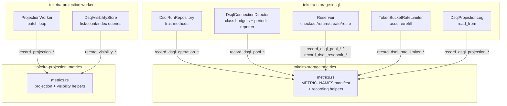

# Design Document: DSQL Observability Metrics

## Overview

This design adds comprehensive metrics instrumentation to the DSQL storage and projection layers, covering 44 requirements across 12 phases. The implementation follows the established observability foundation pattern: per-crate `metrics.rs` modules with `METRIC_NAMES` manifests and thin recording helper functions, called from the operational code paths.

The surface area is large (roughly 30 new metrics plus existing pool helpers) but each individual change is mechanical — a recording helper call at the right code path. The design prioritizes:

1. **Zero overhead when unobserved** — the `metrics` crate guarantees no-op when no recorder is installed.
2. **Never panic, never block** — metric recording is fire-and-forget; failures are silently dropped.
3. **Duration decomposition** — total operation time = checkout wait + SQL execution, enabling operators to pinpoint whether latency lives in connection management or the database.
4. **Shard-level visibility** — per-shard counters and histograms expose hotspots and data skew.
5. **Predictive signals** — utilization ratios and lifecycle rates let operators anticipate pressure before it manifests as latency.

The dashboard (`storage-projection-health.json`) is extended with rows covering DSQL operations, connection lifecycle, rate limiter, query decomposition, shard distribution, predictive signals, and error classification.

## Architecture



### Recording Call Placement

Each metric recording call is placed at the point where the measured event completes. The pattern is consistent:

```rust
let start = Instant::now();
let result = do_operation().await;
let duration = start.elapsed();
let outcome = classify_outcome(&result);
metrics::record_dsql_operation_duration(operation, outcome, duration);
metrics::record_dsql_operation_total(operation, outcome);
```

### Duration Decomposition

Total operation latency decomposes into two non-overlapping segments:

```
|--- checkout wait ---|--- SQL execution ---|
|------------- total operation -------------|
```

- **Total** (`tokeira_storage_dsql_operation_duration_seconds`): measured from before `director.acquire(class)` through query result processing.
- **Checkout** (`tokeira_dsql_pool_checkout_duration_seconds`): measured inside `acquire()` from request to permit grant using the existing pool helper.
- **SQL execution** (`tokeira_storage_dsql_query_duration_seconds`): measured from `connection.execute(query)` through result receipt.

Operators can verify: `checkout_p95 + query_p95 ≈ operation_p95` (not exact due to quantile math, but directionally correct).

## Components and Interfaces

### 1. Extended `tokeira-storage::metrics` Module

The existing `metrics.rs` gains new constants and recording helpers for all DSQL-specific metrics. The module structure remains flat — one file with constants, manifest, and helpers.

**New metric constants (Phase 1–3, 5–12):**

```rust
// Phase 1: Run Repository Operations
pub const DSQL_OPERATION_DURATION_SECONDS: &str = "tokeira_storage_dsql_operation_duration_seconds";
pub const DSQL_OCC_CONFLICT_TOTAL: &str = "tokeira_storage_dsql_occ_conflict_total";
pub const DSQL_RETRY_TOTAL: &str = "tokeira_storage_dsql_retry_total";
pub const DSQL_OPERATION_TOTAL: &str = "tokeira_storage_dsql_operation_total";

// Phase 2: Reservoir & Director
// Reuse the existing DSQL_POOL_CONNECTIONS_TOTAL metric for ready connections.
pub const DSQL_RESERVOIR_IN_FLIGHT: &str = "tokeira_dsql_reservoir_in_flight";

// Phase 3: Projection Log
pub const DSQL_PROJECTION_READ_DURATION_SECONDS: &str =
    "tokeira_storage_dsql_projection_read_duration_seconds";
pub const DSQL_PROJECTION_BATCH_SIZE: &str = "tokeira_storage_dsql_projection_batch_size";

// Phase 5: Connection Lifecycle Decomposition
// Reuse the existing DSQL_POOL_CHECKOUT_DURATION_SECONDS metric for checkout wait.
pub const DSQL_RESERVOIR_CONNECTION_CREATE_DURATION_SECONDS: &str =
    "tokeira_dsql_reservoir_connection_create_duration_seconds";
pub const DSQL_RESERVOIR_CONNECTION_VALIDATE_DURATION_SECONDS: &str =
    "tokeira_dsql_reservoir_connection_validate_duration_seconds";
pub const DSQL_RESERVOIR_CONNECTION_AGE_SECONDS: &str =
    "tokeira_dsql_reservoir_connection_age_seconds";

// Phase 6: Rate Limiter Internals
pub const DSQL_RATE_LIMITER_TOKENS_REMAINING: &str = "tokeira_dsql_rate_limiter_tokens_remaining";
pub const DSQL_RATE_LIMITER_THROTTLED_TOTAL: &str = "tokeira_dsql_rate_limiter_throttled_total";
pub const DSQL_RATE_LIMITER_THROTTLE_DURATION_SECONDS: &str =
    "tokeira_dsql_rate_limiter_throttle_duration_seconds";

// Phase 7: Query-Level Decomposition
pub const DSQL_QUERY_DURATION_SECONDS: &str = "tokeira_storage_dsql_query_duration_seconds";
pub const DSQL_ROWS_READ: &str = "tokeira_storage_dsql_rows_read";
pub const DSQL_ROWS_WRITTEN: &str = "tokeira_storage_dsql_rows_written";
pub const DSQL_COMMIT_RETRIES: &str = "tokeira_storage_dsql_commit_retries";

// Phase 8: Predictive Signals
pub const DSQL_RESERVOIR_UTILIZATION_RATIO: &str = "tokeira_dsql_reservoir_utilization_ratio";

// Phase 10: Per-Shard Distribution
pub const DSQL_SHARD_OPERATION_TOTAL: &str = "tokeira_storage_dsql_shard_operation_total";
pub const DSQL_SHARD_CONFLICT_TOTAL: &str = "tokeira_storage_dsql_shard_conflict_total";
pub const DSQL_SHARD_DURATION_SECONDS: &str = "tokeira_storage_dsql_shard_duration_seconds";

// Phase 11: Error Classification
pub const DSQL_CONNECTION_ERROR_TOTAL: &str = "tokeira_dsql_connection_error_total";
pub const DSQL_ERROR_CODE_TOTAL: &str = "tokeira_dsql_error_code_total";
```


**New recording helpers (representative subset):**

```rust
pub fn record_dsql_operation_duration(
    operation: &'static str,
    outcome: &'static str,
    duration: std::time::Duration,
) {
    histogram!(
        DSQL_OPERATION_DURATION_SECONDS,
        "operation" => operation,
        "outcome" => outcome,
    )
    .record(duration.as_secs_f64());
}

pub fn record_dsql_occ_conflict(operation: &'static str) {
    counter!(DSQL_OCC_CONFLICT_TOTAL, "operation" => operation).increment(1);
}

pub fn record_dsql_retry(operation: &'static str, outcome: &'static str) {
    counter!(DSQL_RETRY_TOTAL, "operation" => operation, "outcome" => outcome).increment(1);
}

pub fn record_dsql_operation_total(operation: &'static str, outcome: &'static str) {
    counter!(DSQL_OPERATION_TOTAL, "operation" => operation, "outcome" => outcome).increment(1);
}

pub fn set_dsql_reservoir_in_flight(count: usize) {
    gauge!(DSQL_RESERVOIR_IN_FLIGHT).set(count as f64);
}

pub fn record_dsql_projection_read_duration(partition_id: u32, duration: std::time::Duration) {
    histogram!(
        DSQL_PROJECTION_READ_DURATION_SECONDS,
        "partition_id" => partition_id.to_string(),
    )
    .record(duration.as_secs_f64());
}

pub fn record_dsql_projection_batch_size(partition_id: u32, batch_size: usize) {
    histogram!(
        DSQL_PROJECTION_BATCH_SIZE,
        "partition_id" => partition_id.to_string(),
    )
    .record(batch_size as f64);
}

pub fn record_dsql_reservoir_connection_create_duration(duration: std::time::Duration) {
    histogram!(DSQL_RESERVOIR_CONNECTION_CREATE_DURATION_SECONDS).record(duration.as_secs_f64());
}

pub fn record_dsql_reservoir_connection_validate_duration(duration: std::time::Duration) {
    histogram!(DSQL_RESERVOIR_CONNECTION_VALIDATE_DURATION_SECONDS).record(duration.as_secs_f64());
}

pub fn record_dsql_reservoir_connection_age(reason: &'static str, age: std::time::Duration) {
    histogram!(DSQL_RESERVOIR_CONNECTION_AGE_SECONDS, "retirement_reason" => reason)
        .record(age.as_secs_f64());
}

pub fn set_dsql_rate_limiter_tokens_remaining(tokens: f64) {
    gauge!(DSQL_RATE_LIMITER_TOKENS_REMAINING).set(tokens);
}

pub fn record_dsql_rate_limiter_throttled() {
    counter!(DSQL_RATE_LIMITER_THROTTLED_TOTAL).increment(1);
}

pub fn record_dsql_rate_limiter_throttle_duration(duration: std::time::Duration) {
    histogram!(DSQL_RATE_LIMITER_THROTTLE_DURATION_SECONDS).record(duration.as_secs_f64());
}

pub fn record_dsql_query_duration(
    operation: &'static str,
    outcome: &'static str,
    duration: std::time::Duration,
) {
    histogram!(
        DSQL_QUERY_DURATION_SECONDS,
        "operation" => operation,
        "outcome" => outcome,
    )
    .record(duration.as_secs_f64());
}

pub fn record_dsql_rows_read(operation: &'static str, count: usize) {
    histogram!(DSQL_ROWS_READ, "operation" => operation).record(count as f64);
}

pub fn record_dsql_rows_written(operation: &'static str, count: usize) {
    histogram!(DSQL_ROWS_WRITTEN, "operation" => operation).record(count as f64);
}

pub fn record_dsql_commit_retries(retries: u32) {
    histogram!(DSQL_COMMIT_RETRIES).record(f64::from(retries));
}

pub fn set_dsql_reservoir_utilization_ratio(in_flight: usize, ready: usize) {
    let ratio = if in_flight == 0 && ready == 0 {
        0.0
    } else {
        in_flight as f64 / (in_flight + ready) as f64
    };
    gauge!(DSQL_RESERVOIR_UTILIZATION_RATIO).set(ratio);
}

pub fn record_dsql_shard_operation(shard_id: u32, operation: &'static str) {
    counter!(
        DSQL_SHARD_OPERATION_TOTAL,
        "shard_id" => shard_id.to_string(),
        "operation" => operation,
    )
    .increment(1);
}

pub fn record_dsql_shard_conflict(shard_id: u32) {
    counter!(DSQL_SHARD_CONFLICT_TOTAL, "shard_id" => shard_id.to_string()).increment(1);
}

pub fn record_dsql_shard_duration(shard_id: u32, duration: std::time::Duration) {
    histogram!(
        DSQL_SHARD_DURATION_SECONDS,
        "shard_id" => shard_id.to_string(),
    )
    .record(duration.as_secs_f64());
}

pub fn record_dsql_connection_error(error_kind: &'static str) {
    counter!(DSQL_CONNECTION_ERROR_TOTAL, "error_kind" => error_kind).increment(1);
}

pub fn record_dsql_error_code(sqlstate: &str) {
    counter!(DSQL_ERROR_CODE_TOTAL, "sqlstate" => sqlstate.to_owned()).increment(1);
}
```

### 2. Extended `tokeira-projection::metrics` Module

New helpers for projection deep metrics (Phase 9). The existing `tokeira_projection_worker_lag_records` gauge remains the projection worker lag signal; this spec does not add wall-clock lag because projection records do not carry a commit timestamp.

```rust
pub const VISIBILITY_QUERY_DURATION_SECONDS: &str =
    "tokeira_projection_visibility_query_duration_seconds";
pub const SA_INDEX_SCAN_DURATION_SECONDS: &str =
    "tokeira_projection_sa_index_scan_duration_seconds";
pub const CHECKPOINT_WRITE_DURATION_SECONDS: &str =
    "tokeira_projection_checkpoint_write_duration_seconds";

pub fn record_visibility_query_duration(query_type: &'static str, duration: std::time::Duration) {
    histogram!(
        VISIBILITY_QUERY_DURATION_SECONDS,
        "query_type" => query_type,
    )
    .record(duration.as_secs_f64());
}

pub fn record_sa_index_scan_duration(index_table: &str, duration: std::time::Duration) {
    histogram!(
        SA_INDEX_SCAN_DURATION_SECONDS,
        "index_table" => index_table.to_owned(),
    )
    .record(duration.as_secs_f64());
}

pub fn record_checkpoint_write_duration(partition_id: u32, duration: std::time::Duration) {
    histogram!(
        CHECKPOINT_WRITE_DURATION_SECONDS,
        "partition_id" => partition_id.to_string(),
    )
    .record(duration.as_secs_f64());
}
```

### 3. Recording Call Placement by Module

#### `DsqlRunRepository` (run_repository.rs)

Each DSQL repository method follows this instrumentation pattern:

```rust
async fn commit_transition(&self, ...) -> Result<...> {
    let operation = "commit_transition";
    let shard_id = self.shard_for_run_key(run_key);
    let start = Instant::now();

    let result = self.execute_with_retry(operation, shard_id, || async {
        let checkout_start = Instant::now();
        let mut permit = self.director.acquire(DbClass::Commit).await?;
        // checkout duration recorded inside acquire()

        let query_start = Instant::now();
        let rows = sqlx::query(...)
            .execute(permit.connection()?)
            .await;
        let query_duration = query_start.elapsed();

        metrics::record_dsql_query_duration(operation, outcome, query_duration);
        metrics::record_dsql_rows_written(operation, rows_affected);
        rows
    }).await;

    let duration = start.elapsed();
    let outcome = classify_outcome(&result);
    metrics::record_dsql_operation_duration(operation, outcome, duration);
    metrics::record_dsql_operation_total(operation, outcome);
    metrics::record_dsql_shard_operation(shard_id.0, operation);
    metrics::record_dsql_shard_duration(shard_id.0, duration);

    if outcome == "conflict" {
        metrics::record_dsql_occ_conflict(operation);
        metrics::record_dsql_shard_conflict(shard_id.0);
    }

    result
}
```

**Outcome classification:**

```rust
fn classify_outcome(result: &Result<T>) -> &'static str {
    match result {
        Ok(_) => "success",
        Err(e) if is_serialization_failure_from_error(e) => "conflict",
        Err(_) => "error",
    }
}
```

**Operation name mapping**:

The authoritative rule is that the `operation` label is the DSQL repository method name, independent of tracing span names. The fixed inventory at the time of this spec is:

| Method | Operation Label |
|--------|----------------|
| `resolve_execution` | `resolve_execution` |
| `find_latest_run` | `find_latest_run` |
| `load_run` | `load_run` |
| `read_history` | `read_history` |
| `lookup_request_dedupe` | `lookup_request_dedupe` |
| `read_transition_audit` | `read_transition_audit` |
| `commit_transition` | `commit_transition` |
| `commit_transition_for_bundle` | `commit_transition_for_bundle` |
| `materialize_reset_successor` | `materialize_reset_successor` |
| `list_dispatchable_workflow_tasks` | `list_dispatchable_workflow_tasks` |
| `list_dispatchable_activity_tasks` | `list_dispatchable_activity_tasks` |
| `persist_to_backlog` | `persist_to_backlog` |
| `drain_backlog` | `drain_backlog` |
| `list_due_timers` | `list_due_timers` |
| `list_dispatchable_workflow_tasks_for_shard` | `list_dispatchable_workflow_tasks_for_shard` |
| `list_dispatchable_activity_tasks_for_shard` | `list_dispatchable_activity_tasks_for_shard` |
| `list_due_timers_for_shard` | `list_due_timers_for_shard` |
| `list_runs_with_workflow_timeouts_for_shard` | `list_runs_with_workflow_timeouts_for_shard` |
| `list_started_workflow_tasks_for_shard` | `list_started_workflow_tasks_for_shard` |
| `list_open_activities_for_shard` | `list_open_activities_for_shard` |
| `list_pending_nexus_operations_for_shard` | `list_pending_nexus_operations_for_shard` |
| `try_acquire_bundle` | `try_acquire_bundle` |
| `renew_bundle` | `renew_bundle` |
| `list_bundle_leases` | `list_bundle_leases` |
| `relinquish_bundle` | `relinquish_bundle` |
| `advance_generation` | `advance_generation` |
| `current_generation` | `current_generation` |
| `allocate_budget` | `allocate_budget` |
| `current_budget_version` | `current_budget_version` |

#### `Reservoir` (reservoir.rs)

```rust
// In checkout():
pub async fn checkout(&self) -> Result<ReservoirEntry> {
    let start = Instant::now();
    // ... existing checkout logic ...
    // On empty:
    metrics::record_dsql_pool_empty_reservoir();
    // On success:
    let duration = start.elapsed();
    // Note: class label comes from the caller (DsqlConnectionDirector.acquire)
    metrics::record_dsql_pool_connections_total(self.ready_count());
    Ok(entry)
}

// In spawn_refiller():
let create_start = Instant::now();
let conn = create_connection().await;
metrics::record_dsql_reservoir_connection_create_duration(create_start.elapsed());
metrics::record_dsql_pool_connection_created();
metrics::record_dsql_pool_connections_total(ready_count);

// In spawn_scanner() (retirement):
let age = entry.created_at.elapsed();
metrics::record_dsql_reservoir_connection_age(reason, age);
metrics::record_dsql_pool_connection_retired(reason);
metrics::record_dsql_pool_connections_total(ready_count);

// In spawn_return_processor() (validation):
let validate_start = Instant::now();
let valid = validate_connection(&entry).await;
metrics::record_dsql_reservoir_connection_validate_duration(validate_start.elapsed());
if valid {
    metrics::record_dsql_pool_connection_returned();
}
metrics::record_dsql_pool_connections_total(ready_count);
```

#### `DsqlConnectionDirector` (connection.rs)

```rust
// In acquire():
pub async fn acquire(&self, class: DbClass) -> Result<DsqlPermit> {
    let start = Instant::now();
    let _permit = self.budgets.acquire(class).await?;
    let entry = self.reservoir.checkout().await?;
    let duration = start.elapsed();
    metrics::record_dsql_pool_checkout_duration(db_class_label(class), duration);
    metrics::set_dsql_reservoir_in_flight(self.in_flight.fetch_add(1, Ordering::Relaxed) + 1);
    Ok(DsqlPermit::new(entry, _permit, self.return_sender.clone()))
}

// In DsqlPermit::drop():
fn drop(&mut self) {
    metrics::set_dsql_reservoir_in_flight(self.director_in_flight.fetch_sub(1, Ordering::Relaxed) - 1);
    // ... return connection to reservoir ...
}
```

#### Periodic Reporter Task (connection.rs)

A new `spawn_periodic_reporter` function runs every 5 seconds:

```rust
fn spawn_periodic_reporter(
    budgets: Arc<ClassBudgets>,
    reservoir: Arc<Reservoir>,
    in_flight: Arc<AtomicUsize>,
) -> JoinHandle<()> {
    tokio::spawn(async move {
        let mut interval = tokio::time::interval(Duration::from_secs(5));
        loop {
            interval.tick().await;

            // Class budget reporting
            for class in all_classes() {
                let (total, in_use, waiters) = budgets.snapshot(class).await;
                metrics::record_dsql_pool_class_budget(
                    db_class_label(class), total, in_use, waiters
                );
            }

            // Predictive signals
            let ready = reservoir.ready_count();
            let flight = in_flight.load(Ordering::Relaxed);
            metrics::record_dsql_pool_connections_total(ready);
            metrics::set_dsql_reservoir_in_flight(flight);
            metrics::set_dsql_reservoir_utilization_ratio(flight, ready);
        }
    })
}
```

#### `TokenBucketRateLimiter` (rate_limiter.rs)

```rust
// In acquire():
pub async fn acquire(&self) {
    if self.try_acquire() {
        return;
    }
    // Throttled — record the event and measure wait time
    metrics::record_dsql_rate_limiter_throttled();
    let throttle_start = Instant::now();
    loop {
        tokio::time::sleep(Duration::from_millis(5)).await;
        if self.try_acquire() {
            metrics::record_dsql_rate_limiter_throttle_duration(throttle_start.elapsed());
            return;
        }
    }
}

// In try_acquire() (existing, already calls record_dsql_pool_rate_limiter):
// Replace with:
metrics::set_dsql_rate_limiter_tokens_remaining(self.available_tokens());
```

#### `DsqlProjectionLog` (projection_log.rs)

```rust
async fn read_from(&self, cursor: &ProjectionCursor, limit: usize) -> Result<ProjectionBatch> {
    let start = Instant::now();
    let mut permit = self.director.acquire(DbClass::Projection).await?;
    let rows = sqlx::query(...)
        .fetch_all(permit.connection()?)
        .await?;
    let duration = start.elapsed();
    let partition_id = cursor.partition_id();

    metrics::record_dsql_projection_read_duration(partition_id, duration);
    metrics::record_dsql_projection_batch_size(partition_id, rows.len());

    decode_projection_rows(rows, cursor)
}
```

#### `DsqlVisibilityStore` (dsql_store.rs)

```rust
// In list_executions():
let start = Instant::now();
let result = query.fetch_all(permit.connection()?).await;
metrics::record_visibility_query_duration("list", start.elapsed());

// In count_executions():
let start = Instant::now();
let result = count_without_group(...).await;
metrics::record_visibility_query_duration("count", start.elapsed());

// After a list/count query that references typed search-attribute indexes:
let referenced_tables = referenced_search_attr_index_tables(filter, group_by);
let query_duration = start.elapsed();
for table in referenced_tables {
    metrics::record_sa_index_scan_duration(table, query_duration);
}
```

### 4. Shard ID Derivation for Per-Shard Metrics

The `shard_id` label is derived from the existing `DsqlRunRepository::shard_for_run_key()` method:

```rust
pub(crate) fn shard_for_run_key(&self, run_key: RunKey) -> ShardId {
    ShardId((run_key.0.as_u128() as u32) % self.shard_count)
}
```

For operations that target a specific shard (all run-scoped operations), the shard_id is computed from the `RunKey` before the operation executes. For shard-scan operations (`list_*_for_shard`), the shard_id is the explicit parameter.

The `shard_id` label value is the `u32` rendered as a string (e.g., `"0"`, `"7"`, `"15"`). With the default 16 shards, this produces 16 distinct label values — manageable cardinality for Prometheus.

### 5. Error Classification

Connection errors are classified by inspecting the `sqlx::Error` variant:

```rust
fn classify_connection_error(err: &sqlx::Error) -> &'static str {
    match err {
        sqlx::Error::Io(io_err) => match io_err.kind() {
            std::io::ErrorKind::ConnectionReset => "reset",
            std::io::ErrorKind::TimedOut => "timeout",
            std::io::ErrorKind::ConnectionRefused => "refused",
            _ => "reset", // default network category
        },
        sqlx::Error::Tls(_) => "tls",
        _ => "reset",
    }
}
```

SQLSTATE codes are extracted from `sqlx::Error::Database`:

```rust
fn extract_sqlstate(err: &sqlx::Error) -> Option<&str> {
    match err {
        sqlx::Error::Database(db_err) => db_err.code().map(|c| c.as_ref()),
        _ => None,
    }
}
```


### 6. Dashboard JSON Structure

The `storage-projection-health.json` dashboard is extended with DSQL-specific rows. The existing "Repository Operations" and "DSQL Pool" rows are preserved and updated. New rows are appended after the existing "Projection" row.

**Dashboard row organization:**

| Row | Y Position | Panels |
|-----|-----------|--------|
| DSQL Health (stat row) | 0 | Reservoir ready, OCC rate, Checkout p95, Operation rate |
| Repository Operations | 5 | Operation rate, Repository latency |
| DSQL Operations | 14 | Per-op latency, Op rate by outcome, OCC conflict rate |
| DSQL Pool | 23 | Pool lifecycle, Class budgets |
| Connection Lifecycle | 32 | Checkout wait, Creation time, Validation time, Connection age |
| Rate Limiter | 41 | Token fill level, Throttled rate, Throttle duration |
| Query Decomposition | 50 | SQL execution time, Rows read, Rows written, Commit retries |
| Shard Distribution | 59 | Per-shard op rate, Per-shard conflict rate, Per-shard latency |
| Predictive Signals | 68 | Utilization ratio, Refill vs retirement |
| Error Classification | 77 | Connection errors by kind, SQLSTATE codes |
| Projection | 86 | Throughput and lag, Sink |
| Projection Deep Metrics | 95 | Record lag, Visibility query, SA index attribution, Checkpoint write |

**Panel style conventions (applied uniformly):**

```json
{
  "fieldConfig": {
    "defaults": {
      "custom": {
        "drawStyle": "line",
        "lineInterpolation": "smooth",
        "lineWidth": 2,
        "fillOpacity": 8,
        "showPoints": "never",
        "pointSize": 0,
        "spanNulls": true
      }
    }
  },
  "options": {
    "tooltip": { "mode": "multi", "sort": "desc" },
    "legend": {
      "displayMode": "table",
      "placement": "bottom",
      "calcs": ["lastNotNull", "mean", "max"]
    }
  }
}
```

**Stat panel conventions:**

```json
{
  "options": {
    "colorMode": "value",
    "graphMode": "area",
    "reduceOptions": {
      "calcs": ["lastNotNull"],
      "fields": "",
      "values": false
    }
  }
}
```

All panels use datasource `{"type": "prometheus", "uid": "mimir"}`.

**Key PromQL patterns:**

- Latency quantiles: `metric_name{quantile="0.95"}` (NOT `histogram_quantile()`)
- Rates: `sum by (label) (rate(counter_name[5m]))`
- Gauges: direct reference (e.g., `tokeira_dsql_pool_connections_total`)
- Utilization ratio threshold: `tokeira_dsql_reservoir_utilization_ratio` with threshold line at 0.8

## Data Models

### New Metric Names (Complete Manifest Addition)

All entries added to `METRIC_NAMES` in `tokeira-storage::metrics`:

Unitless distribution metrics (`*_batch_size`, `*_rows_read`, `*_rows_written`, `*_commit_retries`) are recorded with `histogram!()` and require a unitless histogram metric type in the manifest. This spec explicitly adds `MetricType::Histogram` to `tokeira-types`, updates `validate_metric_name` so the generic histogram type has no required unit suffix beyond the standard `tokeira_` segment rules, and extends the shared observability tests/generators to cover the new variant.

| Constant | Name | Type |
|----------|------|------|
| `DSQL_OPERATION_DURATION_SECONDS` | `tokeira_storage_dsql_operation_duration_seconds` | DurationHistogram |
| `DSQL_OCC_CONFLICT_TOTAL` | `tokeira_storage_dsql_occ_conflict_total` | Counter |
| `DSQL_RETRY_TOTAL` | `tokeira_storage_dsql_retry_total` | Counter |
| `DSQL_OPERATION_TOTAL` | `tokeira_storage_dsql_operation_total` | Counter |
| `DSQL_RESERVOIR_IN_FLIGHT` | `tokeira_dsql_reservoir_in_flight` | Gauge |
| `DSQL_PROJECTION_READ_DURATION_SECONDS` | `tokeira_storage_dsql_projection_read_duration_seconds` | DurationHistogram |
| `DSQL_PROJECTION_BATCH_SIZE` | `tokeira_storage_dsql_projection_batch_size` | Histogram |
| `DSQL_RESERVOIR_CONNECTION_CREATE_DURATION_SECONDS` | `tokeira_dsql_reservoir_connection_create_duration_seconds` | DurationHistogram |
| `DSQL_RESERVOIR_CONNECTION_VALIDATE_DURATION_SECONDS` | `tokeira_dsql_reservoir_connection_validate_duration_seconds` | DurationHistogram |
| `DSQL_RESERVOIR_CONNECTION_AGE_SECONDS` | `tokeira_dsql_reservoir_connection_age_seconds` | DurationHistogram |
| `DSQL_RATE_LIMITER_TOKENS_REMAINING` | `tokeira_dsql_rate_limiter_tokens_remaining` | Gauge |
| `DSQL_RATE_LIMITER_THROTTLED_TOTAL` | `tokeira_dsql_rate_limiter_throttled_total` | Counter |
| `DSQL_RATE_LIMITER_THROTTLE_DURATION_SECONDS` | `tokeira_dsql_rate_limiter_throttle_duration_seconds` | DurationHistogram |
| `DSQL_QUERY_DURATION_SECONDS` | `tokeira_storage_dsql_query_duration_seconds` | DurationHistogram |
| `DSQL_ROWS_READ` | `tokeira_storage_dsql_rows_read` | Histogram |
| `DSQL_ROWS_WRITTEN` | `tokeira_storage_dsql_rows_written` | Histogram |
| `DSQL_COMMIT_RETRIES` | `tokeira_storage_dsql_commit_retries` | Histogram |
| `DSQL_RESERVOIR_UTILIZATION_RATIO` | `tokeira_dsql_reservoir_utilization_ratio` | Gauge |
| `DSQL_SHARD_OPERATION_TOTAL` | `tokeira_storage_dsql_shard_operation_total` | Counter |
| `DSQL_SHARD_CONFLICT_TOTAL` | `tokeira_storage_dsql_shard_conflict_total` | Counter |
| `DSQL_SHARD_DURATION_SECONDS` | `tokeira_storage_dsql_shard_duration_seconds` | DurationHistogram |
| `DSQL_CONNECTION_ERROR_TOTAL` | `tokeira_dsql_connection_error_total` | Counter |
| `DSQL_ERROR_CODE_TOTAL` | `tokeira_dsql_error_code_total` | Counter |

All entries added to `METRIC_NAMES` in `tokeira-projection::metrics`:

| Constant | Name | Type |
|----------|------|------|
| `VISIBILITY_QUERY_DURATION_SECONDS` | `tokeira_projection_visibility_query_duration_seconds` | DurationHistogram |
| `SA_INDEX_SCAN_DURATION_SECONDS` | `tokeira_projection_sa_index_scan_duration_seconds` | DurationHistogram |
| `CHECKPOINT_WRITE_DURATION_SECONDS` | `tokeira_projection_checkpoint_write_duration_seconds` | DurationHistogram |

### Label Cardinality Analysis

| Label | Max Cardinality | Source |
|-------|----------------|--------|
| `operation` | ~29 | Fixed set of method names |
| `outcome` | 3 | `success`, `conflict`, `error` |
| `class` | 5 | `control`, `commit`, `read`, `projection`, `maintenance` |
| `shard_id` | 16 (default) | Configured `shard_count` |
| `partition_id` | 4–16 | Projection partition count |
| `retirement_reason` | 4 | `expired`, `unhealthy`, `guard_window`, `budget_cap` |
| `error_kind` | 5 | `reset`, `timeout`, `dns`, `tls`, `refused` |
| `sqlstate` | ~10 | Common DSQL error codes |
| `query_type` | 2 | `list`, `count` |
| `index_table` | ~5 | Search attribute index tables |

Total worst-case time series: ~500. Well within Prometheus/Mimir operational limits.


## Correctness Properties

*A property is a characteristic or behavior that should hold true across all valid executions of a system — essentially, a formal statement about what the system should do. Properties serve as the bridge between human-readable specifications and machine-verifiable correctness guarantees.*

### Property 1: Metric name validation

*For any* metric name and metric type in the `METRIC_NAMES` manifest (both `tokeira-storage` and `tokeira-projection`), `validate_metric_name(name, type)` SHALL return `Ok(())`. The generator includes all shared `MetricType` variants, including the new unitless `Histogram` variant.

**Validates: Requirements 17.1, 17.2, 17.3, 17.4**

### Property 2: Counter accounting accuracy

*For any* sequence of N counter increment calls with arbitrary label combinations, the recorded counter value SHALL equal N (the sum of all increments). This applies to all counter recording helpers: `record_dsql_occ_conflict`, `record_dsql_retry`, `record_dsql_operation_total`, `record_dsql_rate_limiter_throttled`, `record_dsql_shard_operation`, `record_dsql_shard_conflict`, `record_dsql_connection_error`, `record_dsql_error_code`.

**Validates: Requirements 2.1, 3.1, 4.1, 23.1, 33.1, 34.1, 36.1, 37.1**

### Property 3: Histogram observation accuracy

*For any* sequence of histogram observations with arbitrary durations/counts and label combinations, the recorded histogram SHALL contain exactly the number of observations made, and each observation value SHALL match the input value. This applies to all histogram recording helpers: `record_dsql_operation_duration`, `record_dsql_projection_read_duration`, `record_dsql_projection_batch_size`, `record_dsql_reservoir_connection_create_duration`, `record_dsql_reservoir_connection_validate_duration`, `record_dsql_reservoir_connection_age`, `record_dsql_rate_limiter_throttle_duration`, `record_dsql_query_duration`, `record_dsql_rows_read`, `record_dsql_rows_written`, `record_dsql_commit_retries`, `record_dsql_shard_duration`.

**Validates: Requirements 1.1, 10.1, 11.1, 19.1, 20.1, 21.1, 24.1, 25.1, 26.1, 27.1, 28.1, 35.1**

### Property 4: Gauge last-write-wins

*For any* sequence of gauge set operations, the final recorded gauge value SHALL equal the last value set. This applies to all gauge recording helpers: `set_dsql_reservoir_in_flight`, `set_dsql_rate_limiter_tokens_remaining`, `set_dsql_reservoir_utilization_ratio`.

**Validates: Requirements 5.1, 6.1, 22.1, 29.1**

### Property 5: Utilization ratio computation

*For any* pair of non-negative integers `(in_flight, ready)`, `set_dsql_reservoir_utilization_ratio(in_flight, ready)` SHALL record a gauge value equal to `in_flight / (in_flight + ready)` when the sum is non-zero, and `0.0` when both are zero. The recorded value SHALL always be in the range `[0.0, 1.0]`.

**Validates: Requirements 29.1, 29.2, 29.3**

### Property 6: Shard ID derivation determinism

*For any* `RunKey` and `shard_count > 0`, `shard_for_run_key` SHALL always produce the same `ShardId`, and that `ShardId` SHALL be in the range `[0, shard_count)`. This ensures per-shard metrics are consistently attributed.

**Validates: Requirements 33.2, 34.2, 35.2**

## Error Handling

### Metric Recording Never Panics

All recording helpers use the `metrics` crate macros (`counter!`, `gauge!`, `histogram!`) which are guaranteed to never panic:

- If no recorder is installed, calls are no-ops (zero cost).
- If the recorder encounters an internal error, it is silently dropped.
- Label allocation (`to_string()`, `to_owned()`) can theoretically OOM, but this is not specific to metrics — it's a system-wide concern.

### Metric Recording Never Blocks

The `metrics` crate's recording API is synchronous and non-blocking. The `PrometheusBuilder` recorder uses lock-free data structures internally. Recording a metric is a few atomic operations — no I/O, no allocation in the hot path (label strings are pre-allocated or `&'static str`).

### Periodic Reporter Resilience

The periodic reporter task (`spawn_periodic_reporter`) runs in a `tokio::spawn` with no error propagation to the caller. If the task panics (which it shouldn't — all operations are infallible gauge sets), it does not affect the connection director or reservoir operation. The task uses `tokio::time::interval` which is cancel-safe.

### Label Value Safety

- `&'static str` labels (operation names, outcome values, class names, error kinds) have zero allocation cost.
- `u32.to_string()` labels (shard_id, partition_id) allocate a small string per recording call. This is acceptable given the low cardinality (max 16 shards × ~29 operations = 464 unique combinations).
- `sqlstate.to_owned()` for SQLSTATE codes allocates a 5-byte string. This only happens on error paths, which are infrequent.

### Dashboard Rendering Failures

If a metric is not emitted (e.g., no DSQL operations have occurred), Grafana panels show "No data" rather than errors. This is the expected behavior for a freshly started system. The `spanNulls: true` setting ensures timeseries panels connect across gaps.

## Testing Strategy

### Property-Based Tests

Property-based tests use the `proptest` crate. Each property test runs a minimum of 100 iterations.

| Property | Test Location | Generator Strategy |
|---|---|---|
| Property 1: Metric name validation | `tokeira-types/src/observability.rs`, `tokeira-storage/src/metrics.rs`, and `tokeira-projection/src/metrics.rs` | Generate all `MetricType` variants, including `MetricType::Histogram`, and iterate all manifest entries calling `validate_metric_name`. |
| Property 2: Counter accounting | `tokeira-storage/src/metrics.rs` | Generate random sequences of `(operation: &str, count: u64)` pairs. Install `DebuggingRecorder`, replay sequence, assert counter value equals sum. |
| Property 3: Histogram observation | `tokeira-storage/src/metrics.rs` | Generate random sequences of `(duration_ms: u64, operation: &str)` pairs. Install `DebuggingRecorder`, replay, assert observation count and values match. |
| Property 4: Gauge last-write-wins | `tokeira-storage/src/metrics.rs` | Generate random sequences of `f64` values. Install `DebuggingRecorder`, set each value, assert final snapshot equals last value. |
| Property 5: Utilization ratio | `tokeira-storage/src/metrics.rs` | Generate random `(in_flight: u32, ready: u32)` pairs. Compute expected ratio, call helper, assert gauge matches expected. Include `(0, 0)` edge case. |
| Property 6: Shard ID determinism | `tokeira-storage/src/dsql/run_repository.rs` (existing test module) | Generate random `RunKey` values and `shard_count` in `1..=1024`. Assert `shard_for_run_key` is deterministic (call twice, same result) and in range `[0, shard_count)`. |

**Tag format:** `Feature: dsql-observability-metrics, Property {N}: {title}`

### Unit Tests (Example-Based)

- **Helper emission:** Verify each new recording helper emits the expected metric name with correct labels (extends existing `helpers_emit_expected_metrics_and_labels` test).
- **Outcome classification:** Verify `classify_outcome` maps `Ok(_)` → `"success"`, serialization failure → `"conflict"`, other errors → `"error"`.
- **Error kind classification:** Verify `classify_connection_error` maps IO errors to correct `error_kind` values.
- **SQLSTATE extraction:** Verify `extract_sqlstate` returns the 5-character code from database errors.
- **Batch size zero:** Verify `record_dsql_projection_batch_size(partition, 0)` records a histogram observation of 0.0.
- **Utilization ratio edge cases:** Verify `(0, 0)` → 0.0, `(1, 0)` → 1.0, `(0, 1)` → 0.0, `(5, 5)` → 0.5.

### Dashboard Tests

- **No histogram_quantile:** Parse `storage-projection-health.json`, assert no panel target contains `histogram_quantile(` or `_bucket`.
- **Datasource UID:** Assert all panels use `"uid": "mimir"`.
- **Panel descriptions:** Assert all timeseries and stat panels have non-empty `description` fields.
- **Style consistency:** Assert all timeseries panels have `lineInterpolation: "smooth"`, `showPoints: "never"`, `pointSize: 0`.
- **Legend consistency:** Assert all timeseries panels have bottom-placed table legends with `lastNotNull`, `mean`, `max` calcs.

### Integration Tests

- **End-to-end metric emission:** Start `tokeirad` with DSQL backend, execute a workflow, scrape `/metrics`, verify `tokeira_storage_dsql_operation_duration_seconds` appears with expected labels.
- **Periodic reporter:** Exercise a test-controlled reporting tick or one-shot reporter method and verify class budget gauges are recorded without using explicit sleeps.
- **Rate limiter throttle:** Configure a rate limiter with capacity 1, acquire twice rapidly, verify `tokeira_dsql_rate_limiter_throttled_total` increments.
