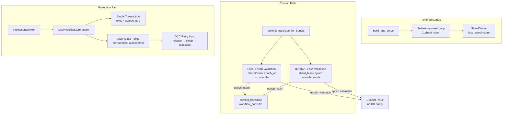

# Design Document: DSQL Performance Fixes

## Overview

This design eliminates the artificial serialization bottleneck in compose+DSQL deployments that limits throughput to 5 wf/s. The root cause is single-shard serialization: with `shard_count=1`, every commit routes through the same runtime shard and the same `shard_lease` row, serializing all concurrent transactions through one DSQL OCC fence point.

The fix is structural, not tuning:

1. **Self-assign 32 shards** on startup (no controller needed) — distributes commits across 32 independent fence rows.
2. **Validate epochs locally in the runtime lane for no-controller deployments** from ShardOwner state — removes the per-transition `SELECT epoch FROM shard_lease` for single-node compose without making storage depend on runtime types.
3. **Shard vis_rollup by partition** — eliminates the OCC hotspot where 4+ projection workers increment the same counter row.
4. **Retry OCC conflicts with connection release** — prevents pool starvation during transient conflicts.
5. **Single-transaction apply** — reduces connection acquisitions per projection record from 3+ to 1.

Supporting changes add statement-level timing, class permit wait metrics, generic storage metric emission, and adjusted defaults for DSQL deployments.

Target: 50–100 wf/s at c=20 from a developer laptop to eu-west-2 (up from 5 wf/s).

## Architecture



### Key Design Invariants

1. **The lease row fences authority only where takeover exists.** In no-controller compose mode, there is no competing owner that can increment epochs, so the commit path skips the per-transition `shard_lease` read after lane-local ownership validation. In controller-managed mode, the DSQL repository keeps the existing per-transition epoch read so takeover remains durably fenced.

2. **Never sleep while holding a pool connection or class permit.** The OCC retry loop releases the connection before sleeping and re-acquires after waking.

3. **Rollup stays autocommit (Pattern A).** The execution/search-attr transaction is separate from rollup. Rollup conflicts do not abort the execution write.

4. **Retry is graceful degradation; sharding removes the conflict.** With `partition_id` in the rollup PK, two workers never touch the same row. Retry handles the residual case (same partition retrying its own row after a transient failure).

5. **shard_count=32 for compose+DSQL.** This is the default, not an operator tuning knob. Runtime lane routing uses `ShardOwner::shard_count()` for `execution_home_bundle()`, so `shard_count` is the value that must be 32. 32 shards × 52ms RTT = theoretical 12.3 commits/s per shard, 394 commits/s total — well above the 60 commits/s needed for 20 concurrent workflows.

## Components and Interfaces

### 1. Self-Assignment Logic (tokeirad startup)

**Location:** `apps/tokeirad/src/lib.rs`, inside `build_and_serve_with_storage`

When `controller_endpoint` is `None`, the node self-assigns all runtime shards immediately after constructing the runtime and before spawning projection workers:

```rust
// After runtime construction, before projection workers:
if effective_config.infrastructure.placement.controller_endpoint.is_none() {
    let shard_count = effective_config.infrastructure.placement.shard_count;
    let mut acquired = 0u32;
    for shard_index in 0..shard_count {
        let shard_id = ShardId(shard_index);
        match run_repository.try_acquire_bundle(
            shard_id,
            node_id.to_string(),
            node_endpoint.as_authority(),
        ).await {
            Ok(LeaseOutcome::Acquired { epoch } | LeaseOutcome::Renewed { epoch }) => {
                runtime.record_self_assigned_shard(shard_id, epoch);
                acquired += 1;
            }
            Ok(LeaseOutcome::Rejected { current_owner, current_epoch }) => {
                tracing::warn!(
                    %shard_index,
                    %current_owner,
                    current_epoch = current_epoch.0,
                    "failed to self-assign shard: lease is held by another owner"
                );
            }
            Err(error) => {
                tracing::warn!(%shard_index, ?error, "failed to self-assign shard");
            }
        }
    }
    info!(acquired, shard_count, "self-assigned shards (no controller)");
}
```

**Design decisions:**
- Epoch comes from `LeaseOutcome::Acquired { epoch }` or `LeaseOutcome::Renewed { epoch }`; self-assignment never hard-codes epoch 1.
- Shards are marked `Active` immediately (no sweep phase needed — the node is the only owner).
- Lease duration remains repository configuration (`DsqlPoolConfig::lease_duration`), not an argument to the lease API.
- Failures are logged and skipped — partial assignment is acceptable for a dev deployment.

### 2. Local Epoch Validation

**Location:** `crates/tokeira-runtime/src/lane.rs`, inside the lane commit retry path before calling `commit_transition_for_bundle`

The current DSQL implementation opens a transaction, reads `shard_lease`, validates the epoch, then rolls back and delegates to `commit_transition`. Storage cannot depend on `tokeira-runtime::ShardOwner`, so the local epoch check belongs in the runtime lane that already owns `Arc<RwLock<ShardOwner>>`.

The zero-epoch fast path is only used when `controller_endpoint` is `None`. With no placement controller, the node is the only owner and there is no takeover path that can increment a durable epoch behind its back. When `controller_endpoint` is configured, the lane passes the real local epoch to storage and the DSQL repository keeps the durable `shard_lease` validation query. The runtime needs a small config flag, for example `controller_managed_placement: bool`, derived from the effective server config at startup.

```rust
let (execution_home_bundle, commit_epoch) = {
    let owner = shard_owner.read().unwrap();
    let bundle_id = execution_home_bundle(
        transition.next_state.namespace_id.0.as_bytes(),
        transition.next_state.workflow_id.0.as_bytes(),
        owner.shard_count(),
    );
    let Some(local_epoch) = owner.epoch_of(bundle_id) else {
        return Ok(CommitResult::Conflict {
            reason: format!("not owner of execution-home shard {bundle_id:?}"),
        });
    };
    let epoch = if !runtime_config.controller_managed_placement {
        ShardEpoch::ZERO
    } else {
        local_epoch
    };
    (bundle_id, epoch)
};

repo.commit_transition_for_bundle(
    run_key,
    execution_home_bundle,
    transition,
    commit_epoch,
).await
```

**Interface change:** No `tokeira-storage` dependency on `tokeira-runtime` is introduced. The lane performs local validation and calls the existing storage API with `ShardEpoch::ZERO` only in no-controller mode; the DSQL repository bypasses the per-transition `SELECT epoch FROM shard_lease` only when the epoch is zero and preserves the existing query for non-zero epochs.

**Safety argument:** In no-controller compose mode, there is no takeover scenario, so local ShardOwner state is sufficient authority and the durable epoch read is unnecessary. In controller-managed mode, a stale owner can still have current per-run `transition_seq`, so `workflow_hot` CAS is not an ownership fence; the durable `shard_lease` epoch read remains the takeover fence.

### 3. vis_rollup Schema Change

**Schema change:** Modify the existing migration file that creates `vis_rollup` to include `partition_id` in the table definition. This is a source migration change for fresh databases. Existing DSQL databases that have already applied the old migration must be reset before running this spec because the migration runner will not reapply an edited migration recorded in `schema_version`.

```sql
CREATE TABLE vis_rollup (
    namespace_id UUID NOT NULL,
    dimension SMALLINT NOT NULL,
    value TEXT NOT NULL,
    partition_id INT NOT NULL DEFAULT 0,
    counter BIGINT NOT NULL DEFAULT 0,
    PRIMARY KEY (namespace_id, dimension, value, partition_id)
);
```

**Write path** (`accumulate_rollup`):

```sql
INSERT INTO vis_rollup (namespace_id, dimension, value, partition_id, counter)
VALUES ($1, $2, $3, $4, $5)
ON CONFLICT (namespace_id, dimension, value, partition_id) DO UPDATE
SET counter = vis_rollup.counter + EXCLUDED.counter
```

The `partition_id` parameter comes from the `ProjectionWorker`'s partition assignment (0..partition_count).

The partition count must be wired end-to-end from `TokeiraConfig.infrastructure.placement.partition_count` into both sides of the projection pipeline:

- `DsqlRunRepository` must write projection records with `partition_id = partition_for(run_key, configured_partition_count)`, not a hard-coded 16-way constant.
- `DsqlProjectionLog` and `ProjectionWorker` startup must use the same configured partition count/fanout.
- `tokeirad` must spawn exactly `partition_count` visibility workers, not the current hard-coded 16.

**Read path** (`count_workflow_executions` rollup query):

```sql
SELECT dimension, value, SUM(counter) as counter
FROM vis_rollup
WHERE namespace_id = $1
GROUP BY dimension, value
```

The `SUM(counter)` aggregation across partition_id values is the only read-path change. Since `partition_count` defaults to 4, this sums at most 4 rows per (namespace_id, dimension, value) tuple — negligible overhead.

### 4. OCC Retry with Connection Release

**Location:** `crates/tokeira-projection/src/dsql_store.rs`, `accumulate_rollup`

```rust
async fn accumulate_rollup(&self, partition_id: u32, entries: &[RollupDelta]) -> Result<()> {
    for entry in entries {
        let mut attempts = 0u32;
        loop {
            let mut permit = self.director.acquire(DbClass::Projection).await?;
            let result = sqlx::query(
                r#"INSERT INTO vis_rollup (namespace_id, dimension, value, partition_id, counter)
                   VALUES ($1, $2, $3, $4, $5)
                   ON CONFLICT (namespace_id, dimension, value, partition_id) DO UPDATE
                   SET counter = vis_rollup.counter + EXCLUDED.counter"#,
            )
            .bind(entry.namespace_id.0)
            .bind(entry.dimension.to_db_smallint())
            .bind(&entry.value)
            .bind(partition_id as i32)
            .bind(entry.delta)
            .execute(permit.connection()?)
            .await;

            // Drop permit (releases connection) BEFORE any sleep.
            drop(permit);

            match result {
                Ok(_) => break,
                Err(e) if Self::is_occ_conflict(&e) && attempts < 5 => {
                    attempts += 1;
                    metrics::record_dsql_occ_conflict("accumulate_rollup");
                    let jitter = rand::random::<u64>() % 50;
                    let delay = Duration::from_millis(10 * u64::from(attempts) + jitter);
                    tokio::time::sleep(delay).await;
                    // Loop re-acquires connection at top
                }
                Err(e) if Self::is_occ_conflict(&e) => {
                    metrics::record_dsql_retry("accumulate_rollup", "exhausted");
                    return Err(e.into());
                }
                Err(e) => return Err(e.into()),
            }
        }
        if attempts > 0 {
            metrics::record_dsql_retry("accumulate_rollup", "success");
        }
    }
    Ok(())
}
```

**Critical pattern:** `acquire → try → drop(permit) → sleep → re-acquire`. The permit (and its connection) is released before the sleep. This ensures:
- No connection held idle during backoff.
- No class permit held during backoff.
- Commit-class connections remain available for the commit path.

### 5. Single-Transaction Apply Structure

**Location:** `crates/tokeira-projection/src/dsql_store.rs`, `apply` method

Current: each sub-operation (`upsert_execution`, `upsert_search_attr_index`, `accumulate_rollup`) acquires its own connection independently.

New: execution + search attributes share one transaction; rollup remains separate autocommit.

```rust
async fn apply(&self, record: &ProjectionRecord) -> Result<()> {
    let previous = self.get_row(record.run_key).await;
    let mut row = previous.clone().unwrap_or_else(|| ExecutionRow {
        run_key: record.run_key,
        namespace_id: record.context.namespace_id,
        workflow_id: record.context.workflow_id.clone(),
        run_id: record.context.run_id,
        workflow_type: record.context.workflow_type.clone(),
        task_queue: record.context.task_queue.clone(),
        status: record.context.execution_status,
        start_time: record.context.start_time,
        execution_time: record.context.execution_time,
        close_time: record.context.close_time,
        history_length: record.context.history_length,
        state_transition_count: record.context.state_transition_count,
        memo: Memo::default(),
        search_attr_version: 0,
    });
    let mut search_patch = SearchAttributes::default();

    row.namespace_id = record.context.namespace_id;
    row.workflow_id = record.context.workflow_id.clone();
    row.run_id = record.context.run_id;
    row.workflow_type = record.context.workflow_type.clone();
    row.task_queue = record.context.task_queue.clone();
    row.start_time = record.context.start_time;
    row.execution_time = record.context.execution_time;
    row.history_length = record.context.history_length;
    row.state_transition_count = record.context.state_transition_count;

    for op in &record.ops {
        match op {
            ProjectionOp::UpsertExecution {
                status,
                memo_patch,
                search_attr_patch,
            } => {
                row.status = *status;
                row.memo.0.extend(memo_patch.0.clone());
                search_patch.0.extend(search_attr_patch.0.clone());
            }
            ProjectionOp::CloseExecution { status, closed_at } => {
                row.status = *status;
                row.close_time = Some(*closed_at);
            }
        }
    }

    let mut resolved_search_attrs = Vec::new();
    for (name, value) in &search_patch.0 {
        let Some(attr) = self.resolve_attr(record.context.namespace_id, name).await? else {
            bail!("unknown search attribute: {name}");
        };
        let actual = search_attr_type_of(value);
        if attr.attr_type != actual {
            bail!(
                "search attribute type mismatch for {name}: expected {:?}, got {:?}",
                attr.attr_type,
                actual
            );
        }
        resolved_search_attrs.push((attr, value));
        row.search_attr_version += 1;
    }

    // Phase 1: Execution + search attributes in a single transaction.
    let mut attempts = 0u32;
    loop {
        let mut permit = self.director.acquire(DbClass::Projection).await?;
        let tx_result = async {
            let mut tx = permit.connection()?.begin().await?;
            upsert_execution_row(&mut *tx, &row, Some(codec::encode(&row.memo)?)).await?;
            for (attr, value) in &resolved_search_attrs {
                remove_search_attr_index_row_tx(
                    &mut *tx,
                    record.run_key,
                    record.context.namespace_id,
                    attr.attr_id,
                    attr.attr_type,
                ).await?;
                upsert_search_attr_index_row_tx(
                    &mut *tx,
                    record.run_key,
                    record.context.namespace_id,
                    attr.attr_id,
                    attr.attr_type,
                    value,
                ).await?;
            }
            tx.commit().await?;
            Ok::<(), anyhow::Error>(())
        }.await;

        drop(permit); // Release before potential sleep.

        match tx_result {
            Ok(()) => break,
            Err(e) if Self::is_occ_conflict(&e) && attempts < 5 => {
                attempts += 1;
                metrics::record_dsql_occ_conflict("projection_apply_tx");
                let jitter = rand::random::<u64>() % 50;
                let delay = Duration::from_millis(10 * u64::from(attempts) + jitter);
                tokio::time::sleep(delay).await;
            }
            Err(e) if Self::is_occ_conflict(&e) => {
                metrics::record_dsql_retry("projection_apply_tx", "exhausted");
                return Err(e);
            }
            Err(e) => return Err(e),
        }
    }

    // Phase 2: Rollup accumulation (autocommit, per-statement retry).
    let deltas = compute_rollup_deltas(previous.as_ref(), &row);
    if !deltas.is_empty() {
        self.accumulate_rollup(record.partition_id, &deltas).await?;
    }

    Ok(())
}
```

This sketch uses the current `ProjectionRecord` shape: the row is built from `record.context`, changes are derived from `record.ops`, search-attribute patch data is accumulated from `ProjectionOp::UpsertExecution`, and rollup deltas are computed from the previous/current execution rows. It does not introduce `ProjectionRecord.search_attributes` or `ProjectionRecord.rollup_deltas`.

**Rationale for separation:**
- Execution + search attrs are logically atomic (partial application = inconsistent visibility).
- Rollup is an aggregate counter — eventual consistency is acceptable.
- Keeping rollup outside the transaction means a rollup OCC conflict doesn't abort the execution write.
- Rollup uses per-statement retry (Requirement 4); the transaction uses whole-transaction retry (Requirement 5.3).

### 6. Statement-Level Duration Instrumentation

**Location:** `crates/tokeira-storage/src/dsql/run_repository.rs` (commit path) and `crates/tokeira-projection/src/dsql_store.rs` (projection path)

New metric: `tokeira_storage_dsql_statement_duration_seconds` with labels `operation` and `statement`.

**Commit path instrumentation points:**

| Statement Label | What It Measures |
|----------------|-----------------|
| `load_hot` | `SELECT transition_seq FROM workflow_hot WHERE run_key = $1 FOR UPDATE` |
| `append_history` | `INSERT INTO transition_history ...` |
| `update_execution` | `UPSERT INTO workflow_hot ...` |
| `dedupe_check` | `SELECT 1 FROM request_dedupe WHERE key = $1` |
| `current_execution_check` | `SELECT run_key, is_open FROM current_execution WHERE key = $1` |

**Projection path instrumentation points:**

| Statement Label | What It Measures |
|----------------|-----------------|
| `upsert_execution` | The execution row upsert within the transaction |
| `upsert_search_attr` | Each search attribute index upsert |
| `upsert_rollup` | Each rollup delta upsert (per-statement) |

**Recording pattern:**

```rust
let stmt_start = Instant::now();
let result = sqlx::query(...)
    .execute(&mut *tx)
    .await;
metrics::record_dsql_statement_duration("commit_transition", "load_hot", stmt_start.elapsed());
```

### 7. Class Permit Wait Metrics

**Location:** `crates/tokeira-storage/src/dsql/connection.rs`, inside `ClassBudgets::acquire`

New metrics:
- `tokeira_dsql_class_permit_wait_duration_seconds` — histogram with `class` label
- `tokeira_dsql_pool_waiting` — gauge with `class` label (number of operations currently waiting)

```rust
pub async fn acquire(&self, class: DbClass) -> Result<OwnedSemaphorePermit> {
    let label = db_class_label(class);
    metrics::increment_dsql_pool_waiting(label);
    let start = Instant::now();

    let permit = self.semaphores[&class].acquire().await?;

    let wait = start.elapsed();
    metrics::decrement_dsql_pool_waiting(label);
    metrics::record_dsql_class_permit_wait_duration(label, wait);

    Ok(permit)
}
```

**Hard isolation invariant:** The `ConnectionDirector` is the sole path for acquiring DSQL connections. All code paths (commit, read, projection, control, maintenance) go through `director.acquire(class)`. The class budget semaphores guarantee that projection operations cannot consume commit-class permits.

### 8. Generic Storage Metrics from DSQL Path

**Location:** `crates/tokeira-storage/src/dsql/run_repository.rs`

The in-memory path emits `tokeira_storage_commit_transition_duration_seconds`, `tokeira_storage_load_run_duration_seconds`, `tokeira_storage_read_history_duration_seconds`, and `tokeira_storage_repository_operation_total`. The DSQL path must emit the same metrics so the "Repository Operations" dashboard row works for both backends.

The existing `record_dsql_commit_operation!` macro already measures duration. It is extended to also emit the generic metrics:

```rust
macro_rules! record_dsql_commit_operation {
    ($repo:expr, $operation:expr, $shard_id:expr, $body:block) => {{
        let started = Instant::now();
        let result = (async $body).await;
        let duration = started.elapsed();
        $repo.record_commit_operation_result($operation, $shard_id, duration, &result);
        // NEW: emit generic storage metrics alongside DSQL-specific ones
        generic_metrics::record_storage_operation($operation, &result);
        if $operation == "commit_transition" || $operation == "commit_transition_for_bundle" {
            generic_metrics::record_commit_transition_duration(duration);
        }
        result
    }};
}
```

Similarly, `load_run` and `read_history` emit their generic duration metrics at the call site.

### 9. Default Configuration Changes

**Location:** `crates/tokeira-config/src/lib.rs`

The default functions for `shard_count` and `partition_count` become storage-aware. Since the config model uses `serde(default)` functions that cannot access other fields, the approach is:

**Option A (chosen): Post-parse adjustment in `TokeiraConfig::validate` or a new `apply_storage_defaults` method.**

```rust
impl TokeiraConfig {
    /// Apply storage-backend-specific defaults for fields left at their
    /// compile-time defaults. Called after parsing, before validation.
    pub fn apply_storage_defaults(&mut self) {
        if self.infrastructure.storage == ConfigStorageKind::Dsql {
            // Until the config loader tracks explicitness, DSQL treats the
            // single-shard value as an unsafe legacy/default value and promotes
            // it to the performance-safe default.
            if self.infrastructure.placement.shard_count == 1 {
                self.infrastructure.placement.shard_count = 32;
            }
            if self.infrastructure.placement.partition_count == 16 {
                self.infrastructure.placement.partition_count = 4;
            }
        }
    }
}
```

This is called in `TokeiraConfig::resolve` after parsing and before validation. The config model does not track whether a value came from TOML or a serde default, so DSQL treats legacy/default values by value: `shard_count = 1` is always promoted to 32, and `partition_count = 16` is always promoted to 4. Operators who need a non-default value must choose a value outside those legacy defaults, for example `shard_count = 2` or `partition_count = 8`.

**Effective defaults by storage backend:**

| Setting | in-memory | dsql |
|---------|-----------|------|
| `shard_count` | 1 | 32 |
| `partition_count` | 16 | 4 |
| `bundle_count` | 1 | unchanged unless a separate placement-controller spec changes it |

The effective placement config must also feed DSQL storage construction. `apps/tokeirad/src/lib.rs` must build `DsqlPoolConfig` from `effective_config.infrastructure.placement`, rather than using `DsqlPoolConfig::default()`, so `DsqlRunRepository` persists rows with the same `shard_count` used by runtime lane routing and the same projection partition count used by `ProjectionWorker` fanout.

### 10. Validation Benchmark

**Location:** Documentation in this design + existing `apps/tokeira-bench`

The benchmark uses the existing `tokeira-bench` binary:

```bash
cargo run -p tokeira-bench -- --workflows 2000 --concurrency 20
```

**Prerequisites:**
- All fixes from Requirements 1–5 applied.
- `tokeirad.toml` with `infrastructure.storage = "dsql"` and valid endpoint.
- Defaults applied: `shard_count = 32`, `partition_count = 4`.

**Success criteria:** 50+ wf/s sustained throughput over 2000 workflows at concurrency 20.

**Expected performance model:**
- 3 sequential commits per workflow × 52ms RTT = 156ms minimum per workflow.
- At concurrency 20: 20 / 0.156 = 128 wf/s theoretical maximum.
- With 32 shards, no single-row serialization.
- With partition-sharded rollup, no OCC conflicts on projection.
- Target 50+ wf/s accounts for load_run reads, projection overhead, and connection checkout latency.

## Data Models

### Schema Changes

**vis_rollup table (modified):**

```sql
CREATE TABLE vis_rollup (
    namespace_id UUID NOT NULL,
    dimension SMALLINT NOT NULL,
    value TEXT NOT NULL,
    partition_id INT NOT NULL DEFAULT 0,
    counter BIGINT NOT NULL DEFAULT 0,
    PRIMARY KEY (namespace_id, dimension, value, partition_id)
);
```

### New Metric Names

| Metric | Type | Labels |
|--------|------|--------|
| `tokeira_storage_dsql_statement_duration_seconds` | Histogram | `operation`, `statement` |
| `tokeira_dsql_class_permit_wait_duration_seconds` | Histogram | `class` |
| `tokeira_dsql_pool_waiting` | Gauge | `class` |

These are additions to the existing DSQL metrics manifest. The generic storage metrics (`tokeira_storage_commit_transition_duration_seconds`, etc.) already exist — they are simply emitted from the DSQL path in addition to the in-memory path.

### Dashboard Style Contract

Any dashboard updates made for this spec must follow the compose observability dashboard conventions:

- Layout uses Grafana's 24-column grid. Rows align stat panels and timeseries panels consistently, so repeated rows have the same `gridPos.w`, `gridPos.x`, and row rhythm.
- Timeseries panels use smooth lines with no point markers: `lineInterpolation: "smooth"`, `showPoints: "never"`, and `pointSize: 0`.
- Timeseries legends are bottom-placed table legends with `lastNotNull`, `mean`, and `max` calculations.
- Rate panels use PromQL `rate()` queries over an explicit range window and set an explicit rate unit, such as `ops` for operations per second.
- Every panel includes a `description` that explains what the signal measures and how an operator should interpret high, low, rising, or anomalous values.

### Interface Changes

| Component | Change |
|-----------|--------|
| `Runtime lane` | Validates execution-home shard ownership against `ShardOwner` before calling storage |
| `DsqlRunRepository` | Bypasses the per-transition `shard_lease` read only when called with `ShardEpoch::ZERO`; non-zero epochs keep the existing durable lease validation |
| `DsqlVisibilityStore::apply` | Signature gains `partition_id: u32` parameter |
| `DsqlVisibilityStore::accumulate_rollup` | Signature gains `partition_id: u32` parameter |
| `ProjectionWorker` | Passes its `partition_id` to `sink.apply(record, partition_id)` |
| `ProjectionSink::apply` | Trait method signature extended with `partition_id: u32` |
| `PlacementMembershipConfig` | Default `shard_count` changes from 1 to 32 for DSQL |
| `PlacementMembershipConfig` | Default `partition_count` changes from 16 to 4 for DSQL |
| `DsqlPoolConfig` construction | Uses effective placement `shard_count` and projection partition count instead of independent defaults |


## Correctness Properties

*A property is a characteristic or behavior that should hold true across all valid executions of a system — essentially, a formal statement about what the system should do. Properties serve as the bridge between human-readable specifications and machine-verifiable correctness guarantees.*

### Property 1: Self-assignment completeness

*For any* `shard_count` in 1..64 and any failure pattern (subset of shards whose `try_acquire_bundle` fails), the self-assignment loop SHALL attempt acquisition for every shard in `0..shard_count`, and the ShardOwner SHALL contain exactly the successfully acquired shards, each with the epoch returned by the lease API.

**Validates: Requirements 1.1, 1.2, 1.3**

### Property 2: Local epoch validation without database query in no-controller mode

*For any* ShardOwner state and any execution-home shard derived by the lane, while `controller_endpoint` is not configured, if the lane cannot find a matching local epoch, the lane SHALL return `CommitResult::Conflict` without calling `commit_transition_for_bundle` or executing any SQL query against the database. When the epoch matches, the lane SHALL call `commit_transition_for_bundle` with `ShardEpoch::ZERO`. While `controller_endpoint` is configured, the lane SHALL pass the real local epoch and storage SHALL execute its existing durable `shard_lease` validation.

**Validates: Requirements 2.1, 2.3, 2.6**

### Property 3: Partition-sharded rollup isolation

*For any* two distinct `partition_id` values and any `(namespace_id, dimension, value)` tuple, writing rollup deltas with those two partition_ids SHALL produce two separate rows in `vis_rollup` and SHALL NOT cause an OCC conflict between the two writes.

**Validates: Requirements 3.2, 3.5**

### Property 4: Rollup read aggregation

*For any* set of rollup entries distributed across `partition_count` partitions for a given `(namespace_id, dimension, value)`, the visibility read path SHALL return the sum of all partition counters as the aggregate count.

**Validates: Requirements 3.3**

### Property 5: Connection release during retry backoff

*For any* OCC retry attempt in `accumulate_rollup` or the execution/search-attr transaction retry, the pool connection and class permit SHALL be released (dropped) before the backoff sleep begins, and a new connection SHALL be acquired after the sleep completes.

**Validates: Requirements 4.2, 4.3, 5.4**

### Property 6: Retry delay bounds

*For any* retry attempt number `n` in 1..=5, the computed backoff delay SHALL be in the range `[10*n ms, 10*n + 50 ms)`.

**Validates: Requirements 4.4**

### Property 7: Execution and search attribute atomicity

*For any* projection record containing an execution upsert and one or more search attribute upserts, either all writes commit together or none commit — there is no state where the execution row exists but search attributes are missing (or vice versa) due to a mid-apply failure.

**Validates: Requirements 5.1**

### Property 8: Rollup independence from execution transaction

*For any* projection record, if the execution/search-attr transaction commits successfully but the subsequent `accumulate_rollup` fails, the execution and search attribute data SHALL remain persisted in the database.

**Validates: Requirements 5.2**

### Property 9: Commit budget isolation from projection

*For any* state where the projection class budget is fully consumed (all projection permits held), the commit class budget SHALL still have permits available for commit operations.

**Validates: Requirements 7.5**

### Property 10: DSQL promotes legacy defaults by value

*For any* DSQL configuration, `apply_storage_defaults` SHALL promote `shard_count = 1` to 32 and `partition_count = 16` to 4. For values outside those legacy defaults, `apply_storage_defaults` SHALL leave `shard_count` and `partition_count` unchanged.

**Validates: Requirements 9.3, 10.3**

### Property 11: DSQL deployments never default to single-shard

*For any* configuration where `infrastructure.storage` is `dsql` and `shard_count` is 1, the effective `shard_count` after `apply_storage_defaults` SHALL be greater than 1.

**Validates: Requirements 10.4**

## Error Handling

### Commit Path Errors

| Error | Handling |
|-------|----------|
| Local epoch mismatch in no-controller mode | Return `CommitResult::Conflict` immediately (no DB query) |
| Durable epoch mismatch in controller-managed mode | Return `CommitResult::Conflict` after existing `shard_lease` validation |
| `workflow_hot` CAS failure | Return `CommitResult::Conflict` (existing behavior) |
| DSQL serialization failure (40001) | Return `CommitResult::Conflict` (existing behavior) |
| Connection checkout timeout | Propagate as `anyhow::Error` to caller |

### Projection Path Errors

| Error | Handling |
|-------|----------|
| OCC conflict in execution/search-attr tx | Retry entire transaction (up to 5 attempts) |
| OCC conflict in rollup upsert | Retry individual statement (up to 5 attempts) |
| Retry exhaustion (5 attempts) | Propagate error to ProjectionWorker |
| ProjectionWorker apply failure | Worker logs warning, retries batch with exponential backoff (existing behavior) |
| Connection checkout failure | Propagate to caller (worker retries at batch level) |

### Self-Assignment Errors

| Error | Handling |
|-------|----------|
| `try_acquire_bundle` failure | Log warning, continue to next shard |
| All shards fail | Log info with `acquired=0`, server starts but cannot commit (operator must investigate) |

### Metric Recording Errors

Metric recording is fire-and-forget. The `metrics` crate guarantees no-op when no recorder is installed. Recording calls never panic and never block.

## Testing Strategy

### Property-Based Tests (proptest, 100+ iterations each)

| Property | Test Location | Generator |
|----------|--------------|-----------|
| 1: Self-assignment completeness | `apps/tokeirad/src/lib.rs` (tests module) | `shard_count` in 1..64, random failure bitmap |
| 2: Local epoch validation | `crates/tokeira-runtime/src/lane.rs` | Random ShardOwner state, random execution-home shard inputs |
| 3: Partition isolation | `crates/tokeira-projection/src/dsql_store.rs` | Random partition_id pairs, random (ns, dim, val) |
| 4: Rollup aggregation | `crates/tokeira-projection/src/dsql_store.rs` | Random partition_count, random counter values per partition |
| 5: Connection release | `crates/tokeira-projection/src/dsql_store.rs` | Mock director tracking acquire/release calls |
| 6: Retry delay bounds | `crates/tokeira-projection/src/dsql_store.rs` | Attempt numbers 1..5 |
| 7: Execution atomicity | `crates/tokeira-projection/src/dsql_store.rs` | Random projection records, injected failures |
| 8: Rollup independence | `crates/tokeira-projection/src/dsql_store.rs` | Random records, rollup failure injection |
| 9: Budget isolation | `crates/tokeira-storage/src/dsql/connection.rs` | Saturate projection permits, verify commit available |
| 10: DSQL legacy default promotion | `crates/tokeira-config/src/lib.rs` | Random values around legacy defaults, both storage kinds |
| 11: DSQL no single-shard | `crates/tokeira-config/src/lib.rs` | DSQL configs with shard_count=1 or unset |

**PBT library:** `proptest` (already used throughout the workspace).

**Minimum iterations:** 100 per property test.

**Tag format:** `Feature: dsql-performance-fixes, Property {N}: {title}`

### Unit Tests (example-based)

- Self-assignment skipped when `controller_endpoint` is configured
- Default config values for DSQL vs in-memory
- Metric emission on OCC conflict (counter incremented)
- Metric emission on retry exhaustion
- Statement-level duration recording with correct labels
- Class permit wait duration recording
- Generic storage metrics emitted alongside DSQL-specific metrics
- Projection worker spawns exactly `partition_count` workers

### Integration Tests

- Full no-controller commit path with local epoch validation against live DSQL
- Controller-managed takeover scenario: old owner rejected by durable `shard_lease` epoch validation
- Validation benchmark: 2000 workflows at c=20 achieving 50+ wf/s

### Migration Testing

- Fresh schema migration adds `partition_id` column and updates PK; existing DSQL databases require a documented schema reset before this spec is applied
- Schema-reset documentation states that databases with the old `vis_rollup` migration recorded in `schema_version` must be recreated or reset before running this spec
