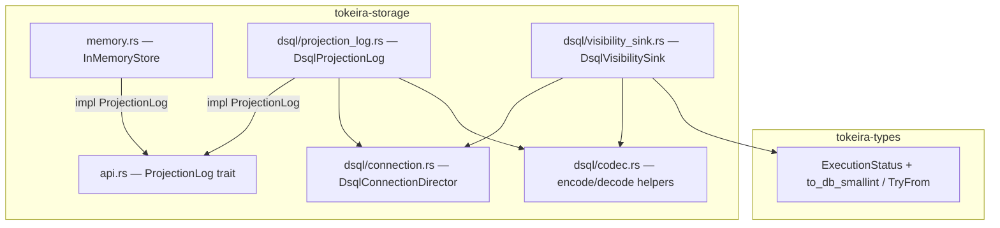
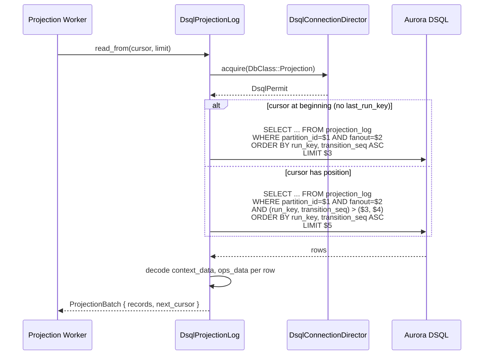
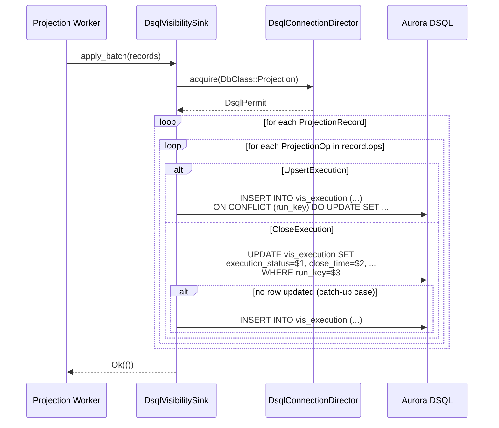

# Design Document: DSQL Projection Persistence

## Overview

This design covers Feature 6 (Projection Persistence) from the umbrella `dsql-storage-implementation` spec. It implements the read path for the projection log, projector checkpoint management, the visibility sink that materializes `vis_execution` rows, and the `ExecutionStatus` stable numeric mapping.

The central design principle is **projection reads and writes are lower-priority than the commit path**. All operations use `DbClass::Projection` connections, keeping the projection plane decoupled from the authoritative transition path. The visibility sink is a standalone struct — not a method on `DsqlRunRepository` — because the projection plane's write path has different lifecycle, error handling, and retry semantics than core persistence.

### Key Design Decisions

1. **`DsqlProjectionLog` in a new file `dsql/projection_log.rs`.** The `ProjectionLog` trait implementation and checkpoint methods are logically distinct from `DsqlRunRepository`. A separate struct avoids growing the already-large `run_repository.rs` and makes the projection read path independently testable. The struct holds an `Arc<dyn DsqlConnectionAcquirer>` (same test seam as `DsqlRunRepository`).

2. **`DsqlVisibilitySink` in a new file `dsql/visibility_sink.rs`.** The visibility sink is a standalone struct per Requirement 7. It accepts a `DsqlConnectionDirector` reference and processes `ProjectionRecord` batches. It is not part of `DsqlProjectionLog` because the sink writes to `vis_execution` while the log reads from `projection_log` — different tables, different concerns.

3. **Cursor-based pagination using row-value comparison.** The `read_from` query uses `WHERE (run_key, transition_seq) > ($3, $4)` for cursor advancement. This leverages the composite primary key `(partition_id, fanout, run_key, transition_seq)` and avoids DSQL's prohibition on temp tables. The beginning-of-partition case (no `last_run_key`) uses a simpler query without the cursor predicate.

4. **Checkpoint upsert via `INSERT ... ON CONFLICT ... DO UPDATE`.** The `projector_checkpoint` table has a composite PK `(sink_id, partition_id, fanout)`. The upsert atomically inserts or updates the `last_applied_cursor` and `updated_at` columns. This is a single statement — no transaction needed.

5. **`ExecutionStatus` stable numeric mapping in `tokeira-types`.** Following the `TaskKind::to_db_smallint` / `TryFrom<i16>` pattern exactly. The mapping is: `Running=0, Paused=1, Completed=2, Failed=3, Cancelled=4, Terminated=5, ContinuedAsNew=6, TimedOut=7`. A stability test asserts the exact values to prevent accidental reordering.

6. **`vis_execution.run_id` updated from `TEXT` to `UUID` in-place.** The `run_id` column in `vis_execution` is currently `TEXT` but `RunId` is a UUID newtype. The visibility sink binds `run_id.0` (a `Uuid`) directly. A migration `V013__vis_execution_run_id_uuid.sql` alters the column type from `TEXT` to `UUID` using `ALTER COLUMN run_id TYPE UUID USING run_id::uuid`. This is safe because no rows exist yet (the table was created by Feature 1 but no sink has written to it).

7. **Memo merge semantics.** When `UpsertExecution` carries a non-empty `memo_patch`, the sink merges the patch into the stored memo by reading the existing BYTEA, deserializing, applying the patch keys, re-serializing, and writing back. An empty `memo_patch` skips the memo column entirely (SQL `COALESCE` or conditional SET).

## Architecture

### Module Layout

```
tokeira-storage/
├── src/
│   ├── api.rs                    # ProjectionLog trait (unchanged)
│   ├── memory.rs                 # InMemoryStore (behavioral reference)
│   ├── dsql/
│   │   ├── mod.rs                # DsqlStore + NEW: projection_log, visibility_sink modules
│   │   ├── projection_log.rs     # NEW: DsqlProjectionLog (ProjectionLog impl + checkpoints)
│   │   ├── visibility_sink.rs    # NEW: DsqlVisibilitySink (vis_execution writes)
│   │   ├── run_repository.rs     # DsqlRunRepository (unchanged)
│   │   ├── connection.rs         # DsqlConnectionDirector, DsqlPermit
│   │   ├── codec.rs              # Postcard encode/decode helpers (unchanged)
│   │   ├── config.rs             # DsqlPoolConfig (unchanged)
│   │   ├── reservoir.rs          # Reservoir channel + refiller
│   │   ├── rate_limiter.rs       # Token-bucket rate limiter
│   │   ├── migration.rs          # MigrationRunner
│   │   └── validation.rs         # DDL validator
│   └── lib.rs
│
tokeira-types/
├── src/
│   ├── execution.rs              # ExecutionStatus + NEW: to_db_smallint, TryFrom<i16>
│   └── ...
│
tokeira-storage/
├── migrations/
│   ├── V010__projection_log.sql      # (existing)
│   ├── V011__projector_checkpoint.sql # (existing)
│   ├── V012__vis_execution.sql        # (existing)
│   └── V013__vis_execution_run_id_uuid.sql  # NEW: ALTER run_id TEXT → UUID
```

### Dependency Flow



### Data Flow — Projection Read Path



### Data Flow — Visibility Sink



## Components and Interfaces

### `DsqlProjectionLog`

```rust
/// DSQL-backed projection log reader and checkpoint manager.
#[derive(Debug)]
pub struct DsqlProjectionLog {
    director: Arc<dyn DsqlConnectionAcquirer>,
}

impl DsqlProjectionLog {
    pub fn new(director: Arc<DsqlConnectionDirector>) -> Self;

    #[cfg(test)]
    fn new_with_acquirer(director: Arc<dyn DsqlConnectionAcquirer>) -> Self;

    /// Read the last-applied cursor for a projection sink's substream.
    #[instrument(name = "dsql.read_checkpoint", skip(self), fields(sink_id = %sink_id, partition_id, fanout))]
    pub async fn read_checkpoint(
        &self,
        sink_id: &str,
        partition_id: u32,
        fanout: u16,
    ) -> Result<Option<ProjectionCursor>>;

    /// Upsert the last-applied cursor for a projection sink's substream.
    #[instrument(name = "dsql.write_checkpoint", skip(self, cursor), fields(sink_id = %sink_id, partition_id = cursor.partition_id, fanout = cursor.fanout))]
    pub async fn write_checkpoint(
        &self,
        sink_id: &str,
        cursor: &ProjectionCursor,
    ) -> Result<()>;
}

#[async_trait]
impl ProjectionLog for DsqlProjectionLog {
    #[instrument(name = "dsql.read_from", skip(self), fields(partition_id = cursor.partition_id, fanout = cursor.fanout, limit))]
    async fn read_from(
        &self,
        cursor: &ProjectionCursor,
        limit: usize,
    ) -> Result<ProjectionBatch>;
}
```

### `read_from` SQL

Two query variants depending on cursor state:

```sql
-- Beginning of partition (no cursor position)
SELECT run_key, transition_seq, context_data, ops_data
FROM projection_log
WHERE partition_id = $1 AND fanout = $2
ORDER BY run_key ASC, transition_seq ASC
LIMIT $3

-- Cursor-based pagination (after a known position)
SELECT run_key, transition_seq, context_data, ops_data
FROM projection_log
WHERE partition_id = $1 AND fanout = $2
  AND (run_key, transition_seq) > ($3, $4)
ORDER BY run_key ASC, transition_seq ASC
LIMIT $5
```

The `(run_key, transition_seq) > ($3, $4)` row-value comparison is equivalent to `(run_key > $3) OR (run_key = $3 AND transition_seq > $4)` but is more concise and uses the composite PK index efficiently. This pattern has been validated against Aurora DSQL.

### Checkpoint SQL

```sql
-- Read checkpoint
SELECT last_applied_cursor
FROM projector_checkpoint
WHERE sink_id = $1 AND partition_id = $2 AND fanout = $3

-- Write checkpoint (upsert)
INSERT INTO projector_checkpoint (sink_id, partition_id, fanout, last_applied_cursor, updated_at)
VALUES ($1, $2, $3, $4, now())
ON CONFLICT (sink_id, partition_id, fanout)
DO UPDATE SET last_applied_cursor = EXCLUDED.last_applied_cursor, updated_at = now()
```

### `DsqlVisibilitySink`

```rust
/// Standalone visibility sink that materializes vis_execution rows
/// from projection operations.
#[derive(Debug)]
pub struct DsqlVisibilitySink {
    director: Arc<dyn DsqlConnectionAcquirer>,
}

impl DsqlVisibilitySink {
    pub fn new(director: Arc<DsqlConnectionDirector>) -> Self;

    #[cfg(test)]
    fn new_with_acquirer(director: Arc<dyn DsqlConnectionAcquirer>) -> Self;

    /// Apply a batch of projection records to vis_execution.
    ///
    /// Operations within each record are processed in order so that
    /// an UpsertExecution followed by a CloseExecution in the same
    /// record produces the correct final state.
    #[instrument(name = "dsql.visibility_sink.apply_batch", skip(self, records), fields(record_count = records.len()))]
    pub async fn apply_batch(&self, records: &[ProjectionRecord]) -> Result<()>;
}
```

### Visibility Sink SQL — UpsertExecution

```sql
INSERT INTO vis_execution (
    run_key, namespace_id, workflow_id, run_id, workflow_type,
    task_queue, execution_status, start_time, execution_time,
    history_length, state_transition_count, memo
)
VALUES ($1, $2, $3, $4, $5, $6, $7, $8, $9, $10, $11, $12)
ON CONFLICT (run_key) DO UPDATE SET
    execution_status = EXCLUDED.execution_status,
    execution_time = EXCLUDED.execution_time,
    history_length = EXCLUDED.history_length,
    state_transition_count = EXCLUDED.state_transition_count,
    memo = CASE
        WHEN EXCLUDED.memo IS NOT NULL THEN EXCLUDED.memo
        ELSE vis_execution.memo
    END
```

The `memo` column uses a `CASE` expression: when the `UpsertExecution` carries a non-empty `memo_patch`, the sink serializes the merged memo and binds it as `$12`; when the patch is empty, `$12` is `NULL` and the `CASE` preserves the existing value.

**Memo merge strategy:** The sink reads the existing `memo` BYTEA from the `ON CONFLICT` path's `vis_execution.memo`, but since SQL cannot perform the merge, the approach is:
- If `memo_patch` is empty: bind `NULL` for memo, let `CASE` preserve existing.
- If `memo_patch` is non-empty and this is an insert (no existing row): serialize the patch directly as the initial memo.
- If `memo_patch` is non-empty and this is an update: the sink must read the existing memo first, merge, and write back. This requires a two-step approach for the update path: read existing memo, merge in Rust, then upsert with the merged result.

For simplicity and correctness, the implementation uses a read-then-upsert pattern when `memo_patch` is non-empty:
1. `SELECT memo FROM vis_execution WHERE run_key = $1`
2. Deserialize existing memo (or start with empty `Memo`)
3. Merge `memo_patch` keys into the existing memo
4. Serialize the merged memo
5. Execute the upsert with the merged memo as `$12`

When `memo_patch` is empty, the single upsert statement suffices with `$12 = NULL`.

### Visibility Sink SQL — CloseExecution

```sql
UPDATE vis_execution
SET execution_status = $1,
    close_time = $2,
    history_length = $3,
    state_transition_count = $4
WHERE run_key = $5
```

If the UPDATE affects 0 rows (catch-up case per Requirement 5.5), the sink falls back to a full INSERT using the `ProjectionContext` metadata combined with the close operation fields:

```sql
INSERT INTO vis_execution (
    run_key, namespace_id, workflow_id, run_id, workflow_type,
    task_queue, execution_status, start_time, execution_time,
    close_time, history_length, state_transition_count
)
VALUES ($1, $2, $3, $4, $5, $6, $7, $8, $9, $10, $11, $12)
```

### `ExecutionStatus` Stable Numeric Mapping

Added to `tokeira-types/src/execution.rs`, following the `TaskKind` pattern:

```rust
/// Error returned when decoding a durable execution-status value from storage.
#[derive(Clone, Copy, Debug, Error, PartialEq, Eq)]
#[error("unknown execution status database value {value}")]
pub struct ExecutionStatusDecodeError {
    pub value: i16,
}

impl ExecutionStatus {
    /// Stable database encoding used by DSQL persistence.
    pub fn to_db_smallint(self) -> i16 {
        match self {
            Self::Running => 0,
            Self::Paused => 1,
            Self::Completed => 2,
            Self::Failed => 3,
            Self::Cancelled => 4,
            Self::Terminated => 5,
            Self::ContinuedAsNew => 6,
            Self::TimedOut => 7,
        }
    }
}

impl TryFrom<i16> for ExecutionStatus {
    type Error = ExecutionStatusDecodeError;

    fn try_from(value: i16) -> Result<Self, Self::Error> {
        match value {
            0 => Ok(Self::Running),
            1 => Ok(Self::Paused),
            2 => Ok(Self::Completed),
            3 => Ok(Self::Failed),
            4 => Ok(Self::Cancelled),
            5 => Ok(Self::Terminated),
            6 => Ok(Self::ContinuedAsNew),
            7 => Ok(Self::TimedOut),
            value => Err(ExecutionStatusDecodeError { value }),
        }
    }
}
```

### `DsqlStore` Wiring

`DsqlStore` gains accessors for the new components:

```rust
impl DsqlStore {
    pub fn projection_log(&self) -> &DsqlProjectionLog { ... }
    pub fn visibility_sink(&self) -> &DsqlVisibilitySink { ... }
}
```

Both are constructed in `from_connector` using the shared `Arc<DsqlConnectionDirector>`.

## Data Models

### Table Usage by Operation

| Operation | Tables Read | Tables Written |
|-----------|------------|----------------|
| `read_from` | `projection_log` | — |
| `read_checkpoint` | `projector_checkpoint` | — |
| `write_checkpoint` | — | `projector_checkpoint` |
| `apply_batch` (UpsertExecution) | `vis_execution` (memo read for merge) | `vis_execution` |
| `apply_batch` (CloseExecution) | — | `vis_execution` |

### `projection_log` Table (Existing — No Changes)

```sql
CREATE TABLE IF NOT EXISTS projection_log (
    partition_id    INTEGER     NOT NULL,
    fanout          SMALLINT    NOT NULL,
    run_key         UUID        NOT NULL,
    transition_seq  BIGINT      NOT NULL,
    context_data    BYTEA       NOT NULL,
    ops_data        BYTEA       NOT NULL,
    created_at      TIMESTAMPTZ NOT NULL DEFAULT now(),
    PRIMARY KEY (partition_id, fanout, run_key, transition_seq)
);
```

### `projector_checkpoint` Table (Existing — No Changes)

```sql
CREATE TABLE IF NOT EXISTS projector_checkpoint (
    sink_id              TEXT        NOT NULL,
    partition_id         INTEGER     NOT NULL,
    fanout               SMALLINT    NOT NULL,
    last_applied_cursor  BYTEA       NOT NULL,
    updated_at           TIMESTAMPTZ NOT NULL DEFAULT now(),
    PRIMARY KEY (sink_id, partition_id, fanout)
);
```

### `vis_execution` Table (One Migration)

Existing schema from V012:

```sql
CREATE TABLE IF NOT EXISTS vis_execution (
    run_key                UUID        NOT NULL,
    namespace_id           UUID        NOT NULL,
    workflow_id            TEXT        NOT NULL,
    run_id                 TEXT        NOT NULL,  -- changed to UUID in V013
    workflow_type          TEXT        NOT NULL,
    task_queue             TEXT        NOT NULL,
    execution_status       SMALLINT    NOT NULL,
    start_time             TIMESTAMPTZ NOT NULL,
    execution_time         TIMESTAMPTZ,
    close_time             TIMESTAMPTZ,
    history_length         BIGINT      NOT NULL DEFAULT 0,
    state_transition_count BIGINT      NOT NULL DEFAULT 0,
    memo                   BYTEA,
    PRIMARY KEY (run_key)
);
```

Migration V013 changes `run_id` from `TEXT` to `UUID`:

```sql
ALTER TABLE vis_execution ALTER COLUMN run_id TYPE UUID USING run_id::uuid;
```

This is safe because no rows exist yet — the table was created by Feature 1 but no visibility sink has written to it.

### Type Mappings

| Rust Type | SQL Column | Encoding |
|-----------|-----------|----------|
| `RunKey(Uuid)` | `run_key UUID` | Direct UUID binding |
| `NamespaceId(Uuid)` | `namespace_id UUID` | Direct UUID binding |
| `WorkflowId(String)` | `workflow_id TEXT` | Direct string binding |
| `RunId(Uuid)` | `run_id UUID` | Direct UUID binding (after V013) |
| `WorkflowType(String)` | `workflow_type TEXT` | Direct string binding |
| `TaskQueueName(String)` | `task_queue TEXT` | Direct string binding |
| `ExecutionStatus` | `execution_status SMALLINT` | `to_db_smallint()` / `TryFrom<i16>` |
| `OffsetDateTime` | `TIMESTAMPTZ` | Direct sqlx binding |
| `ProjectionContext` | `context_data BYTEA` | `codec::encode/decode_projection_context` |
| `Vec<ProjectionOp>` | `ops_data BYTEA` | `codec::encode/decode_projection_ops` |
| `ProjectionCursor` | `last_applied_cursor BYTEA` | `codec::encode/decode_projection_cursor` |
| `Memo` | `memo BYTEA` | `codec::encode/decode` (postcard) |
| `TransitionSeq(u64)` | `transition_seq BIGINT` | Checked `i64` conversion |

### Write Set Size

- `read_from`: 0 writes (read-only).
- `write_checkpoint`: 1 row in `projector_checkpoint`.
- `apply_batch`: 1 row per `ProjectionOp` in `vis_execution` (typically 1–2 ops per record).

All well within DSQL's 3,000-row mutation limit.

## Correctness Properties

*A property is a characteristic or behavior that should hold true across all valid executions of a system — essentially, a formal statement about what the system should do. Properties serve as the bridge between human-readable specifications and machine-verifiable correctness guarantees.*

The following properties are derived from the acceptance criteria prework analysis. Redundant criteria have been consolidated — cursor ordering, advancement, and limit behavior are combined into a single pagination property; codec round-trips for projection types are combined; and visibility sink field mapping and operation ordering are combined.

### Property 1: Cursor-Based Pagination Correctness

*For any* set of projection records in a partition and *for any* valid cursor position (beginning or mid-stream), `read_from` SHALL return records strictly after the cursor position in `(run_key, transition_seq)` ascending order, limited to the requested count, with `next_cursor` pointing to the `(partition_id, fanout, run_key, transition_seq)` of the last returned record. When no records remain, the original cursor SHALL be returned unchanged.

**Validates: Requirements 1.2, 1.3, 1.4, 1.5**

### Property 2: Projection Codec Round-Trip

*For any* valid `ProjectionContext`, `Vec<ProjectionOp>`, or `ProjectionCursor` value, serializing via the codec and then deserializing SHALL produce a value equal to the original.

**Validates: Requirements 1.8, 1.9, 2.5**

### Property 3: ExecutionStatus Numeric Round-Trip

*For any* `ExecutionStatus` variant, encoding to `i16` via `to_db_smallint` and then decoding via `TryFrom<i16>` SHALL produce the original variant. Unknown `i16` values SHALL produce `ExecutionStatusDecodeError`.

**Validates: Requirements 6.1, 6.2, 6.5**

### Property 4: Memo Codec Round-Trip

*For any* valid `Memo` value, serializing via postcard and then deserializing SHALL produce a value equal to the original.

**Validates: Requirements 8.3**

### Property 5: Visibility Sink Operation Ordering

*For any* `ProjectionRecord` containing both an `UpsertExecution` and a `CloseExecution` operation, processing the record through the visibility sink SHALL produce a `vis_execution` row whose `execution_status` and `close_time` reflect the `CloseExecution` operation (the last operation wins).

**Validates: Requirements 7.4, 5.1, 5.2, 5.3**

## Error Handling

### OCC Conflicts (SQLSTATE 40001)

All operations surface OCC conflicts as `anyhow::Error`. The projection worker decides whether and when to retry. Projection writes are idempotent by design — re-applying the same batch produces the same `vis_execution` state.

### Connection Acquisition Failures

If `director.acquire(DbClass::Projection)` fails, the error propagates immediately. The projection worker backs off and retries.

### Deserialization Failures

If `codec::decode_projection_context` or `codec::decode_projection_ops` fails for a row, the error propagates. This indicates data corruption — the projection worker should log the error and skip the record (or alert, depending on operational policy). The design does not silently swallow decode errors.

### Missing `vis_execution` Row on CloseExecution

Per Requirement 5.5, if no row exists when processing `CloseExecution`, the sink inserts a complete row using the `ProjectionContext` metadata. This handles the catch-up case where the `UpsertExecution` was missed or the sink is processing out of order.

### Unknown ExecutionStatus Values

`TryFrom<i16>` returns `ExecutionStatusDecodeError` for values outside the known range. The visibility query path (a separate spec) will handle this; the sink always writes known values via `to_db_smallint`.

## Testing Strategy

### Property-Based Tests (proptest)

Property-based tests validate the correctness properties above. Each test runs a minimum of 100 iterations with random inputs.

| Property | Test Location | Library |
|----------|--------------|---------|
| P1: Cursor-based pagination | `tokeira-storage/src/dsql/projection_log.rs` | `proptest` |
| P2: Projection codec round-trip | `tokeira-storage/src/dsql/codec.rs` | `proptest` |
| P3: ExecutionStatus numeric round-trip | `tokeira-types/src/execution.rs` | `proptest` |
| P4: Memo codec round-trip | `tokeira-storage/src/dsql/codec.rs` | `proptest` |
| P5: Visibility sink operation ordering | `tokeira-storage/src/dsql/visibility_sink.rs` | `proptest` |

**Tag format:** `Feature: dsql-projection-persistence, Property {N}: {title}`

**P1 (Cursor-based pagination):** Since the DSQL read path involves SQL queries, the property test will test the **cursor interpretation logic** extracted into a pure helper function. The helper takes a sorted slice of `(RunKey, TransitionSeq)` pairs, a cursor position, and a limit, and returns the expected result slice and next cursor. This keeps the property test fast and deterministic. Integration tests verify the SQL wiring.

**P2 (Projection codec round-trip):** Uses `proptest` `Arbitrary` implementations for `ProjectionContext`, `Vec<ProjectionOp>`, and `ProjectionCursor`. Verifies `decode(encode(x)) == x` for each type.

**P3 (ExecutionStatus round-trip):** Generates random `ExecutionStatus` variants (finite enum — use `prop_oneof!`). Verifies `TryFrom::<i16>::try_from(x.to_db_smallint()) == Ok(x)`.

**P4 (Memo round-trip):** Generates random `Memo` values (BTreeMap of String → Payload). Verifies `decode(encode(x)) == x`.

**P5 (Visibility sink operation ordering):** Generates random `ProjectionRecord` values containing both `UpsertExecution` and `CloseExecution` ops. Extracts the pure decision logic into a helper that determines the final `vis_execution` field values from a sequence of ops. Verifies the final state reflects the last operation.

### Unit Tests

Unit tests cover specific examples and edge cases:

- **DbClass::Projection routing**: Verify `read_from`, `read_checkpoint`, `write_checkpoint`, and `apply_batch` all acquire `DbClass::Projection` permits using the mock acquirer.
- **Beginning-of-partition read**: Verify `read_from` with a beginning cursor returns the first records.
- **Empty partition read**: Verify `read_from` on an empty partition returns an empty batch with the original cursor.
- **Checkpoint read/write round-trip**: Write a checkpoint, read it back, verify equality.
- **Checkpoint overwrite**: Write a checkpoint, write again with a different cursor, read back, verify the updated cursor.
- **Absent checkpoint**: Read a non-existent checkpoint, verify `None`.
- **UpsertExecution creates row**: Process an `UpsertExecution`, verify the `vis_execution` row exists with correct fields.
- **UpsertExecution updates mutable fields**: Process two `UpsertExecution` records for the same `run_key`, verify the second updates status, history_length, etc.
- **CloseExecution updates row**: Process `UpsertExecution` then `CloseExecution`, verify close_time and terminal status.
- **CloseExecution catch-up insert**: Process `CloseExecution` without prior `UpsertExecution`, verify a complete row is inserted.
- **Memo merge**: Process `UpsertExecution` with memo, then another with a different memo_patch, verify the final memo is the merge.
- **Empty memo_patch preserves existing**: Process `UpsertExecution` with memo, then another with empty memo_patch, verify memo is unchanged.
- **ExecutionStatus stability**: Assert exact numeric values for each variant (prevents accidental reordering).
- **ExecutionStatus unknown value**: Verify `TryFrom<i16>` returns error for values 8, -1, 100.

### Integration Tests (gated behind `dsql-integration` feature)

- **read_from pagination cycle**: Insert multiple projection_log rows, read with increasing cursors, verify all records are returned in order.
- **Checkpoint persist and resume**: Write a checkpoint, read it back, verify the cursor matches.
- **Visibility sink end-to-end**: Insert projection_log rows via `commit_transition`, read them via `read_from`, apply via visibility sink, query `vis_execution` to verify the materialized rows.
- **Concurrent checkpoint writes**: Two tasks write checkpoints for the same `(sink_id, partition_id, fanout)` — verify the last writer wins (no corruption).
- **Row-value comparison correctness**: Insert records with UUIDs that test lexicographic vs. binary ordering edge cases, verify `(run_key, transition_seq) > ($3, $4)` returns the correct set.
