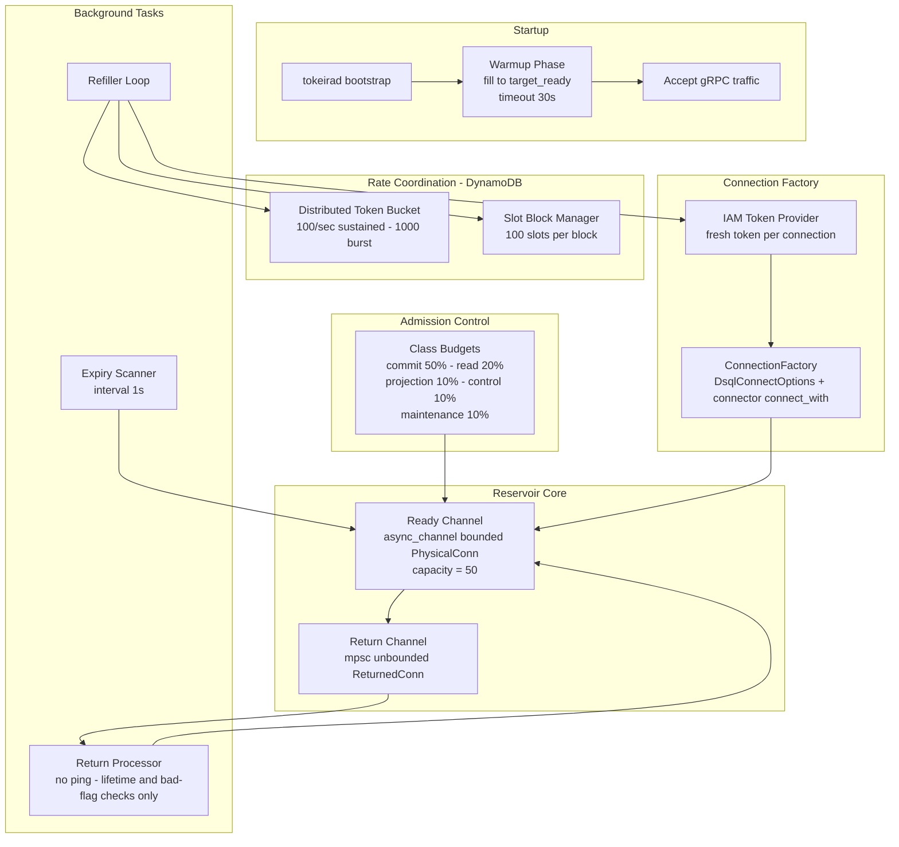

# Design Document: DSQL Reservoir Redesign

## Overview

This design eliminates the sqlx `PgPool` from the DSQL connection path entirely. The current implementation wraps a sqlx PgPool inside the reservoir: the refiller calls `pool.acquire()` to create connections, but the pool's `max_connections` equals `target_ready`, so when the reservoir holds all connections in its ready channel, the pool has nothing left for the refiller — causing `pool timed out` errors under load.

The redesign makes the reservoir the **sole connection owner**. Physical connections are created directly via IAM-authenticated TCP/TLS using `aurora_dsql_sqlx_connector::DsqlConnectOptions` and `aurora_dsql_sqlx_connector::connection::connect_with()`, bypassing the sqlx pool entirely. The reservoir IS the pool.

Three background tokio tasks manage the connection lifecycle:
1. **Refiller** — continuously creates connections to maintain the ready channel at `target_ready`.
2. **Expiry Scanner** — periodically retires connections approaching their IAM token expiry.
3. **Return Processor** — validates returned connections (lifetime and bad-flag checks only, no ping) before reuse.

For multi-node coordination, DynamoDB-backed components distribute the rate budget and connection count:
- **Distributed Token Bucket** — enforces the cluster-wide 100/sec DSQL connection creation rate.
- **Slot Block Manager** — partitions the 10,000 connection limit across nodes using block-based allocation.

All connection management parameters are internal constants derived from DSQL's known constraints. The operator provides an endpoint and credentials. Everything else is automatic.

**Key design change from current implementation:** The return processor no longer pings connections on return. Guard window lifetime checks are sufficient — a connection that was healthy during use and has remaining lifetime is safe to reuse without a network round-trip. This eliminates per-return latency and connection churn.

## Architecture



### Key Design Invariants

1. **The reservoir is the sole connection owner.** No sqlx PgPool exists. The reservoir creates, holds, and retires all DSQL connections.
2. **Checkout is O(1) with no network I/O.** `try_recv()` on the ready channel returns immediately or signals empty.
3. **Connection creation failures never block checkout callers.** The refiller runs independently; its errors are logged and retried with backoff.
4. **No connection is ever handed out with remaining_lifetime < guard_window.** Both the expiry scanner and the return processor enforce this.
5. **Class budgets guarantee isolation.** Projection cannot consume commit-class permits — separate semaphore instances.
6. **DynamoDB coordination is mandatory for DSQL.** No local-only fallback. Unreachable DynamoDB = startup failure.
7. **No ping on return.** Lifetime check and bad-flag check only.
8. **Every reserved slot is released exactly once.** Any path that drops a physical connection created after `acquire_slot()` must call `release_slot()` before the connection leaves the reservoir lifecycle.


## Components and Interfaces

### 1. PhysicalConn and ReturnedConn

**Location:** `crates/tokeira-storage/src/dsql/reservoir.rs`

```rust
pub struct PhysicalConn {
    pub(crate) connection: PgConnection,  // raw, NOT PoolConnection<Postgres>
    pub(crate) created_at: Instant,
    pub(crate) lifetime: Duration,        // BASE_LIFETIME ± LIFETIME_JITTER
}

impl PhysicalConn {
    pub fn remaining_lifetime(&self) -> Duration {
        self.lifetime.saturating_sub(self.created_at.elapsed())
    }
    pub fn within_guard_window(&self, guard_window: Duration) -> bool {
        self.remaining_lifetime() <= guard_window
    }
}

pub struct ReturnedConn {
    pub(crate) connection: PgConnection,
    pub(crate) created_at: Instant,
    pub(crate) lifetime: Duration,
    pub(crate) marked_bad: bool,
}
```

### 2. Connection Factory

**Location:** `crates/tokeira-storage/src/dsql/connection_factory.rs` (new file)

Creates raw `PgConnection` instances via IAM-authenticated TCP/TLS. Each call generates a fresh IAM token — no caching.

```rust
pub struct ConnectionFactory {
    endpoint: String,
    region: String,
}

impl ConnectionFactory {
    pub async fn create_connection(&self) -> Result<PgConnection, ConnectionFactoryError> {
        let conn_str = format!("postgres://admin@{}:5432/postgres?region={}", self.endpoint, self.region);
        let options = DsqlConnectOptions::from_connection_string(&conn_str)
            .map_err(|e| ConnectionFactoryError::Iam(e.into()))?;
        aurora_dsql_sqlx_connector::connection::connect_with(&options)
            .await
            .map_err(ConnectionFactoryError::from_dsql_error)
    }
}

#[derive(Debug, thiserror::Error)]
pub enum ConnectionFactoryError {
    #[error("IAM token generation failed: {0}")] Iam(anyhow::Error),
    #[error("TLS handshake failed: {0}")] Tls(anyhow::Error),
    #[error("connection timed out: {0}")] Timeout(anyhow::Error),
    #[error("connection refused: {0}")] Refused(anyhow::Error),
    #[error("connection failed: {0}")] Other(anyhow::Error),
}

impl ConnectionFactoryError {
    pub fn category(&self) -> &'static str {
        match self { Self::Iam(_) => "iam", Self::Tls(_) => "tls",
                     Self::Timeout(_) => "timeout", Self::Refused(_) => "refused",
                     Self::Other(_) => "other" }
    }

    pub fn from_dsql_error(error: aurora_dsql_sqlx_connector::DsqlError) -> Self {
        match error {
            aurora_dsql_sqlx_connector::DsqlError::TokenError(err) => Self::Iam(err.into()),
            aurora_dsql_sqlx_connector::DsqlError::ConnectionError(err) => classify_sqlx_connection_error(err),
            other => Self::Other(other.into()),
        }
    }
}
```

### 2.5 DSQL Coordination Config

**Location:** `crates/tokeira-storage/src/dsql/config.rs`

The DynamoDB coordination table names and client are runtime wiring, not
operator-tunable TOML. `apps/tokeirad` constructs this config from the effective
server config before calling `DsqlStore::connect(auth, pool_config)`.

```rust
#[derive(Clone, Debug)]
pub struct DsqlCoordinationConfig {
    pub rate_limiter_table: String,
    pub conn_lease_table: String,
    pub ddb_client: aws_sdk_dynamodb::Client,
}

#[derive(Clone, Debug)]
pub struct DsqlPoolConfig {
    pub reservoir: ReservoirConfig,
    pub migration: MigrationConfig,
    pub coordination: DsqlCoordinationConfig,
    // existing DSQL mechanical fields...
}
```

`DsqlPoolConfig` is constructed programmatically by the DSQL startup path. If
the existing serde derives conflict with the non-serializable DynamoDB client,
remove those derives from `DsqlPoolConfig` or move serde coverage to the
serializable sub-configs that still need it.

`apps/tokeirad/src/lib.rs` derives table names from the effective project
identifier:

```rust
let project = &effective_config.infrastructure.cluster_name;
let rate_limiter_table = format!("{project}-dsql-rate-limiter");
let conn_lease_table = format!("{project}-dsql-conn-lease");
let sdk_config = aws_config::defaults(aws_config::BehaviorVersion::latest())
    .region(aws_config::Region::new(auth.resolved_region().context("missing DSQL region")?))
    .load()
    .await;
let ddb_client = aws_sdk_dynamodb::Client::new(&sdk_config);

let pool_config = DsqlPoolConfig {
    coordination: DsqlCoordinationConfig {
        rate_limiter_table,
        conn_lease_table,
        ddb_client,
    },
    ..dsql_pool_config(&effective_config)
};
let dsql_store = DsqlStore::connect(auth, pool_config).await?;
```

`DsqlStore::connect` remains the single external entry point and uses
`config.coordination` internally to validate DynamoDB reachability, construct
the Distributed_Token_Bucket and Slot_Block_Manager, start the reservoir, warm
it, and build the `DsqlConnectionDirector`.

### 3. Reservoir

**Location:** `crates/tokeira-storage/src/dsql/reservoir.rs`

**Internal constants (NOT configurable):**

| Constant | Value | Derivation |
|----------|-------|------------|
| `TARGET_READY` | 50 | Expected peak concurrency for single-node |
| `BASE_LIFETIME` | 10 min | 70% of DSQL 15-min IAM token TTL |
| `LIFETIME_JITTER` | ±2 min | Prevents synchronized expiry storms |
| `GUARD_WINDOW` | 45 sec | Safety margin before token expiry |
| `INFLIGHT_LIMIT` | 8 | Max concurrent TCP/TLS handshakes |
| `SCAN_INTERVAL` | 1 sec | Expiry scanner frequency |
| `SCAN_BUDGET` | `TARGET_READY / 2` | Max ready entries examined per scan |
| `WARMUP_TIMEOUT` | 30 sec | Max time to wait for initial fill |
| `REFILLER_IDLE_INTERVAL` | 100ms | Check interval when full |
| `REFILLER_ERROR_BACKOFF` | 250ms | Initial backoff on failure |
| `DISTRIBUTED_RATE` | 100/sec | DSQL cluster-wide sustained rate |
| `DISTRIBUTED_BURST` | 1000 | DSQL cluster-wide burst capacity |
| `SLOT_BLOCK_SIZE` | 100 | Connections per block |
| `SLOT_BLOCK_TTL` | 3 min | Crash recovery timeout |
| `SLOT_BLOCK_RENEW` | 1 min | Renewal interval |

```rust
pub struct Reservoir {
    ready_rx: async_channel::Receiver<PhysicalConn>,
    ready_tx: async_channel::Sender<PhysicalConn>,
    return_tx: mpsc::UnboundedSender<ReturnedConn>,
    refiller_handle: JoinHandle<()>,
    scanner_handle: JoinHandle<()>,
    return_processor_handle: JoinHandle<()>,
}

impl Reservoir {
    pub async fn start(factory: ConnectionFactory, bucket: Arc<DistributedTokenBucket>,
                       slots: Arc<SlotBlockManager>) -> Result<Self> { /* ... */ }

    /// Non-blocking checkout. Returns immediately or ErrReservoirEmpty.
    pub fn checkout(&self) -> Result<PhysicalConn, ReservoirError> {
        match self.ready_rx.try_recv() {
            Ok(conn) => { metrics::record_dsql_pool_connections_total(self.ready_rx.len()); Ok(conn) }
            Err(_) => { metrics::record_dsql_pool_empty_reservoir(); Err(ReservoirError::Empty) }
        }
    }

    pub async fn warmup(&self) -> WarmupResult { /* poll until full or timeout */ }
    pub fn return_sender(&self) -> mpsc::UnboundedSender<ReturnedConn> { self.return_tx.clone() }
    pub fn ready_count(&self) -> usize { self.ready_rx.len() }
}
```

### 4. Refiller Loop

```rust
// Pseudocode — exact implementation mechanics
loop {
    if ready_tx.len() >= TARGET_READY { sleep(100ms); continue; }
    if !slot_manager.has_budget() { sleep(100ms); continue; }
    let _permit = inflight_sem.acquire().await;  // max 8 concurrent
    match slot_manager.acquire_slot() {
        Ok(()) => {}
        Err(_) => { sleep(100ms); continue; }
    }
    if let Err(e) = distributed_bucket.wait().await {  // DynamoDB round-trip
        slot_manager.release_slot();
        log_warn(e);
        sleep(250ms);
        continue;
    }
    match factory.create_connection().await {
        Ok(conn) => {
            let lifetime = assign_jittered_lifetime(); // [8min, 12min]
            if let Err(err) = ready_tx.send(PhysicalConn { connection: conn, created_at: now(), lifetime }).await {
                slot_manager.release_slot();
                drop(err.into_inner());
            }
        }
        Err(e) => {
            slot_manager.release_slot();
            log_warn(e);
            sleep(250ms);
        }
    }
}

fn assign_jittered_lifetime() -> Duration {
    let offset = rand::gen_range(0..=(LIFETIME_JITTER.as_secs() * 2));
    BASE_LIFETIME - LIFETIME_JITTER + Duration::from_secs(offset)
}
```

### 5. Expiry Scanner

The scanner receives an `Arc<SlotBlockManager>` so every discarded physical
connection releases the slot reserved when it was created.

```rust
loop {
    sleep(SCAN_INTERVAL); // 1 second
    for _ in 0..SCAN_BUDGET {  // bounded: max 25 entries per pass
        match ready_rx.try_recv() {
            Ok(conn) if conn.within_guard_window(GUARD_WINDOW) => {
                metrics::record_retirement("guard_window", conn.created_at.elapsed());
                slot_manager.release_slot();
                drop(conn);
            }
            Ok(conn) => {
                if let Err(err) = ready_tx.try_send(conn) {
                    slot_manager.release_slot();
                    drop(err.into_inner());
                }
            }
            Err(_) => break,
        }
    }
}
```

### 6. Return Processor

The return processor receives the same `Arc<SlotBlockManager>` and releases a
slot whenever it discards a returned connection instead of putting it back into
the ready channel.

```rust
while let Some(returned) = return_rx.recv().await {
    if returned.marked_bad {
        metrics::record_retirement("unhealthy", returned.created_at.elapsed());
        slot_manager.release_slot();
        continue; // discard
    }
    let conn = PhysicalConn { connection: returned.connection, created_at: returned.created_at,
                              lifetime: returned.lifetime };
    if conn.within_guard_window(GUARD_WINDOW) {
        metrics::record_retirement("guard_window", conn.created_at.elapsed());
        slot_manager.release_slot();
        continue; // discard
    }
    // Put back — NO PING, no network I/O.
    if let Err(err) = ready_tx.send(conn).await {
        slot_manager.release_slot();
        drop(err.into_inner());
    }
}
```

### 7. Distributed Token Bucket

**Location:** `crates/tokeira-storage/src/dsql/distributed_bucket.rs` (new file)

**DynamoDB Table:** `{project}-dsql-rate-limiter`

| Attribute | Type | Key | Description |
|-----------|------|-----|-------------|
| `pk` | String | PK | `dsql_connect_bucket#{endpoint}` |
| `tokens_milli` | Number | — | Current tokens × 1000 (avoids floats) |
| `last_refill_ms` | Number | — | Unix millis of last refill |
| `rate_milli` | Number | — | 100,000 (= 100 tokens/sec × 1000) |
| `capacity_milli` | Number | — | 1,000,000 (= 1000 tokens × 1000) |
| `ttl_epoch` | Number | TTL | Unix seconds + 180 (3 min auto-cleanup) |

**Wait protocol (Rust pseudocode):**

```rust
/// Blocks until one token is acquired from the distributed bucket.
/// Uses optimistic read-modify-write with DynamoDB conditional updates.
///
/// IMPORTANT: The AWS SDK (`aws-sdk-dynamodb`) has built-in retry with
/// exponential backoff for DynamoDB throttling (ThrottlingException).
/// Do NOT add redundant retry logic for throttling — only handle
/// ConditionalCheckFailedException (race condition) explicitly.
pub async fn wait(&self, ctx: &Context) -> Result<(), TokenBucketError> {
    let deadline = Instant::now() + MAX_WAIT; // 30 seconds
    let mut attempts = 0u32;

    loop {
        attempts += 1;
        let (acquired, retry_after_ms) = self.try_acquire().await?;

        if acquired { return Ok(()); }

        if Instant::now() >= deadline {
            return Err(TokenBucketError::Timeout { attempts });
        }

        // Backoff: use retry_after_ms hint (10ms per token at 100/sec) + jitter
        let backoff = if retry_after_ms > 0 {
            Duration::from_millis(retry_after_ms as u64)
        } else {
            BACKOFF_BASE // 50ms — used when ConditionalCheckFailed (immediate retry)
        };
        let jitter = rand::gen_range(0..=backoff.as_millis() / 2) as u64;
        let sleep_for = Duration::from_millis(backoff.as_millis() as u64 + jitter)
            .min(deadline.duration_since(Instant::now()));

        tokio::time::sleep(sleep_for).await;
    }
}

/// Single attempt to acquire one token.
/// Returns (true, 0) on success.
/// Returns (false, retry_after_ms) if bucket empty.
/// Returns Err on DynamoDB error (NOT ConditionalCheckFailed — that returns (false, 0)).
async fn try_acquire(&self) -> Result<(bool, i64), TokenBucketError> {
    let pk = format!("dsql_connect_bucket#{}", self.endpoint);
    let now_ms = SystemTime::now().duration_since(UNIX_EPOCH).as_millis() as i64;

    // Milli-token constants (integer math, no floats)
    let rate_milli: i64 = self.rate * 1000;         // 100_000
    let capacity_milli: i64 = self.capacity * 1000; // 1_000_000
    let one_token_milli: i64 = 1000;

    // Step 1: Read current bucket state (ConsistentRead)
    let get_result = self.ddb.get_item()
        .table_name(&self.table_name)
        .key("pk", AttributeValue::S(pk.clone()))
        .consistent_read(true)
        .send().await?;

    // Step 2: Compute new state
    let (current_tokens_milli, last_refill_ms, is_new_bucket) = match get_result.item {
        None => (capacity_milli, now_ms, true),  // New bucket: start at full capacity
        Some(item) => {
            let tokens = parse_number(&item, "tokens_milli");
            let refill = parse_number(&item, "last_refill_ms");
            (tokens, refill, false)
        }
    };

    // Compute refill: tokens += (elapsed_ms × rate_milli) / 1000
    let elapsed_ms = (now_ms - last_refill_ms).max(0);
    let refill_milli = (elapsed_ms * rate_milli) / 1000;
    let tokens_after_refill = (current_tokens_milli + refill_milli).min(capacity_milli);

    // Check if we have at least 1 token
    if tokens_after_refill < one_token_milli {
        // Bucket empty — hint: one token refills every 10ms at 100/sec
        let ms_per_token = 1000 / self.rate;
        return Ok((false, ms_per_token));
    }

    // Deduct 1 token
    let new_tokens_milli = tokens_after_refill - one_token_milli;
    let ttl_epoch = (now_ms / 1000) + 3600; // 1 hour TTL

    // Step 3: Conditional write
    let result = if is_new_bucket {
        // New bucket: condition on attribute_not_exists(pk)
        self.ddb.update_item()
            .table_name(&self.table_name)
            .key("pk", AttributeValue::S(pk))
            .update_expression("SET tokens_milli = :tokens, last_refill_ms = :now, rate_milli = :rate, capacity_milli = :cap, ttl_epoch = :ttl")
            .condition_expression("attribute_not_exists(pk)")
            .expression_attribute_values(":tokens", AttributeValue::N(new_tokens_milli.to_string()))
            .expression_attribute_values(":now", AttributeValue::N(now_ms.to_string()))
            .expression_attribute_values(":rate", AttributeValue::N(rate_milli.to_string()))
            .expression_attribute_values(":cap", AttributeValue::N(capacity_milli.to_string()))
            .expression_attribute_values(":ttl", AttributeValue::N(ttl_epoch.to_string()))
            .send().await
    } else {
        // Existing bucket: condition on last_refill_ms matching what we read
        self.ddb.update_item()
            .table_name(&self.table_name)
            .key("pk", AttributeValue::S(pk))
            .update_expression("SET tokens_milli = :tokens, last_refill_ms = :now, ttl_epoch = :ttl")
            .condition_expression("last_refill_ms = :expected_refill")
            .expression_attribute_values(":tokens", AttributeValue::N(new_tokens_milli.to_string()))
            .expression_attribute_values(":now", AttributeValue::N(now_ms.to_string()))
            .expression_attribute_values(":ttl", AttributeValue::N(ttl_epoch.to_string()))
            .expression_attribute_values(":expected_refill", AttributeValue::N(last_refill_ms.to_string()))
            .send().await
    };

    match result {
        Ok(_) => Ok((true, 0)),
        Err(e) if is_conditional_check_failed(&e) => {
            // Another node raced us — retry immediately (return 0 for retry_after)
            Ok((false, 0))
        }
        Err(e) => Err(TokenBucketError::DynamoDb(e.into())),
    }
}
```

**Key implementation notes:**
- `ConsistentRead: true` on GetItem ensures we see the latest state.
- Milli-token math (×1000) avoids floating-point precision issues in DynamoDB Number attributes.
- `ConditionalCheckFailedException` is a normal race condition (another node consumed the token first) — retry immediately with 0 backoff.
- The AWS SDK's built-in retry handles `ThrottlingException` transparently — do NOT add redundant retry for throttling.
- `MAX_WAIT = 30 seconds` caps total acquisition time. If the bucket stays empty for 30s, the refiller's connection creation attempt fails (and the refiller backs off 250ms before trying again).
- `BACKOFF_BASE = 50ms` is used when `ConditionalCheckFailed` returns `retry_after_ms = 0`.

**Atomicity:** The condition expression `last_refill_ms = :expected_refill` ensures only one node succeeds per read-modify-write cycle. Losers see `ConditionalCheckFailedException` and retry with fresh state.

### 8. Slot Block Manager

**Location:** `crates/tokeira-storage/src/dsql/slot_block_manager.rs` (new file)

**DynamoDB Table:** `{project}-dsql-conn-lease`

| Attribute | Type | Key | Description |
|-----------|------|-----|-------------|
| `pk` | String | PK | `connslots#{endpoint}#block-{block_id}` |
| `owner_id` | String | — | Node ID (hex-encoded 16 random bytes), empty string if unowned |
| `ttl_epoch` | Number | TTL | Unix seconds + 180 (crash recovery) |
| `slots` | Number | — | 100 (slots per block) |
| `service_name` | String | — | For debugging (e.g., "tokeirad") |
| `acquired_at_ms` | Number | — | Unix millis when acquired |

**Rust struct:**

```rust
pub struct SlotBlockManager {
    ddb: aws_sdk_dynamodb::Client,
    table: String,
    endpoint: String,
    owner_id: String,  // hex-encoded 16 random bytes, generated at startup
    
    // Internal constants
    slots_per_block: u32,   // 100
    block_count: u32,  // 100 (total capacity: 10,000 connections)
    ttl: Duration,     // 3 minutes
    renew_period: Duration, // 1 minute
    
    // State
    owned_blocks: RwLock<HashSet<u32>>,  // block indices we own
    total_slots: AtomicU32,              // sum of owned blocks × slots_per_block
    used_slots: AtomicI64,               // currently in use (atomic for fast-path check)
    renewer_handle: JoinHandle<()>,
}
```

**Acquire slots on startup (Rust pseudocode):**

```rust
/// Acquire enough blocks to have at least target_slots available.
/// Called once during startup before the refiller begins.
///
/// CRITICAL: Randomize starting block index to avoid thundering herd.
/// Without this, all nodes starting simultaneously would race for blocks 0, 1, 2...
pub async fn acquire_slots(&self, target_slots: u32) -> Result<u32> {
    let blocks_needed = (target_slots + self.slots_per_block - 1) / self.slots_per_block; // ceil division
    let mut blocks_acquired = 0u32;
    
    // Randomize start to reduce contention on simultaneous startup
    let start_idx = rand::gen_range(0..self.block_count);
    
    for i in 0..self.block_count {
        if blocks_acquired >= blocks_needed { break; }
        let block_idx = (start_idx + i) % self.block_count;
        
        if self.owned_blocks.read().await.contains(&block_idx) { continue; }
        
        match self.try_acquire_block(block_idx).await {
            Ok(true) => {
                self.owned_blocks.write().await.insert(block_idx);
                self.total_slots.fetch_add(self.slots_per_block, Ordering::Release);
                blocks_acquired += 1;
            }
            Ok(false) => continue,  // Owned by another node
            Err(e) => { tracing::debug!(block_idx, ?e, "failed to acquire block"); continue; }
        }
    }
    
    if blocks_acquired > 0 { self.start_renewer(); }
    Ok(self.total_slots.load(Ordering::Acquire))
}

/// Attempt to acquire a single block via conditional PutItem.
/// Returns Ok(true) if acquired, Ok(false) if owned by another, Err on DynamoDB error.
async fn try_acquire_block(&self, block_idx: u32) -> Result<bool> {
    let pk = format!("connslots#{}#block-{}", self.endpoint, block_idx);
    let now = SystemTime::now().duration_since(UNIX_EPOCH).as_millis() as i64;
    let ttl_epoch = (now / 1000) + self.ttl.as_secs() as i64;
    
    let result = self.ddb.put_item()
        .table_name(&self.table)
        .item("pk", AttributeValue::S(pk))
        .item("owner_id", AttributeValue::S(self.owner_id.clone()))
        .item("ttl_epoch", AttributeValue::N(ttl_epoch.to_string()))
        .item("slots", AttributeValue::N(self.slots_per_block.to_string()))
        .item("service_name", AttributeValue::S("tokeirad".into()))
        .item("acquired_at_ms", AttributeValue::N(now.to_string()))
        // Acquire if: not exists OR owner_id is empty OR TTL expired (crash recovery)
        .condition_expression("attribute_not_exists(pk) OR owner_id = :empty OR ttl_epoch < :now")
        .expression_attribute_values(":empty", AttributeValue::S(String::new()))
        .expression_attribute_values(":now", AttributeValue::N((now / 1000).to_string()))
        .send().await;
    
    match result {
        Ok(_) => Ok(true),
        Err(e) if is_conditional_check_failed(&e) => Ok(false), // Owned by another
        Err(e) => Err(e.into()),
    }
}
```

**Fast-path budget check (called by refiller before each connection creation):**

```rust
/// Check if we have available slots. O(1), no DynamoDB call.
/// The refiller calls this before each connection creation attempt.
pub fn has_budget(&self) -> bool {
    let total = self.total_slots.load(Ordering::Acquire) as i64;
    let used = self.used_slots.load(Ordering::Acquire);
    used < total
}

/// Acquire one slot (called by refiller before creating a connection).
/// Returns Err if all slots are in use.
pub fn acquire_slot(&self) -> Result<(), SlotBudgetExhausted> {
    let total = self.total_slots.load(Ordering::Acquire) as i64;
    let new_used = self.used_slots.fetch_add(1, Ordering::AcqRel) + 1;
    if new_used > total {
        self.used_slots.fetch_sub(1, Ordering::AcqRel); // Roll back
        return Err(SlotBudgetExhausted);
    }
    Ok(())
}

/// Release one slot (called when a connection is retired/discarded).
pub fn release_slot(&self) {
    self.used_slots.fetch_sub(1, Ordering::AcqRel);
}
```

**Renewal loop (background task):**

```rust
async fn renew_loop(&self) {
    let mut interval = tokio::time::interval(self.renew_period); // 1 minute
    loop {
        interval.tick().await;
        let blocks: Vec<u32> = self.owned_blocks.read().await.iter().copied().collect();
        for block_idx in blocks {
            match self.renew_block(block_idx).await {
                Ok(()) => {}
                Err(e) if is_conditional_check_failed(&e) => {
                    self.handle_lost_block(block_idx).await;
                }
                Err(e) => tracing::warn!(block_idx, ?e, "failed to renew slot block"),
            }
        }
    }
}

async fn renew_block(&self, block_idx: u32) -> Result<()> {
    let pk = format!("connslots#{}#block-{}", self.endpoint, block_idx);
    let now_ms = SystemTime::now().duration_since(UNIX_EPOCH).as_millis() as i64;
    let ttl_epoch = (now_ms / 1000) + self.ttl.as_secs() as i64;
    
    self.ddb.update_item()
        .table_name(&self.table)
        .key("pk", AttributeValue::S(pk))
        .update_expression("SET ttl_epoch = :ttl, renewed_at_ms = :now")
        .condition_expression("owner_id = :owner")  // Only renew if we still own it
        .expression_attribute_values(":ttl", AttributeValue::N(ttl_epoch.to_string()))
        .expression_attribute_values(":now", AttributeValue::N(now_ms.to_string()))
        .expression_attribute_values(":owner", AttributeValue::S(self.owner_id.clone()))
        .send().await?;
    Ok(())
}

async fn handle_lost_block(&self, block_idx: u32) {
    if self.owned_blocks.write().await.remove(&block_idx) {
        self.total_slots.fetch_sub(self.slots_per_block, Ordering::AcqRel);
        metrics::record_dsql_slot_block_lost();
        tracing::warn!(block_idx, "lost DSQL slot block ownership");
    }
}
```

**Graceful shutdown (release = clear owner_id, NOT delete):**

```rust
pub async fn release_all(&self) {
    let blocks: Vec<u32> = self.owned_blocks.write().await.drain().collect();
    for block_idx in blocks {
        let pk = format!("connslots#{}#block-{}", self.endpoint, block_idx);
        let now_ms = SystemTime::now().duration_since(UNIX_EPOCH).as_millis() as i64;
        // Clear owner_id to release (don't delete — keep for visibility/debugging)
        let _ = self.ddb.update_item()
            .table_name(&self.table)
            .key("pk", AttributeValue::S(pk))
            .update_expression("SET owner_id = :empty, released_at_ms = :now")
            .condition_expression("owner_id = :owner")
            .expression_attribute_values(":empty", AttributeValue::S(String::new()))
            .expression_attribute_values(":now", AttributeValue::N(now_ms.to_string()))
            .expression_attribute_values(":owner", AttributeValue::S(self.owner_id.clone()))
            .send().await;
    }
    self.total_slots.store(0, Ordering::Release);
}
```

**Key implementation notes:**
- `owner_id` is 16 random bytes hex-encoded at startup — unique per process incarnation.
- Release clears `owner_id` to empty string (NOT delete) — keeps the item for debugging visibility.
- Renewal condition `owner_id = :owner` ensures only the owner can renew — if another node stole the block (after TTL expiry), renewal fails silently.
- `has_budget()` and `acquire_slot()` are O(1) atomic operations — no DynamoDB call on the hot path.
- The refiller calls `slot_manager.acquire_slot()` BEFORE creating a connection and calls `slot_manager.release_slot()` if creation fails or when a connection is retired (in the expiry scanner or return processor discard path).
- If a renewal receives `ConditionalCheckFailedException`, the node removes that block from `owned_blocks`, subtracts `SLOT_BLOCK_SIZE` from `total_slots`, emits `tokeira_dsql_slot_block_lost_total`, and continues running with reduced capacity. If `used_slots > total_slots`, `has_budget()` returns false until enough existing connections are returned/retired or a later refiller cycle acquires replacement capacity.
- Crash recovery: if a node crashes, its blocks' `ttl_epoch` expires after 3 minutes. The `attribute_not_exists(pk) OR owner_id = :empty OR ttl_epoch < :now` condition allows other nodes to claim expired blocks.

### 9. Class-Based Admission Control

**Location:** `crates/tokeira-storage/src/dsql/connection.rs` (existing, modified)

```rust
impl ConnectionDirector for DsqlConnectionDirector {
    async fn acquire(&self, class: DbClass) -> Result<DsqlPermit> {
        let started = Instant::now();
        let class_guard = self.class_budgets.acquire(class).await?;  // may block
        match self.reservoir.checkout() {                              // non-blocking
            Ok(conn) => { /* build permit with Arc<SlotBlockManager> clone */ }
            Err(ReservoirError::Empty) => {
                drop(class_guard);  // release permit on backpressure
                Err(anyhow!("reservoir empty: backpressure"))
            }
        }
    }
}
```

**Allocation (TARGET_READY = 50):**

| Class | % | Permits |
|-------|---|---------|
| Commit | 50% | 25 |
| Read | 20% | 10 |
| Projection | 10% | 5 |
| Control | 10% | 5 |
| Maintenance | 10% | 5 |

### 10. DsqlPermit

Each permit stores an `Arc<SlotBlockManager>` so the synchronous drop path can
release the reserved slot if it closes an expired connection or cannot hand the
connection to the return processor during shutdown.

```rust
pub struct DsqlPermit {
    pub class: DbClass,
    connection: Option<PgConnection>,
    created_at: Instant,
    lifetime: Duration,
    marked_bad: bool,
    _class_guard: OwnedSemaphorePermit,
    reservoir_return: mpsc::UnboundedSender<ReturnedConn>,
    slot_manager: Arc<SlotBlockManager>,
    director_in_flight: Arc<AtomicUsize>,
}

impl DsqlPermit {
    pub fn connection(&mut self) -> Result<&mut PgConnection> { /* ... */ }
    pub fn mark_bad(&mut self) { self.marked_bad = true; }
}

impl Drop for DsqlPermit {
    fn drop(&mut self) {
        self.director_in_flight.fetch_sub(1, Ordering::AcqRel);
        if let Some(conn) = self.connection.take() {
            if self.created_at.elapsed() >= self.lifetime {
                metrics::record_retirement("expired", self.created_at.elapsed());
                self.slot_manager.release_slot();
                drop(conn);
                return;
            }
            if let Err(err) = self.reservoir_return.send(ReturnedConn {
                connection: conn, created_at: self.created_at,
                lifetime: self.lifetime, marked_bad: self.marked_bad,
            }) {
                self.slot_manager.release_slot();
                drop(err.0);
            }
        }
    }
}
```

### 11. Pool Warmup and Startup Sequence

```
1. Read `DsqlPoolConfig.coordination` for DynamoDB table names and client.
2. Validate DynamoDB tables reachable (fail hard if not).
3. Start SlotBlockManager (acquire initial blocks).
4. Start DistributedTokenBucket.
5. Start Reservoir (spawns refiller, scanner, return processor).
6. Warmup: poll until ready_count >= TARGET_READY (timeout: 30s).
7. Build DsqlConnectionDirector with class budgets.
8. Accept gRPC traffic.
```

If DynamoDB is unreachable during validation:
```
Error: DynamoDB table '{project}-dsql-rate-limiter' is unreachable.
DSQL deployments require DynamoDB coordination tables.
Run 'tkr infra apply' to provision them.
```

### 12. Compose IaC DynamoDB Provisioning

**Location:** `platforms/compose/src/modules/dsql.rs` (extend existing module)

Two DynamoDB tables provisioned alongside the DSQL cluster:

| Table | Name | Purpose |
|-------|------|---------|
| Rate Limiter | `{project}-dsql-rate-limiter` | Distributed token bucket |
| Slot Blocks | `{project}-dsql-conn-lease` | Connection slot allocation |

Both tables: on-demand billing, TTL enabled on `ttl_epoch`, same region as DSQL, created by `tkr infra apply`, destroyed by `tkr infra destroy`.


## Data Models

### PhysicalConn

| Field | Type | Description |
|-------|------|-------------|
| `connection` | `PgConnection` | Raw PostgreSQL connection (no pool wrapper) |
| `created_at` | `Instant` | Monotonic creation timestamp |
| `lifetime` | `Duration` | Assigned lifetime: 8–12 minutes |

### ReturnedConn

| Field | Type | Description |
|-------|------|-------------|
| `connection` | `PgConnection` | Connection being returned |
| `created_at` | `Instant` | Original creation timestamp |
| `lifetime` | `Duration` | Original assigned lifetime |
| `marked_bad` | `bool` | Caller signals connection-level error |

### DsqlCoordinationConfig

| Field | Type | Description |
|-------|------|-------------|
| `rate_limiter_table` | `String` | DynamoDB table used by Distributed_Token_Bucket |
| `conn_lease_table` | `String` | DynamoDB table used by Slot_Block_Manager |
| `ddb_client` | `aws_sdk_dynamodb::Client` | Runtime DynamoDB client constructed from the effective DSQL region and AWS credentials |

### DynamoDB: Rate Limiter (`{project}-dsql-rate-limiter`)

| Attribute | Type | Key | Description |
|-----------|------|-----|-------------|
| `pk` | String | PK | `dsql_connect_bucket#{endpoint}` |
| `tokens_milli` | Number | — | Current tokens × 1000 |
| `last_refill_ms` | Number | — | Unix millis of last refill |
| `rate_milli` | Number | — | 100,000 (100 tokens/sec × 1000) |
| `capacity_milli` | Number | — | 1,000,000 (1000 tokens × 1000) |
| `ttl_epoch` | Number | TTL | Unix seconds + 180 |

### DynamoDB: Slot Blocks (`{project}-dsql-conn-lease`)

| Attribute | Type | Key | Description |
|-----------|------|-----|-------------|
| `pk` | String | PK | `connslots#{endpoint}#block-{block_id}` |
| `owner_id` | String | — | Node ID |
| `acquired_at_ms` | Number | — | Unix millis |
| `ttl_epoch` | Number | TTL | Unix seconds + 180 |
| `slots` | Number | — | 100 |

### Metrics

| Metric Name | Type | Labels |
|-------------|------|--------|
| `tokeira_dsql_pool_connections_total` | Gauge | — |
| `tokeira_dsql_pool_checkout_duration_seconds` | Histogram | `class` |
| `tokeira_dsql_pool_empty_reservoir_total` | Counter | — |
| `tokeira_dsql_reservoir_connection_create_duration_seconds` | Histogram | — |
| `tokeira_dsql_reservoir_connection_age_seconds` | Histogram | `retirement_reason` |
| `tokeira_dsql_reservoir_in_flight` | Gauge | — |
| `tokeira_dsql_pool_rate_limiter_tokens` | Gauge | — |
| `tokeira_dsql_pool_rate_limiter_rate` | Gauge | — |
| `tokeira_dsql_slot_blocks_owned` | Gauge | — |
| `tokeira_dsql_pool_class_budget_total` | Gauge | `class` |
| `tokeira_dsql_pool_class_in_use` | Gauge | `class` |
| `tokeira_dsql_pool_class_waiters` | Gauge | `class` |
| `tokeira_dsql_class_permit_wait_duration_seconds` | Histogram | `class` |
| `tokeira_dsql_slot_block_lost_total` | Counter | — |
| `tokeira_dsql_pool_connections_created_total` | Counter | — |
| `tokeira_dsql_pool_connections_retired_total` | Counter | `reason` |
| `tokeira_dsql_pool_connections_returned_total` | Counter | — |
| `tokeira_dsql_connection_error_total` | Counter | `error_kind` |

All metrics emitted unconditionally via the `metrics` crate. No configuration options.

## Correctness Properties

*A property is a characteristic or behavior that should hold true across all valid executions of a system — essentially, a formal statement about what the system should do. Properties serve as the bridge between human-readable specifications and machine-verifiable correctness guarantees.*

### Property 1: Lifetime Jitter Bounds

*For any* connection created by the refiller, its assigned lifetime SHALL be within `[BASE_LIFETIME - LIFETIME_JITTER, BASE_LIFETIME + LIFETIME_JITTER]` (8 to 12 minutes inclusive).

**Validates: Requirements 4.6, 11.3**

### Property 2: Lifetime Safety Against Token TTL

*For any* valid reservoir configuration, `BASE_LIFETIME + LIFETIME_JITTER + GUARD_WINDOW` SHALL be strictly less than 15 minutes (the DSQL IAM token TTL). With specified constants: 12 min + 45 sec = 12:45 < 15:00.

**Validates: Requirements 11.4**

### Property 3: Guard Window Enforcement

*For any* connection where `remaining_lifetime() <= GUARD_WINDOW`, both the expiry scanner and the return processor SHALL discard it. No such connection SHALL be placed back in the ready channel or handed to a caller.

**Validates: Requirements 5.2, 5.5, 6.2, 6.6, 16.1, 16.2, 16.6**

### Property 4: Bad Connection Discard

*For any* connection returned with `marked_bad = true`, the return processor SHALL discard it regardless of remaining lifetime.

**Validates: Requirements 16.3, 16.6**

### Property 5: No-Network Return Path

*For any* connection returned outside the guard window and not marked bad, the return processor SHALL place it back in the ready channel without executing any network I/O.

**Validates: Requirements 16.4, 16.5**

### Property 6: Class Budget Sum Invariant

*For any* `target_ready` ≥ 5, the sum of all class allocations SHALL equal `target_ready`, and each class SHALL have at least 1 permit.

**Validates: Requirements 9.1**

### Property 7: Class Isolation

*For any* valid system state, exhausting all permits in one class SHALL NOT reduce available permits in any other class.

**Validates: Requirements 9.4**

### Property 8: Bounded Scan Per Pass

*For any* expiry scanner pass, the scanner SHALL examine at most `SCAN_BUDGET` (`TARGET_READY / 2`) entries from the ready channel.

**Validates: Requirements 5.4**

### Property 9: Slot Budget Enforcement

*For any* node with N owned slot blocks, the refiller SHALL NOT create more than `N × SLOT_BLOCK_SIZE` connections.

**Validates: Requirements 8.3**

### Property 10: Distributed Rate Burst Limit

*For any* sequence of token acquisitions, the bucket SHALL NOT dispense more than `DISTRIBUTED_BURST` (1000) tokens without refill time. Sustained rate SHALL NOT exceed `DISTRIBUTED_RATE` (100/sec).

**Validates: Requirements 7.3, 8.1**

### Property 11: Non-Blocking Checkout

*For any* state of the ready channel, `checkout()` SHALL return in O(1) time without network I/O, DynamoDB calls, or connection creation.

**Validates: Requirements 3.1, 3.2**

### Property 12: Inflight Concurrency Limit

*For any* state of the refiller, concurrent connection creation attempts SHALL NOT exceed `INFLIGHT_LIMIT` (8).

**Validates: Requirements 4.4**

## Error Handling

### Connection Creation Failures

| Error Category | Cause | Refiller Behavior | Caller Impact |
|---------------|-------|-------------------|---------------|
| `iam` | IAM token generation failure | Backoff 250ms, retry | None |
| `tls` | TLS handshake failure | Backoff 250ms, retry | None |
| `timeout` | TCP connect timeout | Backoff 250ms, retry | None |
| `refused` | DSQL endpoint refusing connections | Backoff 250ms, retry | None |
| `other` | Unknown connection error | Backoff 250ms, retry | None |

The refiller never propagates errors to checkout callers. It logs, backs off, and retries indefinitely.

### DynamoDB Coordination Failures

| Scenario | Behavior |
|----------|----------|
| Table unreachable at startup | **Fail hard** — process exits with clear error |
| Cannot acquire any slot blocks | **Fail hard** — process exits |
| Condition check failed (race) | Normal — retry with jitter |
| Transient error during operation | Log error, retry with backoff |
| Slot block renewal transient failure | Log warning, retry next interval |
| Slot block renewal conditional check failure | Remove block locally, reduce total slots, emit `tokeira_dsql_slot_block_lost_total`, continue with reduced capacity |
| Slot block TTL expires (crash) | Blocks become available to other nodes |

### Checkout Failures

| Scenario | Behavior |
|----------|----------|
| Ready channel empty | Return `Err(ReservoirError::Empty)` immediately |
| Class budget exhausted | Block at semaphore until permit available |
| Reservoir dropped | Return `Err` (channel closed) |

### Return Path

| Scenario | Behavior |
|----------|----------|
| Within guard window | Discard, emit metric |
| Marked bad | Discard, emit metric |
| Healthy, outside guard window | Put back (no ping) |

### Graceful Shutdown

1. Abort refiller, scanner, return processor tasks.
2. Close ready and return channels.
3. Release all slot blocks via `SlotBlockManager::release_all()`.
4. Drop all `PhysicalConn` instances (closes TCP connections).

## Testing Strategy

### Property-Based Tests (proptest)

Each correctness property maps to a property-based test with minimum 100 iterations:

| Property | Generator Strategy |
|----------|-------------------|
| 1: Lifetime Jitter Bounds | Random seeds, verify output in [8min, 12min] |
| 2: Lifetime Safety | Verify max_lifetime + guard < 15min for any valid config |
| 3: Guard Window Enforcement | Random (age, lifetime) pairs, verify retirement decision |
| 4: Bad Connection Discard | Random lifetimes with bad=true, verify always discarded |
| 5: No-Network Return | Mock-based, verify no I/O calls on healthy return |
| 6: Class Budget Sum | `target_ready in 5..500`, verify sum invariant |
| 7: Class Isolation | Exhaust one class, verify others unchanged |
| 8: Bounded Scan | `channel_size in 1..200`, verify ≤ SCAN_BUDGET examined |
| 9: Slot Budget | `blocks in 0..10, connections in 0..1000`, verify budget check |
| 10: Rate Burst | `acquisitions in 1..2000`, verify burst limit |
| 11: Non-Blocking Checkout | Various channel states, verify O(1) return |
| 12: Inflight Limit | `concurrent in 1..20`, verify semaphore enforcement |

**Library:** `proptest` (already in workspace). **Tag format:** `Feature: dsql-reservoir-redesign, Property {N}: {title}`

### Unit Tests (example-based)

- Connection factory error classification (each variant → correct category)
- Warmup completes at target / times out gracefully
- Non-blocking checkout returns immediately when empty
- DsqlPermit::drop sends ReturnedConn to return channel
- DsqlPermit::mark_bad propagates to ReturnedConn
- Class budget rejects zero-allocation configs
- Startup fails without DynamoDB coordination tables
- Scanner retires expired connections, preserves healthy ones
- Return processor discards bad/expired, keeps healthy

### Integration Tests (require DynamoDB Local)

- Distributed token bucket: two nodes share rate budget
- Slot block acquisition: conditional PutItem succeeds for first claimer
- Slot block TTL expiry: block reclaimable after crash
- Full lifecycle: warmup → checkout → use → return → expiry → refill
- Graceful shutdown releases slot blocks
