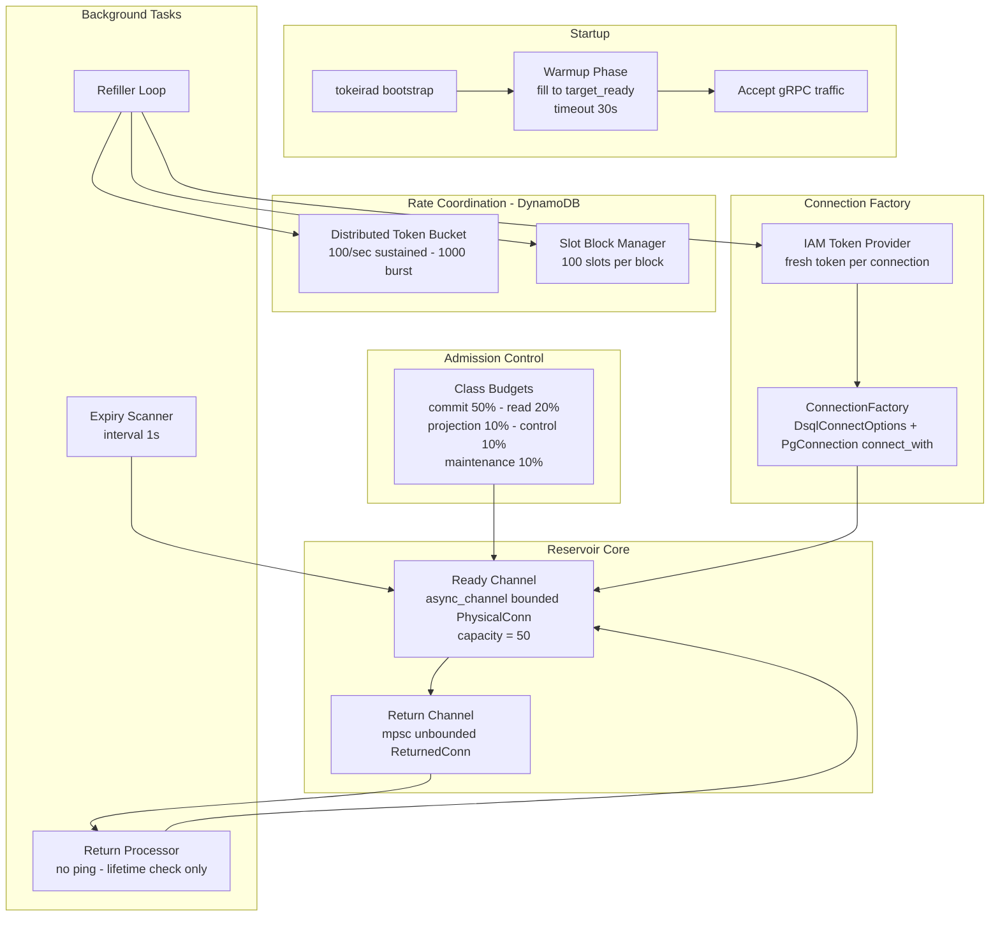

# Design Document: DSQL Reservoir Redesign

## Overview

This design eliminates the sqlx `PgPool` from the DSQL connection path entirely. The current implementation wraps a sqlx PgPool inside the reservoir: the refiller calls `pool.acquire()` to create connections, but the pool's `max_connections` equals `target_ready`, so when the reservoir holds all connections in its ready channel, the pool has nothing left for the refiller — causing `pool timed out` errors under load.

The redesign makes the reservoir the **sole connection owner**. Physical connections are created directly via IAM-authenticated TCP/TLS using `aurora_dsql_sqlx_connector::DsqlConnectOptions` and `sqlx::PgConnection::connect_with()`, bypassing the sqlx pool entirely. The reservoir IS the pool.

Three background tokio tasks manage the connection lifecycle:
1. **Refiller** — continuously creates connections to maintain the ready channel at `target_ready`.
2. **Expiry Scanner** — periodically retires connections approaching their IAM token expiry.
3. **Return Processor** — validates returned connections (lifetime check only, no ping) before reuse.

For multi-node coordination, DynamoDB-backed components distribute the rate budget and connection count:
- **Distributed Token Bucket** — enforces the cluster-wide 100/sec DSQL connection creation rate.
- **Slot Block Manager** — partitions the 10,000 connection limit across nodes using block-based allocation.

All connection management parameters are internal constants derived from DSQL's known constraints. The operator provides an endpoint and credentials. Everything else is automatic.

**Key design change from current implementation:** The return processor no longer pings connections on return. Guard window lifetime checks are sufficient — a connection that was healthy during use and has remaining lifetime is safe to reuse without a network round-trip. This eliminates per-return latency and connection churn.

## Architecture



### Key Design Invariants

1. **The reservoir is the sole connection owner.** No sqlx PgPool exists. The reservoir creates, holds, and retires all DSQL connections.
2. **Checkout is O(1) with no network I/O.** `try_recv()` on the ready channel returns immediately or signals empty.
3. **Connection creation failures never block checkout callers.** The refiller runs independently; its errors are logged and retried with backoff.
4. **No connection is ever handed out with remaining_lifetime < guard_window.** Both the expiry scanner and the return processor enforce this.
5. **Class budgets guarantee isolation.** Projection cannot consume commit-class permits — separate semaphore instances.
6. **DynamoDB coordination is mandatory for DSQL.** No local-only fallback. Unreachable DynamoDB = startup failure.
7. **No ping on return.** Lifetime check and bad-flag check only.


## Components and Interfaces

### 1. PhysicalConn and ReturnedConn

**Location:** `crates/tokeira-storage/src/dsql/reservoir.rs`

```rust
pub struct PhysicalConn {
    pub(crate) connection: PgConnection,  // raw, NOT PoolConnection<Postgres>
    pub(crate) created_at: Instant,
    pub(crate) lifetime: Duration,        // BASE_LIFETIME ± LIFETIME_JITTER
}

impl PhysicalConn {
    pub fn remaining_lifetime(&self) -> Duration {
        self.lifetime.saturating_sub(self.created_at.elapsed())
    }
    pub fn within_guard_window(&self, guard_window: Duration) -> bool {
        self.remaining_lifetime() <= guard_window
    }
}

pub struct ReturnedConn {
    pub(crate) connection: PgConnection,
    pub(crate) created_at: Instant,
    pub(crate) lifetime: Duration,
    pub(crate) marked_bad: bool,
}
```

### 2. Connection Factory

**Location:** `crates/tokeira-storage/src/dsql/connection_factory.rs` (new file)

Creates raw `PgConnection` instances via IAM-authenticated TCP/TLS. Each call generates a fresh IAM token — no caching.

```rust
pub struct ConnectionFactory {
    endpoint: String,
    region: String,
}

impl ConnectionFactory {
    pub async fn create_connection(&self) -> Result<PgConnection, ConnectionFactoryError> {
        let conn_str = format!("postgres://admin@{}:5432/postgres?region={}", self.endpoint, self.region);
        let options = DsqlConnectOptions::from_connection_string(&conn_str)
            .map_err(|e| ConnectionFactoryError::Iam(e.into()))?;
        sqlx::PgConnection::connect_with(&options.into())
            .await
            .map_err(ConnectionFactoryError::from_sqlx)
    }
}

#[derive(Debug, thiserror::Error)]
pub enum ConnectionFactoryError {
    #[error("IAM token generation failed: {0}")] Iam(anyhow::Error),
    #[error("TLS handshake failed: {0}")] Tls(anyhow::Error),
    #[error("connection timed out: {0}")] Timeout(anyhow::Error),
    #[error("connection refused: {0}")] Refused(anyhow::Error),
    #[error("connection failed: {0}")] Other(anyhow::Error),
}

impl ConnectionFactoryError {
    pub fn category(&self) -> &'static str {
        match self { Self::Iam(_) => "iam", Self::Tls(_) => "tls",
                     Self::Timeout(_) => "timeout", Self::Refused(_) => "refused",
                     Self::Other(_) => "other" }
    }
}
```

### 3. Reservoir

**Location:** `crates/tokeira-storage/src/dsql/reservoir.rs`

**Internal constants (NOT configurable):**

| Constant | Value | Derivation |
|----------|-------|------------|
| `TARGET_READY` | 50 | Expected peak concurrency for single-node |
| `BASE_LIFETIME` | 10 min | 70% of DSQL 15-min IAM token TTL |
| `LIFETIME_JITTER` | ±2 min | Prevents synchronized expiry storms |
| `GUARD_WINDOW` | 45 sec | Safety margin before token expiry |
| `INFLIGHT_LIMIT` | 8 | Max concurrent TCP/TLS handshakes |
| `SCAN_INTERVAL` | 1 sec | Expiry scanner frequency |
| `WARMUP_TIMEOUT` | 30 sec | Max time to wait for initial fill |
| `REFILLER_IDLE_INTERVAL` | 100ms | Check interval when full |
| `REFILLER_ERROR_BACKOFF` | 250ms | Initial backoff on failure |
| `DISTRIBUTED_RATE` | 100/sec | DSQL cluster-wide sustained rate |
| `DISTRIBUTED_BURST` | 1000 | DSQL cluster-wide burst capacity |
| `SLOT_BLOCK_SIZE` | 100 | Connections per block |
| `SLOT_BLOCK_TTL` | 3 min | Crash recovery timeout |
| `SLOT_BLOCK_RENEW` | 1 min | Renewal interval |

```rust
pub struct Reservoir {
    ready_rx: async_channel::Receiver<PhysicalConn>,
    ready_tx: async_channel::Sender<PhysicalConn>,
    return_tx: mpsc::UnboundedSender<ReturnedConn>,
    refiller_handle: JoinHandle<()>,
    scanner_handle: JoinHandle<()>,
    return_processor_handle: JoinHandle<()>,
}

impl Reservoir {
    pub async fn start(factory: ConnectionFactory, bucket: Arc<DistributedTokenBucket>,
                       slots: Arc<SlotBlockManager>) -> Result<Self> { /* ... */ }

    /// Non-blocking checkout. Returns immediately or ErrReservoirEmpty.
    pub fn checkout(&self) -> Result<PhysicalConn, ReservoirError> {
        match self.ready_rx.try_recv() {
            Ok(conn) => { metrics::record_dsql_pool_connections_total(self.ready_rx.len()); Ok(conn) }
            Err(_) => { metrics::record_dsql_pool_empty_reservoir(); Err(ReservoirError::Empty) }
        }
    }

    pub async fn warmup(&self) -> WarmupResult { /* poll until full or timeout */ }
    pub fn return_sender(&self) -> mpsc::UnboundedSender<ReturnedConn> { self.return_tx.clone() }
    pub fn ready_count(&self) -> usize { self.ready_rx.len() }
}
```

### 4. Refiller Loop

```rust
// Pseudocode — exact implementation mechanics
loop {
    if ready_tx.len() >= TARGET_READY { sleep(100ms); continue; }
    if !slot_manager.has_budget() { sleep(100ms); continue; }
    let _permit = inflight_sem.acquire().await;  // max 8 concurrent
    distributed_bucket.wait().await;              // DynamoDB round-trip
    match factory.create_connection().await {
        Ok(conn) => {
            let lifetime = assign_jittered_lifetime(); // [8min, 12min]
            ready_tx.send(PhysicalConn { connection: conn, created_at: now(), lifetime }).await;
            slot_manager.record_connection_created();
        }
        Err(e) => { log_warn(e); sleep(250ms); }
    }
}

fn assign_jittered_lifetime() -> Duration {
    let offset = rand::gen_range(0..=(LIFETIME_JITTER.as_secs() * 2));
    BASE_LIFETIME - LIFETIME_JITTER + Duration::from_secs(offset)
}
```

### 5. Expiry Scanner

```rust
loop {
    sleep(SCAN_INTERVAL); // 1 second
    for _ in 0..TARGET_READY {  // bounded: max 50 entries per pass
        match ready_rx.try_recv() {
            Ok(conn) if conn.within_guard_window(GUARD_WINDOW) => {
                metrics::record_retirement("guard_window", conn.created_at.elapsed());
                drop(conn);
            }
            Ok(conn) => { ready_tx.try_send(conn).ok(); }
            Err(_) => break,
        }
    }
}
```

### 6. Return Processor

```rust
while let Some(returned) = return_rx.recv().await {
    if returned.marked_bad {
        metrics::record_retirement("unhealthy", returned.created_at.elapsed());
        continue; // discard
    }
    let conn = PhysicalConn { connection: returned.connection, created_at: returned.created_at,
                              lifetime: returned.lifetime };
    if conn.within_guard_window(GUARD_WINDOW) {
        metrics::record_retirement("guard_window", conn.created_at.elapsed());
        continue; // discard
    }
    // Put back — NO PING, no network I/O.
    ready_tx.send(conn).await.ok();
}
```

### 7. Distributed Token Bucket

**Location:** `crates/tokeira-storage/src/dsql/distributed_bucket.rs` (new file)

**DynamoDB Table:** `{project}-dsql-rate-limiter`

| Attribute | Type | Key | Description |
|-----------|------|-----|-------------|
| `pk` | String | PK | `dsql_connect_bucket#{endpoint}#{unix_second}` |
| `tokens_milli` | Number | — | Current tokens × 1000 (avoids floats) |
| `last_refill_ms` | Number | — | Unix millis of last refill |
| `rate_milli` | Number | — | 100,000 (= 100 tokens/sec × 1000) |
| `capacity_milli` | Number | — | 1,000,000 (= 1000 tokens × 1000) |
| `ttl_epoch` | Number | TTL | Unix seconds + 180 (3 min auto-cleanup) |

**Wait protocol:**
1. GetItem — read current bucket state (or create at full capacity if missing).
2. Compute refill: `elapsed_ms × rate_milli / 1000`, cap at `capacity_milli`.
3. If `tokens_milli >= 1000`: conditional UpdateItem to deduct 1000.
4. If condition fails (another node raced): retry with jittered backoff (1–10ms).
5. If `tokens_milli < 1000` after refill: sleep until next refill, retry.

**Atomicity:** The condition expression `last_refill_ms = :expected` ensures only one node succeeds per token. Losers retry with fresh state.

### 8. Slot Block Manager

**Location:** `crates/tokeira-storage/src/dsql/slot_block_manager.rs` (new file)

**DynamoDB Table:** `{project}-dsql-conn-lease`

| Attribute | Type | Key | Description |
|-----------|------|-----|-------------|
| `pk` | String | PK | `dsql_slot_block#{endpoint}#{block_id}` |
| `owner` | String | — | Node ID that owns this block |
| `acquired_at` | Number | — | Unix millis when acquired |
| `ttl_epoch` | Number | TTL | Unix seconds + 180 (crash recovery) |
| `block_size` | Number | — | 100 (slots per block) |

**Protocol:**
1. On startup: acquire `ceil(TARGET_READY / BLOCK_SIZE)` blocks (= 1 block for 50 connections).
2. Acquire = conditional PutItem where `attribute_not_exists(pk) OR ttl_epoch < :now`.
3. Every 60 seconds: renew owned blocks (update `ttl_epoch`).
4. On shutdown: release blocks (conditional DeleteItem where `owner = :my_node`).
5. Refiller checks `has_budget()`: `connections_created < owned_blocks × BLOCK_SIZE`.

**Crash recovery:** If a node crashes, its blocks' `ttl_epoch` expires after 3 minutes. Other nodes can then claim them.

### 9. Class-Based Admission Control

**Location:** `crates/tokeira-storage/src/dsql/connection.rs` (existing, modified)

```rust
impl ConnectionDirector for DsqlConnectionDirector {
    async fn acquire(&self, class: DbClass) -> Result<DsqlPermit> {
        let started = Instant::now();
        let class_guard = self.class_budgets.acquire(class).await?;  // may block
        match self.reservoir.checkout() {                              // non-blocking
            Ok(conn) => { /* build permit */ }
            Err(ReservoirError::Empty) => {
                drop(class_guard);  // release permit on backpressure
                Err(anyhow!("reservoir empty: backpressure"))
            }
        }
    }
}
```

**Allocation (TARGET_READY = 50):**

| Class | % | Permits |
|-------|---|---------|
| Commit | 50% | 25 |
| Read | 20% | 10 |
| Projection | 10% | 5 |
| Control | 10% | 5 |
| Maintenance | 10% | 5 |

### 10. DsqlPermit

```rust
pub struct DsqlPermit {
    pub class: DbClass,
    connection: Option<PgConnection>,
    created_at: Instant,
    lifetime: Duration,
    marked_bad: bool,
    _class_guard: OwnedSemaphorePermit,
    reservoir_return: mpsc::UnboundedSender<ReturnedConn>,
    director_in_flight: Arc<AtomicUsize>,
}

impl DsqlPermit {
    pub fn connection(&mut self) -> Result<&mut PgConnection> { /* ... */ }
    pub fn mark_bad(&mut self) { self.marked_bad = true; }
}

impl Drop for DsqlPermit {
    fn drop(&mut self) {
        self.director_in_flight.fetch_sub(1, Ordering::AcqRel);
        if let Some(conn) = self.connection.take() {
            let _ = self.reservoir_return.send(ReturnedConn {
                connection: conn, created_at: self.created_at,
                lifetime: self.lifetime, marked_bad: self.marked_bad,
            });
        }
    }
}
```

### 11. Pool Warmup and Startup Sequence

```
1. Validate DynamoDB tables reachable (fail hard if not).
2. Start SlotBlockManager (acquire initial blocks).
3. Start DistributedTokenBucket.
4. Start Reservoir (spawns refiller, scanner, return processor).
5. Warmup: poll until ready_count >= TARGET_READY (timeout: 30s).
6. Build DsqlConnectionDirector with class budgets.
7. Accept gRPC traffic.
```

If DynamoDB unreachable at step 1:
```
Error: DynamoDB table '{project}-dsql-rate-limiter' is unreachable.
DSQL deployments require DynamoDB coordination tables.
Run 'tkr infra apply' to provision them.
```

### 12. Compose IaC DynamoDB Provisioning

**Location:** `platforms/compose/src/modules/dsql.rs` (extend existing module)

Two DynamoDB tables provisioned alongside the DSQL cluster:

| Table | Name | Purpose |
|-------|------|---------|
| Rate Limiter | `{project}-dsql-rate-limiter` | Distributed token bucket |
| Slot Blocks | `{project}-dsql-conn-lease` | Connection slot allocation |

Both tables: on-demand billing, TTL enabled on `ttl_epoch`, same region as DSQL, created by `tkr infra apply`, destroyed by `tkr infra destroy`.


## Data Models

### PhysicalConn

| Field | Type | Description |
|-------|------|-------------|
| `connection` | `PgConnection` | Raw PostgreSQL connection (no pool wrapper) |
| `created_at` | `Instant` | Monotonic creation timestamp |
| `lifetime` | `Duration` | Assigned lifetime: 8–12 minutes |

### ReturnedConn

| Field | Type | Description |
|-------|------|-------------|
| `connection` | `PgConnection` | Connection being returned |
| `created_at` | `Instant` | Original creation timestamp |
| `lifetime` | `Duration` | Original assigned lifetime |
| `marked_bad` | `bool` | Caller signals connection-level error |

### DynamoDB: Rate Limiter (`{project}-dsql-rate-limiter`)

| Attribute | Type | Key | Description |
|-----------|------|-----|-------------|
| `pk` | String | PK | `dsql_connect_bucket#{endpoint}#{unix_second}` |
| `tokens_milli` | Number | — | Current tokens × 1000 |
| `last_refill_ms` | Number | — | Unix millis of last refill |
| `rate_milli` | Number | — | 100,000 (100 tokens/sec × 1000) |
| `capacity_milli` | Number | — | 1,000,000 (1000 tokens × 1000) |
| `ttl_epoch` | Number | TTL | Unix seconds + 180 |

### DynamoDB: Slot Blocks (`{project}-dsql-conn-lease`)

| Attribute | Type | Key | Description |
|-----------|------|-----|-------------|
| `pk` | String | PK | `dsql_slot_block#{endpoint}#{block_id}` |
| `owner` | String | — | Node ID |
| `acquired_at` | Number | — | Unix millis |
| `ttl_epoch` | Number | TTL | Unix seconds + 180 |
| `block_size` | Number | — | 100 |

### Metrics

| Metric Name | Type | Labels |
|-------------|------|--------|
| `tokeira_dsql_reservoir_ready_connections` | Gauge | — |
| `tokeira_dsql_reservoir_checkout_duration_seconds` | Histogram | `class` |
| `tokeira_dsql_reservoir_empty_total` | Counter | — |
| `tokeira_dsql_reservoir_connection_create_duration_seconds` | Histogram | — |
| `tokeira_dsql_reservoir_connection_age_seconds` | Histogram | `retirement_reason` |
| `tokeira_dsql_reservoir_in_flight` | Gauge | — |
| `tokeira_dsql_rate_limiter_tokens_remaining` | Gauge | — |
| `tokeira_dsql_slot_blocks_owned` | Gauge | — |
| `tokeira_dsql_pool_class_budget_total` | Gauge | `class` |
| `tokeira_dsql_pool_class_in_use` | Gauge | `class` |
| `tokeira_dsql_pool_class_waiters` | Gauge | `class` |
| `tokeira_dsql_pool_connections_created_total` | Counter | — |
| `tokeira_dsql_pool_connections_retired_total` | Counter | `reason` |
| `tokeira_dsql_pool_connections_returned_total` | Counter | — |
| `tokeira_dsql_connection_error_total` | Counter | `error_kind` |

All metrics emitted unconditionally via the `metrics` crate. No configuration options.

## Correctness Properties

*A property is a characteristic or behavior that should hold true across all valid executions of a system — essentially, a formal statement about what the system should do. Properties serve as the bridge between human-readable specifications and machine-verifiable correctness guarantees.*

### Property 1: Lifetime Jitter Bounds

*For any* connection created by the refiller, its assigned lifetime SHALL be within `[BASE_LIFETIME - LIFETIME_JITTER, BASE_LIFETIME + LIFETIME_JITTER]` (8 to 12 minutes inclusive).

**Validates: Requirements 4.6, 12.3**

### Property 2: Lifetime Safety Against Token TTL

*For any* valid reservoir configuration, `BASE_LIFETIME + LIFETIME_JITTER + GUARD_WINDOW` SHALL be strictly less than 15 minutes (the DSQL IAM token TTL). With specified constants: 12 min + 45 sec = 12:45 < 15:00.

**Validates: Requirements 12.4**

### Property 3: Guard Window Enforcement

*For any* connection where `remaining_lifetime() <= GUARD_WINDOW`, both the expiry scanner and the return processor SHALL discard it. No such connection SHALL be placed back in the ready channel or handed to a caller.

**Validates: Requirements 5.2, 6.2, 17.1, 17.2**

### Property 4: Bad Connection Discard

*For any* connection returned with `marked_bad = true`, the return processor SHALL discard it regardless of remaining lifetime.

**Validates: Requirements 17.3**

### Property 5: No-Network Return Path

*For any* connection returned outside the guard window and not marked bad, the return processor SHALL place it back in the ready channel without executing any network I/O.

**Validates: Requirements 17.4, 17.5**

### Property 6: Class Budget Sum Invariant

*For any* `target_ready` ≥ 5, the sum of all class allocations SHALL equal `target_ready`, and each class SHALL have at least 1 permit.

**Validates: Requirements 10.1**

### Property 7: Class Isolation

*For any* valid system state, exhausting all permits in one class SHALL NOT reduce available permits in any other class.

**Validates: Requirements 10.4**

### Property 8: Bounded Scan Per Pass

*For any* expiry scanner pass, the scanner SHALL examine at most `TARGET_READY` entries from the ready channel.

**Validates: Requirements 5.4**

### Property 9: Slot Budget Enforcement

*For any* node with N owned slot blocks, the refiller SHALL NOT create more than `N × SLOT_BLOCK_SIZE` connections.

**Validates: Requirements 9.3**

### Property 10: Distributed Rate Burst Limit

*For any* sequence of token acquisitions, the bucket SHALL NOT dispense more than `DISTRIBUTED_BURST` (1000) tokens without refill time. Sustained rate SHALL NOT exceed `DISTRIBUTED_RATE` (100/sec).

**Validates: Requirements 7.3, 8.1**

### Property 11: Non-Blocking Checkout

*For any* state of the ready channel, `checkout()` SHALL return in O(1) time without network I/O, DynamoDB calls, or connection creation.

**Validates: Requirements 3.1, 3.2**

### Property 12: Inflight Concurrency Limit

*For any* state of the refiller, concurrent connection creation attempts SHALL NOT exceed `INFLIGHT_LIMIT` (8).

**Validates: Requirements 4.4**

## Error Handling

### Connection Creation Failures

| Error Category | Cause | Refiller Behavior | Caller Impact |
|---------------|-------|-------------------|---------------|
| `iam` | IAM token generation failure | Backoff 250ms, retry | None |
| `tls` | TLS handshake failure | Backoff 250ms, retry | None |
| `timeout` | TCP connect timeout | Backoff 250ms, retry | None |
| `refused` | DSQL endpoint refusing connections | Backoff 250ms, retry | None |
| `other` | Unknown connection error | Backoff 250ms, retry | None |

The refiller never propagates errors to checkout callers. It logs, backs off, and retries indefinitely.

### DynamoDB Coordination Failures

| Scenario | Behavior |
|----------|----------|
| Table unreachable at startup | **Fail hard** — process exits with clear error |
| Cannot acquire any slot blocks | **Fail hard** — process exits |
| Condition check failed (race) | Normal — retry with jitter |
| Transient error during operation | Log error, retry with backoff |
| Slot block renewal fails | Log warning, retry next interval |
| Slot block TTL expires (crash) | Blocks become available to other nodes |

### Checkout Failures

| Scenario | Behavior |
|----------|----------|
| Ready channel empty | Return `Err(ReservoirError::Empty)` immediately |
| Class budget exhausted | Block at semaphore until permit available |
| Reservoir dropped | Return `Err` (channel closed) |

### Return Path

| Scenario | Behavior |
|----------|----------|
| Within guard window | Discard, emit metric |
| Marked bad | Discard, emit metric |
| Healthy, outside guard window | Put back (no ping) |

### Graceful Shutdown

1. Abort refiller, scanner, return processor tasks.
2. Close ready and return channels.
3. Release all slot blocks via `SlotBlockManager::release_all()`.
4. Drop all `PhysicalConn` instances (closes TCP connections).

## Testing Strategy

### Property-Based Tests (proptest)

Each correctness property maps to a property-based test with minimum 100 iterations:

| Property | Generator Strategy |
|----------|-------------------|
| 1: Lifetime Jitter Bounds | Random seeds, verify output in [8min, 12min] |
| 2: Lifetime Safety | Verify max_lifetime + guard < 15min for any valid config |
| 3: Guard Window Enforcement | Random (age, lifetime) pairs, verify retirement decision |
| 4: Bad Connection Discard | Random lifetimes with bad=true, verify always discarded |
| 5: No-Network Return | Mock-based, verify no I/O calls on healthy return |
| 6: Class Budget Sum | `target_ready in 5..500`, verify sum invariant |
| 7: Class Isolation | Exhaust one class, verify others unchanged |
| 8: Bounded Scan | `channel_size in 1..200`, verify ≤ TARGET_READY examined |
| 9: Slot Budget | `blocks in 0..10, connections in 0..1000`, verify budget check |
| 10: Rate Burst | `acquisitions in 1..2000`, verify burst limit |
| 11: Non-Blocking Checkout | Various channel states, verify O(1) return |
| 12: Inflight Limit | `concurrent in 1..20`, verify semaphore enforcement |

**Library:** `proptest` (already in workspace). **Tag format:** `Feature: dsql-reservoir-redesign, Property {N}: {title}`

### Unit Tests (example-based)

- Connection factory error classification (each variant → correct category)
- Warmup completes at target / times out gracefully
- Non-blocking checkout returns immediately when empty
- DsqlPermit::drop sends ReturnedConn to return channel
- DsqlPermit::mark_bad propagates to ReturnedConn
- Class budget rejects zero-allocation configs
- Startup fails without DynamoDB coordination tables
- Scanner retires expired connections, preserves healthy ones
- Return processor discards bad/expired, keeps healthy

### Integration Tests (require DynamoDB Local)

- Distributed token bucket: two nodes share rate budget
- Slot block acquisition: conditional PutItem succeeds for first claimer
- Slot block TTL expiry: block reclaimable after crash
- Full lifecycle: warmup → checkout → use → return → expiry → refill
- Graceful shutdown releases slot blocks
