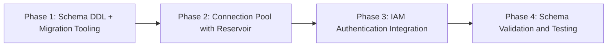
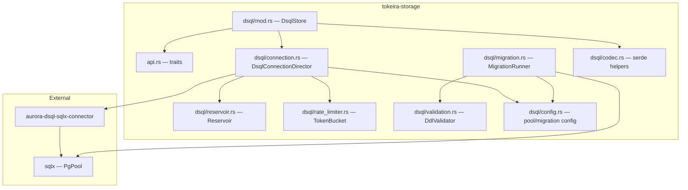
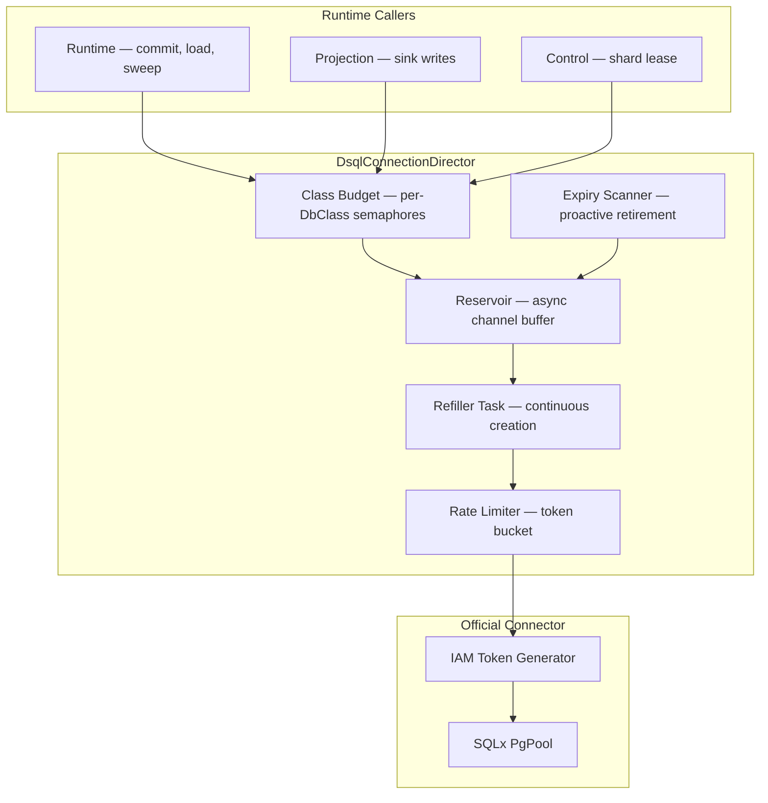

# Design Document: DSQL Schema and Connection Foundation

## Overview

This design covers the foundational DSQL layer for Tokeira: the complete schema DDL for 11 runtime tables plus `schema_version` migration metadata across core, delivery, and projection domains; a forward-only migration runner; a connection pool implementing the reservoir pattern on top of the official `aurora-dsql-sqlx-connector`; and IAM-based authentication with role separation.

The design is shaped by DSQL's actual constraints — not by what PostgreSQL would allow. Key constraints driving decisions:

- **No BIGSERIAL**: all identifiers are application-generated (UUID v4 or composite keys)
- **CHECK constraints available but not used**: DSQL supports CHECK in CREATE TABLE, but Tokeira uses application-level validation in Rust for testability and flexibility
- **No temporary tables**: CTE-based query compilation instead
- **No PL/pgSQL or triggers**: all behavioral logic in application code
- **No foreign keys in hot path**: application-managed referential integrity
- **One DDL per transaction**: DSQL requires each DDL statement in its own transaction — cannot batch multiple CREATE TABLE or CREATE INDEX statements
- **INDEX ASYNC**: non-blocking index creation for all secondary indexes
- **3,000-row mutation limit**: narrow write sets per transaction
- **OCC with Repeatable Read**: conflict detection at commit, retry in application
- **60-minute connection lifetime**: proactive recycling with jitter
- **100 connections/second sustained rate, 1,000 burst**: rate-limited creation
- **Single database per cluster**: all tables in the `public` schema for MVP

The official `aurora-dsql-sqlx-connector` (v0.1.2) provides IAM token generation, SQLx-based async PostgreSQL connectivity, connection pooling with background token refresh, and OCC retry helpers. This design layers reservoir buffering, class-based budget allocation, rate-limited creation, and proactive expiry scanning on top of it.

### Phased Delivery



- **Phase 1**: DDL for all 11 tables + `schema_version` tracking table, secondary indexes with INDEX ASYNC, migration runner with version ordering, checksum verification, and dry-run mode.
- **Phase 2**: `DsqlConnectionDirector` implementing `ConnectionDirector` trait, reservoir channel with refiller task, expiry scanner, in-flight semaphore, class-based permits.
- **Phase 3**: IAM token integration via official connector, role separation (admin, runtime, read-only), region auto-detection.
- **Phase 4**: DDL validation subcommand, round-trip serialization tests, property-based tests for migration ordering and config.

## Architecture

### Module Layout

All new code lives in the `tokeira-storage` crate, organized under a `dsql` module:

```
tokeira-storage/
├── src/
│   ├── api.rs                    # Existing traits (ConnectionDirector, DbClass, etc.)
│   ├── memory.rs                 # Existing InMemoryStore
│   ├── metrics.rs                # Existing + new connection pool metrics
│   ├── dsql/
│   │   ├── mod.rs                # DsqlStore struct, feature gate
│   │   ├── connection.rs         # DsqlConnectionDirector (reservoir + class budgets)
│   │   ├── reservoir.rs          # Reservoir channel, refiller, expiry scanner
│   │   ├── rate_limiter.rs       # Token-bucket rate limiter for connection creation
│   │   ├── migration.rs          # MigrationRunner (forward-only, checksum, dry-run)
│   │   ├── validation.rs         # DDL validation against DSQL constraints
│   │   ├── config.rs             # DsqlPoolConfig, ReservoirConfig, MigrationConfig
│   │   └── codec.rs              # Serialization/deserialization for BYTEA columns
│   └── lib.rs
├── migrations/
│   ├── V001__schema_version.sql
│   ├── V002__shard_lease.sql
│   ├── V003__current_execution.sql
│   ├── V004__workflow_hot.sql
│   ├── V005__history_batch.sql
│   ├── V006__request_dedupe.sql
│   ├── V007__activity_state.sql
│   ├── V008__timer_bucket.sql
│   ├── V009__dispatch_backlog.sql
│   ├── V010__projection_log.sql
│   ├── V011__projector_checkpoint.sql
│   ├── V012__vis_execution.sql
│   ├── V013__idx_workflow_hot_shard.sql
│   ├── V014__idx_activity_state_shard.sql
│   ├── V015__idx_activity_state_queue.sql
│   ├── V016__idx_timer_bucket_shard_fire.sql
│   ├── V017__idx_vis_execution_ns_close.sql
│   └── V018__idx_vis_execution_ns_type.sql
└── Cargo.toml
```

### Dependency Flow



### Connection Architecture

The connection stack has three layers, matching the architecture doc (060):



**Design rationale**: The official connector handles IAM token lifecycle and SQLx pool management. Tokeira layers reservoir buffering on top because the official connector's pool does not provide: (a) proactive connection pre-creation to avoid blocking on `acquire`, (b) class-based budget allocation for workload prioritization, (c) rate-limited creation respecting DSQL's 100/sec sustained limit across nodes, or (d) proactive expiry scanning with guard window before the 60-minute hard cutoff.

## Components and Interfaces

### Phase 1: Schema DDL and Migration Tooling

#### `MigrationRunner`

Reads SQL files from `migrations/`, applies them in version order against a DSQL cluster, and tracks applied versions in a `schema_version` table.

**DSQL DDL constraint**: DSQL allows at most one DDL statement per transaction. To avoid the complexity and fragility of SQL statement splitting, each migration file contains exactly one DDL statement. The initial schema uses files `V001` through `V012` (one per table) plus `V013` through `V018` (one per index). The `schema_version` record is inserted in a separate DML transaction after the DDL succeeds.

```rust
/// Forward-only schema migration runner for DSQL.
///
/// Applies DDL migrations in a dedicated connection separate from
/// runtime DML traffic. Each DDL statement within a migration file
/// is executed in its own transaction (DSQL requires one DDL per
/// transaction). Tracks applied versions with checksums to detect
/// tampering.
pub struct MigrationRunner {
    config: MigrationConfig,
}

impl MigrationRunner {
    /// Create a new runner with the given configuration.
    pub fn new(config: MigrationConfig) -> Self;

    /// Apply all pending migrations in version order.
    ///
    /// Uses a dedicated admin connection (not from the runtime pool).
    /// Returns the number of migrations applied.
    pub async fn apply(&self, pool: &PgPool) -> Result<MigrationReport>;

    /// Print SQL that would be executed without applying.
    pub async fn dry_run(&self, pool: &PgPool) -> Result<Vec<MigrationPlan>>;

    /// Validate all migration files against DSQL constraints.
    pub fn validate(&self) -> Result<Vec<ValidationIssue>>;

    /// Check current schema version without applying anything.
    pub async fn status(&self, pool: &PgPool) -> Result<SchemaStatus>;
}
```

#### `MigrationConfig`

```rust
#[derive(Clone, Debug, Serialize, Deserialize)]
#[serde(deny_unknown_fields)]
pub struct MigrationConfig {
    /// Directory containing migration SQL files.
    /// Default: "migrations/" relative to crate root.
    pub migrations_dir: PathBuf,
}
```

#### `DdlValidator`

Static analysis of SQL migration files against DSQL constraints.

```rust
pub struct DdlValidator;

impl DdlValidator {
    /// Check a migration file for DSQL-incompatible constructs.
    pub fn validate(sql: &str, filename: &str) -> Vec<ValidationIssue>;
}

pub struct ValidationIssue {
    pub file: String,
    pub line: usize,
    pub kind: ValidationKind,
    pub message: String,
}

pub enum ValidationKind {
    BigSerial,
    CheckConstraint,
    TempTable,
    PlPgsql,
    ForeignKey,
    MissingAsyncKeyword, // CREATE INDEX without ASYNC
    MonotonicPrimaryKey,
}
```

### Phase 2: Connection Pool with Reservoir

#### `ConnectionDirector` trait update

The existing `ConnectionDirector` trait in `api.rs` returns a concrete `DbPermit` that only carries `DbClass`. To support real SQLx connections without forcing SQLx into the generic storage API, the trait gains an associated `Permit` type:

```rust
/// Connection budget director with associated permit type.
///
/// InMemoryStore uses DbPermit (no-op marker).
/// DsqlConnectionDirector uses DsqlPermit (carries PoolConnection).
/// Callers that need the SQLx connection work through the concrete type;
/// callers that only need class-based admission work through the trait.
#[async_trait]
pub trait ConnectionDirector: Send + Sync {
    type Permit: Send;
    async fn acquire(&self, class: DbClass) -> Result<Self::Permit>;
}
```

#### `DsqlConnectionDirector`

Implements `ConnectionDirector` with `Permit = DsqlPermit`, adding reservoir buffering and class-based budgets.

```rust
/// Production DSQL connection director with reservoir pattern.
pub struct DsqlConnectionDirector {
    reservoir: Reservoir,
    class_budgets: ClassBudgets,
    rate_limiter: TokenBucketRateLimiter,
    metrics: ConnectionMetrics,
}

#[async_trait]
impl ConnectionDirector for DsqlConnectionDirector {
    type Permit = DsqlPermit;
    async fn acquire(&self, class: DbClass) -> Result<DsqlPermit>;
}
```

```rust
/// A held connection permit with a real DSQL session.
///
/// When dropped, the connection is returned to the reservoir
/// (if still valid) or discarded (if expired/broken).
pub struct DsqlPermit {
    pub class: DbClass,
    /// Wrapped in Option so Drop can take() ownership for return.
    connection: Option<PoolConnection<Postgres>>,
    created_at: Instant,
    max_lifetime: Duration,
    _class_guard: OwnedSemaphorePermit,
    reservoir_return: mpsc::UnboundedSender<ReservoirEntry>,
}

impl DsqlPermit {
    /// Access the underlying SQLx connection for query execution.
    pub fn connection(&mut self) -> &mut PgConnection {
        &mut *self.connection.as_mut().expect("permit not yet dropped")
    }
}

impl Drop for DsqlPermit {
    fn drop(&mut self) {
        // Take ownership of the connection out of the Option.
        // If still within lifetime and healthy, send back to reservoir
        // via UnboundedSender (synchronous, safe from Drop).
        // Otherwise discard.
        if let Some(conn) = self.connection.take() {
            let entry = ReservoirEntry {
                connection: conn,
                created_at: self.created_at,
                max_lifetime: self.max_lifetime,
            };
            let _ = self.reservoir_return.send(entry);
        }
    }
}
```

#### `Reservoir`

Async channel-based buffer holding pre-created, validated connections.

```rust
/// Channel-based connection buffer with continuous refiller.
///
/// Uses `async_channel` for the ready pool (multi-consumer, Clone receiver)
/// and `mpsc::UnboundedReceiver` for the return path (synchronous send
/// from DsqlPermit::Drop).
pub struct Reservoir {
    /// Ready connections available for immediate checkout.
    /// async_channel::Receiver is Clone, so checkout(&self) works.
    ready: async_channel::Receiver<ReservoirEntry>,
    /// Return channel sender — cloned into each DsqlPermit.
    /// UnboundedSender::send is synchronous — safe from Drop.
    return_tx: mpsc::UnboundedSender<ReservoirEntry>,
    /// Handle to the background refiller task.
    refiller_handle: JoinHandle<()>,
    /// Handle to the background expiry scanner task.
    scanner_handle: JoinHandle<()>,
    /// Handle to the background return-processor task.
    return_processor_handle: JoinHandle<()>,
    config: ReservoirConfig,
}

struct ReservoirEntry {
    connection: PoolConnection<Postgres>,
    created_at: Instant,
    max_lifetime: Duration,
}

impl Reservoir {
    /// Start the reservoir with its background tasks.
    ///
    /// Spawns three background tasks:
    /// - **Refiller**: creates new connections when ready count < target
    /// - **Expiry scanner**: retires connections within guard window
    /// - **Return processor**: reads from `UnboundedReceiver`, validates
    ///   returned connections (lifetime + health), and either requeues
    ///   them to the ready channel or discards them
    pub async fn start(
        config: ReservoirConfig,
        connector: DsqlConnector,
        rate_limiter: TokenBucketRateLimiter,
    ) -> Result<Self>;

    /// Checkout a ready connection. Blocks if none available.
    pub async fn checkout(&self) -> Result<ReservoirEntry>;
}
```

#### `ReservoirConfig`

```rust
#[derive(Clone, Debug, Serialize, Deserialize)]
#[serde(deny_unknown_fields)]
pub struct ReservoirConfig {
    /// Target number of ready connections in the buffer.
    /// Default: 50
    #[serde(default = "default_target_ready")]
    pub target_ready: usize,

    /// Maximum concurrent connection creation attempts.
    /// Default: 8
    #[serde(default = "default_inflight_limit")]
    pub inflight_limit: usize,

    /// Base connection lifetime before jitter.
    /// Default: 50 minutes
    #[serde(default = "default_base_lifetime")]
    pub base_lifetime: Duration,

    /// Maximum jitter added to base lifetime.
    /// Default: 5 minutes (so effective range is 50–55 min)
    #[serde(default = "default_lifetime_jitter")]
    pub lifetime_jitter: Duration,

    /// Time before hard cutoff to proactively retire.
    /// Default: 45 seconds
    #[serde(default = "default_guard_window")]
    pub guard_window: Duration,

    /// How often the expiry scanner runs.
    /// Default: 10 seconds
    #[serde(default = "default_scan_interval")]
    pub scan_interval: Duration,
}
```

#### `TokenBucketRateLimiter`

```rust
/// Node-local token-bucket rate limiter for connection creation.
///
/// Always active when DSQL storage is selected. For single-node
/// deployments (local/compose with no distributed coordination),
/// uses the full cluster-wide budget (100/sec sustained, 1,000
/// burst). For multi-node deployments, the rate and capacity are
/// set by the distributed coordination backend via `reconfigure()`.
///
/// The distributed coordination backend (DynamoDB-backed) is
/// deferred to the connection-budget-allocator spec. This spec
/// implements only the node-local rate limiter and the
/// `reconfigure()` interface the backend will call.
pub struct TokenBucketRateLimiter {
    /// Available tokens (fractional for smooth refill).
    tokens: AtomicU64, // stored as fixed-point
    /// Maximum bucket capacity.
    capacity: AtomicU64,
    /// Tokens added per second.
    refill_rate: AtomicU64, // stored as fixed-point f64
    /// Monotonic base instant captured at construction.
    base: Instant,
    /// Elapsed nanoseconds since base at last refill.
    last_refill_nanos: AtomicU64,
}

impl TokenBucketRateLimiter {
    /// Create with the full cluster-wide budget (single-node default).
    pub fn new(rate_per_second: f64, capacity: u64) -> Self;

    /// Wait until a token is available, then consume it.
    pub async fn acquire(&self);

    /// Try to consume a token without waiting.
    pub fn try_acquire(&self) -> bool;

    /// Reconfigure rate and capacity at runtime.
    /// Called by the distributed coordination backend when the
    /// per-node share changes (nodes join/leave).
    pub fn reconfigure(&self, rate_per_second: f64, capacity: u64);
}
```

#### `ClassBudgets`

```rust
/// Per-DbClass semaphore-based connection budget allocation.
pub struct ClassBudgets {
    budgets: HashMap<DbClass, Arc<Semaphore>>,
    total_budget: usize,
}

impl ClassBudgets {
    pub fn new(allocations: &HashMap<DbClass, usize>) -> Self;

    /// Acquire a permit for the given class.
    /// Blocks until a permit is available.
    pub async fn acquire(&self, class: DbClass) -> Result<OwnedSemaphorePermit>;

    /// Reconfigure budgets at runtime without restart.
    pub fn reconfigure(&self, allocations: &HashMap<DbClass, usize>);
}
```

### Phase 3: IAM Authentication

The official connector handles IAM token lifecycle. Tokeira configures it with role-specific endpoints:

```rust
/// Configuration for IAM-authenticated DSQL connections.
#[derive(Clone, Debug, Serialize, Deserialize)]
#[serde(deny_unknown_fields)]
pub struct DsqlAuthConfig {
    /// DSQL cluster endpoint (e.g., "your-cluster.dsql.us-east-1.on.aws").
    pub endpoint: String,

    /// AWS region. Auto-detected from endpoint if not specified.
    #[serde(default)]
    pub region: Option<String>,

    /// IAM role ARN for admin/migration connections.
    /// Platform-provisioned: absent for local/compose, written back
    /// by infra apply on ECS platform.
    #[serde(default)]
    pub admin_role_arn: Option<String>,

    /// IAM role ARN for runtime connections (commit, read, control).
    /// Platform-provisioned: absent for local/compose, written back
    /// by infra apply on ECS platform.
    #[serde(default)]
    pub runtime_role_arn: Option<String>,

    /// IAM role ARN for read-only connections (projection, visibility).
    /// Platform-provisioned: absent for local/compose, written back
    /// by infra apply on ECS platform.
    #[serde(default)]
    pub readonly_role_arn: Option<String>,
}
```

#### Platform behavior for IAM roles

| Platform | Role ARNs | Credential source | Role separation |
|----------|-----------|-------------------|-----------------|
| **local + dsql** | All `None` | Developer's ambient AWS credentials (`~/.aws`) | No — single identity for all connections |
| **compose + dsql** | All `None` | Host AWS credentials mounted into container | No — single identity for all connections |
| **ECS + dsql** (future) | Provisioned by `foundation` IaC module | Pod Identity → IAM role per ServiceAccount | Yes — admin, runtime, readonly roles |

When all role ARNs are `None`, the official connector uses the default AWS credential chain. No IAM role resources need to be provisioned. For the future ECS platform, the `foundation` module will create three IAM roles with appropriate `dsql:DbConnect` / `dsql:DbConnectAdmin` policies, and `collect_writeback` will write the ARNs back to `tokeirad.toml` after `infra apply`.

### Phase 4: Schema Validation

The `validate` subcommand is part of `MigrationRunner` (see Phase 1 interfaces). It performs static analysis of SQL files without requiring a database connection.

## Data Models

### Schema DDL

All tables live in the `public` schema of a single DSQL database. The serialization format for all BYTEA columns is `postcard` (compact binary serde encoding), chosen for its varint encoding (smaller payloads for typical workflow data) and deterministic output. Task 1.3 adds the `Serialize, Deserialize` derives required for persisted domain types that do not already have them.

#### Core Tables

```sql
-- V001__initial_schema.sql
-- Serialization format: postcard (compact binary serde) for all BYTEA columns.
-- Domain types derive Serialize/Deserialize; no separate schema definitions needed.

-- Schema version tracking (created by migration runner bootstrap)
CREATE TABLE IF NOT EXISTS schema_version (
    version     INTEGER     NOT NULL,
    name        TEXT        NOT NULL,
    checksum    TEXT        NOT NULL,
    applied_at  TIMESTAMPTZ NOT NULL DEFAULT now(),
    PRIMARY KEY (version)
);

-- Shard ownership with epoch fencing
CREATE TABLE IF NOT EXISTS shard_lease (
    shard_id      UUID        NOT NULL,
    owner         TEXT        NOT NULL,
    epoch         BIGINT      NOT NULL,
    lease_expiry  TIMESTAMPTZ NOT NULL,
    PRIMARY KEY (shard_id)
);

-- Maps (namespace, workflow_id) to current run identity
CREATE TABLE IF NOT EXISTS current_execution (
    namespace_id  UUID        NOT NULL,
    workflow_id   TEXT        NOT NULL,
    run_key       UUID        NOT NULL,
    run_id        TEXT        NOT NULL,
    is_open       BOOLEAN     NOT NULL,
    created_at    TIMESTAMPTZ NOT NULL DEFAULT now(),
    PRIMARY KEY (namespace_id, workflow_id)
);

-- Small current summary row per open run
CREATE TABLE IF NOT EXISTS workflow_hot (
    run_key         UUID        NOT NULL,
    namespace_id    UUID        NOT NULL,
    workflow_id     TEXT        NOT NULL,
    shard_id        UUID        NOT NULL,
    transition_seq  BIGINT      NOT NULL,
    state_data      BYTEA       NOT NULL,  -- serialized WorkflowState (postcard)
    updated_at      TIMESTAMPTZ NOT NULL DEFAULT now(),
    PRIMARY KEY (run_key)
);

-- Immutable append-only event batches
CREATE TABLE IF NOT EXISTS history_batch (
    run_key         UUID        NOT NULL,
    first_event_id  BIGINT      NOT NULL,
    last_event_id   BIGINT      NOT NULL,
    transition_seq  BIGINT      NOT NULL,
    events_data     BYTEA       NOT NULL,  -- serialized Vec<HistoryEvent> (postcard)
    created_at      TIMESTAMPTZ NOT NULL DEFAULT now(),
    PRIMARY KEY (run_key, first_event_id)
);

-- Idempotency records for external command deduplication
CREATE TABLE IF NOT EXISTS request_dedupe (
    namespace_id              UUID        NOT NULL,
    workflow_id               TEXT        NOT NULL,
    request_id                TEXT        NOT NULL,
    run_key                   UUID        NOT NULL,
    first_seen_transition_seq BIGINT      NOT NULL,
    created_at                TIMESTAMPTZ NOT NULL DEFAULT now(),
    PRIMARY KEY (namespace_id, workflow_id, request_id)
);

-- Normalized current state for open activities
CREATE TABLE IF NOT EXISTS activity_state (
    run_key             UUID        NOT NULL,
    schedule_event_id   BIGINT      NOT NULL,
    shard_id            UUID        NOT NULL,
    activity_id         TEXT        NOT NULL,
    queue_namespace     UUID        NOT NULL,
    queue_name          TEXT        NOT NULL,
    attempt             INTEGER     NOT NULL,
    state_data          BYTEA       NOT NULL,  -- serialized ActivityState (postcard)
    updated_at          TIMESTAMPTZ NOT NULL DEFAULT now(),
    PRIMARY KEY (run_key, schedule_event_id)
);

-- Bucketed wakeup records for due-time scanning
CREATE TABLE IF NOT EXISTS timer_bucket (
    shard_id    UUID        NOT NULL,
    fire_at     TIMESTAMPTZ NOT NULL,
    run_key     UUID        NOT NULL,
    timer_id    TEXT        NOT NULL,
    timer_data  BYTEA       NOT NULL,  -- serialized TimerState (postcard)
    created_at  TIMESTAMPTZ NOT NULL DEFAULT now(),
    PRIMARY KEY (shard_id, fire_at, run_key, timer_id)
);
```

#### Delivery and Projection Tables

```sql
-- Durable fallback backlog for unmatched tasks
CREATE TABLE IF NOT EXISTS dispatch_backlog (
    partition_id    INTEGER     NOT NULL,  -- hash-based fanout dimension
    queue_namespace UUID        NOT NULL,
    queue_name      TEXT        NOT NULL,
    insertion_seq   BIGINT      NOT NULL,
    run_key         UUID        NOT NULL,
    payload_data    BYTEA       NOT NULL,  -- serialized BacklogPayload (postcard)
    scheduled_at    TIMESTAMPTZ NOT NULL,
    PRIMARY KEY (partition_id, queue_namespace, queue_name, insertion_seq)
);

-- Typed durable mutation log for projection sinks
CREATE TABLE IF NOT EXISTS projection_log (
    partition_id    INTEGER     NOT NULL,  -- hash-based fanout dimension
    fanout          SMALLINT    NOT NULL,
    run_key         UUID        NOT NULL,
    transition_seq  BIGINT      NOT NULL,
    context_data    BYTEA       NOT NULL,  -- serialized ProjectionContext (postcard)
    ops_data        BYTEA       NOT NULL,  -- serialized Vec<ProjectionOp> (postcard)
    created_at      TIMESTAMPTZ NOT NULL DEFAULT now(),
    PRIMARY KEY (partition_id, fanout, run_key, transition_seq)
);

-- Per-sink, per-substream cursor tracking
CREATE TABLE IF NOT EXISTS projector_checkpoint (
    sink_id              TEXT        NOT NULL,
    partition_id         INTEGER     NOT NULL,
    fanout               SMALLINT    NOT NULL,
    last_applied_cursor  BYTEA       NOT NULL,  -- serialized ProjectionCursor (postcard)
    updated_at           TIMESTAMPTZ NOT NULL DEFAULT now(),
    PRIMARY KEY (sink_id, partition_id, fanout)
);

-- Materialized visibility row store
CREATE TABLE IF NOT EXISTS vis_execution (
    run_key                UUID        NOT NULL,
    namespace_id           UUID        NOT NULL,
    workflow_id            TEXT        NOT NULL,
    run_id                 TEXT        NOT NULL,
    workflow_type          TEXT        NOT NULL,
    task_queue             TEXT        NOT NULL,
    execution_status       SMALLINT    NOT NULL,
    start_time             TIMESTAMPTZ NOT NULL,
    execution_time         TIMESTAMPTZ,
    close_time             TIMESTAMPTZ,
    history_length         BIGINT      NOT NULL DEFAULT 0,
    state_transition_count BIGINT      NOT NULL DEFAULT 0,
    memo                   BYTEA,
    PRIMARY KEY (run_key)
);
```

#### Secondary Indexes (V002)

```sql
-- V002__secondary_indexes.sql
-- All indexes use ASYNC to avoid blocking base-table DML.

CREATE INDEX ASYNC idx_workflow_hot_shard
    ON workflow_hot (shard_id);

CREATE INDEX ASYNC idx_activity_state_shard
    ON activity_state (shard_id);

CREATE INDEX ASYNC idx_activity_state_queue
    ON activity_state (queue_namespace, queue_name);

CREATE INDEX ASYNC idx_timer_bucket_shard_fire
    ON timer_bucket (shard_id, fire_at);

CREATE INDEX ASYNC idx_vis_execution_ns_close
    ON vis_execution (namespace_id, close_time DESC NULLS FIRST, start_time DESC, run_key DESC);

CREATE INDEX ASYNC idx_vis_execution_ns_type
    ON vis_execution (namespace_id, workflow_type);
```

### Primary Key Distribution Strategy

| Table | Primary Key | Distribution Rationale |
|-------|------------|----------------------|
| `shard_lease` | `(shard_id)` UUID | Random UUID distributes across partitions |
| `current_execution` | `(namespace_id, workflow_id)` | Clusters by namespace; workflow_id is user-provided text |
| `workflow_hot` | `(run_key)` UUID | Random UUID for hot-write distribution |
| `history_batch` | `(run_key, first_event_id)` | Clusters by run for sequential reads |
| `request_dedupe` | `(namespace_id, workflow_id, request_id)` | Clusters by workflow scope |
| `activity_state` | `(run_key, schedule_event_id)` | Clusters by run |
| `timer_bucket` | `(shard_id, fire_at, run_key, timer_id)` | Shard-first for sweep queries, time-ordered within shard |
| `dispatch_backlog` | `(partition_id, queue_namespace, queue_name, insertion_seq)` | Hash fanout prevents hot write edge |
| `projection_log` | `(partition_id, fanout, run_key, transition_seq)` | Hash fanout prevents hot write edge |
| `projector_checkpoint` | `(sink_id, partition_id, fanout)` | Low-write table, natural composite key |
| `vis_execution` | `(run_key)` UUID | Random UUID for write distribution |

### Serialization Codec

All BYTEA columns use `postcard` for compact binary serde encoding. This spec adds `Serialize, Deserialize` derives to the domain types that do not yet have them (Task 1.3). The codec module provides typed wrappers with explicit error handling:

```rust
/// Encode/decode helpers for BYTEA columns.
///
/// Uses postcard for compact varint-based binary encoding.
/// Domain types derive serde Serialize/Deserialize, so no
/// separate proto schemas or mapping code is required.
pub mod codec {
    use anyhow::Result;
    use serde::{Serialize, de::DeserializeOwned};

    /// Generic encode using postcard.
    pub fn encode<T: Serialize>(value: &T) -> Result<Vec<u8>> {
        postcard::to_allocvec(value).map_err(Into::into)
    }

    /// Generic decode using postcard.
    pub fn decode<T: DeserializeOwned>(bytes: &[u8]) -> Result<T> {
        postcard::from_bytes(bytes).map_err(Into::into)
    }

    // Typed wrappers for documentation and call-site clarity:
    pub fn encode_workflow_state(state: &WorkflowState) -> Result<Vec<u8>> { encode(state) }
    pub fn decode_workflow_state(bytes: &[u8]) -> Result<WorkflowState> { decode(bytes) }

    pub fn encode_history_events(events: &[HistoryEvent]) -> Result<Vec<u8>> { encode(events) }
    pub fn decode_history_events(bytes: &[u8]) -> Result<Vec<HistoryEvent>> { decode(bytes) }

    pub fn encode_projection_ops(ops: &[ProjectionOp]) -> Result<Vec<u8>> { encode(ops) }
    pub fn decode_projection_ops(bytes: &[u8]) -> Result<Vec<ProjectionOp>> { decode(bytes) }

    pub fn encode_projection_cursor(cursor: &ProjectionCursor) -> Result<Vec<u8>> { encode(cursor) }
    pub fn decode_projection_cursor(bytes: &[u8]) -> Result<ProjectionCursor> { decode(bytes) }
}
```

### Configuration Model

#### Operator-facing config (in `tokeira-config`)

Only `region` and IAM role ARNs are added to the operator-facing `tokeira-config` model. These are the fields operators or platform writeback need to set. Reservoir and rate-limiter settings are internal defaults following the 015-configuration philosophy (intent, not mechanics).

```rust
// In tokeira-config DsqlInfraConfig (existing, extended)
pub struct DsqlInfraConfig {
    pub endpoint: Option<String>,
    // New operator-facing fields:
    pub region: Option<String>,           // auto-detected from endpoint if absent
    pub admin_role_arn: Option<String>,   // platform-provisioned, None for local/compose
    pub runtime_role_arn: Option<String>, // platform-provisioned, None for local/compose
    pub readonly_role_arn: Option<String>,// platform-provisioned, None for local/compose
}
```

`DsqlCapacityConfig` is NOT extended — `max_connections`, `connection_rate_per_second`, and `burst_capacity` are already present and sufficient for the operator-facing envelope.

#### Internal config (in `tokeira-storage/src/dsql/config.rs`)

Reservoir sizing, lifetimes, guard windows, and scan intervals are internal defaults in the DSQL module. They are not exposed in `tokeirad.toml`. Auto-tune will eventually own these values.

```rust
// Internal to tokeira-storage, not in tokeira-config
pub struct ReservoirConfig {
    pub target_ready: usize,          // default 50
    pub inflight_limit: usize,        // default 8
    pub base_lifetime: Duration,      // default 50 min
    pub lifetime_jitter: Duration,    // default 5 min
    pub guard_window: Duration,       // default 45 sec
    pub scan_interval: Duration,      // default 10 sec
}
```

### Connection Pool Metrics

New metrics added to `tokeira-storage/src/metrics.rs`:

| Metric | Type | Labels | Description |
|--------|------|--------|-------------|
| `tokeira_dsql_pool_connections_total` | Gauge | `state={idle,in_use,pending}` | Current connection counts |
| `tokeira_dsql_pool_checkout_duration_seconds` | Histogram | `class` | Time from acquire to permit return |
| `tokeira_dsql_pool_empty_reservoir_total` | Counter | — | Checkouts that found no ready connection |
| `tokeira_dsql_pool_connections_created_total` | Counter | — | Connections opened |
| `tokeira_dsql_pool_connections_retired_total` | Counter | `reason={lifetime,broken,error}` | Connections closed |
| `tokeira_dsql_pool_connections_returned_total` | Counter | — | Connections returned to reservoir |
| `tokeira_dsql_pool_rate_limiter_tokens` | Gauge | — | Available rate-limit tokens |
| `tokeira_dsql_pool_rate_limiter_rate` | Gauge | — | Current sustained rate |
| `tokeira_dsql_pool_class_budget_total` | Gauge | `class` | Allocated budget per class |
| `tokeira_dsql_pool_class_in_use` | Gauge | `class` | Current in-use count per class |
| `tokeira_dsql_pool_class_waiters` | Gauge | `class` | Queued waiters per class |


## Correctness Properties

*A property is a characteristic or behavior that should hold true across all valid executions of a system — essentially, a formal statement about what the system should do. Properties serve as the bridge between human-readable specifications and machine-verifiable correctness guarantees.*

The following properties are derived from the acceptance criteria prework analysis. Redundant criteria have been consolidated — for example, requirements 1.8, 2.5, 3.7, 4.8, 5.1–5.6, 15.3, and 15.4 all describe facets of DSQL DDL compliance and are captured by a single property.

### Property 1: DSQL DDL Compliance

*For any* SQL migration file in the `migrations/` directory, the file SHALL NOT contain any of the following DSQL-prohibited constructs: BIGSERIAL, SERIAL, CHECK constraints, temporary tables (CREATE TEMP/TEMPORARY TABLE), foreign key constraints (FOREIGN KEY, REFERENCES), PL/pgSQL functions or triggers (CREATE FUNCTION, CREATE TRIGGER), or CREATE INDEX without the ASYNC keyword. Additionally, for any CREATE TABLE statement defining a hot-write table, the leading primary key column SHALL be UUID-typed or part of a composite key with a UUID or hash-based leading column.

**Validates: Requirements 1.8, 2.5, 3.7, 4.8, 5.1, 5.2, 5.3, 5.4, 5.6, 15.3, 15.4**

### Property 2: Migration Version Ordering

*For any* set of migration files with version numbers extracted from their filenames, the `MigrationRunner` SHALL apply them in strictly ascending version order. No migration with version N+1 SHALL be applied before version N.

**Validates: Requirements 6.5, 7.3**

### Property 3: Migration Idempotency

*For any* set of migration files, applying the full set twice (running the migration runner a second time after all migrations have been applied) SHALL produce the same `schema_version` records and SHALL NOT fail or re-apply any migration.

**Validates: Requirements 6.4**

### Property 4: Migration Filename Parsing

*For any* string, the migration filename parser SHALL accept it if and only if it matches the pattern `V{version}__{description}.sql` where `{version}` is a zero-padded integer and `{description}` is a snake_case name. For any accepted filename, the extracted version number SHALL be the integer value of the `{version}` portion.

**Validates: Requirements 7.2**

### Property 5: Migration Checksum Determinism

*For any* byte sequence representing a migration file's content, computing the checksum twice SHALL produce identical results.

**Validates: Requirements 7.4**

### Property 6: Migration Checksum Tamper Detection

*For any* migration file that has been applied (with its checksum stored in `schema_version`), if the file's content is modified by even one byte, the `MigrationRunner` SHALL detect the checksum mismatch and refuse to proceed.

**Validates: Requirements 7.5**

### Property 7: Serialization Round-Trip

*For any* valid instance of each serializable type (`WorkflowState`, `Vec<HistoryEvent>`, `ActivityState`, `TimerState`, `BacklogPayload`, `ProjectionContext`, `Vec<ProjectionOp>`, `ProjectionCursor`), serializing to bytes and then deserializing back SHALL produce a value equal to the original.

**Validates: Requirements 14.3**

### Property 8: Connection Lifetime Jitter Range

*For any* connection created by the reservoir, its assigned maximum lifetime SHALL be within the range `[base_lifetime, base_lifetime + lifetime_jitter]` where `base_lifetime` and `lifetime_jitter` are the configured values (defaults: 50 minutes base, 5 minutes jitter). No connection's assigned lifetime SHALL exceed `DSQL_HARD_CUTOFF - guard_window` (60 minutes - 45 seconds = 59 minutes 15 seconds).

**Validates: Requirements 8.6, 11.4**

### Property 9: Connection Return Validation

*For any* connection returned to the reservoir after use, if the connection's age exceeds its assigned maximum lifetime OR the connection is detected as broken, the reservoir SHALL discard it (not make it available for reuse). If the connection is valid and within its lifetime, it SHALL be returned to the ready pool.

**Validates: Requirements 8.7, 10.5, 11.5**

### Property 10: Rate Limiter Token Bucket Invariant

*For any* sequence of `acquire` calls on the node-local token-bucket rate limiter, the actual rate of successful acquisitions over any 1-second window SHALL NOT exceed the configured `rate_per_second` sustained rate, and the total burst SHALL NOT exceed the configured `capacity`. This holds for the initial single-node budget and for any later values applied through `reconfigure()`; the distributed backend that decides those values is outside this spec.

**Validates: Requirements 9.1, 9.2**

### Property 11: Class Budget Sum Invariant

*For any* set of per-class budget allocations configured on the `ClassBudgets`, the sum of all per-class limits SHALL equal the total connection budget. No individual class allocation SHALL be negative.

**Validates: Requirements 10.2**

### Property 12: Priority Degradation Ordering

*For any* scenario where the total connection budget is exhausted, the `ClassBudgets` SHALL deny permits to lower-priority classes before higher-priority classes. Specifically, if `Maintenance` has available budget and `Control` does not, the system is in an invalid state. The priority order is: Control > Commit > Read > Projection > Maintenance.

**Validates: Requirements 10.3**

## Error Handling

### Migration Errors

| Error Condition | Behavior | Recovery |
|----------------|----------|----------|
| Migration file not found | Return error with path | Operator fixes file path |
| Invalid filename format | Skip file, log warning | Operator renames file |
| Checksum mismatch on applied migration | Refuse to proceed, report mismatch details | Operator investigates tampering |
| SQL execution failure mid-migration | Report version, failing statement, and DSQL error | Manual recovery: operator inspects schema state and either fixes the SQL or manually marks the version |
| Connection to DSQL fails during migration | Return connection error with endpoint info | Operator checks network/IAM configuration |
| Version gap detected (N+1 without N) | Refuse to apply, report missing version | Operator adds missing migration file |
| DDL validation failure | Report file, line, and specific violation | Developer fixes the SQL before deployment |

### Connection Pool Errors

| Error Condition | Behavior | Recovery |
|----------------|----------|----------|
| Reservoir empty on checkout | Block until refiller creates a connection; emit `empty_reservoir` metric | Auto-recovery via refiller task |
| Connection creation fails (network) | Log error, retry with backoff, respect rate limiter | Auto-recovery; if persistent, operator checks network |
| Connection creation fails (IAM) | Log error, continue using existing connections | Auto-recovery when IAM token refresh succeeds |
| Connection broken during use | Discard on return, signal refiller | Auto-recovery via refiller |
| Rate limiter exhausted | Block until tokens refill | Auto-recovery after token refill interval |
| Class budget exhausted | Block for high-priority classes; deny for low-priority under degradation | Auto-recovery when permits are returned |
| DSQL hard cutoff reached (should not happen) | Connection forcibly closed by server; discard and log error | Guard window prevents this; if it occurs, increase guard_window config |
| All connections expired simultaneously | Reservoir drains; refiller creates new connections rate-limited | Jitter prevents this; if it occurs, increase jitter range |

### Serialization Errors

| Error Condition | Behavior | Recovery |
|----------------|----------|----------|
| Postcard decode failure | Return error with type name and byte length | Indicates data corruption or schema mismatch; operator investigates |
| Missing required field during decode | Return error with context | Indicates incomplete write; operator investigates |

### OCC and Transaction Errors

| Error Condition | Behavior | Recovery |
|----------------|----------|----------|
| OCC conflict on commit | Return `CommitResult::Conflict` | Runtime reloads and retries |
| Transaction timeout (5-minute limit) | Return error | Runtime retries with narrower write set |
| 3,000-row mutation limit exceeded | Return error | Indicates a bug in batch sizing; developer fixes |

## Testing Strategy

### Property-Based Testing

Property-based tests use `proptest` (already a dev-dependency in `tokeira-storage`) with a minimum of 100 iterations per property. Each test references its design document property.

**Library**: `proptest` (existing workspace dependency)

**Properties to implement**:

1. **DSQL DDL Compliance** (Property 1): Generate SQL strings containing various prohibited constructs and verify the `DdlValidator` catches them. Also generate valid DSQL-compatible DDL and verify it passes.
   - Tag: `Feature: dsql-schema-connection, Property 1: DSQL DDL compliance`

2. **Migration Version Ordering** (Property 2): Generate random sets of migration file metadata with version numbers and verify the runner sorts and applies them in ascending order.
   - Tag: `Feature: dsql-schema-connection, Property 2: Migration version ordering`

3. **Migration Filename Parsing** (Property 4): Generate random strings and verify the parser correctly accepts/rejects based on the naming convention.
   - Tag: `Feature: dsql-schema-connection, Property 4: Migration filename parsing`

4. **Migration Checksum Determinism** (Property 5): Generate random byte sequences and verify checksum computation is deterministic.
   - Tag: `Feature: dsql-schema-connection, Property 5: Checksum determinism`

5. **Serialization Round-Trip** (Property 7): Generate random instances of each serializable type using proptest `Arbitrary` implementations and verify encode/decode round-trips.
   - Tag: `Feature: dsql-schema-connection, Property 7: Serialization round-trip`

6. **Connection Lifetime Jitter Range** (Property 8): Generate random reservoir configs and verify assigned lifetimes fall within the expected range.
   - Tag: `Feature: dsql-schema-connection, Property 8: Connection lifetime jitter range`

7. **Rate Limiter Token Bucket** (Property 10): Generate random sequences of acquire calls with varying timing and verify the rate is never exceeded.
   - Tag: `Feature: dsql-schema-connection, Property 10: Rate limiter token bucket invariant`

8. **Class Budget Sum Invariant** (Property 11): Generate random per-class allocations and verify they sum to the total budget.
   - Tag: `Feature: dsql-schema-connection, Property 11: Class budget sum invariant`

### Unit Tests (Example-Based)

- **DDL table definitions** (Req 1.1–1.7, 2.1–2.4): Parse each migration file and verify all 11 tables have correct columns, types, and primary keys.
- **DDL index definitions** (Req 3.1–3.6): Parse the index migration and verify all 6 indexes exist with correct columns.
- **Primary key distribution** (Req 4.1–4.7): Verify each table's PK matches the distribution strategy.
- **Migration dry-run** (Req 6.7): Run dry-run and verify SQL output without database changes.
- **Migration failure reporting** (Req 6.6): Inject a failing SQL statement and verify the error report.
- **Metrics emission** (Req 13.1–13.6): Use `metrics-util::DebuggingRecorder` to verify all pool metrics are emitted with correct names and labels.
- **Config validation**: Verify `DsqlPoolConfig` and `ReservoirConfig` reject invalid values (negative lifetimes, zero targets, etc.).
- **IAM role configuration** (Req 12.2, 12.4): Verify the connector is configured with correct endpoint, region, and role ARNs.

### Integration Tests

Integration tests require a live DSQL cluster and are gated behind a `dsql-integration` feature flag (not run in CI by default).

- **Migration apply** (Req 6.1–6.5): Apply all migrations against a real DSQL cluster and verify schema_version records.
- **Migration idempotency** (Property 3): Apply migrations twice and verify no errors.
- **Checksum tamper detection** (Property 6): Apply a migration, modify the file, and verify the runner refuses.
- **Connection reservoir** (Req 8.1–8.7): Start the reservoir against a real DSQL cluster and verify connections are pre-created and checkouts succeed.
- **Connection lifecycle** (Req 11.1–11.5): Verify connections are retired before the 60-minute cutoff.
- **IAM authentication** (Req 12.1–12.3): Verify connections authenticate successfully with IAM tokens.
- **Priority degradation** (Property 12): Exhaust the connection budget and verify class-based degradation ordering.

### Test Organization

```
tokeira-storage/
├── src/
│   └── dsql/
│       ├── mod.rs          # #[cfg(test)] mod tests
│       ├── connection.rs   # #[cfg(test)] mod tests
│       ├── reservoir.rs    # #[cfg(test)] mod tests
│       ├── rate_limiter.rs # #[cfg(test)] mod tests
│       ├── migration.rs    # #[cfg(test)] mod tests
│       ├── validation.rs   # #[cfg(test)] mod tests
│       └── codec.rs        # #[cfg(test)] mod tests (round-trip properties)
└── tests/
    └── dsql_integration.rs # #[cfg(feature = "dsql-integration")]
```
