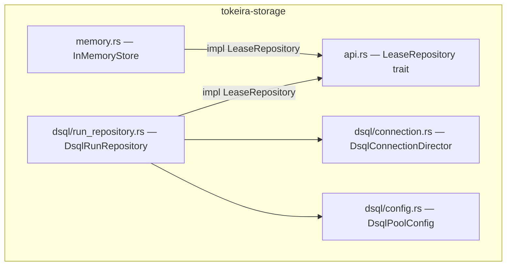
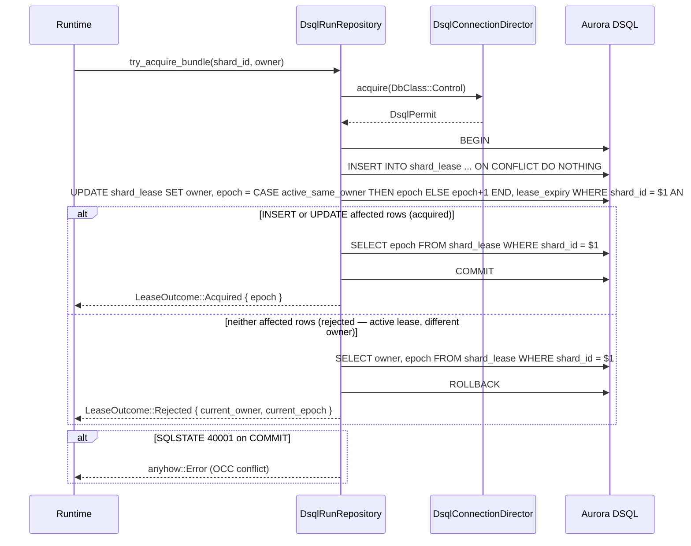
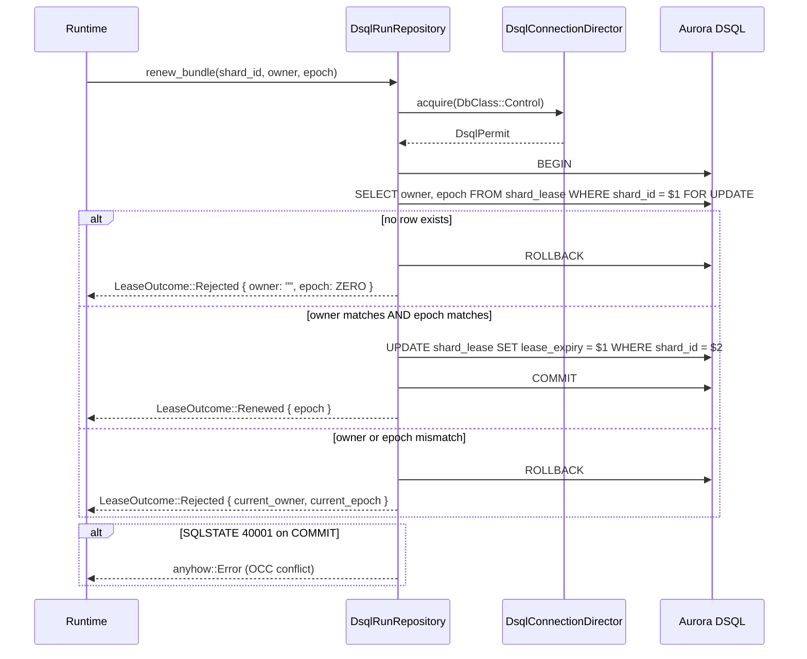
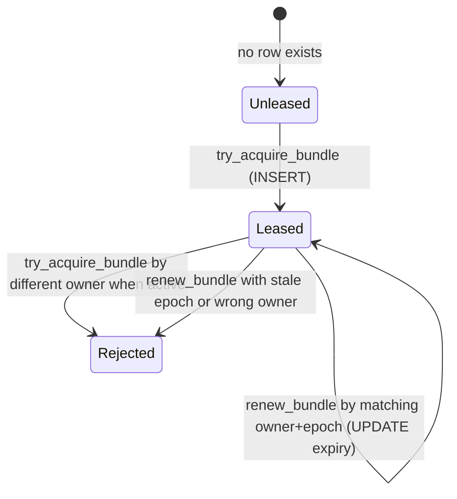

# Design Document: DSQL Shard Lease Management

## Overview

This design covers the `LeaseRepository` implementation for `DsqlRunRepository`, providing `try_acquire_bundle` and `renew_bundle` against the existing `shard_lease` table. This is Feature 4 from the umbrella `dsql-storage-implementation` spec.

The central design principle is **one lease operation = one fenced DSQL transaction**. Both methods acquire a `DbClass::Control` permit and open a transaction. `try_acquire_bundle` uses an atomic `INSERT ... ON CONFLICT DO UPDATE ... WHERE` to handle new-lease, takeover, and rejection in a single statement. `renew_bundle` uses `SELECT ... FOR UPDATE` followed by a conditional `UPDATE`. DSQL's OCC detects concurrent mutations at commit time — conflicts surface as errors without silent retry.

The in-memory `LeaseRepository` in `memory.rs` is the behavioral reference for basic semantics, but the DSQL implementation adds two capabilities the in-memory store omits:

1. **Expiry-based takeover.** The in-memory store always rejects when a lease exists. The DSQL implementation checks `lease_expiry` against the current wall-clock time and allows takeover of expired leases.
2. **Same-owner re-acquire is idempotent.** When the current owner calls `try_acquire_bundle` on a shard it already holds (active), the DSQL implementation refreshes the expiry without incrementing the epoch. This avoids the stale-renewer self-fencing problem — the runtime's existing renewer continues working with the same epoch. For expired same-owner leases, the epoch IS incremented (takeover semantics).

### Key Design Decisions

1. **Implement on `DsqlRunRepository`.** The `LeaseRepository` trait is implemented directly on `DsqlRunRepository` rather than a separate struct. The repository already holds the `DsqlConnectionDirector` (via the `DsqlConnectionAcquirer` trait object) and the `shard_id_to_uuid` helper. A separate struct would duplicate these dependencies for no benefit.

2. **`lease_duration` field on `DsqlRunRepository`.** The lease duration is stored as a `time::Duration` on the repository struct, set at construction time. The `DsqlPoolConfig` gains a `lease_duration` field with a 30-second default. This keeps configuration centralized and avoids threading a duration through every call site.

3. **No internal retry.** OCC conflicts (SQLSTATE 40001) are surfaced as `anyhow::Error` to the caller. The runtime's lease manager decides whether and when to retry. This matches the `commit_transition` pattern from Feature 2.

4. **`FOR UPDATE` on primary key.** DSQL requires `FOR UPDATE` to use an equality predicate on the primary key. Since `shard_id` is the sole PK column of `shard_lease`, the `SELECT ... WHERE shard_id = $1 FOR UPDATE` pattern satisfies this constraint.

5. **Application clock for expiry.** Both the expiry comparison and expiry computation use the same application-side `OffsetDateTime::now_utc()` value, bound as a SQL parameter (`$4` for comparison, `$3` for the new expiry). This avoids mixing SQL `now()` with application-computed values under clock skew.

6. **Epoch stored as `i64` with checked conversions.** `ShardEpoch` is `u64` in Rust but DSQL's `BIGINT` is signed `i64`. Conversions use the existing checked `i64_from_u64` / `u64_from_i64` helpers from `DsqlRunRepository` — the same helpers used by `commit_transition` in Feature 2. No unchecked `as` casts. Values above `i64::MAX` are rejected on write; negative values are rejected on read.

## Architecture

### Module Layout

The new code is added to the existing `tokeira-storage/src/dsql/run_repository.rs`:

```
tokeira-storage/
├── src/
│   ├── api.rs                    # LeaseRepository trait (unchanged)
│   ├── memory.rs                 # InMemoryStore (behavioral reference)
│   ├── dsql/
│   │   ├── mod.rs                # DsqlStore (unchanged)
│   │   ├── run_repository.rs     # DsqlRunRepository + NEW: LeaseRepository impl
│   │   ├── connection.rs         # DsqlConnectionDirector, DsqlPermit
│   │   ├── codec.rs              # Postcard encode/decode helpers
│   │   ├── config.rs             # DsqlPoolConfig + NEW: lease_duration field
│   │   ├── reservoir.rs          # Reservoir channel + refiller
│   │   ├── rate_limiter.rs       # Token-bucket rate limiter
│   │   ├── migration.rs          # MigrationRunner
│   │   └── validation.rs         # DDL validator
│   └── lib.rs
```

### Dependency Flow



### Transaction Flow — `try_acquire_bundle`



### Transaction Flow — `renew_bundle`



## Components and Interfaces

### `DsqlRunRepository` Changes

The repository struct gains a `lease_duration` field:

```rust
pub struct DsqlRunRepository {
    director: Arc<dyn DsqlConnectionAcquirer>,
    shard_count: u32,
    conflict_policy: CurrentExecutionConflictPolicy,
    /// Duration added to now() when computing lease_expiry.
    lease_duration: time::Duration,
}
```

The constructor is updated to accept the lease duration from `DsqlPoolConfig`:

```rust
impl DsqlRunRepository {
    pub fn new(
        director: Arc<DsqlConnectionDirector>,
        shard_count: u32,
        conflict_policy: CurrentExecutionConflictPolicy,
        lease_duration: time::Duration,
    ) -> Result<Self>;
}
```

### `LeaseRepository` Implementation

```rust
#[async_trait]
impl LeaseRepository for DsqlRunRepository {
    #[instrument(name = "dsql.try_acquire_bundle", skip(self), fields(shard_id = bundle.0, owner = %owner))]
    async fn try_acquire_bundle(&self, bundle: ShardId, owner: String) -> Result<LeaseOutcome>;

    #[instrument(name = "dsql.renew_bundle", skip(self), fields(shard_id = bundle.0, owner = %owner, epoch = epoch.0))]
    async fn renew_bundle(
        &self,
        bundle: ShardId,
        owner: String,
        epoch: ShardEpoch,
    ) -> Result<LeaseOutcome>;
}
```

### `try_acquire_bundle` SQL

The method uses a single atomic `INSERT ... ON CONFLICT` statement within a transaction, eliminating the race condition where two first-time acquirers both observe no row and race on INSERT:

```sql
-- Atomic acquire: insert new lease or update existing.
-- Uses two SQL statements in one transaction to handle the three cases:
--
-- 1. No row exists → INSERT succeeds, epoch = 1
-- 2. Row exists, active same owner → UPDATE refreshes expiry, epoch unchanged (idempotent)
-- 3. Row exists, expired same owner → UPDATE increments epoch (takeover)
-- 4. Row exists, expired different owner → UPDATE sets new owner, epoch + 1 (takeover)
-- 5. Row exists, active different owner → no update (0 rows affected, rejected)
--
-- $1 = shard_id UUID, $2 = owner, $3 = new_expiry, $4 = app_now

-- Step 1: Attempt insert for new lease
INSERT INTO shard_lease (shard_id, owner, epoch, lease_expiry)
VALUES ($1, $2, 1, $3)
ON CONFLICT (shard_id) DO NOTHING

-- Step 2: If insert was a no-op (row exists), attempt conditional update
-- Active same owner: refresh expiry, keep epoch (idempotent)
-- Expired same owner: takeover with epoch + 1
-- Expired different owner: takeover with new owner, epoch + 1
-- Active different owner: WHERE clause rejects, 0 rows affected
UPDATE shard_lease
SET owner = $2,
    epoch = CASE
        WHEN owner = $2 AND lease_expiry > $4 THEN epoch
        ELSE epoch + 1
    END,
    lease_expiry = $3
WHERE shard_id = $1
  AND (owner = $2 OR lease_expiry <= $4)
```

After executing both statements, the application reads the result:
- If the INSERT affected 1 row: new lease acquired at epoch 1.
- If the UPDATE affected 1 row: either same-owner refresh (epoch unchanged) or expired takeover (epoch incremented). Read the authoritative epoch with `SELECT epoch FROM shard_lease WHERE shard_id = $1`.
- If neither affected any rows: active lease held by a different owner. Read the current holder with `SELECT owner, epoch FROM shard_lease WHERE shard_id = $1` and return `Rejected`.

Both `$3` (new expiry = `app_now + lease_duration`) and `$4` (comparison = `app_now`) use the same application `OffsetDateTime::now_utc()` captured once at the start of the method. No SQL `now()` is used.

**DSQL validation**: The `INSERT ... ON CONFLICT DO NOTHING` + conditional `UPDATE ... CASE WHEN` pattern has been validated against a live Aurora DSQL cluster. All five cases work correctly: new-lease insert (epoch 1), active same-owner refresh (epoch unchanged), expired same-owner takeover (epoch incremented), expired different-owner takeover (epoch incremented), and active different-owner rejection (0 rows affected, row unchanged).

### `renew_bundle` SQL

```sql
-- Step 1: Lock the row
SELECT owner, epoch
FROM shard_lease
WHERE shard_id = $1
FOR UPDATE
```

If no row: ROLLBACK, return `Rejected { owner: "", epoch: ZERO }`.

If owner and epoch match:

```sql
-- Step 2: Extend expiry
UPDATE shard_lease
SET lease_expiry = $1
WHERE shard_id = $2
```

If owner or epoch mismatch: ROLLBACK, return `Rejected { current_owner, current_epoch }`.

### `DsqlPoolConfig` Changes

```rust
fn default_lease_duration() -> time::Duration {
    time::Duration::seconds(30)
}

pub struct DsqlPoolConfig {
    // ... existing fields ...

    /// Duration for shard lease expiry computation.
    ///
    /// The runtime's renewal interval should be shorter than this value
    /// to prevent unintended lease expiry during normal operation.
    #[serde(default = "default_lease_duration")]
    pub lease_duration: time::Duration,
}
```

The `DsqlPoolConfig::validate()` method gains a check:

```rust
if self.lease_duration <= time::Duration::ZERO {
    bail!("lease_duration must be positive");
}
```

### `DsqlStore` Wiring

The `DsqlStore::from_connector` method passes `config.lease_duration` to `DsqlRunRepository::new`:

```rust
let run_repository = DsqlRunRepository::new(
    Arc::clone(&director),
    config.shard_count,
    config.conflict_policy,
    config.lease_duration,
)?;
```

### OCC Conflict Handling

Both methods use the existing `is_serialization_failure` helper from `DsqlRunRepository`:

```rust
fn is_serialization_failure(err: &sqlx::Error) -> bool {
    matches!(err, sqlx::Error::Database(db_err) if db_err.code().as_deref() == Some("40001"))
}
```

OCC conflicts are surfaced as `anyhow::Error` with context describing the operation. The runtime's lease manager is responsible for retry decisions. This differs from `commit_transition` which maps OCC to `CommitResult::Conflict` — lease operations use the `Result<LeaseOutcome>` return type where `Err` represents infrastructure failures (including OCC) and `Ok(Rejected)` represents application-level rejection.

### Epoch Type Mapping

The `ShardEpoch(u64)` ↔ `BIGINT(i64)` conversion uses the existing checked helpers from `DsqlRunRepository`:

```rust
// Write: ShardEpoch → i64 (checked)
fn epoch_to_sql(epoch: ShardEpoch) -> Result<i64> {
    i64_from_u64(epoch.0, "shard_lease.epoch")
}

// Read: i64 → ShardEpoch (checked)
fn epoch_from_sql(value: i64) -> Result<ShardEpoch> {
    Ok(ShardEpoch(u64_from_i64(value, "shard_lease.epoch")?))
}
```

These use the same `i64_from_u64` / `u64_from_i64` helpers already used by `commit_transition` for `transition_seq`. Negative BIGINT values from the database are rejected with an error. `u64` values above `i64::MAX` are rejected before writing. No unchecked `as` casts.

## Data Models

### Table Usage by Operation

| Operation | Tables Read | Tables Written |
|-----------|------------|----------------|
| `try_acquire_bundle` | `shard_lease` (INSERT ON CONFLICT + optional SELECT) | `shard_lease` (INSERT or UPDATE via ON CONFLICT) |
| `renew_bundle` | `shard_lease` (FOR UPDATE) | `shard_lease` (UPDATE) |

### `shard_lease` Table (Existing — No Changes)

```sql
CREATE TABLE IF NOT EXISTS shard_lease (
    shard_id      UUID        NOT NULL,
    owner         TEXT        NOT NULL,
    epoch         BIGINT      NOT NULL,
    lease_expiry  TIMESTAMPTZ NOT NULL,
    PRIMARY KEY (shard_id)
);
```

No schema changes are required. The table was created by Feature 1 with all columns needed for lease management.

### Write Set Size

Each lease operation touches exactly 1 row in 1 table. This is well within DSQL's 3,000-row mutation limit.

### State Transitions

The `shard_lease` row for a given `shard_id` follows this state machine:



## Correctness Properties

*A property is a characteristic or behavior that should hold true across all valid executions of a system — essentially, a formal statement about what the system should do. Properties serve as the bridge between human-readable specifications and machine-verifiable correctness guarantees.*

The following properties are derived from the acceptance criteria prework analysis. Redundant criteria have been consolidated — for example, expired-lease takeover and same-owner re-acquire both test the same epoch-increment invariant, and owner/epoch mismatch rejections for renewal are combined into a single fidelity property.

### Property 1: Epoch Monotonicity on Acquire

*For any* shard and any sequence of successful `try_acquire_bundle` calls, each `LeaseOutcome::Acquired` SHALL return an epoch exactly 1 greater than the previous durable epoch for takeover (different owner or expired), epoch 1 for new leases, or the same epoch for idempotent same-owner active re-acquire. The epoch SHALL never decrease or skip values.

**Validates: Requirements 1.1, 2.1, 2.2, 3.2**

### Property 2: Active Lease Single-Writer Rejection

*For any* shard with an active (non-expired) lease held by owner A, calling `try_acquire_bundle` with a different owner B SHALL return `LeaseOutcome::Rejected` containing owner A and the current epoch. The durable lease state SHALL remain unchanged.

**Validates: Requirements 3.1**

### Property 3: Renewal Fidelity

*For any* shard with a durable lease, `renew_bundle` SHALL return `LeaseOutcome::Renewed` if and only if both the caller's owner and epoch match the durable values. If either the owner or epoch does not match (or no lease exists), the result SHALL be `LeaseOutcome::Rejected` with the current durable owner and epoch (or empty/ZERO for absent leases).

**Validates: Requirements 5.1, 6.1, 6.2, 7.1**

### Property 4: ShardEpoch Round-Trip

*For any* `ShardEpoch` value in the practical range (1 through `i64::MAX as u64`), converting to `i64` for SQL storage and back to `ShardEpoch` SHALL produce the original value.

**Validates: Requirements 10.2**

## Error Handling

### OCC Conflicts (SQLSTATE 40001)

Both `try_acquire_bundle` and `renew_bundle` surface OCC conflicts as `anyhow::Error` with context. The runtime's lease manager retries at its own cadence. No silent retry inside the repository.

### Connection Acquisition Failures

If `director.acquire(DbClass::Control)` fails (semaphore closed, reservoir empty), the error propagates immediately. The lease operation is not attempted.

### Transaction Failures

If `BEGIN`, `SELECT ... FOR UPDATE`, `INSERT`, `UPDATE`, or `COMMIT` fails for reasons other than OCC (network error, DSQL internal error), the error propagates with `anyhow` context describing the operation and shard.

### Clock Skew

Both the expiry comparison (`lease_expiry <= $app_now`) and the expiry computation (`$app_now + lease_duration`) use the same application-side `OffsetDateTime::now_utc()` value, bound as a SQL parameter. This avoids mixing SQL `now()` with application-computed values. All Tokeira nodes in a cluster use the same clock source (system clock synchronized via NTP). The lease duration (30s default) provides a comfortable margin for typical NTP drift (< 1s).

### Epoch Overflow

Epochs start at 1 and increment by 1. The checked `epoch_to_sql` helper rejects `u64` values above `i64::MAX`, and `epoch_from_sql` rejects negative BIGINT values. At one acquisition per second, reaching `i64::MAX` would take ~292 billion years. The checked conversion is a safety net, not a practical concern.

## Testing Strategy

### Property-Based Tests (proptest)

Property-based tests validate the correctness properties above. Each test runs a minimum of 100 iterations with random inputs. Tests use the existing `DsqlConnectionAcquirer` test seam to mock the connection layer, exercising the lease logic without a live DSQL cluster.

| Property | Test Location | Library |
|----------|--------------|---------|
| P1: Epoch monotonicity on acquire | `tokeira-storage/src/dsql/run_repository.rs` | `proptest` |
| P2: Active lease single-writer rejection | `tokeira-storage/src/dsql/run_repository.rs` | `proptest` |
| P3: Renewal fidelity | `tokeira-storage/src/dsql/run_repository.rs` | `proptest` |
| P4: ShardEpoch round-trip | `tokeira-storage/src/dsql/run_repository.rs` | `proptest` |

**Tag format:** `Feature: dsql-shard-leasing, Property {N}: {title}`

Since the DSQL lease logic involves SQL transactions that require a live database, the property tests for P1–P3 will test the **outcome interpretation logic** extracted into pure helper functions. For acquire, the `interpret_acquire` helper takes the SQL outcome (`insert_rows_affected`, `update_rows_affected`, optional epoch/owner from follow-up SELECT) and returns `LeaseOutcome`. For renewal, the `decide_renew` helper takes the SELECT result and caller arguments and returns the decision. This keeps the property tests fast and deterministic while the integration tests verify the SQL wiring.

### Unit Tests

Unit tests cover specific examples and edge cases:

- **DbClass::Control routing**: Verify both `try_acquire_bundle` and `renew_bundle` acquire `DbClass::Control` permits using the mock acquirer.
- **shard_id_to_uuid binding**: Verify the shard ID is converted to UUID before SQL binding.
- **Lease duration configuration**: Verify `DsqlPoolConfig` accepts and validates `lease_duration`, including the 30-second default and rejection of non-positive values.
- **OCC error propagation**: Verify that SQLSTATE 40001 errors from the database surface as `anyhow::Error` without retry.
- **Renew on absent lease**: Verify `renew_bundle` returns `Rejected { owner: "", epoch: ZERO }` when no row exists.
- **Tracing instrumentation**: Verify span fields include shard_id, owner, and epoch (for renew).

### Integration Tests

Integration tests (gated behind `dsql-integration` feature) verify the SQL against a live DSQL cluster:

- **Acquire → renew → acquire cycle**: Acquire a lease, renew it, let it expire, acquire from a different owner.
- **Concurrent acquire**: Two tasks attempt `try_acquire_bundle` for the same shard simultaneously — exactly one gets `Acquired`, the other gets either an OCC error (SQLSTATE 40001) or `LeaseOutcome::Rejected`. The durable row is verified afterward to have the winning owner and correct epoch.
- **Epoch fence integration**: Acquire a lease as owner A, let it expire, acquire as owner B (expired takeover — epoch increments). `commit_transition` with owner A's old epoch should get `CommitResult::Conflict`; with owner B's new epoch should pass.
- **Active same-owner reacquire**: Acquire as owner A, immediately re-acquire as owner A. Verify epoch is unchanged. Renew with the original epoch — should succeed.
