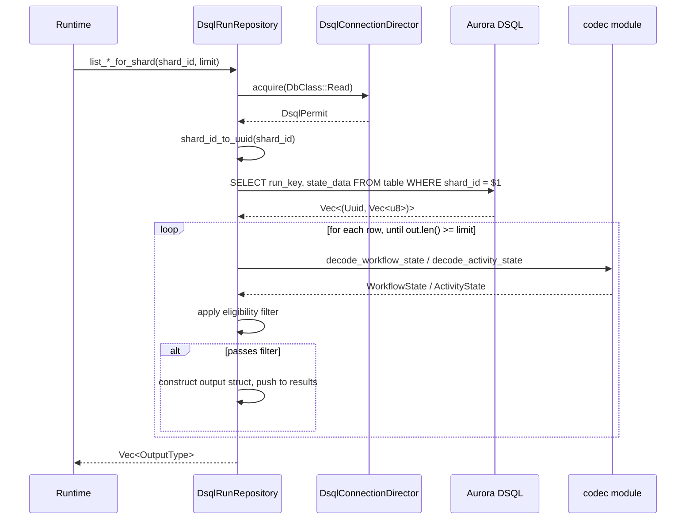

# Design Document: DSQL Side Tables — Read-Only Query Methods

## Overview

This design covers the 10 read-only query methods on `DsqlRunRepository` that replace the current `bail!("Feature 3: dsql-side-tables")` stubs, plus a new `activity_dispatch` table with its write-path integration and a runtime guard against duplicate activity starts.

Most methods share a common pattern:

1. Acquire a `DbClass::Read` connection (no transactions, no writes)
2. Execute a single SQL query filtered by shard, queue, or time range
3. For `workflow_hot` and `activity_state`: deserialize the `state_data` BYTEA column via the codec module
4. Apply application-level filters on the deserialized state (dispatch eligibility, timeout presence, etc.)
5. Collect up to `limit` results

The exception is `list_due_timers`, which is implemented as shard fanout (one `list_due_timers_for_shard` call per shard) because `timer_bucket` has no standalone `fire_at` index.

The central design challenge is that most return types require fields only available inside the postcard-serialized `state_data` column. The schema does not store these fields as separate indexed columns (except `queue_namespace`, `queue_name`, `shard_id`). This means SQL narrows the candidate set, but the final filter happens in application code after deserialization. This mirrors the in-memory store's approach (iterate HashMap, filter, collect) — the DSQL version just does the first filter in SQL.

### Key Design Decisions

1. **No SQL LIMIT on workflow_hot queries.** When application-level filtering is needed (dispatch eligibility, timeout presence), the SQL query cannot know how many rows to fetch. The application deserializes rows one at a time and stops at `limit`. For `activity_state` shard sweeps where all rows are returned, SQL LIMIT is safe.

2. **Sticky affinity clearing is read-side only.** The `clear_expired_sticky_if_needed` logic from the in-memory store is applied during result construction, not as a write-back. The deserialized `WorkflowState` is not mutated in storage — expired sticky affinities are simply omitted from the output `DispatchableWorkflowTask`.

3. **Queue-filtered workflow dispatch scans by namespace_id.** `workflow_hot` has no index on task queue — it stores the task queue inside `state_data`. The query filters by `namespace_id` using a new `idx_workflow_hot_namespace` async index (added by this spec as `V024`), and the application filters by task queue match after deserialization. This is the least efficient query pattern but matches the in-memory store's O(N-per-namespace) characteristic.

4. **Timer queries need no deserialization.** `timer_bucket` stores `run_key` and `timer_id` as columns, so `DueTimer` can be populated directly from the SQL result without touching `timer_data`.

5. **Global `list_due_timers` implemented as shard fanout.** `timer_bucket` is keyed by `(shard_id, fire_at, ...)` with no standalone `fire_at` index. A bare `WHERE fire_at <= $1` cannot use any index. Instead, the implementation iterates all shard UUIDs (0..shard_count) and issues one `list_due_timers_for_shard` call per shard, collecting results until `limit` is reached. This reuses the efficient PK-prefix scan and avoids adding a global `fire_at` index that would be redundant with the shard-scoped path used by production sweeps.

6. **All methods use `tracing::instrument` with `dsql.` prefix.** Consistent with the naming convention established by Feature 2.

## Architecture

### Module Layout

All new code is added to the existing `tokeira-storage/src/dsql/run_repository.rs` file. No new files or modules are needed.

```
tokeira-storage/
├── src/
│   ├── api.rs                    # RunRepository trait (unchanged)
│   ├── memory.rs                 # InMemoryStore (behavioral reference, unchanged)
│   ├── dsql/
│   │   ├── mod.rs                # DsqlStore + module declarations (unchanged)
│   │   ├── run_repository.rs     # MODIFIED: replace 10 stubs with implementations
│   │   ├── connection.rs         # DsqlConnectionDirector (unchanged)
│   │   ├── codec.rs              # Postcard encode/decode helpers (unchanged)
│   │   └── ...
│   └── lib.rs
```

### Query Pattern Classification

```mermaid
graph TD
    subgraph "Pattern A: Shard-filtered workflow_hot"
        A1[list_dispatchable_workflow_tasks_for_shard]
        A2[list_runs_with_workflow_timeouts_for_shard]
        A3[list_started_workflow_tasks_for_shard]
        A4[list_pending_nexus_operations_for_shard]
    end

    subgraph "Pattern B: Activity queries"
        B1[list_dispatchable_activity_tasks_for_shard] --> AD[activity_dispatch]
        B2[list_open_activities_for_shard] --> AS[activity_state]
    end

    subgraph "Pattern C: Queue-filtered scan"
        C1[list_dispatchable_workflow_tasks]
        C2[list_dispatchable_activity_tasks]
    end

    subgraph "Pattern D: Timer range scan"
        D1[list_due_timers]
        D2[list_due_timers_for_shard]
    end

    A1 --> WH[workflow_hot]
    A2 --> WH
    A3 --> WH
    A4 --> WH
    C1 --> WH
    C2 --> AD
    D1 --> TB[timer_bucket]
    D2 --> TB
```



### Data Flow for Deserialize-then-Filter Methods



## Components and Interfaces

### Method Implementations

Each stub is replaced with a concrete implementation following the patterns below. All methods are annotated with `#[instrument]` and acquire `DbClass::Read` connections.

#### Pattern A: Shard-Filtered `workflow_hot` Scan

Used by 4 methods that query `workflow_hot` by `shard_id`, deserialize `state_data`, and apply different application-level filters.

**SQL:**
```sql
SELECT run_key, state_data FROM workflow_hot WHERE shard_id = $1
```

No SQL LIMIT — the application filters after deserialization and stops at `limit`.

**`list_dispatchable_workflow_tasks_for_shard`** — Filter: `pending_workflow_task.is_some() && started_event_id.is_none()`. Populates sticky affinity with expiry clearing.

**`list_runs_with_workflow_timeouts_for_shard`** — Filter: `status.is_open() && (workflow_execution_timeout.is_some() || workflow_run_timeout.is_some())`.

**`list_started_workflow_tasks_for_shard`** — Filter: `pending_workflow_task` present with both `started_event_id.is_some()` and `started_at.is_some()`.

**`list_pending_nexus_operations_for_shard`** — Filter: `status.is_open()`, then iterate `pending_nexus_operations` and include only those with `schedule_to_close_timeout.is_some()`. Note: the `limit` applies to the total number of `NexusSweepEntry` results, not the number of workflow rows scanned.

#### Pattern B: Activity Queries — Dispatch from `activity_dispatch`, Sweep from `activity_state`

Activity dispatch and sweep use different tables:

**Dispatch queries** (`list_dispatchable_activity_tasks_for_shard`, `list_dispatchable_activity_tasks`) read from `activity_dispatch` — a dedicated table storing one row per dispatchable activity. Queue identity and scheduling fields are stored directly; `input_data` is decoded as postcard-encoded `Payloads` via `codec::decode_payloads`. Rows are inserted or refreshed by `DispatchOp::EnqueueActivityTask`, removed on activity start, individual activity pause, workflow pause, and `ActivityOp::Delete`, and updated in place when a still-dispatchable `ActivityOp::Upsert` changes queue identity, attempt, or input.

**Shard-filtered dispatch SQL:**
```sql
SELECT run_key, activity_id, queue_namespace, queue_name, task_kind,
       deployment, build_id, schedule_event_id, attempt, input_data
FROM activity_dispatch WHERE shard_id = $1 LIMIT $2
```

**Queue-filtered dispatch SQL:**
```sql
SELECT run_key, activity_id, queue_namespace, queue_name, task_kind,
       deployment, build_id, schedule_event_id, attempt, input_data
FROM activity_dispatch
WHERE queue_namespace = $1 AND queue_name = $2 AND task_kind = $3
  AND deployment IS NOT DISTINCT FROM $4 AND build_id IS NOT DISTINCT FROM $5
LIMIT $6
```

**Sweep query** (`list_open_activities_for_shard`) reads from `activity_state` — the materialized open-activity table. Deserializes `state_data` to extract timeout and scheduling fields.

**Sweep SQL:**
```sql
SELECT run_key, queue_namespace, state_data FROM activity_state WHERE shard_id = $1 LIMIT $2
```

#### Pattern C: Queue-Filtered Scan

Used by 2 methods that filter by queue identity.

**`list_dispatchable_workflow_tasks`:**

```sql
SELECT run_key, state_data FROM workflow_hot WHERE namespace_id = $1
```

Application filters by: (1) `task_queue` matches `queue.task_queue`, (2) `pending_workflow_task.is_some()`, (3) `started_event_id.is_none()`. Populates sticky affinity with expiry clearing. This is the least efficient query — it scans all runs for a namespace. The in-memory store has the same O(N) characteristic.

The queue is constructed with `task_kind = Workflow` and `deployment = None`, `build_id = None`, matching the in-memory store behavior.

**`list_dispatchable_activity_tasks`:**

Reads from `activity_dispatch` with full `QueueKey` filter in SQL (see Pattern B above). SQL LIMIT is safe because all rows in `activity_dispatch` are dispatchable by definition and the full queue identity is indexed.

#### Pattern D: Timer Range Scan

Used by 2 methods that query `timer_bucket` by deadline. No deserialization needed.

**`list_due_timers`:**

Implemented as shard fanout — iterates `0..shard_count`, calling the shard-filtered path for each shard, collecting results until `limit` is reached. No standalone SQL query. This avoids an unindexed `fire_at` scan on `timer_bucket` whose PK is `(shard_id, fire_at, ...)`.

**`list_due_timers_for_shard`:**

```sql
SELECT run_key, timer_id FROM timer_bucket
WHERE shard_id = $1 AND fire_at <= $2 LIMIT $3
```

Uses the `(shard_id, fire_at)` index (`idx_timer_bucket_shard_fire`) for efficient range scans. The PK `(shard_id, fire_at, run_key, timer_id)` also supports this as a prefix scan.

### Sticky Affinity Handling

`list_dispatchable_workflow_tasks` and `list_dispatchable_workflow_tasks_for_shard` must handle sticky affinity consistently with the in-memory store's `clear_expired_sticky_if_needed`:

```rust
fn sticky_fields(
    state: &WorkflowState,
    now: OffsetDateTime,
) -> (Option<WorkerIdentity>, Option<OffsetDateTime>) {
    match &state.sticky {
        Some(sticky) if sticky.expires_at > now => (
            Some(sticky.worker_identity.clone()),
            Some(sticky.expires_at),
        ),
        _ => (None, None),
    }
}
```

This is a read-side transformation — the stored `WorkflowState` is not modified. If `sticky.expires_at <= now`, the output fields are `None`.

### Namespace ID for Activity Dispatch

The `activity_state` table stores `queue_namespace` as a column (UUID), but the `DispatchableActivityTask` needs a full `QueueKey` with `namespace_id`. The `queue_namespace` column IS the `namespace_id` — it was written by `upsert_activity` in `commit_transition` using `namespace_id.0`. The query reads it back and wraps it in `NamespaceId`.

### Error Context on Deserialization Failure

When `codec::decode_workflow_state` or `codec::decode_activity_state` fails, the error is wrapped with context identifying the table and row key:

```rust
codec::decode_workflow_state(&state_data)
    .with_context(|| format!("workflow_hot row {run_key}"))?;

codec::decode_activity_state(&state_data)
    .with_context(|| format!("activity_state row run_key={run_key}"))?;
```

### Index Usage Summary

| Method | Table | SQL Filter | Index Used |
|--------|-------|-----------|------------|
| `list_dispatchable_workflow_tasks` | `workflow_hot` | `namespace_id = $1` | `idx_workflow_hot_namespace` (V024) |
| `list_dispatchable_activity_tasks` | `activity_dispatch` | `queue_namespace = $1 AND queue_name = $2 AND task_kind = $3 AND deployment IS NOT DISTINCT FROM $4 AND build_id IS NOT DISTINCT FROM $5` | `idx_activity_dispatch_queue` |
| `list_due_timers` | `timer_bucket` | shard fanout → `shard_id = $s AND fire_at <= $now` per shard | PK prefix / `idx_timer_bucket_shard_fire` |
| `list_dispatchable_workflow_tasks_for_shard` | `workflow_hot` | `shard_id = $1` | `idx_workflow_hot_shard` |
| `list_dispatchable_activity_tasks_for_shard` | `activity_dispatch` | `shard_id = $1` | `idx_activity_dispatch_shard` |
| `list_due_timers_for_shard` | `timer_bucket` | `shard_id = $1 AND fire_at <= $2` | PK prefix / `idx_timer_bucket_shard_fire` |
| `list_runs_with_workflow_timeouts_for_shard` | `workflow_hot` | `shard_id = $1` | `idx_workflow_hot_shard` |
| `list_started_workflow_tasks_for_shard` | `workflow_hot` | `shard_id = $1` | `idx_workflow_hot_shard` |
| `list_open_activities_for_shard` | `activity_state` | `shard_id = $1` | `idx_activity_state_shard` |
| `list_pending_nexus_operations_for_shard` | `workflow_hot` | `shard_id = $1` | `idx_workflow_hot_shard` |

## Data Models

### Table Usage by Operation

All 10 methods are read-only. No tables are written.

| Method | Table Read | Columns Used |
|--------|-----------|-------------|
| `list_dispatchable_workflow_tasks` | `workflow_hot` | `run_key`, `state_data` |
| `list_dispatchable_activity_tasks` | `activity_dispatch` | `run_key`, `activity_id`, `queue_namespace`, `queue_name`, `task_kind`, `deployment`, `build_id`, `schedule_event_id`, `attempt`, `input_data` |
| `list_due_timers` | `timer_bucket` | (shard fanout) `run_key`, `timer_id` |
| `list_dispatchable_workflow_tasks_for_shard` | `workflow_hot` | `run_key`, `state_data` |
| `list_dispatchable_activity_tasks_for_shard` | `activity_dispatch` | `run_key`, `activity_id`, `queue_namespace`, `queue_name`, `task_kind`, `deployment`, `build_id`, `schedule_event_id`, `attempt`, `input_data` |
| `list_due_timers_for_shard` | `timer_bucket` | `run_key`, `timer_id` |
| `list_runs_with_workflow_timeouts_for_shard` | `workflow_hot` | `run_key`, `state_data` |
| `list_started_workflow_tasks_for_shard` | `workflow_hot` | `run_key`, `state_data` |
| `list_open_activities_for_shard` | `activity_state` | `run_key`, `queue_namespace`, `state_data` |
| `list_pending_nexus_operations_for_shard` | `workflow_hot` | `run_key`, `state_data` |

### Deserialization Map

| Table | Column | Codec Function | Rust Type | Methods |
|-------|--------|---------------|-----------|---------|
| `workflow_hot` | `state_data` | `decode_workflow_state` | `WorkflowState` | 6 methods (all except timers and activity dispatch) |
| `activity_state` | `state_data` | `decode_activity_state` | `ActivityState` | 1 method (`list_open_activities_for_shard` only) |
| `activity_dispatch` | `input_data` | `decode_payloads` | `Payloads` | 2 methods (activity dispatch — queue/scheduling fields are columns) |
| `timer_bucket` | — | none needed | — | 2 methods (timer queries use columns directly) |

### Application Filter Map

| Method | Filter Applied After Deserialization |
|--------|-------------------------------------|
| `list_dispatchable_workflow_tasks` | `task_queue` matches queue + `pending_workflow_task.is_some()` + `started_event_id.is_none()` |
| `list_dispatchable_workflow_tasks_for_shard` | `pending_workflow_task.is_some()` + `started_event_id.is_none()` |
| `list_dispatchable_activity_tasks` | Full `QueueKey` match in SQL (activity_dispatch has all queue columns indexed) |
| `list_dispatchable_activity_tasks_for_shard` | None (all activity_dispatch rows for shard are dispatchable by definition) |
| `list_due_timers` | None (SQL handles `fire_at <= now`) |
| `list_due_timers_for_shard` | None (SQL handles shard + `fire_at <= now`) |
| `list_runs_with_workflow_timeouts_for_shard` | `status.is_open()` + `(workflow_execution_timeout.is_some() \|\| workflow_run_timeout.is_some())` |
| `list_started_workflow_tasks_for_shard` | `pending_workflow_task` with `started_event_id.is_some()` + `started_at.is_some()` |
| `list_open_activities_for_shard` | None (activity_state only has open activities) |
| `list_pending_nexus_operations_for_shard` | `status.is_open()` + `schedule_to_close_timeout.is_some()` per operation |

### Schema Changes

This spec adds:

- **`activity_dispatch` table** — one row per dispatchable activity task, keyed by spread UUID. Written by `DispatchOp::EnqueueActivityTask`, removed on activity start, individual activity pause, workflow pause, and `ActivityOp::Delete`, and updated in place for still-dispatchable `ActivityOp::Upsert` changes.

```sql
CREATE TABLE IF NOT EXISTS activity_dispatch (
    key               UUID        NOT NULL,
    run_key           UUID        NOT NULL,
    activity_id       TEXT        NOT NULL,
    shard_id          UUID        NOT NULL,
    queue_namespace   UUID        NOT NULL,
    queue_name        TEXT        NOT NULL,
    task_kind         SMALLINT    NOT NULL,
    deployment        TEXT,
    build_id          TEXT,
    schedule_event_id BIGINT      NOT NULL,
    attempt           INTEGER     NOT NULL,
    input_data        BYTEA       NOT NULL,
    created_at        TIMESTAMPTZ NOT NULL DEFAULT now(),
    PRIMARY KEY (key)
);
```

- **V024**: `CREATE INDEX ASYNC idx_workflow_hot_namespace ON workflow_hot (namespace_id);`
- **V025**: `activity_dispatch` table DDL (above)
- **V026**: `CREATE INDEX ASYNC idx_activity_dispatch_shard ON activity_dispatch (shard_id);`
- **V027**: `CREATE INDEX ASYNC idx_activity_dispatch_queue ON activity_dispatch (queue_namespace, queue_name, task_kind, deployment, build_id);`
- **V028**: `CREATE INDEX ASYNC idx_activity_dispatch_run_key ON activity_dispatch (run_key);` — needed for bulk delete on workflow pause (`DELETE FROM activity_dispatch WHERE run_key = $1`)

No existing tables or columns are modified.

## Correctness Properties

*A property is a characteristic or behavior that should hold true across all valid executions of a system — essentially, a formal statement about what the system should do. Properties serve as the bridge between human-readable specifications and machine-verifiable correctness guarantees.*

The following properties are derived from the acceptance criteria prework analysis. Redundant criteria have been consolidated — for example, the limit invariant applies to all 10 methods and is expressed as a single property, and shard-filtered vs queue-filtered variants of the same filter logic are combined.

### Property 1: Workflow Dispatch Eligibility Filter

*For any* set of `WorkflowState` values and any `QueueKey`, the workflow dispatch methods SHALL return only runs where `pending_workflow_task` is present AND `pending_workflow_task.started_event_id` is `None`, with `queue.task_kind` set to `Workflow` and `deployment` and `build_id` set to `None`. For queue-filtered dispatch, only runs whose `namespace_id` and `task_queue` match the given `QueueKey` SHALL be included.

**Validates: Requirements 1.1, 1.2, 1.5, 4.1**

### Property 2: Sticky Affinity Expiry Clearing

*For any* `WorkflowState` with a `sticky` field, if `sticky.expires_at > now`, the output `DispatchableWorkflowTask` SHALL have `sticky_preferred` and `sticky_expires_at` populated from the sticky affinity. If `sticky.expires_at <= now`, both fields SHALL be `None`.

**Validates: Requirements 1.6, 4.5**

### Property 3: Activity Dispatch Field Fidelity

*For any* row in the `activity_dispatch` table, the activity dispatch methods SHALL return it as a `DispatchableActivityTask` with `run_key`, `activity_id`, `input`, `schedule_event_id`, and `attempt` matching the stored row values, with `queue` constructed from the stored queue columns and `task_kind` set to `Activity`. For queue-filtered dispatch, only rows whose full `QueueKey` matches the given key SHALL be included. Started, paused, and resolved activities SHALL NOT appear in `activity_dispatch` because they are removed by the write path.

**Validates: Requirements 2.1, 2.2, 2.5, 5.1, 5.5**

### Property 4: Timer Deadline Filter

*For any* set of timers with varying `fire_at` values and a given `now` timestamp, the timer query methods SHALL return only timers where `fire_at <= now`, with `DueTimer.run_key` and `DueTimer.timer_id` matching the stored row values.

**Validates: Requirements 3.1, 3.4, 6.1, 6.6**

### Property 5: Result Limit Invariant

*For any* call to any of the 10 methods with a given `limit`, the number of returned results SHALL be at most `limit`.

**Validates: Requirements 1.3, 2.3, 3.2, 4.3, 5.3, 6.4, 7.3, 8.3, 9.3, 10.5**

### Property 6: Workflow Timeout Sweep Filter and Field Mapping

*For any* set of `WorkflowState` values in a shard, `list_runs_with_workflow_timeouts_for_shard` SHALL return only runs where `status.is_open()` is true AND at least one of `workflow_execution_timeout` or `workflow_run_timeout` is `Some`. The output `WorkflowTimeoutSweepEntry` fields SHALL match the deserialized `WorkflowState` fields.

**Validates: Requirements 7.1, 7.5**

### Property 7: Started WFT Sweep Filter and Field Mapping

*For any* set of `WorkflowState` values in a shard, `list_started_workflow_tasks_for_shard` SHALL return only runs where `pending_workflow_task` is present with both `started_event_id` and `started_at` being `Some`. The output `WftTimeoutSweepEntry` fields SHALL match the deserialized state.

**Validates: Requirements 8.1, 8.5**

### Property 8: Activity Sweep Field Mapping

*For any* `ActivityState` deserialized from `activity_state.state_data`, the output `ActivitySweepEntry` SHALL have `run_key`, `activity_id`, `schedule_event_id`, `attempt`, `original_scheduled_at`, `started_at`, and all four timeout fields matching the deserialized state.

**Validates: Requirements 9.1, 9.5**

### Property 9: Nexus Operation Sweep Filter and Field Mapping

*For any* set of `WorkflowState` values in a shard, `list_pending_nexus_operations_for_shard` SHALL return `NexusSweepEntry` values only from runs where `status.is_open()` is true, and only for `PendingNexusOperation` entries where `schedule_to_close_timeout` is `Some`. The output fields SHALL match the deserialized operation.

**Validates: Requirements 10.1, 10.2, 10.3, 10.7**

## Error Handling

### Deserialization Failures

If `codec::decode_workflow_state` or `codec::decode_activity_state` fails for any row, the method returns an `anyhow::Error` with context identifying the table and row key. The error propagates to the caller — no partial results are returned.

This is the correct behavior because deserialization failure indicates data corruption or a codec version mismatch, which should be surfaced immediately rather than silently skipped.

### Connection Acquisition Failures

If `director.acquire(DbClass::Read)` fails (pool exhausted, connection error), the error propagates directly. No retry logic — the runtime handles retries at a higher level.

### SQL Query Failures

SQL errors (network, timeout, DSQL internal) propagate as `anyhow::Error` via `sqlx`. Since these are read-only queries outside transactions, there is no rollback needed.

### Empty Results

All methods return an empty `Vec` when no matching rows are found. This is not an error condition.

### Zero Limit

When `limit == 0`, methods return an empty `Vec` immediately without executing a query. This matches the in-memory store behavior and avoids unnecessary database round-trips.

## Testing Strategy

### Property-Based Tests (proptest)

Property-based tests validate the correctness properties above. Each test runs a minimum of 100 iterations with random inputs. Tests exercise the filter and field-mapping logic by constructing `WorkflowState` / `ActivityState` values with randomized fields and verifying the output matches expectations.

Since these methods require a live DSQL connection for full integration testing, the property tests focus on the application-level filter and field-mapping logic extracted into testable helper functions. The SQL query correctness is verified by integration tests.

| Property | Test Location | Library |
|----------|--------------|---------|
| P1: Workflow dispatch eligibility | `tokeira-storage/src/dsql/run_repository.rs` | `proptest` |
| P2: Sticky affinity expiry clearing | `tokeira-storage/src/dsql/run_repository.rs` | `proptest` |
| P3: Activity dispatch field fidelity | `tokeira-storage/src/dsql/run_repository.rs` | `proptest` |
| P4: Timer deadline filter | `tokeira-storage/src/dsql/run_repository.rs` | `proptest` |
| P5: Result limit invariant | `tokeira-storage/src/dsql/run_repository.rs` | `proptest` |
| P6: Workflow timeout sweep filter | `tokeira-storage/src/dsql/run_repository.rs` | `proptest` |
| P7: Started WFT sweep filter | `tokeira-storage/src/dsql/run_repository.rs` | `proptest` |
| P8: Activity sweep field mapping | `tokeira-storage/src/dsql/run_repository.rs` | `proptest` |
| P9: Nexus operation sweep filter | `tokeira-storage/src/dsql/run_repository.rs` | `proptest` |

**Tag format:** `Feature: dsql-side-tables, Property {N}: {title}`

### Unit Tests

Unit tests cover specific examples and edge cases:

- **Empty shard**: Query a shard with no rows — returns empty Vec.
- **All rows filtered out**: Shard has rows but none pass the application filter — returns empty Vec.
- **Limit of 1**: Verify exactly 1 result is returned when multiple candidates exist.
- **Deserialization error context**: Pass invalid BYTEA data and verify the error message includes table and row key.
- **Zero limit**: Verify immediate empty return without database query.
- **Nexus limit spans multiple runs**: Verify the limit applies to total NexusSweepEntry count, not workflow row count.
- **Expired sticky affinity**: Verify sticky fields are None when expires_at <= now.
- **Non-expired sticky affinity**: Verify sticky fields are populated when expires_at > now.
- **Queue mismatch filtering**: Verify activity dispatch excludes activities with matching (namespace, queue_name) but different (deployment, build_id).

### Integration Tests

Integration tests (gated behind `dsql-integration` feature) verify the full SQL round-trip against a live DSQL cluster:

- **Commit-then-query round trip**: Use `commit_transition` to write a run with activities, timers, and workflow state, then verify each of the 10 query methods returns the expected results.
- **Shard isolation**: Write runs to different shards and verify shard-filtered queries only return rows from the target shard.
- **Timer deadline ordering**: Write timers with different `fire_at` values and verify `list_due_timers` returns only those at or before `now`.
- **Queue filtering**: Write activities to different queues and verify queue-filtered queries return only matching activities.

### Dual Testing Approach

- **Unit tests** verify specific examples, edge cases, and error conditions.
- **Property tests** verify universal properties across randomized inputs (filter correctness, field mapping fidelity, limit invariant).
- **Integration tests** verify the SQL queries work correctly against a live DSQL cluster.

Property tests use `proptest` with a minimum of 100 iterations per property. Each property test references its design document property with the tag format: `Feature: dsql-side-tables, Property {N}: {title}`.
