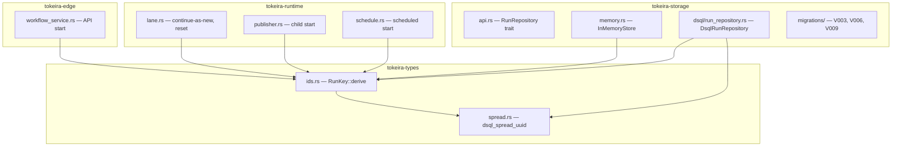
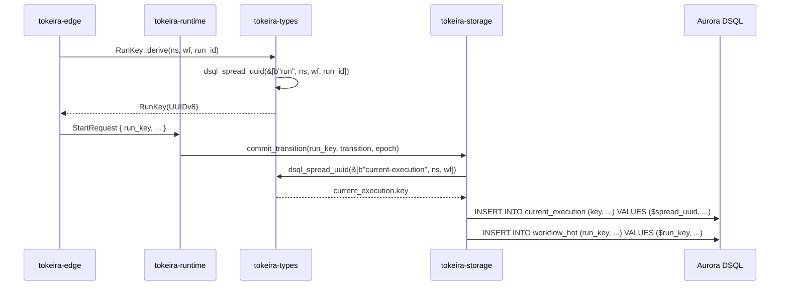

# Design Document: DSQL Spread Keys

## Overview

This design introduces hash-derived UUIDv8 primary keys to eliminate hot-key concentration in Tokeira's DSQL tables. DSQL distributes data by hashing the leading primary key column. When that column has low cardinality (e.g., `partition_id` in `dispatch_backlog`) or is namespace-prefixed (e.g., `namespace_id` in `current_execution`), all writes for a single tenant cluster on the same storage partition.

The solution has four parts:

1. **`dsql_spread_uuid`** — a general-purpose utility in `tokeira-types` that deterministically derives a uniformly-distributed UUIDv8 from arbitrary logical inputs using BLAKE3.
2. **Replace `shard_id_to_uuid`** — the existing SHA-256 based shard UUID derivation in `DsqlRunRepository` is replaced with `dsql_spread_uuid`.
3. **Schema revision** — `current_execution` and `request_dedupe` get a spread UUID sole primary key, with the original logical key preserved as a unique async index. `dispatch_backlog` gets a spread UUID PK with a non-unique async index for the FIFO drain path.
4. **`RunKey` as derived key** — `RunKey::derive(namespace_id, workflow_id, run_id)` replaces `RunKey::new()` (random v4), eliminating lookup-table queries when the run identity triple is known.

### Key Design Decisions

1. **`dsql_spread_uuid` lives in `tokeira-types`, not `tokeira-storage`.** `RunKey::derive` is called from the kernel replay context, runtime lane processing, edge request handling, and storage. Placing the function in `tokeira-types` avoids a circular dependency and keeps the function available to all layers without feature gates.

2. **BLAKE3 over SHA-256.** BLAKE3 is faster on ARM/Graviton (the target deployment platform), has excellent avalanche properties, and supports domain separation natively. The `blake3` crate is well-maintained and adds ~50KB to the binary.

3. **UUIDv8 (RFC 9562) format.** Version 8 is the application-defined UUID variant. Using it signals to anyone inspecting the database that these are not random UUIDs (v4) or time-based UUIDs (v7). The 6 bits consumed by version/variant leave 122 bits of hash entropy — more than sufficient for collision resistance.

4. **Domain separation and length-prefixing.** The fixed prefix `"tokeira/dsql-key/v1\0"` prevents cross-use collisions with other BLAKE3 consumers. Length-prefixing each part as a big-endian `u64` before the part data ensures `["ab", "c"]` and `["a", "bc"]` produce different hashes, even though the concatenated bytes are identical.

5. **In-place DDL updates, no migrations.** Tokeira targets schema version 1 — there is no production data to migrate. The existing `V003`, `V006`, and `V009` migration files are updated in-place with the revised table definitions.

6. **`timer_bucket` excluded.** Its `(shard_id, fire_at, run_key, timer_id)` PK is designed for shard-filtered time-range sweep queries. Adding a spread UUID leading column would break sweep efficiency. The `shard_id` column already uses a hash-derived UUID (via `shard_id_to_uuid`), which provides adequate distribution.

7. **`RunKey::new()` removed from production.** All production code paths that create a `RunKey` must use `RunKey::derive`. The random constructor is retained behind `#[cfg(any(test, feature = "test-support"))]` so that downstream crate tests can access it via the `test-support` feature on `tokeira-types`. Plain `#[cfg(test)]` would only work within `tokeira-types` itself.

8. **`materialize_reset_successor` trait signature changes.** The `successor_run_key` parameter is removed. The repository derives it internally from the base run's `(namespace_id, workflow_id)` and the provided `successor_run_id`. This eliminates the possibility of callers passing an inconsistent key.

## Architecture

### Module Layout

Changes span three crates:

```
tokeira-types/
├── src/
│   ├── ids.rs              # RunKey::derive, RunKey::new() → #[cfg(any(test, feature = "test-support"))]
│   ├── spread.rs           # NEW: dsql_spread_uuid function
│   └── lib.rs              # pub mod spread; pub use spread::*;
├── Cargo.toml              # + blake3 = "1"

tokeira-storage/
├── src/
│   ├── api.rs              # materialize_reset_successor signature change
│   ├── memory.rs           # Updated InMemoryStore impl
│   └── dsql/
│       └── run_repository.rs  # shard_id_to_uuid → dsql_spread_uuid,
│                              # spread UUID PK computation for 3 tables,
│                              # resolve_execution optimization
├── migrations/
│   ├── V003__current_execution.sql   # Revised DDL
│   ├── V006__request_dedupe.sql      # Revised DDL
│   └── V009__dispatch_backlog.sql    # Revised DDL
├── Cargo.toml              # sha2 retained (migration checksums)

tokeira-runtime/
├── src/
│   ├── lane.rs             # RunKey::derive for continue-as-new, reset
│   ├── publisher.rs        # RunKey::derive for child workflow start
│   └── schedule.rs         # RunKey::derive for scheduled starts

tokeira-edge/
├── src/
│   └── workflow_service.rs # RunKey::derive for API-initiated starts
```

### Dependency Flow



### Spread UUID Data Flow



## Components and Interfaces

### `dsql_spread_uuid` Function

Lives in `tokeira-types/src/spread.rs`:

```rust
use uuid::Uuid;

/// Derive a deterministic, uniformly-distributed UUIDv8 from arbitrary
/// logical key parts using BLAKE3.
///
/// The output is suitable as a DSQL primary key — the hash spreads
/// writes across the UUID keyspace regardless of input structure.
///
/// Domain separation (`"tokeira/dsql-key/v1\0"`) prevents collisions
/// with other BLAKE3 uses. Length-prefixing each part ensures
/// `["ab", "c"]` and `["a", "bc"]` produce different UUIDs.
pub fn dsql_spread_uuid(parts: &[&[u8]]) -> Uuid {
    let mut hasher = blake3::Hasher::new();
    hasher.update(b"tokeira/dsql-key/v1\0");
    for part in parts {
        hasher.update(&(part.len() as u64).to_be_bytes());
        hasher.update(part);
    }
    let hash = hasher.finalize();
    let mut bytes = [0u8; 16];
    bytes.copy_from_slice(&hash.as_bytes()[..16]);
    // UUIDv8: version bits [48..51] = 0b1000
    bytes[6] = (bytes[6] & 0x0f) | 0x80;
    // RFC 9562 variant: bits [64..65] = 0b10
    bytes[8] = (bytes[8] & 0x3f) | 0x80;
    Uuid::from_bytes(bytes)
}
```

### `RunKey::derive`

Added to `tokeira-types/src/ids.rs`:

```rust
impl RunKey {
    /// Derive a deterministic run key from the logical identity triple.
    ///
    /// This replaces `RunKey::new()` for all production code paths.
    /// The derived key is a UUIDv8 that spreads uniformly across the
    /// UUID keyspace, suitable as a DSQL primary key.
    pub fn derive(namespace_id: NamespaceId, workflow_id: &WorkflowId, run_id: RunId) -> Self {
        RunKey(dsql_spread_uuid(&[
            b"run",
            namespace_id.0.as_bytes(),
            workflow_id.0.as_bytes(),
            run_id.0.as_bytes(),
        ]))
    }

    /// Generate a fresh random run key.
    ///
    /// Retained for test fixtures where the logical identity triple
    /// is not meaningful. Available via the `test-support` feature
    /// so downstream crate tests can use it (cfg(test) only applies
    /// within the defining crate).
    #[cfg(any(test, feature = "test-support"))]
    pub fn new() -> Self {
        Self(Uuid::new_v4())
    }
}
```

The `Default` impl for `RunKey` is also moved behind `#[cfg(any(test, feature = "test-support"))]`. The `test-support` feature is added to `tokeira-types/Cargo.toml` and enabled in downstream crates' `[dev-dependencies]`.

### Revised `shard_id_to_uuid`

In `tokeira-storage/src/dsql/run_repository.rs`, the existing SHA-256 based method is replaced:

```rust
impl DsqlRunRepository {
    /// Stable encoding of `ShardId(u32)` to UUID for SQL binding.
    ///
    /// Uses `dsql_spread_uuid` for consistency with all other spread
    /// key derivations. The output spreads evenly across the UUID
    /// keyspace, which matters for DSQL's hash-based distribution on
    /// tables where `shard_id` is the leading PK column.
    pub(crate) fn shard_id_to_uuid(shard_id: ShardId) -> Uuid {
        dsql_spread_uuid(&[b"shard", &shard_id.0.to_le_bytes()])
    }
}
```

This produces different UUIDs than the old SHA-256 implementation. Since Tokeira targets schema version 1 with no production data, this is a clean break.

The `sha2` dependency is NOT removed from `tokeira-storage/Cargo.toml` because `migration.rs` uses `sha2::Sha256` for migration file checksums. Only the `shard_id_to_uuid` import of `sha2` is removed from `run_repository.rs`.

### Spread UUID Computation for Table Keys

### TaskKind Numeric Mapping

`TaskKind` is stored as `SMALLINT` in the `dispatch_backlog` table and encoded as `u16` in the spread key hash input. The mapping is durable data — changing it would change the spread UUID and break existing rows. The stable contract:

| Variant | Numeric value |
|---------|--------------|
| `TaskKind::Workflow` | `0` |
| `TaskKind::Activity` | `1` |

This mapping is implemented as `TaskKind::to_db_smallint() -> i16` and `TryFrom<i16> for TaskKind` on the `TaskKind` type. The fallible decode uses an explicit public error type, `TaskKindDecodeError`, rather than an ambiguous crate-local `Result` alias. The spread key helper uses `task_kind.to_db_smallint() as u16` for the hash input. A property test verifies the mapping is stable, known values round-trip, and unknown values return `TaskKindDecodeError`.

### Spread UUID Computation for Table Keys

Each revised table has a helper function that computes its spread UUID from the logical key:

```rust
/// Compute the spread UUID primary key for a current_execution row.
fn current_execution_key(namespace_id: NamespaceId, workflow_id: &WorkflowId) -> Uuid {
    dsql_spread_uuid(&[
        b"current-execution",
        namespace_id.0.as_bytes(),
        workflow_id.0.as_bytes(),
    ])
}

/// Compute the spread UUID primary key for a request_dedupe row.
fn request_dedupe_key(
    namespace_id: NamespaceId,
    workflow_id: &WorkflowId,
    request_id: &RequestId,
) -> Uuid {
    dsql_spread_uuid(&[
        b"request-dedupe",
        namespace_id.0.as_bytes(),
        workflow_id.0.as_bytes(),
        request_id.0.as_bytes(),
    ])
}

/// Compute the spread UUID primary key for a dispatch_backlog row.
///
/// Nullable fields use an explicit option tag (0x00 for None, 0x01 for Some)
/// followed by the value bytes. This prevents None and Some("") from
/// colliding, since the type system does not prevent empty strings.
fn dispatch_backlog_key(
    partition_id: u32,
    queue_namespace: NamespaceId,
    queue_name: &str,
    task_kind: u16,
    deployment: Option<&str>,
    build_id: Option<&str>,
    insertion_seq: u64,
) -> Uuid {
    fn option_bytes(opt: Option<&str>) -> Vec<u8> {
        match opt {
            None => vec![0x00],
            Some(s) => {
                let mut v = vec![0x01];
                v.extend_from_slice(s.as_bytes());
                v
            }
        }
    }
    let deployment_bytes = option_bytes(deployment);
    let build_id_bytes = option_bytes(build_id);
    dsql_spread_uuid(&[
        b"dispatch-backlog",
        &partition_id.to_le_bytes(),
        queue_namespace.0.as_bytes(),
        queue_name.as_bytes(),
        &task_kind.to_le_bytes(),
        &deployment_bytes,
        &build_id_bytes,
        &insertion_seq.to_be_bytes(),
    ])
}
```

These helpers are called in every INSERT, UPSERT, and PK-based SELECT for the respective tables.

### SQL Changes

#### `current_execution` — Writes

The `upsert_current_execution_start` function changes from upserting on `(namespace_id, workflow_id)` to upserting on `key`:

```sql
INSERT INTO current_execution
    (key, namespace_id, workflow_id, run_key, run_id, is_open, created_at)
VALUES ($1, $2, $3, $4, $5, true, now())
ON CONFLICT (key) DO UPDATE SET
    run_key = EXCLUDED.run_key,
    run_id = EXCLUDED.run_id,
    is_open = true
```

The close path updates by `key` with a `run_key` guard to prevent a stale run from closing a successor's row:

```sql
UPDATE current_execution SET is_open = false WHERE key = $1 AND run_key = $2
```

#### `current_execution` — Reads

`resolve_execution` (no run_id) and `find_latest_run` compute the spread UUID and query by PK:

```sql
-- resolve_execution without run_id
SELECT run_key FROM current_execution WHERE key = $1 AND is_open = true

-- find_latest_run
SELECT run_key FROM current_execution WHERE key = $1
```

The conflict-policy check in `commit_transition` also uses the PK:

```sql
SELECT run_key, is_open FROM current_execution WHERE key = $1
```

#### `request_dedupe` — Writes

```sql
INSERT INTO request_dedupe
    (key, namespace_id, workflow_id, request_id, run_key, run_id,
     first_seen_transition_seq, created_at)
VALUES ($1, $2, $3, $4, $5, $6, $7, now())
```

#### `request_dedupe` — Reads

The dedupe check and lookup both use the PK:

```sql
-- Dedupe check in commit_transition
SELECT 1 FROM request_dedupe WHERE key = $1

-- lookup_request_dedupe
SELECT run_key, request_id, first_seen_transition_seq, run_id
FROM request_dedupe WHERE key = $1
```

#### `dispatch_backlog` — Writes

```sql
INSERT INTO dispatch_backlog
    (key, partition_id, queue_namespace, queue_name, task_kind,
     deployment, build_id, insertion_seq, run_key, payload_data, scheduled_at)
VALUES ($1, $2, $3, $4, $5, $6, $7, $8, $9, $10, $11)
```

#### `resolve_execution` Optimization

When `resolve_execution` is called with an explicit `run_id`, the current implementation scans `workflow_hot` by `(namespace_id, workflow_id)` and deserializes all `WorkflowState` rows to find the matching `run_id`. With deterministic `RunKey`, this becomes a direct PK lookup:

```rust
// Before: O(N) scan + deserialization
let rows = sqlx::query_as::<_, (Uuid, Vec<u8>)>(
    "SELECT run_key, state_data FROM workflow_hot
     WHERE namespace_id = $1 AND workflow_id = $2",
)...

// After: O(1) PK lookup, no deserialization
let run_key = RunKey::derive(namespace_id, &execution.workflow_id, requested_run_id);
let exists = sqlx::query_as::<_, (i32,)>(
    "SELECT 1 FROM workflow_hot WHERE run_key = $1",
)
.bind(run_key.0)
.fetch_optional(permit.connection()?)
.await?;
if exists.is_some() {
    return Ok(Some(run_key));
}
```

### Revised `materialize_reset_successor` Trait Signature

The `RunRepository` trait signature changes:

```rust
// Before
async fn materialize_reset_successor(
    &self,
    base_run_key: RunKey,
    fork_event_id: i64,
    successor_run_key: RunKey,
    successor_run_id: RunId,
) -> Result<()>;

// After
async fn materialize_reset_successor(
    &self,
    base_run_key: RunKey,
    fork_event_id: i64,
    successor_run_id: RunId,
) -> Result<()>;
```

Both `DsqlRunRepository` and `InMemoryStore` derive the successor `RunKey` internally:

```rust
// Inside materialize_reset_successor implementation
let base_state = /* load base run state */;
let successor_run_key = RunKey::derive(
    base_state.namespace_id,
    &base_state.workflow_id,
    successor_run_id,
);
```

The `Arc<T>` blanket impl and all callers (`lane.rs`, `history_wait.rs`, test mocks) are updated to match.

### Production Call Site Changes

All production `RunKey::new()` call sites change to `RunKey::derive`:

| File | Current | After |
|------|---------|-------|
| `tokeira-edge/src/workflow_service.rs` | `RunKey::new()` | `RunKey::derive(namespace_id, &workflow_id, run_id)` |
| `tokeira-runtime/src/lane.rs` (continue-as-new) | `RunKey::new()` | `RunKey::derive(new_state.namespace_id, &new_state.workflow_id, successor_run_id)` |
| `tokeira-runtime/src/lane.rs` (reset) | `RunKey(successor_run_id.0)` | `RunKey::derive(...)` — derived internally by repository |
| `tokeira-runtime/src/publisher.rs` (child start) | `RunKey::new()` | `RunKey::derive(namespace_id, &child_workflow_id, child_run_id)` |
| `tokeira-runtime/src/schedule.rs` | `RunKey::new()` | `RunKey::derive(namespace_id, &workflow_id, run_id)` |

## Data Models

### Revised Table DDLs

#### `V003__current_execution.sql`

```sql
CREATE TABLE IF NOT EXISTS current_execution (
    key           UUID        NOT NULL,
    namespace_id  UUID        NOT NULL,
    workflow_id   TEXT        NOT NULL,
    run_key       UUID        NOT NULL,
    run_id        UUID        NOT NULL,
    is_open       BOOLEAN     NOT NULL,
    created_at    TIMESTAMPTZ NOT NULL DEFAULT now(),
    PRIMARY KEY (key)
);
```

The `run_id` column type changes from `TEXT` to `UUID` to match the domain type. The index on `(namespace_id, workflow_id)` is created in a separate migration file (`V019`) because DSQL requires one DDL per transaction.

#### `V006__request_dedupe.sql`

```sql
CREATE TABLE IF NOT EXISTS request_dedupe (
    key                       UUID        NOT NULL,
    namespace_id              UUID        NOT NULL,
    workflow_id               TEXT        NOT NULL,
    request_id                TEXT        NOT NULL,
    run_key                   UUID        NOT NULL,
    run_id                    UUID        NOT NULL,
    first_seen_transition_seq BIGINT      NOT NULL,
    created_at                TIMESTAMPTZ NOT NULL DEFAULT now(),
    PRIMARY KEY (key)
);

```

The `run_id` column (added by the dsql-core-persistence spec as a nullable `TEXT` via ALTER TABLE) is now part of the initial DDL as a non-nullable `UUID`. The unique index on `(namespace_id, workflow_id, request_id)` is created in a separate migration file (`V020`) because DSQL requires one DDL per transaction.

#### `V009__dispatch_backlog.sql`

```sql
CREATE TABLE IF NOT EXISTS dispatch_backlog (
    key             UUID        NOT NULL,
    partition_id    INTEGER     NOT NULL,
    queue_namespace UUID        NOT NULL,
    queue_name      TEXT        NOT NULL,
    task_kind       SMALLINT    NOT NULL,
    deployment      TEXT,
    build_id        TEXT,
    insertion_seq   BIGINT      NOT NULL,
    run_key         UUID        NOT NULL,
    payload_data    BYTEA       NOT NULL,
    scheduled_at    TIMESTAMPTZ NOT NULL,
    PRIMARY KEY (key)
);
```

The table now stores the full `QueueKey` identity (`queue_namespace`, `queue_name`, `task_kind`, `deployment`, `build_id`) so that `drain_backlog(queue, limit)` can correctly distinguish workflow vs activity queues and versioned queue variants. The spread UUID key is derived from the full logical key including all queue identity fields. A secondary async index on `(queue_namespace, queue_name, task_kind, deployment, build_id, insertion_seq)` is created in a separate migration file (`V023`) to support the FIFO drain path. `deployment` and `build_id` are nullable because unversioned queues omit them; the drain predicate uses `IS NOT DISTINCT FROM` for null-safe matching on these columns.

### Unchanged Tables

The following tables are NOT modified by this spec:

- **`shard_lease`** — PK is `(shard_id)` which is already a hash-derived UUID via `shard_id_to_uuid`. The shard count is small (typically 16–256), but each shard UUID is spread across the keyspace.
- **`workflow_hot`** — PK is `(run_key)` which is now a hash-derived UUIDv8 via `RunKey::derive`. Already well-distributed.
- **`history_batch`** — PK is `(run_key, first_event_id)`. Leading column is the spread `run_key`.
- **`activity_state`** — PK is `(run_key, schedule_event_id)`. Leading column is the spread `run_key`.
- **`timer_bucket`** — PK is `(shard_id, fire_at, run_key, timer_id)`. Intentionally excluded; sweep queries need shard-filtered time-range scans.
- **`projection_log`** — PK is `(partition_id, run_key, transition_seq)`. `partition_id` is a hash-based partition (0–15), providing adequate distribution.

### Dependency Changes

| Crate | Add | Remove |
|-------|-----|--------|
| `tokeira-types` | `blake3 = "1"` | — |
| `tokeira-storage` | — | — (`sha2` retained for migration checksums) |

## Correctness Properties

*A property is a characteristic or behavior that should hold true across all valid executions of a system — essentially, a formal statement about what the system should do. Properties serve as the bridge between human-readable specifications and machine-verifiable correctness guarantees.*

### Property 1: Determinism

*For any* ordered sequence of byte-slice parts, calling `dsql_spread_uuid` twice with the same input SHALL produce identical `Uuid` output.

**Validates: Requirements 1.2, 8.2**

### Property 2: Length-Prefix Collision Resistance

*For any* byte sequence that can be split into two or more parts at different boundaries (e.g., `["ab", "c"]` vs `["a", "bc"]`), `dsql_spread_uuid` SHALL produce different UUIDs for different partitions of the same concatenated bytes.

**Validates: Requirements 1.5**

### Property 3: UUIDv8 Format Invariant

*For any* input to `dsql_spread_uuid`, the output UUID SHALL have version bits equal to 8 (bits `[48..51]` = `0b1000`) and variant bits equal to RFC 9562 (bits `[64..65]` = `0b10`).

**Validates: Requirements 1.6**

### Property 4: Avalanche Behavior

*For any* input to `dsql_spread_uuid`, flipping a single bit in any input part SHALL change approximately half the output bits. Specifically, the Hamming distance between the original and modified output SHALL be between 30 and 98 bits (out of 122 variable bits), with high probability.

**Validates: Requirements 1.7**

### Property 5: RunKey Derive Round-Trip

*For any* `(namespace_id, workflow_id, run_id)` triple, if a run is stored with `RunKey::derive(namespace_id, workflow_id, run_id)` as its key, then calling `RunKey::derive` again with the same triple SHALL produce the same `RunKey`, enabling direct PK lookup without scanning.

**Validates: Requirements 8.1, 9.1**

### Property 6: Reset Successor Key Consistency

*For any* base run with known `(namespace_id, workflow_id)` and any `successor_run_id`, the `RunKey` produced by `materialize_reset_successor` for the successor SHALL equal `RunKey::derive(namespace_id, workflow_id, successor_run_id)`.

**Validates: Requirements 11.1, 11.2**

## Error Handling

### Hash Computation

`dsql_spread_uuid` is a pure function with no failure modes — it accepts any `&[&[u8]]` and always returns a valid `Uuid`. No error handling needed.

### RunKey::derive

Also a pure function with no failure modes. The input types (`NamespaceId`, `&WorkflowId`, `RunId`) are always valid.

### Schema Changes

Since Tokeira targets schema version 1 with in-place DDL updates, there are no migration failure modes. If the DDL is invalid, the migration runner rejects it at startup.

### Shard UUID Change

The `shard_id_to_uuid` output changes from SHA-256 to BLAKE3. This means:
- Existing `shard_lease` rows (if any) would have stale UUIDs. Since schema version 1 has no production data, this is a clean break.
- The `timer_bucket.shard_id` column values also change. Same reasoning applies.

### Backward Compatibility

There is no backward compatibility concern — this is a pre-production schema change. All DDL files are updated in-place, and the system starts fresh with schema version 1.

## Testing Strategy

### Property-Based Tests (proptest)

Property-based tests validate the correctness properties above. Each test runs a minimum of 100 iterations with random inputs.

| Property | Test Location | Library |
|----------|--------------|---------|
| P1: Determinism | `tokeira-types/src/spread.rs` | `proptest` |
| P2: Length-prefix collision resistance | `tokeira-types/src/spread.rs` | `proptest` |
| P3: UUIDv8 format invariant | `tokeira-types/src/spread.rs` | `proptest` |
| P4: Avalanche behavior | `tokeira-types/src/spread.rs` | `proptest` |
| P5: RunKey derive round-trip | `tokeira-storage/src/memory.rs` | `proptest` |
| P6: Reset successor key consistency | `tokeira-storage/src/memory.rs` | `proptest` |

**Tag format:** `Feature: dsql-spread-keys, Property {N}: {title}`

### Unit Tests

Unit tests cover specific examples and edge cases:

- **Known test vectors**: Verify `dsql_spread_uuid` output against pre-computed BLAKE3 hashes for specific inputs.
- **Empty parts**: `dsql_spread_uuid(&[])` and `dsql_spread_uuid(&[b""])` produce valid but different UUIDs.
- **Shard UUID migration**: Verify `shard_id_to_uuid` with the new BLAKE3 implementation produces different output than the old SHA-256 implementation for the same `ShardId`.
- **Table key helpers**: Verify `current_execution_key`, `request_dedupe_key`, and `dispatch_backlog_key` produce deterministic output for known inputs.
- **`RunKey::derive` vs `RunKey::new()`**: Verify that `RunKey::derive` with the same inputs always returns the same key, while `RunKey::new()` (in test builds) returns different keys.

### Integration Tests

Integration tests (gated behind `dsql-integration` feature) verify the SQL changes work against a live DSQL cluster:

- **Spread UUID PK round-trip**: Insert a `current_execution` row with a computed spread UUID, then query by the same spread UUID and verify the row is returned.
- **Unique index enforcement**: Insert two `current_execution` rows with the same `(namespace_id, workflow_id)` but different spread UUIDs — the unique async index should reject the second insert.
- **resolve_execution optimization**: Store a run via `commit_transition`, then call `resolve_execution` with an explicit `run_id` and verify it returns the correct `RunKey` without scanning.

### Existing Test Updates

All existing tests that use `RunKey::new()` continue to work because `RunKey::new()` is available via the `test-support` feature on `tokeira-types`. Downstream crates add `tokeira-types = { path = "../tokeira-types", features = ["test-support"] }` to their `[dev-dependencies]`. Tests that exercise the full storage round-trip (e.g., `materialize_reset_successor` tests) should be updated to use `RunKey::derive` to validate the deterministic derivation path.
