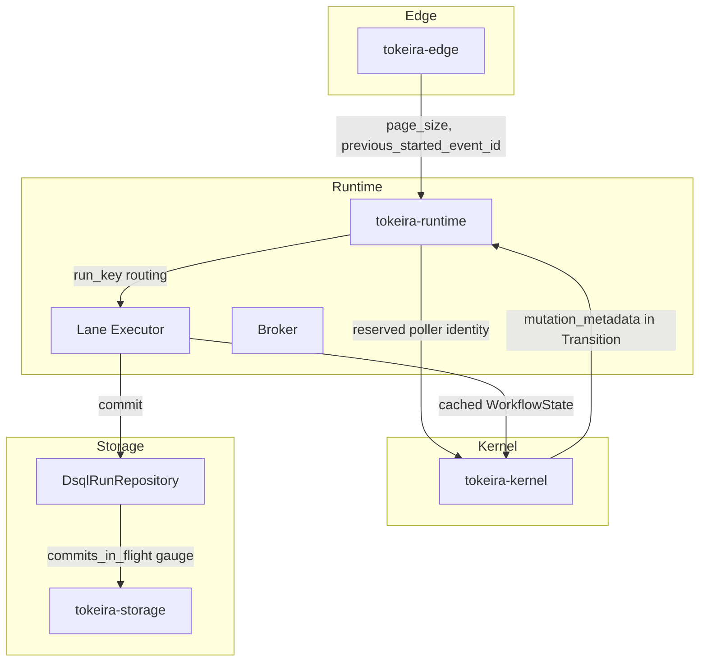

# Design Document: DSQL Throughput Optimization

## Overview

This design addresses a 5-phase performance optimization plan to increase Tokeira's sustained throughput from ~20 wf/s to 130 wf/s on a compose DSQL deployment. The phases are ordered by implementation risk and expected impact:

1. **Fix measurement noise** — add missing metrics so rate calculations are trustworthy.
2. **Remove read amplification** — eliminate unnecessary `load_run` and full-history reads on the hot path.
3. **Reduce commit count** — collapse the echo workflow from 3 commits to 2 via sync-match eager start.
4. **Add lane-local actor residency** — cache hot workflow state to eliminate per-command `load_run`.
5. **Revisit lane routing** — decouple lane partitioning from shard ownership for better parallelism.

The echo workflow pattern (Start → WFT → Complete) is the primary workload. Current bottlenecks:
- Only ~6 concurrent commits active despite 32 lanes and 50 connections (commit concurrency underutilized).
- 3 commits per echo workflow (Start, WFT Started, WFT Completed) — reducible to 2 with sync-match.
- Post-commit `load_run` on StartWorkflow wastes a DSQL read round-trip.
- Full-history reads on non-first WFT polls re-read events the worker already has.
- `shard_id % lane_count` routing concentrates hot shards on single lanes.

## Architecture

The optimization touches four crates across the three architectural planes:



**Key architectural decisions:**

1. The kernel remains pure — the runtime passes only the reserved poller's worker identity in the `StartRequest`, not a broker handle or channel.
2. The lane-local cache is an optimization, not a correctness boundary — storage OCC (`transition_seq`) remains authoritative.
3. Run-key routing preserves per-run serialization while decoupling from shard ownership.
4. History page size flows from edge configuration through runtime to storage as a parameter, not a global setting.

## Components and Interfaces

### Phase 1: Metrics Additions

#### Component: `tokeira-storage/src/metrics.rs`

New metric constant and helper:

```rust
pub const DSQL_COMMITS_IN_FLIGHT: &str = "tokeira_dsql_commits_in_flight";

// Add to METRIC_NAMES array:
(DSQL_COMMITS_IN_FLIGHT, MetricType::Gauge),

pub fn increment_dsql_commits_in_flight() {
    // Process-scoped gauge. Multi-node deployments use Prometheus scrape
    // target labels (for example `instance`) to distinguish nodes.
    gauge!(DSQL_COMMITS_IN_FLIGHT).increment(1.0);
}

pub fn decrement_dsql_commits_in_flight() {
    gauge!(DSQL_COMMITS_IN_FLIGHT).decrement(1.0);
}
```

New histogram for history-read event counts:

```rust
pub const READ_HISTORY_EVENTS: &str = "tokeira_storage_read_history_events";

// Add to METRIC_NAMES array:
(READ_HISTORY_EVENTS, MetricType::Histogram),

pub fn record_read_history_events(count: usize) {
    histogram!(READ_HISTORY_EVENTS).record(count as f64);
}
```

#### Component: `tokeira-storage/src/dsql/run_repository.rs`

Instrument `commit_transition_for_bundle`:

```rust
async fn commit_transition_for_bundle(...) -> Result<CommitResult> {
    metrics::increment_dsql_commits_in_flight();
    let result = self.commit_transition_for_bundle_inner(...).await;
    metrics::decrement_dsql_commits_in_flight();
    result
}
```

Instrument `read_history` to record event count:

```rust
// At the end of read_history, before returning:
metrics::record_read_history_events(events.len());
```

#### Integration Points
- Metrics are registered at process startup via the existing `METRIC_NAMES` manifest.
- Grafana dashboard `storage-projection-health.json` gains a `commits_in_flight` panel.
- The bench harness observes these via Prometheus scrape between runs.

---

### Phase 2: History Page Size Threading

#### Component: `tokeira-edge/src/workflow_service.rs`

The edge already computes `maximum_page_size` for history reads. The change threads this value through to the runtime's history read path instead of using `usize::MAX`.

```rust
// In poll_workflow_task_queue response building:
let page_size = self.config.max_history_page_size; // e.g., 1000
let history = self.repo.read_history(run_key, after_event_id, page_size).await?;
```

#### Component: `tokeira-storage/src/dsql/run_repository.rs`

The `read_history` method already accepts a `limit: usize` parameter. The change ensures callers never pass `usize::MAX`:

```rust
// Default page size when no explicit limit is provided
const DEFAULT_HISTORY_PAGE_SIZE: usize = 1000;
```

No structural change to the storage trait — the interface already supports bounded reads. The fix is in callers that currently pass `usize::MAX`.

---

### Phase 3: Incremental History Reads for Non-First WFTs

#### Component: `tokeira-edge/src/workflow_service.rs`

When building a WFT poll response, use `previous_started_event_id` as the read offset only when the poller is the workflow's sticky worker:

```rust
// In from_internal::poll_response or equivalent:
let after_event_id = if started_task.previous_started_event_id > 0
    && started_task.is_sticky_match
{
    started_task.previous_started_event_id
} else {
    0 // First WFT, cache miss, sticky timeout, or non-sticky poll.
};
let history = repo.read_history(run_key, after_event_id, page_size).await?;
```

Add `is_sticky_match: bool` to `StartedWorkflowTask`. The runtime sets it from the broker's matched task metadata: true only when the matched worker is the current sticky worker for this run.

#### Behavioral Note
- First WFT (previous_started_event_id == 0): full history from event 0.
- Subsequent sticky-match WFTs: partial history from `previous_started_event_id` onward.
- Non-sticky polls, sticky timeout fallback, different-worker polls, and cache-miss fallback: full history from event 0.

---

### Phase 4: StartWorkflowResult Mutation Metadata

#### Component: `tokeira-runtime/src/runtime.rs`

Extend `StartWorkflowResult::Started` to carry metadata from the commit:

```rust
#[derive(Clone, Debug, PartialEq)]
pub enum StartWorkflowResult {
    Started {
        run_key: RunKey,
        run_id: RunId,
        mutation_metadata: Option<MutationMetadata>,
    },
    UsedExisting { run_key: RunKey, run_id: RunId },
    Rejected { run_key: RunKey, run_id: RunId },
}

/// Metadata extracted by the runtime from CommitResult::Applied { new_state },
/// sufficient to build the gRPC response without a post-commit load_run.
#[derive(Clone, Debug, PartialEq)]
pub struct MutationMetadata {
    pub workflow_id: WorkflowId,
    pub run_id: RunId,
    pub first_execution_run_id: Option<RunId>,
    pub transition_seq: TransitionSeq,
    pub last_event_id: i64,
    pub execution_status: ExecutionStatus,
}
```

In `start_workflow_with_policy`, extract metadata from the `CommitResult::Applied`:

```rust
CommitResult::Applied { new_state } => Ok(StartWorkflowResult::Started {
    run_key: request.run_key,
    run_id: request.run_id,
    mutation_metadata: Some(MutationMetadata {
        workflow_id: new_state.workflow_id.clone(),
        run_id: new_state.run_id,
        first_execution_run_id: new_state.first_execution_run_id,
        transition_seq: new_state.transition_seq,
        last_event_id: new_state.last_event_id,
        execution_status: new_state.status,
    }),
}),
```

#### Component: `tokeira-edge/src/workflow_service.rs`

In `start_workflow_execution`, use metadata directly instead of calling `load_run`:

```rust
StartWorkflowResult::Started { run_key, run_id, mutation_metadata } => {
    if let Some(meta) = mutation_metadata {
        // Build response directly from metadata — no load_run needed
        self.notify_history_run_key(run_key, meta.last_event_id).await;
        let response = from_internal::start_response(
            &internal,
            WorkflowMutationOutcome {
                transition_seq: meta.transition_seq.0,
                last_event_id: meta.last_event_id,
                was_duplicate: false,
                execution_status: meta.execution_status,
                new_run_id: None,
            },
        );
        // ... eager execution handling unchanged ...
        Ok(response)
    } else {
        // Fallback: load_run for backward compatibility
        let loaded = self.repo.load_run(run_key).await?;
        // ... existing path ...
    }
}
```

**Impact:** Eliminates one 7.5ms `load_run` per StartWorkflow, saving ~7.5ms on the hot path.

---

### Phase 5: Sync-Match Eager Start

#### Component: `tokeira-runtime/src/broker.rs`

Add an explicit poller reservation contract. This avoids a boolean race where the runtime sees a waiter, commits `WorkflowTaskStarted`, and then the normal poll path tries to start the same task again.

```rust
pub struct ReservedPoller {
    pub queue: QueueKey,
    pub worker_identity: WorkerIdentity,
    response_tx: oneshot::Sender<Result<Option<StartedWorkflowTask>>>,
}

impl InMemoryBroker {
    pub async fn try_reserve_poller(&self, queue: &QueueKey) -> Option<ReservedPoller>;

    pub async fn return_reserved_poller(&self, reserved: ReservedPoller);
}
```

The broker must store waiter records as explicit response channels rather than only a waiter count plus `Notify`. A successful reservation atomically removes one waiter from the queue and transfers ownership of its response channel to the start path. `return_reserved_poller` should drop reservations whose response receiver has already closed.

#### Component: `tokeira-kernel/src/command.rs`

Add reserved-poller metadata to `StartRequest`. The kernel receives only data, not a broker handle:

```rust
pub struct StartRequest {
    // ... existing fields ...

    /// Worker identity reserved by the runtime for sync-match start.
    /// When present, the kernel emits WorkflowTaskStarted in the same
    /// transition as WorkflowExecutionStarted and WorkflowTaskScheduled.
    pub reserved_poller_identity: Option<WorkerIdentity>,
}
```

#### Component: `tokeira-kernel/src/kernel.rs`

Modify `apply_start` to optionally include WFT Started events:

```rust
fn apply_start(&self, loaded: LoadedRun, req: StartRequest) -> Result<Transition, Reject> {
    // ... existing initial state construction and WorkflowExecutionStarted emit ...

    builder.schedule_workflow_task();

    // If the runtime reserved a poller, immediately start the workflow task too.
    if let Some(worker_identity) = req.reserved_poller_identity {
        let pending = builder
            .state
            .pending_workflow_task
            .clone()
            .expect("start schedules the first workflow task before sync-match start");
        let started_event_id = builder.emit(HistoryEventKind::WorkflowTaskStarted {
            logical_seq: pending.logical_seq,
            scheduled_event_id: pending.scheduled_event_id,
            attempt: pending.attempt.max(1),
            identity: worker_identity.clone(),
        });
        if let Some(current) = builder.state.pending_workflow_task.as_mut() {
            current.started_event_id = Some(started_event_id);
            current.started_at = Some(req.now);
            current.attempt = pending.attempt.max(1);
        }
        builder.state.previous_started_event_id = 0; // First WFT
        builder.state.sticky = Some(StickyAffinity {
            worker_identity,
            expires_at: req.now + Duration::seconds(30),
        });
    }

    Ok(builder.finish())
}
```

**Key invariant:** The combined transition is atomic — either all events commit or none do. The runtime suppresses normal broker publication for the already-started WFT and delivers directly to the reserved poller after commit.

The kernel stays pure: it only receives `reserved_poller_identity` and produces history/state. Because `schedule_workflow_task()` still produces `DispatchOp::EnqueueWorkflowTask`, the lane's post-commit dispatch processing must strip the matching workflow-task dispatch op when the committed command is a Start with `reserved_poller_identity.is_some()`. That dispatch op must not reach `publisher.publish(...)`; direct delivery owns the already-started WFT.

#### Component: `tokeira-runtime/src/runtime.rs`

Before submitting the Start command, reserve a poller:

```rust
pub async fn start_workflow(&self, mut request: StartRequest) -> Result<CommitResult> {
    let queue = QueueKey {
        namespace_id: request.namespace_id,
        task_queue: request.task_queue.clone(),
        task_kind: TaskKind::Workflow,
        deployment: request.deployment.clone(),
        build_id: request.build_id.clone(),
    };
    let reserved = self.broker.try_reserve_poller(&queue).await;
    request.reserved_poller_identity = reserved
        .as_ref()
        .map(|poller| poller.worker_identity.clone());

    let result = match self
        .submit(request.run_key, Command::Start(request.clone()))
        .await
    {
        Ok(result) => result,
        Err(error) => {
            if let Some(poller) = reserved {
                self.broker.return_reserved_poller(poller).await;
            }
            return Err(error);
        }
    };

    match (&result, reserved) {
        (CommitResult::Applied { new_state }, Some(poller)) => {
            self.register_reserved_wft_timeout(new_state).await?;
            if let Err(error) = self
                .deliver_started_workflow_task_to_reserved_poller(new_state, poller)
                .await
            {
                tracing::warn!(
                    ?error,
                    run_key = ?request.run_key,
                    "reserved poller disappeared after committed sync-match start"
                );
            }
        }
        (_, Some(poller)) => {
            self.broker.return_reserved_poller(poller).await;
        }
        _ => {}
    }

    Ok(result)
}
```

When the commit succeeds with a reservation, the runtime constructs `StartedWorkflowTask` from the committed `new_state` and sends it on the reserved poller's response channel. It must not call `start_polled_workflow_task` and must not publish the same WFT through the normal ready queue. The reserved-start path must filter the scheduled WFT's `DispatchOp::EnqueueWorkflowTask` from the transition dispatch ops in lane post-commit processing before the lane's generic publisher sees them.

The reserved-start path must also insert `WftTimeoutEntry` from `new_state.pending_workflow_task` immediately after the successful commit and before direct delivery. If the response channel is closed after the commit succeeds, the task is already durably started and already tracked for timeout. The runtime records the delivery failure and returns the successful Start result; it relies on the existing WFT timeout scanner to time out and reschedule rather than attempting a second start or surfacing the delivery failure as a failed StartWorkflow response.

**Impact:** Echo workflow drops from 3 commits to 2 commits when a poller is waiting.

---

### Phase 6: Run-Key Based Lane Routing

Run-key routing must land before lane-local caching. The cache assumes all commands for a run are serialized by the same lane; if scanners or dispatch publisher paths still shard-route, a cached run can be processed concurrently on two lanes.

#### Component: `tokeira-runtime/src/scanner.rs`

Replace the routing function:

```rust
/// Route a run to a lane based on a stable hash domain that differs from
/// shard_for's low-bit modulus. This preserves per-run determinism while
/// allowing same-shard runs to spread across lanes.
pub(crate) fn lane_index_for_run_key(run_key: RunKey, lane_count: usize) -> usize {
    let lane_key = dsql_spread_uuid(&[b"lane", run_key.0.as_bytes()]);
    (lane_key.as_u128() as usize) % lane_count.max(1)
}

/// Legacy shard-based routing — retained only for shard-scoped iteration.
/// Never use this helper for command submission.
pub(crate) fn lane_index_for(shard_id: ShardId, lane_count: usize) -> usize {
    (shard_id.0 as usize) % lane_count.max(1)
}
```

This relies on the stable `dsql_spread_uuid` construction in `crates/tokeira-types/src/spread.rs`, already used for DSQL spread keys. The `b"lane"` domain tag makes lane routing independent from `shard_for`, which uses the raw RunKey low bits. It avoids `DefaultHasher`, whose algorithm is not a stable Rust contract, and prevents the `shard_count = lane_count = 32` case from collapsing same-shard runs back onto one lane.

#### Component: `tokeira-runtime/src/runtime.rs`

Update `pick_lane` to use run_key routing:

```rust
fn pick_lane(&self, run_key: RunKey) -> &LaneHandle {
    let lane_idx = lane_index_for_run_key(run_key, self.lanes.len());
    &self.lanes[lane_idx]
}
```

The `submit` method already calls `self.pick_lane(run_key)` — no change needed there. The shard ownership check remains as the admission boundary (a command is rejected if the node doesn't own the shard), but lane routing is now independent of shard assignment.

Every direct `lane.submit(run_key, ...)` call site must use the same routing helper. This includes timer, workflow-task-timeout, activity-timeout, Nexus-timeout scanner submissions, and `RuntimeDispatchPublisher` submissions for child, external signal/cancel, Nexus, and continue-as-new follow-up commands.

#### Invariants Preserved
- **Per-run serialization:** `dsql_spread_uuid([b"lane", run_key]).as_u128() % lane_count` is deterministic — same run_key always routes to same lane.
- **Shard ownership:** Still checked before lane submission. A command for a run whose shard isn't owned is rejected.
- **Shard-scoped sweeps:** Scanners may iterate shards by shard ID, but command submission from each scanned entry routes by the entry's `run_key`.

**Implementation guard:** add a code comment next to `lane_index_for` and direct lane helpers stating that `lane_index_for(shard_id, ...)` is not valid for command submission. Tests should search or cover all runtime direct-submit paths.

**Impact:** When `lane_count > shard_count` or when a single shard has many active runs, work distributes across more lanes. With 32 shards and 32 lanes, the current routing pins each shard to exactly one lane. Run-key routing distributes runs from the same shard across all 32 lanes.

---

### Phase 7: Lane-Local WorkflowState Cache

#### Component: `tokeira-runtime/src/lane.rs`

New struct for the lane-local cache:

```rust
use std::collections::HashMap;
use std::time::Instant;

/// LRU-evicting cache of WorkflowState for runs actively processing on this lane.
struct LaneCache {
    entries: HashMap<RunKey, CacheEntry>,
    access_order: Vec<RunKey>, // Most-recently-used at the back
    max_entries: usize,
    idle_timeout: std::time::Duration,
}

struct CacheEntry {
    state: WorkflowState,
    last_accessed: Instant,
}

impl LaneCache {
    fn new(max_entries: usize, idle_timeout: std::time::Duration) -> Self {
        Self {
            entries: HashMap::with_capacity(max_entries),
            access_order: Vec::with_capacity(max_entries),
            max_entries,
            idle_timeout,
        }
    }

    /// Get cached state for a run, returning None if absent or expired.
    fn get(&mut self, run_key: RunKey) -> Option<&WorkflowState> {
        let entry = self.entries.get_mut(&run_key)?;
        if entry.last_accessed.elapsed() > self.idle_timeout {
            self.evict(run_key);
            return None;
        }
        entry.last_accessed = Instant::now();
        // Move to back of access_order (LRU)
        self.access_order.retain(|k| *k != run_key);
        self.access_order.push(run_key);
        Some(&entry.state)
    }

    /// Insert or update cached state after a successful commit.
    fn put(&mut self, run_key: RunKey, state: WorkflowState) {
        if self.entries.len() >= self.max_entries && !self.entries.contains_key(&run_key) {
            // Evict LRU entry
            if let Some(lru_key) = self.access_order.first().copied() {
                self.evict(lru_key);
            }
        }
        self.access_order.retain(|k| *k != run_key);
        self.access_order.push(run_key);
        self.entries.insert(run_key, CacheEntry {
            state,
            last_accessed: Instant::now(),
        });
    }

    /// Evict a specific entry (OCC conflict or idle timeout).
    fn evict(&mut self, run_key: RunKey) {
        self.entries.remove(&run_key);
        self.access_order.retain(|k| *k != run_key);
    }

    /// Evict all entries (lane shutdown).
    fn clear(&mut self) {
        self.entries.clear();
        self.access_order.clear();
    }
}
```

#### Modified `handle_message` flow:

```rust
async fn handle_message<K, R>(
    kernel: &K,
    repo: &R,
    cache: &mut LaneCache,  // New parameter
    // ... other params ...
) -> Result<(CommitResult, SmallVec<[DispatchOp; 4]>, SmallVec<[HistoryEvent; 8]>)> {
    let mut attempts = 0u32;
    loop {
        // Try cache first, fall back to storage
        let loaded = if let Some(cached_state) = cache.get(run_key) {
            LoadedRun::Existing(cached_state.clone())
        } else {
            repo.load_run(run_key).await?
        };

        let transition = kernel.apply(loaded, command.clone())
            .map_err(|reject| anyhow!("kernel rejected command: {reject}"))?;

        // ... epoch resolution unchanged ...

        match repo.commit_transition_for_bundle(run_key, bundle, transition, epoch).await? {
            CommitResult::Applied { new_state } => {
                // Update cache with post-commit state
                cache.put(run_key, new_state.clone());
                return Ok((CommitResult::Applied { new_state }, dispatch_ops, history_events));
            }
            CommitResult::Conflict { reason } => {
                // OCC conflict: evict stale cache entry and retry from storage
                cache.evict(run_key);
                attempts += 1;
                if attempts >= max_retries {
                    return Err(anyhow!("OCC conflict after {attempts} retries: {reason}"));
                }
                // Next iteration will load from storage since cache was evicted
                continue;
            }
            CommitResult::Duplicate => {
                return Ok((CommitResult::Duplicate, SmallVec::new(), SmallVec::new()));
            }
        }
    }
}
```

#### Configuration: `LaneConfig`

```rust
pub struct LaneConfig {
    // ... existing fields ...

    /// Maximum number of WorkflowState entries cached per lane.
    /// Default: 1024.
    pub cache_max_entries: usize,

    /// Idle timeout after which a cached entry is evicted.
    /// Default: 30 seconds.
    pub cache_idle_timeout: std::time::Duration,
}
```

**Impact:** Eliminates 7.5ms `load_run` for runs that are actively processing (echo workflow hits cache on WFT Completed after WFT Started cached the state).

---

## Data Models

### WorkflowState (unchanged)

The `WorkflowState` struct in `tokeira-kernel/src/state.rs` is not modified. The cache stores it as-is.

### MutationMetadata (new)

```rust
/// Metadata extracted from CommitResult::Applied for the Start path.
/// Lives in tokeira-runtime/src/runtime.rs.
#[derive(Clone, Debug, PartialEq)]
pub struct MutationMetadata {
    pub workflow_id: WorkflowId,
    pub run_id: RunId,
    pub first_execution_run_id: Option<RunId>,
    pub transition_seq: TransitionSeq,
    pub last_event_id: i64,
    pub execution_status: ExecutionStatus,
}
```

### LaneCache (new)

```rust
/// Per-lane in-memory cache. Lives in tokeira-runtime/src/lane.rs.
/// Not serialized — purely ephemeral optimization.
struct LaneCache {
    entries: HashMap<RunKey, CacheEntry>,
    access_order: Vec<RunKey>,
    max_entries: usize,
    idle_timeout: std::time::Duration,
}

struct CacheEntry {
    state: WorkflowState,
    last_accessed: Instant,
}
```

### StartRequest (extended)

```rust
/// In tokeira-kernel/src/command.rs — new field:
pub struct StartRequest {
    // ... existing 30+ fields ...
    pub reserved_poller_identity: Option<WorkerIdentity>,
}
```


## Correctness Properties

*A property is a characteristic or behavior that should hold true across all valid executions of a system — essentially, a formal statement about what the system should do. Properties serve as the bridge between human-readable specifications and machine-verifiable correctness guarantees.*

### Property 1: Commits-in-flight gauge accuracy

*For any* sequence of concurrent commit operations (starts and completions interleaved in any order), the `tokeira_dsql_commits_in_flight` gauge SHALL always equal the number of currently-in-flight commit operations.

**Validates: Requirements 2.3**

### Property 2: Read-history event count histogram accuracy

*For any* call to `read_history` that returns N events, the `tokeira_storage_read_history_events` histogram SHALL record exactly N as the observation value.

**Validates: Requirements 3.2**

### Property 3: Read-history respects page size limit

*For any* history of any length and any finite `maximum_page_size` limit, `read_history` SHALL return at most `maximum_page_size` events.

**Validates: Requirements 4.4**

### Property 4: Partial history reads from previous_started_event_id

*For any* WFT poll response where `previous_started_event_id > 0` and `is_sticky_match` is true, all events in the returned history SHALL have `event_id > previous_started_event_id`. For any response where `is_sticky_match` is false, the history SHALL start from event 0.

**Validates: Requirements 5.1, 5.3**

### Property 5: Start transition produces metadata fields

*For any* valid `StartRequest` applied to an absent run, the resulting `Transition.next_state` SHALL contain the `workflow_id`, `run_id`, and `first_execution_run_id` from the request.

**Validates: Requirements 6.1**

### Property 6: Sync-match combined transition events

*For any* valid `StartRequest` with `reserved_poller_identity = Some(worker)` applied to an absent run, the resulting transition SHALL contain `WorkflowExecutionStarted`, `WorkflowTaskScheduled`, and `WorkflowTaskStarted` events, and `WorkflowTaskStarted.identity` SHALL equal `worker`.

**Validates: Requirements 7.1, 7.3**

### Property 7: No WFT Started without sync-match

*For any* valid `StartRequest` with `reserved_poller_identity = None` applied to an absent run, the resulting transition SHALL NOT contain a `WorkflowTaskStarted` event.

**Validates: Requirements 7.4**

### Property 8: Cache round-trip — commit populates, next command uses cache

*For any* run where a command commits successfully, the resulting `WorkflowState` SHALL be cached, and a subsequent command for the same `RunKey` SHALL use the cached state without calling `load_run`.

**Validates: Requirements 8.1, 8.2**

### Property 9: OCC conflict evicts cache

*For any* cached `RunKey` where a commit returns `CommitResult::Conflict`, the cache entry for that `RunKey` SHALL be evicted, and the next attempt SHALL load from storage.

**Validates: Requirements 8.4**

### Property 10: Idle timeout eviction

*For any* cached entry whose `last_accessed` time exceeds the configured `cache_idle_timeout`, a subsequent `get` for that `RunKey` SHALL return `None` (cache miss).

**Validates: Requirements 8.5**

### Property 11: LRU bounded cache size

*For any* sequence of cache insertions, the cache size SHALL never exceed `max_entries`. When the limit is reached, the least-recently-used entry SHALL be evicted.

**Validates: Requirements 8.7**

### Property 12: Deterministic run-key lane routing

*For any* `RunKey` and `lane_count`, `lane_index_for_run_key(run_key, lane_count)` SHALL always return the same value, and the result SHALL be in `[0, lane_count)`.

**Validates: Requirements 9.1, 9.2**

### Property 13: Same-shard runs distribute across lanes

Generate or fixture 1000 distinct `RunKey`s that map to the same `shard_id` and assert that at least two distinct lane indices appear when routed by `lane_index_for_run_key`.

**Validates: Requirements 9.3, 9.6**

### Property 14: All lanes reachable when lane_count exceeds shard_count

Using a fixed deterministic seed, generate 10,000 random `RunKey`s with `lane_count = 64` and `shard_count = 32`, then assert that every lane index in `[0, 64)` appears at least once.

**Validates: Requirements 9.5**

---

## Error Handling

### OCC Conflicts (Commit Path)

- **Current behavior:** Lane retries up to `max_occ_retries` (default 3) with reload from storage.
- **With cache:** On OCC conflict, the cache entry is evicted before retry. The retry loads from storage, ensuring the kernel sees the authoritative state.
- **Metric:** `tokeira_runtime_occ_retry_total` counter incremented on each retry.

### Cache Staleness

The cache is never a correctness boundary. If the cache holds a stale `WorkflowState` (e.g., due to a bug or race), the commit will fail with an OCC conflict because `transition.expected_seq` won't match the durable `transition_seq`. The conflict handler evicts the cache and retries from storage.

### Sync-Match Reservation Failure

The runtime reserves a specific poller before submitting the Start command. This creates two safe outcomes:
- If the Start commit succeeds, the runtime sends the already-started WFT directly to the reserved poller's response channel.
- If the Start commit fails, the runtime returns the reservation to the broker so the poller can continue waiting.

The normal broker-ready path is bypassed for the combined transition, because the WFT is already started and must not pass through `start_polled_workflow_task` a second time.

### Lane Shutdown

On lane drain (graceful shutdown), the cache is cleared without persisting. This is safe because:
- The cache is derived from committed state — storage already has the authoritative version.
- In-flight commands complete before drain; their results are committed to storage.

### Metric Initialization

All metrics are registered at process startup via the `METRIC_NAMES` manifest. Counters start at 0, gauges at 0, histograms empty. No carry-forward between process lifetimes.

---

## Testing Strategy

### Unit Tests

- **Metrics helpers:** Verify `increment_dsql_commits_in_flight` / `decrement_dsql_commits_in_flight` emit correct gauge values using `DebuggingRecorder`.
- **`read_history` limit:** Verify the storage layer respects the limit parameter with various history sizes.
- **`MutationMetadata` extraction:** Verify `start_workflow_with_policy` populates metadata from `CommitResult::Applied`.
- **Kernel `apply_start` with reserved poller identity:** Verify event types and worker identity in the transition for both reserved and unreserved cases.
- **`LaneCache` operations:** Verify get/put/evict/clear/LRU behavior with concrete examples.
- **`lane_index_for_run_key`:** Verify determinism, range, and distribution properties.

### Property-Based Tests (proptest)

Property-based testing is appropriate here because:
- The kernel is a pure function with clear input/output behavior.
- The cache has universal invariants (size bounds, LRU ordering, eviction rules).
- The routing function has universal properties (determinism, range, distribution).

**Configuration:** Minimum 100 iterations per property test. Each test references its design property.

**Library:** `proptest` (already used in the workspace).

| Property | Test Location | Generator |
|----------|--------------|-----------|
| Property 3 (page limit) | `tokeira-storage/src/dsql/` | Random `Vec<HistoryEvent>` + random `limit: 1..1000` |
| Property 4 (partial history) | `tokeira-edge/tests/` | Random event sequences + random `previous_started_event_id` |
| Property 5 (metadata fields) | `tokeira-kernel/src/kernel.rs` | Random `StartRequest` via proptest `Arbitrary` |
| Property 6 (combined transition) | `tokeira-kernel/src/kernel.rs` | Random `StartRequest` with `reserved_poller_identity=Some(worker)` |
| Property 7 (no WFT Started) | `tokeira-kernel/src/kernel.rs` | Random `StartRequest` with `reserved_poller_identity=None` |
| Property 8 (cache round-trip) | `tokeira-runtime/src/lane.rs` | Random `RunKey` + random `WorkflowState` |
| Property 9 (OCC eviction) | `tokeira-runtime/src/lane.rs` | Random cached entries + simulated conflicts |
| Property 10 (idle eviction) | `tokeira-runtime/src/lane.rs` | Random entries with varying ages |
| Property 11 (LRU bounds) | `tokeira-runtime/src/lane.rs` | Random insertion sequences exceeding max_entries |
| Property 12 (routing determinism) | `tokeira-runtime/src/scanner.rs` | Random `RunKey` + random `lane_count: 1..128` |
| Property 13 (shard distribution) | `tokeira-runtime/src/scanner.rs` | 1000 deterministic same-shard run keys |
| Property 14 (all lanes reachable) | `tokeira-runtime/src/scanner.rs` | Fixed-seed 10,000 run keys, `lane_count = 64` |

**Tag format:** `Feature: dsql-throughput-optimization, Property {N}: {title}`

### Integration Tests

- **Echo workflow commit count:** End-to-end test verifying 2 commits with sync-match vs 3 without.
- **Metrics per bench run:** Verify all required metrics are present and start at zero after restart.
- **Page size threading:** Verify edge → runtime → storage page_size flow with a real in-memory store.
- **StartWorkflow without load_run:** Verify the edge builds a response from metadata without calling `load_run` (mock repo that panics on `load_run`).

### Benchmark Validation

The `tokeira-bench` binary validates the 130 wf/s target:
```bash
cargo run -p tokeira-bench -- --workflows 1000 --concurrency 150
```

Success criteria: 130 wf/s sustained, sub-200ms p50 latency, 2 commits per echo workflow with sync-match.
